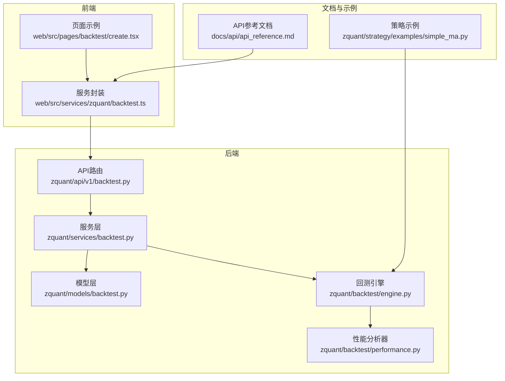
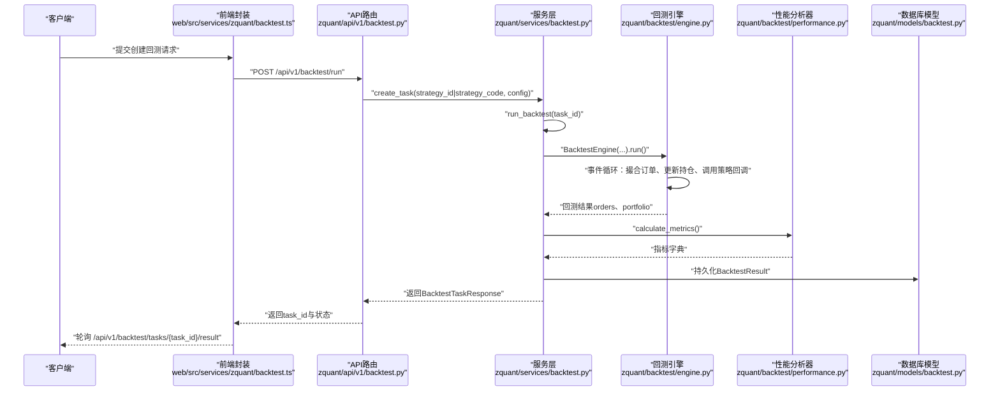
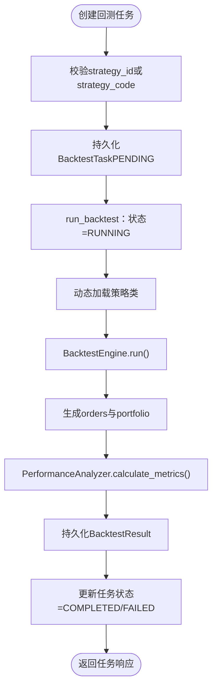
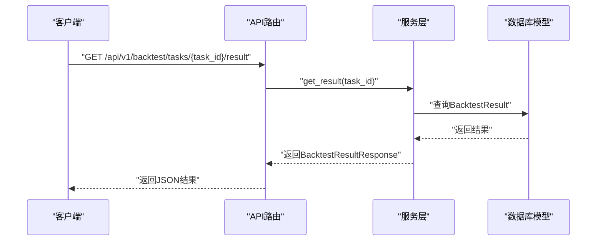
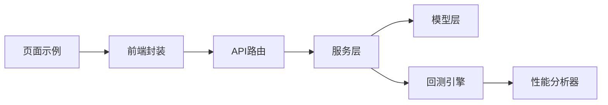

# 回测管理API

<cite>
**本文引用的文件**
- [zquant/api/v1/backtest.py](file://zquant/api/v1/backtest.py)
- [zquant/services/backtest.py](file://zquant/services/backtest.py)
- [zquant/schemas/backtest.py](file://zquant/schemas/backtest.py)
- [zquant/models/backtest.py](file://zquant/models/backtest.py)
- [zquant/backtest/engine.py](file://zquant/backtest/engine.py)
- [zquant/backtest/performance.py](file://zquant/backtest/performance.py)
- [web/src/services/zquant/backtest.ts](file://web/src/services/zquant/backtest.ts)
- [web/src/pages/backtest/create.tsx](file://web/src/pages/backtest/create.tsx)
- [docs/api/api_reference.md](file://docs/api/api_reference.md)
- [zquant/strategy/examples/simple_ma.py](file://zquant/strategy/examples/simple_ma.py)
</cite>

## 目录
1. [简介](#简介)
2. [项目结构](#项目结构)
3. [核心组件](#核心组件)
4. [架构总览](#架构总览)
5. [详细组件分析](#详细组件分析)
6. [依赖分析](#依赖分析)
7. [性能与并发特性](#性能与并发特性)
8. [故障排查指南](#故障排查指南)
9. [结论](#结论)
10. [附录：API参考与字段说明](#附录api参考与字段说明)

## 简介
本文件面向回测管理API的使用者与集成者，系统性阐述“创建回测任务、查询结果、管理策略”等核心能力，并重点解释运行回测时strategy_code与config参数的结构与传递方式；说明回测任务的异步执行模型与task_id轮询机制；提供回测结果JSON响应示例及关键字段（如total_return、sharpe_ratio、trades、daily_positions）的含义与用途，帮助开发者快速集成绩效分析功能。

## 项目结构
回测相关的核心代码分布在后端API层、服务层、模型层、回测引擎与性能分析器，前端提供调用封装与页面示例。

图表来源
- [zquant/api/v1/backtest.py](file://zquant/api/v1/backtest.py#L1-L120)
- [zquant/services/backtest.py](file://zquant/services/backtest.py#L1-L120)
- [zquant/models/backtest.py](file://zquant/models/backtest.py#L1-L119)
- [zquant/backtest/engine.py](file://zquant/backtest/engine.py#L1-L120)
- [zquant/backtest/performance.py](file://zquant/backtest/performance.py#L1-L120)
- [web/src/services/zquant/backtest.ts](file://web/src/services/zquant/backtest.ts#L1-L104)
- [web/src/pages/backtest/create.tsx](file://web/src/pages/backtest/create.tsx#L1-L120)
- [docs/api/api_reference.md](file://docs/api/api_reference.md#L305-L368)
- [zquant/strategy/examples/simple_ma.py](file://zquant/strategy/examples/simple_ma.py#L1-L59)

章节来源
- [zquant/api/v1/backtest.py](file://zquant/api/v1/backtest.py#L1-L120)
- [zquant/services/backtest.py](file://zquant/services/backtest.py#L1-L120)
- [web/src/services/zquant/backtest.ts](file://web/src/services/zquant/backtest.ts#L1-L104)

## 核心组件
- API路由层：提供运行回测、查询任务、查询结果、查询绩效、策略管理等接口。
- 服务层：负责任务创建、回测执行、结果持久化与查询、策略管理。
- 模型层：定义回测任务、结果、策略的数据库表结构与状态枚举。
- 回测引擎：加载策略代码、驱动回测事件循环、撮合订单、更新投资组合。
- 性能分析器：基于引擎输出计算指标（总收益、年化、最大回撤、夏普比率、胜率、盈亏比等）。
- 前端封装：统一调用后端API，提供策略框架模板加载、模板策略选择、表单提交等。

章节来源
- [zquant/api/v1/backtest.py](file://zquant/api/v1/backtest.py#L90-L173)
- [zquant/services/backtest.py](file://zquant/services/backtest.py#L43-L178)
- [zquant/models/backtest.py](file://zquant/models/backtest.py#L38-L119)
- [zquant/backtest/engine.py](file://zquant/backtest/engine.py#L41-L120)
- [zquant/backtest/performance.py](file://zquant/backtest/performance.py#L36-L120)
- [web/src/services/zquant/backtest.ts](file://web/src/services/zquant/backtest.ts#L1-L104)

## 架构总览
回测流程从API入口开始，经服务层创建任务并触发回测执行，引擎驱动策略回调与订单撮合，性能分析器计算指标并持久化结果，前端通过task_id轮询获取结果。

图表来源
- [zquant/api/v1/backtest.py](file://zquant/api/v1/backtest.py#L90-L173)
- [zquant/services/backtest.py](file://zquant/services/backtest.py#L100-L178)
- [zquant/backtest/engine.py](file://zquant/backtest/engine.py#L405-L498)
- [zquant/backtest/performance.py](file://zquant/backtest/performance.py#L50-L120)
- [zquant/models/backtest.py](file://zquant/models/backtest.py#L92-L119)
- [web/src/services/zquant/backtest.ts](file://web/src/services/zquant/backtest.ts#L1-L104)

## 详细组件分析

### 1) 回测任务创建与运行
- 接口：POST /api/v1/backtest/run
- 请求体：BacktestRunRequest
  - strategy_id：可选，从策略库选择策略
  - strategy_code：可选，Python策略代码字符串（当strategy_id为空时必填）
  - strategy_name：策略名称
  - config：BacktestConfig
- 服务层：
  - create_task：校验参数，持久化任务，状态为PENDING
  - run_backtest：更新状态为RUNNING，动态加载策略类，创建引擎并执行，计算指标，持久化结果，更新任务状态为COMPLETED或FAILED
- 引擎：
  - BacktestEngine：加载价格与每日指标数据，按交易日历推进，撮合订单，调用策略on_bar回调，记录orders与portfolio

图表来源
- [zquant/services/backtest.py](file://zquant/services/backtest.py#L43-L178)
- [zquant/backtest/engine.py](file://zquant/backtest/engine.py#L405-L498)
- [zquant/backtest/performance.py](file://zquant/backtest/performance.py#L50-L120)
- [zquant/models/backtest.py](file://zquant/models/backtest.py#L48-L119)

章节来源
- [zquant/api/v1/backtest.py](file://zquant/api/v1/backtest.py#L90-L121)
- [zquant/services/backtest.py](file://zquant/services/backtest.py#L43-L178)
- [zquant/backtest/engine.py](file://zquant/backtest/engine.py#L1-L120)

### 2) 回测任务查询与结果获取
- 获取任务列表：GET /api/v1/backtest/tasks
- 获取任务详情：GET /api/v1/backtest/tasks/{task_id}
- 获取回测结果：GET /api/v1/backtest/tasks/{task_id}/result
- 获取绩效报告：GET /api/v1/backtest/tasks/{task_id}/performance（包含metrics、trades、portfolio）

图表来源
- [zquant/api/v1/backtest.py](file://zquant/api/v1/backtest.py#L148-L173)
- [zquant/services/backtest.py](file://zquant/services/backtest.py#L215-L234)
- [zquant/models/backtest.py](file://zquant/models/backtest.py#L92-L119)

章节来源
- [zquant/api/v1/backtest.py](file://zquant/api/v1/backtest.py#L123-L173)
- [zquant/services/backtest.py](file://zquant/services/backtest.py#L215-L234)

### 3) 策略管理API
- 获取策略框架代码：GET /api/v1/backtest/strategies/framework
- 创建策略：POST /api/v1/backtest/strategies
- 获取策略列表：GET /api/v1/backtest/strategies
- 获取策略详情：GET /api/v1/backtest/strategies/{strategy_id}
- 更新策略：PUT /api/v1/backtest/strategies/{strategy_id}
- 删除策略：DELETE /api/v1/backtest/strategies/{strategy_id}

章节来源
- [zquant/api/v1/backtest.py](file://zquant/api/v1/backtest.py#L175-L395)

### 4) 回测结果JSON与关键字段解析
- BacktestResultResponse字段：
  - total_return：累计收益率
  - annual_return：年化收益率
  - max_drawdown：最大回撤
  - sharpe_ratio：夏普比率
  - win_rate：胜率
  - profit_loss_ratio：盈亏比
  - metrics_json：详细指标JSON
  - trades_json：交易记录JSON（orders）
  - portfolio_json：投资组合JSON（每日持仓变化）
- PerformanceResponse字段：
  - metrics：指标字典
  - trades：交易记录数组
  - portfolio：投资组合结构

章节来源
- [zquant/schemas/backtest.py](file://zquant/schemas/backtest.py#L77-L106)
- [zquant/services/backtest.py](file://zquant/services/backtest.py#L124-L161)

### 5) Python策略代码传递与执行
- strategy_code参数：以字符串形式传入Python策略代码，服务层动态加载策略类（假设类名为Strategy），然后由引擎实例化并驱动回测。
- 策略示例：simple_ma.py展示如何使用Context进行下单、目标市值下单、获取每日指标等。

章节来源
- [zquant/services/backtest.py](file://zquant/services/backtest.py#L163-L178)
- [zquant/backtest/engine.py](file://zquant/backtest/engine.py#L412-L455)
- [zquant/strategy/examples/simple_ma.py](file://zquant/strategy/examples/simple_ma.py#L1-L59)

### 6) 异步执行模型与task_id轮询
- 当前实现：API层在创建任务后，直接同步调用run_backtest，生产环境建议改为异步队列（如Celery）后台执行。
- 前端轮询：前端通过task_id定期调用“获取回测结果”接口，直至任务完成或失败。

章节来源
- [zquant/api/v1/backtest.py](file://zquant/api/v1/backtest.py#L106-L116)
- [web/src/services/zquant/backtest.ts](file://web/src/services/zquant/backtest.ts#L61-L81)

## 依赖分析
- API路由依赖服务层与数据库模型
- 服务层依赖回测引擎与性能分析器
- 引擎依赖数据仓库与成本计算器
- 前端依赖API封装与页面组件

图表来源
- [zquant/api/v1/backtest.py](file://zquant/api/v1/backtest.py#L1-L120)
- [zquant/services/backtest.py](file://zquant/services/backtest.py#L1-L120)
- [zquant/backtest/engine.py](file://zquant/backtest/engine.py#L1-L120)
- [zquant/backtest/performance.py](file://zquant/backtest/performance.py#L1-L120)
- [web/src/services/zquant/backtest.ts](file://web/src/services/zquant/backtest.ts#L1-L104)
- [web/src/pages/backtest/create.tsx](file://web/src/pages/backtest/create.tsx#L1-L120)

章节来源
- [zquant/api/v1/backtest.py](file://zquant/api/v1/backtest.py#L1-L120)
- [zquant/services/backtest.py](file://zquant/services/backtest.py#L1-L120)

## 性能与并发特性
- 引擎采用事件循环按交易日推进，撮合订单延迟至T+1，模拟真实市场行为。
- 性能分析器基于每日净值序列计算指标，支持可选基准对比。
- 当前API层为同步执行，建议在生产环境引入异步任务队列以提升吞吐与稳定性。

章节来源
- [zquant/backtest/engine.py](file://zquant/backtest/engine.py#L405-L498)
- [zquant/backtest/performance.py](file://zquant/backtest/performance.py#L50-L120)
- [zquant/api/v1/backtest.py](file://zquant/api/v1/backtest.py#L106-L116)

## 故障排查指南
- 任务状态异常
  - 现象：任务长时间处于PENDING或RUNNING
  - 排查：确认服务层run_backtest是否被正确触发；检查数据库任务状态更新逻辑
- 策略加载失败
  - 现象：提示未定义Strategy类
  - 排查：确认strategy_code中包含名为Strategy的类定义
- 回测结果缺失
  - 现象：查询结果为空
  - 排查：确认BacktestResult是否已持久化；核对task_id归属当前用户
- 前端轮询无响应
  - 现象：轮询接口返回404或无数据
  - 排查：确认task_id有效且属于当前用户；检查API路由与服务层查询逻辑

章节来源
- [zquant/services/backtest.py](file://zquant/services/backtest.py#L100-L178)
- [zquant/api/v1/backtest.py](file://zquant/api/v1/backtest.py#L137-L173)

## 结论
回测管理API提供了从策略提交、任务创建、回测执行到结果查询的完整链路。通过清晰的参数结构（strategy_code与config）、明确的状态流转与结果模型，开发者可快速集成回测与绩效分析能力。建议在生产环境中引入异步任务队列以提升系统吞吐与用户体验。

## 附录：API参考与字段说明

### A. 回测任务创建（POST /api/v1/backtest/run）
- 请求体：BacktestRunRequest
  - strategy_id：策略ID（可选）
  - strategy_code：Python策略代码字符串（当strategy_id为空时必填）
  - strategy_name：策略名称
  - config：BacktestConfig
    - start_date：开始日期
    - end_date：结束日期
    - initial_capital：初始资金
    - symbols：股票代码列表
    - frequency：频率（默认daily）
    - adjust_type：复权类型（qfq/hfq/None）
    - commission_rate：佣金率
    - min_commission：最低佣金
    - tax_rate：印花税率
    - slippage_rate：滑点率
    - benchmark：基准指数代码
    - use_daily_basic：是否使用每日指标数据
- 响应：BacktestTaskResponse
  - id、user_id、strategy_name、status、error_message、created_at、started_at、completed_at、start_date、end_date

章节来源
- [zquant/schemas/backtest.py](file://zquant/schemas/backtest.py#L33-L76)
- [zquant/api/v1/backtest.py](file://zquant/api/v1/backtest.py#L90-L121)

### B. 回测结果查询（GET /api/v1/backtest/tasks/{task_id}/result）
- 响应：BacktestResultResponse
  - id、task_id、total_return、annual_return、max_drawdown、sharpe_ratio、win_rate、profit_loss_ratio、metrics_json、trades_json、portfolio_json、created_at

章节来源
- [zquant/schemas/backtest.py](file://zquant/schemas/backtest.py#L77-L106)
- [zquant/api/v1/backtest.py](file://zquant/api/v1/backtest.py#L148-L157)

### C. 绩效报告（GET /api/v1/backtest/tasks/{task_id}/performance）
- 响应：PerformanceResponse
  - metrics：指标字典
  - trades：交易记录数组
  - portfolio：投资组合结构

章节来源
- [zquant/schemas/backtest.py](file://zquant/schemas/backtest.py#L99-L106)
- [zquant/api/v1/backtest.py](file://zquant/api/v1/backtest.py#L159-L173)

### D. 关键字段含义与用途
- total_return：累计收益率，衡量整体回报
- annual_return：年化收益率，便于跨周期比较
- max_drawdown：最大回撤，评估下行风险
- sharpe_ratio：夏普比率，衡量单位风险的超额收益
- win_rate：胜率，衡量交易成功率
- profit_loss_ratio：盈亏比，衡量平均盈利与平均亏损的比例
- trades：交易明细，包含订单ID、标的、方向、数量、成交价、手续费、成交日期等
- portfolio：每日投资组合，包含现金、持仓数量、均价、当前价、市值、盈亏等

章节来源
- [zquant/backtest/performance.py](file://zquant/backtest/performance.py#L50-L120)
- [zquant/backtest/engine.py](file://zquant/backtest/engine.py#L456-L498)

### E. 前端调用与轮询
- 前端封装：runBacktest、getBacktestTasks、getBacktestTask、getBacktestResult、getPerformance、getStrategyFramework
- 页面示例：create.tsx提供策略框架加载、模板策略选择、表单提交与股票列表加载

章节来源
- [web/src/services/zquant/backtest.ts](file://web/src/services/zquant/backtest.ts#L1-L104)
- [web/src/pages/backtest/create.tsx](file://web/src/pages/backtest/create.tsx#L1-L120)

### F. API参考文档摘录
- 回测接口与示例响应参见API参考文档

章节来源
- [docs/api/api_reference.md](file://docs/api/api_reference.md#L305-L368)