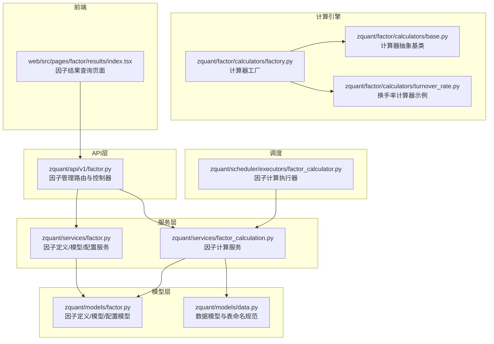
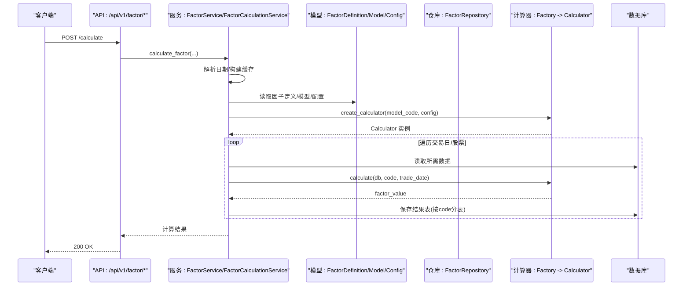
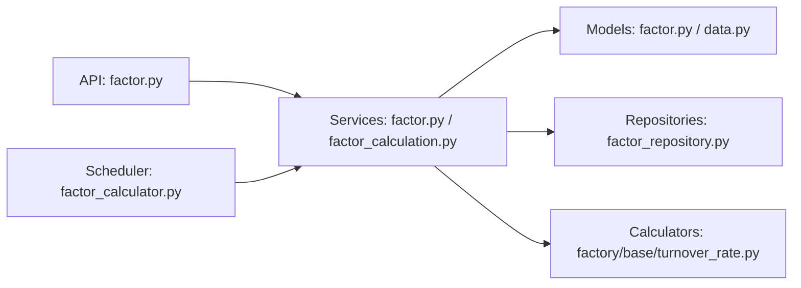
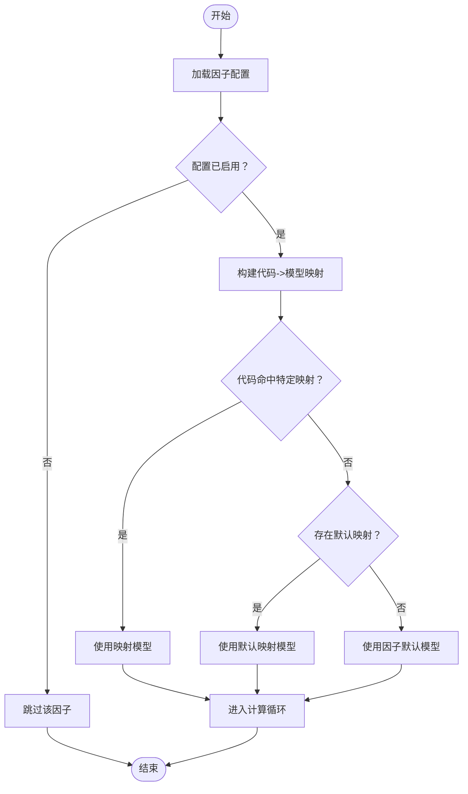

# 因子管理API

<cite>
**本文引用的文件**
- [zquant/api/v1/factor.py](file://zquant/api/v1/factor.py)
- [zquant/schemas/factor.py](file://zquant/schemas/factor.py)
- [zquant/services/factor.py](file://zquant/services/factor.py)
- [zquant/services/factor_calculation.py](file://zquant/services/factor_calculation.py)
- [zquant/repositories/factor_repository.py](file://zquant/repositories/factor_repository.py)
- [zquant/models/factor.py](file://zquant/models/factor.py)
- [zquant/factor/calculators/base.py](file://zquant/factor/calculators/base.py)
- [zquant/factor/calculators/factory.py](file://zquant/factor/calculators/factory.py)
- [zquant/factor/calculators/turnover_rate.py](file://zquant/factor/calculators/turnover_rate.py)
- [zquant/scheduler/executors/factor_calculator.py](file://zquant/scheduler/executors/factor_calculator.py)
- [zquant/constants/factor_constants.py](file://zquant/constants/factor_constants.py)
- [zquant/models/data.py](file://zquant/models/data.py)
- [web/src/pages/factor/results/index.tsx](file://web/src/pages/factor/results/index.tsx)
</cite>

## 目录
1. [简介](#简介)
2. [项目结构](#项目结构)
3. [核心组件](#核心组件)
4. [架构总览](#架构总览)
5. [详细组件分析](#详细组件分析)
6. [依赖分析](#依赖分析)
7. [性能考虑](#性能考虑)
8. [故障排查指南](#故障排查指南)
9. [结论](#结论)
10. [附录](#附录)

## 简介
本文件系统化梳理 zquant 项目中“因子管理API”的设计与实现，覆盖因子定义、因子模型、因子配置、因子计算与结果查询的全流程。重点说明：
- 因子定义字段（factor_name、cn_name 等）的语义与约束
- 因子配置启用/禁用与标的映射（mappings）的结构与规则
- 异步触发因子计算的方式（定时任务执行器）
- 通过 GET /factor/data 查询计算结果的机制，并关联 zquant/factor/ 目录下的计算引擎

## 项目结构
围绕因子管理API的关键模块分布如下：
- API 层：提供 RESTful 接口，负责参数校验、鉴权与响应封装
- 服务层：封装业务逻辑，协调模型与仓库
- 模型层：定义数据库表结构与配置序列化
- 计算引擎：基于工厂模式的计算器体系，按模型代码选择具体实现
- 定时调度：通过执行器异步触发计算任务

图表来源
- [zquant/api/v1/factor.py](file://zquant/api/v1/factor.py#L1-L816)
- [zquant/services/factor.py](file://zquant/services/factor.py#L1-L766)
- [zquant/services/factor_calculation.py](file://zquant/services/factor_calculation.py#L1-L1067)
- [zquant/models/factor.py](file://zquant/models/factor.py#L1-L267)
- [zquant/models/data.py](file://zquant/models/data.py#L1-L200)
- [zquant/factor/calculators/base.py](file://zquant/factor/calculators/base.py#L1-L82)
- [zquant/factor/calculators/factory.py](file://zquant/factor/calculators/factory.py#L1-L90)
- [zquant/factor/calculators/turnover_rate.py](file://zquant/factor/calculators/turnover_rate.py#L1-L188)
- [zquant/scheduler/executors/factor_calculator.py](file://zquant/scheduler/executors/factor_calculator.py#L1-L123)
- [web/src/pages/factor/results/index.tsx](file://web/src/pages/factor/results/index.tsx#L1-L168)

章节来源
- [zquant/api/v1/factor.py](file://zquant/api/v1/factor.py#L1-L816)
- [zquant/services/factor.py](file://zquant/services/factor.py#L1-L766)
- [zquant/services/factor_calculation.py](file://zquant/services/factor_calculation.py#L1-L1067)
- [zquant/models/factor.py](file://zquant/models/factor.py#L1-L267)
- [zquant/models/data.py](file://zquant/models/data.py#L1-L200)
- [zquant/factor/calculators/base.py](file://zquant/factor/calculators/base.py#L1-L82)
- [zquant/factor/calculators/factory.py](file://zquant/factor/calculators/factory.py#L1-L90)
- [zquant/factor/calculators/turnover_rate.py](file://zquant/factor/calculators/turnover_rate.py#L1-L188)
- [zquant/scheduler/executors/factor_calculator.py](file://zquant/scheduler/executors/factor_calculator.py#L1-L123)
- [web/src/pages/factor/results/index.tsx](file://web/src/pages/factor/results/index.tsx#L1-L168)

## 核心组件
- 因子定义（FactorDefinition）
  - 字段：factor_name（唯一）、cn_name、en_name、column_name（因子表列名）、description、enabled、created_at、updated_at
  - 配置：factor_config（JSON字典，包含 enabled 与 mappings）
- 因子模型（FactorModel）
  - 字段：factor_id、model_name、model_code（用于识别计算器类型）、config_json、is_default、enabled
- 因子配置（FactorConfig）
  - 字段：factor_id（主键）、config_json（JSON字典，包含 enabled 与 mappings）、enabled、created_by、updated_by
  - mappings：[{model_id, codes}]，其中 codes 为 None 或空列表表示默认配置
- 计算器工厂（Calculator Factory）
  - 通过 model_code 选择具体计算器类，支持配置校验与注册
- 计算服务（FactorCalculationService）
  - 日期参数处理、表结构保证、批量计算、结果持久化
- 结果查询（FactorRepository）
  - 按股票代码与日期范围查询因子结果表（动态表名）

章节来源
- [zquant/schemas/factor.py](file://zquant/schemas/factor.py#L1-L345)
- [zquant/models/factor.py](file://zquant/models/factor.py#L1-L267)
- [zquant/services/factor.py](file://zquant/services/factor.py#L1-L766)
- [zquant/services/factor_calculation.py](file://zquant/services/factor_calculation.py#L1-L1067)
- [zquant/repositories/factor_repository.py](file://zquant/repositories/factor_repository.py#L1-L218)
- [zquant/factor/calculators/factory.py](file://zquant/factor/calculators/factory.py#L1-L90)

## 架构总览
因子管理API采用“API -> 服务 -> 模型/仓库 -> 计算引擎”的分层架构。计算流程由服务层统一编排，通过工厂模式选择计算器，最终将结果写入按股票代码命名的因子结果表。

图表来源
- [zquant/api/v1/factor.py](file://zquant/api/v1/factor.py#L730-L816)
- [zquant/services/factor_calculation.py](file://zquant/services/factor_calculation.py#L576-L1067)
- [zquant/factor/calculators/factory.py](file://zquant/factor/calculators/factory.py#L53-L90)
- [zquant/factor/calculators/turnover_rate.py](file://zquant/factor/calculators/turnover_rate.py#L59-L188)
- [zquant/repositories/factor_repository.py](file://zquant/repositories/factor_repository.py#L155-L218)

## 详细组件分析

### 因子定义与模型
- 因子定义
  - 字段含义与约束：factor_name 唯一；column_name 默认与 factor_name 相同；enabled 控制是否参与计算
  - factor_config 结构：{"enabled": bool, "mappings": [{"model_id": int, "codes": list[str]|None}, ...]}
- 因子模型
  - model_code 用于工厂选择计算器；is_default 与 enabled 控制默认算法
  - config_json 存放模型内部配置（如换手率的 source、field、method、window）

章节来源
- [zquant/schemas/factor.py](file://zquant/schemas/factor.py#L35-L168)
- [zquant/models/factor.py](file://zquant/models/factor.py#L35-L146)
- [zquant/services/factor.py](file://zquant/services/factor.py#L191-L330)

### 因子配置与映射规则
- 配置结构
  - enabled：控制该因子是否启用
  - mappings：模型-代码映射列表
    - model_id：指定使用的模型
    - codes：None 或空列表表示默认配置；非空列表表示特定股票集合
- 规则约束
  - 每个因子最多只能有一个默认配置（codes 为空或 None）
  - 所有 model_id 必须存在且启用
  - 代码匹配优先级：先按特定代码命中，再按默认配置，最后回退到因子默认模型

章节来源
- [zquant/schemas/factor.py](file://zquant/schemas/factor.py#L170-L291)
- [zquant/services/factor.py](file://zquant/services/factor.py#L524-L766)
- [zquant/models/factor.py](file://zquant/models/factor.py#L147-L222)

### 异步触发因子计算
- 手动触发
  - API：POST /api/v1/factor/calculate
  - 参数：factor_id（可选，None 表示计算所有启用因子）、codes（可选）、start_date、end_date
  - 服务：FactorCalculationService.calculate_factor
- 定时任务
  - 执行器：FactorCalculatorExecutor
  - 任务配置：task_action="calculate_factor"，支持 factor_id、codes、start_date、end_date
  - 服务：调用 FactorCalculationService.calculate_factor 并记录执行结果

章节来源
- [zquant/api/v1/factor.py](file://zquant/api/v1/factor.py#L730-L757)
- [zquant/services/factor_calculation.py](file://zquant/services/factor_calculation.py#L576-L1067)
- [zquant/scheduler/executors/factor_calculator.py](file://zquant/scheduler/executors/factor_calculator.py#L40-L123)

### 计算引擎与工厂
- 工厂
  - create_calculator(model_code, config)：根据 model_code 返回计算器实例，并验证配置有效性
  - register_calculator：扩展计算器注册
- 基类
  - BaseFactorCalculator：定义 calculate(db, code, trade_date) 与 validate_config
- 示例：TurnoverRateCalculator
  - 支持两种数据源与计算方法（直接取值或移动平均）
  - 支持字段与窗口大小校验

章节来源
- [zquant/factor/calculators/factory.py](file://zquant/factor/calculators/factory.py#L1-L90)
- [zquant/factor/calculators/base.py](file://zquant/factor/calculators/base.py#L1-L82)
- [zquant/factor/calculators/turnover_rate.py](file://zquant/factor/calculators/turnover_rate.py#L1-L188)

### 结果查询与数据表
- 查询接口
  - API：POST /api/v1/factor/results
  - 参数：code、factor_name（可选）、start_date、end_date
  - 服务：FactorCalculationService.get_factor_results
- 数据表
  - 表命名：zq_quant_factor_spacex_{code_num}
  - 列命名：与因子定义的 column_name 对应
  - 仓库：FactorRepository.get_factor_results，动态检查表是否存在并查询

章节来源
- [zquant/api/v1/factor.py](file://zquant/api/v1/factor.py#L759-L816)
- [zquant/services/factor_calculation.py](file://zquant/services/factor_calculation.py#L1-L575)
- [zquant/repositories/factor_repository.py](file://zquant/repositories/factor_repository.py#L155-L218)
- [zquant/constants/factor_constants.py](file://zquant/constants/factor_constants.py#L27-L33)
- [zquant/models/data.py](file://zquant/models/data.py#L1-L200)

### 前端查询页面
- 页面：web/src/pages/factor/results/index.tsx
  - 提供股票代码、因子名称、起止日期查询
  - 调用 getFactorResults 与 getFactorDefinitions
  - 渲染因子结果表格

章节来源
- [web/src/pages/factor/results/index.tsx](file://web/src/pages/factor/results/index.tsx#L1-L168)

## 依赖分析
- API 依赖服务层，服务层依赖模型与仓库，计算服务依赖数据模型与计算器工厂
- 因子配置与模型之间存在外键关系，配置以 JSON 形式存储，便于灵活扩展
- 计算器通过工厂解耦，新增模型只需注册 model_code 与实现类

图表来源
- [zquant/api/v1/factor.py](file://zquant/api/v1/factor.py#L1-L816)
- [zquant/services/factor.py](file://zquant/services/factor.py#L1-L766)
- [zquant/services/factor_calculation.py](file://zquant/services/factor_calculation.py#L1-L1067)
- [zquant/models/factor.py](file://zquant/models/factor.py#L1-L267)
- [zquant/models/data.py](file://zquant/models/data.py#L1-L200)
- [zquant/factor/calculators/factory.py](file://zquant/factor/calculators/factory.py#L1-L90)
- [zquant/scheduler/executors/factor_calculator.py](file://zquant/scheduler/executors/factor_calculator.py#L1-L123)

## 性能考虑
- 缓存策略
  - FactorCalculationCache 一次性加载因子定义、默认模型、配置与模型映射，减少重复查询
- 批处理与分页
  - 计算过程中按批次处理股票，避免一次性占用过多内存
- 表结构与索引
  - 因子结果表按股票代码分表，列按因子定义动态添加，减少跨表 JOIN
- 日期范围优化
  - 交易日历查询与日期边界校验，避免无效区间导致的无谓计算

章节来源
- [zquant/services/factor_calculation.py](file://zquant/services/factor_calculation.py#L44-L214)
- [zquant/constants/factor_constants.py](file://zquant/constants/factor_constants.py#L27-L33)

## 故障排查指南
- 常见错误与定位
  - 因子配置异常：检查 mappings 中 model_id 是否存在、codes 是否唯一、默认配置是否唯一
  - 计算器配置无效：validate_config 返回错误信息，确认 model_code 与配置字段
  - 结果表不存在：ensure_factor_result_table 会在首次计算时创建基础结构并添加列
  - 日期参数非法：开始日期不得大于结束日期，结束日期不得晚于当天
- 日志与追踪
  - 服务层广泛使用日志记录关键步骤与异常
  - 定时任务执行器记录成功/失败统计与前10条详情

章节来源
- [zquant/services/factor.py](file://zquant/services/factor.py#L524-L766)
- [zquant/factor/calculators/turnover_rate.py](file://zquant/factor/calculators/turnover_rate.py#L155-L188)
- [zquant/services/factor_calculation.py](file://zquant/services/factor_calculation.py#L266-L575)
- [zquant/scheduler/executors/factor_calculator.py](file://zquant/scheduler/executors/factor_calculator.py#L60-L123)

## 结论
本套因子管理API以清晰的分层设计与灵活的配置体系支撑因子全生命周期管理。通过 JSON 化的因子配置与模型工厂，系统既保证了扩展性，又简化了部署与维护成本。结合定时任务与结果表动态建模，实现了高效、可追溯的因子计算与查询能力。

## 附录

### API 定义与示例

- 创建因子定义
  - 方法与路径：POST /api/v1/factor/definitions
  - 请求体字段（节选）：factor_name、cn_name、en_name、column_name、description、enabled、factor_config
  - 示例（JSON）：包含 enabled 与 mappings 的复杂配置对象
    - enabled: true
    - mappings: [{model_id: 1, codes: null}, {model_id: 2, codes: ["000001.SZ","000002.SZ"]}]
  - 响应：FactorDefinitionResponse

- 更新因子定义
  - 方法与路径：PUT /api/v1/factor/definitions/{factor_id}
  - 请求体字段：cn_name、en_name、column_name、description、enabled、factor_config
  - 响应：FactorDefinitionResponse

- 创建/更新/删除因子模型
  - POST/PUT/DELETE /api/v1/factor/models
  - 字段：factor_id、model_name、model_code、config_json、is_default、enabled
  - 响应：FactorModelResponse

- 创建/更新/删除因子配置（新表结构）
  - POST/PUT/DELETE /api/v1/factor/configs/{factor_id}
  - 请求体字段：mappings（[{model_id, codes}...]）、enabled
  - 响应：FactorConfigResponse

- 手动触发因子计算
  - POST /api/v1/factor/calculate
  - 请求体字段：factor_id（可选）、codes（可选）、start_date（可选）、end_date（可选）
  - 响应：FactorCalculationResponse

- 查询因子结果
  - POST /api/v1/factor/results
  - 请求体字段：code、factor_name（可选）、start_date（可选）、end_date（可选）
  - 响应：FactorResultResponse

章节来源
- [zquant/api/v1/factor.py](file://zquant/api/v1/factor.py#L66-L816)
- [zquant/schemas/factor.py](file://zquant/schemas/factor.py#L35-L345)

### 计算流程图（配置驱动的映射决策）

图表来源
- [zquant/services/factor.py](file://zquant/services/factor.py#L580-L630)
- [zquant/services/factor_calculation.py](file://zquant/services/factor_calculation.py#L1-L214)