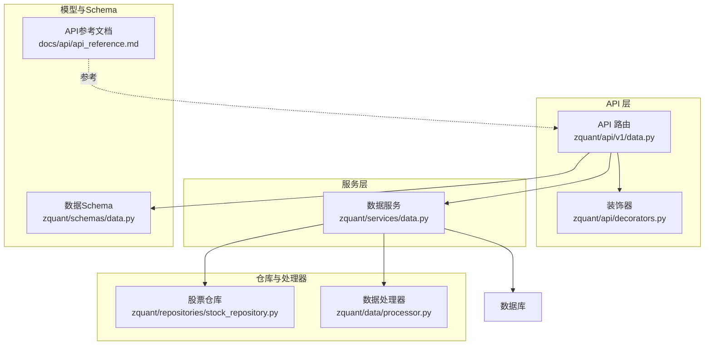
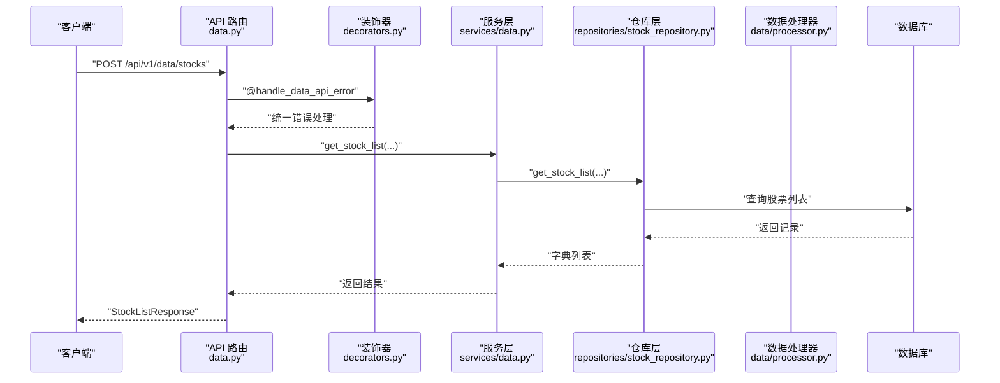
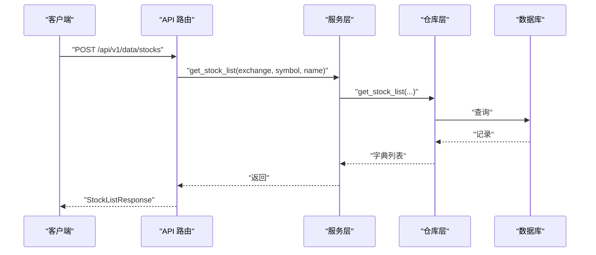
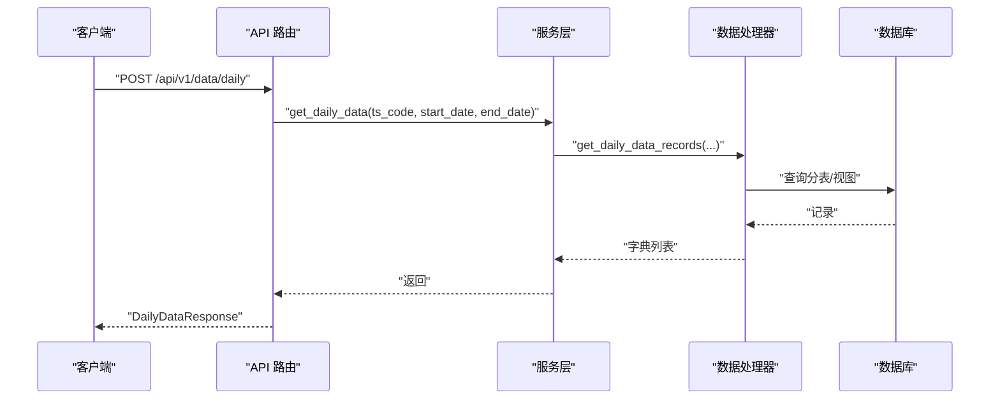
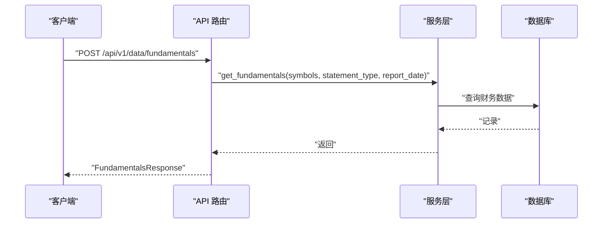
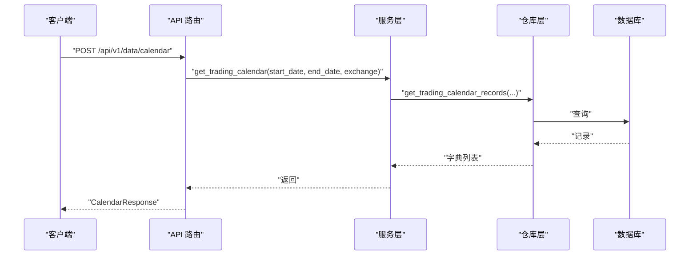
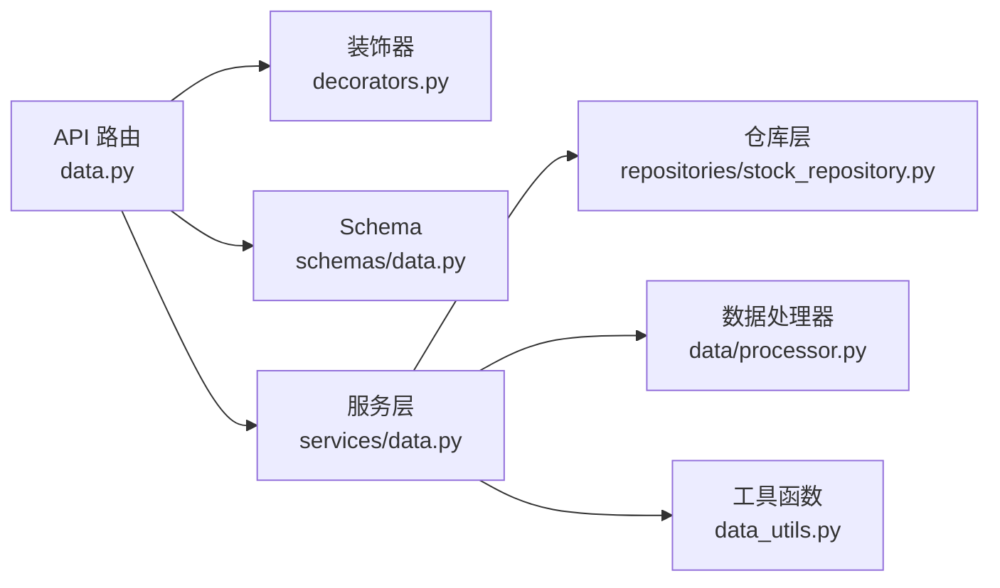

# 数据服务API

<cite>
**本文引用的文件**
- [api_reference.md](file://docs/api/api_reference.md)
- [data.py](file://zquant/api/v1/data.py)
- [schemas/data.py](file://zquant/schemas/data.py)
- [services/data.py](file://zquant/services/data.py)
- [repositories/stock_repository.py](file://zquant/repositories/stock_repository.py)
- [data/processor.py](file://zquant/data/processor.py)
- [decorators.py](file://zquant/api/decorators.py)
- [data_utils.py](file://zquant/utils/data_utils.py)
</cite>

## 目录
1. [简介](#简介)
2. [项目结构](#项目结构)
3. [核心组件](#核心组件)
4. [架构总览](#架构总览)
5. [详细组件分析](#详细组件分析)
6. [依赖关系分析](#依赖关系分析)
7. [性能与限制](#性能与限制)
8. [故障排查指南](#故障排查指南)
9. [结论](#结论)
10. [附录](#附录)

## 简介
本文件面向开发者，系统性梳理数据服务API，涵盖股票列表、K线数据、财务数据与交易日历的查询接口。文档重点说明：
- 每个端点的查询参数（如 ts_code、market、日期范围）
- 分页机制（page/size）与响应结构
- K线数据的频率参数（D/W/M）与查询限制（如单次最多365天）
- 使用 api_reference.md 中的响应示例，解释字段定义与数据结构

## 项目结构
数据服务API位于后端 FastAPI 路由层，通过服务层调用仓库层与数据处理器，最终返回标准化的 Pydantic 响应模型。

图表来源
- [data.py](file://zquant/api/v1/data.py#L1-L120)
- [decorators.py](file://zquant/api/decorators.py#L1-L166)
- [services/data.py](file://zquant/services/data.py#L1-L120)
- [repositories/stock_repository.py](file://zquant/repositories/stock_repository.py#L1-L120)
- [data/processor.py](file://zquant/data/processor.py#L1-L120)
- [schemas/data.py](file://zquant/schemas/data.py#L1-L120)
- [api_reference.md](file://docs/api/api_reference.md#L1-L120)

章节来源
- [data.py](file://zquant/api/v1/data.py#L1-L120)
- [schemas/data.py](file://zquant/schemas/data.py#L1-L120)
- [services/data.py](file://zquant/services/data.py#L1-L120)
- [repositories/stock_repository.py](file://zquant/repositories/stock_repository.py#L1-L120)
- [data/processor.py](file://zquant/data/processor.py#L1-L120)
- [decorators.py](file://zquant/api/decorators.py#L1-L166)
- [api_reference.md](file://docs/api/api_reference.md#L1-L120)

## 核心组件
- API 路由层：定义数据服务端点，接收请求并调用服务层，使用装饰器统一错误处理与响应转换。
- 服务层：封装业务逻辑，负责数据聚合、缓存与调用仓库/处理器。
- 仓库层：提供对数据库的查询封装，如股票列表、TS代码映射等。
- 数据处理器：针对分表/视图的查询与数据转换，如日线数据、交易日历等。
- Schema：定义请求与响应模型，确保前后端数据结构一致。
- 工具函数：日期解析、NaN清理、响应转换等。

章节来源
- [data.py](file://zquant/api/v1/data.py#L1-L120)
- [services/data.py](file://zquant/services/data.py#L1-L120)
- [repositories/stock_repository.py](file://zquant/repositories/stock_repository.py#L1-L120)
- [data/processor.py](file://zquant/data/processor.py#L1-L120)
- [schemas/data.py](file://zquant/schemas/data.py#L1-L120)
- [decorators.py](file://zquant/api/decorators.py#L1-L166)
- [data_utils.py](file://zquant/utils/data_utils.py#L1-L120)

## 架构总览
下图展示数据服务API的关键交互流程：前端调用后端端点，路由层经装饰器处理后进入服务层，服务层再调用仓库与处理器，最终返回标准化响应。

图表来源
- [data.py](file://zquant/api/v1/data.py#L540-L560)
- [decorators.py](file://zquant/api/decorators.py#L39-L108)
- [services/data.py](file://zquant/services/data.py#L202-L231)
- [repositories/stock_repository.py](file://zquant/repositories/stock_repository.py#L175-L231)

## 详细组件分析

### 股票列表查询
- 端点：POST /api/v1/data/stocks
- 功能：按交易所、股票代码、股票名称模糊查询，返回所有字段。
- 查询参数（请求体）：
  - exchange: 交易所代码（如 SSE/SZSE）
  - symbol: 股票代码（如 000001）
  - name: 股票名称（模糊匹配）
- 响应模型：StockListResponse，包含 stocks 字段（字典列表）。
- 分页机制：该端点使用请求体参数，不提供 page/size；若需分页，可在前端自行处理或扩展服务层。

图表来源
- [data.py](file://zquant/api/v1/data.py#L540-L560)
- [services/data.py](file://zquant/services/data.py#L202-L231)
- [repositories/stock_repository.py](file://zquant/repositories/stock_repository.py#L175-L231)
- [schemas/data.py](file://zquant/schemas/data.py#L88-L100)

章节来源
- [data.py](file://zquant/api/v1/data.py#L540-L560)
- [services/data.py](file://zquant/services/data.py#L202-L231)
- [repositories/stock_repository.py](file://zquant/repositories/stock_repository.py#L175-L231)
- [schemas/data.py](file://zquant/schemas/data.py#L88-L100)
- [api_reference.md](file://docs/api/api_reference.md#L187-L219)

### K线数据查询
- 端点：POST /api/v1/data/daily
- 功能：获取日线数据（返回所有字段），支持单个或多个 ts_code，支持日期范围。
- 查询参数（请求体）：
  - ts_code: 单个 TS 代码或数组（如 000001.SZ 或 ["000001.SZ","000002.SZ"]）
  - start_date: 开始日期
  - end_date: 结束日期
- 响应模型：DailyDataResponse，items 为 DailyDataItem 列表。
- 频率参数：该端点为日线数据；周线/W线与月线数据另有端点（参见“附录”）。
- 查询限制：前端页面对“接口数据获取”功能限制为不超过30天；服务层未显式限制单次查询天数，建议遵循前端约束。

图表来源
- [data.py](file://zquant/api/v1/data.py#L722-L731)
- [services/data.py](file://zquant/services/data.py#L233-L276)
- [data/processor.py](file://zquant/data/processor.py#L100-L200)
- [schemas/data.py](file://zquant/schemas/data.py#L102-L135)

章节来源
- [data.py](file://zquant/api/v1/data.py#L722-L731)
- [services/data.py](file://zquant/services/data.py#L233-L276)
- [data/processor.py](file://zquant/data/processor.py#L100-L200)
- [schemas/data.py](file://zquant/schemas/data.py#L102-L135)
- [api_reference.md](file://docs/api/api_reference.md#L221-L238)

### 财务数据查询
- 端点：POST /api/v1/data/fundamentals
- 功能：按股票代码列表、报表类型与报告期查询财务数据。
- 查询参数（请求体）：
  - symbols: 股票代码列表（TS代码或纯数字）
  - statement_type: 报表类型（income/balance/cashflow）
  - report_date: 报告期（可选，None 表示最新一期）
- 响应模型：FundamentalsResponse，包含 data 与 field_descriptions。
- 字段释义：field_descriptions 提供字段含义说明。

图表来源
- [data.py](file://zquant/api/v1/data.py#L97-L105)
- [services/data.py](file://zquant/services/data.py#L42-L165)
- [schemas/data.py](file://zquant/schemas/data.py#L42-L67)

章节来源
- [data.py](file://zquant/api/v1/data.py#L97-L105)
- [services/data.py](file://zquant/services/data.py#L42-L165)
- [schemas/data.py](file://zquant/schemas/data.py#L42-L67)
- [api_reference.md](file://docs/api/api_reference.md#L233-L238)

### 交易日历查询
- 端点：POST /api/v1/data/calendar
- 功能：按日期范围与交易所查询交易日历（返回所有字段）。
- 查询参数（请求体）：
  - start_date: 开始日期
  - end_date: 结束日期
  - exchange: 交易所代码（如 SSE/SZSE），传 None 或 "all" 表示所有交易所
- 响应模型：CalendarResponse，items 为 CalendarItem 列表。
- 数据来源：服务层从仓库层获取完整记录，并带缓存。

图表来源
- [data.py](file://zquant/api/v1/data.py#L333-L342)
- [services/data.py](file://zquant/services/data.py#L167-L201)
- [data/processor.py](file://zquant/data/processor.py#L66-L99)
- [schemas/data.py](file://zquant/schemas/data.py#L50-L87)

章节来源
- [data.py](file://zquant/api/v1/data.py#L333-L342)
- [services/data.py](file://zquant/services/data.py#L167-L201)
- [data/processor.py](file://zquant/data/processor.py#L66-L99)
- [schemas/data.py](file://zquant/schemas/data.py#L50-L87)
- [api_reference.md](file://docs/api/api_reference.md#L239-L243)

### 周线/W线与月线数据
- 端点：POST /api/v1/data/daily-basic
- 功能：获取每日指标数据（包含周线/W线与月线字段），支持单个或多个 ts_code，支持日期范围。
- 查询参数（请求体）：
  - ts_code: 单个 TS 代码或数组
  - start_date: 开始日期
  - end_date: 结束日期
- 响应模型：DailyBasicResponse，items 为 DailyBasicItem 列表。
- 注意：该端点返回“每日指标”，其中包含周线/W线与月线相关字段，适合查询周/月维度指标。

章节来源
- [data.py](file://zquant/api/v1/data.py#L722-L731)
- [schemas/data.py](file://zquant/schemas/data.py#L137-L177)
- [api_reference.md](file://docs/api/api_reference.md#L221-L238)

## 依赖关系分析
- API 路由依赖装饰器进行统一错误处理与响应转换。
- 服务层依赖仓库层与数据处理器，负责缓存与查询优化。
- Schema 定义了请求与响应模型，确保类型安全与前后端一致。
- 工具函数提供日期解析与 NaN 清理，保障数据质量。

图表来源
- [data.py](file://zquant/api/v1/data.py#L1-L120)
- [decorators.py](file://zquant/api/decorators.py#L1-L166)
- [schemas/data.py](file://zquant/schemas/data.py#L1-L120)
- [services/data.py](file://zquant/services/data.py#L1-L120)
- [repositories/stock_repository.py](file://zquant/repositories/stock_repository.py#L1-L120)
- [data/processor.py](file://zquant/data/processor.py#L1-L120)
- [data_utils.py](file://zquant/utils/data_utils.py#L1-L120)

章节来源
- [data.py](file://zquant/api/v1/data.py#L1-L120)
- [decorators.py](file://zquant/api/decorators.py#L1-L166)
- [schemas/data.py](file://zquant/schemas/data.py#L1-L120)
- [services/data.py](file://zquant/services/data.py#L1-L120)
- [repositories/stock_repository.py](file://zquant/repositories/stock_repository.py#L1-L120)
- [data/processor.py](file://zquant/data/processor.py#L1-L120)
- [data_utils.py](file://zquant/utils/data_utils.py#L1-L120)

## 性能与限制
- 缓存策略：服务层对日线、每日指标、因子与专业版因子数据进行缓存，缓存有效期为1小时；交易日历缓存有效期为24小时。
- 查询限制：
  - 前端“接口数据获取”功能对日线与每日指标限制为不超过30天。
  - 文档中明确“K线数据单次查询最多365天”的限制。
- 分页机制：股票列表端点使用请求体参数，不提供 page/size；其他端点返回完整列表，未内置分页。

章节来源
- [services/data.py](file://zquant/services/data.py#L233-L276)
- [services/data.py](file://zquant/services/data.py#L277-L363)
- [services/data.py](file://zquant/services/data.py#L365-L407)
- [api_reference.md](file://docs/api/api_reference.md#L615-L626)

## 故障排查指南
- 统一错误处理：装饰器将异常转换为 HTTP 500，并返回统一错误响应格式。
- 数据清理：工具函数对 NaN/Inf 进行清理，避免 JSON 序列化失败。
- 参数校验：前端对 ts_codes 与日期范围进行校验，避免非法请求。

章节来源
- [decorators.py](file://zquant/api/decorators.py#L39-L108)
- [data_utils.py](file://zquant/utils/data_utils.py#L95-L120)
- [web 页面校验](file://web/src/pages/data/daily.tsx#L351-L393)

## 结论
本数据服务API围绕股票列表、K线数据、财务数据与交易日历提供标准化查询能力。通过服务层缓存与仓库/处理器的配合，实现了高效稳定的查询体验。开发者在使用时应关注：
- 查询参数与响应模型的一致性
- K线频率与查询范围的限制
- 前端对日期范围的约束

## 附录

### 端点与参数一览
- 股票列表：POST /api/v1/data/stocks
  - 请求体：exchange、symbol、name
  - 响应：StockListResponse
- K线数据：POST /api/v1/data/daily
  - 请求体：ts_code、start_date、end_date
  - 响应：DailyDataResponse
- 财务数据：POST /api/v1/data/fundamentals
  - 请求体：symbols、statement_type、report_date
  - 响应：FundamentalsResponse
- 交易日历：POST /api/v1/data/calendar
  - 请求体：start_date、end_date、exchange
  - 响应：CalendarResponse
- 周线/W线/月线：POST /api/v1/data/daily-basic
  - 请求体：ts_code、start_date、end_date
  - 响应：DailyBasicResponse

章节来源
- [data.py](file://zquant/api/v1/data.py#L540-L560)
- [data.py](file://zquant/api/v1/data.py#L722-L731)
- [data.py](file://zquant/api/v1/data.py#L97-L105)
- [data.py](file://zquant/api/v1/data.py#L333-L342)
- [schemas/data.py](file://zquant/schemas/data.py#L88-L100)
- [schemas/data.py](file://zquant/schemas/data.py#L102-L135)
- [schemas/data.py](file://zquant/schemas/data.py#L137-L177)
- [schemas/data.py](file://zquant/schemas/data.py#L50-L87)
- [api_reference.md](file://docs/api/api_reference.md#L187-L243)

### 字段定义参考
- 股票模型（Stock）：ts_code、symbol、name、market、industry、list_date
- K线数据模型（DailyDataItem）：ts_code、trade_date、open、high、low、close、vol、amount
- 交易日历模型（CalendarItem）：exchange、cal_date、is_open、pretrade_date

章节来源
- [api_reference.md](file://docs/api/api_reference.md#L577-L601)
- [schemas/data.py](file://zquant/schemas/data.py#L110-L129)
- [schemas/data.py](file://zquant/schemas/data.py#L68-L80)