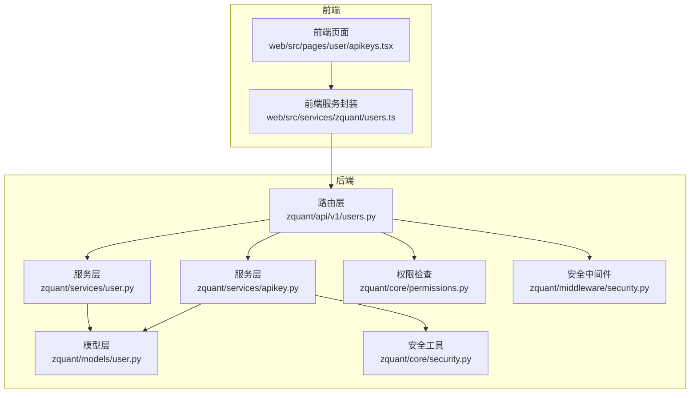
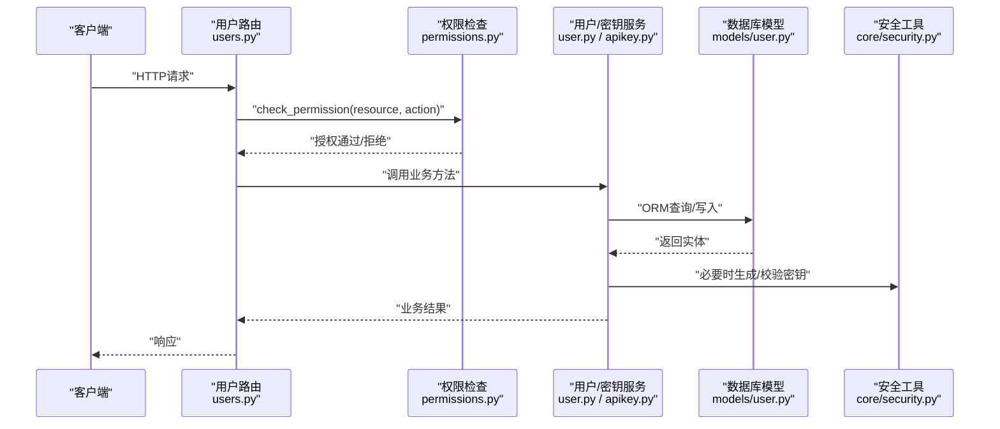
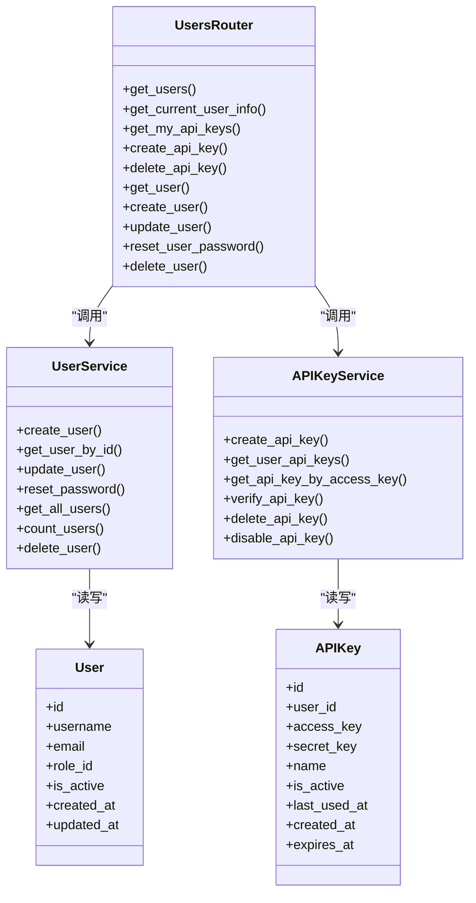

# 用户管理API

<cite>
**本文引用的文件**
- [zquant/api/v1/users.py](file://zquant/api/v1/users.py)
- [zquant/schemas/user.py](file://zquant/schemas/user.py)
- [zquant/services/user.py](file://zquant/services/user.py)
- [zquant/services/apikey.py](file://zquant/services/apikey.py)
- [zquant/models/user.py](file://zquant/models/user.py)
- [zquant/core/permissions.py](file://zquant/core/permissions.py)
- [zquant/core/security.py](file://zquant/core/security.py)
- [zquant/middleware/security.py](file://zquant/middleware/security.py)
- [docs/api/api_reference.md](file://docs/api/api_reference.md)
- [web/src/services/zquant/users.ts](file://web/src/services/zquant/users.ts)
- [web/src/pages/user/apikeys.tsx](file://web/src/pages/user/apikeys.tsx)
</cite>

## 目录
1. [简介](#简介)
2. [项目结构](#项目结构)
3. [核心组件](#核心组件)
4. [架构总览](#架构总览)
5. [详细组件分析](#详细组件分析)
6. [依赖关系分析](#依赖关系分析)
7. [性能考量](#性能考量)
8. [故障排查指南](#故障排查指南)
9. [结论](#结论)
10. [附录](#附录)

## 简介
本文件面向后端与前端开发者，系统性梳理“用户管理API”的设计与实现，覆盖以下能力：
- 获取用户列表（支持分页、筛选、排序）
- 创建、更新、删除用户（仅管理员可操作）
- 获取当前用户信息
- 管理API密钥（创建、查询、删除；secret_key仅在创建时返回一次）

同时，文档明确权限控制策略（基于资源与动作的权限检查）、API密钥安全生成与保管策略，并结合官方API参考文档中的响应样例，帮助快速集成与排障。

## 项目结构
用户管理API位于后端FastAPI路由层，配合服务层、模型层与权限/安全模块协同工作；前端通过统一的服务封装调用。

图表来源
- [zquant/api/v1/users.py](file://zquant/api/v1/users.py#L1-L208)
- [zquant/services/user.py](file://zquant/services/user.py#L1-L222)
- [zquant/services/apikey.py](file://zquant/services/apikey.py#L1-L142)
- [zquant/models/user.py](file://zquant/models/user.py#L1-L113)
- [zquant/core/permissions.py](file://zquant/core/permissions.py#L1-L111)
- [zquant/core/security.py](file://zquant/core/security.py#L1-L133)
- [zquant/middleware/security.py](file://zquant/middleware/security.py#L1-L163)
- [web/src/services/zquant/users.ts](file://web/src/services/zquant/users.ts#L1-L152)
- [web/src/pages/user/apikeys.tsx](file://web/src/pages/user/apikeys.tsx#L31-L282)

章节来源
- [zquant/api/v1/users.py](file://zquant/api/v1/users.py#L1-L208)
- [web/src/services/zquant/users.ts](file://web/src/services/zquant/users.ts#L1-L152)

## 核心组件
- 路由层：定义用户与API密钥相关端点，绑定权限检查与当前用户依赖注入。
- 服务层：
  - 用户服务：负责用户创建、更新、删除、查询、计数、密码重置等。
  - API密钥服务：负责密钥生成、存储、校验、查询与删除。
- 模型层：用户、角色、权限、API密钥的数据库映射。
- 权限与安全：基于资源与动作的权限检查装饰器、JWT与API密钥认证、安全响应头与XSS防护中间件。
- 前端封装：统一的HTTP请求封装与页面交互逻辑。

章节来源
- [zquant/services/user.py](file://zquant/services/user.py#L1-L222)
- [zquant/services/apikey.py](file://zquant/services/apikey.py#L1-L142)
- [zquant/models/user.py](file://zquant/models/user.py#L1-L113)
- [zquant/core/permissions.py](file://zquant/core/permissions.py#L1-L111)
- [zquant/core/security.py](file://zquant/core/security.py#L1-L133)
- [zquant/middleware/security.py](file://zquant/middleware/security.py#L1-L163)

## 架构总览
用户管理API遵循“路由-服务-模型”分层，权限控制贯穿请求生命周期，安全中间件统一加固响应头与输入清洗。

图表来源
- [zquant/api/v1/users.py](file://zquant/api/v1/users.py#L51-L208)
- [zquant/core/permissions.py](file://zquant/core/permissions.py#L38-L80)
- [zquant/services/user.py](file://zquant/services/user.py#L37-L222)
- [zquant/services/apikey.py](file://zquant/services/apikey.py#L43-L142)
- [zquant/models/user.py](file://zquant/models/user.py#L74-L113)
- [zquant/core/security.py](file://zquant/core/security.py#L116-L133)

## 详细组件分析

### 用户列表查询（分页、筛选、排序）
- HTTP方法与路径
  - 方法：GET
  - 路径：/api/v1/users
- 权限控制
  - 需要资源“user”，动作“read”
- 查询参数
  - skip：跳过记录数（非负整数）
  - limit：每页记录数（1~1000）
  - is_active：是否激活（布尔）
  - role_id：角色ID（整数）
  - username：用户名（模糊匹配）
  - order_by：排序字段（id, username, email, is_active, created_at, updated_at）
  - order：排序方向（asc/desc）
- 请求体：无
- 响应体
  - items：用户数组（UserResponse）
  - total：总数
  - skip、limit：分页参数
- 服务实现要点
  - 支持多条件过滤与排序，返回分页包装对象
- 前端调用
  - 使用统一服务封装的getUsers方法传入上述参数

章节来源
- [zquant/api/v1/users.py](file://zquant/api/v1/users.py#L51-L77)
- [zquant/services/user.py](file://zquant/services/user.py#L148-L207)
- [zquant/schemas/user.py](file://zquant/schemas/user.py#L221-L231)
- [web/src/services/zquant/users.ts](file://web/src/services/zquant/users.ts#L85-L102)

### 获取当前用户信息
- HTTP方法与路径
  - 方法：GET
  - 路径：/api/v1/users/me
- 权限控制
  - 无需额外权限，但需为已激活用户
- 请求体：无
- 响应体：UserResponse
- 服务实现要点
  - 通过依赖注入获取当前活跃用户并返回

章节来源
- [zquant/api/v1/users.py](file://zquant/api/v1/users.py#L79-L99)
- [zquant/schemas/user.py](file://zquant/schemas/user.py#L94-L104)

### 获取API密钥列表
- HTTP方法与路径
  - 方法：GET
  - 路径：/api/v1/users/me/apikeys
- 权限控制
  - 无需额外权限，但需为已激活用户
- 请求体：无
- 响应体：APIKeyResponse 数组
- 服务实现要点
  - 查询当前用户的所有API密钥，按创建时间倒序

章节来源
- [zquant/api/v1/users.py](file://zquant/api/v1/users.py#L101-L108)
- [zquant/services/apikey.py](file://zquant/services/apikey.py#L80-L88)
- [zquant/schemas/user.py](file://zquant/schemas/user.py#L194-L207)

### 创建API密钥
- HTTP方法与路径
  - 方法：POST
  - 路径：/api/v1/users/me/apikeys
- 权限控制
  - 无需额外权限，但需为已激活用户
- 请求体
  - name：可选，密钥名称/描述
- 响应体
  - 包含 access_key、secret_key、id、name、created_at、expires_at
  - 提示消息：secret_key仅返回一次，请妥善保管
- 安全要点
  - secret_key仅在创建时返回一次，后续无法再次查询
  - 后端对secret_key进行哈希存储
- 前端交互
  - 页面弹窗展示secret_key并提供复制按钮，提示用户妥善保管

章节来源
- [zquant/api/v1/users.py](file://zquant/api/v1/users.py#L110-L123)
- [zquant/services/apikey.py](file://zquant/services/apikey.py#L47-L77)
- [zquant/core/security.py](file://zquant/core/security.py#L116-L133)
- [docs/api/api_reference.md](file://docs/api/api_reference.md#L133-L159)
- [web/src/pages/user/apikeys.tsx](file://web/src/pages/user/apikeys.tsx#L31-L282)

### 删除API密钥
- HTTP方法与路径
  - 方法：DELETE
  - 路径：/api/v1/users/me/apikeys/{key_id}
- 权限控制
  - 无需额外权限，但需为已激活用户
- 请求体：无
- 响应体：通用消息对象
- 服务实现要点
  - 仅允许删除当前用户的API密钥

章节来源
- [zquant/api/v1/users.py](file://zquant/api/v1/users.py#L125-L136)
- [zquant/services/apikey.py](file://zquant/services/apikey.py#L118-L129)

### 查询用户详情
- HTTP方法与路径
  - 方法：GET
  - 路径：/api/v1/users/{user_id}
- 权限控制
  - 需要资源“user”，动作“read”
- 请求体：无
- 响应体：UserResponse
- 错误处理
  - 未找到用户时返回404

章节来源
- [zquant/api/v1/users.py](file://zquant/api/v1/users.py#L138-L146)
- [zquant/services/user.py](file://zquant/services/user.py#L83-L91)

### 创建用户（仅管理员）
- HTTP方法与路径
  - 方法：POST
  - 路径：/api/v1/users
- 权限控制
  - 需要资源“user”，动作“create”
- 请求体
  - username、email、password、password_confirm、role_id
  - 密码强度校验与二次确认校验
- 响应体：UserResponse
- 错误处理
  - 用户名/邮箱重复、角色不存在、密码强度不满足等场景返回400

章节来源
- [zquant/api/v1/users.py](file://zquant/api/v1/users.py#L148-L159)
- [zquant/services/user.py](file://zquant/services/user.py#L41-L78)
- [zquant/schemas/user.py](file://zquant/schemas/user.py#L40-L55)

### 更新用户（仅管理员）
- HTTP方法与路径
  - 方法：PUT
  - 路径：/api/v1/users/{user_id}
- 权限控制
  - 需要资源“user”，动作“update”
- 请求体
  - email、is_active、role_id（可选）
  - 更新邮箱时需保证全局唯一
- 响应体：UserResponse
- 错误处理
  - 未找到用户、邮箱冲突、角色不存在、数据冲突等返回400/404

章节来源
- [zquant/api/v1/users.py](file://zquant/api/v1/users.py#L161-L177)
- [zquant/services/user.py](file://zquant/services/user.py#L93-L123)

### 重置用户密码（仅管理员）
- HTTP方法与路径
  - 方法：POST
  - 路径：/api/v1/users/{user_id}/reset-password
- 权限控制
  - 需要资源“user”，动作“update”
- 请求体
  - password、password_confirm
  - 密码强度校验与二次确认校验
- 响应体：通用消息对象
- 错误处理
  - 未找到用户、密码强度不满足等返回400/404

章节来源
- [zquant/api/v1/users.py](file://zquant/api/v1/users.py#L179-L195)
- [zquant/services/user.py](file://zquant/services/user.py#L125-L146)

### 删除用户（仅管理员）
- HTTP方法与路径
  - 方法：DELETE
  - 路径：/api/v1/users/{user_id}
- 权限控制
  - 需要资源“user”，动作“delete”
- 请求体：无
- 响应体：通用消息对象
- 错误处理
  - 未找到用户或删除失败返回404/400

章节来源
- [zquant/api/v1/users.py](file://zquant/api/v1/users.py#L197-L208)
- [zquant/services/user.py](file://zquant/services/user.py#L209-L222)

### API密钥安全生成与保管策略
- 生成流程
  - 后端生成access_key与secret_key对，secret_key仅在创建响应中返回一次
  - secret_key入库前进行哈希处理，不以明文形式存储
- 使用方式
  - API密钥认证：请求头携带X-API-Key与X-API-Secret
- 保管建议
  - 前端页面明确提示secret_key仅显示一次，需妥善保存
  - 生产环境建议使用安全的密钥管理系统或环境变量管理

章节来源
- [zquant/services/apikey.py](file://zquant/services/apikey.py#L47-L77)
- [zquant/core/security.py](file://zquant/core/security.py#L116-L133)
- [docs/api/api_reference.md](file://docs/api/api_reference.md#L20-L26)
- [web/src/pages/user/apikeys.tsx](file://web/src/pages/user/apikeys.tsx#L205-L253)

### 权限控制（仅管理员可操作）
- 路由层通过装饰器check_permission(resource, action)进行权限校验
- 当前用户需为已激活状态
- 典型权限
  - user:create、user:read、user:update、user:delete
- 角色与权限
  - 管理员角色拥有全部权限
  - 其他角色权限由角色-权限关联表决定

章节来源
- [zquant/core/permissions.py](file://zquant/core/permissions.py#L38-L80)
- [zquant/api/v1/users.py](file://zquant/api/v1/users.py#L51-L208)
- [docs/api/api_reference.md](file://docs/api/api_reference.md#L129-L159)

## 依赖关系分析

图表来源
- [zquant/api/v1/users.py](file://zquant/api/v1/users.py#L51-L208)
- [zquant/services/user.py](file://zquant/services/user.py#L37-L222)
- [zquant/services/apikey.py](file://zquant/services/apikey.py#L43-L142)
- [zquant/models/user.py](file://zquant/models/user.py#L74-L113)

## 性能考量
- 分页与排序
  - 服务层对查询与排序进行了边界控制（limit 1~1000），避免超大数据量扫描
- 数据库事务
  - 创建/更新/删除用户与API密钥均在事务内完成，失败回滚
- 密钥校验
  - API密钥校验包含过期与禁用检查，避免无效请求进入业务逻辑

章节来源
- [zquant/api/v1/users.py](file://zquant/api/v1/users.py#L51-L77)
- [zquant/services/user.py](file://zquant/services/user.py#L148-L207)
- [zquant/services/apikey.py](file://zquant/services/apikey.py#L89-L117)

## 故障排查指南
- 403 Forbidden
  - 可能原因：当前用户不具备所需资源-动作权限
  - 处理建议：确认角色与权限分配，确保管理员身份
- 401 Unauthorized
  - 可能原因：缺少JWT或API密钥，或API密钥校验失败
  - 处理建议：检查Authorization头或X-API-Key与X-API-Secret
- 404 Not Found
  - 可能原因：用户/密钥不存在
  - 处理建议：确认ID与当前用户匹配
- 400 Bad Request
  - 可能原因：用户名/邮箱重复、角色不存在、密码强度不满足、数据冲突
  - 处理建议：检查请求体字段与业务规则

章节来源
- [zquant/api/v1/users.py](file://zquant/api/v1/users.py#L148-L208)
- [zquant/services/user.py](file://zquant/services/user.py#L41-L78)
- [zquant/services/apikey.py](file://zquant/services/apikey.py#L89-L117)
- [docs/api/api_reference.md](file://docs/api/api_reference.md#L540-L561)

## 结论
用户管理API围绕“权限驱动+安全优先”的原则构建，既满足管理员对用户与密钥的精细化管控，又通过严格的输入校验、密钥哈希存储与一次性返回机制保障安全。前端提供了直观的密钥管理界面，便于用户妥善保管secret_key。建议在生产环境中结合密钥管理平台与审计日志进一步强化安全与合规。

## 附录

### API端点一览与Schema摘要
- 用户列表
  - GET /api/v1/users
  - 查询参数：skip、limit、is_active、role_id、username、order_by、order
  - 响应：PageResponse(items: UserResponse[], total, skip, limit)
- 当前用户
  - GET /api/v1/users/me
  - 响应：UserResponse
- API密钥列表
  - GET /api/v1/users/me/apikeys
  - 响应：APIKeyResponse[]
- 创建API密钥
  - POST /api/v1/users/me/apikeys
  - 请求体：APIKeyCreate(name?)
  - 响应：APIKeyCreateResponse（包含secret_key仅一次）
- 删除API密钥
  - DELETE /api/v1/users/me/apikeys/{key_id}
  - 响应：通用消息
- 用户详情
  - GET /api/v1/users/{user_id}
  - 响应：UserResponse
- 创建用户
  - POST /api/v1/users
  - 请求体：UserCreate（username, email, password, password_confirm, role_id）
  - 响应：UserResponse
- 更新用户
  - PUT /api/v1/users/{user_id}
  - 请求体：UserUpdate（email?, is_active?, role_id?）
  - 响应：UserResponse
- 重置密码
  - POST /api/v1/users/{user_id}/reset-password
  - 请求体：PasswordReset（password, password_confirm）
  - 响应：通用消息
- 删除用户
  - DELETE /api/v1/users/{user_id}
  - 响应：通用消息

章节来源
- [zquant/api/v1/users.py](file://zquant/api/v1/users.py#L51-L208)
- [zquant/schemas/user.py](file://zquant/schemas/user.py#L40-L55)
- [zquant/schemas/user.py](file://zquant/schemas/user.py#L57-L63)
- [zquant/schemas/user.py](file://zquant/schemas/user.py#L65-L79)
- [zquant/schemas/user.py](file://zquant/schemas/user.py#L188-L207)
- [zquant/schemas/user.py](file://zquant/schemas/user.py#L209-L219)
- [zquant/schemas/user.py](file://zquant/schemas/user.py#L221-L231)
- [docs/api/api_reference.md](file://docs/api/api_reference.md#L80-L159)

### 权限与角色
- 权限资源-动作
  - user:create、user:read、user:update、user:delete
- 角色
  - admin：拥有全部权限
  - 其他角色：按角色-权限关联表授予

章节来源
- [zquant/core/permissions.py](file://zquant/core/permissions.py#L38-L80)
- [docs/api/api_reference.md](file://docs/api/api_reference.md#L129-L159)

### 安全中间件与响应头
- 安全响应头：X-Content-Type-Options、X-Frame-Options、X-XSS-Protection、Referrer-Policy
- HTTPS场景：Strict-Transport-Security
- XSS防护：请求参数基本清洗与告警

章节来源
- [zquant/middleware/security.py](file://zquant/middleware/security.py#L39-L61)
- [zquant/middleware/security.py](file://zquant/middleware/security.py#L63-L146)