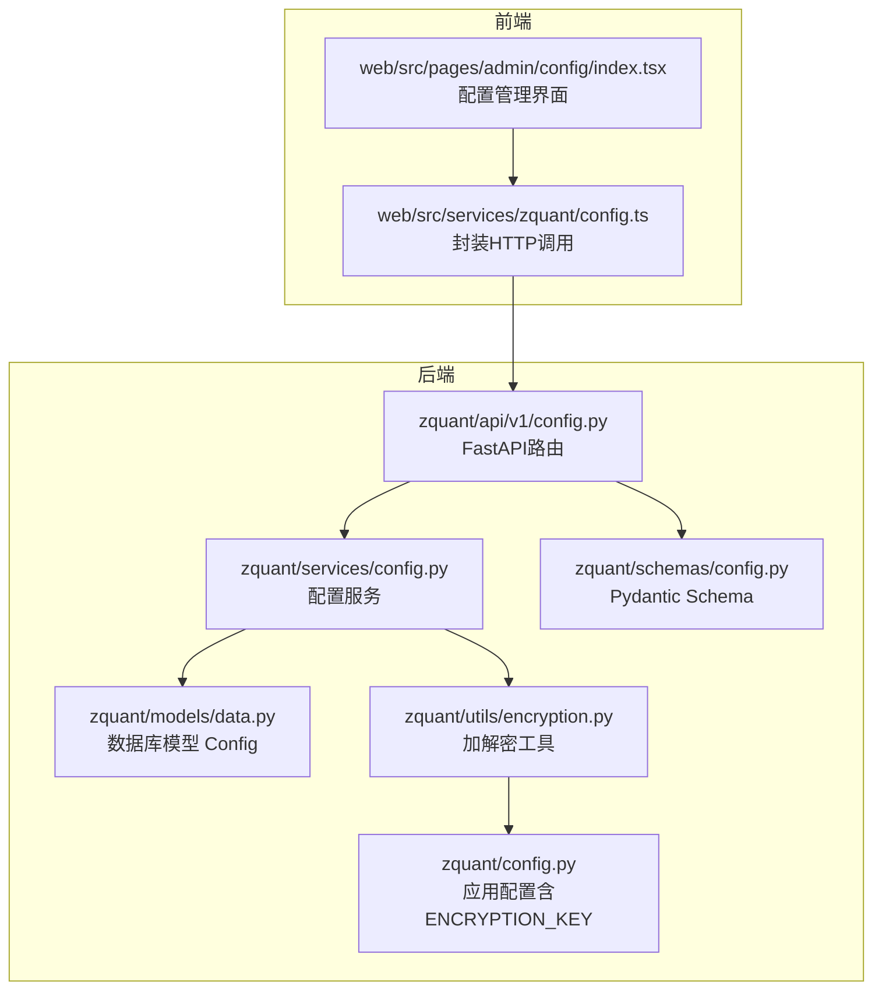
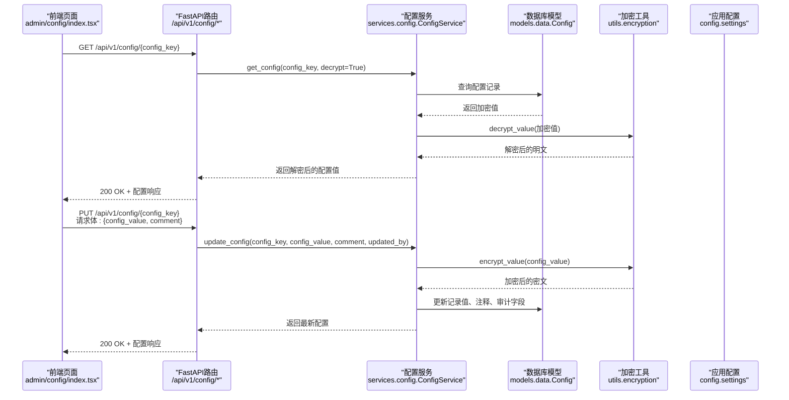
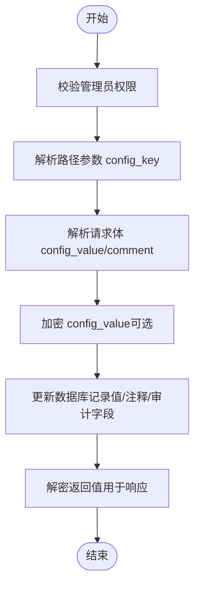

# 系统配置API

<cite>
**本文引用的文件**
- [zquant/api/v1/config.py](file://zquant/api/v1/config.py)
- [zquant/services/config.py](file://zquant/services/config.py)
- [zquant/schemas/config.py](file://zquant/schemas/config.py)
- [zquant/models/data.py](file://zquant/models/data.py)
- [zquant/utils/encryption.py](file://zquant/utils/encryption.py)
- [zquant/config.py](file://zquant/config.py)
- [web/src/services/zquant/config.ts](file://web/src/services/zquant/config.ts)
- [web/src/pages/admin/config/index.tsx](file://web/src/pages/admin/config/index.tsx)
</cite>

## 目录
1. [简介](#简介)
2. [项目结构](#项目结构)
3. [核心组件](#核心组件)
4. [架构总览](#架构总览)
5. [详细组件分析](#详细组件分析)
6. [依赖关系分析](#依赖关系分析)
7. [性能考虑](#性能考虑)
8. [故障排查指南](#故障排查指南)
9. [结论](#结论)
10. [附录](#附录)

## 简介
本文件面向管理员与开发者，系统性说明“系统配置API”的设计与使用，涵盖以下要点：
- 通过GET与PUT方法读取与更新配置项；
- {key}路径参数的使用方式；
- 请求体中value与comment字段的含义；
- 与后端配置系统（zquant/config.py）的集成机制；
- 运行时动态调整能力与最佳实践（如更新关键配置后建议重启相关服务）。

## 项目结构
围绕配置API的关键文件分布如下：
- 后端FastAPI路由层：zquant/api/v1/config.py
- 业务服务层：zquant/services/config.py
- 数据模型与Schema：zquant/models/data.py、zquant/schemas/config.py
- 加密工具：zquant/utils/encryption.py
- 应用配置（含ENCRYPTION_KEY）：zquant/config.py
- 前端调用封装：web/src/services/zquant/config.ts
- 管理端页面（配置管理UI）：web/src/pages/admin/config/index.tsx



图示来源
- [zquant/api/v1/config.py](file://zquant/api/v1/config.py#L58-L246)
- [zquant/services/config.py](file://zquant/services/config.py#L47-L260)
- [zquant/models/data.py](file://zquant/models/data.py#L1123-L1142)
- [zquant/schemas/config.py](file://zquant/schemas/config.py#L30-L97)
- [zquant/utils/encryption.py](file://zquant/utils/encryption.py#L39-L151)
- [zquant/config.py](file://zquant/config.py#L32-L124)
- [web/src/services/zquant/config.ts](file://web/src/services/zquant/config.ts#L25-L100)
- [web/src/pages/admin/config/index.tsx](file://web/src/pages/admin/config/index.tsx#L101-L192)

章节来源
- [zquant/api/v1/config.py](file://zquant/api/v1/config.py#L58-L246)
- [zquant/services/config.py](file://zquant/services/config.py#L47-L260)
- [zquant/models/data.py](file://zquant/models/data.py#L1123-L1142)
- [zquant/schemas/config.py](file://zquant/schemas/config.py#L30-L97)
- [zquant/utils/encryption.py](file://zquant/utils/encryption.py#L39-L151)
- [zquant/config.py](file://zquant/config.py#L32-L124)
- [web/src/services/zquant/config.ts](file://web/src/services/zquant/config.ts#L25-L100)
- [web/src/pages/admin/config/index.tsx](file://web/src/pages/admin/config/index.tsx#L101-L192)

## 核心组件
- FastAPI路由层（GET/PUT等）：负责鉴权（管理员）、参数校验、异常处理与响应构造。
- 配置服务层：封装CRUD逻辑，统一处理加密/解密、数据库操作与返回值组装。
- 数据模型：定义配置表结构（键、值、注释、审计字段等）。
- Schema：定义请求/响应结构，确保前后端契约一致。
- 加密工具：基于Fernet对称加密，密钥来源于应用配置settings.ENCRYPTION_KEY。
- 应用配置：集中管理运行时配置，包括ENCRYPTION_KEY等。

章节来源
- [zquant/api/v1/config.py](file://zquant/api/v1/config.py#L58-L246)
- [zquant/services/config.py](file://zquant/services/config.py#L47-L260)
- [zquant/models/data.py](file://zquant/models/data.py#L1123-L1142)
- [zquant/schemas/config.py](file://zquant/schemas/config.py#L30-L97)
- [zquant/utils/encryption.py](file://zquant/utils/encryption.py#L39-L151)
- [zquant/config.py](file://zquant/config.py#L32-L124)

## 架构总览
配置API遵循“路由层-服务层-模型层-工具层”的分层架构，结合前端调用与管理界面，形成完整的读取与更新闭环。



图示来源
- [zquant/api/v1/config.py](file://zquant/api/v1/config.py#L81-L220)
- [zquant/services/config.py](file://zquant/services/config.py#L48-L218)
- [zquant/utils/encryption.py](file://zquant/utils/encryption.py#L99-L150)
- [zquant/models/data.py](file://zquant/models/data.py#L1123-L1142)
- [web/src/pages/admin/config/index.tsx](file://web/src/pages/admin/config/index.tsx#L181-L192)

## 详细组件分析

### 路由与鉴权
- GET /api/v1/config：获取所有配置列表，支持include_sensitive参数控制是否返回敏感值。
- GET /api/v1/config/{config_key}：按键获取单个配置，自动解密返回。
- PUT /api/v1/config/{config_key}：按键更新配置，自动加密存储。
- POST /api/v1/config：创建或更新配置（存在即更新，不存在即创建）。
- 所有上述接口均要求管理员权限，否则拒绝访问。

章节来源
- [zquant/api/v1/config.py](file://zquant/api/v1/config.py#L58-L246)

### 服务层：ConfigService
- get_config：根据键查询配置，支持decrypt开关决定返回明文或密文。
- set_config/update_config：统一处理加密、更新与审计字段（updated_by/updated_time等）。
- get_all_configs：批量查询，支持隐藏敏感值或返回明文。
- delete_config：删除配置。

章节来源
- [zquant/services/config.py](file://zquant/services/config.py#L47-L260)

### 数据模型：Config
- 表名：zq_app_configs
- 字段：config_key（主键）、config_value（加密存储）、comment、created_by/created_time、updated_by/updated_time。
- 索引：config_key索引，便于按键快速检索。

章节来源
- [zquant/models/data.py](file://zquant/models/data.py#L1123-L1142)

### Schema：请求/响应契约
- ConfigCreateRequest：包含config_key、config_value（明文，自动加密）、comment。
- ConfigUpdateRequest：包含config_value（明文，自动加密，可选）、comment。
- ConfigResponse/ConfigItem：包含config_key、config_value（解密后）、comment及审计信息。

章节来源
- [zquant/schemas/config.py](file://zquant/schemas/config.py#L30-L97)

### 加密与配置系统集成
- 加密工具：encrypt_value/decrypt_value基于Fernet，密钥来源settings.ENCRYPTION_KEY。
- 应用配置：settings.ENCRYPTION_KEY必须配置，否则无法进行加密/解密。
- 集成链路：服务层调用加密工具，路由层负责对外暴露明文（解密）与接收明文（加密）。

章节来源
- [zquant/utils/encryption.py](file://zquant/utils/encryption.py#L39-L151)
- [zquant/config.py](file://zquant/config.py#L32-L124)

### 前端调用与管理界面
- 前端封装：web/src/services/zquant/config.ts提供getConfig/getAllConfigs/setConfig/updateConfig/deleteConfig/testTushareToken等方法。
- 管理界面：web/src/pages/admin/config/index.tsx展示配置列表、创建/编辑/查看/删除操作，支持敏感值掩码显示与切换。

章节来源
- [web/src/services/zquant/config.ts](file://web/src/services/zquant/config.ts#L25-L100)
- [web/src/pages/admin/config/index.tsx](file://web/src/pages/admin/config/index.tsx#L101-L192)

## 依赖关系分析

```mermaid
classDiagram
class ConfigAPI {
+GET /config
+GET /config/{config_key}
+POST /config
+PUT /config/{config_key}
+DELETE /config/{config_key}
}
class ConfigService {
+get_config()
+set_config()
+update_config()
+get_all_configs()
+delete_config()
}
class ConfigModel {
+config_key
+config_value
+comment
+created_by
+updated_by
}
class Encryption {
+encrypt_value()
+decrypt_value()
}
class Settings {
+ENCRYPTION_KEY
}
ConfigAPI --> ConfigService : "调用"
ConfigService --> ConfigModel : "读写"
ConfigService --> Encryption : "加密/解密"
Encryption --> Settings : "读取密钥"
```

图示来源
- [zquant/api/v1/config.py](file://zquant/api/v1/config.py#L58-L246)
- [zquant/services/config.py](file://zquant/services/config.py#L47-L260)
- [zquant/models/data.py](file://zquant/models/data.py#L1123-L1142)
- [zquant/utils/encryption.py](file://zquant/utils/encryption.py#L39-L151)
- [zquant/config.py](file://zquant/config.py#L32-L124)

## 性能考虑
- 加密/解密开销：每次读取/更新都会进行对称加密/解密，建议在高频场景下：
  - 合理控制请求频率；
  - 对敏感配置采用缓存策略（若业务允许）；
  - 批量操作时尽量减少往返次数。
- 数据库访问：按config_key主键查询，索引命中良好；批量列表查询时注意include_sensitive参数避免泄露敏感值。
- 前端渲染：敏感值默认掩码显示，减少泄露风险。

[本节为通用指导，无需特定文件引用]

## 故障排查指南
- 403 无权限：确认当前用户具备管理员角色。
- 404 未找到：键不存在或已被删除。
- 500 加密/解密失败：检查settings.ENCRYPTION_KEY是否正确配置（字符串或base64编码32字节）。
- 500 数据库异常：检查数据库连接与表结构（zq_app_configs）是否正常。
- 前端提示：前端调用封装会在错误时返回错误详情，便于定位问题。

章节来源
- [zquant/api/v1/config.py](file://zquant/api/v1/config.py#L81-L246)
- [zquant/utils/encryption.py](file://zquant/utils/encryption.py#L39-L151)
- [zquant/config.py](file://zquant/config.py#L32-L124)
- [web/src/services/zquant/config.ts](file://web/src/services/zquant/config.ts#L25-L100)

## 结论
系统配置API通过明确的路由、严谨的服务层与强一致的Schema契约，实现了对配置项的安全读取与动态更新。其与加密工具和应用配置紧密耦合，确保敏感信息在传输与存储过程中的安全。管理员应谨慎更新关键配置，并在必要时重启相关服务以确保变更生效。

[本节为总结性内容，无需特定文件引用]

## 附录

### 接口定义与参数说明
- GET /api/v1/config
  - 查询参数：
    - include_sensitive: 布尔值，是否包含敏感值（默认False，敏感值将被掩码）。
  - 响应：配置列表（items）与总数（total）。
- GET /api/v1/config/{config_key}
  - 路径参数：
    - config_key: 配置键（字符串）。
  - 响应：配置项（包含解密后的config_value、comment及审计信息）。
- PUT /api/v1/config/{config_key}
  - 路径参数：
    - config_key: 配置键（字符串）。
  - 请求体：
    - config_value: 配置值（明文，将被自动加密存储）。
    - comment: 配置说明（可选）。
  - 响应：更新后的配置项。
- POST /api/v1/config
  - 请求体：
    - config_key: 配置键（字符串）。
    - config_value: 配置值（明文，将被自动加密存储）。
    - comment: 配置说明（可选）。
  - 响应：创建/更新后的配置项。
- DELETE /api/v1/config/{config_key}
  - 路径参数：
    - config_key: 配置键（字符串）。
  - 响应：成功消息。

章节来源
- [zquant/api/v1/config.py](file://zquant/api/v1/config.py#L58-L246)
- [zquant/schemas/config.py](file://zquant/schemas/config.py#L30-L97)

### 关键流程图：更新配置（PUT）



图示来源
- [zquant/api/v1/config.py](file://zquant/api/v1/config.py#L178-L220)
- [zquant/services/config.py](file://zquant/services/config.py#L146-L195)
- [zquant/utils/encryption.py](file://zquant/utils/encryption.py#L99-L150)

### 与zquant/config.py的集成要点
- ENCRYPTION_KEY：必须在settings中配置，否则无法完成加密/解密。
- 密钥格式：支持字符串（base64编码32字节）或直接32字节bytes；若为字符串将尝试解码或PBKDF2派生。
- 建议：生产环境务必设置稳定的ENCRYPTION_KEY，避免迁移导致数据不可读。

章节来源
- [zquant/config.py](file://zquant/config.py#L32-L124)
- [zquant/utils/encryption.py](file://zquant/utils/encryption.py#L39-L151)

### 最佳实践
- 仅管理员可访问配置API；
- 更新敏感配置（如第三方Token）后，建议重启相关服务以确保新配置生效；
- 批量更新时优先使用POST（创建/更新）以减少重复请求；
- 前端默认掩码显示敏感值，避免误泄露。

[本节为通用指导，无需特定文件引用]