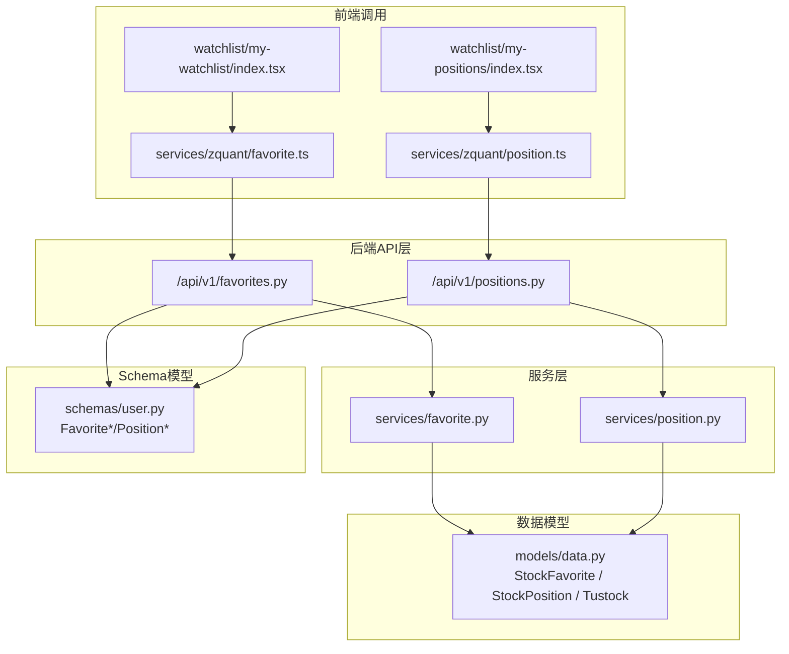
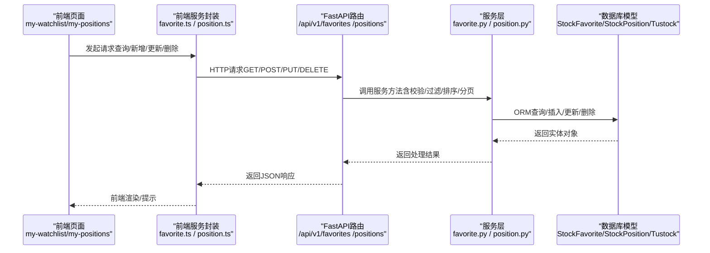
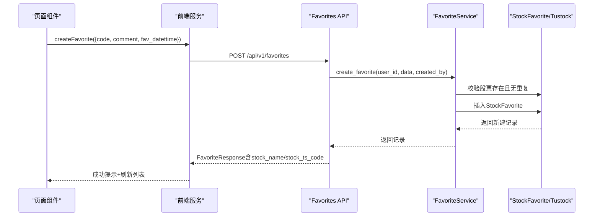
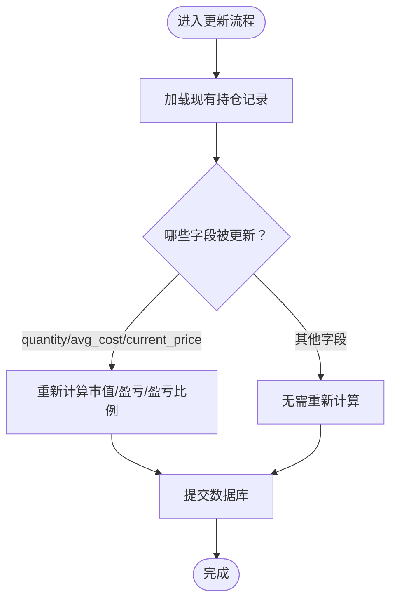
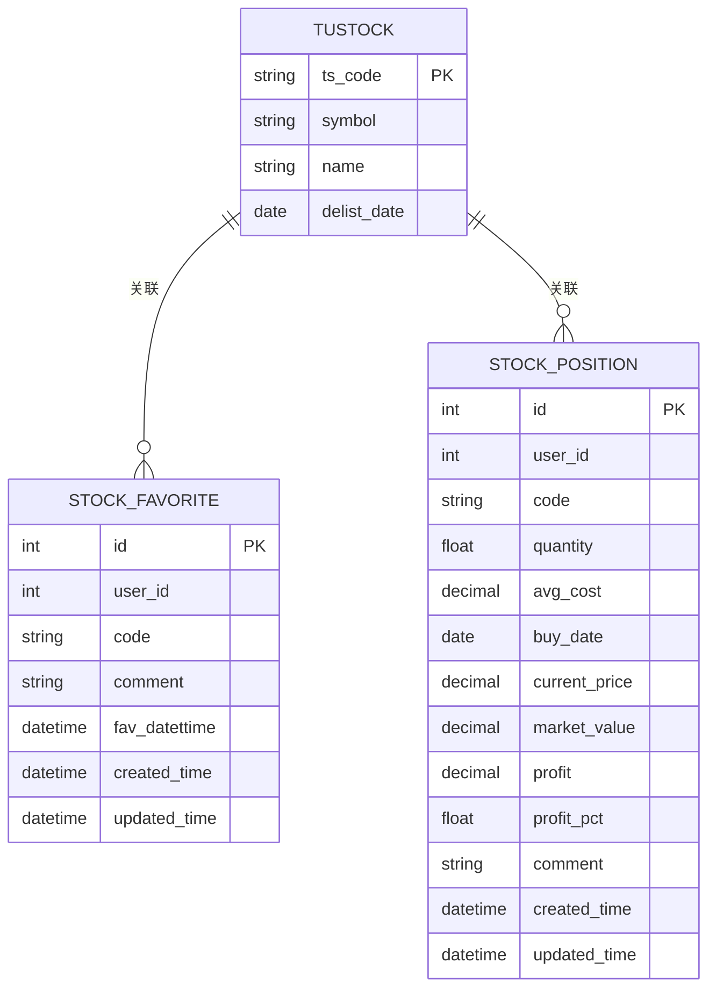
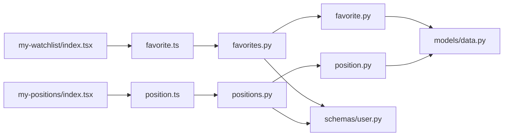

# 自选与持仓API

<cite>
**本文引用的文件**
- [zquant/api/v1/favorites.py](file://zquant/api/v1/favorites.py)
- [zquant/api/v1/positions.py](file://zquant/api/v1/positions.py)
- [zquant/services/favorite.py](file://zquant/services/favorite.py)
- [zquant/services/position.py](file://zquant/services/position.py)
- [zquant/models/data.py](file://zquant/models/data.py)
- [zquant/schemas/user.py](file://zquant/schemas/user.py)
- [web/src/services/zquant/favorite.ts](file://web/src/services/zquant/favorite.ts)
- [web/src/services/zquant/position.ts](file://web/src/services/zquant/position.ts)
- [web/src/pages/watchlist/my-watchlist/index.tsx](file://web/src/pages/watchlist/my-watchlist/index.tsx)
- [web/src/pages/watchlist/my-positions/index.tsx](file://web/src/pages/watchlist/my-positions/index.tsx)
</cite>

## 目录
1. [简介](#简介)
2. [项目结构](#项目结构)
3. [核心组件](#核心组件)
4. [架构总览](#架构总览)
5. [详细组件分析](#详细组件分析)
6. [依赖关系分析](#依赖关系分析)
7. [性能考量](#性能考量)
8. [故障排查指南](#故障排查指南)
9. [结论](#结论)
10. [附录](#附录)

## 简介
本文件面向开发者，系统化说明“自选”与“持仓”两大投资组合管理能力的API与实现要点，覆盖以下内容：
- 自选API：GET/POST/DELETE /api/v1/favorites 的使用方法与参数说明
- 持仓API：GET/PUT /api/v1/positions 的使用方法与参数说明
- 自选与持仓的区别：自选用于快速关注，持仓用于记录真实持有
- 添加自选时 comment 字段的用途说明
- 更新持仓时 avg_cost 与 quantity 的更新逻辑与影响
- 帮助开发者实现投资组合跟踪功能

## 项目结构
围绕自选与持仓的后端API位于 zquant/api/v1 下，业务逻辑在 zquant/services 中，数据模型在 zquant/models/data.py，请求/响应模型在 zquant/schemas/user.py；前端调用封装在 web/src/services/zquant 下，页面组件在 web/src/pages/watchlist 下。

图表来源
- [zquant/api/v1/favorites.py](file://zquant/api/v1/favorites.py#L1-L194)
- [zquant/api/v1/positions.py](file://zquant/api/v1/positions.py#L1-L202)
- [zquant/services/favorite.py](file://zquant/services/favorite.py#L1-L234)
- [zquant/services/position.py](file://zquant/services/position.py#L1-L278)
- [zquant/models/data.py](file://zquant/models/data.py#L1166-L1227)
- [zquant/schemas/user.py](file://zquant/schemas/user.py#L248-L376)
- [web/src/services/zquant/favorite.ts](file://web/src/services/zquant/favorite.ts#L1-L94)
- [web/src/services/zquant/position.ts](file://web/src/services/zquant/position.ts#L1-L94)
- [web/src/pages/watchlist/my-watchlist/index.tsx](file://web/src/pages/watchlist/my-watchlist/index.tsx#L1-L464)
- [web/src/pages/watchlist/my-positions/index.tsx](file://web/src/pages/watchlist/my-positions/index.tsx#L1-L595)

章节来源
- [zquant/api/v1/favorites.py](file://zquant/api/v1/favorites.py#L1-L194)
- [zquant/api/v1/positions.py](file://zquant/api/v1/positions.py#L1-L202)
- [zquant/services/favorite.py](file://zquant/services/favorite.py#L1-L234)
- [zquant/services/position.py](file://zquant/services/position.py#L1-L278)
- [zquant/models/data.py](file://zquant/models/data.py#L1166-L1227)
- [zquant/schemas/user.py](file://zquant/schemas/user.py#L248-L376)
- [web/src/services/zquant/favorite.ts](file://web/src/services/zquant/favorite.ts#L1-L94)
- [web/src/services/zquant/position.ts](file://web/src/services/zquant/position.ts#L1-L94)
- [web/src/pages/watchlist/my-watchlist/index.tsx](file://web/src/pages/watchlist/my-watchlist/index.tsx#L1-L464)
- [web/src/pages/watchlist/my-positions/index.tsx](file://web/src/pages/watchlist/my-positions/index.tsx#L1-L595)

## 核心组件
- 自选API层：提供创建、查询、更新、删除自选的能力，支持分页、筛选与排序
- 持仓API层：提供创建、查询、更新、删除持仓的能力，支持分页、筛选与排序，并在更新时自动计算市值、盈亏与盈亏比例
- 服务层：封装业务规则，包括唯一性校验、股票存在性校验、金额精度处理等
- 数据模型：StockFavorite、StockPosition、Tustock，承载持久化与关联查询
- Schema模型：Favorite*/Position*，定义请求/响应的数据结构与约束
- 前端调用：封装REST请求，供页面组件直接使用

章节来源
- [zquant/api/v1/favorites.py](file://zquant/api/v1/favorites.py#L77-L194)
- [zquant/api/v1/positions.py](file://zquant/api/v1/positions.py#L85-L202)
- [zquant/services/favorite.py](file://zquant/services/favorite.py#L42-L215)
- [zquant/services/position.py](file://zquant/services/position.py#L68-L240)
- [zquant/models/data.py](file://zquant/models/data.py#L1166-L1227)
- [zquant/schemas/user.py](file://zquant/schemas/user.py#L248-L376)

## 架构总览
后端采用FastAPI + SQLAlchemy，API层负责路由与HTTP细节，服务层负责业务逻辑，模型层负责数据持久化。前端通过封装好的服务函数发起请求，页面组件负责交互与展示。

图表来源
- [web/src/pages/watchlist/my-watchlist/index.tsx](file://web/src/pages/watchlist/my-watchlist/index.tsx#L108-L213)
- [web/src/pages/watchlist/my-positions/index.tsx](file://web/src/pages/watchlist/my-positions/index.tsx#L322-L352)
- [web/src/services/zquant/favorite.ts](file://web/src/services/zquant/favorite.ts#L31-L92)
- [web/src/services/zquant/position.ts](file://web/src/services/zquant/position.ts#L31-L92)
- [zquant/api/v1/favorites.py](file://zquant/api/v1/favorites.py#L96-L194)
- [zquant/api/v1/positions.py](file://zquant/api/v1/positions.py#L104-L202)
- [zquant/services/favorite.py](file://zquant/services/favorite.py#L42-L215)
- [zquant/services/position.py](file://zquant/services/position.py#L68-L240)

## 详细组件分析

### 自选API（/api/v1/favorites）
- 路由与方法
  - GET /api/v1/favorites：查询自选列表（支持 code、start_date、end_date、skip、limit、order_by、order）
  - POST /api/v1/favorites：创建自选
  - GET /api/v1/favorites/{id}：查询单个自选详情
  - PUT /api/v1/favorites/{id}：更新自选
  - DELETE /api/v1/favorites/{id}：删除自选
- 关键行为
  - 查询支持按自选日期范围过滤与多字段排序
  - 创建前校验股票存在且未重复
  - 响应中包含股票名称与TS代码（若存在）
- comment 字段用法
  - 在创建与更新时均可设置，用于记录关注理由或备注，最大长度受Schema约束

章节来源
- [zquant/api/v1/favorites.py](file://zquant/api/v1/favorites.py#L96-L194)
- [zquant/services/favorite.py](file://zquant/services/favorite.py#L42-L115)
- [zquant/schemas/user.py](file://zquant/schemas/user.py#L251-L284)

#### 自选API序列图（创建流程）

图表来源
- [web/src/pages/watchlist/my-watchlist/index.tsx](file://web/src/pages/watchlist/my-watchlist/index.tsx#L139-L158)
- [web/src/services/zquant/favorite.ts](file://web/src/services/zquant/favorite.ts#L46-L58)
- [zquant/api/v1/favorites.py](file://zquant/api/v1/favorites.py#L77-L94)
- [zquant/services/favorite.py](file://zquant/services/favorite.py#L42-L83)

### 持仓API（/api/v1/positions）
- 路由与方法
  - GET /api/v1/positions：查询持仓列表（支持 code、start_date、end_date、skip、limit、order_by、order）
  - POST /api/v1/positions：创建持仓
  - GET /api/v1/positions/{id}：查询单个持仓详情
  - PUT /api/v1/positions/{id}：更新持仓
  - DELETE /api/v1/positions/{id}：删除持仓
- 关键行为
  - 创建前校验股票存在且无重复
  - 当提供 current_price 时，自动计算市值、盈亏与盈亏比例
  - 更新时可调整 quantity、avg_cost、buy_date、current_price、comment 等字段
- avg_cost 与 quantity 的更新逻辑
  - 若更新了 avg_cost 或 quantity，且提供了 current_price，则会重新计算市值、盈亏与盈亏比例
  - 若未提供 current_price，不触发重新计算

章节来源
- [zquant/api/v1/positions.py](file://zquant/api/v1/positions.py#L104-L202)
- [zquant/services/position.py](file://zquant/services/position.py#L68-L116)
- [zquant/services/position.py](file://zquant/services/position.py#L198-L240)
- [zquant/schemas/user.py](file://zquant/schemas/user.py#L310-L376)

#### 持仓更新逻辑流程图

图表来源
- [zquant/services/position.py](file://zquant/services/position.py#L198-L240)

### 数据模型与关系
- StockFavorite：用户自选表，唯一约束 user_id + code
- StockPosition：用户持仓表，唯一约束 user_id + code
- Tustock：股票基础信息表，用于关联股票名称与TS代码

图表来源
- [zquant/models/data.py](file://zquant/models/data.py#L61-L110)
- [zquant/models/data.py](file://zquant/models/data.py#L1166-L1227)

## 依赖关系分析
- API层依赖服务层与Schema模型
- 服务层依赖模型层进行ORM操作
- 前端服务封装依赖API层
- 页面组件依赖前端服务封装

图表来源
- [zquant/api/v1/favorites.py](file://zquant/api/v1/favorites.py#L1-L194)
- [zquant/api/v1/positions.py](file://zquant/api/v1/positions.py#L1-L202)
- [zquant/services/favorite.py](file://zquant/services/favorite.py#L1-L234)
- [zquant/services/position.py](file://zquant/services/position.py#L1-L278)
- [zquant/models/data.py](file://zquant/models/data.py#L1166-L1227)
- [zquant/schemas/user.py](file://zquant/schemas/user.py#L248-L376)
- [web/src/services/zquant/favorite.ts](file://web/src/services/zquant/favorite.ts#L1-L94)
- [web/src/services/zquant/position.ts](file://web/src/services/zquant/position.ts#L1-L94)
- [web/src/pages/watchlist/my-watchlist/index.tsx](file://web/src/pages/watchlist/my-watchlist/index.tsx#L1-L464)
- [web/src/pages/watchlist/my-positions/index.tsx](file://web/src/pages/watchlist/my-positions/index.tsx#L1-L595)

## 性能考量
- 分页与排序：API层默认限制每页最大1000条，建议前端按需设置 limit 并使用 order_by 与 order 控制排序
- 过滤条件：尽量使用精确 code 查询与日期范围过滤，减少全表扫描
- 重新计算：更新持仓时若频繁提供 current_price，会触发重新计算，建议在批量更新时合并请求以减少计算开销
- 唯一性检查：创建/更新前的唯一性与存在性检查为O(1)查询，注意索引命中情况

[本节为通用指导，不涉及具体文件分析]

## 故障排查指南
- 常见错误
  - 股票代码不存在：服务层会在创建/更新前校验股票存在性，若不存在会抛出验证错误
  - 自选重复：同一用户对同一股票代码不可重复添加
  - 持仓重复：同一用户对同一股票代码不可重复创建
  - 记录不存在：查询/更新/删除时若找不到记录会返回未找到
- 前端提示
  - 页面组件在请求失败时会弹出错误提示，包含后端返回的 detail
- 排查步骤
  - 确认股票代码格式正确（6位数字）
  - 确认用户身份有效
  - 检查请求参数类型与范围（如 quantity、avg_cost、current_price 必须大于0）

章节来源
- [zquant/services/favorite.py](file://zquant/services/favorite.py#L42-L115)
- [zquant/services/position.py](file://zquant/services/position.py#L68-L116)
- [web/src/pages/watchlist/my-watchlist/index.tsx](file://web/src/pages/watchlist/my-watchlist/index.tsx#L139-L213)
- [web/src/pages/watchlist/my-positions/index.tsx](file://web/src/pages/watchlist/my-positions/index.tsx#L122-L177)

## 结论
- 自选API适合快速关注与标记，comment可用于记录关注理由
- 持仓API用于真实投资组合管理，更新时可自动计算市值、盈亏与盈亏比例
- 建议在前端页面中结合分页、筛选与排序提升用户体验
- 注意唯一性与存在性校验，避免重复与无效数据

[本节为总结性内容，不涉及具体文件分析]

## 附录

### API定义与参数说明

- 自选（GET/POST/DELETE /api/v1/favorites）
  - GET 参数
    - code：股票代码（精确查询）
    - start_date：自选日期范围开始（YYYY-MM-DD）
    - end_date：自选日期范围结束（YYYY-MM-DD）
    - skip：跳过记录数，默认0
    - limit：每页记录数，默认100，上限1000
    - order_by：排序字段，支持 id、code、fav_datettime、created_time
    - order：排序方向，asc 或 desc
  - POST 请求体
    - code：股票代码（6位数字）
    - comment：关注理由（可选）
    - fav_datettime：自选日期（可选）
  - PUT 请求体
    - comment：关注理由（可选）
    - fav_datettime：自选日期（可选）
  - DELETE：删除指定自选ID

章节来源
- [zquant/api/v1/favorites.py](file://zquant/api/v1/favorites.py#L96-L194)
- [zquant/schemas/user.py](file://zquant/schemas/user.py#L251-L284)

- 持仓（GET/PUT /api/v1/positions）
  - GET 参数
    - code：股票代码（精确查询）
    - start_date：买入日期范围开始（YYYY-MM-DD）
    - end_date：买入日期范围结束（YYYY-MM-DD）
    - skip：跳过记录数，默认0
    - limit：每页记录数，默认100，上限1000
    - order_by：排序字段，支持 id、code、buy_date、created_time
    - order：排序方向，asc 或 desc
  - POST 请求体
    - code：股票代码（6位数字）
    - quantity：持仓数量（股），必须大于0
    - avg_cost：平均成本价（元），必须大于0
    - buy_date：买入日期（可选）
    - current_price：当前价格（元），可选
    - comment：备注（可选）
  - PUT 请求体
    - quantity：持仓数量（股），必须大于0（可选）
    - avg_cost：平均成本价（元），必须大于0（可选）
    - buy_date：买入日期（可选）
    - current_price：当前价格（元），可选
    - comment：备注（可选）

章节来源
- [zquant/api/v1/positions.py](file://zquant/api/v1/positions.py#L104-L202)
- [zquant/schemas/user.py](file://zquant/schemas/user.py#L310-L376)

### 前端调用参考
- 自选
  - 查询：getFavorites(params)
  - 新增：createFavorite(body)
  - 查询详情：getFavoriteById(id)
  - 更新：updateFavorite(id, body)
  - 删除：deleteFavorite(id)
- 持仓
  - 查询：getPositions(params)
  - 新增：createPosition(body)
  - 查询详情：getPositionById(id)
  - 更新：updatePosition(id, body)
  - 删除：deletePosition(id)

章节来源
- [web/src/services/zquant/favorite.ts](file://web/src/services/zquant/favorite.ts#L31-L92)
- [web/src/services/zquant/position.ts](file://web/src/services/zquant/position.ts#L31-L92)

### 自选与持仓的区别
- 自选：轻量级关注，便于快速查看与筛选，comment用于记录关注理由
- 持仓：真实持有记录，包含数量、成本、当前价格、市值、盈亏等，便于投资组合跟踪

章节来源
- [zquant/schemas/user.py](file://zquant/schemas/user.py#L248-L376)
- [zquant/models/data.py](file://zquant/models/data.py#L1166-L1227)