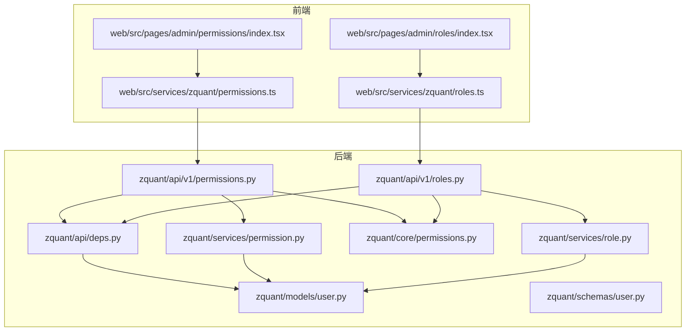
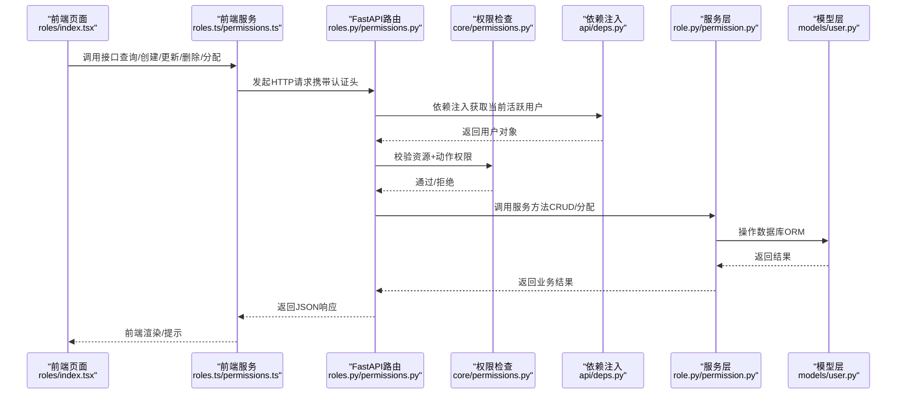
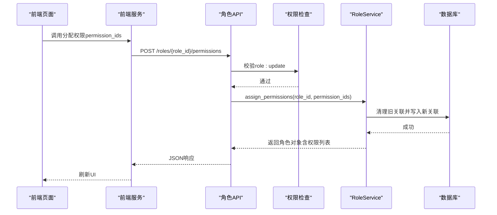
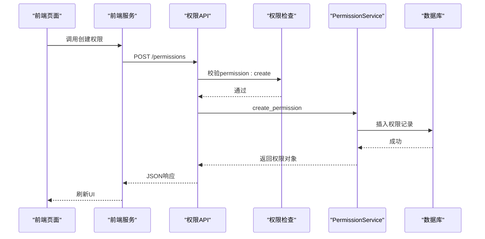
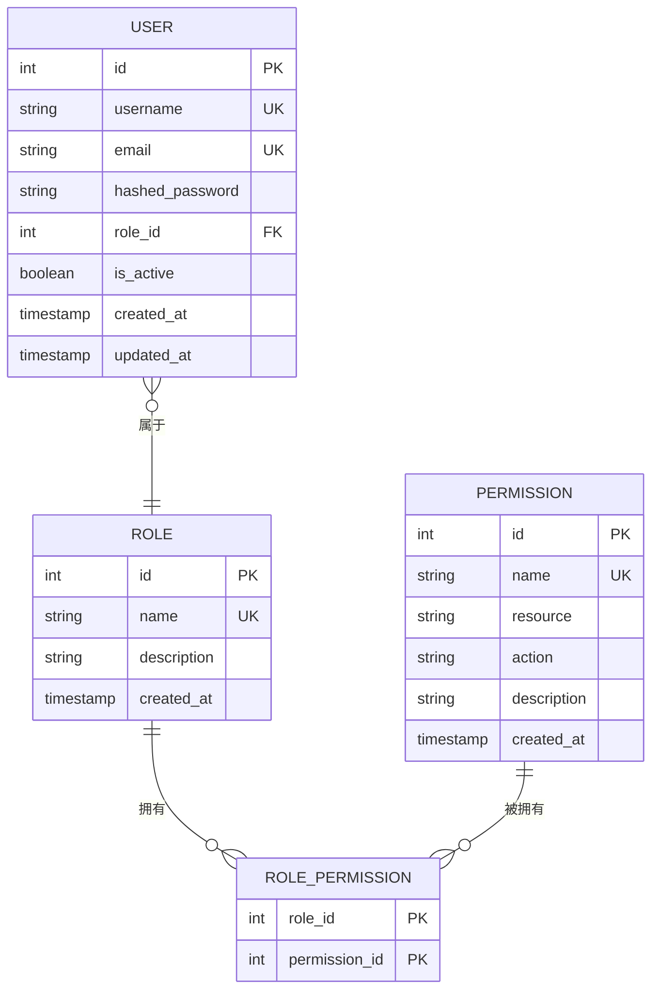
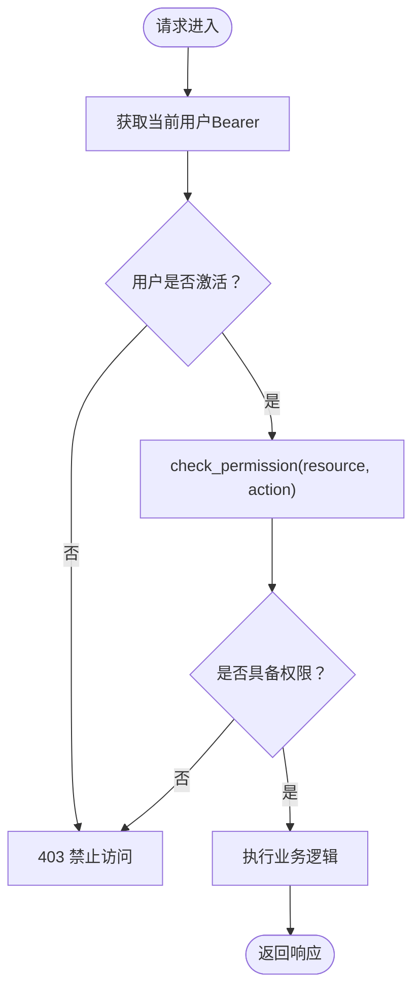
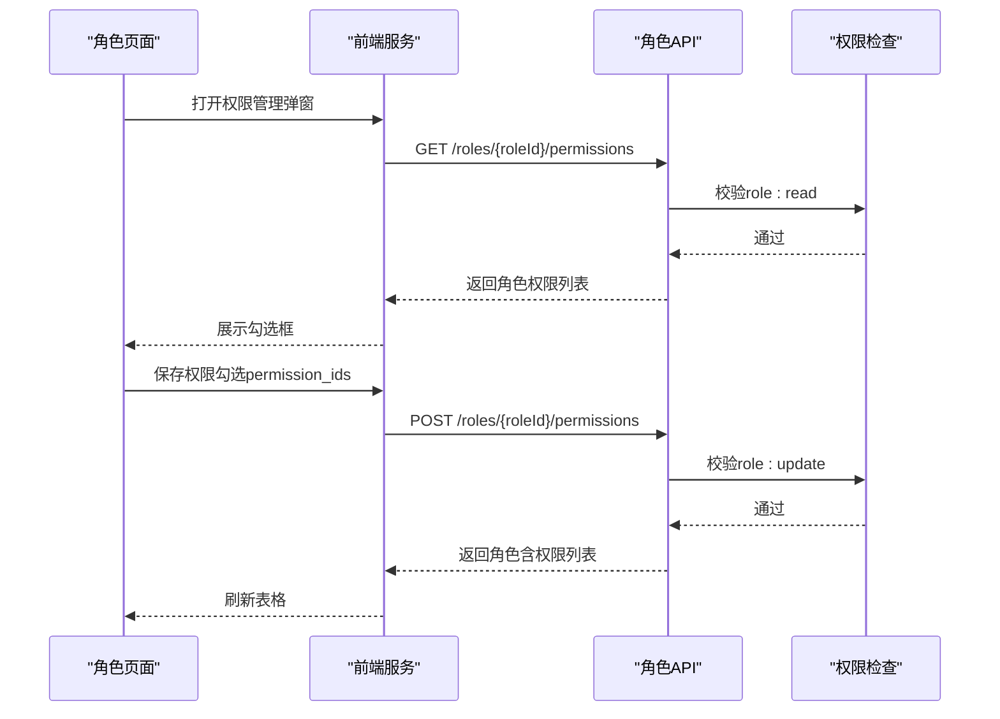
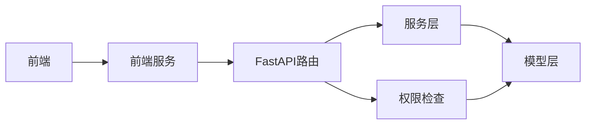

# 角色与权限管理API

<cite>
**本文引用的文件**
- [zquant/api/v1/roles.py](file://zquant/api/v1/roles.py)
- [zquant/api/v1/permissions.py](file://zquant/api/v1/permissions.py)
- [zquant/services/role.py](file://zquant/services/role.py)
- [zquant/services/permission.py](file://zquant/services/permission.py)
- [zquant/models/user.py](file://zquant/models/user.py)
- [zquant/schemas/user.py](file://zquant/schemas/user.py)
- [zquant/core/permissions.py](file://zquant/core/permissions.py)
- [zquant/api/deps.py](file://zquant/api/deps.py)
- [web/src/services/zquant/roles.ts](file://web/src/services/zquant/roles.ts)
- [web/src/services/zquant/permissions.ts](file://web/src/services/zquant/permissions.ts)
- [web/src/pages/admin/roles/index.tsx](file://web/src/pages/admin/roles/index.tsx)
- [web/src/pages/admin/permissions/index.tsx](file://web/src/pages/admin/permissions/index.tsx)
- [web/src/constants/roles.ts](file://web/src/constants/roles.ts)
- [zquant/scripts/init_db.py](file://zquant/scripts/init_db.py)
</cite>

## 目录
1. [简介](#简介)
2. [项目结构](#项目结构)
3. [核心组件](#核心组件)
4. [架构总览](#架构总览)
5. [详细组件分析](#详细组件分析)
6. [依赖分析](#依赖分析)
7. [性能考虑](#性能考虑)
8. [故障排查指南](#故障排查指南)
9. [结论](#结论)
10. [附录](#附录)

## 简介
本文件面向后端与前端开发者，系统化梳理“角色与权限管理API”的设计与实现，重点覆盖：
- 基于RBAC（基于角色的访问控制）的权限模型
- 角色与权限的关联方式（通过permissions数组传递权限ID）
- 与认证系统的集成，实现细粒度访问控制
- 角色与权限的增删改查、分配与移除接口
- 前端如何调用接口完成角色与权限的管理

## 项目结构
围绕角色与权限管理的关键文件组织如下：
- 后端API层：角色与权限的HTTP接口定义
- 服务层：业务逻辑封装（创建、查询、更新、删除、分配权限）
- 模型层：数据库实体及多对多关联表
- 模式层：请求/响应的Pydantic模型
- 认证与权限检查：依赖注入、权限装饰器
- 前端服务与页面：调用后端接口、展示与交互

图表来源
- [zquant/api/v1/roles.py](file://zquant/api/v1/roles.py#L1-L194)
- [zquant/api/v1/permissions.py](file://zquant/api/v1/permissions.py#L1-L120)
- [zquant/services/role.py](file://zquant/services/role.py#L1-L244)
- [zquant/services/permission.py](file://zquant/services/permission.py#L1-L178)
- [zquant/models/user.py](file://zquant/models/user.py#L1-L113)
- [zquant/schemas/user.py](file://zquant/schemas/user.py#L1-L376)
- [zquant/core/permissions.py](file://zquant/core/permissions.py#L1-L111)
- [zquant/api/deps.py](file://zquant/api/deps.py#L1-L93)
- [web/src/services/zquant/roles.ts](file://web/src/services/zquant/roles.ts#L1-L135)
- [web/src/services/zquant/permissions.ts](file://web/src/services/zquant/permissions.ts#L1-L92)
- [web/src/pages/admin/roles/index.tsx](file://web/src/pages/admin/roles/index.tsx#L1-L409)
- [web/src/pages/admin/permissions/index.tsx](file://web/src/pages/admin/permissions/index.tsx#L1-L382)

章节来源
- [zquant/api/v1/roles.py](file://zquant/api/v1/roles.py#L1-L194)
- [zquant/api/v1/permissions.py](file://zquant/api/v1/permissions.py#L1-L120)
- [zquant/services/role.py](file://zquant/services/role.py#L1-L244)
- [zquant/services/permission.py](file://zquant/services/permission.py#L1-L178)
- [zquant/models/user.py](file://zquant/models/user.py#L1-L113)
- [zquant/schemas/user.py](file://zquant/schemas/user.py#L1-L376)
- [zquant/core/permissions.py](file://zquant/core/permissions.py#L1-L111)
- [zquant/api/deps.py](file://zquant/api/deps.py#L1-L93)
- [web/src/services/zquant/roles.ts](file://web/src/services/zquant/roles.ts#L1-L135)
- [web/src/services/zquant/permissions.ts](file://web/src/services/zquant/permissions.ts#L1-L92)
- [web/src/pages/admin/roles/index.tsx](file://web/src/pages/admin/roles/index.tsx#L1-L409)
- [web/src/pages/admin/permissions/index.tsx](file://web/src/pages/admin/permissions/index.tsx#L1-L382)

## 核心组件
- RBAC权限模型
  - 角色（Role）、权限（Permission）、角色-权限关联（RolePermission）三者构成RBAC核心
  - 用户通过角色继承权限；权限由资源+动作组成，如“role:read”
- API接口
  - 角色：查询列表、查询详情（含权限）、创建、更新、删除、查询角色权限、分配权限、添加/移除单个权限
  - 权限：查询列表（支持按资源筛选）、查询详情、创建、更新、删除
- 认证与授权
  - 通过依赖注入获取当前活跃用户
  - 使用装饰器进行资源+动作级权限校验
- 前端集成
  - 提供统一的服务封装与页面组件，支持分页、排序、筛选、批量勾选权限分配

章节来源
- [zquant/models/user.py](file://zquant/models/user.py#L34-L72)
- [zquant/schemas/user.py](file://zquant/schemas/user.py#L106-L164)
- [zquant/schemas/user.py](file://zquant/schemas/user.py#L233-L247)
- [zquant/api/v1/roles.py](file://zquant/api/v1/roles.py#L49-L194)
- [zquant/api/v1/permissions.py](file://zquant/api/v1/permissions.py#L41-L120)
- [zquant/core/permissions.py](file://zquant/core/permissions.py#L38-L111)
- [zquant/api/deps.py](file://zquant/api/deps.py#L41-L93)
- [web/src/services/zquant/roles.ts](file://web/src/services/zquant/roles.ts#L1-L135)
- [web/src/services/zquant/permissions.ts](file://web/src/services/zquant/permissions.ts#L1-L92)

## 架构总览
下图展示了从前端到后端、再到数据库的调用链路与权限检查流程。

图表来源
- [web/src/pages/admin/roles/index.tsx](file://web/src/pages/admin/roles/index.tsx#L1-L409)
- [web/src/services/zquant/roles.ts](file://web/src/services/zquant/roles.ts#L1-L135)
- [web/src/services/zquant/permissions.ts](file://web/src/services/zquant/permissions.ts#L1-L92)
- [zquant/api/v1/roles.py](file://zquant/api/v1/roles.py#L49-L194)
- [zquant/api/v1/permissions.py](file://zquant/api/v1/permissions.py#L41-L120)
- [zquant/core/permissions.py](file://zquant/core/permissions.py#L38-L111)
- [zquant/api/deps.py](file://zquant/api/deps.py#L41-L93)
- [zquant/services/role.py](file://zquant/services/role.py#L1-L244)
- [zquant/services/permission.py](file://zquant/services/permission.py#L1-L178)
- [zquant/models/user.py](file://zquant/models/user.py#L34-L72)

## 详细组件分析

### 角色管理API
- 接口清单
  - GET /api/v1/roles：分页查询角色列表（支持排序）
  - GET /api/v1/roles/{role_id}：查询角色详情（包含权限列表）
  - POST /api/v1/roles：创建角色
  - PUT /api/v1/roles/{role_id}：更新角色
  - DELETE /api/v1/roles/{role_id}：删除角色
  - GET /api/v1/roles/{role_id}/permissions：查询角色权限列表
  - POST /api/v1/roles/{role_id}/permissions：为角色分配权限（传入permission_ids数组）
  - POST /api/v1/roles/{role_id}/permissions/{permission_id}：为角色添加单个权限
  - DELETE /api/v1/roles/{role_id}/permissions/{permission_id}：移除角色的单个权限
- 关键点
  - 分配权限时，服务层会先清理旧关联，再写入新的permission_ids
  - 删除角色前会检查是否仍有用户使用该角色，避免破坏性删除
  - 查询角色详情时，响应体包含权限列表，便于前端展示

图表来源
- [zquant/api/v1/roles.py](file://zquant/api/v1/roles.py#L129-L158)
- [zquant/services/role.py](file://zquant/services/role.py#L162-L191)
- [zquant/schemas/user.py](file://zquant/schemas/user.py#L233-L247)

章节来源
- [zquant/api/v1/roles.py](file://zquant/api/v1/roles.py#L49-L194)
- [zquant/services/role.py](file://zquant/services/role.py#L1-L244)
- [zquant/schemas/user.py](file://zquant/schemas/user.py#L233-L247)
- [web/src/services/zquant/roles.ts](file://web/src/services/zquant/roles.ts#L91-L135)
- [web/src/pages/admin/roles/index.tsx](file://web/src/pages/admin/roles/index.tsx#L1-L409)

### 权限管理API
- 接口清单
  - GET /api/v1/permissions：分页查询权限列表（支持按资源筛选、排序）
  - GET /api/v1/permissions/{permission_id}：查询权限详情
  - POST /api/v1/permissions：创建权限（资源+动作唯一约束）
  - PUT /api/v1/permissions/{permission_id}：更新权限
  - DELETE /api/v1/permissions/{permission_id}：删除权限（若仍有角色使用则拒绝）
- 关键点
  - 权限以“资源:动作”命名，如“role:read”，便于与装饰器校验一致
  - 删除权限前会检查是否仍被角色使用，避免破坏性删除

图表来源
- [zquant/api/v1/permissions.py](file://zquant/api/v1/permissions.py#L74-L120)
- [zquant/services/permission.py](file://zquant/services/permission.py#L40-L62)
- [zquant/schemas/user.py](file://zquant/schemas/user.py#L134-L164)

章节来源
- [zquant/api/v1/permissions.py](file://zquant/api/v1/permissions.py#L41-L120)
- [zquant/services/permission.py](file://zquant/services/permission.py#L1-L178)
- [zquant/schemas/user.py](file://zquant/schemas/user.py#L134-L164)
- [web/src/services/zquant/permissions.ts](file://web/src/services/zquant/permissions.ts#L1-L92)
- [web/src/pages/admin/permissions/index.tsx](file://web/src/pages/admin/permissions/index.tsx#L1-L382)

### RBAC权限模型与关联
- 数据模型
  - Role：角色表，包含名称、描述、创建时间
  - Permission：权限表，包含名称、资源、动作、描述、创建时间
  - RolePermission：角色-权限关联表，多对多
  - User：用户表，外键指向角色
- 关联关系
  - Role.permissions 与 Permission.roles 为多对多
  - User.role 为一对多
- 权限来源
  - 用户的权限来自其角色所拥有的权限集合

图表来源
- [zquant/models/user.py](file://zquant/models/user.py#L34-L72)

章节来源
- [zquant/models/user.py](file://zquant/models/user.py#L34-L72)

### 认证与授权集成
- 依赖注入
  - 通过HTTP Bearer获取当前用户，校验是否激活
- 权限检查
  - 装饰器check_permission(resource, action)在进入业务处理前校验用户是否具备对应权限
  - has_permission通过用户角色与权限表关联查询，判断是否存在匹配的资源+动作
- 角色要求
  - require_role可限定特定角色访问
  - is_admin快速判断管理员

图表来源
- [zquant/api/deps.py](file://zquant/api/deps.py#L41-L93)
- [zquant/core/permissions.py](file://zquant/core/permissions.py#L38-L111)

章节来源
- [zquant/api/deps.py](file://zquant/api/deps.py#L1-L93)
- [zquant/core/permissions.py](file://zquant/core/permissions.py#L1-L111)

### 前端调用与交互
- 角色页面
  - 支持创建、编辑、删除角色
  - 权限管理弹窗中，按资源分组展示所有权限，勾选后提交permission_ids数组
- 权限页面
  - 支持创建、编辑、删除权限
  - 提供资源类型与动作类型的下拉选择
- 常量
  - 角色ID常量（如ADMIN_ROLE_ID、RESEARCHER_ROLE_ID、USER_ROLE_ID）

图表来源
- [web/src/pages/admin/roles/index.tsx](file://web/src/pages/admin/roles/index.tsx#L1-L409)
- [web/src/services/zquant/roles.ts](file://web/src/services/zquant/roles.ts#L91-L135)
- [zquant/api/v1/roles.py](file://zquant/api/v1/roles.py#L129-L158)
- [zquant/core/permissions.py](file://zquant/core/permissions.py#L38-L111)

章节来源
- [web/src/pages/admin/roles/index.tsx](file://web/src/pages/admin/roles/index.tsx#L1-L409)
- [web/src/pages/admin/permissions/index.tsx](file://web/src/pages/admin/permissions/index.tsx#L1-L382)
- [web/src/services/zquant/roles.ts](file://web/src/services/zquant/roles.ts#L1-L135)
- [web/src/services/zquant/permissions.ts](file://web/src/services/zquant/permissions.ts#L1-L92)
- [web/src/constants/roles.ts](file://web/src/constants/roles.ts#L1-L45)

## 依赖分析
- 组件耦合
  - API层依赖服务层与权限检查模块
  - 服务层依赖模型层（ORM）
  - 前端服务封装HTTP请求，页面负责交互与状态管理
- 外部依赖
  - FastAPI、SQLAlchemy、Pydantic
  - 前端Ant Design Pro组件库、Umi Max请求封装

图表来源
- [zquant/api/v1/roles.py](file://zquant/api/v1/roles.py#L1-L194)
- [zquant/api/v1/permissions.py](file://zquant/api/v1/permissions.py#L1-L120)
- [zquant/services/role.py](file://zquant/services/role.py#L1-L244)
- [zquant/services/permission.py](file://zquant/services/permission.py#L1-L178)
- [zquant/models/user.py](file://zquant/models/user.py#L1-L113)
- [zquant/core/permissions.py](file://zquant/core/permissions.py#L1-L111)
- [web/src/services/zquant/roles.ts](file://web/src/services/zquant/roles.ts#L1-L135)
- [web/src/services/zquant/permissions.ts](file://web/src/services/zquant/permissions.ts#L1-L92)

章节来源
- [zquant/api/v1/roles.py](file://zquant/api/v1/roles.py#L1-L194)
- [zquant/api/v1/permissions.py](file://zquant/api/v1/permissions.py#L1-L120)
- [zquant/services/role.py](file://zquant/services/role.py#L1-L244)
- [zquant/services/permission.py](file://zquant/services/permission.py#L1-L178)
- [zquant/models/user.py](file://zquant/models/user.py#L1-L113)
- [zquant/core/permissions.py](file://zquant/core/permissions.py#L1-L111)
- [web/src/services/zquant/roles.ts](file://web/src/services/zquant/roles.ts#L1-L135)
- [web/src/services/zquant/permissions.ts](file://web/src/services/zquant/permissions.ts#L1-L92)

## 性能考虑
- 分页与排序
  - API层支持skip/limit与order_by/order，建议前端按需设置，避免一次性加载过多数据
- 关联查询
  - 角色详情包含权限列表，注意权限数量较多时的序列化与传输开销
- 权限分配
  - 分配权限时会清空旧关联再批量写入，权限数量大时建议分批或优化批量插入策略
- 数据库索引
  - 名称字段（如Role.name、Permission.name）已建立唯一索引，有助于去重与唯一性校验

[本节为通用指导，无需列出具体文件来源]

## 故障排查指南
- 401 未认证
  - 检查请求头是否包含有效的Bearer Token
  - 确认数据库初始化脚本已执行，避免表不存在导致的503
- 403 权限不足
  - 确认当前用户角色是否具备所需资源+动作权限
  - 使用装饰器require_role限定角色时，确保用户角色名匹配
- 404 资源不存在
  - 角色或权限ID无效；请先通过GET /permissions获取可用权限ID
- 400 参数错误
  - 角色名重复、权限名重复、权限ID缺失或非法
- 删除失败
  - 角色仍被用户使用；权限仍被角色使用

章节来源
- [zquant/api/deps.py](file://zquant/api/deps.py#L41-L93)
- [zquant/core/permissions.py](file://zquant/core/permissions.py#L38-L111)
- [zquant/services/role.py](file://zquant/services/role.py#L130-L152)
- [zquant/services/permission.py](file://zquant/services/permission.py#L156-L178)

## 结论
本项目采用清晰的RBAC模型与RESTful API设计，结合装饰器权限检查与依赖注入，实现了细粒度的访问控制。前端通过统一的服务封装与页面组件，提供了直观的角色与权限管理体验。权限分配通过permission_ids数组实现，简单明确，便于扩展与维护。

[本节为总结，无需列出具体文件来源]

## 附录

### API定义与示例

- 获取权限列表（用于创建角色时选择权限）
  - 方法与路径：GET /api/v1/permissions
  - 查询参数：skip、limit、resource（资源类型筛选）、order_by、order
  - 响应：分页对象，items为权限列表
  - 示例路径参考：[web/src/services/zquant/permissions.ts](file://web/src/services/zquant/permissions.ts#L1-L92)

- 创建角色（含权限分配）
  - 方法与路径：POST /api/v1/roles
  - 请求体：RoleCreate（name、description）
  - 响应：RoleResponse
  - 示例路径参考：[web/src/services/zquant/roles.ts](file://web/src/services/zquant/roles.ts#L57-L65)

- 为角色分配权限（传入权限ID列表）
  - 方法与路径：POST /api/v1/roles/{role_id}/permissions
  - 请求体：AssignPermissionsRequest（permission_ids: 数组）
  - 响应：RoleResponse（包含权限列表）
  - 示例路径参考：[web/src/services/zquant/roles.ts](file://web/src/services/zquant/roles.ts#L105-L113)

- 权限ID来源
  - 通过GET /permissions获取所有权限列表，提取id字段作为permission_ids数组元素
  - 示例路径参考：[web/src/pages/admin/roles/index.tsx](file://web/src/pages/admin/roles/index.tsx#L43-L54)

- 初始化权限示例（数据库脚本）
  - 包含role、permission、user等资源的常见权限条目
  - 示例路径参考：[zquant/scripts/init_db.py](file://zquant/scripts/init_db.py#L129-L144)

章节来源
- [web/src/services/zquant/permissions.ts](file://web/src/services/zquant/permissions.ts#L1-L92)
- [web/src/services/zquant/roles.ts](file://web/src/services/zquant/roles.ts#L57-L65)
- [web/src/services/zquant/roles.ts](file://web/src/services/zquant/roles.ts#L105-L113)
- [web/src/pages/admin/roles/index.tsx](file://web/src/pages/admin/roles/index.tsx#L43-L54)
- [zquant/scripts/init_db.py](file://zquant/scripts/init_db.py#L129-L144)