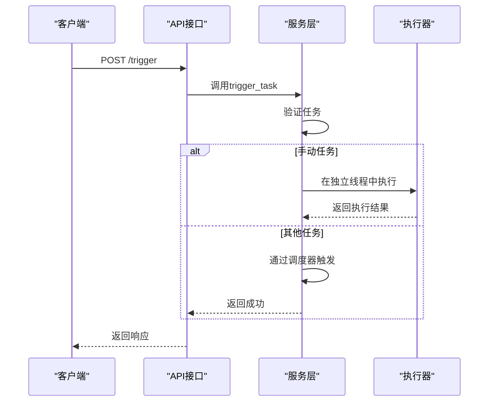
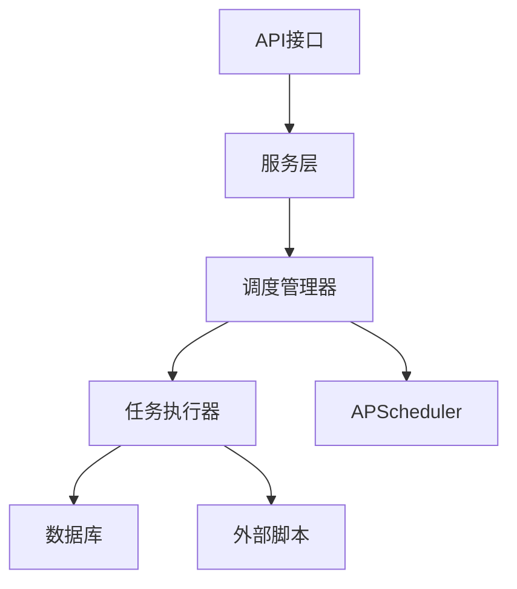
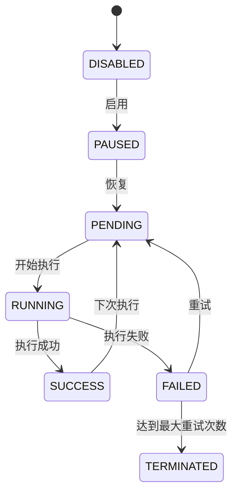

# 调度管理API

<cite>
**本文档引用的文件**
- [scheduler.py](file://zquant/api/v1/scheduler.py)
- [scheduler.py](file://zquant/models/scheduler.py)
- [scheduler.py](file://zquant/schemas/scheduler.py)
- [scheduler.py](file://zquant/services/scheduler.py)
- [manager.py](file://zquant/scheduler/manager.py)
- [executor.py](file://zquant/scheduler/executor.py)
- [common_executor.py](file://zquant/scheduler/executors/common_executor.py)
- [script_executor.py](file://zquant/scheduler/executors/script_executor.py)
- [workflow_executor.py](file://zquant/scheduler/executors/workflow_executor.py)
- [scheduler_guide.md](file://docs/scheduler_guide.md)
</cite>

## 目录
1. [简介](#简介)
2. [核心功能](#核心功能)
3. [任务类型详解](#任务类型详解)
4. [Cron表达式格式](#cron表达式格式)
5. [API接口说明](#api接口说明)
6. [手动执行任务](#手动执行任务)
7. [执行历史与状态](#执行历史与状态)
8. [后台执行机制](#后台执行机制)
9. [可靠性保障](#可靠性保障)
10. [最佳实践](#最佳实践)

## 简介
调度管理API是ZQuant平台的核心组件，提供完整的任务调度和管理功能。该系统基于APScheduler构建，支持灵活的调度配置、实时状态监控、完整的执行历史记录和Web界面管理。

**Section sources**
- [scheduler_guide.md](file://docs/scheduler_guide.md#L1-L20)

## 核心功能
调度管理API提供以下核心功能：
- **任务管理**：创建、更新、删除定时任务
- **调度配置**：支持Cron表达式和间隔调度
- **状态控制**：启用、禁用、暂停、恢复任务
- **手动触发**：立即执行任务，不等待调度时间
- **执行历史**：查看任务执行记录和详细日志
- **统计信息**：获取任务执行成功率、平均时长等统计

**Section sources**
- [scheduler.py](file://zquant/api/v1/scheduler.py#L51-L248)

## 任务类型详解
系统支持多种任务类型，通过`task_type`参数指定。

### 手动任务 (manual_task)
手动任务不支持自动调度，只能通过手动触发执行。适用于需要按需执行的任务。

**特点**：
- 不支持Cron表达式调度
- 不支持间隔调度
- 只能通过"触发"按钮手动执行

**使用场景**：
- 数据修复任务
- 临时数据分析任务
- 按需执行的报表生成任务

### 通用任务 (common_task)
通用任务支持自动调度，可以独立执行。支持Cron表达式调度和间隔调度。

**配置示例**：
```json
{
  "task_type": "common_task",
  "cron_expression": "0 18 * * *",
  "config": {
    "command": "python script.py"
  }
}
```

### 编排任务 (workflow)
编排任务支持串行和并行执行多个任务，支持任务依赖关系。

**配置示例**：
```json
{
  "task_type": "workflow",
  "config": {
    "workflow_type": "serial",
    "tasks": [
      {
        "task_id": 1,
        "name": "任务1",
        "dependencies": []
      },
      {
        "task_id": 2,
        "name": "任务2",
        "dependencies": [1]
      }
    ],
    "on_failure": "stop"
  }
}
```

**Section sources**
- [scheduler.py](file://zquant/api/v1/scheduler.py#L60-L65)
- [scheduler.py](file://zquant/models/scheduler.py#L60-L65)
- [scheduler_guide.md](file://docs/scheduler_guide.md#L774-L794)

## Cron表达式格式
Cron表达式用于定义复杂的调度计划，格式为`分 时 日 月 周`。

### 基本格式
```
* * * * *
│ │ │ │ │
│ │ │ │ └── 周 (0-6, 0=周日)
│ │ │ └──── 月 (1-12)
│ │ └────── 日 (1-31)
│ └──────── 时 (0-23)
└────────── 分 (0-59)
```

### 常用示例
| 表达式 | 含义 |
|--------|------|
| `0 18 * * *` | 每天18:00执行 |
| `0 2 * * 1` | 每周一凌晨2点执行 |
| `*/30 * * * *` | 每30分钟执行一次 |
| `0 0 1 * *` | 每月1日00:00执行 |
| `0 0 * * 1-5` | 工作日每天00:00执行 |

### 特殊字符
- `*`：任意值
- `*/n`：每隔n个单位执行
- `,`：指定多个值
- `-`：指定范围

**Section sources**
- [scheduler.py](file://zquant/models/scheduler.py#L77-L77)
- [manager.py](file://zquant/scheduler/manager.py#L261-L271)
- [scheduler_guide.md](file://docs/scheduler_guide.md#L127-L128)

## API接口说明
调度管理API提供RESTful接口，支持任务的全生命周期管理。

### 获取任务列表
```http
GET /api/v1/scheduler/tasks
```

**查询参数**：
- `skip`：跳过记录数
- `limit`：返回记录数
- `task_type`：任务类型过滤
- `enabled`：启用状态过滤

### 创建Cron任务
```http
POST /api/v1/scheduler/tasks
```

**请求体**：
```json
{
  "name": "任务名称",
  "task_type": "common_task",
  "cron_expression": "0 18 * * *",
  "description": "任务描述",
  "config": {},
  "max_retries": 3,
  "retry_interval": 60,
  "enabled": true
}
```

### 更新任务
```http
PUT /api/v1/scheduler/tasks/{task_id}
```

### 删除任务
```http
DELETE /api/v1/scheduler/tasks/{task_id}
```

**Section sources**
- [scheduler.py](file://zquant/api/v1/scheduler.py#L91-L184)

## 手动执行任务
通过POST请求可以手动触发任务执行。

### 触发任务
```http
POST /api/v1/scheduler/tasks/{task_id}/trigger
```

**响应示例**：
```json
{
  "message": "任务已触发"
}
```

### 执行流程
1. 系统验证任务是否存在
2. 对于手动任务，在独立线程中直接执行
3. 对于其他任务，通过调度器触发
4. 创建执行记录并返回成功响应



**Diagram sources**
- [scheduler.py](file://zquant/api/v1/scheduler.py#L188-L198)
- [scheduler.py](file://zquant/services/scheduler.py#L392-L491)

## 执行历史与状态
系统记录所有任务的执行历史，便于监控和故障排查。

### 获取执行历史
```http
GET /api/v1/scheduler/tasks/{task_id}/executions
```

### 执行状态
| 状态 | 说明 |
|------|------|
| pending | 等待中 |
| running | 运行中 |
| success | 成功 |
| failed | 失败 |
| completed | 已完成 |
| terminated | 异常终止 |

### 执行记录结构
```json
{
  "id": 1,
  "task_id": 1,
  "status": "success",
  "start_time": "2025-01-01T18:00:00",
  "end_time": "2025-01-01T18:01:30",
  "duration_seconds": 90,
  "result": {},
  "error_message": null,
  "retry_count": 0
}
```

**Section sources**
- [scheduler.py](file://zquant/api/v1/scheduler.py#L250-L291)
- [scheduler.py](file://zquant/models/scheduler.py#L115-L122)

## 后台执行机制
调度系统采用多层架构，确保任务可靠执行。

### 架构组件


### 任务执行流程
1. API接收创建任务请求
2. 服务层验证并保存任务配置
3. 调度管理器将任务添加到APScheduler
4. APScheduler在指定时间触发任务
5. 任务执行器在独立线程中执行任务
6. 执行结果保存到数据库

**Section sources**
- [manager.py](file://zquant/scheduler/manager.py#L46-L474)
- [executor.py](file://zquant/scheduler/executor.py#L36-L151)

## 可靠性保障
系统提供多种机制确保任务执行的可靠性。

### 重试机制
- 支持配置最大重试次数（`max_retries`）
- 支持配置重试间隔（`retry_interval`）
- 任务失败后自动在独立线程中重试

### 线程安全
- 每个任务在独立线程中执行
- 使用线程池管理执行线程
- 避免阻塞主线程

### 状态监控
- 实时计算任务调度状态
- 支持多种状态：禁用、暂停、等待、运行中、成功、失败
- 自动处理过期和延迟任务



**Diagram sources**
- [scheduler.py](file://zquant/models/scheduler.py#L49-L57)
- [scheduler.py](file://zquant/services/scheduler.py#L630-L708)

## 最佳实践
### 任务命名规范
- 使用有意义的名称
- 包含任务类型和功能描述
- 示例：`STEP1-同步交易日历（当日）-命令执行`

### 错误处理
- 配置合理的重试次数和间隔
- 在任务配置中包含超时时间
- 记录详细的错误信息

### 性能优化
- 合理设置线程池大小
- 避免长时间任务阻塞调度器
- 使用编排任务优化执行顺序

**Section sources**
- [init_scheduler.py](file://zquant/scripts/init_scheduler.py#L222-L410)
- [scheduler_guide.md](file://docs/scheduler_guide.md#L1-L1256)