# 通知中心API

<cite>
**本文引用的文件**
- [zquant/api/v1/notifications.py](file://zquant/api/v1/notifications.py)
- [zquant/services/notification.py](file://zquant/services/notification.py)
- [zquant/models/notification.py](file://zquant/models/notification.py)
- [zquant/schemas/notification.py](file://zquant/schemas/notification.py)
- [web/src/services/zquant/notifications.ts](file://web/src/services/zquant/notifications.ts)
- [web/src/pages/notifications/index.tsx](file://web/src/pages/notifications/index.tsx)
- [zquant/main.py](file://zquant/main.py)
- [zquant/tests/unittest/test_notification_service.py](file://zquant/tests/unittest/test_notification_service.py)
</cite>

## 目录
1. [简介](#简介)
2. [项目结构](#项目结构)
3. [核心组件](#核心组件)
4. [架构总览](#架构总览)
5. [详细组件分析](#详细组件分析)
6. [依赖关系分析](#依赖关系分析)
7. [性能考虑](#性能考虑)
8. [故障排查指南](#故障排查指南)
9. [结论](#结论)
10. [附录](#附录)

## 简介
本文件面向开发者，系统化说明通知中心API的设计与使用，覆盖以下目标：
- 获取通知列表（支持分页与“已读/未读”过滤）
- 标记单条或全部通知为已读
- 说明分页参数（page/size）与 is_read 查询参数的使用方式
- 解释PUT /read 和 PUT /read-all端点的幂等性设计
- 描述通知API如何与系统事件（如回测完成、任务失败）集成，实现消息推送，帮助开发者构建实时通知功能

## 项目结构
通知中心API位于后端FastAPI路由模块，配合服务层、模型层与前端调用层共同构成完整能力：
- 后端路由：zquant/api/v1/notifications.py
- 服务层：zquant/services/notification.py
- 数据模型：zquant/models/notification.py
- Pydantic模型：zquant/schemas/notification.py
- 前端调用封装：web/src/services/zquant/notifications.ts
- 前端页面：web/src/pages/notifications/index.tsx
- 应用入口注册：zquant/main.py

图表来源
- [zquant/api/v1/notifications.py](file://zquant/api/v1/notifications.py#L47-L130)
- [zquant/services/notification.py](file://zquant/services/notification.py#L68-L165)
- [zquant/models/notification.py](file://zquant/models/notification.py#L37-L70)
- [zquant/schemas/notification.py](file://zquant/schemas/notification.py#L36-L112)
- [web/src/services/zquant/notifications.ts](file://web/src/services/zquant/notifications.ts#L27-L109)
- [web/src/pages/notifications/index.tsx](file://web/src/pages/notifications/index.tsx#L83-L135)
- [zquant/main.py](file://zquant/main.py#L217-L231)

章节来源
- [zquant/api/v1/notifications.py](file://zquant/api/v1/notifications.py#L47-L130)
- [zquant/main.py](file://zquant/main.py#L217-L231)

## 核心组件
- 路由与端点
  - GET /api/v1/notifications：获取通知列表（分页、筛选、排序）
  - GET /api/v1/notifications/stats：获取未读统计
  - GET /api/v1/notifications/{notification_id}：获取通知详情
  - PUT /api/v1/notifications/{notification_id}/read：标记单条通知为已读
  - PUT /api/v1/notifications/read-all：全部标记为已读
  - DELETE /api/v1/notifications/{notification_id}：删除通知
  - POST /api/v1/notifications：创建通知（管理员或系统）

- 服务层
  - NotificationService：封装通知的增删改查、统计、标记已读、批量标记已读等业务逻辑

- 数据模型
  - Notification：通知表，包含用户ID、类型、标题、内容、是否已读、额外数据、时间戳等字段，并建立索引优化查询

- Pydantic模型
  - NotificationCreate/NotificationUpdate/NotificationResponse/NotificationListResponse/NotificationStatsResponse：统一输入输出结构

- 前端调用
  - notifications.ts：封装对后端通知API的HTTP请求
  - notifications/index.tsx：前端页面展示通知列表、统计、筛选、分页与标记已读/删除操作

章节来源
- [zquant/api/v1/notifications.py](file://zquant/api/v1/notifications.py#L47-L130)
- [zquant/services/notification.py](file://zquant/services/notification.py#L68-L165)
- [zquant/models/notification.py](file://zquant/models/notification.py#L37-L70)
- [zquant/schemas/notification.py](file://zquant/schemas/notification.py#L36-L112)
- [web/src/services/zquant/notifications.ts](file://web/src/services/zquant/notifications.ts#L27-L109)
- [web/src/pages/notifications/index.tsx](file://web/src/pages/notifications/index.tsx#L83-L135)

## 架构总览
通知中心API采用经典的三层架构：
- 表现层（FastAPI路由）负责参数校验、鉴权与响应模型转换
- 业务层（服务类）负责数据访问与业务规则
- 数据层（SQLAlchemy模型）负责持久化与索引优化

图表来源
- [zquant/api/v1/notifications.py](file://zquant/api/v1/notifications.py#L47-L130)
- [zquant/services/notification.py](file://zquant/services/notification.py#L68-L165)
- [zquant/models/notification.py](file://zquant/models/notification.py#L37-L70)
- [web/src/pages/notifications/index.tsx](file://web/src/pages/notifications/index.tsx#L83-L135)

## 详细组件分析

### 1) 获取通知列表（分页与过滤）
- 端点：GET /api/v1/notifications
- 支持参数
  - skip/limit：分页控制（skip为跳过记录数，limit为每页记录数）
  - is_read：布尔过滤，仅返回已读或未读通知
  - type：通知类型过滤（system、strategy、backtest、data、warning）
  - order_by：排序字段（created_at、updated_at）
  - order：排序方向（asc/desc）
- 返回结构：NotificationListResponse（items、total、skip、limit）
- 服务层实现要点
  - 按用户过滤
  - 可选is_read/type过滤
  - order_by/order控制排序
  - offset/limit分页
  - count统计总数

图表来源
- [zquant/api/v1/notifications.py](file://zquant/api/v1/notifications.py#L47-L65)
- [zquant/services/notification.py](file://zquant/services/notification.py#L68-L108)

章节来源
- [zquant/api/v1/notifications.py](file://zquant/api/v1/notifications.py#L47-L65)
- [zquant/services/notification.py](file://zquant/services/notification.py#L68-L108)
- [zquant/schemas/notification.py](file://zquant/schemas/notification.py#L95-L112)

### 2) 标记单条通知为已读（幂等性）
- 端点：PUT /api/v1/notifications/{notification_id}/read
- 功能：将指定通知标记为已读
- 幂等性设计：无论调用多少次，只要通知存在且属于当前用户，最终都会处于“已读”状态；重复调用不会产生副作用
- 实现要点
  - 通过服务层先获取通知（校验归属），再设置is_read=True并提交
  - 若通知不存在，抛出404错误

图表来源
- [zquant/api/v1/notifications.py](file://zquant/api/v1/notifications.py#L87-L97)
- [zquant/services/notification.py](file://zquant/services/notification.py#L123-L131)

章节来源
- [zquant/api/v1/notifications.py](file://zquant/api/v1/notifications.py#L87-L97)
- [zquant/services/notification.py](file://zquant/services/notification.py#L123-L131)

### 3) 全部标记为已读（幂等性）
- 端点：PUT /api/v1/notifications/read-all
- 功能：将当前用户的所有未读通知标记为已读
- 幂等性设计：多次调用只生效一次，最终未读数为0；重复调用不会改变结果
- 实现要点
  - 通过服务层批量更新未读通知的is_read字段
  - 返回已更新的数量

```mermaid
sequenceDiagram
participant FE as "前端"
participant API as "PUT /read-all"
participant Svc as "mark_all_as_read"
participant DB as "数据库"
FE->>API : PUT /api/v1/notifications/read-all
API->>Svc : 批量更新未读通知为已读
Svc->>DB : UPDATE ... WHERE is_read=false
DB-->>Svc : 返回影响条数
Svc-->>API : 返回影响条数
API-->>FE : 返回成功信息
```

图表来源
- [zquant/api/v1/notifications.py](file://zquant/api/v1/notifications.py#L99-L106)
- [zquant/services/notification.py](file://zquant/services/notification.py#L132-L141)

章节来源
- [zquant/api/v1/notifications.py](file://zquant/api/v1/notifications.py#L99-L106)
- [zquant/services/notification.py](file://zquant/services/notification.py#L132-L141)

### 4) 通知类型与额外数据
- 通知类型：system、strategy、backtest、data、warning
- 额外数据：extra_data以JSON形式存储，支持在创建通知时传入，便于携带业务上下文（如策略ID、回测ID等）

章节来源
- [zquant/models/notification.py](file://zquant/models/notification.py#L37-L46)
- [zquant/schemas/notification.py](file://zquant/schemas/notification.py#L36-L57)
- [zquant/tests/unittest/test_models.py](file://zquant/tests/unittest/test_models.py#L149-L199)

### 5) 与系统事件的集成（回测完成/失败）
- 回测完成后，系统可在数据库中创建一条“回测完成”的通知（类型为backtest），并携带回测ID、指标摘要等额外数据
- 回测失败时，系统可创建一条“回测失败”的通知（类型为backtest），并记录错误信息
- 前端通过通知API拉取并展示这些事件通知，实现消息推送与提醒

章节来源
- [zquant/services/backtest.py](file://zquant/services/backtest.py#L124-L161)
- [zquant/models/notification.py](file://zquant/models/notification.py#L37-L46)
- [zquant/schemas/notification.py](file://zquant/schemas/notification.py#L36-L57)

## 依赖关系分析
- 路由依赖服务层，服务层依赖模型层进行数据访问
- 前端通过notifications.ts封装的HTTP方法调用后端API
- 应用入口在main.py中注册通知路由

图表来源
- [zquant/api/v1/notifications.py](file://zquant/api/v1/notifications.py#L47-L130)
- [zquant/services/notification.py](file://zquant/services/notification.py#L68-L165)
- [zquant/models/notification.py](file://zquant/models/notification.py#L37-L70)
- [zquant/schemas/notification.py](file://zquant/schemas/notification.py#L36-L112)
- [web/src/services/zquant/notifications.ts](file://web/src/services/zquant/notifications.ts#L27-L109)
- [web/src/pages/notifications/index.tsx](file://web/src/pages/notifications/index.tsx#L83-L135)
- [zquant/main.py](file://zquant/main.py#L217-L231)

章节来源
- [zquant/main.py](file://zquant/main.py#L217-L231)

## 性能考虑
- 分页与排序
  - skip/limit用于分页，避免一次性返回大量数据
  - order_by支持created_at/updated_at，order支持asc/desc
- 索引优化
  - 模型层已为user_id、is_read、created_at等字段建立索引，有助于提升查询与统计效率
- 统计接口
  - 提供未读统计与总数统计，减少前端重复计算
- 批量更新
  - 全部标记为已读采用批量UPDATE，避免逐条更新带来的网络与事务开销

章节来源
- [zquant/models/notification.py](file://zquant/models/notification.py#L66-L70)
- [zquant/services/notification.py](file://zquant/services/notification.py#L132-L141)
- [zquant/api/v1/notifications.py](file://zquant/api/v1/notifications.py#L66-L73)

## 故障排查指南
- 404 未找到
  - 当查询或更新的通知不存在或不属于当前用户时，会返回404
  - 前端在调用失败时会弹出错误提示并打印日志
- 参数校验
  - skip需非负，limit需在1~100范围内
  - order只能为asc或desc
- 幂等性验证
  - 标记已读与全部标记已读可重复调用，不会产生副作用
- 单元测试参考
  - 测试覆盖了创建通知、分页、过滤、标记已读、批量标记、删除、统计等场景

章节来源
- [zquant/api/v1/notifications.py](file://zquant/api/v1/notifications.py#L47-L65)
- [zquant/tests/unittest/test_notification_service.py](file://zquant/tests/unittest/test_notification_service.py#L40-L220)
- [web/src/pages/notifications/index.tsx](file://web/src/pages/notifications/index.tsx#L111-L135)

## 结论
通知中心API提供了完善的列表查询、过滤、分页、统计与标记已读能力，并通过幂等设计确保调用安全性。结合系统事件（如回测完成/失败），可快速构建实时通知功能，帮助开发者实现消息推送与用户提醒。前端通过notifications.ts与通知页面实现直观的交互体验。

## 附录

### A. API定义与参数说明
- GET /api/v1/notifications
  - 查询参数：skip（跳过记录数）、limit（每页记录数）、is_read（是否已读）、type（通知类型）、order_by（排序字段）、order（排序方向）
  - 响应：NotificationListResponse（items、total、skip、limit）
- GET /api/v1/notifications/stats
  - 响应：NotificationStatsResponse（unread_count、total_count）
- GET /api/v1/notifications/{notification_id}
  - 响应：NotificationResponse
- PUT /api/v1/notifications/{notification_id}/read
  - 响应：NotificationResponse
- PUT /api/v1/notifications/read-all
  - 响应：包含message与count的对象
- DELETE /api/v1/notifications/{notification_id}
  - 响应：{"message": "通知已删除"}
- POST /api/v1/notifications
  - 请求体：NotificationCreate
  - 响应：NotificationResponse

章节来源
- [zquant/api/v1/notifications.py](file://zquant/api/v1/notifications.py#L47-L130)
- [zquant/schemas/notification.py](file://zquant/schemas/notification.py#L36-L112)

### B. 前端调用与页面行为
- 前端通过notifications.ts封装的函数调用后端API
- 页面支持筛选（全部/未读/已读/按类型）、分页、标记已读、删除通知、刷新统计

章节来源
- [web/src/services/zquant/notifications.ts](file://web/src/services/zquant/notifications.ts#L27-L109)
- [web/src/pages/notifications/index.tsx](file://web/src/pages/notifications/index.tsx#L83-L135)