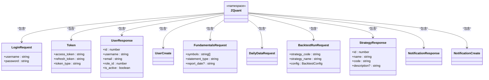

# API客户端

<cite>
**本文档引用的文件**   
- [auth.ts](file://web/src/services/zquant/auth.ts)
- [backtest.ts](file://web/src/services/zquant/backtest.ts)
- [data.ts](file://web/src/services/zquant/data.ts)
- [index.ts](file://web/src/services/zquant/index.ts)
- [typings.d.ts](file://web/src/services/zquant/typings.d.ts)
- [requestErrorConfig.ts](file://web/src/requestErrorConfig.ts)
- [users.ts](file://web/src/services/zquant/users.ts)
- [roles.ts](file://web/src/services/zquant/roles.ts)
- [permissions.ts](file://web/src/services/zquant/permissions.ts)
- [notifications.ts](file://web/src/services/zquant/notifications.ts)
- [favorite.ts](file://web/src/services/zquant/favorite.ts)
- [position.ts](file://web/src/services/zquant/position.ts)
- [config.ts](file://web/src/services/zquant/config.ts)
- [dashboard.ts](file://web/src/services/zquant/dashboard.ts)
- [scheduler.ts](file://web/src/services/zquant/scheduler.ts)
</cite>

## 目录
1. [API客户端架构概述](#api客户端架构概述)
2. [API服务模块组织](#api服务模块组织)
3. [统一请求与响应处理](#统一请求与响应处理)
4. [JWT认证与自动刷新机制](#jwt认证与自动刷新机制)
5. [全局错误处理策略](#全局错误处理策略)
6. [API调用最佳实践](#api调用最佳实践)
7. [类型安全与接口版本管理](#类型安全与接口版本管理)

## API客户端架构概述

zquant前端API客户端基于UmiJS请求插件构建，采用模块化设计模式，将不同业务领域的API接口封装在独立的服务模块中。整个API客户端架构遵循RESTful设计原则，通过统一的请求配置和拦截器机制实现跨域请求、认证授权、错误处理等核心功能。

客户端通过`@umijs/max`提供的`request`函数作为底层HTTP客户端，所有API调用都基于此函数进行封装。在`web/src/services/zquant/`目录下，每个业务模块都有独立的TypeScript文件，如`auth.ts`、`backtest.ts`、`data.ts`等，这些文件导出具体的API调用函数。

核心架构特点包括：
- **模块化组织**：按业务功能划分API服务模块
- **类型安全**：通过`typings.d.ts`文件定义完整的TypeScript类型
- **统一配置**：使用UmiJS的request插件配置全局请求行为
- **拦截器机制**：实现请求拦截和响应处理
- **错误处理**：集中式错误处理策略


**图示来源**
- [index.ts](file://web/src/services/zquant/index.ts#L25-L32)
- [requestErrorConfig.ts](file://web/src/requestErrorConfig.ts#L49-L207)

## API服务模块组织

zquant前端API客户端采用清晰的模块化组织方式，将不同业务领域的API接口分别封装在`services/zquant/`目录下的独立文件中。这种组织方式提高了代码的可维护性和可读性，使得开发人员能够快速定位和理解特定业务功能的API调用。

### 认证模块 (auth.ts)

认证模块负责用户身份验证相关的API调用，主要包括登录、登出和Token刷新功能。该模块实现了标准的JWT认证流程，通过`login`函数处理用户登录请求，返回包含访问令牌和刷新令牌的响应。

```mermaid
classDiagram
class AuthAPI {
+login(body : LoginRequest) Promise~Token~
+refreshToken(refresh_token : string) Promise~Token~
+logout() Promise~{message : string}~
}
class LoginRequest {
+username : string
+password : string
}
class Token {
+access_token : string
+refresh_token : string
+token_type : string
}
AuthAPI --> LoginRequest : "使用"
AuthAPI --> Token : "返回"
```

**图示来源**
- [auth.ts](file://web/src/services/zquant/auth.ts#L31-L63)

### 回测模块 (backtest.ts)

回测模块提供了量化策略回测相关的完整API接口，包括运行回测、获取回测任务列表、获取回测结果、管理策略等核心功能。该模块支持策略的创建、更新、删除和执行，为用户提供完整的回测工作流支持。

```mermaid
classDiagram
class BacktestAPI {
+runBacktest(body : BacktestRunRequest) Promise~BacktestTaskResponse~
+getBacktestTasks(params? : PaginationParams) Promise~BacktestTaskResponse[]~
+getBacktestTask(taskId : number) Promise~BacktestTaskResponse~
+getBacktestResult(taskId : number) Promise~BacktestResultResponse~
+getPerformance(taskId : number) Promise~PerformanceResponse~
+getStrategyFramework() Promise~{code : string}~
+getTemplateStrategies(params? : TemplateParams) Promise~StrategyResponse[]~
+getStrategies(params? : StrategyParams) Promise~StrategyResponse[]~
+getStrategy(strategyId : number) Promise~StrategyResponse~
+createStrategy(body : StrategyCreate) Promise~StrategyResponse~
+updateStrategy(strategyId : number, body : StrategyUpdate) Promise~StrategyResponse~
+deleteStrategy(strategyId : number) Promise~void~
}
class BacktestRunRequest {
+strategy_code : string
+strategy_name : string
+config : BacktestConfig
}
class BacktestTaskResponse {
+id : number
+user_id : number
+strategy_name? : string
+status : string
}
class StrategyResponse {
+id : number
+name : string
+code : string
+description? : string
+category? : string
+is_template? : boolean
}
BacktestAPI --> BacktestRunRequest : "使用"
BacktestAPI --> BacktestTaskResponse : "返回"
BacktestAPI --> StrategyResponse : "返回"
```

**图示来源**
- [backtest.ts](file://web/src/services/zquant/backtest.ts#L31-L209)

### 数据模块 (data.ts)

数据模块是zquant平台的核心功能之一，提供了丰富的金融数据访问接口。该模块支持获取日线数据、每日指标、技术因子、财务数据等多种类型的数据，并提供了从Tushare接口获取数据和数据校验的功能。

```mermaid
classDiagram
class DataAPI {
+getFundamentals(body : FundamentalsRequest) Promise~FundamentalsResponse~
+getCalendar(body : CalendarRequest) Promise~CalendarResponse~
+getStocks(body? : StockListRequest) Promise~StockListResponse~
+getDailyData(body? : DailyDataRequest) Promise~DailyDataResponse~
+fetchDailyDataFromApi(body : DailyDataFetchRequest) Promise~DailyDataFetchResponse~
+validateDailyData(body : DailyDataValidateRequest) Promise~DailyDataValidateResponse~
+getDailyBasicData(body? : DailyBasicRequest) Promise~DailyBasicResponse~
+getFactorData(body? : FactorDataRequest) Promise~FactorDataResponse~
+getStkFactorProData(body? : StkFactorProDataRequest) Promise~StkFactorProDataResponse~
+getDataOperationLogs(body? : DataOperationLogRequest) Promise~DataOperationLogResponse~
+getTableStatistics(body? : TableStatisticsRequest) Promise~TableStatisticsResponse~
+statisticsTableData(body? : StatisticsTableDataRequest) Promise~StatisticsTableDataResponse~
+syncData() Promise~{message : string, stock_count : number, calendar_count : number}~
}
class FundamentalsRequest {
+symbols : string[]
+statement_type : string
+report_date? : string
}
class CalendarRequest {
+start_date : string
+end_date : string
+exchange? : string
}
class DailyDataRequest {
+ts_code? : string | string[]
+start_date? : string
+end_date? : string
}
DataAPI --> FundamentalsRequest : "使用"
DataAPI --> CalendarRequest : "使用"
DataAPI --> DailyDataRequest : "使用"
```

**图示来源**
- [data.ts](file://web/src/services/zquant/data.ts#L31-L352)

### 其他服务模块

除了核心的认证、回测和数据模块外，zquant还提供了多个其他服务模块，共同构成了完整的API客户端体系：

- **用户模块 (users.ts)**：管理用户信息、API密钥和用户权限
- **角色模块 (roles.ts)**：处理角色的创建、更新、删除和权限分配
- **权限模块 (permissions.ts)**：管理系统的权限定义和访问控制
- **通知模块 (notifications.ts)**：处理系统通知的创建、查询和状态更新
- **自选模块 (favorite.ts)**：管理用户的自选股列表
- **持仓模块 (position.ts)**：管理用户的持仓信息
- **配置模块 (config.ts)**：处理系统配置的读取和更新
- **仪表盘模块 (dashboard.ts)**：提供系统状态和统计数据
- **调度器模块 (scheduler.ts)**：管理定时任务的创建、执行和监控

这些模块通过统一的API调用模式进行组织，每个模块都导出一系列异步函数，这些函数封装了具体的HTTP请求细节，为上层业务逻辑提供简洁的接口。

**模块来源**
- [users.ts](file://web/src/services/zquant/users.ts#L31-L149)
- [roles.ts](file://web/src/services/zquant/roles.ts#L31-L133)
- [permissions.ts](file://web/src/services/zquant/permissions.ts#L31-L89)
- [notifications.ts](file://web/src/services/zquant/notifications.ts#L31-L107)
- [favorite.ts](file://web/src/services/zquant/favorite.ts#L31-L92)
- [position.ts](file://web/src/services/zquant/position.ts#L31-L92)
- [config.ts](file://web/src/services/zquant/config.ts#L29-L98)
- [dashboard.ts](file://web/src/services/zquant/dashboard.ts#L30-L64)
- [scheduler.ts](file://web/src/services/zquant/scheduler.ts#L31-L200)

## 统一请求与响应处理

zquant前端API客户端通过UmiJS的request插件配置实现了统一的请求与响应处理机制。这一机制确保了所有API调用都遵循一致的处理流程，包括请求拦截、响应处理和错误管理。

### 请求拦截器

请求拦截器在每个API请求发送前执行，主要负责添加认证信息到请求头中。客户端使用JWT（JSON Web Token）进行身份验证，访问令牌存储在浏览器的localStorage中。请求拦截器会自动从localStorage中读取访问令牌，并将其添加到请求的Authorization头中。


**图示来源**
- [requestErrorConfig.ts](file://web/src/requestErrorConfig.ts#L189-L197)

### 响应处理

响应处理主要通过响应拦截器和错误处理函数实现。客户端采用FastAPI后端框架，其响应格式与标准的RESTful响应略有不同。响应拦截器需要识别FastAPI的响应格式，并确保响应能够正确传递给业务逻辑层。

响应处理的关键特点包括：
- 识别FastAPI的响应格式（使用`message`字段而非`errorMessage`）
- 保持响应的完整性，不修改成功的响应
- 将响应直接传递给调用方，由业务代码处理`success=false`的情况


**图示来源**
- [requestErrorConfig.ts](file://web/src/requestErrorConfig.ts#L201-L205)

## JWT认证与自动刷新机制

zquant平台采用JWT（JSON Web Token）进行用户身份验证，实现了安全的认证机制和自动Token刷新功能。这一机制确保了用户会话的安全性，同时提供了良好的用户体验，避免了频繁的重新登录。

### 认证流程

JWT认证流程遵循标准的OAuth 2.0模式，包含访问令牌（access token）和刷新令牌（refresh token）两种令牌。访问令牌用于日常的API请求认证，有效期较短；刷新令牌用于获取新的访问令牌，有效期较长。


**图示来源**
- [auth.ts](file://web/src/services/zquant/auth.ts#L31-L38)
- [requestErrorConfig.ts](file://web/src/requestErrorConfig.ts#L191-L195)

### 自动刷新机制

当访问令牌过期时，客户端会自动使用刷新令牌获取新的访问令牌，而无需用户重新登录。这一机制通过全局的错误处理程序实现，当收到401未授权错误时，触发Token刷新流程。


自动刷新机制的具体实现包括：
1. 在全局错误处理器中检测401状态码
2. 调用`refreshToken`接口获取新的访问令牌
3. 将新令牌存储到localStorage
4. 重新执行失败的API请求
5. 如果刷新失败，则清除所有认证信息并跳转到登录页面

**图示来源**
- [requestErrorConfig.ts](file://web/src/requestErrorConfig.ts#L131-L142)
- [auth.ts](file://web/src/services/zquant/auth.ts#L45-L52)

## 全局错误处理策略

zquant前端通过`requestErrorConfig.ts`文件配置了全局的错误处理策略，实现了统一的错误抛出和处理机制。这一策略确保了不同类型的错误能够被正确识别和处理，为用户提供一致的错误体验。

### 错误类型定义

系统定义了多种错误显示类型，用于区分不同严重程度的错误：

```typescript
enum ErrorShowType {
  SILENT = 0,           // 静默处理
  WARN_MESSAGE = 1,     // 警告消息
  ERROR_MESSAGE = 2,    // 错误消息
  NOTIFICATION = 3,     // 通知
  REDIRECT = 9,         // 重定向
}
```

### 错误抛出机制

错误抛出机制通过`errorThrower`函数实现，负责识别响应中的错误并抛出相应的异常。该机制特别处理了FastAPI的响应格式，确保不同后端框架的响应能够被正确解析。


**图示来源**
- [requestErrorConfig.ts](file://web/src/requestErrorConfig.ts#L53-L71)

### 错误处理机制

错误处理机制通过`errorHandler`函数实现，负责接收和处理抛出的异常。该机制根据错误类型和显示类型，采用不同的方式向用户展示错误信息。


对于401未授权错误，系统会自动清除localStorage中的认证信息，并将用户重定向到登录页面，确保安全性。

**图示来源**
- [requestErrorConfig.ts](file://web/src/requestErrorConfig.ts#L74-L162)

## API调用最佳实践

为了确保zquant前端API客户端的高效、稳定和安全运行，开发人员应遵循以下最佳实践。

### 请求缓存

对于不经常变化的数据，建议实现请求缓存机制，减少不必要的网络请求。可以通过以下方式实现：

1. 使用浏览器的缓存机制（如ETag、Last-Modified）
2. 在应用层实现内存缓存
3. 对于分页数据，缓存已获取的页面

```typescript
// 示例：简单的内存缓存实现
const cache = new Map<string, any>();
const CACHE_TTL = 5 * 60 * 1000; // 5分钟

async function getCachedData(key: string, fetchFn: () => Promise<any>) {
  const cached = cache.get(key);
  if (cached && Date.now() - cached.timestamp < CACHE_TTL) {
    return cached.data;
  }
  
  const data = await fetchFn();
  cache.set(key, { data, timestamp: Date.now() });
  return data;
}
```

### 并发控制

对于可能产生大量并发请求的场景，应实施并发控制策略，避免对服务器造成过大压力。可以使用以下技术：

1. 请求节流（Throttling）：限制单位时间内的请求数量
2. 请求防抖（Debouncing）：延迟执行快速连续的请求
3. 请求队列：管理并发请求数量

```typescript
// 示例：使用Promise队列控制并发
class RequestQueue {
  private queue: Array<() => Promise<any>> = [];
  private maxConcurrency: number;
  private activeCount: number = 0;
  
  constructor(maxConcurrency: number = 3) {
    this.maxConcurrency = maxConcurrency;
  }
  
  async add<T>(request: () => Promise<T>): Promise<T> {
    return new Promise((resolve, reject) => {
      this.queue.push(async () => {
        try {
          const result = await request();
          resolve(result);
        } catch (error) {
          reject(error);
        } finally {
          this.activeCount--;
          this.processQueue();
        }
      });
      this.processQueue();
    });
  }
  
  private processQueue() {
    while (this.activeCount < this.maxConcurrency && this.queue.length > 0) {
      const request = this.queue.shift();
      if (request) {
        this.activeCount++;
        request();
      }
    }
  }
}
```

### 类型安全

zquant前端通过TypeScript提供了完整的类型安全支持。所有API请求和响应都有明确的类型定义，确保了代码的可靠性和可维护性。

类型安全的最佳实践包括：
- 使用`typings.d.ts`中定义的类型
- 为API函数参数和返回值指定类型
- 避免使用`any`类型
- 在编译时检查类型错误

```typescript
// 正确的做法：使用明确的类型
export async function getBacktestTasks(params?: {
  skip?: number;
  limit?: number;
  order_by?: string;
  order?: 'asc' | 'desc';
}) {
  return request<ZQuant.BacktestTaskResponse[]>('/api/v1/backtest/tasks', {
    method: 'GET',
    params,
  });
}
```

**图示来源**
- [typings.d.ts](file://web/src/services/zquant/typings.d.ts#L31-L800)

### 接口版本管理

zquant API采用版本化管理，所有接口都位于`/api/v1/`路径下。这种版本化策略确保了API的向后兼容性，允许在不破坏现有客户端的情况下进行功能迭代。

接口版本管理的最佳实践：
- 所有API端点都包含版本号（如`/api/v1/`）
- 重大变更时创建新版本（如`/api/v2/`）
- 旧版本API在一段时间内保持支持
- 提供版本迁移指南

```mermaid
graph LR
A[客户端] --> B[/api/v1/auth/login]
A --> C[/api/v1/backtest/run]
A --> D[/api/v1/data/daily]
B --> E[后端v1]
C --> E
D --> E
F[新客户端] --> G[/api/v2/auth/login]
F --> H[/api/v2/backtest/run]
G --> I[后端v2]
H --> I
E < --> J[数据层]
I < --> J
```

**图示来源**
- [auth.ts](file://web/src/services/zquant/auth.ts#L29)
- [backtest.ts](file://web/src/services/zquant/backtest.ts#L29)
- [data.ts](file://web/src/services/zquant/data.ts#L29)

## 类型安全与接口版本管理

zquant前端API客户端高度重视类型安全和接口版本管理，通过TypeScript和RESTful设计原则确保了系统的稳定性和可维护性。

### 类型定义体系

系统通过`typings.d.ts`文件建立了完整的类型定义体系，涵盖了所有API请求和响应的数据结构。这种集中式的类型管理方式具有以下优势：

1. **一致性**：所有模块使用相同的类型定义
2. **可维护性**：类型变更只需修改一处
3. **开发效率**：提供完整的类型提示和自动补全
4. **错误预防**：编译时检测类型错误

类型定义体系的结构包括：
- 认证相关类型（LoginRequest、Token）
- 用户相关类型（UserResponse、UserCreate）
- 数据相关类型（FundamentalsRequest、DailyDataRequest）
- 回测相关类型（BacktestRunRequest、StrategyResponse）
- 通知相关类型（NotificationResponse、NotificationCreate）



**图示来源**
- [typings.d.ts](file://web/src/services/zquant/typings.d.ts#L31-L800)

### 接口版本管理策略

zquant API采用语义化版本控制策略，确保API的稳定性和向后兼容性。主要策略包括：

1. **版本前缀**：所有API端点以`/api/v1/`开头
2. **向后兼容**：在v1版本内保持向后兼容
3. **版本迭代**：重大变更时推出新版本
4. **版本共存**：新旧版本API同时运行一段时间
5. **版本弃用**：逐步弃用旧版本API

版本管理的实施方式：
- 在API网关层路由不同版本的请求
- 为每个版本维护独立的文档
- 提供版本迁移工具和指南
- 监控各版本API的使用情况

这种版本管理策略确保了系统的稳定演进，同时为用户提供了平滑的升级路径。

**图示来源**
- [auth.ts](file://web/src/services/zquant/auth.ts#L29)
- [backtest.ts](file://web/src/services/zquant/backtest.ts#L29)
- [data.ts](file://web/src/services/zquant/data.ts#L29)