# 前端架构

<cite>
**本文档引用的文件**
- [app.tsx](file://web/src/app.tsx)
- [routes.ts](file://web/config/routes.ts)
- [access.ts](file://web/src/access.ts)
- [index.ts](file://web/src/services/zquant/index.ts)
- [auth.ts](file://web/src/services/zquant/auth.ts)
- [users.ts](file://web/src/services/zquant/users.ts)
- [DataTable](file://web/src/components/DataTable/index.tsx)
- [GlobalTabs](file://web/src/components/GlobalTabs/index.tsx)
- [useGlobalTabs.ts](file://web/src/hooks/useGlobalTabs.ts)
- [GlobalTabsProvider](file://web/src/components/GlobalTabsProvider/index.tsx)
- [roles.ts](file://web/src/constants/roles.ts)
- [routeMatcher.ts](file://web/src/utils/routeMatcher.ts)
- [api.ts](file://web/config/api.ts)
- [requestErrorConfig.ts](file://web/src/requestErrorConfig.ts)
- [en-US.ts](file://web/src/locales/en-US.ts)
</cite>

## 目录
1. [项目结构](#项目结构)
2. [路由配置](#路由配置)
3. [状态管理机制](#状态管理机制)
4. [API客户端封装](#api客户端封装)
5. [多语言支持](#多语言支持)
6. [权限控制](#权限控制)
7. [UI组件设计](#ui组件设计)
8. [性能优化建议](#性能优化建议)

## 项目结构

zquant前端项目采用UmiJS框架构建，项目结构清晰，遵循模块化设计原则。核心目录包括config、src、mock等，其中src目录包含components、pages、services等关键模块。

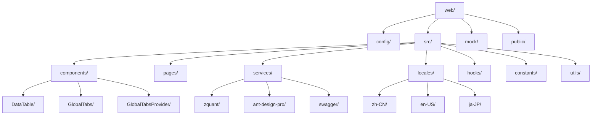

**图表来源**
- [app.tsx](file://web/src/app.tsx)
- [routes.ts](file://web/config/routes.ts)

**本节来源**
- [app.tsx](file://web/src/app.tsx)
- [routes.ts](file://web/config/routes.ts)

## 路由配置

基于UmiJS的路由配置系统，zquant实现了清晰的路由结构。路由配置文件`routes.ts`定义了应用的导航结构，支持嵌套路由、重定向和权限控制。

路由配置的主要特点包括：
- **模块化组织**：按功能模块（如用户、账户、回测、数据等）组织路由
- **权限集成**：通过`access`字段与权限系统集成
- **菜单支持**：通过`name`和`icon`字段支持菜单显示
- **动态路由**：支持参数化路由（如`/backtest/detail/:id`）

```mermaid
graph TD
Root[/] --> Welcome[欢迎页]
Root --> User[用户]
Root --> Account[账户]
Root --> Dashboard[系统大盘]
Root --> Watchlist[我的关注]
Root --> Factor[因子管理]
Root --> Backtest[回测]
Root --> Data[数据源]
Root --> Admin[系统设置]
User --> Login[登录]
User --> ApiKeys[API密钥]
Account --> Center[个人中心]
Account --> Settings[个人设置]
Watchlist --> MyWatchlist[我的自选股]
Watchlist --> MyPositions[我的持仓]
Watchlist --> QuickAccess[快速访问]
Factor --> Definitions[因子定义]
Factor --> Models[因子模型]
Factor --> Configs[因子配置]
Factor --> Results[因子结果]
Backtest --> List[回测列表]
Backtest --> Strategies[策略管理]
Backtest --> Create[创建回测]
Backtest --> Detail[回测详情]
Backtest --> Performance[性能分析]
```

**图表来源**
- [routes.ts](file://web/config/routes.ts)

**本节来源**
- [routes.ts](file://web/config/routes.ts)

## 状态管理机制

zquant前端采用UmiJS的`getInitialState`和`layout`配置实现状态管理，结合React Context和自定义Hook，实现了全局状态与页面局部状态的有效分离。

### 全局状态管理

全局状态主要通过`app.tsx`中的`getInitialState`函数管理，包括：
- **用户信息**：存储当前用户信息，包括用户名、角色、权限等
- **应用设置**：存储UI主题、布局等设置
- **加载状态**：管理应用初始化加载状态

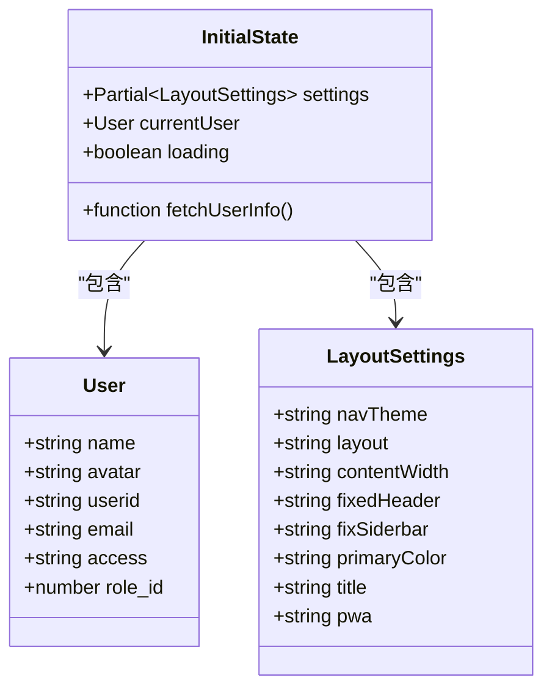

**图表来源**
- [app.tsx](file://web/src/app.tsx)

**本节来源**
- [app.tsx](file://web/src/app.tsx)

### 页面局部状态

页面局部状态通过React组件自身的state和自定义Hook管理。例如，`GlobalTabs`组件使用`useGlobalTabs` Hook管理标签页状态。

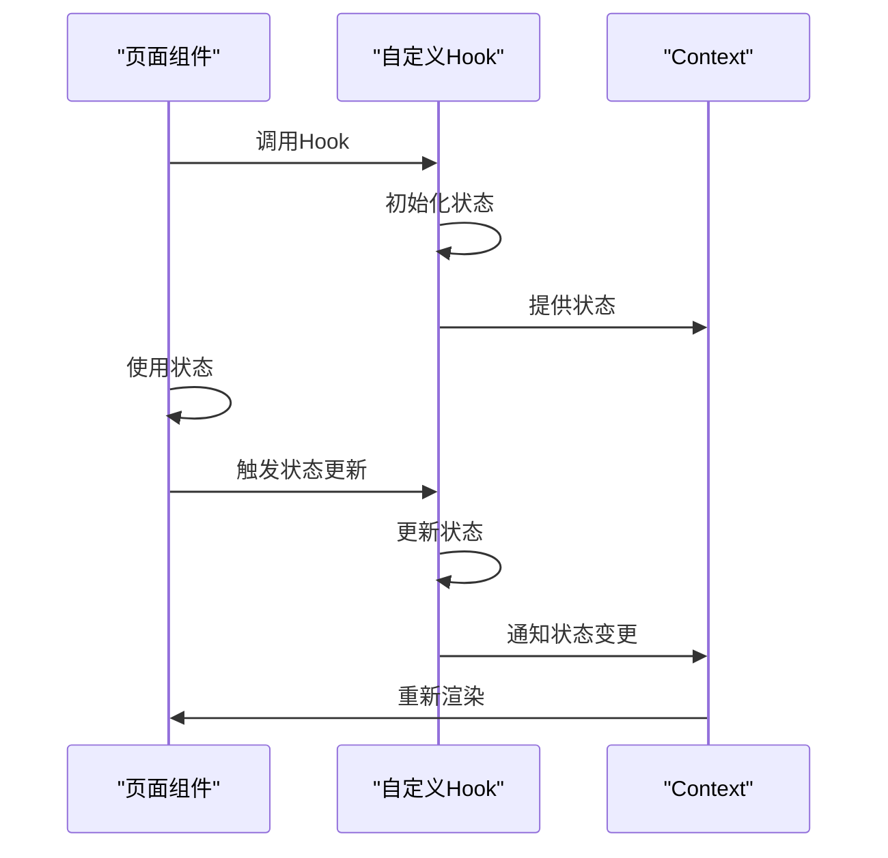

**图表来源**
- [useGlobalTabs.ts](file://web/src/hooks/useGlobalTabs.ts)
- [GlobalTabsProvider](file://web/src/components/GlobalTabsProvider/index.tsx)

**本节来源**
- [app.tsx](file://web/src/app.tsx)
- [useGlobalTabs.ts](file://web/src/hooks/useGlobalTabs.ts)

## API客户端封装

API客户端封装位于`services/zquant/`目录下，实现了统一的请求处理、认证和错误响应机制。

### 请求封装结构

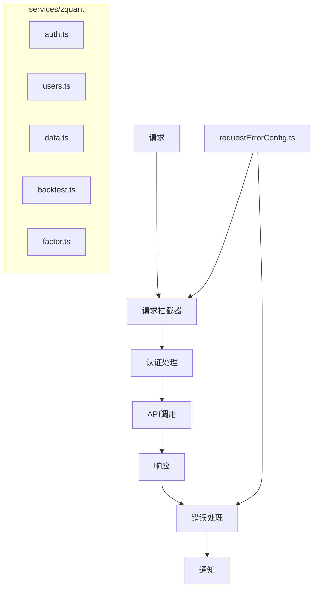

**图表来源**
- [auth.ts](file://web/src/services/zquant/auth.ts)
- [users.ts](file://web/src/services/zquant/users.ts)
- [requestErrorConfig.ts](file://web/src/requestErrorConfig.ts)

### 认证机制

认证机制通过请求拦截器自动添加JWT Token到请求头：

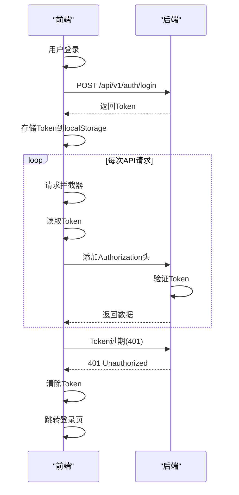

**图表来源**
- [auth.ts](file://web/src/services/zquant/auth.ts)
- [requestErrorConfig.ts](file://web/src/requestErrorConfig.ts)

### 错误处理

错误处理配置在`requestErrorConfig.ts`中，支持多种错误显示类型：

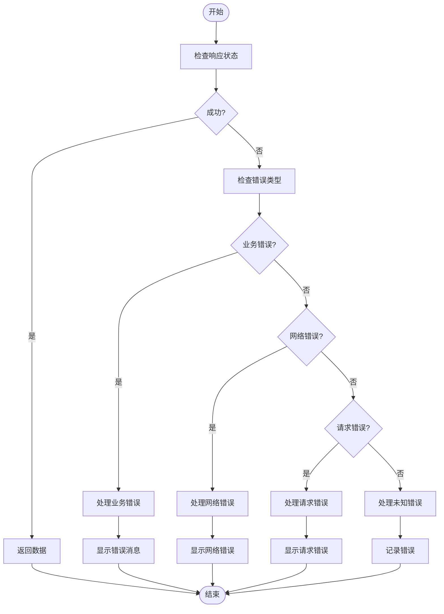

**图表来源**
- [requestErrorConfig.ts](file://web/src/requestErrorConfig.ts)

**本节来源**
- [index.ts](file://web/src/services/zquant/index.ts)
- [auth.ts](file://web/src/services/zquant/auth.ts)
- [users.ts](file://web/src/services/zquant/users.ts)
- [requestErrorConfig.ts](file://web/src/requestErrorConfig.ts)

## 多语言支持

多语言支持通过`locales/`目录实现，支持多种语言（中文、英文、日文等），采用UmiJS的国际化方案。

### 多语言结构

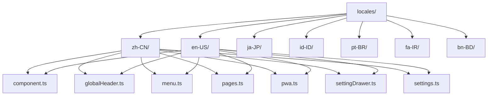

**图表来源**
- [en-US.ts](file://web/src/locales/en-US.ts)

### 多语言实现机制

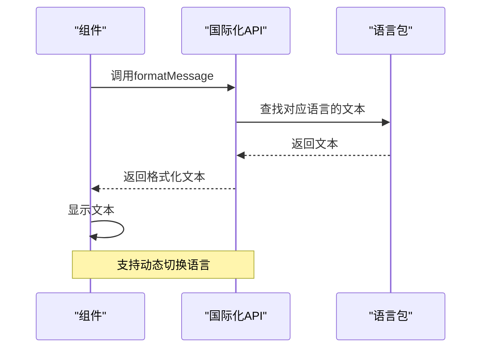

**本节来源**
- [en-US.ts](file://web/src/locales/en-US.ts)

## 权限控制

权限控制通过`access.ts`文件实现，基于用户角色和权限进行访问控制。

### 权限控制流程

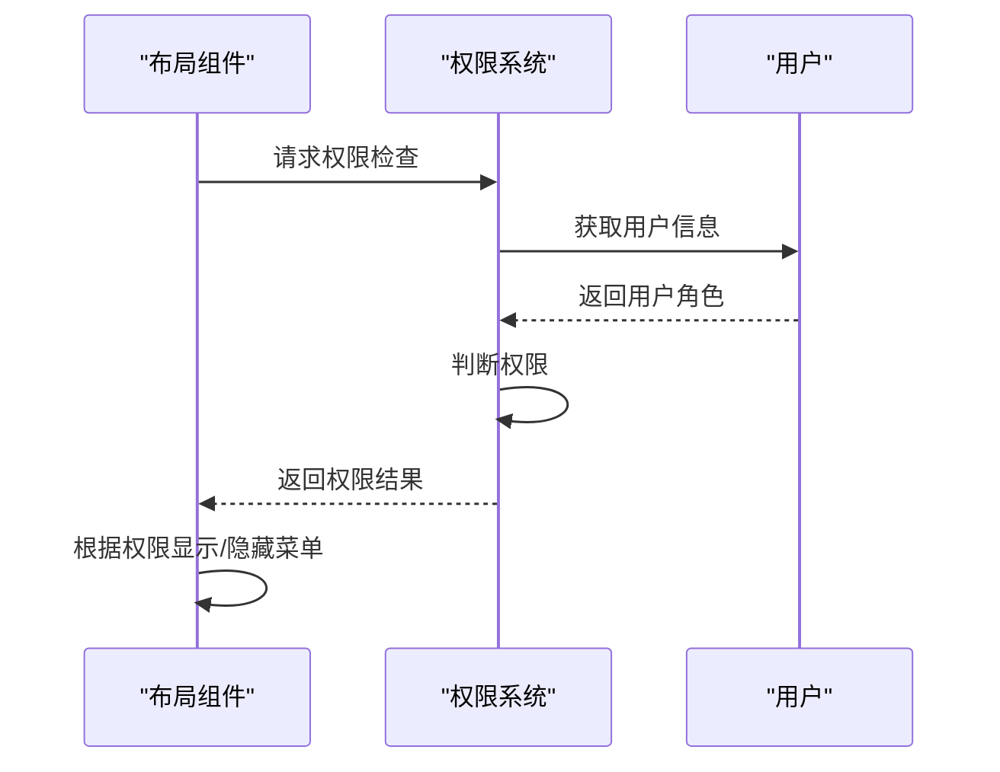

### 权限配置

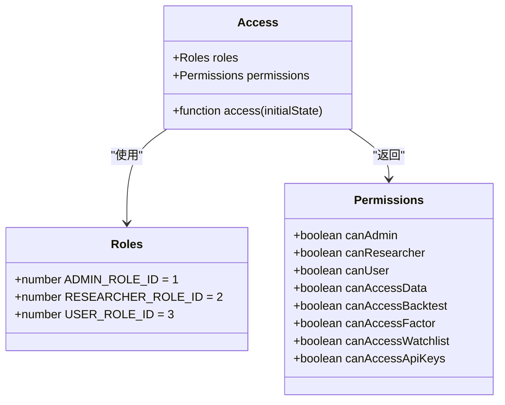

**图表来源**
- [access.ts](file://web/src/access.ts)
- [roles.ts](file://web/src/constants/roles.ts)

**本节来源**
- [access.ts](file://web/src/access.ts)
- [roles.ts](file://web/src/constants/roles.ts)

## UI组件设计

### DataTable组件

`DataTable`组件是基于Ant Design Pro的`ProTable`封装的通用数据表格组件，提供统一的数据展示和格式化功能。

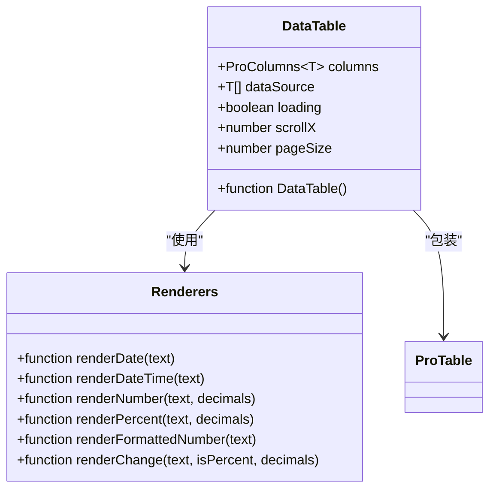

**图表来源**
- [DataTable](file://web/src/components/DataTable/index.tsx)

### GlobalTabs组件

`GlobalTabs`组件实现多标签页功能，支持页卡的添加、关闭和切换。

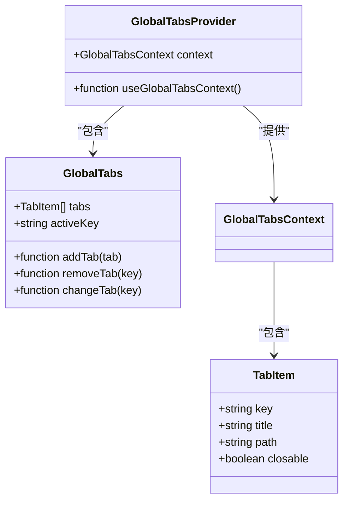

**图表来源**
- [GlobalTabs](file://web/src/components/GlobalTabs/index.tsx)
- [useGlobalTabs.ts](file://web/src/hooks/useGlobalTabs.ts)
- [GlobalTabsProvider](file://web/src/components/GlobalTabsProvider/index.tsx)

**本节来源**
- [DataTable](file://web/src/components/DataTable/index.tsx)
- [GlobalTabs](file://web/src/components/GlobalTabs/index.tsx)
- [useGlobalTabs.ts](file://web/src/hooks/useGlobalTabs.ts)

## 性能优化建议

### 懒加载与代码分割

建议对大型页面组件实施懒加载和代码分割：

```mermaid
flowchart TD
Start([应用启动]) --> LoadCore["加载核心代码"]
LoadCore --> ShowLoading["显示加载界面"]
ShowLoading --> LoadPage["按需加载页面代码"]
LoadPage --> RenderPage["渲染页面"]
RenderPage --> End([完成])
Note over LoadCore,LoadPage: 减少初始加载时间
```

### 请求缓存

实现请求缓存机制，避免重复请求：

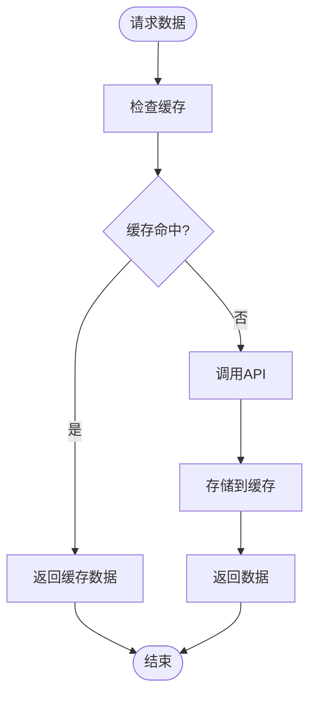

### 其他优化建议

1. **组件懒加载**：对非关键组件使用React.lazy
2. **数据分页**：大数据量使用分页加载
3. **虚拟滚动**：长列表使用虚拟滚动
4. **防抖节流**：频繁操作使用防抖节流
5. **资源压缩**：生产环境启用代码压缩

**本节来源**
- [app.tsx](file://web/src/app.tsx)
- [DataTable](file://web/src/components/DataTable/index.tsx)