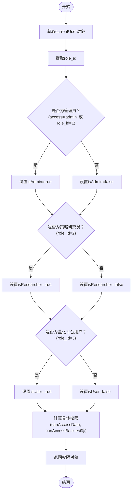
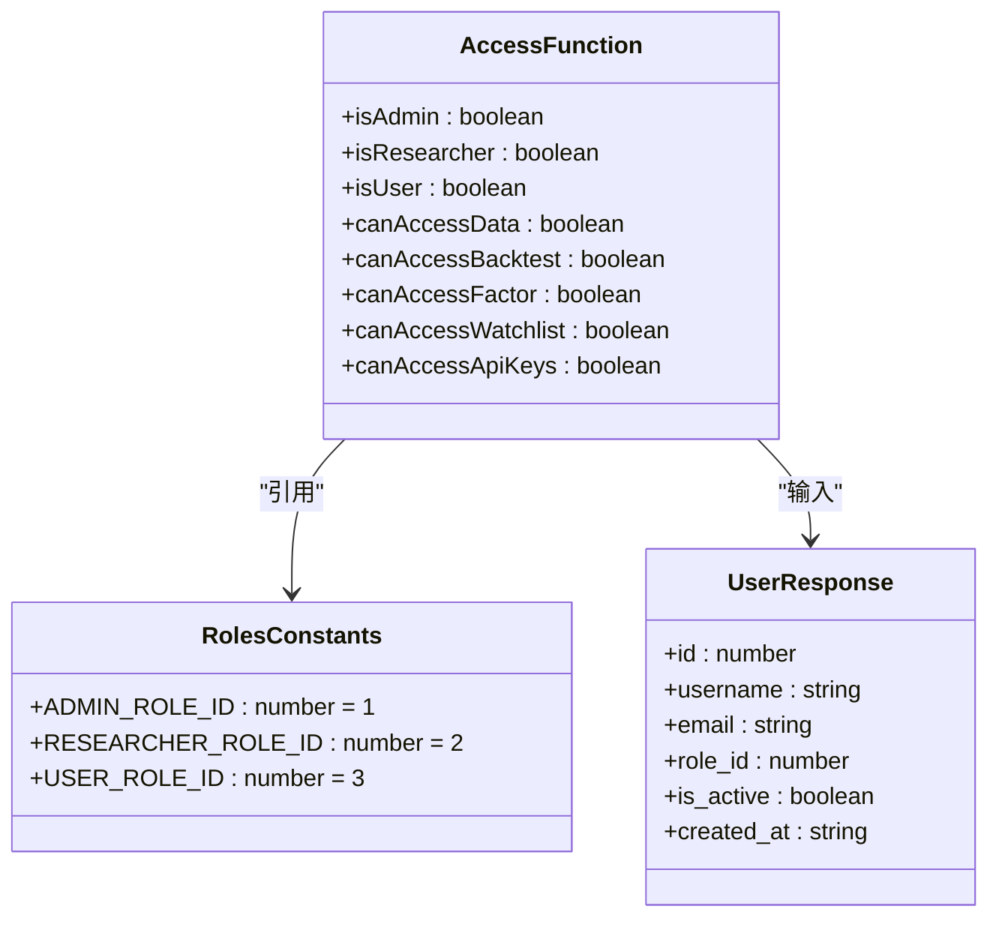
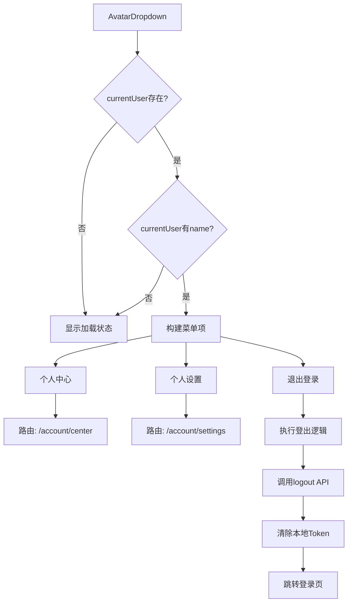
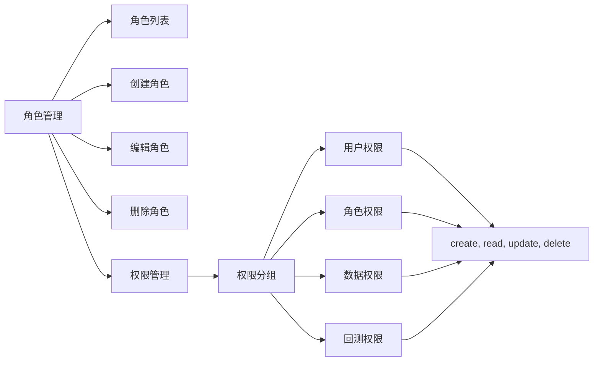

# 前端权限控制

<cite>
**本文档引用的文件**   
- [access.ts](file://web/src/access.ts)
- [roles.ts](file://web/src/constants/roles.ts)
- [app.tsx](file://web/src/app.tsx)
- [routes.ts](file://web/config/routes.ts)
- [AvatarDropdown.tsx](file://web/src/components/RightContent/AvatarDropdown.tsx)
- [users/index.tsx](file://web/src/pages/admin/users/index.tsx)
- [roles/index.tsx](file://web/src/pages/admin/roles/index.tsx)
- [permissions.ts](file://web/src/services/zquant/permissions.ts)
- [roles.ts](file://web/src/services/zquant/roles.ts)
- [users.ts](file://web/src/services/zquant/users.ts)
</cite>

## 目录
1. [简介](#简介)
2. [权限判断逻辑](#权限判断逻辑)
3. [角色定义与映射](#角色定义与映射)
4. [权限在路由控制中的应用](#权限在路由控制中的应用)
5. [菜单渲染与组件级权限](#菜单渲染与组件级权限)
6. [权限管理界面](#权限管理界面)
7. [动态权限更新与缓存策略](#动态权限更新与缓存策略)
8. [常见权限问题排查](#常见权限问题排查)

## 简介
zquant前端采用基于角色的访问控制（RBAC）机制，通过`access.ts`文件中的权限判断函数与后端返回的用户角色信息进行映射和校验，实现细粒度的权限控制。该机制贯穿于路由控制、菜单渲染和组件级权限（如按钮可见性）等多个层面，确保不同角色的用户只能访问其被授权的功能模块。

## 权限判断逻辑
前端权限控制的核心逻辑位于`access.ts`文件中，该文件导出一个`access`函数，用于根据用户初始状态判断其具备的各项权限。

**权限判断流程：**
1. 从`initialState`中获取`currentUser`对象
2. 提取用户的`role_id`进行角色判断
3. 根据角色组合生成多个细粒度的权限布尔值



**权限判断逻辑说明：**
- **管理员判断**：同时检查`currentUser.access`字段是否为`admin`以及`role_id`是否等于`ADMIN_ROLE_ID`（1），满足任一条件即为管理员。
- **角色判断**：通过`role_id`与预定义的常量（`RESEARCHER_ROLE_ID`=2, `USER_ROLE_ID`=3）进行精确匹配。
- **功能权限计算**：基于角色判断结果，组合计算出具体的功能权限，如`canAccessFactor`（因子管理权限）仅对管理员和策略研究员开放。

**Section sources**
- [access.ts](file://web/src/access.ts#L28-L71)

## 角色定义与映射
系统的角色定义在`constants/roles.ts`文件中，通过常量形式明确标识不同角色的ID，确保前后端角色映射的一致性。



**角色映射原则：**
- **唯一性**：每个角色ID在系统中是唯一的，避免角色混淆。
- **一致性**：前端角色ID常量必须与后端数据库初始化脚本中创建的角色ID保持一致。
- **可维护性**：通过常量定义，便于统一管理和修改。

**权限粒度设计：**
权限设计遵循最小权限原则，将权限细化到具体功能模块：
- `canAccessData`：数据访问权限，所有登录用户均可访问。
- `canAccessBacktest`：回测访问权限，普通用户可查看，管理员和研究员可操作。
- `canAccessFactor`：因子管理权限，仅管理员和研究员可访问。
- `canAccessApiKeys`：API密钥权限，仅管理员和研究员可管理。

**Section sources**
- [roles.ts](file://web/src/constants/roles.ts#L26-L44)
- [access.ts](file://web/src/access.ts#L46-L59)

## 权限在路由控制中的应用
权限控制通过Umi框架的`access`配置项深度集成到路由系统中，实现路由级别的访问控制。

### 路由配置分析
在`routes.ts`文件中，多个路由节点配置了`access`属性，该属性的值对应`access.ts`中返回的权限字段。

```mermaid
graph TB
subgraph "路由配置"
A[/welcome] --> B[/dashboard]
B --> C[/watchlist]
C --> D[/factor]
D --> E[/backtest]
E --> F[/data]
F --> G[/admin]
end
subgraph "权限控制"
H[access.ts] --> I[canAccessData]
H --> J[canAccessBacktest]
H --> K[canAccessFactor]
H --> L[canAccessWatchlist]
H --> M[canAdmin]
end
I --> F
J --> E
K --> D
L --> C
M --> G
style H fill:#f9f,stroke:#333,stroke-width:2px
```

**关键路由权限配置：**
- `/factor` 路由：`access: 'canAccessFactor'`，只有具备因子管理权限的用户才能访问。
- `/admin` 路由：`access: 'canAdmin'`，仅管理员可访问系统管理功能。
- `/backtest` 路由：`access: 'canAccessBacktest'`，回测功能对所有登录用户开放查看。
- `/user/apikeys` 路由：`access: 'canAccessApiKeys'`，API密钥管理仅对管理员和研究员开放。

**权限验证流程：**
1. 用户尝试访问某个路由。
2. Umi框架调用`access`函数，传入`initialState`。
3. `access`函数根据`currentUser`信息计算权限。
4. 框架检查路由配置的`access`字段对应的权限是否为`true`。
5. 如果有权限，则渲染对应页面；否则，阻止访问（通常重定向到登录页或403页）。

**Section sources**
- [routes.ts](file://web/config/routes.ts#L137-L138)
- [routes.ts](file://web/config/routes.ts#L273-L274)
- [access.ts](file://web/src/access.ts)

## 菜单渲染与组件级权限
权限控制不仅作用于路由，还体现在菜单的动态渲染和UI组件的可见性上。

### AvatarDropdown 组件分析
`AvatarDropdown`组件位于用户头像下拉菜单中，展示了权限控制与UI的集成方式。



**UI集成要点：**
- **状态管理**：组件通过`useModel('@@initialState')`订阅全局用户状态，当用户信息变化时自动更新。
- **菜单项构建**：根据`menu`属性动态构建菜单，包含个人中心、个人设置和退出登录选项。
- **登出逻辑**：点击“退出登录”后，先调用后端登出API，然后清除本地存储的`access_token`和`refresh_token`，最后跳转到登录页。

**Section sources**
- [AvatarDropdown.tsx](file://web/src/components/RightContent/AvatarDropdown.tsx#L23-L175)

### 用户管理页面权限控制
`admin/users/index.tsx`页面展示了更复杂的权限控制应用。

**权限控制体现：**
- **页面访问**：整个`/admin/users`页面受`canAdmin`权限保护，只有管理员可访问。
- **操作权限**：页面内的“创建用户”、“编辑”、“删除”等操作按钮，虽然对管理员可见，但其功能实现依赖于后端权限校验。
- **数据加载**：`useEffect`中加载角色列表，为用户编辑表单提供角色选择选项。

**Section sources**
- [users/index.tsx](file://web/src/pages/admin/users/index.tsx#L32-L503)

## 权限管理界面
系统提供了完整的权限管理界面，允许管理员对角色和权限进行精细化管理。

### 角色管理界面
`admin/roles/index.tsx`页面实现了角色的CRUD操作和权限分配功能。

**核心功能：**
- **角色列表**：展示所有角色，支持分页、排序和搜索。
- **权限分配**：通过“权限管理”按钮，可以为每个角色分配具体的权限。
- **权限分组**：权限按`resource`（资源类型）进行分组展示，如`user`、`role`、`data`等。



**权限分配流程：**
1. 管理员点击某个角色的“权限管理”按钮。
2. 系统加载该角色已有的权限，并显示所有可用权限列表。
3. 管理员通过复选框勾选或取消权限。
4. 点击“保存”后，调用`assignPermissions` API更新角色权限。

**Section sources**
- [roles/index.tsx](file://web/src/pages/admin/roles/index.tsx#L32-L409)
- [roles.ts](file://web/src/services/zquant/roles.ts#L101-L113)

### 权限管理界面
`admin/permissions/index.tsx`页面用于管理系统的权限定义。

**功能特点：**
- **权限定义**：每个权限包含`name`、`resource`、`action`和`description`四个核心字段。
- **权限创建**：管理员可以创建新的权限，例如为未来功能预留权限。
- **权限粒度**：权限按`resource`和`action`组合，形成如`user:create`、`data:read`这样的细粒度权限。

**Section sources**
- [permissions/index.tsx](file://web/src/pages/admin/permissions/index.tsx#L31-L70)
- [permissions.ts](file://web/src/services/zquant/permissions.ts#L31-L66)

## 动态权限更新与缓存策略
系统在用户登录和状态变化时，动态更新权限并采用合理的缓存策略。

### 动态权限更新
权限的动态更新主要在`app.tsx`的`getInitialState`函数中实现。

**更新流程：**
1. 应用启动时，检查本地`localStorage`中是否存在`access_token`。
2. 如果存在token，则调用`getCurrentUser` API获取用户信息。
3. 根据返回的`role_id`，在`getInitialState`中动态设置`access`字段（`admin`或`user`）。
4. 将用户信息和权限状态存入`initialState`，供整个应用使用。

**关键代码路径：**
- `app.tsx`中的`getInitialState`函数负责初始化用户状态和权限。
- `login/index.tsx`中的登录成功回调会调用`fetchUserInfo`来更新`initialState`。

**Section sources**
- [app.tsx](file://web/src/app.tsx#L54-L154)
- [login/index.tsx](file://web/src/pages/user/login/index.tsx#L232-L270)

### 缓存策略
系统采用多层级的缓存策略来提升性能和用户体验。

**缓存机制：**
- **Token缓存**：用户的`access_token`和`refresh_token`存储在`localStorage`中，实现会话持久化。
- **用户信息缓存**：`initialState`中的`currentUser`对象作为应用级缓存，避免重复请求用户信息。
- **页面状态缓存**：通过`usePageCache`等Hook，缓存页面的表单数据、表格状态等，提升用户体验。

**缓存失效处理：**
- **登出操作**：用户登出时，明确清除`localStorage`中的token。
- **Token过期**：当API请求返回401错误时，在`onPageChange`钩子中检测到无有效token和用户信息时，自动跳转到登录页。

**Section sources**
- [app.tsx](file://web/src/app.tsx#L345-L375)
- [AvatarDropdown.tsx](file://web/src/components/RightContent/AvatarDropdown.tsx#L73-L98)

## 常见权限问题排查
当遇到权限相关问题时，可按照以下步骤进行排查。

### 问题排查清单
1. **检查Token**：确认`localStorage`中是否存在有效的`access_token`。
2. **检查用户信息**：通过浏览器开发者工具，检查`initialState.currentUser`是否正确加载。
3. **检查角色ID**：确认`currentUser.role_id`的值是否与`constants/roles.ts`中的定义匹配。
4. **检查路由配置**：核对`routes.ts`中相关路由的`access`配置是否正确。
5. **检查后端响应**：使用网络面板，检查`/api/v1/users/me`接口返回的用户信息是否包含正确的`role_id`。
6. **检查权限分配**：登录管理员账号，检查`/admin/roles`页面中，目标角色是否被正确分配了所需权限。

### 常见问题示例
- **问题**：普通用户无法访问回测页面。
  - **排查**：检查`access.ts`中的`canAccessBacktest`逻辑，确认`isUser`判断是否正确，以及`routes.ts`中`/backtest`路由的`access`配置。

- **问题**：新创建的角色无法访问其应有权限。
  - **排查**：检查`admin/roles`页面，确认该角色是否已在“权限管理”中被分配了相应权限。

**Section sources**
- [app.tsx](file://web/src/app.tsx#L345-L375)
- [access.ts](file://web/src/access.ts)
- [routes.ts](file://web/config/routes.ts)