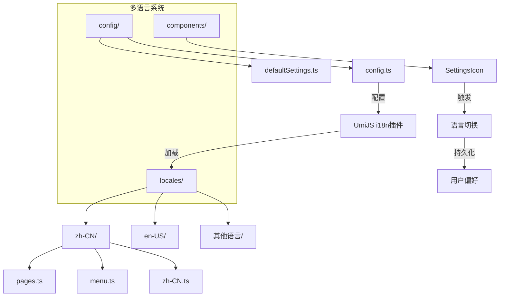
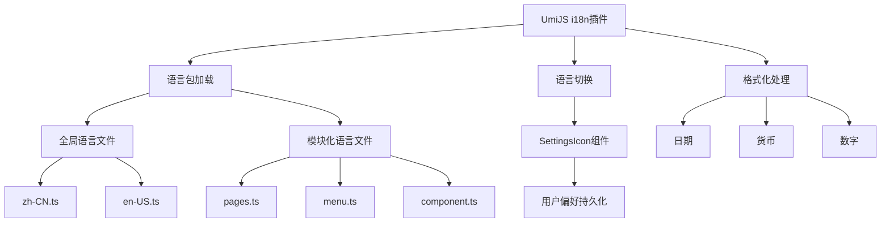
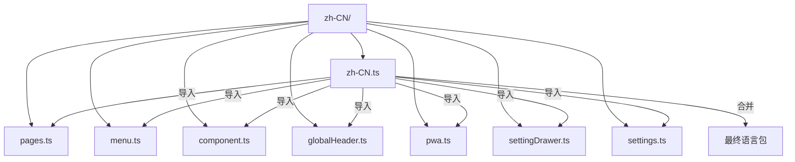
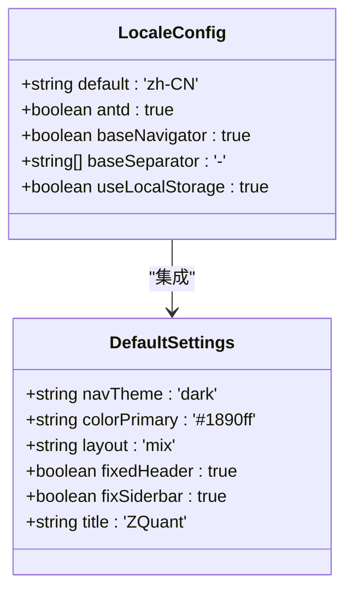
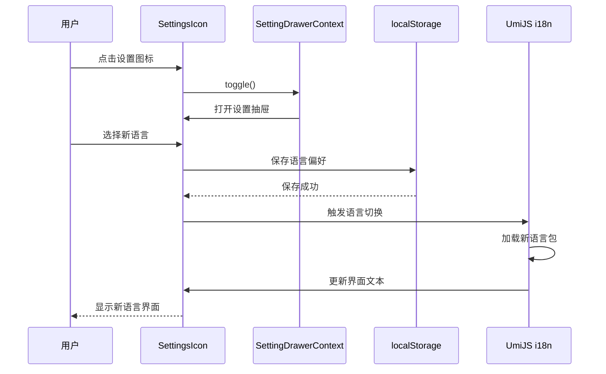

# 多语言支持

<cite>
**本文档引用的文件**
- [zh-CN.ts](file://web/src/locales/zh-CN.ts)
- [en-US.ts](file://web/src/locales/en-US.ts)
- [zh-CN/pages.ts](file://web/src/locales/zh-CN/pages.ts)
- [zh-CN/menu.ts](file://web/src/locales/zh-CN/menu.ts)
- [defaultSettings.ts](file://web/config/defaultSettings.ts)
- [config.ts](file://web/config/config.ts)
- [SettingsIcon/index.tsx](file://web/src/components/RightContent/SettingsIcon/index.tsx)
- [package.json](file://web/package.json)
</cite>

## 目录
1. [简介](#简介)
2. [项目结构](#项目结构)
3. [核心组件](#核心组件)
4. [架构概述](#架构概述)
5. [详细组件分析](#详细组件分析)
6. [依赖分析](#依赖分析)
7. [性能考虑](#性能考虑)
8. [故障排除指南](#故障排除指南)
9. [结论](#结论)

## 简介
本文档全面阐述了zquant前端多语言（i18n）系统的架构与实现。系统基于UmiJS国际化插件构建，支持多种语言，包括中文（zh-CN）、英文（en-US）、孟加拉语（bn-BD）、波斯语（fa-IR）、印尼语（id-ID）、日语（ja-JP）、葡萄牙语（pt-BR）和繁体中文（zh-TW）。文档详细分析了语言包的组织结构、加载机制、默认配置、语言切换与持久化功能，以及格式化处理的最佳实践。

## 项目结构
zquant前端的多语言系统主要位于`web/src/locales/`目录下，该目录按语言代码组织各个语言包。每个语言包包含多个模块化语言文件（如`pages.ts`、`menu.ts`等）和一个全局语言文件（如`zh-CN.ts`）。系统通过UmiJS的国际化插件实现语言切换和内容渲染。



**Diagram sources**
- [zh-CN.ts](file://web/src/locales/zh-CN.ts)
- [config.ts](file://web/config/config.ts)
- [SettingsIcon/index.tsx](file://web/src/components/RightContent/SettingsIcon/index.tsx)

**Section sources**
- [zh-CN.ts](file://web/src/locales/zh-CN.ts)
- [config.ts](file://web/config/config.ts)

## 核心组件
多语言系统的核心组件包括语言包文件、UmiJS国际化插件配置、默认设置文件和语言切换UI组件。系统通过模块化的方式组织翻译文本，将不同功能区域的文本分离到不同的文件中，便于维护和管理。

**Section sources**
- [zh-CN.ts](file://web/src/locales/zh-CN.ts)
- [config.ts](file://web/config/config.ts)
- [defaultSettings.ts](file://web/config/defaultSettings.ts)

## 架构概述
zquant的多语言系统采用分层架构，底层是UmiJS的国际化插件，中间层是语言包的组织与加载机制，上层是用户界面的语言切换功能。系统在启动时根据配置加载默认语言，并在用户切换语言时动态更新界面内容。



**Diagram sources**
- [config.ts](file://web/config/config.ts)
- [zh-CN.ts](file://web/src/locales/zh-CN.ts)
- [SettingsIcon/index.tsx](file://web/src/components/RightContent/SettingsIcon/index.tsx)

## 详细组件分析

### 语言包组织结构分析
zquant的多语言系统采用模块化设计，将翻译文本按功能区域分离。每个语言目录（如`zh-CN/`）包含多个模块化语言文件，如`pages.ts`（页面文本）、`menu.ts`（菜单文本）、`component.ts`（组件文本）等。这种设计提高了代码的可维护性，使得不同开发人员可以独立处理不同模块的翻译。



**Diagram sources**
- [zh-CN.ts](file://web/src/locales/zh-CN.ts)
- [zh-CN/pages.ts](file://web/src/locales/zh-CN/pages.ts)
- [zh-CN/menu.ts](file://web/src/locales/zh-CN/menu.ts)

**Section sources**
- [zh-CN.ts](file://web/src/locales/zh-CN.ts)
- [zh-CN/pages.ts](file://web/src/locales/zh-CN/pages.ts)
- [zh-CN/menu.ts](file://web/src/locales/zh-CN/menu.ts)

### 语言加载与合并机制
系统通过全局语言文件（如`zh-CN.ts`）导入并合并所有模块化语言文件。使用ES6的扩展运算符（...）将各个模块的翻译对象合并到一个全局对象中。这种方式既保持了模块的独立性，又确保了所有翻译文本的集中管理。

**Section sources**
- [zh-CN.ts](file://web/src/locales/zh-CN.ts)
- [en-US.ts](file://web/src/locales/en-US.ts)

### 默认语言配置分析
`defaultSettings.ts`文件定义了应用的默认配置，但多语言的默认设置主要在`config.ts`中通过UmiJS的`locale`插件配置。系统默认语言设置为`zh-CN`，并启用了基于浏览器语言的自动检测功能。



**Diagram sources**
- [config.ts](file://web/config/config.ts)
- [defaultSettings.ts](file://web/config/defaultSettings.ts)

**Section sources**
- [config.ts](file://web/config/config.ts#L126-L132)
- [defaultSettings.ts](file://web/config/defaultSettings.ts)

### 语言切换与持久化机制
`SettingsIcon`组件作为语言切换的触发点，点击后会打开设置抽屉，允许用户选择不同的语言。系统使用浏览器的localStorage来持久化用户的语言偏好，确保用户下次访问时仍保持之前的选择。



**Diagram sources**
- [SettingsIcon/index.tsx](file://web/src/components/RightContent/SettingsIcon/index.tsx)
- [config.ts](file://web/config/config.ts#L126-L132)

**Section sources**
- [SettingsIcon/index.tsx](file://web/src/components/RightContent/SettingsIcon/index.tsx)
- [config.ts](file://web/config/config.ts#L126-L132)

### 格式化处理最佳实践
系统集成了dayjs库进行日期格式化处理，并通过UmiJS的国际化插件自动处理数字和货币的本地化显示。对于日期、货币和数字等需要本地化格式化的数据，系统会根据当前语言环境自动应用相应的格式规则。

**Section sources**
- [config.ts](file://web/config/config.ts#L118-L121)
- [package.json](file://web/package.json#L45)

### UmiJS国际化插件集成
UmiJS的国际化插件通过`config.ts`文件中的`locale`配置项进行集成。插件配置包括默认语言、是否启用antd组件库的国际化、是否基于浏览器语言自动切换等。系统还配置了`ignoreMomentLocale`以减少包大小，因为项目使用dayjs替代了moment.js。

**Section sources**
- [config.ts](file://web/config/config.ts#L126-L132)
- [package.json](file://web/package.json)

## 依赖分析
多语言系统依赖于UmiJS框架的核心功能，特别是其国际化插件。系统还依赖于antd组件库的国际化支持和dayjs库的日期处理能力。这些依赖关系通过`package.json`文件进行管理。

```mermaid
graph TD
A[zquant前端] --> B[UmiJS i18n插件]
A --> C[antd]
A --> D[dayjs]
B --> E[@umijs/max]
C --> F[@ant-design/pro-components]
D --> G[dayjs]
style A fill:#f9f,stroke:#333
style B fill:#bbf,stroke:#333
style C fill:#bbf,stroke:#333
style D fill:#bbf,stroke:#333
```

**Diagram sources**
- [package.json](file://web/package.json)
- [config.ts](file://web/config/config.ts)

**Section sources**
- [package.json](file://web/package.json)
- [config.ts](file://web/config/config.ts)

## 性能考虑
多语言系统在性能方面进行了优化，包括使用`ignoreMomentLocale`减少包大小、通过hash模式避免浏览器缓存问题、以及使用代码分割按需加载语言包。这些优化确保了系统在多语言环境下的高效运行。

## 故障排除指南
当遇到多语言相关问题时，应首先检查语言包文件的路径和命名是否正确，确认`config.ts`中的国际化配置是否正确，以及检查浏览器控制台是否有加载错误。对于翻译缺失的问题，系统会回退到默认语言的对应文本。

**Section sources**
- [config.ts](file://web/config/config.ts)
- [zh-CN.ts](file://web/src/locales/zh-CN.ts)

## 结论
zquant前端的多语言系统通过UmiJS国际化插件实现了完整的多语言支持。系统采用模块化的语言包组织方式，结合默认配置、用户偏好持久化和高效的加载机制，为用户提供流畅的多语言体验。通过合理的架构设计和性能优化，系统在保持功能完整性的同时，确保了良好的运行效率。