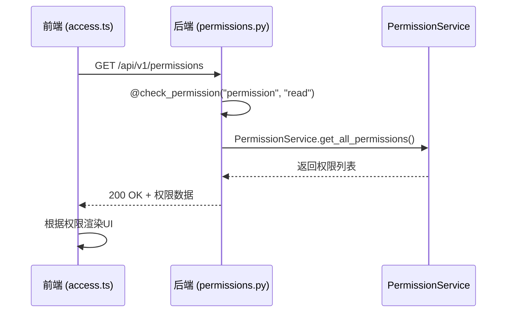
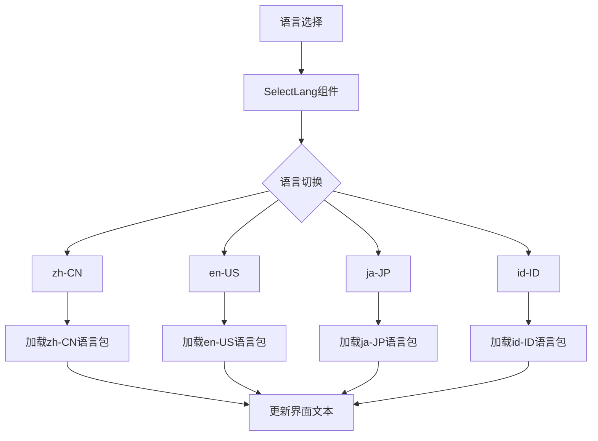
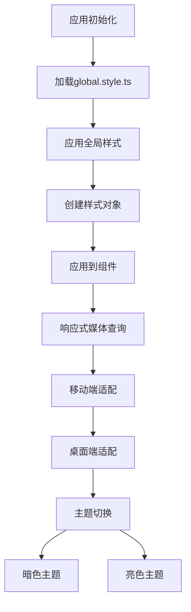

# 权限与多语言

<cite>
**本文档引用文件**  
- [access.ts](file://web/src/access.ts)
- [global.style.ts](file://web/src/global.style.ts)
- [roles.ts](file://web/src/constants/roles.ts)
- [app.tsx](file://web/src/app.tsx)
- [zh-CN.ts](file://web/src/locales/zh-CN.ts)
- [en-US.ts](file://web/src/locales/en-US.ts)
- [routes.ts](file://web/config/routes.ts)
- [auth.py](file://zquant/api/v1/auth.py)
- [permissions.py](file://zquant/api/v1/permissions.py)
- [permission.py](file://zquant/services/permission.py)
</cite>

## 目录
1. [权限控制机制](#权限控制机制)
2. [多语言支持系统](#多语言支持系统)
3. [全局样式与主题集成](#全局样式与主题集成)
4. [最佳实践](#最佳实践)

## 权限控制机制

zquant前端权限控制基于角色的访问控制（RBAC）模型，通过`access.ts`文件实现。系统定义了三种核心角色：管理员（ADMIN_ROLE_ID=1）、策略研究员（RESEARCHER_ROLE_ID=2）和量化平台用户（USER_ROLE_ID=3），这些角色ID与后端数据库初始化脚本保持一致。

权限判断逻辑在`access.ts`中实现，通过分析用户角色ID和访问字段来确定权限级别。系统实现了细粒度的权限控制，包括数据访问、回测访问、因子管理、API密钥等不同维度的权限。例如，`canAccessFactor`权限仅对管理员和策略研究员开放，而`canAccessWatchlist`则对所有已登录用户开放。

前端路由通过`routes.ts`中的`access`字段与权限系统集成，实现动态菜单渲染。当用户角色不满足特定路由的访问条件时，对应菜单项将自动隐藏。例如，因子管理菜单项（/factor）配置了`access: 'canAccessFactor'`，只有具备相应权限的用户才能看到该菜单。

后端权限系统通过FastAPI实现，位于`zquant/api/v1/permissions.py`。该系统采用装饰器模式，通过`@check_permission`装饰器对API端点进行权限校验。权限校验基于资源（resource）和操作（action）两个维度，如`@check_permission("permission", "read")`表示对权限资源的读取操作需要相应权限。

**Diagram sources**
- [access.ts](file://web/src/access.ts#L28-L72)
- [permissions.py](file://zquant/api/v1/permissions.py#L41-L60)
- [permission.py](file://zquant/services/permission.py#L74-L109)

**Section sources**
- [access.ts](file://web/src/access.ts#L28-L72)
- [roles.ts](file://web/src/constants/roles.ts#L31-L43)
- [routes.ts](file://web/config/routes.ts#L137-L163)

## 多语言支持系统

zquant的多语言支持系统采用模块化设计，语言包存储在`web/src/locales/`目录下，支持zh-CN、en-US、ja-JP、id-ID等多种语言。每种语言都有独立的目录，包含component、globalHeader、menu、pages等分类文件，便于维护和扩展。

系统通过`zh-CN.ts`和`en-US.ts`等入口文件聚合各分类语言包。这些文件使用ES6的解构语法将各个模块的语言资源合并到一个对象中。例如，`zh-CN.ts`文件导入了component、globalHeader、menu等模块，并通过`...`操作符将它们合并到导出对象中。

语言切换功能通过`RightContent/index.tsx`中的`SelectLang`组件实现。该组件利用Umi框架的国际化能力，提供语言选择下拉菜单。系统支持的语言在Umi配置中定义，用户选择后，界面文本会自动更新为对应语言。

**Diagram sources**
- [zh-CN.ts](file://web/src/locales/zh-CN.ts#L23-L46)
- [en-US.ts](file://web/src/locales/en-US.ts#L23-L47)
- [index.tsx](file://web/src/components/RightContent/index.tsx#L43-L51)

**Section sources**
- [zh-CN.ts](file://web/src/locales/zh-CN.ts#L23-L46)
- [en-US.ts](file://web/src/locales/en-US.ts#L23-L47)
- [component.ts](file://web/src/locales/zh-CN/component.ts#L23-L27)

## 全局样式与主题集成

全局样式通过`global.style.ts`文件管理，使用Ant Design的`createStyles`函数创建样式对象。该文件定义了多个全局CSS规则，如`ant-layout`的最小高度、`body`的字体渲染优化、`ul,ol`的列表样式清除等。

响应式设计在`global.style.ts`中通过媒体查询实现。例如，当屏幕宽度小于768px时，表格组件会自动启用水平滚动，确保在移动设备上的可读性。表格单元格内的文本会换行显示，提升移动端用户体验。

主题集成通过Ant Design Pro的SettingDrawer组件实现。`app.tsx`中的`layout`配置包含了主题设置功能，支持暗色主题切换。SettingDrawer的触发通过`toggleSettingDrawer`函数控制，该函数通过DOM操作临时显示并点击隐藏的设置手柄。

**Diagram sources**
- [global.style.ts](file://web/src/global.style.ts#L25-L62)
- [app.tsx](file://web/src/app.tsx#L277-L299)
- [app.tsx](file://web/src/app.tsx#L412-L427)

**Section sources**
- [global.style.ts](file://web/src/global.style.ts#L25-L62)
- [app.tsx](file://web/src/app.tsx#L277-L299)

## 最佳实践

### 权限粒度控制
权限系统应遵循最小权限原则，为不同角色分配必要的最小权限。在`access.ts`中，权限判断应基于角色ID而非用户名，避免硬编码。后端API应使用`@check_permission`装饰器进行细粒度控制，确保每个端点都有适当的权限校验。

### 动态菜单渲染
路由配置中的`access`字段应与`access.ts`中的权限函数名称保持一致。菜单项的显示/隐藏由ProLayout框架自动处理，无需在组件中手动判断。分隔线（divider）通过特殊路由配置实现，保持菜单结构的清晰性。

### 国际化最佳实践
语言包应按功能模块拆分，便于团队协作维护。键名采用点分隔的命名约定（如`component.tagSelect.expand`），反映其在应用中的位置。对于动态内容，应使用参数化消息格式，避免字符串拼接。

### 格式化处理
日期和数字格式化应使用国际化API，根据用户语言环境自动适配。例如，中文环境下日期显示为"2025年1月1日"，英文环境下显示为"January 1, 2025"。数字的千分位分隔符和小数点也应随语言环境变化。

**Section sources**
- [access.ts](file://web/src/access.ts#L46-L69)
- [routes.ts](file://web/config/routes.ts#L109-L110)
- [component.ts](file://web/src/locales/zh-CN/component.ts#L23-L27)
- [pwa.ts](file://web/src/locales/zh-CN/pwa.ts#L23-L28)