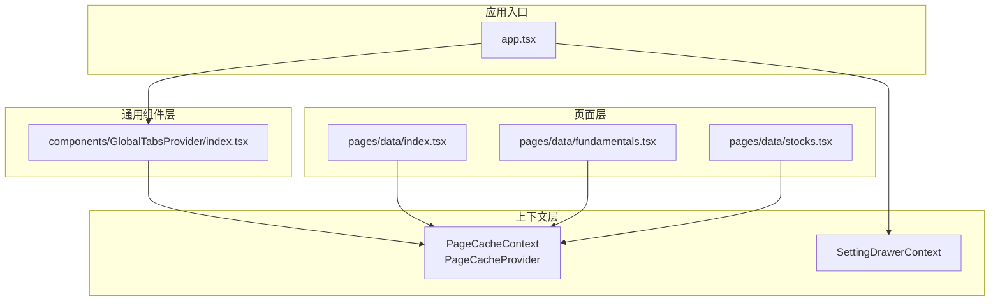
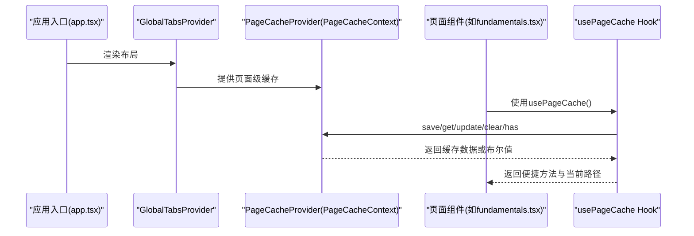
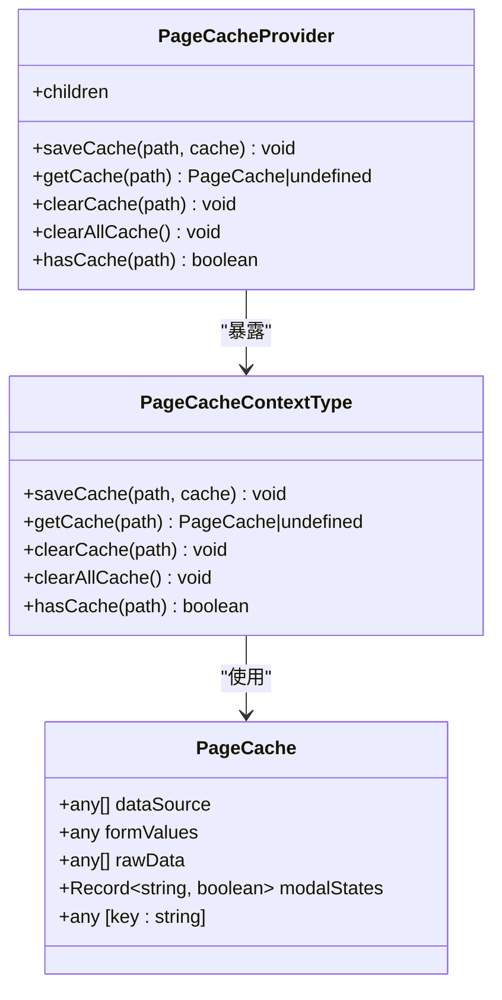
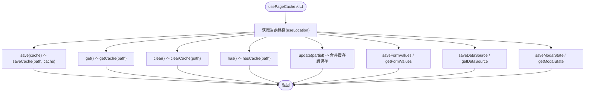
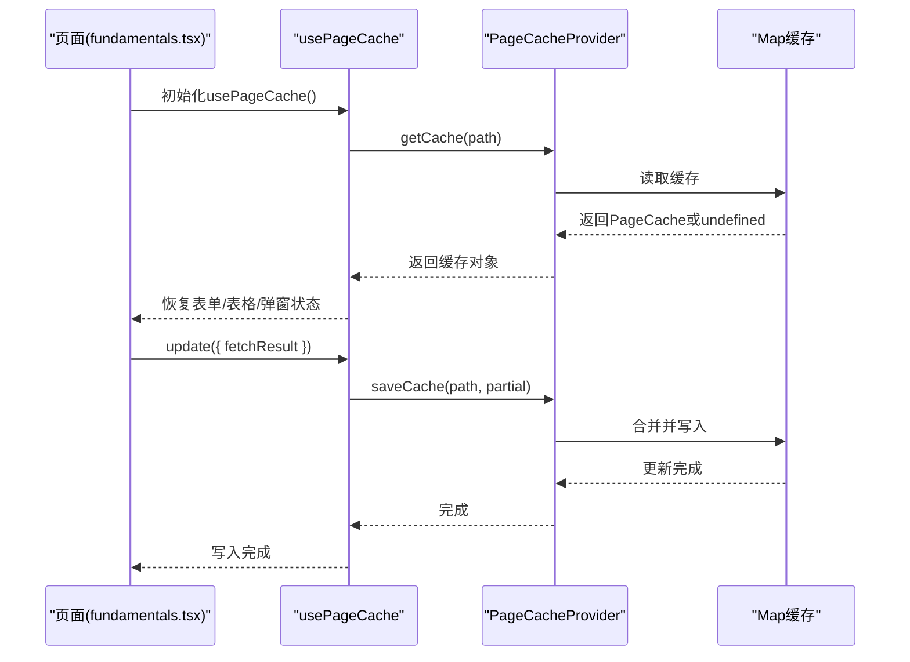
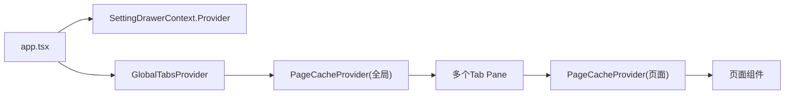
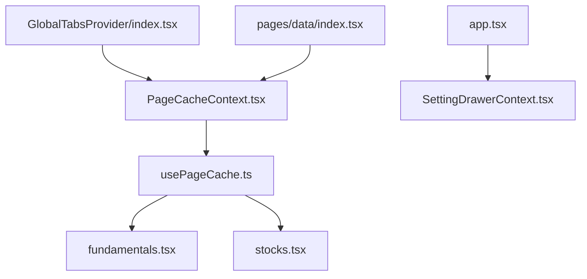

# 上下文管理

<cite>
**本文引用的文件**
- [PageCacheContext.tsx](file://web/src/contexts/PageCacheContext.tsx)
- [SettingDrawerContext.tsx](file://web/src/contexts/SettingDrawerContext.tsx)
- [usePageCache.ts](file://web/src/hooks/usePageCache.ts)
- [app.tsx](file://web/src/app.tsx)
- [index.tsx](file://web/src/pages/data/index.tsx)
- [fundamentals.tsx](file://web/src/pages/data/fundamentals.tsx)
- [stocks.tsx](file://web/src/pages/data/stocks.tsx)
- [GlobalTabsProvider/index.tsx](file://web/src/components/GlobalTabsProvider/index.tsx)
</cite>

## 目录
1. [引言](#引言)
2. [项目结构](#项目结构)
3. [核心组件](#核心组件)
4. [架构总览](#架构总览)
5. [详细组件分析](#详细组件分析)
6. [依赖关系分析](#依赖关系分析)
7. [性能考量](#性能考量)
8. [故障排查指南](#故障排查指南)
9. [结论](#结论)

## 引言
本文件聚焦于zquant前端基于React Context的状态管理机制，深入解析PageCacheContext如何通过Context API实现跨组件的页面级数据缓存共享。内容涵盖：
- PageCacheContext的Provider封装与在应用根组件中的集成方式
- 核心方法saveCache、getCache、clearCache、clearAllCache、hasCache的设计与实现
- 类型定义PageCache与PageCacheContextType如何确保类型安全
- 结合SettingDrawerContext说明多Context共存时的架构设计原则
- 避免Context过度嵌套的最佳实践
- 使用usePageCache Hook在页面内的便捷用法与性能优化建议

## 项目结构
围绕“页面级缓存”的主题，相关文件主要分布在以下位置：
- contexts：存放全局上下文定义与Provider
- hooks：存放对Context的封装Hook，简化页面使用
- pages：页面组件，按功能分区，使用PageCacheProvider进行作用域隔离
- components：通用组件，如GlobalTabsProvider，内部也提供PageCacheProvider

图表来源
- [app.tsx](file://web/src/app.tsx#L301-L323)
- [GlobalTabsProvider/index.tsx](file://web/src/components/GlobalTabsProvider/index.tsx#L147-L158)
- [index.tsx](file://web/src/pages/data/index.tsx#L34-L108)
- [fundamentals.tsx](file://web/src/pages/data/fundamentals.tsx#L39-L92)
- [stocks.tsx](file://web/src/pages/data/stocks.tsx#L62-L109)

章节来源
- [app.tsx](file://web/src/app.tsx#L301-L323)
- [GlobalTabsProvider/index.tsx](file://web/src/components/GlobalTabsProvider/index.tsx#L147-L158)
- [index.tsx](file://web/src/pages/data/index.tsx#L34-L108)

## 核心组件
- PageCacheContext与PageCacheProvider：提供页面级缓存能力，以页面路径为键，存储表单值、表格数据、原始数据、弹窗状态等。
- usePageCache：在页面内使用，自动基于当前路由路径管理缓存，提供便捷的保存、获取、更新、清理等方法。
- SettingDrawerContext：用于控制设置抽屉的开关，演示多Context共存的场景。

章节来源
- [PageCacheContext.tsx](file://web/src/contexts/PageCacheContext.tsx#L23-L156)
- [usePageCache.ts](file://web/src/hooks/usePageCache.ts#L31-L160)
- [SettingDrawerContext.tsx](file://web/src/contexts/SettingDrawerContext.tsx#L23-L41)

## 架构总览
PageCacheContext采用“就近Provider”的策略：
- 在顶层布局（GlobalTabsProvider）中提供PageCacheProvider，确保标签页切换时每个标签页拥有独立的缓存空间
- 在具体业务页面（如数据页）中再次提供PageCacheProvider，进一步细化缓存范围（如不同Tab Pane）

图表来源
- [app.tsx](file://web/src/app.tsx#L301-L323)
- [GlobalTabsProvider/index.tsx](file://web/src/components/GlobalTabsProvider/index.tsx#L147-L158)
- [usePageCache.ts](file://web/src/hooks/usePageCache.ts#L31-L160)
- [fundamentals.tsx](file://web/src/pages/data/fundamentals.tsx#L39-L92)

## 详细组件分析

### PageCacheContext与PageCacheProvider
- 设计要点
  - 使用Map存储缓存，键为页面路径；通过合并策略避免覆盖已有缓存字段
  - 提供saveCache、getCache、clearCache、clearAllCache、hasCache五个核心方法
  - 通过useCallback稳定方法引用，减少子组件重渲染
  - 通过useMemo稳定Provider value，降低Provider自身重渲染带来的影响
- 类型安全
  - PageCache接口定义了常用字段（表单值、表格数据、原始数据、弹窗状态等），并允许扩展其他自定义字段
  - PageCacheContextType定义了Provider暴露的方法签名，确保调用方契约清晰
- Provider集成
  - 在GlobalTabsProvider中提供，保证每个标签页拥有独立缓存
  - 在具体页面（如数据页）再次提供，实现更细粒度的缓存隔离

图表来源
- [PageCacheContext.tsx](file://web/src/contexts/PageCacheContext.tsx#L23-L156)

章节来源
- [PageCacheContext.tsx](file://web/src/contexts/PageCacheContext.tsx#L23-L156)

### usePageCache Hook
- 设计要点
  - 基于useLocation与useRef固定当前路径，避免路径变化导致的重复获取
  - 对外提供save、get、clear、has、update等基础方法
  - 提供saveFormValues、getFormValues、saveDataSource、getDataSource、saveModalState、getModalState等便捷方法
  - 将当前路径currentPath作为只读属性返回，便于调试与日志记录
- 性能优化
  - 使用useCallback稳定回调，减少子组件重渲染
  - 使用useRef存储当前路径，避免因location变化引发的无效计算

图表来源
- [usePageCache.ts](file://web/src/hooks/usePageCache.ts#L31-L160)

章节来源
- [usePageCache.ts](file://web/src/hooks/usePageCache.ts#L31-L160)

### 页面中的使用示例
- 数据页（多Tab）：在每个Tab Pane内部提供PageCacheProvider，确保各Tab的缓存相互隔离
- 财务数据页：在组件挂载时从缓存恢复表单值、表格数据、弹窗状态等；提交或查询后将结果写入缓存
- 股票列表页：同上，恢复表单与表格数据，查询后写入缓存

图表来源
- [index.tsx](file://web/src/pages/data/index.tsx#L34-L108)
- [fundamentals.tsx](file://web/src/pages/data/fundamentals.tsx#L39-L92)
- [stocks.tsx](file://web/src/pages/data/stocks.tsx#L62-L109)
- [PageCacheContext.tsx](file://web/src/contexts/PageCacheContext.tsx#L82-L144)

章节来源
- [index.tsx](file://web/src/pages/data/index.tsx#L34-L108)
- [fundamentals.tsx](file://web/src/pages/data/fundamentals.tsx#L39-L92)
- [stocks.tsx](file://web/src/pages/data/stocks.tsx#L62-L109)

### 多Context共存与架构设计原则
- SettingDrawerContext：在app.tsx的布局渲染期间，通过SettingDrawerContext.Provider向右上角Actions区域注入toggle方法，用于控制设置抽屉的显示/隐藏
- PageCacheContext：在GlobalTabsProvider与页面级Provider中分别提供，形成“就近Provider”的层次化缓存作用域
- 架构原则
  - 避免过度嵌套：将Provider下沉到需要的最小范围，减少Provider层级深度
  - 明确职责边界：PageCacheContext负责页面级缓存，SettingDrawerContext负责UI交互控制
  - 保持Provider稳定：通过useMemo稳定Provider value，减少不必要的重渲染

图表来源
- [app.tsx](file://web/src/app.tsx#L301-L323)
- [GlobalTabsProvider/index.tsx](file://web/src/components/GlobalTabsProvider/index.tsx#L147-L158)
- [SettingDrawerContext.tsx](file://web/src/contexts/SettingDrawerContext.tsx#L23-L41)

章节来源
- [app.tsx](file://web/src/app.tsx#L301-L323)
- [GlobalTabsProvider/index.tsx](file://web/src/components/GlobalTabsProvider/index.tsx#L147-L158)
- [SettingDrawerContext.tsx](file://web/src/contexts/SettingDrawerContext.tsx#L23-L41)

## 依赖关系分析
- PageCacheContext依赖React Context与useState/useCallback，确保缓存的可变性与稳定的回调引用
- usePageCache依赖useLocation与useRef，确保路径稳定与回调稳定
- 页面组件依赖usePageCache，间接依赖PageCacheContext
- GlobalTabsProvider依赖PageCacheContext，形成“就近Provider”模式
- app.tsx依赖SettingDrawerContext，演示多Context并存

图表来源
- [PageCacheContext.tsx](file://web/src/contexts/PageCacheContext.tsx#L23-L156)
- [usePageCache.ts](file://web/src/hooks/usePageCache.ts#L31-L160)
- [fundamentals.tsx](file://web/src/pages/data/fundamentals.tsx#L39-L92)
- [stocks.tsx](file://web/src/pages/data/stocks.tsx#L62-L109)
- [GlobalTabsProvider/index.tsx](file://web/src/components/GlobalTabsProvider/index.tsx#L147-L158)
- [index.tsx](file://web/src/pages/data/index.tsx#L34-L108)
- [app.tsx](file://web/src/app.tsx#L301-L323)
- [SettingDrawerContext.tsx](file://web/src/contexts/SettingDrawerContext.tsx#L23-L41)

章节来源
- [PageCacheContext.tsx](file://web/src/contexts/PageCacheContext.tsx#L23-L156)
- [usePageCache.ts](file://web/src/hooks/usePageCache.ts#L31-L160)
- [GlobalTabsProvider/index.tsx](file://web/src/components/GlobalTabsProvider/index.tsx#L147-L158)
- [index.tsx](file://web/src/pages/data/index.tsx#L34-L108)
- [app.tsx](file://web/src/app.tsx#L301-L323)
- [SettingDrawerContext.tsx](file://web/src/contexts/SettingDrawerContext.tsx#L23-L41)

## 性能考量
- 避免不必要的重新渲染
  - 使用useCallback稳定Provider暴露的方法，减少子组件因方法引用变化而重渲染
  - 使用useMemo稳定Provider value，避免Provider自身频繁重渲染
  - 使用useRef存储当前路径，避免useLocation变化导致的无效计算
- 内存泄漏防范
  - PageCacheContext内部使用Map存储缓存，生命周期与Provider一致；离开Provider作用域即被释放
  - 页面组件在卸载时无需手动清理缓存，但应避免在组件卸载后仍异步写入缓存
- 缓存大小控制
  - 仅缓存必要字段（表单值、表格数据、弹窗状态等），避免缓存过大导致内存压力
  - 对大对象（如表格数据）可考虑分页或懒加载策略，减少一次性缓存

[本节为通用性能建议，不直接分析具体文件]

## 故障排查指南
- “必须在PageCacheProvider内使用usePageCacheContext”错误
  - 现象：在未包裹PageCacheProvider的组件中调用usePageCacheContext
  - 排查：确认组件树中是否存在PageCacheProvider；若使用标签页，确认GlobalTabsProvider已提供PageCacheProvider
- 缓存未生效或丢失
  - 现象：页面切换后缓存未恢复
  - 排查：确认usePageCache返回的currentPath是否与预期一致；确认save/update是否在正确的时机调用
- 弹窗状态异常
  - 现象：弹窗状态在页面切换后未恢复
  - 排查：确认saveModalState与getModalState的key一致；确认页面首次加载时从缓存恢复状态的逻辑

章节来源
- [PageCacheContext.tsx](file://web/src/contexts/PageCacheContext.tsx#L146-L156)
- [usePageCache.ts](file://web/src/hooks/usePageCache.ts#L31-L160)
- [fundamentals.tsx](file://web/src/pages/data/fundamentals.tsx#L39-L92)
- [stocks.tsx](file://web/src/pages/data/stocks.tsx#L62-L109)

## 结论
PageCacheContext通过“就近Provider”的策略，实现了页面级缓存的高效共享与隔离。配合usePageCache Hook，开发者可以在页面内以极低成本实现表单、表格、弹窗等状态的持久化与恢复。结合SettingDrawerContext的多Context共存实践，项目在保持清晰职责边界的同时，有效避免了Context过度嵌套带来的复杂性。通过useCallback、useMemo与useRef等手段，系统在保证类型安全的前提下，兼顾了性能与可维护性。