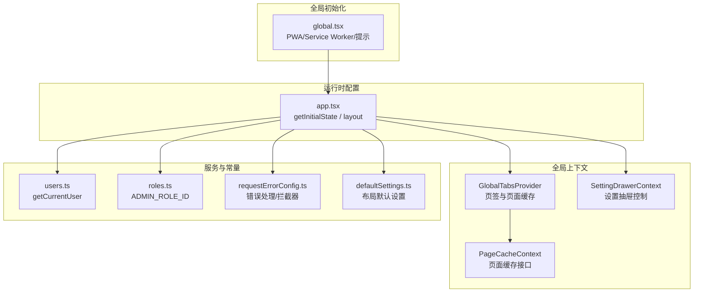
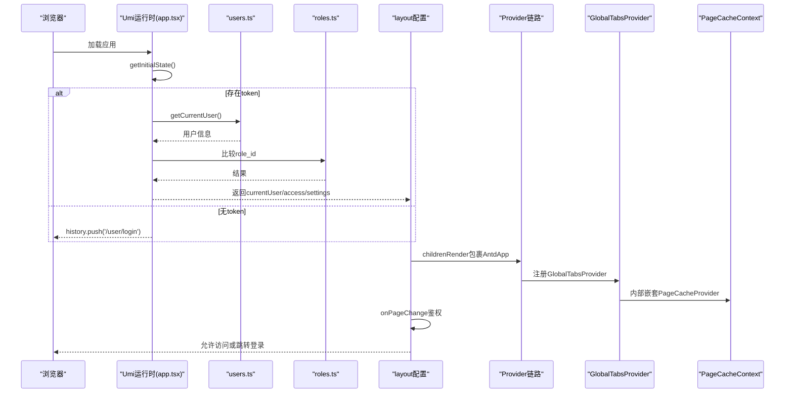
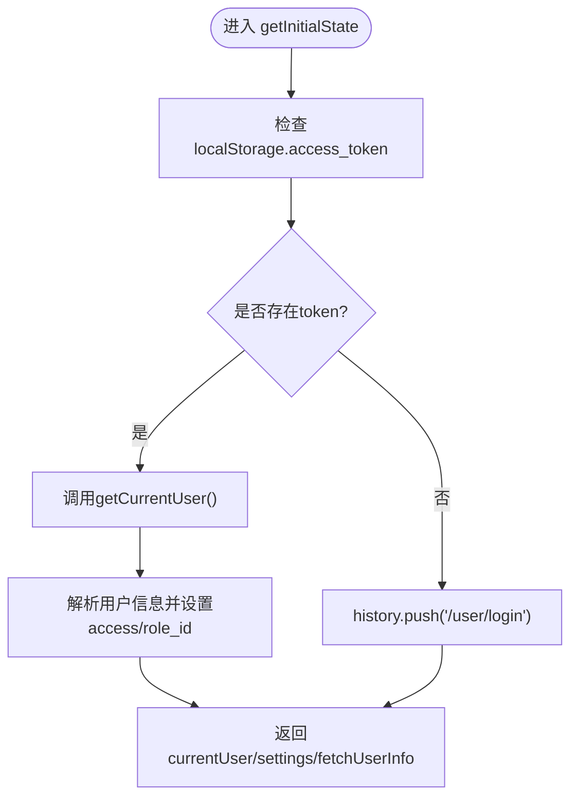
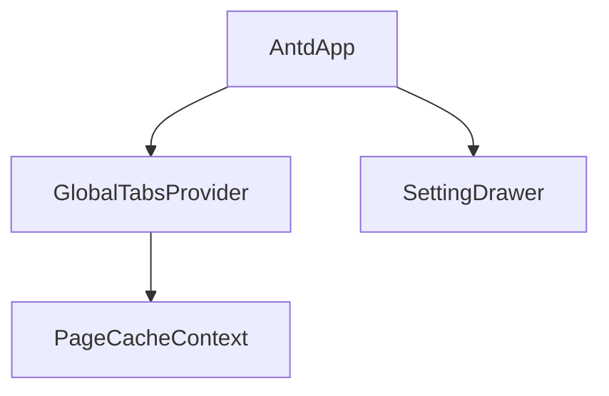
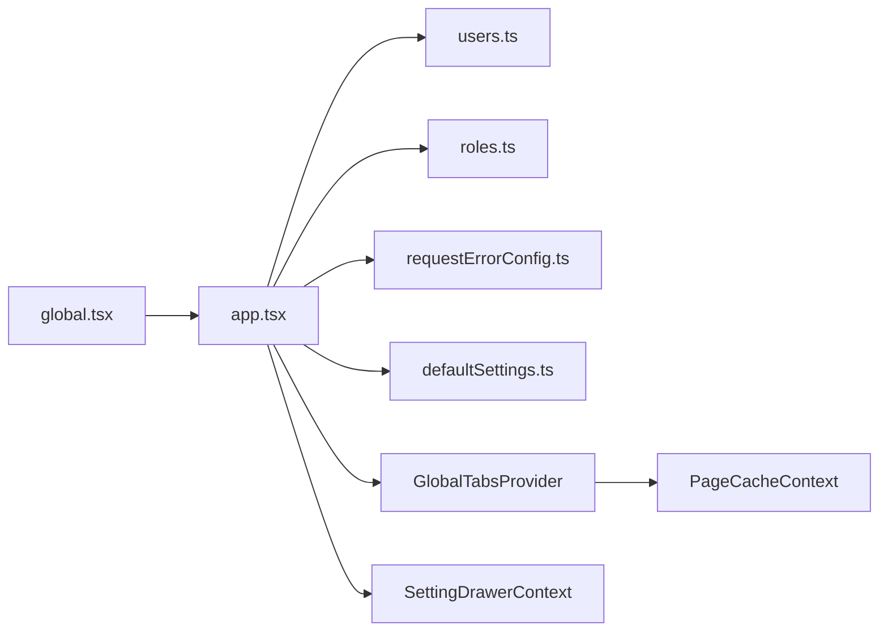

# 全局状态初始化

<cite>
**本文引用的文件**
- [web/src/app.tsx](file://web/src/app.tsx)
- [web/src/global.tsx](file://web/src/global.tsx)
- [web/src/contexts/PageCacheContext.tsx](file://web/src/contexts/PageCacheContext.tsx)
- [web/src/contexts/SettingDrawerContext.tsx](file://web/src/contexts/SettingDrawerContext.tsx)
- [web/src/components/GlobalTabsProvider/index.tsx](file://web/src/components/GlobalTabsProvider/index.tsx)
- [web/src/services/zquant/users.ts](file://web/src/services/zquant/users.ts)
- [web/src/constants/roles.ts](file://web/src/constants/roles.ts)
- [web/src/requestErrorConfig.ts](file://web/src/requestErrorConfig.ts)
- [web/config/defaultSettings.ts](file://web/config/defaultSettings.ts)
- [web/src/utils/routeMatcher.ts](file://web/src/utils/routeMatcher.ts)
</cite>

## 目录
1. [简介](#简介)
2. [项目结构](#项目结构)
3. [核心组件](#核心组件)
4. [架构总览](#架构总览)
5. [详细组件分析](#详细组件分析)
6. [依赖分析](#依赖分析)
7. [性能考虑](#性能考虑)
8. [故障排查指南](#故障排查指南)
9. [结论](#结论)

## 简介
本文围绕 zquant 前端应用的“全局状态初始化”进行系统性解析，重点说明以下内容：
- app.tsx 中通过运行时 getInitialState 与 layout 配置如何初始化应用级状态（用户信息、权限、菜单数据等），以及与全局上下文的关系。
- global.tsx 中全局样式、错误边界与 PWA/Service Worker 初始化逻辑。
- PageCacheProvider 等 Context Provider 在应用根组件中的注册顺序与嵌套关系。
- 初始化过程中的异步数据加载（如用户信息获取）机制、加载与错误状态管理。
- 应用启动性能优化建议（代码分割、预加载策略等）。

## 项目结构
本项目的前端位于 web/src，运行时配置集中在 app.tsx；全局样式与错误处理在 global.tsx；状态上下文通过多个 Context Provider 组织，其中 PageCacheProvider 与 GlobalTabsProvider 形成典型的 Provider 嵌套关系。

图表来源
- [web/src/app.tsx](file://web/src/app.tsx#L1-L453)
- [web/src/global.tsx](file://web/src/global.tsx#L1-L116)
- [web/src/components/GlobalTabsProvider/index.tsx](file://web/src/components/GlobalTabsProvider/index.tsx#L1-L162)
- [web/src/contexts/PageCacheContext.tsx](file://web/src/contexts/PageCacheContext.tsx#L1-L158)
- [web/src/contexts/SettingDrawerContext.tsx](file://web/src/contexts/SettingDrawerContext.tsx#L1-L42)
- [web/src/services/zquant/users.ts](file://web/src/services/zquant/users.ts#L1-L152)
- [web/src/constants/roles.ts](file://web/src/constants/roles.ts#L1-L45)
- [web/src/requestErrorConfig.ts](file://web/src/requestErrorConfig.ts#L1-L208)
- [web/config/defaultSettings.ts](file://web/config/defaultSettings.ts#L1-L60)

章节来源
- [web/src/app.tsx](file://web/src/app.tsx#L1-L453)
- [web/src/global.tsx](file://web/src/global.tsx#L1-L116)

## 核心组件
- 运行时 getInitialState：负责在应用启动时读取本地 token 并拉取用户信息，同时返回布局设置与 fetchUserInfo 方法，供后续使用。
- layout 配置：负责渲染 AntdApp 包裹层、注册 GlobalTabsProvider、SettingDrawer 与 childrenRender，以及 onPageChange 的鉴权逻辑。
- GlobalTabsProvider：在根组件中注册，提供页签与页面缓存能力，内部再嵌套 PageCacheProvider。
- PageCacheContext：提供页面缓存的增删改查与校验接口。
- SettingDrawerContext：提供 SettingDrawer 的开关控制方法。
- users.ts：封装 getCurrentUser 等用户相关 API。
- roles.ts：定义 ADMIN_ROLE_ID 等角色常量。
- requestErrorConfig.ts：统一错误处理、请求/响应拦截器、401 跳转与初始化阶段的消息延迟显示。
- defaultSettings.ts：布局默认设置。
- global.tsx：全局 PWA/Service Worker 初始化与提示。

章节来源
- [web/src/app.tsx](file://web/src/app.tsx#L1-L453)
- [web/src/components/GlobalTabsProvider/index.tsx](file://web/src/components/GlobalTabsProvider/index.tsx#L1-L162)
- [web/src/contexts/PageCacheContext.tsx](file://web/src/contexts/PageCacheContext.tsx#L1-L158)
- [web/src/contexts/SettingDrawerContext.tsx](file://web/src/contexts/SettingDrawerContext.tsx#L1-L42)
- [web/src/services/zquant/users.ts](file://web/src/services/zquant/users.ts#L1-L152)
- [web/src/constants/roles.ts](file://web/src/constants/roles.ts#L1-L45)
- [web/src/requestErrorConfig.ts](file://web/src/requestErrorConfig.ts#L1-L208)
- [web/config/defaultSettings.ts](file://web/config/defaultSettings.ts#L1-L60)
- [web/src/global.tsx](file://web/src/global.tsx#L1-L116)

## 架构总览
下图展示应用启动时全局状态初始化的关键流程：从 getInitialState 开始，到 layout 注入 Provider，再到用户信息与权限的装配，以及菜单搜索、SettingDrawer 的联动。

图表来源
- [web/src/app.tsx](file://web/src/app.tsx#L54-L154)
- [web/src/app.tsx](file://web/src/app.tsx#L270-L434)
- [web/src/components/GlobalTabsProvider/index.tsx](file://web/src/components/GlobalTabsProvider/index.tsx#L146-L160)
- [web/src/contexts/PageCacheContext.tsx](file://web/src/contexts/PageCacheContext.tsx#L139-L144)
- [web/src/services/zquant/users.ts](file://web/src/services/zquant/users.ts#L31-L35)
- [web/src/constants/roles.ts](file://web/src/constants/roles.ts#L31-L31)

## 详细组件分析

### 1) 运行时 getInitialState 与 layout 初始化
- getInitialState 负责：
  - 读取本地 token，若存在则调用 getCurrentUser 获取用户信息，并按 ADMIN_ROLE_ID 判断管理员权限，转换为 ProLayout 所需的 currentUser 结构（含 name、userid、email、access、role_id）。
  - 若无 token，则直接跳转登录页。
  - 返回 settings（来自 defaultSettings）、fetchUserInfo 方法，供后续使用。
- layout.childrenRender 注入 AntdApp 与 GlobalTabsProvider，同时渲染 SettingDrawer，并通过 onSettingChange 同步 initialState.settings。
- onPageChange 在路由变化时进行鉴权：若当前路径非公开页面且既无 currentUser 又无 token，则跳转登录。

图表来源
- [web/src/app.tsx](file://web/src/app.tsx#L54-L154)
- [web/src/services/zquant/users.ts](file://web/src/services/zquant/users.ts#L31-L35)
- [web/src/constants/roles.ts](file://web/src/constants/roles.ts#L31-L31)

章节来源
- [web/src/app.tsx](file://web/src/app.tsx#L54-L154)
- [web/src/app.tsx](file://web/src/app.tsx#L270-L434)
- [web/config/defaultSettings.ts](file://web/config/defaultSettings.ts#L1-L60)

### 2) 全局样式、错误边界与 PWA 初始化（global.tsx）
- PWA/Service Worker 管理：
  - 当 defaultSettings.pwa 为 true 时，监听 Service Worker 的 offline 与 updated 事件，提示用户离线或更新版本，并支持一键刷新。
  - 当 defaultSettings.pwa 为 false 且当前为 HTTPS 环境时，主动注销已注册的 Service Worker 并清理缓存。
- 错误边界与提示：
  - 通过 Ant Design 的 message/notification 提示用户错误信息。
  - 在初始化阶段（AntdApp 尚未渲染）对错误消息进行延迟显示，避免 UI 未就绪导致的异常。

章节来源
- [web/src/global.tsx](file://web/src/global.tsx#L1-L116)
- [web/config/defaultSettings.ts](file://web/config/defaultSettings.ts#L1-L60)

### 3) Context Provider 注册顺序与嵌套关系
- 注册顺序（从外到内）：
  1) AntdApp（layout.childrenRender 最外层包裹）
  2) GlobalTabsProvider（在 AntdApp 内注册）
  3) PageCacheProvider（在 GlobalTabsProvider 内部注册）
  4) SettingDrawer（在 AntdApp 内，与 GlobalTabsProvider 同级）
- 嵌套关系：
  - GlobalTabsProvider 内部再嵌套 PageCacheProvider，形成“页签 + 页面缓存”的组合。
  - SettingDrawerContext 在 headerTitleRender/actionsRender 中分别注入，便于右上角设置抽屉的控制。

图表来源
- [web/src/app.tsx](file://web/src/app.tsx#L405-L431)
- [web/src/components/GlobalTabsProvider/index.tsx](file://web/src/components/GlobalTabsProvider/index.tsx#L146-L160)
- [web/src/contexts/PageCacheContext.tsx](file://web/src/contexts/PageCacheContext.tsx#L139-L144)
- [web/src/contexts/SettingDrawerContext.tsx](file://web/src/contexts/SettingDrawerContext.tsx#L1-L42)

章节来源
- [web/src/app.tsx](file://web/src/app.tsx#L405-L431)
- [web/src/components/GlobalTabsProvider/index.tsx](file://web/src/components/GlobalTabsProvider/index.tsx#L146-L160)

### 4) 异步数据加载与状态管理
- 用户信息加载：
  - getInitialState 在非公开页面且存在 token 时，调用 getCurrentUser 获取用户信息，并转换为 ProLayout 所需的 currentUser 结构。
  - 若获取失败（如 401），在非登录页且响应为 401 时清除 token，避免死循环。
- 加载与错误状态：
  - 初始化阶段（AntdApp 未渲染）对错误消息进行延迟显示，避免 UI 未就绪导致的异常。
  - requestErrorConfig 在拦截器中统一处理 401 跳转与消息提示，并区分初始化阶段与运行阶段的行为。
- 菜单数据与搜索：
  - layout.menuDataRender 与 menuHeaderRender 配合使用，实现菜单搜索与过滤。
  - GlobalTabsProvider 在路由变化时自动添加页签，并通过国际化键生成页签标题。

章节来源
- [web/src/app.tsx](file://web/src/app.tsx#L54-L154)
- [web/src/app.tsx](file://web/src/app.tsx#L270-L434)
- [web/src/requestErrorConfig.ts](file://web/src/requestErrorConfig.ts#L131-L161)
- [web/src/services/zquant/users.ts](file://web/src/services/zquant/users.ts#L31-L35)
- [web/src/utils/routeMatcher.ts](file://web/src/utils/routeMatcher.ts#L124-L171)
- [web/src/components/GlobalTabsProvider/index.tsx](file://web/src/components/GlobalTabsProvider/index.tsx#L97-L124)

### 5) 菜单数据与权限装配
- 权限装配：
  - 依据用户 role_id 与 ADMIN_ROLE_ID 比较，设置 currentUser.access 为 'admin' 或 'user'，供 ProLayout 与业务组件使用。
- 菜单处理：
  - layout.menuDataRender 对菜单进行扁平化与过滤，支持分隔线与搜索匹配。
  - GlobalTabsProvider 通过国际化键与路由配置生成页签标题，增强用户体验。

章节来源
- [web/src/app.tsx](file://web/src/app.tsx#L74-L87)
- [web/src/constants/roles.ts](file://web/src/constants/roles.ts#L31-L31)
- [web/src/app.tsx](file://web/src/app.tsx#L156-L264)
- [web/src/utils/routeMatcher.ts](file://web/src/utils/routeMatcher.ts#L124-L171)

### 6) SettingDrawer 与全局设置
- SettingDrawerContext：
  - 在 headerTitleRender/actionsRender 中注入，提供 toggle 方法，用于外部触发 SettingDrawer 的打开。
- 布局设置：
  - layout.onSettingChange 将用户修改后的 settings 合并回 initialState，实现全局设置持久化。

章节来源
- [web/src/app.tsx](file://web/src/app.tsx#L301-L304)
- [web/src/app.tsx](file://web/src/app.tsx#L416-L422)
- [web/src/contexts/SettingDrawerContext.tsx](file://web/src/contexts/SettingDrawerContext.tsx#L1-L42)

## 依赖分析
- 组件耦合与内聚：
  - app.tsx 作为运行时入口，集中处理鉴权、用户信息与布局设置，耦合度较高但职责清晰。
  - GlobalTabsProvider 与 PageCacheContext 形成稳定的 Provider 嵌套，内聚页面状态与页签行为。
- 外部依赖与集成点：
  - users.ts 与后端 API 约定强耦合，错误处理与拦截器统一由 requestErrorConfig 管理。
  - defaultSettings.ts 与 ProLayout 的主题与布局配置紧密关联。
- 潜在循环依赖：
  - 未发现明显的循环依赖；Provider 注册顺序明确，从外到内。

图表来源
- [web/src/app.tsx](file://web/src/app.tsx#L1-L453)
- [web/src/global.tsx](file://web/src/global.tsx#L1-L116)
- [web/src/components/GlobalTabsProvider/index.tsx](file://web/src/components/GlobalTabsProvider/index.tsx#L1-L162)
- [web/src/contexts/PageCacheContext.tsx](file://web/src/contexts/PageCacheContext.tsx#L1-L158)
- [web/src/contexts/SettingDrawerContext.tsx](file://web/src/contexts/SettingDrawerContext.tsx#L1-L42)
- [web/src/services/zquant/users.ts](file://web/src/services/zquant/users.ts#L1-L152)
- [web/src/constants/roles.ts](file://web/src/constants/roles.ts#L1-L45)
- [web/src/requestErrorConfig.ts](file://web/src/requestErrorConfig.ts#L1-L208)
- [web/config/defaultSettings.ts](file://web/config/defaultSettings.ts#L1-L60)

章节来源
- [web/src/app.tsx](file://web/src/app.tsx#L1-L453)
- [web/src/components/GlobalTabsProvider/index.tsx](file://web/src/components/GlobalTabsProvider/index.tsx#L1-L162)
- [web/src/contexts/PageCacheContext.tsx](file://web/src/contexts/PageCacheContext.tsx#L1-L158)
- [web/src/contexts/SettingDrawerContext.tsx](file://web/src/contexts/SettingDrawerContext.tsx#L1-L42)
- [web/src/services/zquant/users.ts](file://web/src/services/zquant/users.ts#L1-L152)
- [web/src/constants/roles.ts](file://web/src/constants/roles.ts#L1-L45)
- [web/src/requestErrorConfig.ts](file://web/src/requestErrorConfig.ts#L1-L208)
- [web/config/defaultSettings.ts](file://web/config/defaultSettings.ts#L1-L60)
- [web/src/global.tsx](file://web/src/global.tsx#L1-L116)

## 性能考虑
- 代码分割与懒加载：
  - 将大型页面或组件按路由拆分，利用 Umi 的动态导入能力减少首屏体积。
  - 将 SettingDrawer 的渲染置于 childrenRender 中，避免不必要的提前挂载。
- 预加载策略：
  - 对高频访问的页面（如仪表盘、数据列表）进行预加载，提升二次进入体验。
  - 利用浏览器的 prefetch/ prerender（视环境而定）对关键资源进行预取。
- 初始化阶段优化：
  - requestErrorConfig 已在初始化阶段延迟显示错误消息，避免 UI 未就绪导致的闪烁。
  - global.tsx 在 HTTPS 环境下主动注销 Service Worker 并清理缓存，避免陈旧缓存影响性能。
- Provider 层级优化：
  - PageCacheProvider 与 GlobalTabsProvider 嵌套层级合理，避免过度嵌套导致的渲染抖动。
  - SettingDrawerContext 仅在需要时触发，减少无关重渲染。

章节来源
- [web/src/app.tsx](file://web/src/app.tsx#L405-L431)
- [web/src/requestErrorConfig.ts](file://web/src/requestErrorConfig.ts#L131-L161)
- [web/src/global.tsx](file://web/src/global.tsx#L100-L116)

## 故障排查指南
- 用户信息获取失败（401）：
  - 现象：getInitialState 中捕获错误，若非登录页且响应为 401，清除 token 并允许 onPageChange 再次判定跳转。
  - 建议：检查后端 JWT 令牌有效性与过期时间，确认请求拦截器已正确附加 Authorization 头。
- 初始化阶段消息显示异常：
  - 现象：初始化阶段（AntdApp 未渲染）对错误消息进行延迟显示。
  - 建议：确认 AntdApp 已正确包裹，避免在 childrenRender 之外使用 message/notification。
- SettingDrawer 无法打开：
  - 现象：SettingDrawerContext.toggle 通过 DOM 触发按钮点击。
  - 建议：确认 DOM 中存在对应触发按钮，或改为通过 context 状态控制抽屉显隐。
- 菜单搜索无效：
  - 现象：layout.menuHeaderRender 与 menuDataRender 配合实现搜索。
  - 建议：检查路由配置与国际化键是否正确，确保菜单项未被 hideInMenu 或 divider 影响。

章节来源
- [web/src/app.tsx](file://web/src/app.tsx#L54-L154)
- [web/src/app.tsx](file://web/src/app.tsx#L270-L434)
- [web/src/requestErrorConfig.ts](file://web/src/requestErrorConfig.ts#L131-L161)
- [web/src/contexts/SettingDrawerContext.tsx](file://web/src/contexts/SettingDrawerContext.tsx#L1-L42)
- [web/src/utils/routeMatcher.ts](file://web/src/utils/routeMatcher.ts#L124-L171)

## 结论
zquant 前端的全局状态初始化以 app.tsx 为核心，结合 runtime 的 getInitialState 与 layout 配置，实现了用户信息与权限的自动装配、菜单搜索与页签管理、以及 SettingDrawer 的统一控制。通过合理的 Provider 嵌套与错误处理机制，系统在保证功能完整性的同时兼顾了初始化阶段的稳定性与性能。建议在后续迭代中进一步细化懒加载与预加载策略，并持续优化错误提示与调试日志，以提升开发与运维效率。