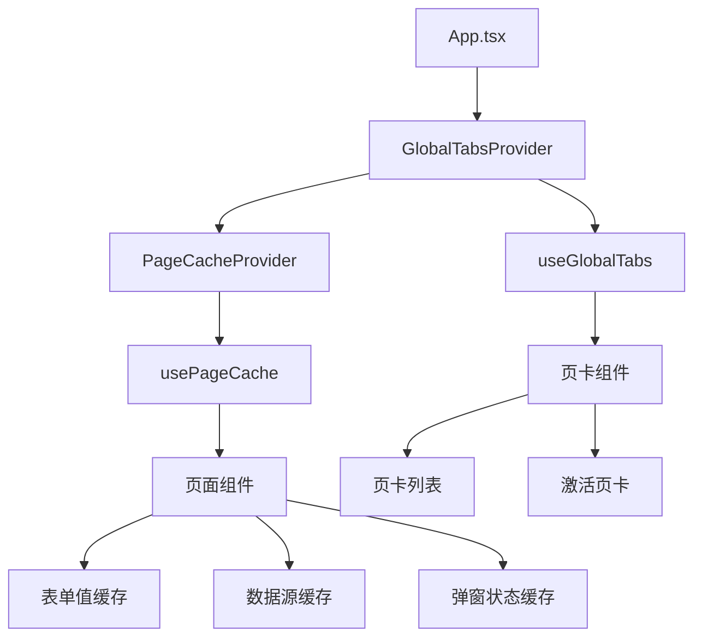
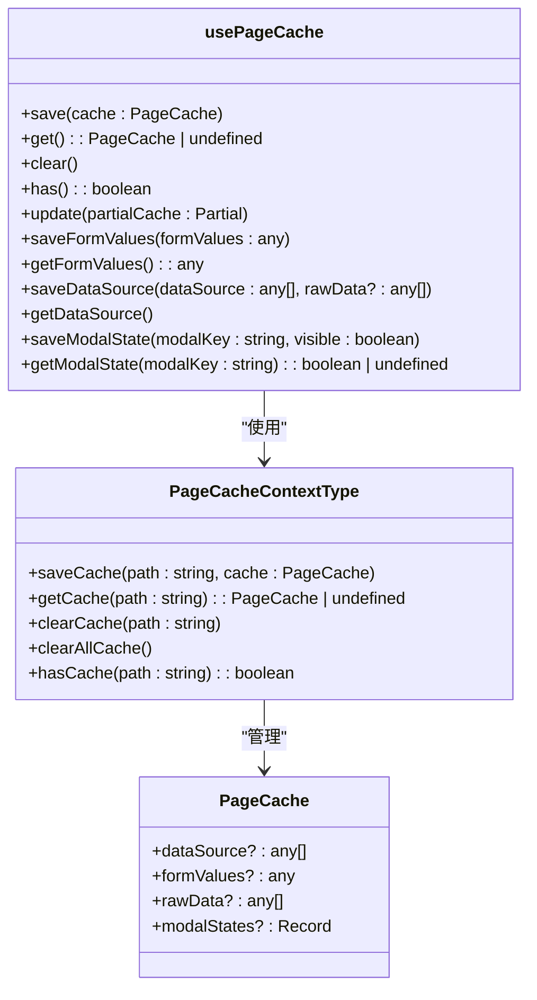
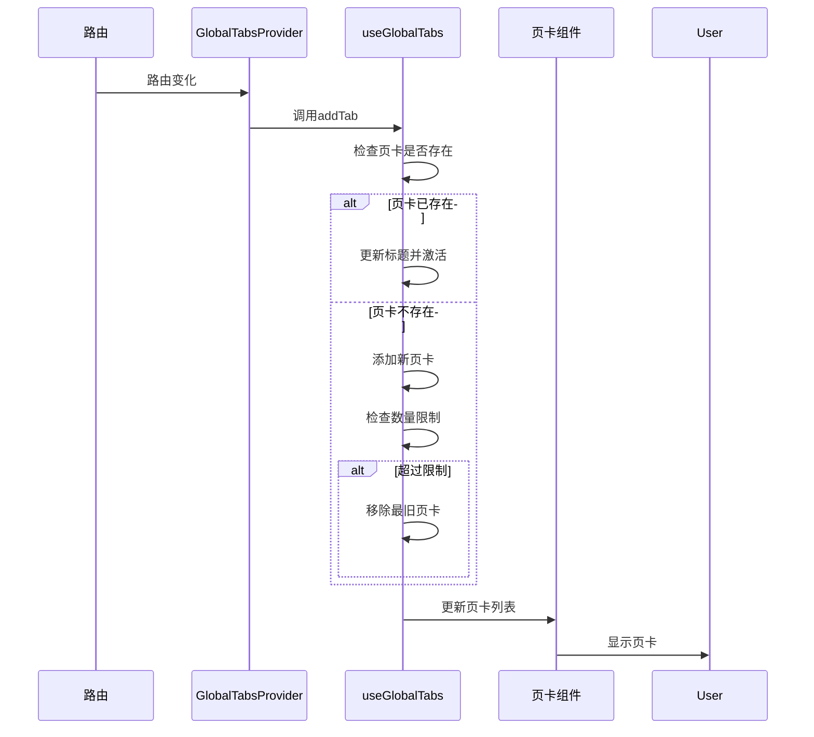

# 状态管理

<cite>
**本文档引用文件**   
- [PageCacheContext.tsx](file://web/src/contexts/PageCacheContext.tsx)
- [usePageCache.ts](file://web/src/hooks/usePageCache.ts)
- [useGlobalTabs.ts](file://web/src/hooks/useGlobalTabs.ts)
- [app.tsx](file://web/src/app.tsx)
- [GlobalTabsProvider/index.tsx](file://web/src/components/GlobalTabsProvider/index.tsx)
- [fundamentals.tsx](file://web/src/pages/data/fundamentals.tsx)
- [stocks.tsx](file://web/src/pages/data/stocks.tsx)
- [data/index.tsx](file://web/src/pages/data/index.tsx)
</cite>

## 目录
1. [引言](#引言)
2. [状态管理架构](#状态管理架构)
3. [全局状态管理](#全局状态管理)
4. [页面状态缓存机制](#页面状态缓存机制)
5. [全局页卡管理](#全局页卡管理)
6. [状态初始化流程](#状态初始化流程)
7. [最佳实践与优化](#最佳实践与优化)
8. [总结](#总结)

## 引言
zquant前端应用采用基于React Context和自定义Hook的复合状态管理方案，旨在解决多页面、多组件间的状态共享与持久化问题。该方案通过`PageCacheContext`实现页面级数据缓存，利用`useGlobalTabs`管理全局页卡状态，并结合`usePageCache`自定义Hook提供便捷的缓存操作接口。系统在`app.tsx`中完成应用级状态初始化，确保用户信息、权限等核心状态在应用启动时正确加载。本方案有效分离了全局状态与局部页面状态，提升了用户体验和应用性能。

## 状态管理架构
zquant前端状态管理采用分层架构设计，核心由React Context和自定义Hook构成。`PageCacheContext`作为底层状态存储，使用`Map<string, PageCache>`结构按页面路径存储缓存数据，实现了页面间状态的隔离与持久化。在此基础上，`usePageCache` Hook封装了路径绑定、缓存读写等操作，为页面组件提供简洁的API。`useGlobalTabs` Hook独立管理全局页卡状态，包括页卡的增删、激活和切换。整个架构通过`GlobalTabsProvider`在应用根组件中统一注入，确保状态在组件树中的可访问性。

**Diagram sources**
- [app.tsx](file://web/src/app.tsx#L408-L411)
- [GlobalTabsProvider/index.tsx](file://web/src/components/GlobalTabsProvider/index.tsx#L147-L158)
- [PageCacheContext.tsx](file://web/src/contexts/PageCacheContext.tsx#L82-L144)
- [usePageCache.ts](file://web/src/hooks/usePageCache.ts#L31-L162)
- [useGlobalTabs.ts](file://web/src/hooks/useGlobalTabs.ts#L35-L159)

## 全局状态管理
全局状态主要指用户信息、权限、通知等贯穿整个应用生命周期的核心数据。在zquant中，这些状态通过`getInitialState`函数在`app.tsx`中初始化。函数首先检查本地存储中的认证令牌，若存在则调用`getCurrentUser`服务获取用户信息，并根据`role_id`判断用户角色，转换为ProLayout所需的权限格式。全局状态通过`initialState`对象传递给应用布局组件，实现权限控制和个性化展示。对于未登录用户，系统会自动重定向至登录页面，确保应用安全。

**Section sources**
- [app.tsx](file://web/src/app.tsx#L54-L154)

## 页面状态缓存机制
页面状态缓存是提升用户体验的关键机制，通过`PageCacheContext`实现。该Context定义了`PageCache`接口，支持缓存表格数据、表单值、原始数据和弹窗状态等。`PageCacheProvider`使用`useState<Map<string, PageCache>>`管理缓存映射，每个页面路径作为唯一键。`saveCache`方法合并现有缓存与新缓存，避免数据覆盖。`usePageCache` Hook在此基础上提供路径自动绑定功能，通过`useLocation`获取当前路由，并使用`useRef`缓存路径，避免不必要的重新渲染。

**Diagram sources**
- [PageCacheContext.tsx](file://web/src/contexts/PageCacheContext.tsx#L28-L156)
- [usePageCache.ts](file://web/src/hooks/usePageCache.ts#L27-L162)

### 缓存使用示例
在`fundamentals.tsx`页面中，`usePageCache`被用于缓存表单值、数据源和弹窗状态。组件挂载时，`useEffect`从缓存恢复状态，包括表单值、数据源、报表类型和弹窗可见性。当用户提交查询时，`handleQuery`方法将表单值和查询结果保存到缓存。`onValuesChange`回调实时保存表单值，实现输入状态的持久化。这种机制确保用户在页面间切换或刷新后，仍能保持之前的操作状态。

**Section sources**
- [fundamentals.tsx](file://web/src/pages/data/fundamentals.tsx#L57-L92)
- [stocks.tsx](file://web/src/pages/data/stocks.tsx#L79-L109)

## 全局页卡管理
全局页卡管理通过`useGlobalTabs` Hook实现，支持多标签页浏览。`TabItem`接口定义了页卡的键、标题、路径和可关闭性。`useGlobalTabs`维护`tabs`和`activeKey`两个状态，提供`addTab`、`removeTab`和`changeTab`方法。`addTab`会检查页卡是否已存在，若存在则更新标题并激活，避免重复添加。系统限制最大页卡数为10个，当超过限制时，根据当前激活页卡的位置移除最旧的页卡。`GlobalTabsProvider`监听路由变化，自动为非登录页面添加页卡，并通过`getMenuTitleByPath`从路由配置中获取页卡标题。

**Diagram sources**
- [useGlobalTabs.ts](file://web/src/hooks/useGlobalTabs.ts#L35-L159)
- [GlobalTabsProvider/index.tsx](file://web/src/components/GlobalTabsProvider/index.tsx#L104-L123)

## 状态初始化流程
应用状态初始化在`app.tsx`的`getInitialState`函数中完成。流程始于检查当前路径，若为非公开页面（如登录页），则检查本地存储中的认证令牌。若令牌存在，则调用`getCurrentUser`服务获取用户信息，并根据`role_id`设置权限级别。用户信息被转换为ProLayout所需的格式，包括名称、头像、用户ID和权限。若获取失败且错误为401，则清除令牌。初始化结果包含`currentUser`、`fetchUserInfo`函数和`settings`，通过`initialState`传递给布局组件。`onPageChange`钩子在页面切换时验证用户状态，确保未登录用户无法访问受保护页面。

**Section sources**
- [app.tsx](file://web/src/app.tsx#L54-L380)

## 最佳实践与优化
### 状态共享与更新优化
状态共享应遵循最小化原则，仅将必要状态提升至全局。对于页面级状态，优先使用`usePageCache`进行缓存，而非提升至应用级Context，以减少不必要的重新渲染。`usePageCache`提供的`update`方法支持部分更新，避免全量替换缓存数据。对于复杂状态，考虑使用`useReducer`替代`useState`，将状态更新逻辑集中管理，提高可维护性。

### 内存泄漏防范
使用`useRef`缓存路径可避免在`useCallback`依赖数组中直接使用`location.pathname`，防止因路径变化导致的回调函数重建。在`useEffect`中清理定时器和事件监听器，如`dashboard.tsx`中的5分钟自动刷新定时器。`usePageCache`的`saveFormValues`在`onValuesChange`回调中调用，确保表单状态实时同步，但需注意避免在高频率事件中执行昂贵操作。

### 性能考量
`PageCacheContext`的`getCache`和`hasCache`方法将`cacheMap`作为依赖，确保缓存变化时能正确触发更新。`useCallback`广泛用于缓存函数引用，防止子组件不必要的重新渲染。对于大数据量的表格，`usePageCache`的`saveDataSource`和`getDataSource`方法可实现数据缓存，减少重复请求。在`data/index.tsx`中，每个子页面独立包裹`PageCacheProvider`，实现缓存隔离，避免不同数据类型间的相互影响。

**Section sources**
- [usePageCache.ts](file://web/src/hooks/usePageCache.ts#L36-L41)
- [dashboard.tsx](file://web/src/pages/dashboard/index.tsx#L87-L93)
- [data/index.tsx](file://web/src/pages/data/index.tsx#L45-L102)

## 总结
zquant前端状态管理方案通过React Context和自定义Hook的有机结合，实现了高效、灵活的状态管理。`PageCacheContext`和`usePageCache`解决了页面状态持久化问题，`useGlobalTabs`提供了流畅的多标签页体验。状态初始化流程严谨，确保了应用的安全性和一致性。通过合理划分全局与局部状态，结合最佳实践，该方案在提升用户体验的同时，保证了应用的性能和可维护性。未来可考虑引入更高级的状态管理库或优化缓存策略，以应对更复杂的业务场景。