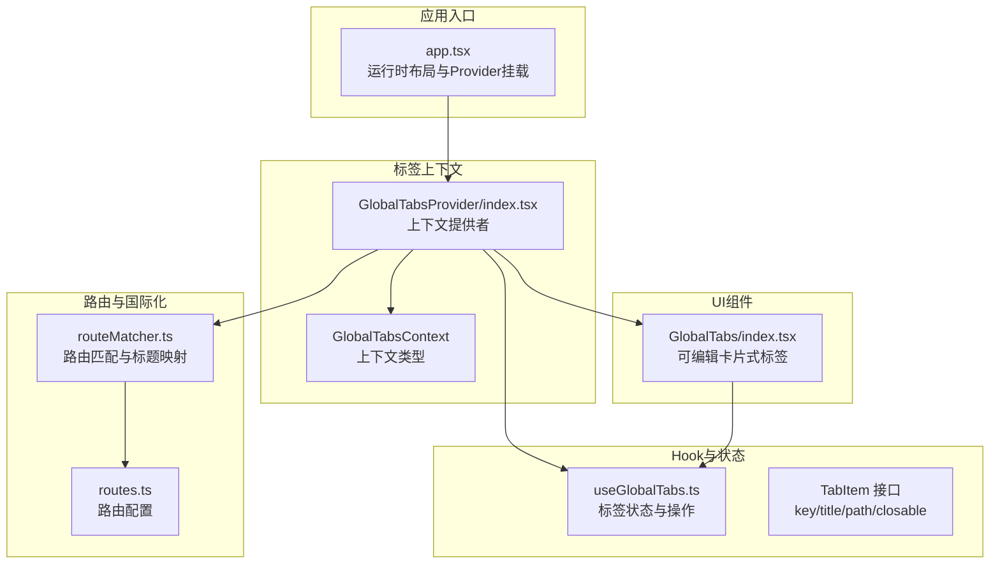
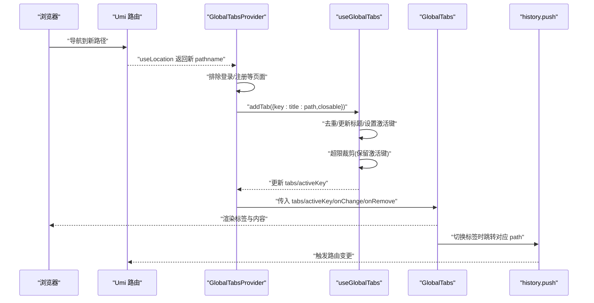
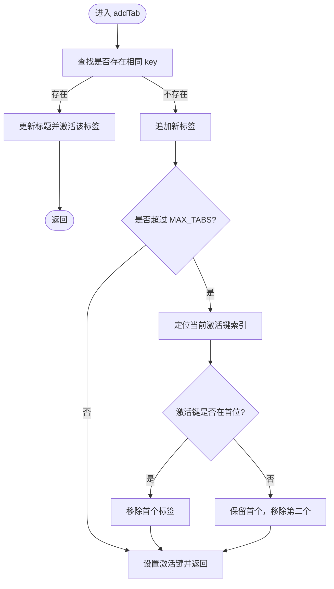
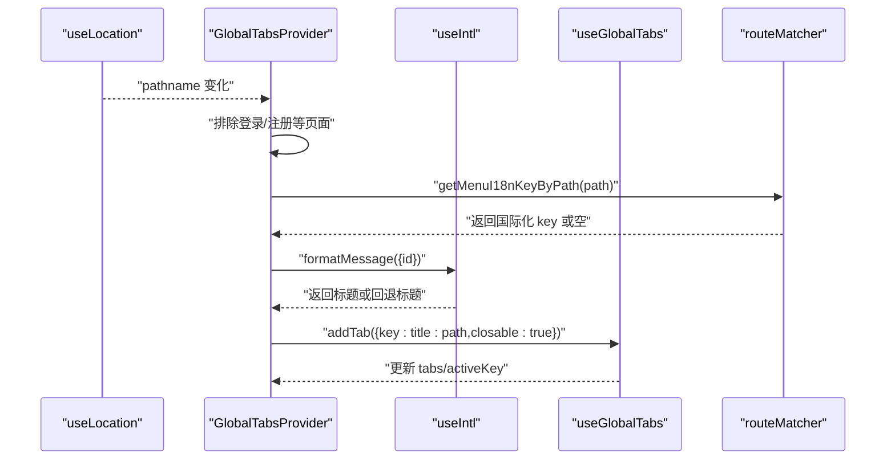
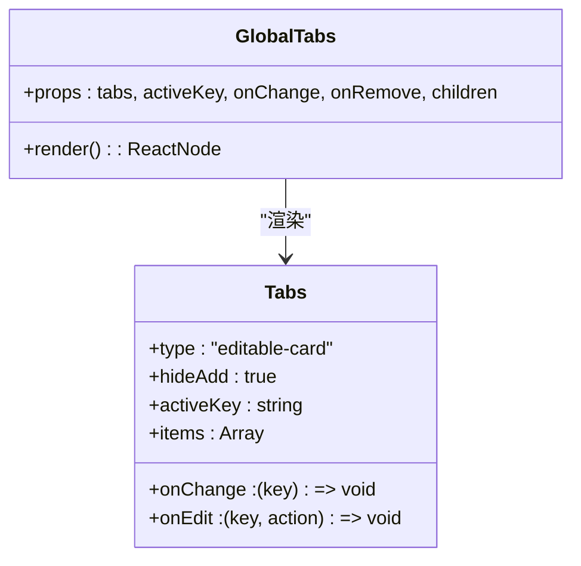
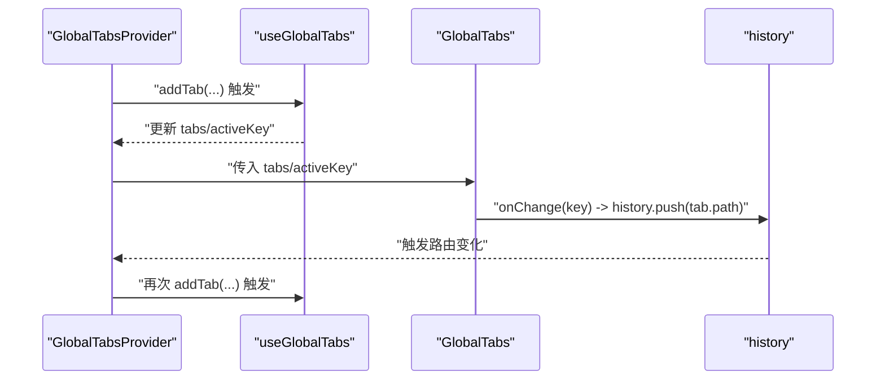
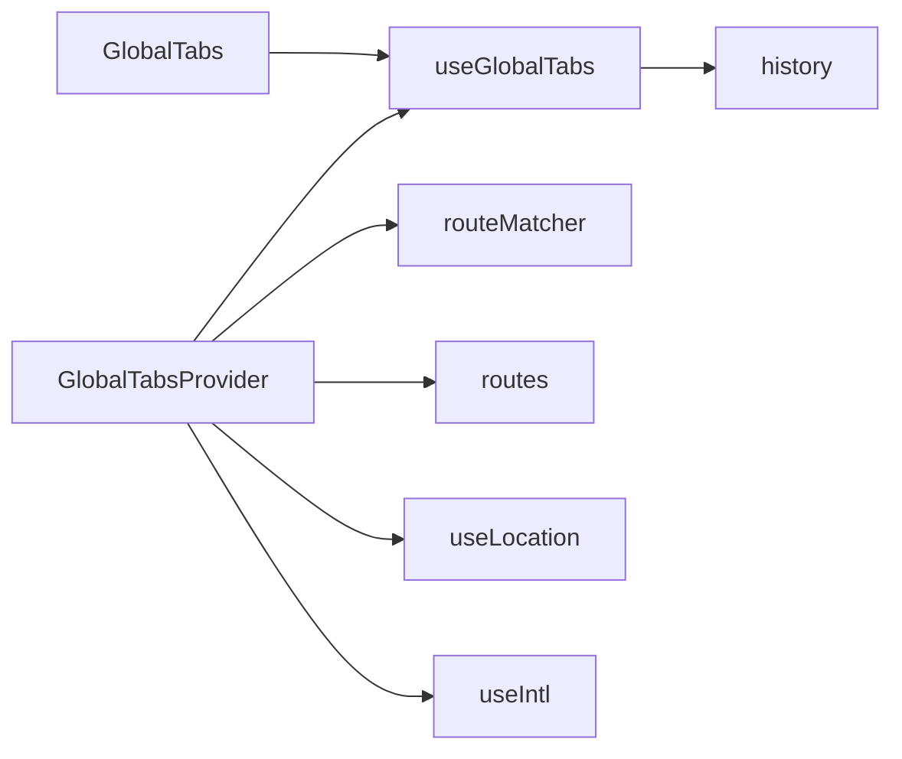

# 全局标签管理

<cite>
**本文引用的文件**
- [useGlobalTabs.ts](file://web/src/hooks/useGlobalTabs.ts)
- [GlobalTabsProvider/index.tsx](file://web/src/components/GlobalTabsProvider/index.tsx)
- [GlobalTabs/index.tsx](file://web/src/components/GlobalTabs/index.tsx)
- [routeMatcher.ts](file://web/src/utils/routeMatcher.ts)
- [app.tsx](file://web/src/app.tsx)
- [routes.ts](file://web/config/routes.ts)
</cite>

## 目录
1. [简介](#简介)
2. [项目结构](#项目结构)
3. [核心组件](#核心组件)
4. [架构总览](#架构总览)
5. [详细组件分析](#详细组件分析)
6. [依赖分析](#依赖分析)
7. [性能考量](#性能考量)
8. [故障排查指南](#故障排查指南)
9. [结论](#结论)
10. [附录](#附录)

## 简介
本文件深入解析 useGlobalTabs Hook 的实现机制，重点阐述其如何通过 GlobalTabsProvider 提供上下文，实现多标签页状态的集中管理。文档覆盖以下关键点：
- addTab、removeTab、changeTab 等核心方法的业务逻辑与边界处理
- MAX_TABS 数量限制策略与去重机制
- 标签关闭时的激活键切换与路由跳转
- 标签状态与路由系统的同步机制（useLocation 与 history 的协同）
- GlobalTabs 组件的渲染逻辑与可视化呈现
- 最佳实践与常见问题解决方案

## 项目结构
围绕全局标签管理的相关文件组织如下：
- Hooks 层：useGlobalTabs.ts 提供标签状态与操作方法
- Provider 层：GlobalTabsProvider/index.tsx 将标签状态注入上下文，监听路由变化自动添加标签
- UI 层：GlobalTabs/index.tsx 基于 Ant Design Tabs 渲染标签页并承载页面内容
- 工具层：routeMatcher.ts 提供路由配置解析与国际化标题映射
- 应用入口：app.tsx 在运行时布局中挂载 GlobalTabsProvider，形成全局标签容器

**图表来源**
- [app.tsx](file://web/src/app.tsx#L406-L431)
- [GlobalTabsProvider/index.tsx](file://web/src/components/GlobalTabsProvider/index.tsx#L97-L160)
- [useGlobalTabs.ts](file://web/src/hooks/useGlobalTabs.ts#L23-L34)
- [GlobalTabs/index.tsx](file://web/src/components/GlobalTabs/index.tsx#L44-L96)
- [routeMatcher.ts](file://web/src/utils/routeMatcher.ts#L124-L181)
- [routes.ts](file://web/config/routes.ts#L35-L120)

**章节来源**
- [app.tsx](file://web/src/app.tsx#L406-L431)
- [GlobalTabsProvider/index.tsx](file://web/src/components/GlobalTabsProvider/index.tsx#L97-L160)
- [useGlobalTabs.ts](file://web/src/hooks/useGlobalTabs.ts#L23-L34)
- [GlobalTabs/index.tsx](file://web/src/components/GlobalTabs/index.tsx#L44-L96)
- [routeMatcher.ts](file://web/src/utils/routeMatcher.ts#L124-L181)
- [routes.ts](file://web/config/routes.ts#L35-L120)

## 核心组件
- useGlobalTabs：提供标签列表、当前激活键、以及 addTab/removeTab/changeTab 等操作方法；内部维护 MAX_TABS 限制与去重逻辑；通过 history.push 同步路由。
- GlobalTabsProvider：订阅 useLocation，监听路由变化自动添加标签；将标签状态与操作方法通过上下文暴露给子树；负责标题国际化映射与特殊路径处理。
- GlobalTabs：基于 Ant Design Tabs 渲染标签页，支持可编辑卡片样式；当无标签时直接渲染内容区域。

**章节来源**
- [useGlobalTabs.ts](file://web/src/hooks/useGlobalTabs.ts#L35-L157)
- [GlobalTabsProvider/index.tsx](file://web/src/components/GlobalTabsProvider/index.tsx#L97-L160)
- [GlobalTabs/index.tsx](file://web/src/components/GlobalTabs/index.tsx#L44-L96)

## 架构总览
全局标签管理采用“Hook + Context + UI 组件”的分层设计：
- 上下文层：GlobalTabsProvider 注入标签状态与操作方法，统一管理标签生命周期。
- Hook 层：useGlobalTabs 负责标签状态与路由同步，保证 UI 与 URL 的一致性。
- UI 层：GlobalTabs 负责标签的可视化呈现与交互，承载页面内容区域。
- 工具层：routeMatcher 提供路由配置解析与国际化标题映射，确保标签标题准确显示。

**图表来源**
- [GlobalTabsProvider/index.tsx](file://web/src/components/GlobalTabsProvider/index.tsx#L98-L123)
- [useGlobalTabs.ts](file://web/src/hooks/useGlobalTabs.ts#L42-L76)
- [GlobalTabs/index.tsx](file://web/src/components/GlobalTabs/index.tsx#L52-L96)

## 详细组件分析

### useGlobalTabs Hook 分析
- 状态与常量
  - 状态：tabs（标签数组）、activeKey（当前激活键）
  - 常量：MAX_TABS=10，用于限制标签数量
- 方法
  - addTab(tab)
    - 去重：若 key 已存在，仅更新标题并激活该标签
    - 新增：若不存在，先追加，再检查是否超过 MAX_TABS
    - 超限裁剪：根据当前激活键位置，移除最旧标签（保留激活键）
    - 设置激活键：始终将新标签设为激活
  - removeTab(targetKey)
    - 过滤掉被关闭的标签
    - 若关闭的是当前激活键：根据当前位置优先向右选择，否则向左选择；若无可选则清空激活键
    - 路由跳转：若存在新的激活键，跳转到该标签的 path；否则跳转到欢迎页
  - changeTab(key)
    - 更新激活键
    - 跳转到对应标签的 path
  - getTabTitleByPath(path, menuData)
    - 从菜单数据中查找匹配的 name 作为标题，否则回退为路径片段或原路径

**图表来源**
- [useGlobalTabs.ts](file://web/src/hooks/useGlobalTabs.ts#L42-L76)

**章节来源**
- [useGlobalTabs.ts](file://web/src/hooks/useGlobalTabs.ts#L23-L34)
- [useGlobalTabs.ts](file://web/src/hooks/useGlobalTabs.ts#L42-L76)
- [useGlobalTabs.ts](file://web/src/hooks/useGlobalTabs.ts#L81-L116)
- [useGlobalTabs.ts](file://web/src/hooks/useGlobalTabs.ts#L118-L127)
- [useGlobalTabs.ts](file://web/src/hooks/useGlobalTabs.ts#L129-L157)

### GlobalTabsProvider 分析
- 路由监听与自动添加标签
  - 订阅 useLocation，当 pathname 变化时，排除登录/注册等页面
  - 通过国际化与路由配置生成标题，调用 addTab 添加或激活标签
- 标题国际化与特殊路径
  - 特殊路径映射：针对法律声明、用户协议、个人中心、个人设置等页面，直接使用固定标题
  - 国际化 key 解析：通过 routeMatcher 的 getMenuI18nKeyByPath 获取国际化 key，并使用 formatMessage 获取标题
  - 回退策略：若无法解析国际化 key 或返回无效标题，使用路径最后一段作为标题；对动态参数进行过滤
- 上下文导出
  - 将 tabs、activeKey、addTab、removeTab、changeTab、menuSearchValue、setMenuSearchValue 暴露给子树

**图表来源**
- [GlobalTabsProvider/index.tsx](file://web/src/components/GlobalTabsProvider/index.tsx#L98-L123)
- [routeMatcher.ts](file://web/src/utils/routeMatcher.ts#L124-L181)

**章节来源**
- [GlobalTabsProvider/index.tsx](file://web/src/components/GlobalTabsProvider/index.tsx#L51-L91)
- [GlobalTabsProvider/index.tsx](file://web/src/components/GlobalTabsProvider/index.tsx#L98-L123)
- [routeMatcher.ts](file://web/src/utils/routeMatcher.ts#L124-L181)

### GlobalTabs 组件分析
- 渲染逻辑
  - 当 tabs 为空时，直接渲染 children，不显示标签容器
  - 当 tabs 非空时，使用 Ant Design Tabs 渲染标签，类型为 editable-card，隐藏新增按钮
  - 标签项包含 key、label、closable 属性；内容区域统一渲染 children
- 交互处理
  - onEdit 接收 remove 动作，回调 onRemove
  - onChange 回调 changeTab，实现标签切换与路由同步

**图表来源**
- [GlobalTabs/index.tsx](file://web/src/components/GlobalTabs/index.tsx#L52-L96)

**章节来源**
- [GlobalTabs/index.tsx](file://web/src/components/GlobalTabs/index.tsx#L44-L96)

### 路由系统同步机制
- useLocation 与 history 的协同
  - GlobalTabsProvider 通过 useLocation 监听 pathname 变化，自动添加或激活标签
  - useGlobalTabs 的 changeTab/removeTab 内部均调用 history.push，确保标签切换与路由一致
- 动态路由与国际化标题
  - routeMatcher 支持动态路由参数匹配（如 /backtest/detail/:id），通过正则匹配确保标题映射正确
  - 国际化 key 构建遵循嵌套规则，支持多层级菜单标题

**图表来源**
- [GlobalTabsProvider/index.tsx](file://web/src/components/GlobalTabsProvider/index.tsx#L98-L123)
- [useGlobalTabs.ts](file://web/src/hooks/useGlobalTabs.ts#L118-L127)
- [GlobalTabs/index.tsx](file://web/src/components/GlobalTabs/index.tsx#L72-L87)

**章节来源**
- [GlobalTabsProvider/index.tsx](file://web/src/components/GlobalTabsProvider/index.tsx#L98-L123)
- [useGlobalTabs.ts](file://web/src/hooks/useGlobalTabs.ts#L118-L127)
- [routeMatcher.ts](file://web/src/utils/routeMatcher.ts#L48-L88)
- [routeMatcher.ts](file://web/src/utils/routeMatcher.ts#L124-L172)

## 依赖分析
- 组件耦合
  - GlobalTabsProvider 依赖 useGlobalTabs、useLocation、useIntl、routeMatcher、routes
  - GlobalTabs 依赖 useGlobalTabs 的状态与回调
  - useGlobalTabs 依赖 history 与内部状态
- 外部依赖
  - Ant Design Tabs 用于标签渲染
  - Umi 路由与 history 用于导航与监听
  - 国际化 API 用于标题解析

**图表来源**
- [GlobalTabsProvider/index.tsx](file://web/src/components/GlobalTabsProvider/index.tsx#L97-L160)
- [useGlobalTabs.ts](file://web/src/hooks/useGlobalTabs.ts#L23-L34)
- [GlobalTabs/index.tsx](file://web/src/components/GlobalTabs/index.tsx#L44-L96)
- [routeMatcher.ts](file://web/src/utils/routeMatcher.ts#L124-L181)
- [routes.ts](file://web/config/routes.ts#L35-L120)

**章节来源**
- [GlobalTabsProvider/index.tsx](file://web/src/components/GlobalTabsProvider/index.tsx#L97-L160)
- [useGlobalTabs.ts](file://web/src/hooks/useGlobalTabs.ts#L23-L34)
- [GlobalTabs/index.tsx](file://web/src/components/GlobalTabs/index.tsx#L44-L96)
- [routeMatcher.ts](file://web/src/utils/routeMatcher.ts#L124-L181)
- [routes.ts](file://web/config/routes.ts#L35-L120)

## 性能考量
- 状态更新策略
  - addTab 使用函数式 setState，避免闭包陷阱；仅在必要时裁剪标签，减少不必要的重渲染
- 路由监听
  - 仅在 pathname 变化时触发，避免频繁渲染；对登录/注册等页面进行排除，减少无关标签创建
- 标题解析
  - 国际化 key 解析与回退逻辑简单高效，避免深层递归带来的额外开销
- UI 渲染
  - 无标签时直接渲染内容，减少 DOM 结构复杂度

[本节为通用指导，无需特定文件引用]

## 故障排查指南
- 标签未显示或未更新
  - 检查 GlobalTabsProvider 是否包裹在应用布局中（app.tsx 中 childrenRender 已挂载）
  - 确认 pathname 是否被排除（登录/注册等页面不会创建标签）
- 标题显示异常
  - 检查路由配置 routes.ts 中是否存在 name 字段
  - 确认国际化 key 是否存在，或是否命中特殊路径映射
- 标签数量超过上限
  - 确认 MAX_TABS=10 的限制是否符合预期；激活键位置会影响被裁剪的标签
- 关闭标签后路由未跳转
  - 检查 removeTab 的激活键切换逻辑：优先右侧，否则左侧；若无可选则跳转到欢迎页
- 动态路由标题不正确
  - 确认 routeMatcher 的动态路由匹配逻辑是否正确识别路径参数

**章节来源**
- [app.tsx](file://web/src/app.tsx#L406-L431)
- [GlobalTabsProvider/index.tsx](file://web/src/components/GlobalTabsProvider/index.tsx#L98-L123)
- [routeMatcher.ts](file://web/src/utils/routeMatcher.ts#L124-L181)
- [useGlobalTabs.ts](file://web/src/hooks/useGlobalTabs.ts#L81-L116)

## 结论
useGlobalTabs 通过“Hook + Context + UI 组件”的分层设计，实现了全局标签页状态的统一管理与路由同步。其核心特性包括：
- 自动化的标签创建与激活（基于路由监听）
- 去重与标题更新（支持国际化）
- MAX_TABS 限制下的智能裁剪策略
- 关闭标签后的激活键切换与路由跳转
- 与 Ant Design Tabs 的无缝集成与良好的用户体验

在实际使用中，建议遵循最佳实践，确保路由配置与国际化 key 的完整性，以获得稳定的标签管理体验。

[本节为总结性内容，无需特定文件引用]

## 附录
- 最佳实践
  - 在路由配置中为每个页面提供清晰的 name，便于国际化标题映射
  - 对登录/注册等页面保持不创建标签的策略，避免无意义标签
  - 合理设置 MAX_TABS，平衡用户体验与内存占用
  - 使用 GlobalTabsProvider 作为全局容器，确保上下文在整个应用树中可用
- 常见问题
  - 标签不显示：确认 Provider 已挂载且 pathname 未被排除
  - 标题乱码：检查国际化 key 是否正确，或回退逻辑是否生效
  - 标签过多：理解裁剪策略，避免频繁切换激活键导致频繁移除

[本节为通用指导，无需特定文件引用]