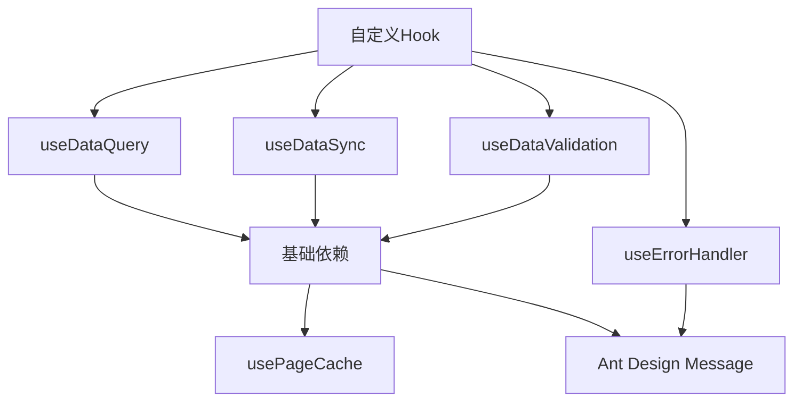
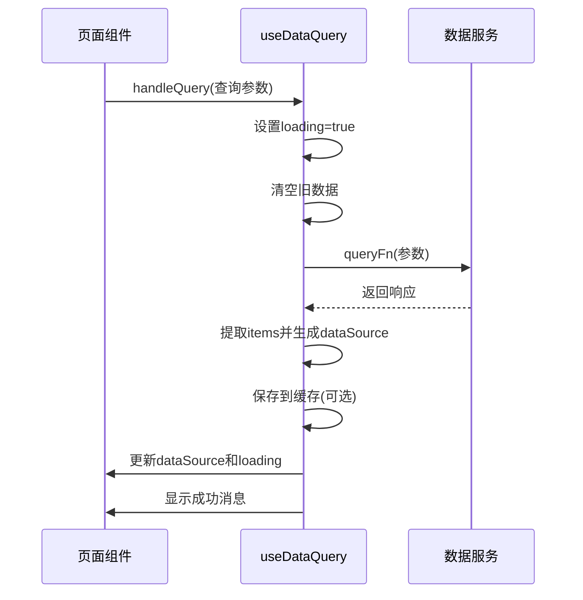
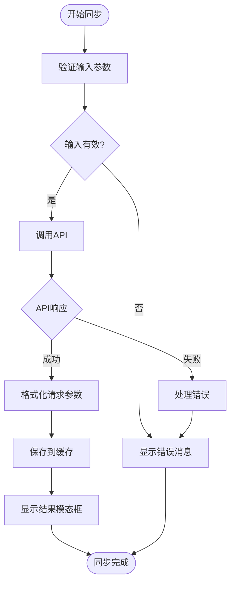
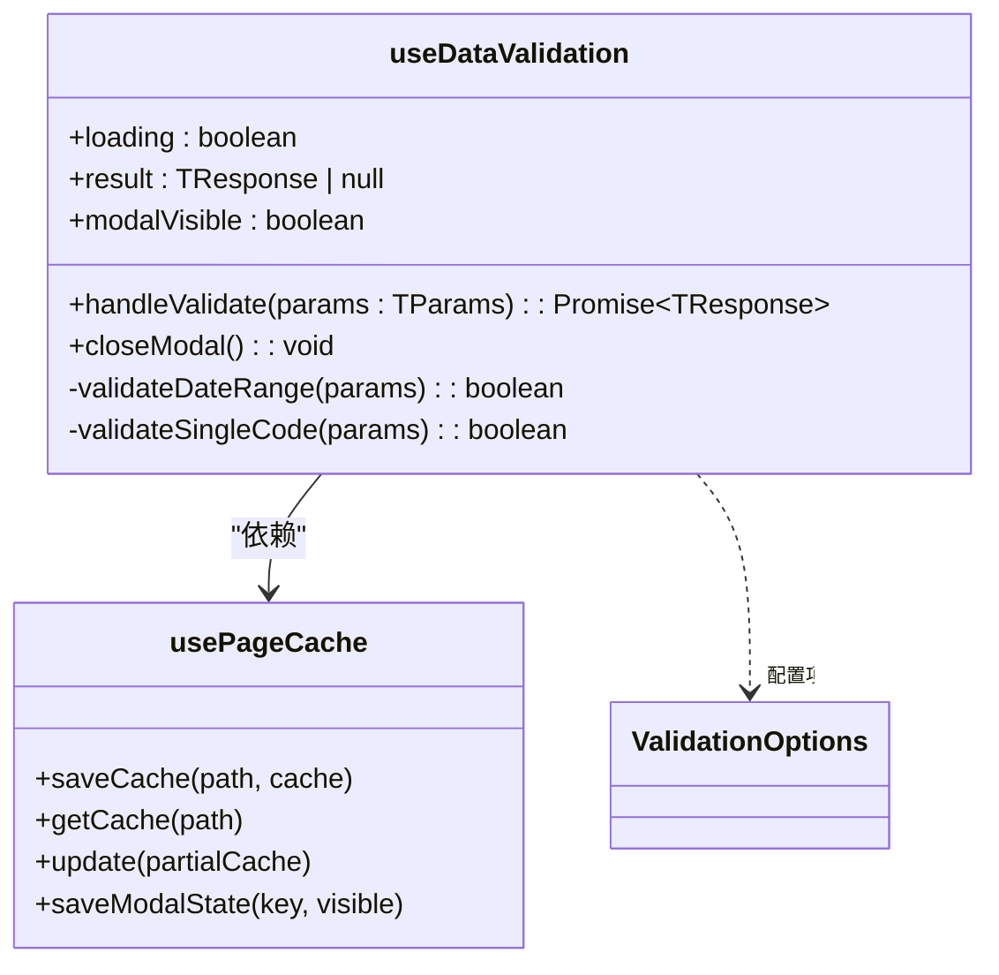
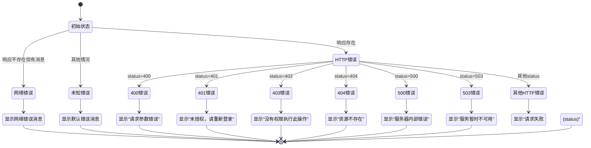
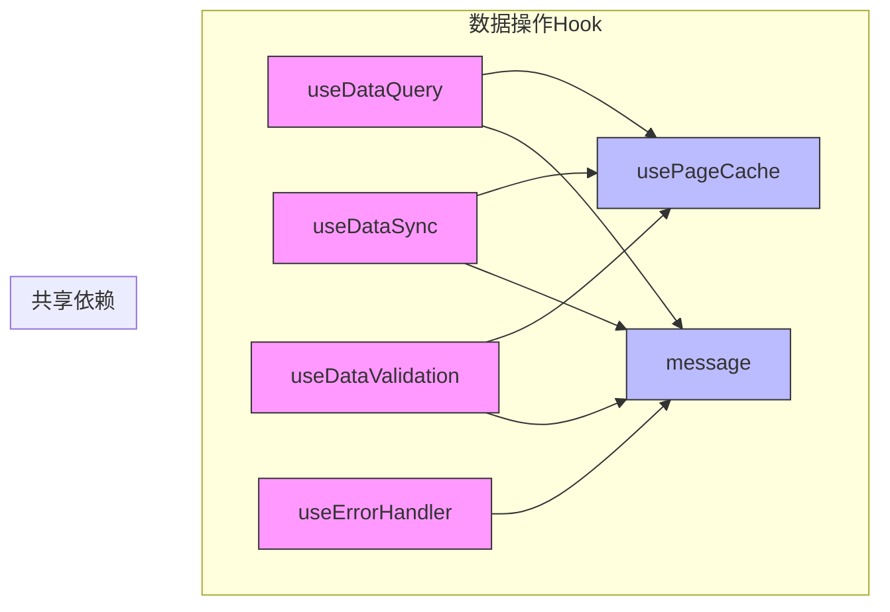

# 数据操作Hook

<cite>
**本文档引用的文件**  
- [useDataQuery.ts](file://web/src/hooks/useDataQuery.ts)
- [useDataSync.ts](file://web/src/hooks/useDataSync.ts)
- [useDataValidation.ts](file://web/src/hooks/useDataValidation.ts)
- [useErrorHandler.ts](file://web/src/hooks/useErrorHandler.ts)
- [usePageCache.ts](file://web/src/hooks/usePageCache.ts)
- [data.ts](file://web/src/services/zquant/data.ts)
- [daily.tsx](file://web/src/pages/data/daily.tsx)
- [factor.tsx](file://web/src/pages/data/factor.tsx)
</cite>

## 目录
1. [引言](#引言)  
2. [核心Hook设计模式](#核心hook设计模式)  
3. [useDataQuery：数据获取逻辑封装](#usedataquery数据获取逻辑封装)  
4. [useDataSync：数据同步机制分析](#usedatasync数据同步机制分析)  
5. [useDataValidation：表单验证实现原理](#usedatavalidation表单验证实现原理)  
6. [useErrorHandler：统一异常处理](#useerrorhandler统一异常处理)  
7. [Hook协作机制与职责分离](#hook协作机制与职责分离)  
8. [组合使用模式与最佳实践](#组合使用模式与最佳实践)  
9. [总结](#总结)

## 引言

本项目通过一系列自定义React Hook构建了统一的数据交互层，实现了数据获取、同步、验证和错误处理的标准化。这些Hook遵循单一职责原则，通过组合方式提供灵活的数据操作能力，同时利用页面缓存机制提升用户体验。本文将系统性地解析这些Hook的设计模式、协作机制和实际应用场景。

## 核心Hook设计模式

项目中的数据相关Hook采用高阶函数设计模式，接收业务逻辑函数和配置选项作为参数，返回封装好的状态和操作方法。这种设计实现了逻辑与UI的完全解耦，使Hook具有高度的可复用性和可配置性。所有Hook都遵循统一的错误处理和消息提示规范，并通过`usePageCache`实现跨页面的状态持久化。

**图示来源**  
- [useDataQuery.ts](file://web/src/hooks/useDataQuery.ts)
- [useDataSync.ts](file://web/src/hooks/useDataSync.ts)
- [useDataValidation.ts](file://web/src/hooks/useDataValidation.ts)
- [useErrorHandler.ts](file://web/src/hooks/useErrorHandler.ts)
- [usePageCache.ts](file://web/src/hooks/usePageCache.ts)

**本节来源**  
- [useDataQuery.ts](file://web/src/hooks/useDataQuery.ts)
- [useDataSync.ts](file://web/src/hooks/useDataSync.ts)
- [useDataValidation.ts](file://web/src/hooks/useDataValidation.ts)
- [useErrorHandler.ts](file://web/src/hooks/useErrorHandler.ts)

## useDataQuery：数据获取逻辑封装

`useDataQuery` Hook专门用于封装数据查询逻辑，提供统一的状态管理和加载控制。它接收三个核心参数：`queryFn`（查询函数）、`getItems`（数据提取函数）和`getKey`（键生成函数），以及可选的配置项。该Hook自动处理加载状态、错误提示和数据转换，将原始API响应转换为适合表格展示的格式。

在实际应用中，如`daily.tsx`页面所示，`useDataQuery`被用于获取日线数据，通过配置`enableCache`选项控制是否启用缓存功能。Hook内部使用`AbortController`实现请求取消，避免组件卸载后更新状态的风险。同时，它与`usePageCache`集成，支持页面间的数据缓存恢复，提升用户体验。

**图示来源**  
- [useDataQuery.ts](file://web/src/hooks/useDataQuery.ts#L71-L132)
- [daily.tsx](file://web/src/pages/data/daily.tsx#L44-L51)

**本节来源**  
- [useDataQuery.ts](file://web/src/hooks/useDataQuery.ts)
- [daily.tsx](file://web/src/pages/data/daily.tsx)

## useDataSync：数据同步机制分析

`useDataSync` Hook专注于数据同步场景，提供从外部API获取数据的完整解决方案。与`useDataQuery`不同，它主要用于触发一次性数据同步操作，通常伴随模态框显示结果。该Hook支持TS代码校验、请求参数格式化和结果缓存，通过`validateTsCodes`和`getTsCodeValidationError`配置项实现业务特定的验证逻辑。

在因子数据页面（`factor.tsx`）中，`useDataSync`被用于从Tushare接口同步因子数据。它不仅处理API调用，还管理模态框的显示状态和可编辑请求参数，支持用户修改参数后重新获取数据（`handleRefetchFromApi`）。这种设计模式将数据同步的复杂逻辑封装在Hook内部，使组件代码保持简洁。

**图示来源**  
- [useDataSync.ts](file://web/src/hooks/useDataSync.ts#L65-L138)
- [factor.tsx](file://web/src/pages/data/factor.tsx#L96-L149)

**本节来源**  
- [useDataSync.ts](file://web/src/hooks/useDataSync.ts)
- [factor.tsx](file://web/src/pages/data/factor.tsx)

## useDataValidation：表单验证实现原理

`useDataValidation` Hook实现了数据校验功能的标准化，特别适用于需要对比数据库与接口数据一致性的场景。它提供`maxDateRange`和`singleCodeOnly`等配置项，强制执行业务规则，如限制校验时间范围和仅支持单个TS代码校验。这种设计将业务规则与UI逻辑分离，确保验证逻辑的一致性。

Hook内部在执行验证前先进行参数校验，根据配置项决定是否显示相应的错误提示。校验成功后，结果会自动保存到页面缓存，并通过`setTimeout`技巧确保模态框正确显示。这种延迟显示机制解决了React状态更新的异步问题，保证了用户体验的流畅性。

**图示来源**  
- [useDataValidation.ts](file://web/src/hooks/useDataValidation.ts#L37-L152)
- [usePageCache.ts](file://web/src/hooks/usePageCache.ts)

**本节来源**  
- [useDataValidation.ts](file://web/src/hooks/useDataValidation.ts)

## useErrorHandler：统一异常处理

`useErrorHandler` Hook提供了统一的错误处理机制，将API调用中的各种异常转换为用户友好的提示消息。它根据HTTP状态码和响应内容智能选择错误消息，如401状态码显示"未授权，请重新登录"，500状态码显示"服务器内部错误"。这种标准化处理确保了整个应用错误提示的一致性。

该Hook不仅处理HTTP错误，还兼容网络错误、JSON解析错误等异常情况。通过返回`handleError`、`handleSuccess`、`handleWarning`和`handleInfo`方法，它为开发者提供了完整的消息提示解决方案。虽然在当前代码库中其他Hook直接使用`message`组件，但`useErrorHandler`为未来统一错误处理提供了基础架构。

**图示来源**  
- [useErrorHandler.ts](file://web/src/hooks/useErrorHandler.ts#L31-L74)

**本节来源**  
- [useErrorHandler.ts](file://web/src/hooks/useErrorHandler.ts)

## Hook协作机制与职责分离

项目中的数据操作Hook体现了清晰的职责分离原则：`useDataQuery`负责常规数据查询，`useDataSync`处理数据同步操作，`useDataValidation`专注数据校验，而`useErrorHandler`提供统一的错误处理。这种分工使每个Hook保持单一职责，易于维护和测试。

这些Hook通过`usePageCache`实现状态共享和持久化，形成协作网络。例如，`useDataQuery`和`useDataSync`都依赖`usePageCache`进行数据缓存和模态框状态管理。同时，它们都使用Ant Design的`message`组件进行用户反馈，确保提示风格的一致性。这种设计模式避免了重复代码，提高了开发效率。

**图示来源**  
- [useDataQuery.ts](file://web/src/hooks/useDataQuery.ts)
- [useDataSync.ts](file://web/src/hooks/useDataSync.ts)
- [useDataValidation.ts](file://web/src/hooks/useDataValidation.ts)
- [useErrorHandler.ts](file://web/src/hooks/useErrorHandler.ts)
- [usePageCache.ts](file://web/src/hooks/usePageCache.ts)

**本节来源**  
- [useDataQuery.ts](file://web/src/hooks/useDataQuery.ts)
- [useDataSync.ts](file://web/src/hooks/useDataSync.ts)
- [useDataValidation.ts](file://web/src/hooks/useDataValidation.ts)
- [useErrorHandler.ts](file://web/src/hooks/useErrorHandler.ts)
- [usePageCache.ts](file://web/src/hooks/usePageCache.ts)

## 组合使用模式与最佳实践

在实际页面开发中，这些Hook通常组合使用以构建完整的数据交互功能。以`factor.tsx`页面为例，`useDataQuery`用于展示数据库中的因子数据，`useDataSync`用于从外部API同步数据，`useDataValidation`用于校验数据一致性。这种组合模式实现了数据展示、同步和验证的完整闭环。

最佳实践包括：使用`enableCache`选项控制缓存策略，通过`options`参数定制成功/失败消息，利用`usePageCache`实现跨组件状态共享。对于需要复杂验证的场景，建议在`useDataValidation`中配置`maxDateRange`和`singleCodeOnly`等规则，确保数据操作的合规性。

**本节来源**  
- [factor.tsx](file://web/src/pages/data/factor.tsx)
- [daily.tsx](file://web/src/pages/data/daily.tsx)

## 总结

本文系统性地解析了ZQuant项目中数据相关自定义Hook的设计模式与协作机制。`useDataQuery`、`useDataSync`、`useDataValidation`和`useErrorHandler`通过职责分离和组合使用，构建了一个健壮、可维护的数据交互层。这些Hook不仅封装了复杂的数据操作逻辑，还通过统一的错误处理和缓存机制提升了用户体验。未来可进一步整合`useErrorHandler`到其他Hook中，实现完全统一的异常处理策略。