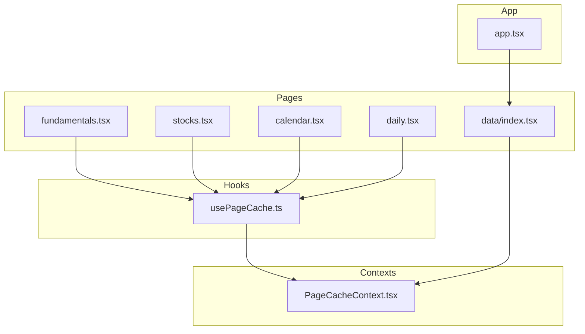
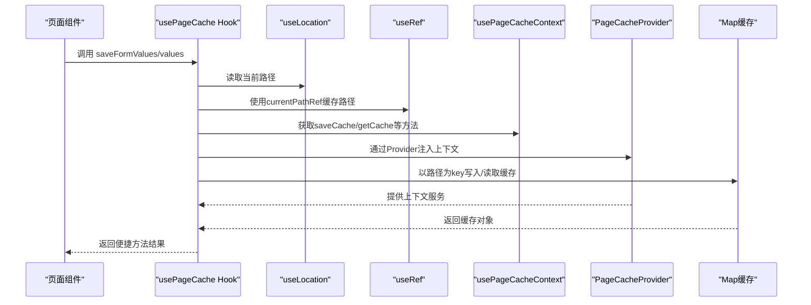
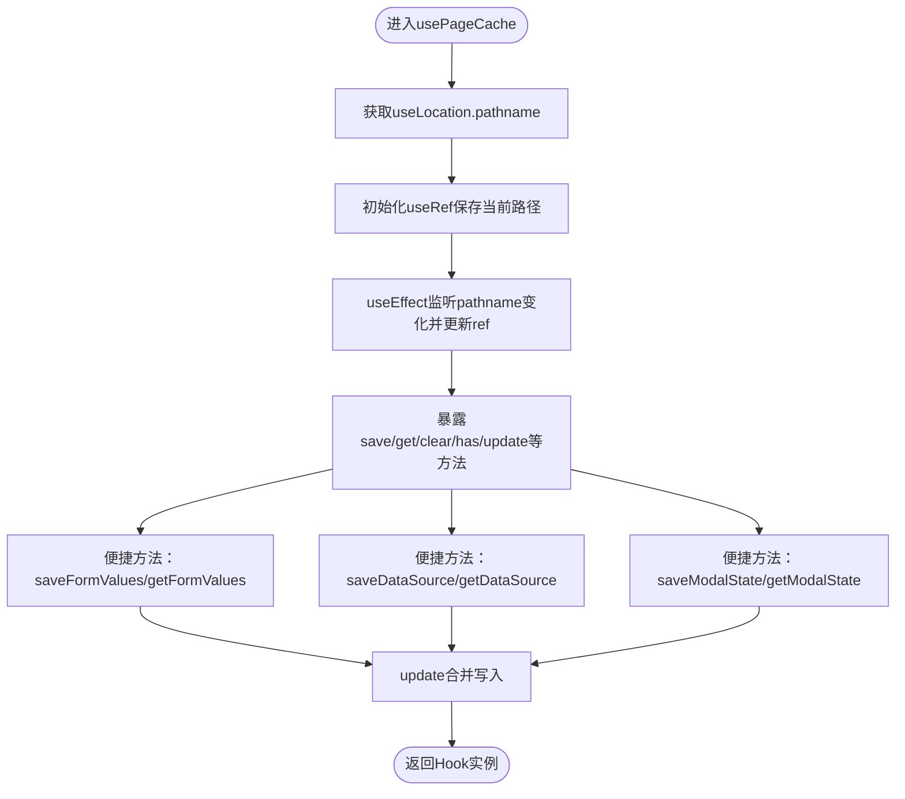
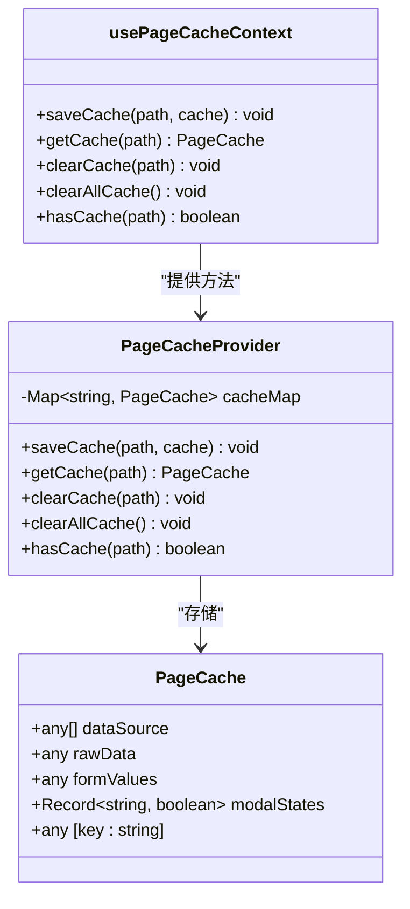
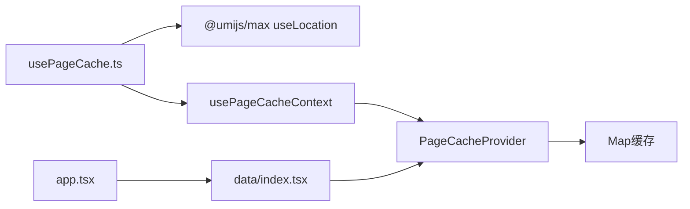

# 页面缓存Hook

<cite>
**本文引用的文件**
- [usePageCache.ts](file://web/src/hooks/usePageCache.ts)
- [PageCacheContext.tsx](file://web/src/contexts/PageCacheContext.tsx)
- [app.tsx](file://web/src/app.tsx)
- [data/index.tsx](file://web/src/pages/data/index.tsx)
- [fundamentals.tsx](file://web/src/pages/data/fundamentals.tsx)
- [stocks.tsx](file://web/src/pages/data/stocks.tsx)
- [calendar.tsx](file://web/src/pages/data/calendar.tsx)
- [daily.tsx](file://web/src/pages/data/daily.tsx)
</cite>

## 目录
1. [简介](#简介)
2. [项目结构](#项目结构)
3. [核心组件](#核心组件)
4. [架构总览](#架构总览)
5. [详细组件分析](#详细组件分析)
6. [依赖关系分析](#依赖关系分析)
7. [性能考量](#性能考量)
8. [故障排查指南](#故障排查指南)
9. [结论](#结论)
10. [附录](#附录)

## 简介
本文件系统性解析 usePageCache Hook 的设计原理与实现细节，重点说明其如何封装 PageCacheContext 实现页面状态持久化存储，深入分析 saveFormValues、getDataSource 等方法的具体逻辑，阐明基于 useLocation 的路径感知机制，解释 useRef 在缓存实例管理中的优化作用，以及如何避免不必要的重新渲染。同时讨论缓存生命周期管理策略，包括缓存清理时机与内存占用控制，并给出在表单页面与数据列表页面中的典型应用示例。

## 项目结构
usePageCache 位于前端工程 web/src/hooks/usePageCache.ts，配套的 PageCacheContext 位于 web/src/contexts/PageCacheContext.tsx。页面侧通过在特定页面容器中包裹 PageCacheProvider 来启用缓存能力，例如数据页聚合容器 web/src/pages/data/index.tsx 中对多个 Tab 子页面分别提供 PageCacheProvider。

图表来源
- [usePageCache.ts](file://web/src/hooks/usePageCache.ts#L1-L162)
- [PageCacheContext.tsx](file://web/src/contexts/PageCacheContext.tsx#L1-L158)
- [data/index.tsx](file://web/src/pages/data/index.tsx#L1-L111)
- [fundamentals.tsx](file://web/src/pages/data/fundamentals.tsx#L1-L676)
- [stocks.tsx](file://web/src/pages/data/stocks.tsx#L1-L691)
- [calendar.tsx](file://web/src/pages/data/calendar.tsx#L1-L872)
- [daily.tsx](file://web/src/pages/data/daily.tsx#L1-L766)
- [app.tsx](file://web/src/app.tsx#L1-L453)

章节来源
- [usePageCache.ts](file://web/src/hooks/usePageCache.ts#L1-L162)
- [PageCacheContext.tsx](file://web/src/contexts/PageCacheContext.tsx#L1-L158)
- [data/index.tsx](file://web/src/pages/data/index.tsx#L1-L111)

## 核心组件
- usePageCache Hook：对外暴露一组便捷方法，基于当前路由路径进行缓存读写，包含基础方法（save/get/clear/has/update）与表单/数据源/弹窗状态的便捷方法（saveFormValues/getFormValues/saveDataSource/getDataSource/saveModalState/getModalState），并提供只读 currentPath。
- PageCacheContext：提供 PageCacheProvider 与 usePageCacheContext，内部以 Map 存储每个路径对应的缓存对象，支持合并更新、按路径查询/删除、清空全部等能力。

章节来源
- [usePageCache.ts](file://web/src/hooks/usePageCache.ts#L1-L162)
- [PageCacheContext.tsx](file://web/src/contexts/PageCacheContext.tsx#L1-L158)

## 架构总览
usePageCache 通过 useLocation 获取当前路径，结合 useRef 缓存当前路径，避免在路径未变化时重复计算；通过 usePageCacheContext 获取 Provider 内部的 saveCache/getCache/clearCache/hasCache 方法，实现以路径为键的缓存映射。页面侧在需要持久化状态的容器中包裹 PageCacheProvider，从而在该容器及其子树内共享同一份缓存。

图表来源
- [usePageCache.ts](file://web/src/hooks/usePageCache.ts#L1-L162)
- [PageCacheContext.tsx](file://web/src/contexts/PageCacheContext.tsx#L1-L158)

## 详细组件分析

### usePageCache Hook 设计与实现
- 路由路径感知：通过 useLocation 获取 pathname，并用 useRef 存储 currentPathRef，仅在 pathname 变化时更新，避免在路径未变化时重复计算，减少不必要的依赖变更。
- 基础方法：
  - save(cache)：调用 saveCache(currentPathRef.current, cache)，内部对已有缓存与新缓存进行浅合并，避免覆盖其他字段。
  - get()：返回 getCache(currentPathRef.current)。
  - clear()：调用 clearCache(currentPathRef.current)。
  - has()：返回 hasCache(currentPathRef.current)。
  - update(partialCache)：先 get()，若无则为空对象，再以浅合并方式保存，实现“部分字段更新”。
- 表单与数据源便捷方法：
  - saveFormValues(formValues)：通过 update({ formValues }) 保存表单值。
  - getFormValues()：从 get() 结果中读取 formValues。
  - saveDataSource(dataSource, rawData?)：通过 update({ dataSource, rawData }) 保存表格数据与原始数据。
  - getDataSource()：从 get() 结果中读取 { dataSource, rawData }。
- 弹窗状态管理：
  - saveModalState(modalKey, visible)：读取现有 modalStates，合并后保存。
  - getModalState(modalKey)：从 get() 结果中读取对应 modalKey 的可见性。
- 只读 currentPath：导出 currentPathRef.current，便于外部了解当前路径。

图表来源
- [usePageCache.ts](file://web/src/hooks/usePageCache.ts#L1-L162)

章节来源
- [usePageCache.ts](file://web/src/hooks/usePageCache.ts#L1-L162)

### PageCacheContext Provider 与缓存存储
- PageCacheProvider：以 Map<string, PageCache> 存储缓存，key 为页面路径，value 为 PageCache 对象。
- 方法：
  - saveCache(path, cache)：对已存在缓存与新缓存进行浅合并后写入 Map。
  - getCache(path)：按路径读取缓存。
  - clearCache(path)：删除指定路径的缓存。
  - clearAllCache()：清空整个 Map。
  - hasCache(path)：判断是否存在该路径缓存。
- PageCache 接口：包含 dataSource/rawData/formValues/modalStates 等字段，以及扩展字段，满足不同页面的多样化状态持久化需求。

图表来源
- [PageCacheContext.tsx](file://web/src/contexts/PageCacheContext.tsx#L1-L158)

章节来源
- [PageCacheContext.tsx](file://web/src/contexts/PageCacheContext.tsx#L1-L158)

### 路由路径感知与 currentPathRef 优化
- 通过 useLocation 获取 pathname，并用 useRef 保存 currentPathRef，仅在 pathname 变化时更新，避免在依赖数组中将 location 本身作为依赖，从而减少不必要的回调重建与重新渲染。
- 在 Hook 内部，所有与路径相关的操作均使用 currentPathRef.current，保证在路径未变化期间不会因依赖变更导致重新计算。

章节来源
- [usePageCache.ts](file://web/src/hooks/usePageCache.ts#L1-L162)

### saveFormValues 与 getFormValues 的实现逻辑
- saveFormValues：接收表单值，通过 update({ formValues }) 将其合并写入当前路径缓存。
- getFormValues：从当前路径缓存中读取 formValues，若无则返回 undefined。
- 典型应用场景：页面初次挂载时从缓存恢复表单初始值；表单值变化时实时保存，提升用户体验。

章节来源
- [usePageCache.ts](file://web/src/hooks/usePageCache.ts#L1-L162)
- [fundamentals.tsx](file://web/src/pages/data/fundamentals.tsx#L1-L676)
- [stocks.tsx](file://web/src/pages/data/stocks.tsx#L1-L691)
- [calendar.tsx](file://web/src/pages/data/calendar.tsx#L1-L872)
- [daily.tsx](file://web/src/pages/data/daily.tsx#L1-L766)

### getDataSource 的实现逻辑
- getDataSource：从当前路径缓存中读取 { dataSource, rawData }，若缓存不存在则返回 undefined。
- 典型应用场景：页面初次挂载时从缓存恢复表格数据与原始数据，避免重复请求；在数据列表页面中显著降低白屏时间与网络压力。

章节来源
- [usePageCache.ts](file://web/src/hooks/usePageCache.ts#L1-L162)

### 弹窗状态管理（saveModalState/getModalState）
- saveModalState(modalKey, visible)：读取现有 modalStates，合并后保存。
- getModalState(modalKey)：读取对应弹窗的可见性。
- 典型应用场景：在“接口数据获取结果”、“数据校验结果”等弹窗中，持久化弹窗开关状态，避免用户反复打开弹窗。

章节来源
- [usePageCache.ts](file://web/src/hooks/usePageCache.ts#L1-L162)
- [fundamentals.tsx](file://web/src/pages/data/fundamentals.tsx#L1-L676)
- [stocks.tsx](file://web/src/pages/data/stocks.tsx#L1-L691)
- [calendar.tsx](file://web/src/pages/data/calendar.tsx#L1-L872)
- [daily.tsx](file://web/src/pages/data/daily.tsx#L1-L766)

### 页面容器与 Provider 的集成
- 在数据页聚合容器 data/index.tsx 中，为每个 Tab 页面分别包裹 PageCacheProvider，确保各 Tab 页面拥有独立的缓存空间。
- app.tsx 中的布局配置与路由切换逻辑不影响缓存，但需注意页面卸载/销毁策略（例如 Tabs 的 destroyInactiveTabPane=false 时，Tab 内容仍驻留，缓存得以保留）。

章节来源
- [data/index.tsx](file://web/src/pages/data/index.tsx#L1-L111)
- [app.tsx](file://web/src/app.tsx#L1-L453)

### 典型应用示例

#### 表单页面（财务数据查询）
- 初次挂载：从缓存恢复表单值、表格数据、弹窗状态等，减少请求次数。
- 表单值变化：实时保存到缓存，提升交互体验。
- 查询成功：将表格数据与原始数据保存到缓存，下次进入页面可直接展示。

参考路径
- [fundamentals.tsx](file://web/src/pages/data/fundamentals.tsx#L1-L676)

章节来源
- [fundamentals.tsx](file://web/src/pages/data/fundamentals.tsx#L1-L676)

#### 数据列表页面（股票列表）
- 初次挂载：若缓存为空则自动发起查询；若缓存存在则直接恢复数据，避免重复请求。
- 表单值变化：实时保存到缓存。
- 查询成功：将表格数据保存到缓存。

参考路径
- [stocks.tsx](file://web/src/pages/data/stocks.tsx#L1-L691)

章节来源
- [stocks.tsx](file://web/src/pages/data/stocks.tsx#L1-L691)

#### 日历视图页面（交易日历）
- 初次挂载：从缓存恢复表格/日历视图状态、弹窗状态等。
- 查询成功：保存表格数据与原始数据，同时保存视图模式（table/calendar）。
- 日历月份切换：可按需自动查询或仅更新月份状态，避免不必要的网络请求。

参考路径
- [calendar.tsx](file://web/src/pages/data/calendar.tsx#L1-L872)

章节来源
- [calendar.tsx](file://web/src/pages/data/calendar.tsx#L1-L872)

#### 数据表格页面（日线数据）
- 使用自定义数据查询 Hook，但同样通过 usePageCache 保存弹窗状态与请求结果，提升交互体验。
- 表单值变化与查询流程与上述页面一致。

参考路径
- [daily.tsx](file://web/src/pages/data/daily.tsx#L1-L766)

章节来源
- [daily.tsx](file://web/src/pages/data/daily.tsx#L1-L766)

## 依赖关系分析
- usePageCache 依赖：
  - useLocation：用于获取当前路由路径。
  - usePageCacheContext：从 Provider 获取缓存操作方法。
  - useRef：缓存 currentPath，避免路径未变化时的重复计算。
- PageCacheContext 依赖：
  - React.Context：提供上下文能力。
  - useState/useCallback：维护 Map 并暴露稳定的方法引用，避免外部组件因方法引用变化而重复渲染。
- 页面集成：
  - data/index.tsx：在每个 Tab 内部包裹 PageCacheProvider，形成局部缓存域。
  - app.tsx：全局布局配置，影响页面切换与 Tab 行为，但不直接影响缓存逻辑。

图表来源
- [usePageCache.ts](file://web/src/hooks/usePageCache.ts#L1-L162)
- [PageCacheContext.tsx](file://web/src/contexts/PageCacheContext.tsx#L1-L158)
- [data/index.tsx](file://web/src/pages/data/index.tsx#L1-L111)
- [app.tsx](file://web/src/app.tsx#L1-L453)

章节来源
- [usePageCache.ts](file://web/src/hooks/usePageCache.ts#L1-L162)
- [PageCacheContext.tsx](file://web/src/contexts/PageCacheContext.tsx#L1-L158)
- [data/index.tsx](file://web/src/pages/data/index.tsx#L1-L111)
- [app.tsx](file://web/src/app.tsx#L1-L453)

## 性能考量
- 依赖优化：
  - 将 currentPathRef.current 作为稳定依赖，避免在路径未变化时因 location 变更导致回调重建。
  - 通过 useCallback 包装方法，减少外部组件因方法引用变化引发的重渲染。
- 缓存合并策略：
  - saveCache 对现有缓存与新缓存进行浅合并，避免覆盖其他字段，提高缓存复用率。
- 内存占用控制：
  - clearCache(path) 与 clearAllCache() 提供显式清理能力；建议在页面卸载或长时间不活跃时主动清理，防止缓存无限增长。
  - 对于大型数据源（如日线数据），可考虑仅缓存必要的摘要或关键字段，避免将完整数据集长期驻留内存。
- 渲染优化：
  - 通过 useRef 缓存路径与状态，减少不必要的依赖变更，降低重渲染频率。
  - 在 Tabs 场景下，合理设置 destroyInactiveTabPane，平衡内存占用与用户体验。

[本节为通用指导，不直接分析具体文件]

## 故障排查指南
- 报错：usePageCacheContext 必须在 PageCacheProvider 内使用
  - 现象：在未包裹 PageCacheProvider 的页面中调用 usePageCache，抛出错误。
  - 处理：在目标页面容器中包裹 PageCacheProvider。
  - 参考路径：[PageCacheContext.tsx](file://web/src/contexts/PageCacheContext.tsx#L146-L156)
- 缓存未生效
  - 确认页面已包裹 PageCacheProvider。
  - 确认路径一致（含查询参数、哈希等），否则会被视为不同页面。
  - 检查 saveFormValues/saveDataSource/saveModalState 是否被正确调用。
  - 参考路径：[usePageCache.ts](file://web/src/hooks/usePageCache.ts#L1-L162)
- 缓存过大导致内存占用高
  - 主动调用 clearCache(path) 或 clearAllCache() 进行清理。
  - 对大型数据源采用分页或仅缓存必要字段。
  - 参考路径：[PageCacheContext.tsx](file://web/src/contexts/PageCacheContext.tsx#L1-L158)
- 路由切换后缓存未更新
  - 确认 currentPathRef 已随 pathname 变化更新。
  - 若页面存在复杂状态，可在 useEffect 中显式调用 update 以合并新状态。
  - 参考路径：[usePageCache.ts](file://web/src/hooks/usePageCache.ts#L1-L162)

章节来源
- [PageCacheContext.tsx](file://web/src/contexts/PageCacheContext.tsx#L146-L156)
- [usePageCache.ts](file://web/src/hooks/usePageCache.ts#L1-L162)

## 结论
usePageCache 通过 useLocation 与 useRef 实现路径感知与依赖优化，结合 PageCacheContext 的 Map 缓存与浅合并策略，为表单页面与数据列表页面提供了高效、稳定的页面状态持久化能力。其便捷方法覆盖表单值、数据源、弹窗状态等常见场景，配合 Provider 的局部缓存域设计，既能提升用户体验，又能有效控制内存占用。建议在实际业务中遵循“按需保存、及时清理”的原则，确保缓存生命周期管理合理。

[本节为总结性内容，不直接分析具体文件]

## 附录
- API 概览（来自 Hook 导出）
  - 基础方法：save/get/clear/has/update
  - 表单与数据源：saveFormValues/getFormValues/saveDataSource/getDataSource
  - 弹窗状态：saveModalState/getModalState
  - 只读属性：currentPath
- 典型页面集成位置
  - data/index.tsx：在各 Tab 内部包裹 PageCacheProvider
  - 各数据页面：fundamentals.tsx、stocks.tsx、calendar.tsx、daily.tsx

章节来源
- [usePageCache.ts](file://web/src/hooks/usePageCache.ts#L1-L162)
- [data/index.tsx](file://web/src/pages/data/index.tsx#L1-L111)