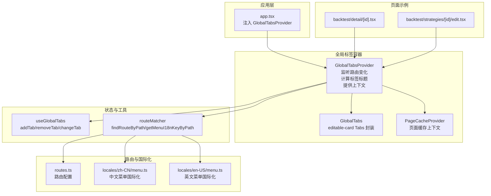
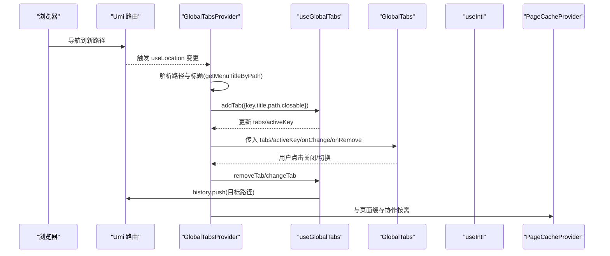
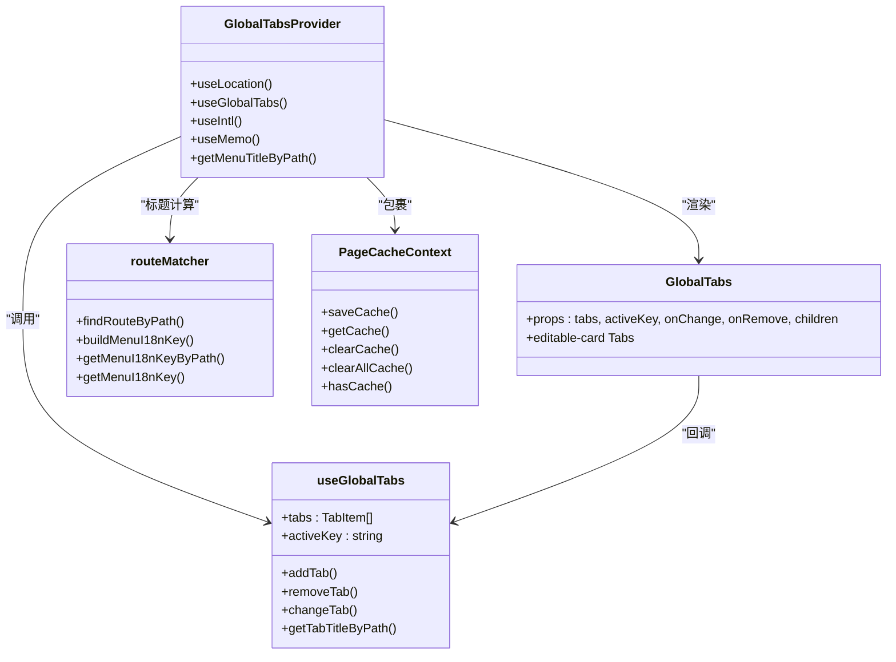

# 全局标签系统

<cite>
**本文引用的文件**
- [GlobalTabs/index.tsx](file://web/src/components/GlobalTabs/index.tsx)
- [GlobalTabsProvider/index.tsx](file://web/src/components/GlobalTabsProvider/index.tsx)
- [useGlobalTabs.ts](file://web/src/hooks/useGlobalTabs.ts)
- [PageCacheContext.tsx](file://web/src/contexts/PageCacheContext.tsx)
- [routeMatcher.ts](file://web/src/utils/routeMatcher.ts)
- [app.tsx](file://web/src/app.tsx)
- [routes.ts](file://web/config/routes.ts)
- [menu.ts(zh-CN)](file://web/src/locales/zh-CN/menu.ts)
- [menu.ts(en-US)](file://web/src/locales/en-US/menu.ts)
- [backtest/detail/[id].tsx](file://web/src/pages/backtest/detail/[id].tsx)
- [backtest/strategies/[id]/edit.tsx](file://web/src/pages/backtest/strategies/[id]/edit.tsx)
</cite>

## 目录
1. [简介](#简介)
2. [项目结构](#项目结构)
3. [核心组件](#核心组件)
4. [架构总览](#架构总览)
5. [组件详解](#组件详解)
6. [依赖关系分析](#依赖关系分析)
7. [性能考量](#性能考量)
8. [故障排查指南](#故障排查指南)
9. [结论](#结论)
10. [附录](#附录)

## 简介
本文件深入解析 zquant 前端的“全局标签系统”，围绕 GlobalTabs 组件与 GlobalTabsProvider 上下文容器的协同工作机制展开，重点说明：
- 基于 React Context 与自定义 Hook（useGlobalTabs）的状态管理架构
- 标签的动态增删、激活切换、路由联动与持久化策略
- 如何通过 useLocation 监听路由变化自动创建标签页
- 如何利用 getMenuTitleByPath 从路由配置与国际化文件中获取准确的标签标题
- editable-card 类型 Ant Design Tabs 的封装逻辑（关闭事件处理、内容区域渲染分离）
- 与 PageCacheProvider 的集成以实现标签页状态缓存
- useGlobalTabs 中 useMeno 对性能优化的作用
- 多页面使用范式、边界情况处理（如特殊路径映射）与调试方法

## 项目结构
全局标签系统主要分布在以下位置：
- 组件层：GlobalTabs、GlobalTabsProvider
- Hook 层：useGlobalTabs
- 上下文层：PageCacheContext
- 工具层：routeMatcher（路由匹配与国际化键生成）
- 应用层：app.tsx 注入 Provider 并挂载全局标签容器
- 路由与国际化：routes.ts、locales 下 menu.ts

图表来源
- [app.tsx](file://web/src/app.tsx#L408-L431)
- [GlobalTabsProvider/index.tsx](file://web/src/components/GlobalTabsProvider/index.tsx#L97-L161)
- [GlobalTabs/index.tsx](file://web/src/components/GlobalTabs/index.tsx#L44-L98)
- [useGlobalTabs.ts](file://web/src/hooks/useGlobalTabs.ts#L35-L159)
- [routeMatcher.ts](file://web/src/utils/routeMatcher.ts#L48-L172)
- [routes.ts](file://web/config/routes.ts#L35-L351)
- [menu.ts(zh-CN)](file://web/src/locales/zh-CN/menu.ts#L23-L106)
- [menu.ts(en-US)](file://web/src/locales/en-US/menu.ts#L23-L84)
- [backtest/detail/[id].tsx](file://web/src/pages/backtest/detail/[id].tsx#L1-L211)
- [backtest/strategies/[id]/edit.tsx](file://web/src/pages/backtest/strategies/[id]/edit.tsx#L1-L281)

章节来源
- [app.tsx](file://web/src/app.tsx#L408-L431)
- [routes.ts](file://web/config/routes.ts#L35-L351)

## 核心组件
- GlobalTabsProvider：负责监听路由变化、计算标签标题、提供上下文给子树；内部包裹 PageCacheProvider，实现标签页状态缓存。
- GlobalTabs：Ant Design editable-card Tabs 的封装，将标签页标题与内容区域分离渲染，避免重复渲染。
- useGlobalTabs：自定义 Hook，集中管理标签列表、激活态、增删改逻辑，并与 history 联动。
- routeMatcher：提供路由匹配与国际化键生成能力，支持动态路由与隐藏路由。
- PageCacheContext：提供页面缓存的保存、读取、清理与存在性检查能力。

章节来源
- [GlobalTabsProvider/index.tsx](file://web/src/components/GlobalTabsProvider/index.tsx#L97-L161)
- [GlobalTabs/index.tsx](file://web/src/components/GlobalTabs/index.tsx#L44-L98)
- [useGlobalTabs.ts](file://web/src/hooks/useGlobalTabs.ts#L35-L159)
- [routeMatcher.ts](file://web/src/utils/routeMatcher.ts#L48-L172)
- [PageCacheContext.tsx](file://web/src/contexts/PageCacheContext.tsx#L23-L158)

## 架构总览
全局标签系统采用“上下文 + 自定义 Hook”的模式：
- app.tsx 在 childrenRender 中注入 GlobalTabsProvider，形成全局作用域
- GlobalTabsProvider 使用 useLocation 监听路由变化，调用 useGlobalTabs 的 addTab 自动创建标签
- 标题计算通过 getMenuTitleByPath，优先从国际化键映射，再回退到路径片段
- GlobalTabs 负责 UI 展示与交互，onEdit 统一委托给 onRemove
- PageCacheProvider 与标签页生命周期配合，实现页面状态缓存

图表来源
- [app.tsx](file://web/src/app.tsx#L408-L431)
- [GlobalTabsProvider/index.tsx](file://web/src/components/GlobalTabsProvider/index.tsx#L97-L161)
- [useGlobalTabs.ts](file://web/src/hooks/useGlobalTabs.ts#L35-L159)
- [GlobalTabs/index.tsx](file://web/src/components/GlobalTabs/index.tsx#L44-L98)
- [routeMatcher.ts](file://web/src/utils/routeMatcher.ts#L124-L172)

## 组件详解

### GlobalTabsProvider：路由监听与标签标题计算
- 路由监听：通过 useLocation 监听 pathname，排除登录与注册等无需标签页的页面
- 自动创建：调用 useGlobalTabs.addTab，key 为路径，title 由 getMenuTitleByPath 生成
- 标题策略：
  - 特殊路径映射：针对法律协议、个人中心等页面提供硬编码标题
  - 国际化键：通过 getMenuI18nKeyByPath 从路由配置与国际化文件中查找
  - 回退策略：若未找到国际化键或无效，使用路径最后一段（剔除动态参数）
- 上下文提供：将 tabs、activeKey、addTab、removeTab、changeTab、搜索值等暴露给子树
- 性能优化：使用 useMemo 包裹 contextValue，减少 Provider 重渲染

章节来源
- [GlobalTabsProvider/index.tsx](file://web/src/components/GlobalTabsProvider/index.tsx#L97-L161)
- [routeMatcher.ts](file://web/src/utils/routeMatcher.ts#L124-L172)
- [routes.ts](file://web/config/routes.ts#L35-L351)
- [menu.ts(zh-CN)](file://web/src/locales/zh-CN/menu.ts#L23-L106)
- [menu.ts(en-US)](file://web/src/locales/en-US/menu.ts#L23-L84)

### GlobalTabs：editable-card 封装与内容分离
- UI 设计：type="editable-card"，hideAdd，onEdit 统一处理 remove
- 数据绑定：items 由 tabs 映射，label 为 title，key 为 tab.key
- 内容分离：children 放置在 Tabs 下方独立区域，避免每个 Tab 重复渲染内容
- 无标签页时：当 tabs 为空时直接渲染 children，提升首屏体验

章节来源
- [GlobalTabs/index.tsx](file://web/src/components/GlobalTabs/index.tsx#L44-L98)

### useGlobalTabs：标签状态管理与历史联动
- 状态：tabs、activeKey
- addTab：
  - 若 key 已存在：更新标题并激活
  - 若不存在：追加新标签，超过上限（默认 10）时按规则淘汰最旧标签
- removeTab：
  - 删除当前激活标签时：优先右侧，否则左侧，再跳转到新激活标签
  - 若无标签：跳转到欢迎页
- changeTab：切换激活标签并 push 到对应路径
- getTabTitleByPath：辅助从路由配置中提取 name 作为标题（备用）

章节来源
- [useGlobalTabs.ts](file://web/src/hooks/useGlobalTabs.ts#L35-L159)

### routeMatcher：路由匹配与国际化键生成
- findRouteByPath：精确匹配与动态路由正则匹配，支持 redirect 跳过
- buildMenuI18nKey：根据路由 name 构建 menu.* 国际化键
- getMenuI18nKeyByPath：递归查找路由，支持 includeHidden（用于标签标题）
- getMenuI18nKey：默认使用内置 routes.ts

章节来源
- [routeMatcher.ts](file://web/src/utils/routeMatcher.ts#L48-L172)
- [routes.ts](file://web/config/routes.ts#L35-L351)

### PageCacheContext：页面缓存集成
- 能力：saveCache、getCache、clearCache、clearAllCache、hasCache
- 存储：Map 结构，key 为页面路径
- 与 GlobalTabsProvider 集成：Provider 内部包裹 PageCacheProvider，便于子树按需使用

章节来源
- [PageCacheContext.tsx](file://web/src/contexts/PageCacheContext.tsx#L23-L158)
- [GlobalTabsProvider/index.tsx](file://web/src/components/GlobalTabsProvider/index.tsx#L146-L159)

### 页面示例：动态标题与标签联动
- backtest/detail/[id]：详情页返回列表时，通过 history.push 切换路径，配合 GlobalTabsProvider 自动创建/激活标签
- backtest/strategies/[id]/edit：在 useEffect 中根据策略名称动态 addTab，实现“编辑-策略名”标题

章节来源
- [backtest/detail/[id].tsx](file://web/src/pages/backtest/detail/[id].tsx#L80-L120)
- [backtest/strategies/[id]/edit.tsx](file://web/src/pages/backtest/strategies/[id]/edit.tsx#L79-L90)

## 依赖关系分析

图表来源
- [GlobalTabsProvider/index.tsx](file://web/src/components/GlobalTabsProvider/index.tsx#L97-L161)
- [GlobalTabs/index.tsx](file://web/src/components/GlobalTabs/index.tsx#L44-L98)
- [useGlobalTabs.ts](file://web/src/hooks/useGlobalTabs.ts#L35-L159)
- [routeMatcher.ts](file://web/src/utils/routeMatcher.ts#L48-L172)
- [PageCacheContext.tsx](file://web/src/contexts/PageCacheContext.tsx#L23-L158)

## 性能考量
- useGlobalTabs 中的 addTab/removeTab/changeTab 使用 useCallback 包裹，减少子组件重渲染
- GlobalTabsProvider 使用 useMemo 包裹 contextValue，避免 Provider 内部状态微小变化导致子树全量重渲染
- GlobalTabs 将 children 独立渲染，避免每个 Tab 重复渲染内容
- 标题计算优先命中国际化键，减少字符串拼接与回退逻辑成本
- 动态路由匹配使用正则预编译模式，降低重复匹配开销

章节来源
- [useGlobalTabs.ts](file://web/src/hooks/useGlobalTabs.ts#L35-L159)
- [GlobalTabsProvider/index.tsx](file://web/src/components/GlobalTabsProvider/index.tsx#L133-L145)
- [GlobalTabs/index.tsx](file://web/src/components/GlobalTabs/index.tsx#L44-L98)
- [routeMatcher.ts](file://web/src/utils/routeMatcher.ts#L148-L154)

## 故障排查指南
- 标题不显示或显示为路径：
  - 检查 routes.ts 中对应 path 是否配置 name
  - 检查 locales 中是否存在 menu.* 对应键
  - 特殊路径映射是否覆盖该路径
- 动态路由参数导致标题不正确：
  - 确认动态路由（如 :id）已在路由配置中声明
  - 确保国际化键构建逻辑能匹配到父级 name
- 标签过多导致被挤掉：
  - 默认最大标签数为 10，可通过扩展 useGlobalTabs 的 MAX_TABS 调整
- 关闭标签后跳转异常：
  - 确认 removeTab 逻辑中 activeKey 切换与 history.push 的顺序
- 国际化切换后标题未更新：
  - addTab 时会更新标题，确保传入的 title 是最新格式化后的文本
- 页面缓存未生效：
  - 确认页面使用 PageCacheContext 的 saveCache/getCache 接口
  - 确认 PageCacheProvider 在 GlobalTabsProvider 内部包裹

章节来源
- [useGlobalTabs.ts](file://web/src/hooks/useGlobalTabs.ts#L35-L159)
- [GlobalTabsProvider/index.tsx](file://web/src/components/GlobalTabsProvider/index.tsx#L97-L161)
- [routeMatcher.ts](file://web/src/utils/routeMatcher.ts#L124-L172)
- [PageCacheContext.tsx](file://web/src/contexts/PageCacheContext.tsx#L23-L158)

## 结论
全局标签系统通过“上下文 + 自定义 Hook”的清晰分层，实现了：
- 路由驱动的标签自动创建与标题国际化
- 可控的标签增删与激活切换，以及与 history 的强一致联动
- UI 与内容分离的渲染优化
- 与页面缓存上下文的无缝集成
整体设计具备良好的扩展性与可维护性，适合在多页面场景下稳定运行。

## 附录

### 多页面使用范式
- 列表页进入详情页：通过 history.push 切换路径，GlobalTabsProvider 自动创建标签
- 编辑页动态标题：在 useEffect 中根据业务数据调用 addTab，实现“编辑-名称”标题
- 动态路由：支持 /backtest/detail/:id、/backtest/strategies/:id/edit 等，标题通过国际化键与路径回退策略共同保障

章节来源
- [backtest/detail/[id].tsx](file://web/src/pages/backtest/detail/[id].tsx#L80-L120)
- [backtest/strategies/[id]/edit.tsx](file://web/src/pages/backtest/strategies/[id]/edit.tsx#L79-L90)
- [routes.ts](file://web/config/routes.ts#L165-L216)

### 边界情况处理
- 登录/注册等无需标签页的页面：在 GlobalTabsProvider 中显式排除
- 特殊路径映射：针对法律协议、个人中心等页面提供硬编码标题
- 动态路由参数：通过正则匹配与国际化键构建，保证标题一致性
- 回退策略：国际化键缺失或无效时，使用路径最后一段作为标题

章节来源
- [GlobalTabsProvider/index.tsx](file://web/src/components/GlobalTabsProvider/index.tsx#L103-L123)
- [routeMatcher.ts](file://web/src/utils/routeMatcher.ts#L148-L171)

### 调试方法
- 在 app.tsx 的 childrenRender 中确认 GlobalTabsProvider 已包裹
- 在 GlobalTabsProvider 的 useEffect 中打印 pathname 与标题生成过程
- 在 useGlobalTabs 的 addTab/removeTab/changeTab 中打印 tabs/activeKey 变化
- 在页面中使用 console.log 输出 addTab 调用时机与参数
- 使用浏览器开发者工具观察 Tabs 与内容区域的渲染次数

章节来源
- [app.tsx](file://web/src/app.tsx#L408-L431)
- [GlobalTabsProvider/index.tsx](file://web/src/components/GlobalTabsProvider/index.tsx#L97-L161)
- [useGlobalTabs.ts](file://web/src/hooks/useGlobalTabs.ts#L35-L159)