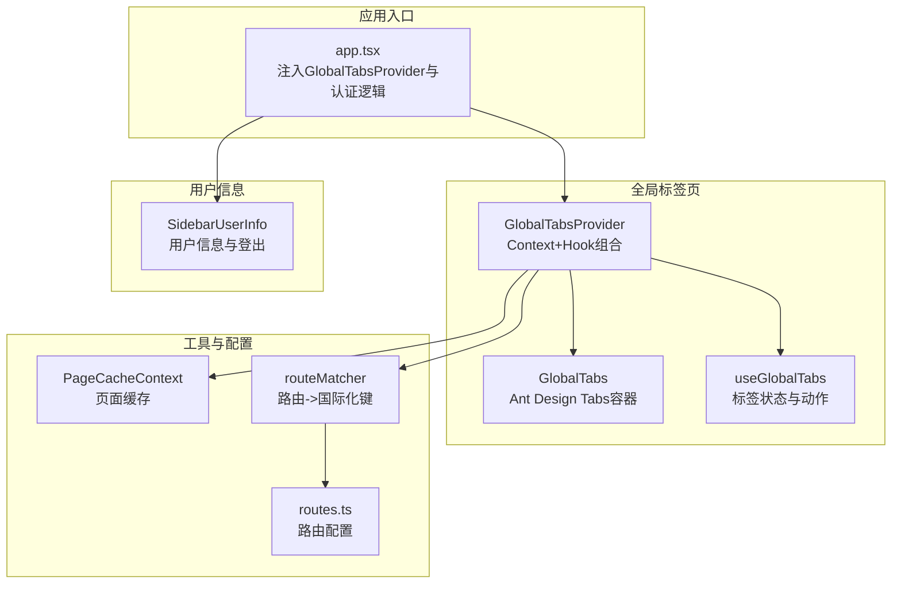
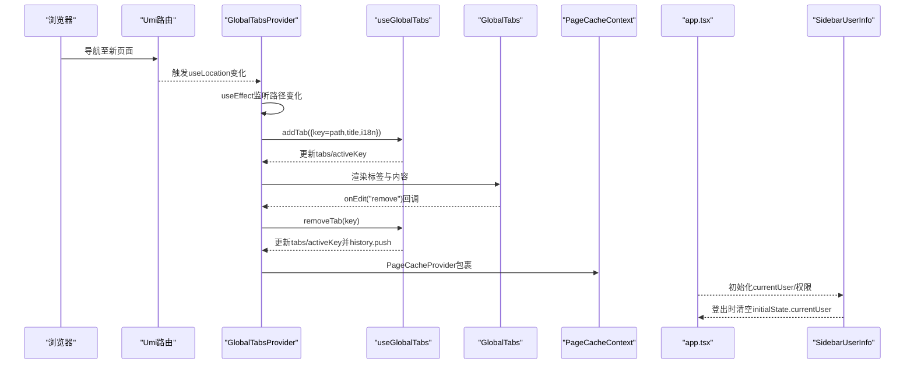
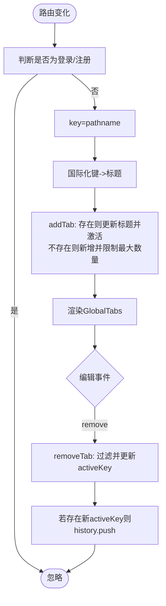
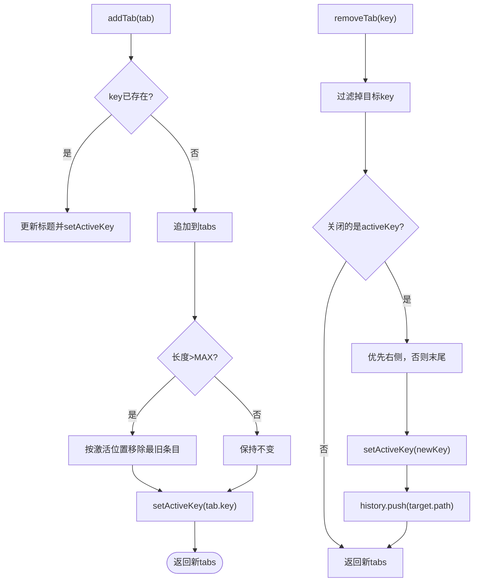
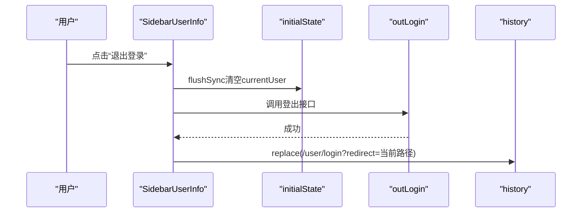
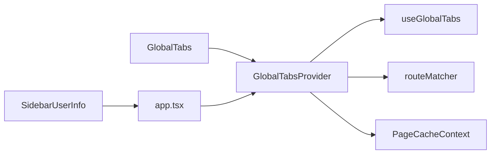

# 全局状态UI模块

<cite>
**本文引用的文件列表**
- [web/src/components/GlobalTabs/index.tsx](file://web/src/components/GlobalTabs/index.tsx)
- [web/src/components/GlobalTabsProvider/index.tsx](file://web/src/components/GlobalTabsProvider/index.tsx)
- [web/src/hooks/useGlobalTabs.ts](file://web/src/hooks/useGlobalTabs.ts)
- [web/src/components/SidebarUserInfo/index.tsx](file://web/src/components/SidebarUserInfo/index.tsx)
- [web/src/contexts/PageCacheContext.tsx](file://web/src/contexts/PageCacheContext.tsx)
- [web/src/utils/routeMatcher.ts](file://web/src/utils/routeMatcher.ts)
- [web/src/app.tsx](file://web/src/app.tsx)
- [web/src/components/index.ts](file://web/src/components/index.ts)
- [web/config/routes.ts](file://web/config/routes.ts)
</cite>

## 目录
1. [简介](#简介)
2. [项目结构](#项目结构)
3. [核心组件](#核心组件)
4. [架构总览](#架构总览)
5. [详细组件分析](#详细组件分析)
6. [依赖关系分析](#依赖关系分析)
7. [性能考量](#性能考量)
8. [故障排查指南](#故障排查指南)
9. [结论](#结论)
10. [附录：使用约定与测试建议](#附录使用约定与测试建议)

## 简介
本文件系统性地文档化 zquant Web 前端的全局状态 UI 模块，重点围绕以下目标：
- 解析 GlobalTabs 与 GlobalTabsProvider 如何基于 React Context 与自定义 Hook 实现跨页面标签页状态管理，覆盖标签增删、切换、缓存与持久化策略。
- 说明 SidebarUserInfo 在用户信息展示与会话状态同步中的作用，以及其与全局认证系统的集成方式。
- 阐述 components/index.ts 作为组件出口层的模块化组织规范，支持按需引入与 Tree Shaking 优化。
- 结合实际代码展示状态更新流程、副作用处理、边界情况应对（如并发操作）。
- 提供团队协作开发中的使用约定与测试验证方法。

## 项目结构
该模块位于 web/src 下，采用“组件 + Hooks + 上下文”的分层组织方式：
- 组件层：GlobalTabs、GlobalTabsProvider、SidebarUserInfo 等。
- 自定义 Hook：useGlobalTabs 提供标签页状态与行为。
- 上下文层：PageCacheContext 提供页面缓存能力；app.tsx 注入全局布局与认证。
- 工具层：routeMatcher 提供路由到国际化键的映射，辅助标签标题生成。
- 出口层：components/index.ts 统一导出组件与 Hook，便于按需引入与 Tree Shaking。

图表来源
- [web/src/app.tsx](file://web/src/app.tsx#L405-L433)
- [web/src/components/GlobalTabsProvider/index.tsx](file://web/src/components/GlobalTabsProvider/index.tsx#L97-L160)
- [web/src/components/GlobalTabs/index.tsx](file://web/src/components/GlobalTabs/index.tsx#L44-L96)
- [web/src/hooks/useGlobalTabs.ts](file://web/src/hooks/useGlobalTabs.ts#L35-L159)
- [web/src/contexts/PageCacheContext.tsx](file://web/src/contexts/PageCacheContext.tsx#L82-L158)
- [web/src/utils/routeMatcher.ts](file://web/src/utils/routeMatcher.ts#L124-L172)
- [web/config/routes.ts](file://web/config/routes.ts#L35-L351)

章节来源
- [web/src/app.tsx](file://web/src/app.tsx#L405-L433)
- [web/src/components/index.ts](file://web/src/components/index.ts#L23-L53)

## 核心组件
- GlobalTabsProvider：负责监听路由变化、生成标签标题、维护标签列表与活动标签，并通过 Context 暴露给子树使用。
- GlobalTabs：Ant Design Tabs 的容器组件，负责渲染标签与内容区域，处理关闭事件并回调 Provider 的 removeTab。
- useGlobalTabs：自定义 Hook，封装标签增删改查、最大数量限制、活动标签切换与历史导航。
- SidebarUserInfo：侧边栏用户信息展示与登出，与 Umi 的 initialState 同步，触发会话状态变更。
- PageCacheContext：提供页面级缓存能力，支持保存、读取、清理与全量清理。
- routeMatcher：根据路由配置与路径生成国际化键，辅助标签标题生成。
- components/index.ts：组件出口层，统一导出组件与 Hook，支持 Tree Shaking。

章节来源
- [web/src/components/GlobalTabsProvider/index.tsx](file://web/src/components/GlobalTabsProvider/index.tsx#L31-L160)
- [web/src/components/GlobalTabs/index.tsx](file://web/src/components/GlobalTabs/index.tsx#L44-L96)
- [web/src/hooks/useGlobalTabs.ts](file://web/src/hooks/useGlobalTabs.ts#L26-L159)
- [web/src/components/SidebarUserInfo/index.tsx](file://web/src/components/SidebarUserInfo/index.tsx#L93-L226)
- [web/src/contexts/PageCacheContext.tsx](file://web/src/contexts/PageCacheContext.tsx#L23-L158)
- [web/src/utils/routeMatcher.ts](file://web/src/utils/routeMatcher.ts#L124-L172)
- [web/src/components/index.ts](file://web/src/components/index.ts#L23-L53)

## 架构总览
全局标签页与用户信息的交互链路如下：

图表来源
- [web/src/components/GlobalTabsProvider/index.tsx](file://web/src/components/GlobalTabsProvider/index.tsx#L98-L131)
- [web/src/hooks/useGlobalTabs.ts](file://web/src/hooks/useGlobalTabs.ts#L42-L116)
- [web/src/components/GlobalTabs/index.tsx](file://web/src/components/GlobalTabs/index.tsx#L66-L94)
- [web/src/contexts/PageCacheContext.tsx](file://web/src/contexts/PageCacheContext.tsx#L82-L144)
- [web/src/app.tsx](file://web/src/app.tsx#L405-L433)
- [web/src/components/SidebarUserInfo/index.tsx](file://web/src/components/SidebarUserInfo/index.tsx#L93-L160)

## 详细组件分析

### GlobalTabsProvider：路由驱动的标签页生命周期
- 路由监听：通过 useLocation 监听 pathname 变化，在非登录与非注册页面自动添加标签。
- 标题生成：优先使用国际化键映射，回退到路径最后一段或默认“页面”。
- 动作暴露：addTab/removeTab/changeTab 通过 Context 暴露给子树使用。
- 上下文封装：将 tabs、activeKey、菜单搜索值等状态统一管理。
- 缓存集成：内部包裹 PageCacheProvider，为标签页内容提供缓存能力。

图表来源
- [web/src/components/GlobalTabsProvider/index.tsx](file://web/src/components/GlobalTabsProvider/index.tsx#L98-L131)
- [web/src/utils/routeMatcher.ts](file://web/src/utils/routeMatcher.ts#L124-L172)
- [web/src/hooks/useGlobalTabs.ts](file://web/src/hooks/useGlobalTabs.ts#L42-L116)

章节来源
- [web/src/components/GlobalTabsProvider/index.tsx](file://web/src/components/GlobalTabsProvider/index.tsx#L31-L160)
- [web/src/utils/routeMatcher.ts](file://web/src/utils/routeMatcher.ts#L124-L172)
- [web/src/contexts/PageCacheContext.tsx](file://web/src/contexts/PageCacheContext.tsx#L82-L144)

### GlobalTabs：标签容器与内容区
- 当 tabs 为空时，直接渲染 children，避免无意义的标签容器。
- editable-card 类型的 Tabs，仅允许关闭事件，不显示“添加”按钮。
- 将 activeKey、onChange、onEdit 映射到 Provider 的状态与动作。
- 内容区域统一渲染 children，配合 PageCacheContext 实现页面缓存。

章节来源
- [web/src/components/GlobalTabs/index.tsx](file://web/src/components/GlobalTabs/index.tsx#L44-L96)

### useGlobalTabs：标签状态与动作
- 数据结构：TabItem 包含 key、title、path、可选 closable。
- 最大标签数：MAX_TABS=10，超出时按“保留当前激活标签”的策略移除最旧标签。
- 并发安全：使用 useCallback 包裹 addTab/removeTab/changeTab，避免重复渲染导致的动作错乱。
- 切换与导航：changeTab 更新 activeKey 并 history.push 对应 path。
- 关闭逻辑：removeTab 在关闭当前激活标签时，优先选择右侧标签，否则选择末尾标签，保证用户体验连续性。

图表来源
- [web/src/hooks/useGlobalTabs.ts](file://web/src/hooks/useGlobalTabs.ts#L35-L116)

章节来源
- [web/src/hooks/useGlobalTabs.ts](file://web/src/hooks/useGlobalTabs.ts#L26-L159)

### SidebarUserInfo：用户信息与会话同步
- 会话同步：通过 useModel('@@initialState') 读取 currentUser，登出时使用 flushSync 同步清除，再调用 outLogin 并跳转登录页。
- 菜单交互：支持“个人中心”“个人设置”“退出登录”，退出登录时携带 redirect 参数，保证登录后回到原页面。
- 折叠模式：折叠时仅显示头像徽标，展开时显示用户名与在线状态。

图表来源
- [web/src/components/SidebarUserInfo/index.tsx](file://web/src/components/SidebarUserInfo/index.tsx#L93-L160)

章节来源
- [web/src/components/SidebarUserInfo/index.tsx](file://web/src/components/SidebarUserInfo/index.tsx#L93-L226)

### PageCacheContext：页面缓存策略
- 数据结构：PageCache 支持表格数据、表单值、原始数据、弹窗状态等，可扩展。
- 能力：saveCache/getCache/clearCache/clearAllCache/hasCache。
- 使用：GlobalTabsProvider 内部包裹 PageCacheProvider，为标签页内容提供缓存能力，避免频繁刷新与重复请求。

章节来源
- [web/src/contexts/PageCacheContext.tsx](file://web/src/contexts/PageCacheContext.tsx#L23-L158)
- [web/src/contexts/PageCacheContext.tsx](file://web/src/contexts/PageCacheContext.tsx#L82-L144)

### components/index.ts：组件出口层与 Tree Shaking
- 统一导出：Footer、RightContent、AvatarDropdown、SidebarUserInfo、MenuSearch、GlobalTabs、GlobalTabsProvider、useGlobalTabsContext、TopNavLinks 等。
- 模块化组织：按布局组件分类，便于按需引入，减少打包体积。
- Tree Shaking：通过命名导出与独立模块，提升按需引入时的摇树效果。

章节来源
- [web/src/components/index.ts](file://web/src/components/index.ts#L23-L53)

## 依赖关系分析
- GlobalTabsProvider 依赖：
  - useGlobalTabs（自定义 Hook）
  - useIntl（国际化）
  - useLocation（路由监听）
  - routeMatcher（国际化键生成）
  - PageCacheContext（页面缓存）
- GlobalTabs 依赖 Ant Design Tabs，接收 Provider 暴露的状态与回调。
- SidebarUserInfo 依赖 Umi 的 initialState 与 history。
- app.tsx 作为运行时配置，注入 GlobalTabsProvider 与认证初始化逻辑。

图表来源
- [web/src/components/GlobalTabsProvider/index.tsx](file://web/src/components/GlobalTabsProvider/index.tsx#L23-L30)
- [web/src/hooks/useGlobalTabs.ts](file://web/src/hooks/useGlobalTabs.ts#L23-L34)
- [web/src/utils/routeMatcher.ts](file://web/src/utils/routeMatcher.ts#L124-L172)
- [web/src/contexts/PageCacheContext.tsx](file://web/src/contexts/PageCacheContext.tsx#L82-L144)
- [web/src/components/GlobalTabs/index.tsx](file://web/src/components/GlobalTabs/index.tsx#L44-L96)
- [web/src/app.tsx](file://web/src/app.tsx#L405-L433)

章节来源
- [web/src/components/GlobalTabsProvider/index.tsx](file://web/src/components/GlobalTabsProvider/index.tsx#L23-L30)
- [web/src/app.tsx](file://web/src/app.tsx#L405-L433)

## 性能考量
- 状态更新最小化：useMemo 包装 Provider 的 contextValue，避免不必要的重渲染。
- 副作用控制：useEffect 仅监听 pathname，减少无关依赖导致的重复添加。
- 标签数量限制：MAX_TABS=10，防止内存与渲染压力过大。
- 缓存策略：PageCacheContext 使用 Map 存储，按路径作为 key，合并缓存，降低重复请求。
- Tree Shaking：components/index.ts 统一导出，按需引入组件，减小包体。

[本节为通用性能讨论，不直接分析具体文件]

## 故障排查指南
- 标签标题异常
  - 检查 routeMatcher 的国际化键生成逻辑与路由配置 name 字段。
  - 章节来源
    - [web/src/utils/routeMatcher.ts](file://web/src/utils/routeMatcher.ts#L124-L172)
    - [web/config/routes.ts](file://web/config/routes.ts#L35-L351)
- 标签无法关闭或切换异常
  - 确认 GlobalTabs 的 onEdit 回调是否正确映射到 Provider 的 removeTab。
  - 章节来源
    - [web/src/components/GlobalTabs/index.tsx](file://web/src/components/GlobalTabs/index.tsx#L66-L94)
    - [web/src/components/GlobalTabsProvider/index.tsx](file://web/src/components/GlobalTabsProvider/index.tsx#L125-L131)
- 登出后仍显示用户信息
  - 确认 SidebarUserInfo 使用 flushSync 清空 initialState.currentUser，并调用 outLogin。
  - 章节来源
    - [web/src/components/SidebarUserInfo/index.tsx](file://web/src/components/SidebarUserInfo/index.tsx#L118-L160)
- 页面缓存未生效
  - 确认页面被 PageCacheProvider 包裹，且使用 usePageCacheContext 保存/读取缓存。
  - 章节来源
    - [web/src/contexts/PageCacheContext.tsx](file://web/src/contexts/PageCacheContext.tsx#L82-L144)
    - [web/src/components/GlobalTabsProvider/index.tsx](file://web/src/components/GlobalTabsProvider/index.tsx#L146-L158)

## 结论
该全局状态 UI 模块通过 React Context 与自定义 Hook 实现了稳定的跨页面标签页管理，结合国际化与路由配置实现了标题自动生成；通过 PageCacheContext 提供页面缓存能力，提升用户体验与性能。SidebarUserInfo 与 app.tsx 的认证初始化共同保障了会话状态的一致性。components/index.ts 的出口层设计支持按需引入与 Tree Shaking，有利于规模化团队协作与长期演进。

[本节为总结性内容，不直接分析具体文件]

## 附录：使用约定与测试建议

### 使用约定
- 标签页
  - 在需要全局标签页的页面，确保顶层包裹 GlobalTabsProvider。
  - 通过 useGlobalTabsContext 获取 tabs/activeKey 与 addTab/removeTab/changeTab。
  - 避免在非必要页面创建标签（如登录页）。
- 用户信息
  - 登出时务必使用 flushSync 清空 currentUser，再调用登出接口并携带 redirect。
- 组件导出
  - 通过 components/index.ts 引入组件，避免直接从子目录导入，便于 Tree Shaking。

章节来源
- [web/src/components/GlobalTabsProvider/index.tsx](file://web/src/components/GlobalTabsProvider/index.tsx#L97-L160)
- [web/src/components/SidebarUserInfo/index.tsx](file://web/src/components/SidebarUserInfo/index.tsx#L93-L160)
- [web/src/components/index.ts](file://web/src/components/index.ts#L23-L53)

### 测试验证方法
- 单元测试（建议）
  - useGlobalTabs：覆盖 addTab（存在/不存在）、removeTab（关闭当前/非当前）、changeTab、标题回退逻辑。
  - GlobalTabsProvider：覆盖路由监听、国际化标题生成、菜单搜索值状态。
  - SidebarUserInfo：覆盖登出流程、flushSync 同步、redirect 参数。
- 集成测试（建议）
  - 路由跳转 -> 标签自动添加 -> 关闭标签 -> 切换标签 -> 历史导航。
  - 登录/登出 -> initialState 同步 -> 页面缓存读取/保存。
- 边界情况
  - 并发添加相同 key 的标签，确保去重与标题更新。
  - 标签数量达到上限后的淘汰策略与激活位置保持。
  - 动态路由（如 :id）的国际化键匹配与标题生成。

[本节为通用测试建议，不直接分析具体文件]