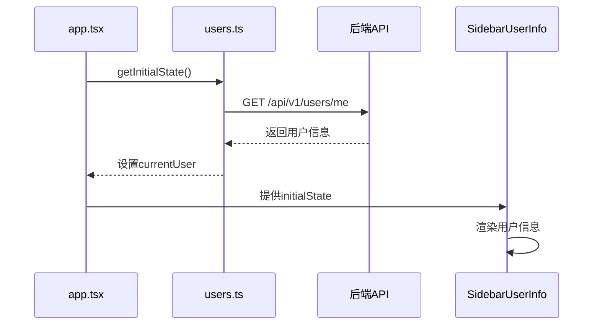
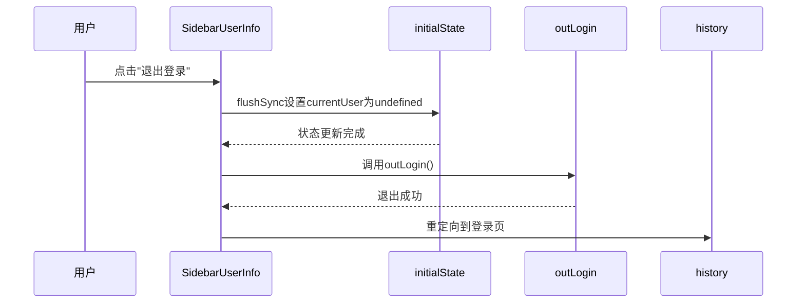
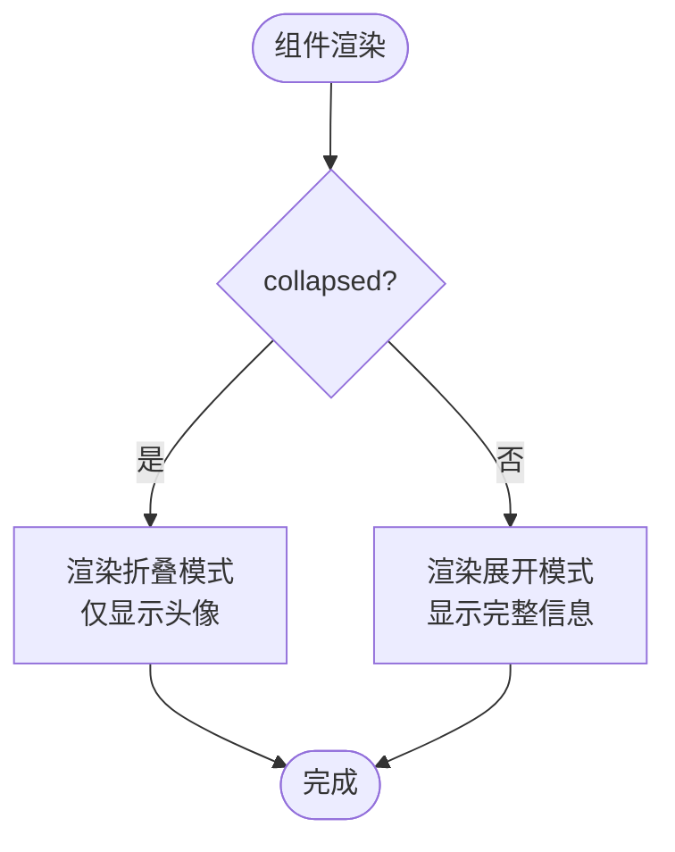

# 用户信息模块

<cite>
**本文档引用的文件**  
- [SidebarUserInfo/index.tsx](file://web/src/components/SidebarUserInfo/index.tsx)
- [app.tsx](file://web/src/app.tsx)
- [api.ts](file://web/src/services/ant-design-pro/api.ts)
- [users.ts](file://web/src/services/zquant/users.ts)
- [types/index.d.ts](file://web/types/index.d.ts)
- [config.ts](file://web/config/config.ts)
- [access.ts](file://web/src/access.ts)
- [user.ts](file://web/mock/user.ts)
</cite>

## 目录
1. [简介](#简介)
2. [核心功能与设计](#核心功能与设计)
3. [状态管理与数据流](#状态管理与数据流)
4. [用户交互与菜单逻辑](#用户交互与菜单逻辑)
5. [UI设计与响应式处理](#ui设计与响应式处理)
6. [安全退出流程](#安全退出流程)
7. [权限控制与扩展能力](#权限控制与扩展能力)
8. [团队开发使用约定](#团队开发使用约定)

## 简介
SidebarUserInfo组件是系统侧边栏中的核心用户信息展示模块，负责呈现当前登录用户的身份信息、在线状态，并提供个人中心、设置及退出登录等快捷操作入口。该组件通过Umi框架的useModel机制访问@@initialState模型获取用户数据，支持折叠/展开两种视觉模式，实现了简洁高效的用户体验。

## 核心功能与设计

SidebarUserInfo组件作为侧边栏的用户信息入口，主要实现三大核心功能：用户身份信息展示、状态指示和快捷操作入口。组件通过`collapsed`属性控制视觉模式，当侧边栏折叠时仅显示头像图标，展开时则完整展示用户名和状态信息。

组件采用函数式组件设计，通过Ant Design的Dropdown组件实现下拉菜单交互，集成个人中心、设置页面跳转和退出登录功能。Avatar组件用于显示用户头像，Badge组件用于指示在线状态，Text组件用于处理用户名的文本溢出。

**组件源**
- [SidebarUserInfo/index.tsx](file://web/src/components/SidebarUserInfo/index.tsx#L93-L226)

## 状态管理与数据流

SidebarUserInfo组件通过Umi框架的`useModel('@@initialState')`钩子访问全局初始状态模型，获取`currentUser`数据。该状态在`app.tsx`文件中的`getInitialState`函数中初始化，通过调用`getCurrentUser`服务从后端API `/api/v1/users/me`获取当前用户信息。

当用户登录后，系统将访问令牌存储在localStorage中，`getInitialState`函数在应用启动时检查该令牌并获取用户信息。如果获取失败且错误状态为401，则清除令牌并重定向到登录页面。

**图源**
- [app.tsx](file://web/src/app.tsx#L54-L154)
- [users.ts](file://web/src/services/zquant/users.ts#L31-L35)
- [SidebarUserInfo/index.tsx](file://web/src/components/SidebarUserInfo/index.tsx#L95-L96)

**节源**
- [app.tsx](file://web/src/app.tsx#L54-L154)
- [users.ts](file://web/src/services/zquant/users.ts#L31-L35)
- [SidebarUserInfo/index.tsx](file://web/src/components/SidebarUserInfo/index.tsx#L95-L96)

## 用户交互与菜单逻辑

组件通过Dropdown组件集成下拉菜单，提供个人中心、设置和退出登录三个操作入口。菜单项的点击事件通过`onMenuClick`处理器处理，根据点击的菜单项key值执行相应操作。

退出登录功能的实现特别使用了`flushSync`来确保状态同步。当用户点击"退出登录"时，首先使用`flushSync`立即更新`initialState`中的`currentUser`为undefined，然后调用`outLogin`服务执行后端退出操作，并将用户重定向到登录页面。

**图源**
- [SidebarUserInfo/index.tsx](file://web/src/components/SidebarUserInfo/index.tsx#L118-L128)
- [api.ts](file://web/src/services/ant-design-pro/api.ts#L38-L43)

**节源**
- [SidebarUserInfo/index.tsx](file://web/src/components/SidebarUserInfo/index.tsx#L118-L128)

## UI设计与响应式处理

组件的UI设计遵循Ant Design设计规范，通过`createStyles`创建CSS-in-JS样式，确保主题一致性。主要包含以下UI元素：

- **容器样式**：包含内边距、边框和背景色，提供清晰的视觉边界
- **用户信息区域**：使用flex布局，包含头像、用户名和状态指示
- **头像样式**：固定尺寸40px，支持图片和图标两种显示方式
- **用户名样式**：限制字体大小和行高，使用`textOverflow: ellipsis`处理文本溢出
- **状态指示**：使用Badge组件的dot模式或自定义statusDot样式显示在线状态

响应式设计方面，组件通过`collapsed`属性实现两种视觉模式的自适应：
- **折叠模式**：仅显示带在线指示的头像，居中显示
- **展开模式**：完整显示用户名和状态信息，采用紧凑布局

**图源**
- [SidebarUserInfo/index.tsx](file://web/src/components/SidebarUserInfo/index.tsx#L38-L87)
- [SidebarUserInfo/index.tsx](file://web/src/components/SidebarUserInfo/index.tsx#L158-L184)
- [SidebarUserInfo/index.tsx](file://web/src/components/SidebarUserInfo/index.tsx#L187-L223)

**节源**
- [SidebarUserInfo/index.tsx](file://web/src/components/SidebarUserInfo/index.tsx#L38-L87)

## 安全退出流程

安全退出流程包含前端状态清理和后端会话终止两个阶段。当用户触发退出操作时，系统执行以下步骤：

1. 使用`flushSync`立即清除`initialState`中的`currentUser`数据，确保UI立即反映未登录状态
2. 调用`outLogin`服务向后端API `/api/login/outLogin`发送退出请求
3. 构造重定向参数，保存当前页面的路径和查询参数
4. 使用history.replace导航到登录页面，携带重定向参数

退出流程特别注意安全性，避免直接使用URL中的redirect参数，而是通过构造新的searchParams来确保重定向目标的安全性。同时，后端在`mock/user.ts`中实现了退出逻辑，清除访问权限并返回成功响应。

**节源**
- [SidebarUserInfo/index.tsx](file://web/src/components/SidebarUserInfo/index.tsx#L100-L116)
- [api.ts](file://web/src/services/ant-design-pro/api.ts#L38-L43)
- [user.ts](file://web/mock/user.ts#L182-L185)

## 权限控制与扩展能力

SidebarUserInfo组件与系统的权限控制机制紧密集成。通过`initialState.currentUser`中的`access`字段和`role_id`，组件可以感知用户的权限级别。虽然组件本身不直接进行权限判断，但它为权限相关的功能提供了基础支持。

组件具有良好的扩展能力：
- **主题适配**：通过Ant Design的token机制，自动适配系统主题
- **多语言支持**：菜单项使用中文标签，可通过国际化配置扩展
- **功能扩展**：可轻松添加新的菜单项，如消息通知、帮助文档等
- **样式定制**：通过CSS-in-JS样式系统，支持深度定制外观

权限控制在`access.ts`文件中实现，基于`initialState.currentUser`数据判断用户角色和权限，为整个应用提供统一的权限管理。

**节源**
- [access.ts](file://web/src/access.ts#L28-L72)
- [SidebarUserInfo/index.tsx](file://web/src/components/SidebarUserInfo/index.tsx#L95-L96)

## 团队开发使用约定

在团队开发中使用SidebarUserInfo组件应遵循以下约定：

1. **属性使用**：`collapsed`属性由布局系统统一管理，不应在其他地方直接修改
2. **状态管理**：用户状态必须通过`@@initialState`模型获取，避免直接调用API
3. **样式修改**：自定义样式应通过`createStyles`添加，避免使用全局CSS
4. **功能扩展**：新增菜单项应保持一致的图标风格和交互模式
5. **国际化**：文本内容应支持多语言，避免硬编码中文
6. **错误处理**：组件应优雅处理`currentUser`为null的情况，不渲染任何内容

组件作为系统级UI元素，其变更需要经过团队评审，确保不影响整体用户体验和系统稳定性。

**节源**
- [SidebarUserInfo/index.tsx](file://web/src/components/SidebarUserInfo/index.tsx#L130-L132)
- [config.ts](file://web/config/config.ts#L102-L103)
- [app.tsx](file://web/src/app.tsx#L54-L154)