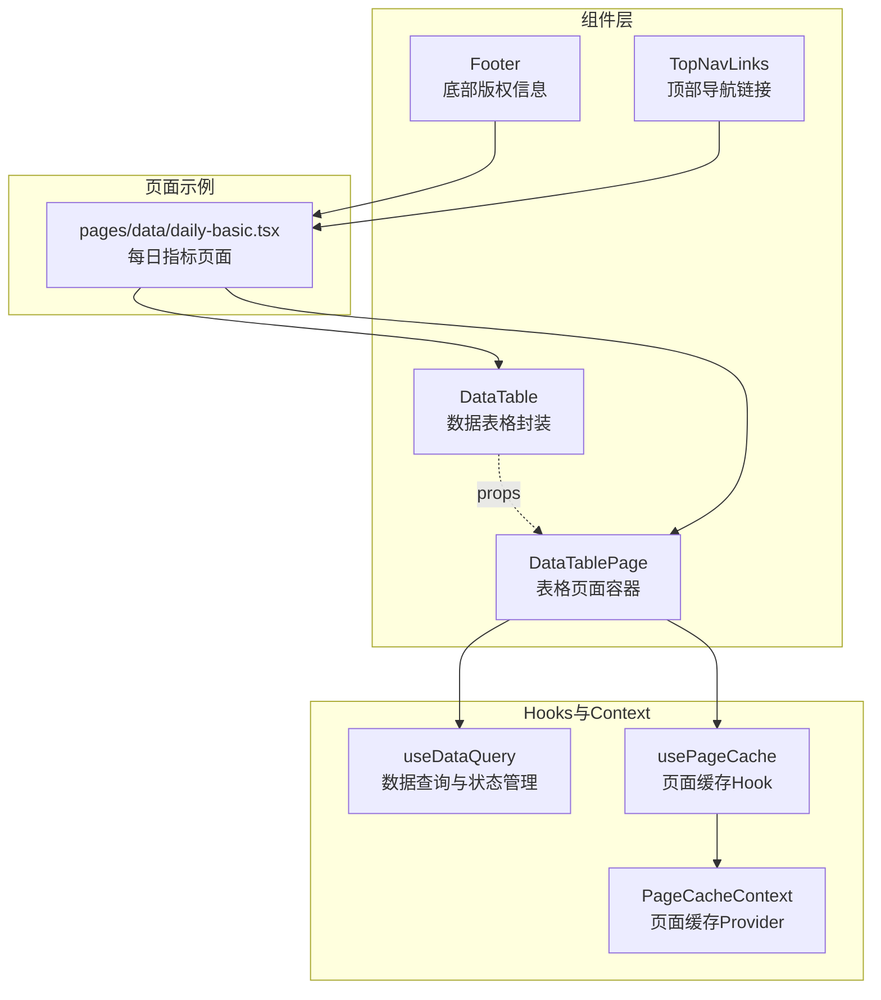
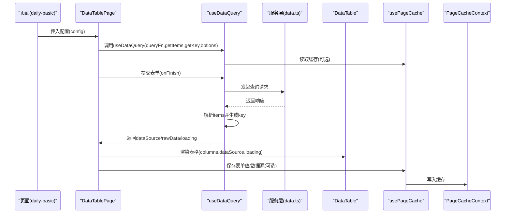
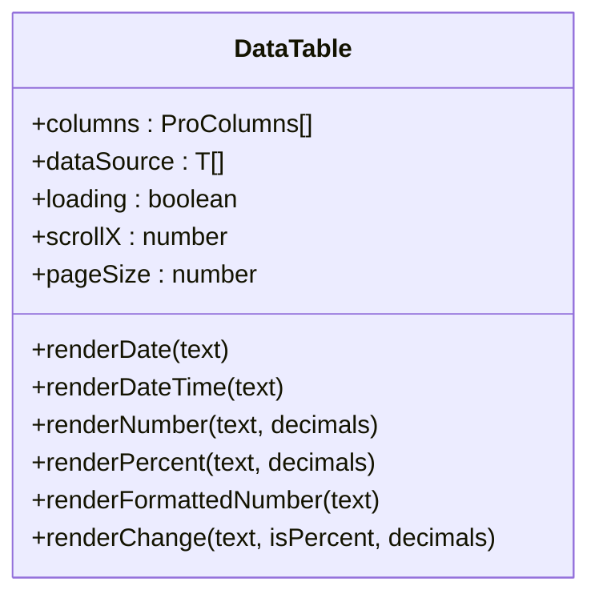
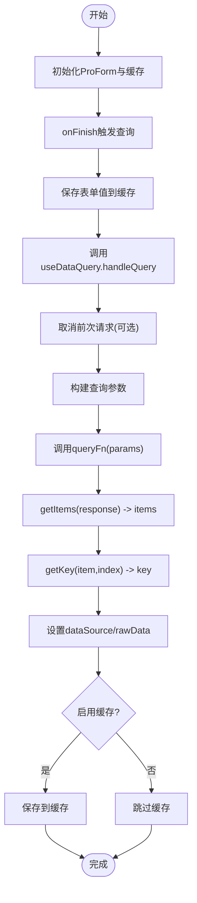
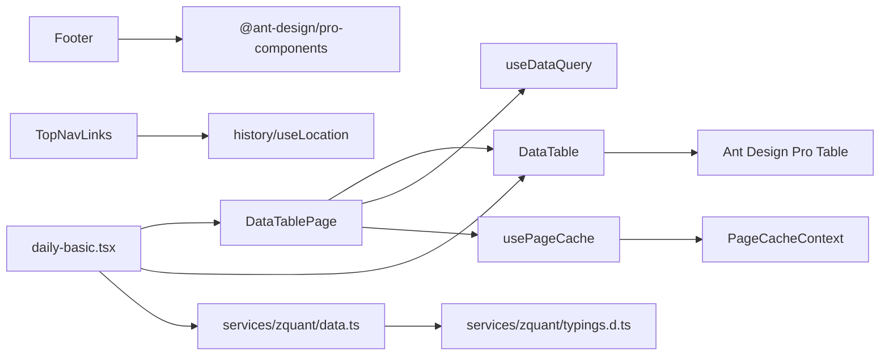

# 基础UI组件

<cite>
**本文引用的文件**
- [DataTable/index.tsx](file://web/src/components/DataTable/index.tsx)
- [DataTablePage/index.tsx](file://web/src/components/DataTablePage/index.tsx)
- [Footer/index.tsx](file://web/src/components/Footer/index.tsx)
- [TopNavLinks/index.tsx](file://web/src/components/TopNavLinks/index.tsx)
- [useDataQuery.ts](file://web/src/hooks/useDataQuery.ts)
- [usePageCache.ts](file://web/src/hooks/usePageCache.ts)
- [PageCacheContext.tsx](file://web/src/contexts/PageCacheContext.tsx)
- [daily-basic.tsx](file://web/src/pages/data/daily-basic.tsx)
- [app.ts](file://web/src/constants/app.ts)
- [typings.d.ts](file://web/src/typings.d.ts)
- [typings.d.ts](file://web/src/services/zquant/typings.d.ts)
- [data.ts](file://web/src/services/zquant/data.ts)
</cite>

## 目录
1. [简介](#简介)
2. [项目结构](#项目结构)
3. [核心组件](#核心组件)
4. [架构总览](#架构总览)
5. [详细组件分析](#详细组件分析)
6. [依赖关系分析](#依赖关系分析)
7. [性能考量](#性能考量)
8. [故障排查指南](#故障排查指南)
9. [结论](#结论)
10. [附录](#附录)

## 简介
本文件聚焦于zquant前端基础UI组件的设计与实现，重点解析以下方面：
- DataTable与DataTablePage在数据展示、分页控制、列配置等方面的封装逻辑
- 与Ant Design Pro Table的扩展关系及性能优化策略（如虚拟滚动、懒加载）
- Footer与TopNavLinks在布局结构中的职责划分，包括响应式适配、导航链接管理与主题兼容性处理
- 通过props接口实现高度可配置化，支持排序、筛选、自定义渲染等交互功能
- 组件的类型定义、默认参数设置、错误边界处理机制
- 在策略回测、因子管理等业务场景中的实际应用案例

## 项目结构
基础UI组件位于web/src/components目录下，围绕“表格+查询+缓存”的模式构建，配合Hooks与Context实现跨页面的状态持久化与统一数据流。

图表来源
- [DataTable/index.tsx](file://web/src/components/DataTable/index.tsx#L1-L113)
- [DataTablePage/index.tsx](file://web/src/components/DataTablePage/index.tsx#L1-L175)
- [Footer/index.tsx](file://web/src/components/Footer/index.tsx#L1-L52)
- [TopNavLinks/index.tsx](file://web/src/components/TopNavLinks/index.tsx#L1-L93)
- [useDataQuery.ts](file://web/src/hooks/useDataQuery.ts#L1-L242)
- [usePageCache.ts](file://web/src/hooks/usePageCache.ts#L1-L162)
- [PageCacheContext.tsx](file://web/src/contexts/PageCacheContext.tsx#L1-L158)
- [daily-basic.tsx](file://web/src/pages/data/daily-basic.tsx#L1-L779)

章节来源
- [DataTable/index.tsx](file://web/src/components/DataTable/index.tsx#L1-L113)
- [DataTablePage/index.tsx](file://web/src/components/DataTablePage/index.tsx#L1-L175)
- [Footer/index.tsx](file://web/src/components/Footer/index.tsx#L1-L52)
- [TopNavLinks/index.tsx](file://web/src/components/TopNavLinks/index.tsx#L1-L93)
- [useDataQuery.ts](file://web/src/hooks/useDataQuery.ts#L1-L242)
- [usePageCache.ts](file://web/src/hooks/usePageCache.ts#L1-L162)
- [PageCacheContext.tsx](file://web/src/contexts/PageCacheContext.tsx#L1-L158)
- [daily-basic.tsx](file://web/src/pages/data/daily-basic.tsx#L1-L779)

## 核心组件
- DataTable：对Ant Design Pro Table进行轻量封装，提供常用列渲染器（日期、日期时间、数字、百分比、格式化数字、涨跌色值）、默认分页与横向滚动配置，便于快速搭建数据表格。
- DataTablePage：以配置驱动的方式封装“表单查询 + 列定义 + 表格展示 + 操作按钮”的页面骨架，内置缓存恢复、提交器渲染、接口数据获取与数据校验等能力。
- Footer：基于@ant-design/pro-components的DefaultFooter，展示应用名称与版本，去除背景样式，适配深色主题。
- TopNavLinks：顶部导航链接集合，基于history与useLocation实现路由跳转，使用antd-style的主题变量实现悬停与激活态样式，具备响应式布局。

章节来源
- [DataTable/index.tsx](file://web/src/components/DataTable/index.tsx#L1-L113)
- [DataTablePage/index.tsx](file://web/src/components/DataTablePage/index.tsx#L1-L175)
- [Footer/index.tsx](file://web/src/components/Footer/index.tsx#L1-L52)
- [TopNavLinks/index.tsx](file://web/src/components/TopNavLinks/index.tsx#L1-L93)

## 架构总览
DataTablePage通过useDataQuery统一管理查询流程，usePageCache负责页面级缓存（表单值、数据源、弹窗状态），PageCacheContext提供全局缓存能力。页面示例daily-basic演示了如何组合这些组件与服务层API。

图表来源
- [DataTablePage/index.tsx](file://web/src/components/DataTablePage/index.tsx#L1-L175)
- [useDataQuery.ts](file://web/src/hooks/useDataQuery.ts#L1-L242)
- [usePageCache.ts](file://web/src/hooks/usePageCache.ts#L1-L162)
- [PageCacheContext.tsx](file://web/src/contexts/PageCacheContext.tsx#L1-L158)
- [daily-basic.tsx](file://web/src/pages/data/daily-basic.tsx#L1-L779)
- [data.ts](file://web/src/services/zquant/data.ts#L1-L200)

## 详细组件分析

### DataTable：表格封装与列渲染
- 设计要点
  - 基于ProTable，禁用内置搜索，开启横向滚动与分页尺寸选择器，默认分页大小与滚动宽度可配置。
  - 提供一组通用列渲染器：renderDate、renderDateTime、renderNumber、renderPercent、renderFormattedNumber、renderChange，覆盖金融数据常见展示需求。
  - 通过泛型T约束columns与dataSource，保证类型安全。
- 类型与默认参数
  - Props接口包含columns、dataSource、loading、scrollX、pageSize等，其中loading默认false，scrollX默认1600，pageSize默认20。
- 交互与扩展
  - 支持通过外部传入columns实现排序、筛选、固定列等高级特性；渲染器可按需替换或组合。
- 性能建议
  - 大数据量建议结合虚拟滚动（ProTable支持）与懒加载（分页+请求取消）。
  - 对高频渲染的列使用memo化或受控组件优化。

图表来源
- [DataTable/index.tsx](file://web/src/components/DataTable/index.tsx#L1-L113)

章节来源
- [DataTable/index.tsx](file://web/src/components/DataTable/index.tsx#L1-L113)

### DataTablePage：页面容器与查询流程
- 设计要点
  - 通过配置对象驱动：queryFn、getItems、getKey用于数据查询与转换；columns、tableTitle用于表格展示；formFields、initialFormValues用于表单域；showFetchButton/showValidateButton/onFetch/onValidate/fetchLoading/validateLoading用于操作按钮与回调；queryOptions用于成功/失败消息与缓存开关。
  - 内置ProForm，支持inline布局与自定义提交器渲染；表单值变更时写入缓存；首次加载优先从缓存恢复。
  - 与useDataQuery协作，统一处理请求取消、loading、成功/失败提示与数据缓存。
- 类型与默认参数
  - DataTablePageConfig包含上述字段，部分字段提供默认行为（如initialFormValues为空对象）。
- 交互与扩展
  - 支持“查询”“接口数据获取”“数据校验”三类操作按钮，均可通过回调扩展业务逻辑。
  - 可通过formFields自定义表单域，或使用默认的ts_code与dateRange。
- 性能建议
  - 启用缓存（enableCache）减少重复请求；使用请求取消避免竞态。
  - 大表格建议结合虚拟滚动与分页懒加载。

图表来源
- [DataTablePage/index.tsx](file://web/src/components/DataTablePage/index.tsx#L1-L175)
- [useDataQuery.ts](file://web/src/hooks/useDataQuery.ts#L1-L242)
- [usePageCache.ts](file://web/src/hooks/usePageCache.ts#L1-L162)

章节来源
- [DataTablePage/index.tsx](file://web/src/components/DataTablePage/index.tsx#L1-L175)
- [useDataQuery.ts](file://web/src/hooks/useDataQuery.ts#L1-L242)
- [usePageCache.ts](file://web/src/hooks/usePageCache.ts#L1-L162)

### Footer：底部版权信息
- 设计要点
  - 基于DefaultFooter，移除背景样式，展示APP_NAME与APP_VERSION，链接为空数组，避免多余导航。
  - 与主题颜色兼容，使用继承色。
- 适用场景
  - 所有页面底部统一版权信息展示，无需业务逻辑。

章节来源
- [Footer/index.tsx](file://web/src/components/Footer/index.tsx#L1-L52)
- [app.ts](file://web/src/constants/app.ts#L1-L42)

### TopNavLinks：顶部导航链接
- 设计要点
  - 使用antd-style的createStyles定义导航样式，支持悬停与激活态高亮。
  - 基于history.push实现无刷新跳转，useLocation判断当前激活链接。
  - 导航项为数组，支持扩展更多菜单项。
- 响应式与主题兼容
  - 通过gap与圆角等样式实现紧凑布局；激活态背景与文字颜色基于主题变量，适配深色/浅色主题。
- 适用场景
  - 顶部主导航，配合侧边栏或面包屑使用。

章节来源
- [TopNavLinks/index.tsx](file://web/src/components/TopNavLinks/index.tsx#L1-L93)

### Hooks与Context：状态与缓存
- useDataQuery
  - 统一数据查询状态管理：dataSource、rawData、loading；支持请求取消、成功/失败消息、缓存集成；自动将items映射为带key的表格数据。
  - 提供useApiCall与useDateRange等辅助Hook，便于扩展。
- usePageCache
  - 基于PageCacheContext，提供save/get/clear/update与便捷方法（saveFormValues、saveDataSource、saveModalState等），自动以当前路由路径为键管理缓存。
- PageCacheContext
  - 提供Map存储的页面缓存，支持清空全部缓存；在usePageCacheContext中抛出明确的上下文使用错误。

章节来源
- [useDataQuery.ts](file://web/src/hooks/useDataQuery.ts#L1-L242)
- [usePageCache.ts](file://web/src/hooks/usePageCache.ts#L1-L162)
- [PageCacheContext.tsx](file://web/src/contexts/PageCacheContext.tsx#L1-L158)

### 类型定义与默认参数
- DataTableProps
  - columns: ProColumns<T>[]
  - dataSource: T[]
  - loading?: boolean (默认false)
  - scrollX?: number (默认1600)
  - pageSize?: number (默认20)
- DataTablePageConfig
  - queryFn、getItems、getKey为必需；columns为必需；其他字段均有默认行为或可选。
- 渲染器
  - renderNumber与renderPercent支持decimals参数；renderChange支持isPercent与decimals。
- 默认参数
  - DataTable默认分页20条，横向滚动1600px；DataTablePage默认表单初始值为空对象，未显式传入formFields时使用默认ts_code与dateRange。

章节来源
- [DataTable/index.tsx](file://web/src/components/DataTable/index.tsx#L1-L113)
- [DataTablePage/index.tsx](file://web/src/components/DataTablePage/index.tsx#L1-L175)
- [useDataQuery.ts](file://web/src/hooks/useDataQuery.ts#L1-L242)

### 错误边界与异常处理
- useDataQuery
  - 捕获请求异常并显示错误消息；对AbortError（取消请求）不显示错误；支持自定义errorMessage。
  - 成功时根据successMessage或函数动态生成消息。
- usePageCacheContext
  - 在usePageCacheContext中若未包裹PageCacheProvider，抛出明确错误，避免运行时异常。
- 页面示例
  - daily-basic对ts_code与dateRange进行校验，失败时提示；对接口数据获取与数据校验分别设置loading与结果弹窗。

章节来源
- [useDataQuery.ts](file://web/src/hooks/useDataQuery.ts#L1-L242)
- [PageCacheContext.tsx](file://web/src/contexts/PageCacheContext.tsx#L1-L158)
- [daily-basic.tsx](file://web/src/pages/data/daily-basic.tsx#L1-L779)

### 实际应用案例
- 策略回测/因子管理
  - 由于因子管理页面目前为占位，建议参考daily-basic的模式：使用DataTablePage封装查询表单与表格，通过useDataQuery统一管理数据流，利用DataTable的列渲染器提升可读性。
  - 对于大表格，建议启用分页与横向滚动，必要时引入虚拟滚动与懒加载。
- 每日指标页面（daily-basic）
  - 展示了完整的“表单查询 + 表格展示 + 操作按钮 + 弹窗详情”的闭环：接口数据获取、数据校验、差异对比等。
  - 通过usePageCache恢复表单值与弹窗状态，提升用户体验。

章节来源
- [daily-basic.tsx](file://web/src/pages/data/daily-basic.tsx#L1-L779)
- [data.ts](file://web/src/services/zquant/data.ts#L1-L200)
- [typings.d.ts](file://web/src/services/zquant/typings.d.ts#L1-L800)

## 依赖关系分析
- 组件间依赖
  - DataTablePage依赖DataTable、ProForm、useDataQuery、usePageCache。
  - DataTable依赖Ant Design Pro Table与dayjs。
  - Footer依赖@ant-design/pro-components与应用常量。
  - TopNavLinks依赖history、useLocation、antd-style。
- 类型依赖
  - 服务层typings.d.ts定义了ZQuant命名空间下的请求/响应类型，页面与Hook通过这些类型约束数据结构。
- 上下文依赖
  - usePageCache依赖PageCacheContext，后者提供全局缓存能力。

图表来源
- [DataTablePage/index.tsx](file://web/src/components/DataTablePage/index.tsx#L1-L175)
- [DataTable/index.tsx](file://web/src/components/DataTable/index.tsx#L1-L113)
- [Footer/index.tsx](file://web/src/components/Footer/index.tsx#L1-L52)
- [TopNavLinks/index.tsx](file://web/src/components/TopNavLinks/index.tsx#L1-L93)
- [useDataQuery.ts](file://web/src/hooks/useDataQuery.ts#L1-L242)
- [usePageCache.ts](file://web/src/hooks/usePageCache.ts#L1-L162)
- [PageCacheContext.tsx](file://web/src/contexts/PageCacheContext.tsx#L1-L158)
- [daily-basic.tsx](file://web/src/pages/data/daily-basic.tsx#L1-L779)
- [data.ts](file://web/src/services/zquant/data.ts#L1-L200)
- [typings.d.ts](file://web/src/services/zquant/typings.d.ts#L1-L800)

章节来源
- [DataTablePage/index.tsx](file://web/src/components/DataTablePage/index.tsx#L1-L175)
- [DataTable/index.tsx](file://web/src/components/DataTable/index.tsx#L1-L113)
- [Footer/index.tsx](file://web/src/components/Footer/index.tsx#L1-L52)
- [TopNavLinks/index.tsx](file://web/src/components/TopNavLinks/index.tsx#L1-L93)
- [useDataQuery.ts](file://web/src/hooks/useDataQuery.ts#L1-L242)
- [usePageCache.ts](file://web/src/hooks/usePageCache.ts#L1-L162)
- [PageCacheContext.tsx](file://web/src/contexts/PageCacheContext.tsx#L1-L158)
- [daily-basic.tsx](file://web/src/pages/data/daily-basic.tsx#L1-L779)
- [data.ts](file://web/src/services/zquant/data.ts#L1-L200)
- [typings.d.ts](file://web/src/services/zquant/typings.d.ts#L1-L800)

## 性能考量
- 虚拟滚动与懒加载
  - ProTable支持虚拟滚动，建议在大数据量场景开启，减少DOM节点数量。
  - 结合分页与请求取消（AbortController）避免竞态与无效渲染。
- 缓存策略
  - 启用useDataQuery的缓存选项与usePageCache的页面缓存，减少重复请求与状态丢失。
- 渲染优化
  - 使用受控组件与稳定的key，避免不必要的重渲染。
  - 对高频渲染列采用memo化或拆分子组件。
- 主题与响应式
  - TopNavLinks使用主题变量与过渡动画，提升视觉一致性与交互体验。

[本节为通用指导，无需列出具体文件来源]

## 故障排查指南
- “usePageCacheContext必须在PageCacheProvider内使用”
  - 症状：在未包裹PageCacheProvider的组件中调用usePageCache，抛出上下文错误。
  - 处理：确认App根部已注入PageCacheProvider。
- 查询无结果或显示旧数据
  - 症状：切换条件后表格仍显示上次结果。
  - 处理：确保DataTablePage的onFinish中调用handleQueryWithCache保存表单值并发起查询；检查useDataQuery是否正确清空旧数据。
- 请求取消导致错误提示
  - 症状：频繁切换条件时出现AbortError提示。
  - 处理：这是预期行为，useDataQuery已过滤AbortError；如需静默处理可忽略。
- 表单值未恢复
  - 症状：刷新页面后表单为空。
  - 处理：确认usePageCache的saveFormValues与getFormValues调用链路；检查路由路径是否一致。

章节来源
- [PageCacheContext.tsx](file://web/src/contexts/PageCacheContext.tsx#L1-L158)
- [useDataQuery.ts](file://web/src/hooks/useDataQuery.ts#L1-L242)
- [usePageCache.ts](file://web/src/hooks/usePageCache.ts#L1-L162)
- [daily-basic.tsx](file://web/src/pages/data/daily-basic.tsx#L1-L779)

## 结论
- DataTable与DataTablePage提供了“查询+表格+缓存”的标准化页面骨架，降低重复开发成本。
- 通过ProTable与Ant Design Pro生态，组件具备良好的扩展性与可配置性。
- useDataQuery与usePageCache形成清晰的数据流与状态管理边界，适合在策略回测、因子管理等复杂业务中复用。
- 建议在大数据量场景引入虚拟滚动与懒加载，并充分利用缓存与请求取消机制提升性能与稳定性。

[本节为总结性内容，无需列出具体文件来源]

## 附录
- 业务场景建议
  - 策略回测：使用DataTablePage封装策略列表与回测任务，结合useDataQuery实现分页与筛选。
  - 因子管理：参考daily-basic的表单+表格+弹窗模式，逐步完善因子定义、计算与结果展示。
- 类型与服务
  - 服务层API与类型定义集中在services/zquant目录，页面通过这些类型约束数据结构，确保前后端一致性。

章节来源
- [typings.d.ts](file://web/src/services/zquant/typings.d.ts#L1-L800)
- [data.ts](file://web/src/services/zquant/data.ts#L1-L200)
- [daily-basic.tsx](file://web/src/pages/data/daily-basic.tsx#L1-L779)