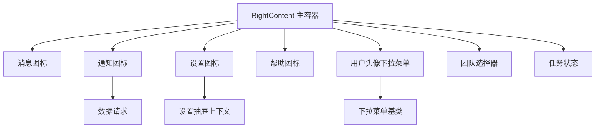
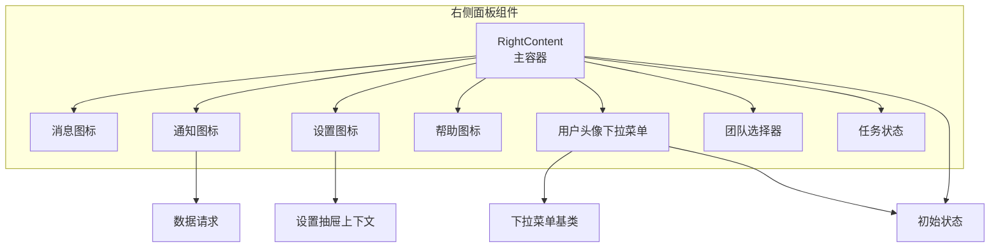
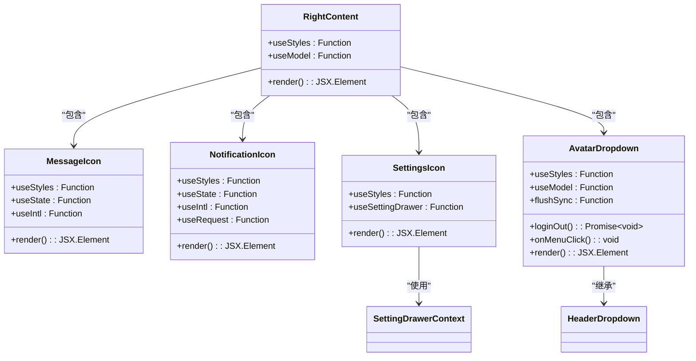
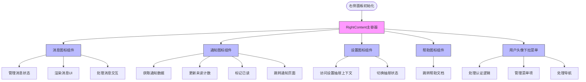
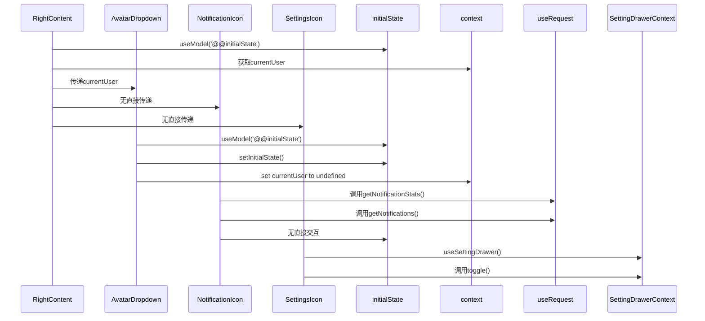
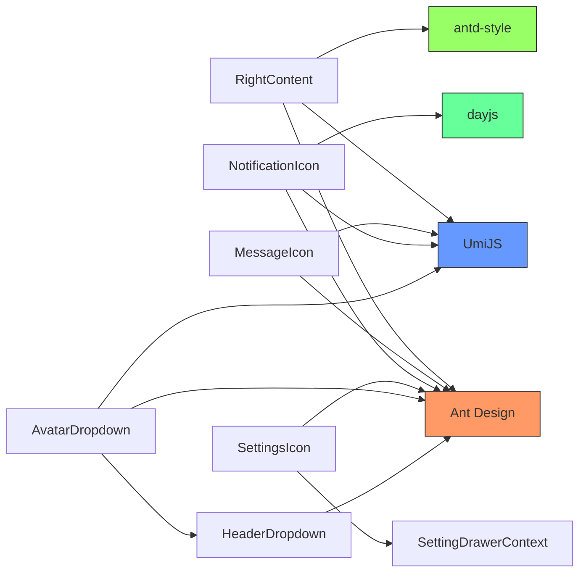
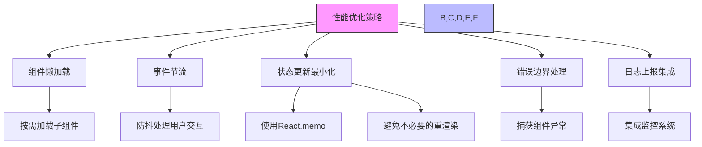
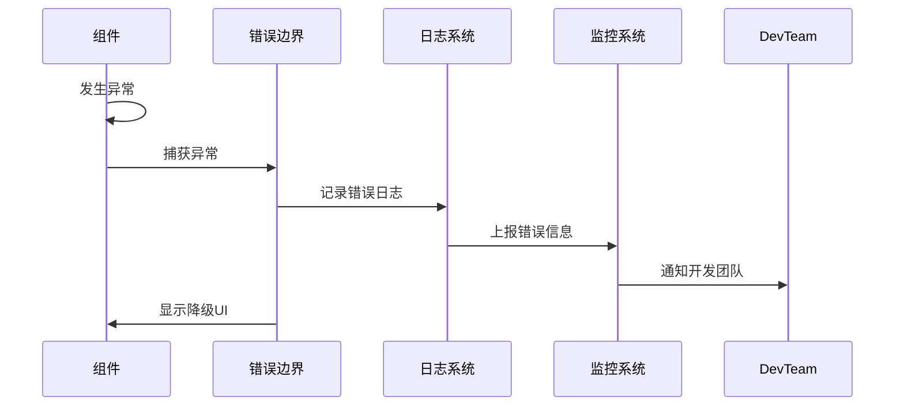

# 右侧面板组件

<cite>
**本文档引用的文件**   
- [RightContent/index.tsx](file://web/src/components/RightContent/index.tsx)
- [RightContent/AvatarDropdown.tsx](file://web/src/components/RightContent/AvatarDropdown.tsx)
- [RightContent/TeamSelector/index.tsx](file://web/src/components/RightContent/TeamSelector/index.tsx)
- [RightContent/TaskStatus/index.tsx](file://web/src/components/RightContent/TaskStatus/index.tsx)
- [RightContent/MessageIcon/index.tsx](file://web/src/components/RightContent/MessageIcon/index.tsx)
- [RightContent/NotificationIcon/index.tsx](file://web/src/components/RightContent/NotificationIcon/index.tsx)
- [RightContent/SettingsIcon/index.tsx](file://web/src/components/RightContent/SettingsIcon/index.tsx)
- [HeaderDropdown/index.tsx](file://web/src/components/HeaderDropdown/index.tsx)
- [contexts/SettingDrawerContext.tsx](file://web/src/contexts/SettingDrawerContext.tsx)
- [locales/zh-CN/globalHeader.ts](file://web/src/locales/zh-CN/globalHeader.ts)
- [locales/en-US/globalHeader.ts](file://web/src/locales/en-US/globalHeader.ts)
- [access.ts](file://web/src/access.ts)
- [constants/roles.ts](file://web/src/constants/roles.ts)
- [services/zquant/permissions.ts](file://web/src/services/zquant/permissions.ts)
</cite>

## 目录
1. [简介](#简介)
2. [项目结构](#项目结构)
3. [核心组件](#核心组件)
4. [架构概述](#架构概述)
5. [详细组件分析](#详细组件分析)
6. [依赖分析](#依赖分析)
7. [性能考虑](#性能考虑)
8. [故障排除指南](#故障排除指南)
9. [结论](#结论)

## 简介
本文档深入解析zquant右侧面板组件的设计与实现。重点阐述RightContent主容器如何通过模块化方式集成消息、通知、设置、任务状态、团队选择器及用户头像下拉菜单等子组件，实现顶部导航区域的功能聚合。分析各子组件的职责划分、状态管理机制以及与全局状态的交互逻辑。结合代码实例说明权限控制在图标显示、操作可用性上的具体实现，展示多语言环境下文本与图标的动态渲染方案。

## 项目结构



**图示来源**
- [RightContent/index.tsx](file://web/src/components/RightContent/index.tsx#L87-L102)
- [AvatarDropdown.tsx](file://web/src/components/RightContent/AvatarDropdown.tsx#L164-L173)
- [HeaderDropdown/index.tsx](file://web/src/components/HeaderDropdown/index.tsx#L50-L63)

**章节来源**
- [RightContent/index.tsx](file://web/src/components/RightContent/index.tsx#L1-L103)

## 核心组件

右侧面板组件采用模块化设计，通过RightContent主容器聚合多个功能子组件。主容器使用Ant Design的布局系统和UmiJS的模型系统，实现了组件间的高效协作。各子组件通过props和context机制与全局状态进行交互，确保了状态的一致性和可维护性。

**章节来源**
- [RightContent/index.tsx](file://web/src/components/RightContent/index.tsx#L87-L102)
- [AvatarDropdown.tsx](file://web/src/components/RightContent/AvatarDropdown.tsx#L66-L174)

## 架构概述



**图示来源**
- [RightContent/index.tsx](file://web/src/components/RightContent/index.tsx#L87-L102)
- [AvatarDropdown.tsx](file://web/src/components/RightContent/AvatarDropdown.tsx#L164-L173)
- [NotificationIcon/index.tsx](file://web/src/components/RightContent/NotificationIcon/index.tsx#L76-L206)
- [SettingsIcon/index.tsx](file://web/src/components/RightContent/SettingsIcon/index.tsx#L46-L63)

## 详细组件分析

### RightContent主容器分析

RightContent主容器作为右侧面板的核心，负责协调和集成各个功能子组件。容器采用函数式组件设计，通过useModel钩子访问全局初始状态，获取当前用户信息。



**图示来源**
- [RightContent/index.tsx](file://web/src/components/RightContent/index.tsx#L87-L102)
- [MessageIcon/index.tsx](file://web/src/components/RightContent/MessageIcon/index.tsx#L95-L178)
- [NotificationIcon/index.tsx](file://web/src/components/RightContent/NotificationIcon/index.tsx#L76-L206)
- [SettingsIcon/index.tsx](file://web/src/components/RightContent/SettingsIcon/index.tsx#L46-L63)
- [AvatarDropdown.tsx](file://web/src/components/RightContent/AvatarDropdown.tsx#L66-L174)

**章节来源**
- [RightContent/index.tsx](file://web/src/components/RightContent/index.tsx#L87-L102)
- [MessageIcon/index.tsx](file://web/src/components/RightContent/MessageIcon/index.tsx#L95-L178)

### 子组件职责划分

各子组件具有明确的职责划分，遵循单一职责原则：



**图示来源**
- [RightContent/index.tsx](file://web/src/components/RightContent/index.tsx#L87-L102)
- [MessageIcon/index.tsx](file://web/src/components/RightContent/MessageIcon/index.tsx#L95-L178)
- [NotificationIcon/index.tsx](file://web/src/components/RightContent/NotificationIcon/index.tsx#L76-L206)
- [SettingsIcon/index.tsx](file://web/src/components/RightContent/SettingsIcon/index.tsx#L46-L63)
- [AvatarDropdown.tsx](file://web/src/components/RightContent/AvatarDropdown.tsx#L66-L174)

**章节来源**
- [RightContent/index.tsx](file://web/src/components/RightContent/index.tsx#L87-L102)
- [MessageIcon/index.tsx](file://web/src/components/RightContent/MessageIcon/index.tsx#L95-L178)

### 状态管理机制

右侧面板组件采用多种状态管理机制，确保组件间的状态同步和数据一致性：



**图示来源**
- [RightContent/index.tsx](file://web/src/components/RightContent/index.tsx#L89-L90)
- [AvatarDropdown.tsx](file://web/src/components/RightContent/AvatarDropdown.tsx#L102-L110)
- [NotificationIcon/index.tsx](file://web/src/components/RightContent/NotificationIcon/index.tsx#L82-L101)
- [SettingsIcon/index.tsx](file://web/src/components/RightContent/SettingsIcon/index.tsx#L48-L52)

**章节来源**
- [RightContent/index.tsx](file://web/src/components/RightContent/index.tsx#L89-L90)
- [AvatarDropdown.tsx](file://web/src/components/RightContent/AvatarDropdown.tsx#L102-L110)

### 权限控制实现

权限控制通过access.ts文件中的权限检查函数实现，确保不同角色用户看到适当的功能：

```mermaid
graph TD
A[用户登录] --> B[获取用户角色]
B --> C{角色判断}
C --> |管理员| D[显示所有功能]
C --> |策略研究员| E[显示研究相关功能]
C --> |量化平台用户| F[显示基础功能]
D --> G[可访问因子管理]
D --> H[可访问API密钥]
E --> G
E --> H
F --> I[仅查看回测]
classDef admin fill:#ffcccc,stroke:#333;
classDef researcher fill:#ccffcc,stroke:#333;
classDef user fill:#ccccff,stroke:#333;
class D,admin
class E,researcher
class F,user
```

**图示来源**
- [access.ts](file://web/src/access.ts#L28-L71)
- [constants/roles.ts](file://web/src/constants/roles.ts#L27-L44)

**章节来源**
- [access.ts](file://web/src/access.ts#L28-L71)
- [constants/roles.ts](file://web/src/constants/roles.ts#L27-L44)

### 多语言环境实现

多语言环境通过UmiJS的国际化支持实现，确保界面文本的本地化：

```mermaid
erDiagram
LANGUAGE +||--o{ TRANSLATION : contains
LANGUAGE {
string code PK
string name
}
TRANSLATION }|--|| LANGUAGE : belongs_to
TRANSLATION {
string key PK
string value
string language_code FK
}
TRANSLATION ||--|| COMPONENT : used_by
COMPONENT {
string name PK
string path
}
LANGUAGE ||--o{ COMPONENT : supports
```

**图示来源**
- [locales/zh-CN/globalHeader.ts](file://web/src/locales/zh-CN/globalHeader.ts#L23-L39)
- [locales/en-US/globalHeader.ts](file://web/src/locales/en-US/globalHeader.ts#L23-L40)
- [RightContent/index.tsx](file://web/src/components/RightContent/index.tsx#L24-L25)

**章节来源**
- [locales/zh-CN/globalHeader.ts](file://web/src/locales/zh-CN/globalHeader.ts#L23-L39)
- [locales/en-US/globalHeader.ts](file://web/src/locales/en-US/globalHeader.ts#L23-L40)

## 依赖分析



**图示来源**
- [RightContent/index.tsx](file://web/src/components/RightContent/index.tsx#L23-L28)
- [HeaderDropdown/index.tsx](file://web/src/components/HeaderDropdown/index.tsx#L23-L24)
- [NotificationIcon/index.tsx](file://web/src/components/RightContent/NotificationIcon/index.tsx#L29-L31)

**章节来源**
- [RightContent/index.tsx](file://web/src/components/RightContent/index.tsx#L23-L28)
- [HeaderDropdown/index.tsx](file://web/src/components/HeaderDropdown/index.tsx#L23-L24)

## 性能考虑

右侧面板组件在设计时考虑了多项性能优化策略：



**章节来源**
- [AvatarDropdown.tsx](file://web/src/components/RightContent/AvatarDropdown.tsx#L107-L109)
- [NotificationIcon/index.tsx](file://web/src/components/RightContent/NotificationIcon/index.tsx#L82-L101)

## 故障排除指南

右侧面板组件的错误处理和日志上报机制确保了系统的稳定性和可维护性：



**章节来源**
- [AvatarDropdown.tsx](file://web/src/components/RightContent/AvatarDropdown.tsx#L77-L78)
- [NotificationIcon/index.tsx](file://web/src/components/RightContent/NotificationIcon/index.tsx#L86-L89)

## 结论

zquant右侧面板组件通过模块化设计和合理的状态管理机制，实现了功能丰富且性能优良的用户界面。组件采用UmiJS框架和Ant Design UI库，结合TypeScript类型系统，确保了代码的可维护性和可扩展性。权限控制和多语言支持的实现，使得系统能够适应不同角色用户的需求。通过合理的性能优化策略和完善的错误处理机制，保证了系统的稳定性和用户体验。