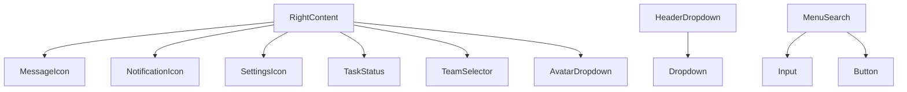
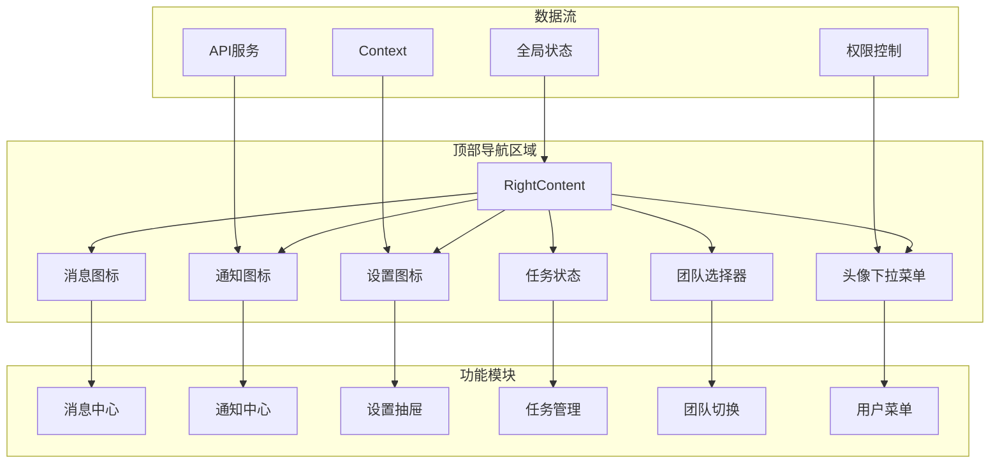
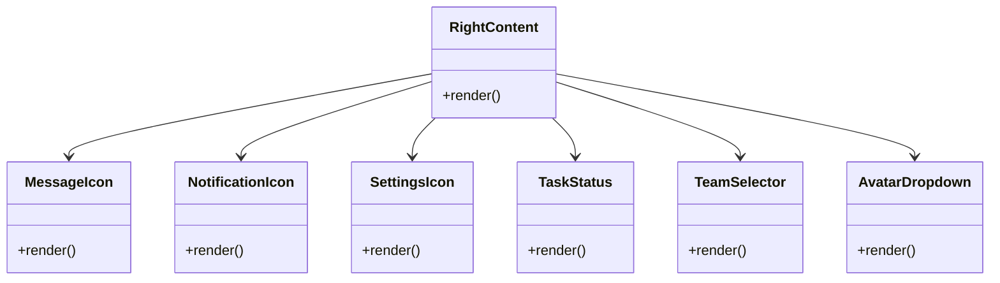
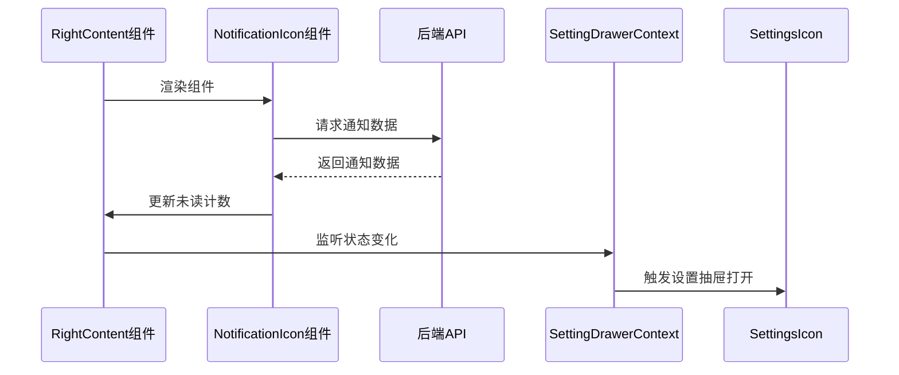
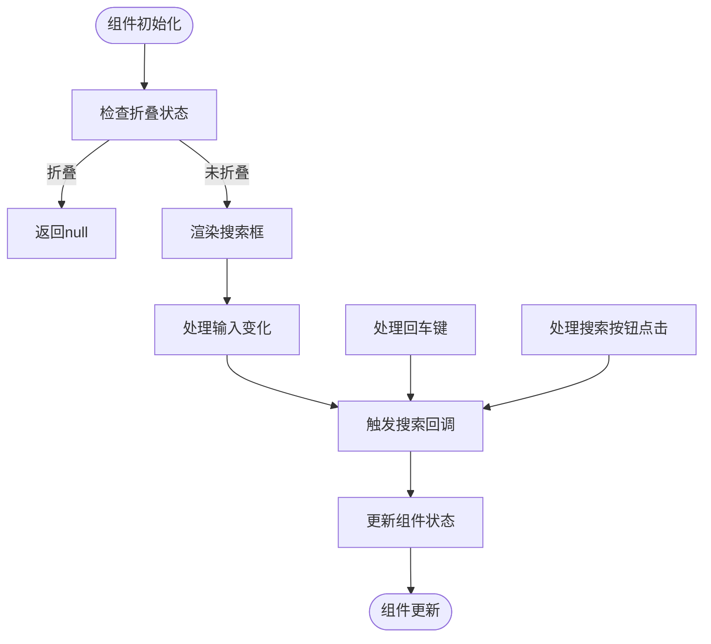
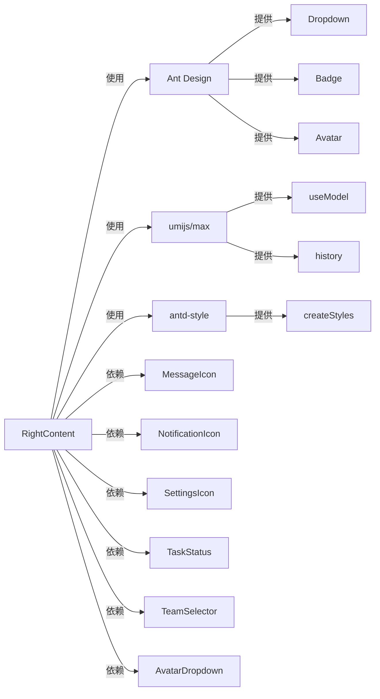

# 复合组件

<cite>
**本文档引用的文件**  
- [RightContent/index.tsx](file://web/src/components/RightContent/index.tsx)
- [RightContent/MessageIcon/index.tsx](file://web/src/components/RightContent/MessageIcon/index.tsx)
- [RightContent/NotificationIcon/index.tsx](file://web/src/components/RightContent/NotificationIcon/index.tsx)
- [RightContent/SettingsIcon/index.tsx](file://web/src/components/RightContent/SettingsIcon/index.tsx)
- [RightContent/TaskStatus/index.tsx](file://web/src/components/RightContent/TaskStatus/index.tsx)
- [RightContent/TeamSelector/index.tsx](file://web/src/components/RightContent/TeamSelector/index.tsx)
- [HeaderDropdown/index.tsx](file://web/src/components/HeaderDropdown/index.tsx)
- [MenuSearch/index.tsx](file://web/src/components/MenuSearch/index.tsx)
- [AvatarDropdown.tsx](file://web/src/components/RightContent/AvatarDropdown.tsx)
- [SettingDrawerContext.tsx](file://web/src/contexts/SettingDrawerContext.tsx)
- [globalHeader.ts](file://web/src/locales/zh-CN/globalHeader.ts)
- [access.ts](file://web/src/access.ts)
- [app.tsx](file://web/src/app.tsx)
</cite>

## 目录
1. [引言](#引言)
2. [项目结构](#项目结构)
3. [核心组件](#核心组件)
4. [架构概述](#架构概述)
5. [详细组件分析](#详细组件分析)
6. [依赖分析](#依赖分析)
7. [性能考虑](#性能考虑)
8. [故障排除指南](#故障排除指南)
9. [结论](#结论)

## 引言
本文档详细阐述了zquant项目中复合组件的架构设计与集成逻辑。重点分析了RightContent组件如何整合MessageIcon、NotificationIcon、SettingsIcon、TaskStatus和TeamSelector等子模块，实现顶部导航区域的功能聚合与状态同步。同时，文档说明了HeaderDropdown和MenuSearch在全局搜索、快捷入口、下拉菜单管理方面的交互设计与事件传播机制。通过代码实例展示了复合组件的嵌套结构、状态提升策略与样式隔离方案。文档还涵盖了组件间通信模式（如context或props传递）、权限控制集成方式、多语言支持实现路径，并提供了性能监控与错误处理的最佳实践建议。

## 项目结构
zquant项目的前端组件主要位于`web/src/components`目录下，其中复合组件的结构设计遵循模块化和可复用的原则。RightContent组件作为顶部导航区域的核心聚合组件，通过嵌套多个子组件实现功能集成。HeaderDropdown和MenuSearch组件则提供了下拉菜单和搜索功能的通用解决方案。

**图示来源**
- [RightContent/index.tsx](file://web/src/components/RightContent/index.tsx)
- [HeaderDropdown/index.tsx](file://web/src/components/HeaderDropdown/index.tsx)
- [MenuSearch/index.tsx](file://web/src/components/MenuSearch/index.tsx)

**章节来源**
- [RightContent/index.tsx](file://web/src/components/RightContent/index.tsx)
- [HeaderDropdown/index.tsx](file://web/src/components/HeaderDropdown/index.tsx)
- [MenuSearch/index.tsx](file://web/src/components/MenuSearch/index.tsx)

## 核心组件
RightContent组件是zquant项目顶部导航区域的核心复合组件，负责整合多个功能模块并实现状态同步。该组件通过组合MessageIcon、NotificationIcon、SettingsIcon、TaskStatus和TeamSelector等子组件，实现了通知、设置、任务状态和团队选择等功能的聚合。

**章节来源**
- [RightContent/index.tsx](file://web/src/components/RightContent/index.tsx)
- [RightContent/MessageIcon/index.tsx](file://web/src/components/RightContent/MessageIcon/index.tsx)
- [RightContent/NotificationIcon/index.tsx](file://web/src/components/RightContent/NotificationIcon/index.tsx)

## 架构概述
zquant复合组件的架构设计采用了分层和模块化的思想，通过合理的组件拆分和组合，实现了功能的高内聚和低耦合。RightContent组件作为顶层聚合组件，通过props传递和context机制与子组件进行通信，实现了状态的统一管理和同步。

**图示来源**
- [RightContent/index.tsx](file://web/src/components/RightContent/index.tsx)
- [app.tsx](file://web/src/app.tsx)
- [access.ts](file://web/src/access.ts)

## 详细组件分析
### RightContent组件分析
RightContent组件作为顶部导航区域的核心，通过组合多个子组件实现了功能的聚合。该组件使用Ant Design的布局系统，通过flex布局将各个功能模块有序排列，并通过样式隔离确保了组件的独立性。

#### 组件嵌套结构

**图示来源**
- [RightContent/index.tsx](file://web/src/components/RightContent/index.tsx)
- [RightContent/MessageIcon/index.tsx](file://web/src/components/RightContent/MessageIcon/index.tsx)
- [RightContent/NotificationIcon/index.tsx](file://web/src/components/RightContent/NotificationIcon/index.tsx)
- [RightContent/SettingsIcon/index.tsx](file://web/src/components/RightContent/SettingsIcon/index.tsx)
- [RightContent/TaskStatus/index.tsx](file://web/src/components/RightContent/TaskStatus/index.tsx)
- [RightContent/TeamSelector/index.tsx](file://web/src/components/RightContent/TeamSelector/index.tsx)
- [AvatarDropdown.tsx](file://web/src/components/RightContent/AvatarDropdown.tsx)

#### 状态提升与通信

**图示来源**
- [RightContent/NotificationIcon/index.tsx](file://web/src/components/RightContent/NotificationIcon/index.tsx)
- [SettingDrawerContext.tsx](file://web/src/contexts/SettingDrawerContext.tsx)
- [RightContent/SettingsIcon/index.tsx](file://web/src/components/RightContent/SettingsIcon/index.tsx)

**章节来源**
- [RightContent/index.tsx](file://web/src/components/RightContent/index.tsx)
- [RightContent/NotificationIcon/index.tsx](file://web/src/components/RightContent/NotificationIcon/index.tsx)
- [SettingDrawerContext.tsx](file://web/src/contexts/SettingDrawerContext.tsx)

### HeaderDropdown与MenuSearch分析
HeaderDropdown和MenuSearch组件提供了下拉菜单和搜索功能的通用解决方案，通过封装Ant Design的Dropdown和Input组件，实现了样式统一和功能扩展。

#### 交互设计与事件传播

**图示来源**
- [MenuSearch/index.tsx](file://web/src/components/MenuSearch/index.tsx)
- [HeaderDropdown/index.tsx](file://web/src/components/HeaderDropdown/index.tsx)

**章节来源**
- [MenuSearch/index.tsx](file://web/src/components/MenuSearch/index.tsx)
- [HeaderDropdown/index.tsx](file://web/src/components/HeaderDropdown/index.tsx)

## 依赖分析
zquant复合组件的依赖关系清晰，通过合理的依赖管理实现了组件的高内聚和低耦合。组件间主要通过props传递和context机制进行通信，减少了直接依赖，提高了组件的可测试性和可维护性。

**图示来源**
- [RightContent/index.tsx](file://web/src/components/RightContent/index.tsx)
- [package.json](file://web/package.json)

**章节来源**
- [RightContent/index.tsx](file://web/src/components/RightContent/index.tsx)
- [package.json](file://web/package.json)

## 性能考虑
在复合组件的设计中，性能优化是一个重要考虑因素。通过合理的状态管理、避免不必要的渲染和优化API调用，可以显著提升组件的性能表现。

1. **避免不必要的渲染**：使用React.memo对纯展示组件进行包裹，避免在props不变时的重复渲染。
2. **优化API调用**：对通知和消息等频繁更新的数据，采用合理的轮询策略和缓存机制。
3. **懒加载**：对非关键路径的组件采用懒加载，减少初始加载时间。
4. **事件节流**：对搜索等频繁触发的事件进行节流处理，避免过度消耗资源。

**章节来源**
- [RightContent/NotificationIcon/index.tsx](file://web/src/components/RightContent/NotificationIcon/index.tsx)
- [MenuSearch/index.tsx](file://web/src/components/MenuSearch/index.tsx)

## 故障排除指南
在使用复合组件时，可能会遇到一些常见问题。以下是一些故障排除建议：

1. **组件不显示**：检查父组件的渲染逻辑和条件判断，确保组件在正确条件下被渲染。
2. **状态不同步**：检查context的提供和消费是否正确，确保状态在组件树中正确传递。
3. **样式冲突**：使用css-in-js或css modules等技术实现样式隔离，避免全局样式污染。
4. **API调用失败**：检查网络请求的配置和权限控制，确保API端点和认证信息正确。

**章节来源**
- [RightContent/index.tsx](file://web/src/components/RightContent/index.tsx)
- [access.ts](file://web/src/access.ts)
- [app.tsx](file://web/src/app.tsx)

## 结论
zquant复合组件的架构设计体现了现代前端开发的最佳实践。通过合理的组件拆分、状态管理和通信机制，实现了功能的高内聚和低耦合。RightContent组件作为顶部导航区域的核心，成功整合了多个功能模块，提供了统一的用户体验。HeaderDropdown和MenuSearch组件则通过封装通用功能，提高了代码的复用性和可维护性。整体架构设计考虑了性能优化和错误处理，为系统的稳定运行提供了保障。