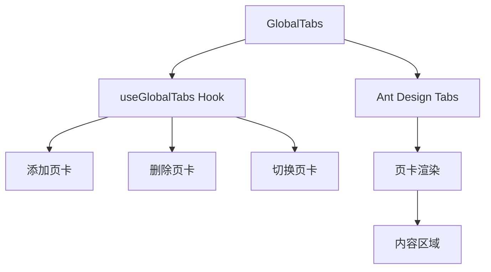
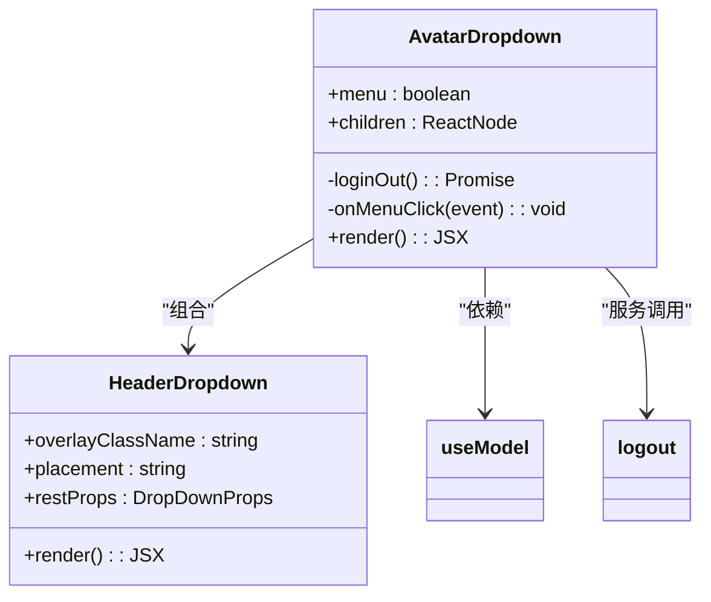
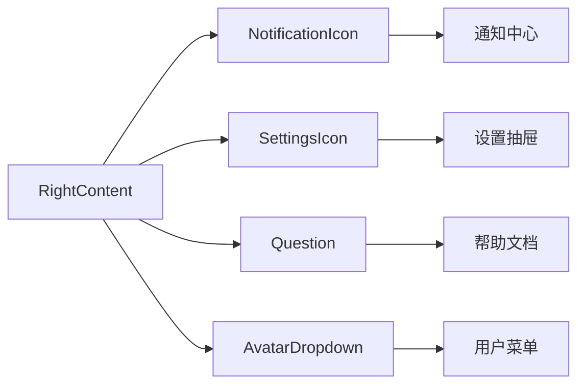

# 组件架构

<cite>
**本文档引用的文件**  
- [DataTable/index.tsx](file://web/src/components/DataTable/index.tsx)
- [GlobalTabs/index.tsx](file://web/src/components/GlobalTabs/index.tsx)
- [RightContent/AvatarDropdown.tsx](file://web/src/components/RightContent/AvatarDropdown.tsx)
- [RightContent/index.tsx](file://web/src/components/RightContent/index.tsx)
- [hooks/useGlobalTabs.ts](file://web/src/hooks/useGlobalTabs.ts)
- [app.tsx](file://web/src/app.tsx)
- [global.less](file://web/src/global.less)
- [global.style.ts](file://web/src/global.style.ts)
- [HeaderDropdown/index.tsx](file://web/src/components/HeaderDropdown/index.tsx)
- [locales/zh-CN/component.ts](file://web/src/locales/zh-CN/component.ts)
- [locales/en-US/component.ts](file://web/src/locales/en-US/component.ts)
</cite>

## 目录
1. [引言](#引言)
2. [核心组件架构设计](#核心组件架构设计)
3. [模块化设计原则](#模块化设计原则)
4. [组件组合与嵌套规范](#组件组合与嵌套规范)
5. [性能优化策略](#性能优化策略)
6. [结论](#结论)

## 引言
zquant前端组件架构基于Ant Design构建，采用模块化设计理念，通过封装核心UI组件实现代码复用和统一的用户体验。本架构重点关注DataTable、GlobalTabs、AvatarDropdown等核心组件的实现逻辑，结合Ant Design Pro的布局系统，构建了高效、可维护的前端界面。组件设计遵循单一职责原则，通过props接口定义、事件回调处理和样式隔离机制，确保组件的可复用性和可测试性。

## 核心组件架构设计

### DataTable组件
DataTable组件基于Ant Design的ProTable进行封装，提供了一组预定义的列渲染器，包括日期、数字、百分比和涨跌额等格式化功能。组件通过泛型支持类型安全的数据处理，接受columns、dataSource等props参数，实现了表格的通用化配置。渲染器函数如renderDate、renderNumber等被设计为纯函数，确保了数据格式化的可预测性和一致性。

**组件源码**
- [DataTable/index.tsx](file://web/src/components/DataTable/index.tsx#L82-L112)

### GlobalTabs组件
GlobalTabs组件实现了全局页卡管理功能，基于Ant Design的Tabs组件构建。组件通过useGlobalTabs自定义Hook管理页卡状态，支持页卡的添加、删除和切换操作。页卡容器采用响应式布局，适配不同屏幕尺寸。组件设计考虑了用户体验，实现了页卡数量限制和激活页卡的智能切换逻辑。

**图表来源**
- [GlobalTabs/index.tsx](file://web/src/components/GlobalTabs/index.tsx#L44-L97)
- [hooks/useGlobalTabs.ts](file://web/src/hooks/useGlobalTabs.ts#L35-L158)

**本节来源**
- [GlobalTabs/index.tsx](file://web/src/components/GlobalTabs/index.tsx#L1-L98)
- [hooks/useGlobalTabs.ts](file://web/src/hooks/useGlobalTabs.ts#L1-L159)

### AvatarDropdown组件
AvatarDropdown组件实现了用户头像下拉菜单功能，集成在页面右上角的导航区域。组件通过useModel获取全局用户状态，显示当前用户信息。下拉菜单包含个人中心、个人设置和退出登录等选项，通过HeaderDropdown组件实现下拉交互。退出登录功能包含清除本地存储的token和跳转到登录页面的完整流程。

**图表来源**
- [RightContent/AvatarDropdown.tsx](file://web/src/components/RightContent/AvatarDropdown.tsx#L66-L174)
- [components/HeaderDropdown/index.tsx](file://web/src/components/HeaderDropdown/index.tsx#L50-L63)

**本节来源**
- [RightContent/AvatarDropdown.tsx](file://web/src/components/RightContent/AvatarDropdown.tsx#L1-L175)
- [components/HeaderDropdown/index.tsx](file://web/src/components/HeaderDropdown/index.tsx#L1-L64)

## 模块化设计原则

### Props接口定义
组件采用TypeScript接口定义props，确保类型安全和代码可维护性。例如，DataTable组件定义了DataTableProps接口，明确指定columns、dataSource等属性的类型。这种强类型设计有助于开发过程中的错误检测和代码补全。

**本节来源**
- [DataTable/index.tsx](file://web/src/components/DataTable/index.tsx#L82-L88)

### 事件回调处理
组件通过props传递事件回调函数，实现父子组件间的通信。例如，GlobalTabs组件接收onChange和onRemove回调，当用户切换或关闭页卡时触发相应的处理逻辑。这种设计模式遵循React的单向数据流原则，确保状态管理的可预测性。

**本节来源**
- [GlobalTabs/index.tsx](file://web/src/components/GlobalTabs/index.tsx#L44-L49)

### 样式隔离与主题定制
组件使用antd-style的createStyles API实现样式隔离，避免全局样式污染。样式定义基于Ant Design的设计令牌（design tokens），确保与整体设计系统的一致性。通过token参数访问主题变量，如colorBgContainer、colorBorderSecondary等，实现主题的动态适配。

**本节来源**
- [GlobalTabs/index.tsx](file://web/src/components/GlobalTabs/index.tsx#L29-L42)
- [RightContent/AvatarDropdown.tsx](file://web/src/components/RightContent/AvatarDropdown.tsx#L48-L63)

### 多语言适配
组件通过umijs/max的useIntl Hook实现多语言支持。国际化文本定义在src/locales目录下的语言文件中，如zh-CN/component.ts和en-US/component.ts。组件使用formatMessage方法根据当前语言环境显示相应的文本内容，支持动态语言切换。

**本节来源**
- [locales/zh-CN/component.ts](file://web/src/locales/zh-CN/component.ts#L1-L28)
- [locales/en-US/component.ts](file://web/src/locales/en-US/component.ts#L1-L28)

## 组件组合与嵌套规范

### RightContent组件集成
RightContent组件作为页面右上角的功能区域容器，集成了多个Icon组件，包括NotificationIcon、SettingsIcon、Question和AvatarDropdown。这些组件通过水平flex布局排列，形成统一的导航体验。组件间通过共享状态和事件处理实现协同工作，如NotificationIcon显示未读通知数量，SettingsIcon打开设置抽屉。

**图表来源**
- [RightContent/index.tsx](file://web/src/components/RightContent/index.tsx#L87-L102)
- [RightContent/NotificationIcon/index.tsx](file://web/src/components/RightContent/NotificationIcon/index.tsx#L76-L206)
- [RightContent/SettingsIcon/index.tsx](file://web/src/components/RightContent/SettingsIcon/index.tsx#L46-L63)

**本节来源**
- [RightContent/index.tsx](file://web/src/components/RightContent/index.tsx#L1-L103)
- [RightContent/NotificationIcon/index.tsx](file://web/src/components/RightContent/NotificationIcon/index.tsx#L1-L207)
- [RightContent/SettingsIcon/index.tsx](file://web/src/components/RightContent/SettingsIcon/index.tsx#L1-L64)

### 全局上下文集成
组件通过app.tsx中的SettingDrawerContext.Provider实现全局状态管理。GlobalTabsProvider作为全局页卡状态的提供者，包裹在应用根组件中，确保所有子组件都能访问页卡状态。这种上下文模式避免了props逐层传递的繁琐，提高了组件间的通信效率。

**本节来源**
- [app.tsx](file://web/src/app.tsx#L45-L46)
- [app.tsx](file://web/src/app.tsx#L408-L411)

## 性能优化策略

### 虚拟滚动与懒加载
DataTable组件通过ProTable的内置功能支持虚拟滚动，当数据量较大时自动启用，避免DOM节点过多导致的性能问题。数据加载采用懒加载策略，仅在需要时从服务端获取数据，减少初始加载时间。

**本节来源**
- [DataTable/index.tsx](file://web/src/components/DataTable/index.tsx#L98-L109)

### Memoization应用
组件使用React.memo和useCallback等记忆化技术，避免不必要的重新渲染。例如，GlobalTabs组件中的useStyles和handleEdit函数使用useCallback进行记忆化，确保在组件重新渲染时保持函数引用的稳定性。

**本节来源**
- [GlobalTabs/index.tsx](file://web/src/components/GlobalTabs/index.tsx#L59-L70)
- [hooks/useGlobalTabs.ts](file://web/src/hooks/useGlobalTabs.ts#L42-L76)

### 样式性能优化
全局样式通过global.less和global.style.ts文件集中管理，避免重复定义。媒体查询用于响应式设计，在移动设备上优化表格显示。样式定义遵循BEM命名规范，提高样式的可维护性和可读性。

**本节来源**
- [global.less](file://web/src/global.less#L1-L95)
- [global.style.ts](file://web/src/global.style.ts#L1-L65)

## 结论
zquant前端组件架构通过基于Ant Design的封装策略，实现了高效、可维护的UI组件系统。核心组件如DataTable、GlobalTabs和AvatarDropdown遵循模块化设计原则，通过清晰的props接口、事件回调和样式隔离机制，确保了组件的可复用性和可测试性。组件间的组合关系通过规范的嵌套模式实现，形成了统一的用户体验。性能优化策略的应用进一步提升了应用的响应速度和用户体验。整体架构设计充分考虑了可扩展性和可维护性，为后续功能开发提供了坚实的基础。