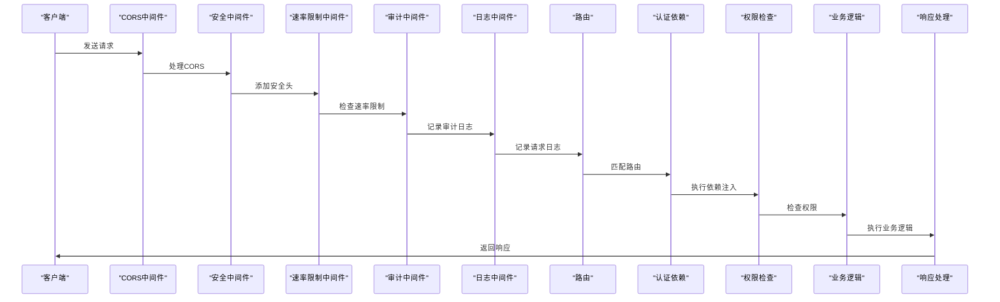

# API架构

<cite>
**本文档引用的文件**   
- [main.py](file://zquant/main.py)
- [deps.py](file://zquant/api/deps.py)
- [response.py](file://zquant/schemas/response.py)
- [exceptions.py](file://zquant/core/exceptions.py)
- [auth.py](file://zquant/api/v1/auth.py)
- [users.py](file://zquant/api/v1/users.py)
- [data.py](file://zquant/api/v1/data.py)
- [backtest.py](file://zquant/api/v1/backtest.py)
- [roles.py](file://zquant/api/v1/roles.py)
- [permissions.py](file://zquant/api/v1/permissions.py)
- [security.py](file://zquant/middleware/security.py)
- [decorators.py](file://zquant/api/decorators.py)
- [permissions.py](file://zquant/core/permissions.py)
- [config.py](file://zquant/config.py)
</cite>

## 目录
1. [项目结构](#项目结构)
2. [API路由设计模式](#api路由设计模式)
3. [API版本控制与路由注册](#api版本控制与路由注册)
4. [依赖注入与安全机制](#依赖注入与安全机制)
5. [统一响应格式与异常处理](#统一响应格式与异常处理)
6. [中间件与请求处理流程](#中间件与请求处理流程)
7. [开发者指南](#开发者指南)

## 项目结构

zquant后端API采用模块化设计，主要结构如下：

```
zquant/
├── api/
│   ├── v1/                    # API v1版本模块
│   │   ├── auth.py            # 认证相关API
│   │   ├── users.py           # 用户管理API
│   │   ├── roles.py           # 角色管理API
│   │   ├── permissions.py     # 权限管理API
│   │   ├── data.py            # 数据服务API
│   │   ├── backtest.py        # 回测相关API
│   │   ├── scheduler.py       # 定时任务API
│   │   ├── config.py          # 配置管理API
│   │   ├── notifications.py   # 通知中心API
│   │   ├── dashboard.py       # 系统大盘API
│   │   ├── favorites.py       # 我的自选API
│   │   ├── positions.py       # 我的持仓API
│   │   └── factor.py          # 因子管理API
│   ├── deps.py                # API依赖注入
│   ├── decorators.py          # API装饰器
│   └── __init__.py
├── schemas/                   # Pydantic模型定义
│   ├── response.py            # 统一响应模型
│   ├── user.py                # 用户相关模型
│   ├── backtest.py            # 回测相关模型
│   ├── data.py                # 数据服务模型
│   └── ...
├── core/                      # 核心功能模块
│   ├── exceptions.py          # 自定义异常
│   ├── permissions.py         # 权限检查
│   └── security.py            # 安全相关
├── middleware/                # 中间件
│   ├── security.py            # 安全中间件
│   ├── logging.py             # 日志中间件
│   ├── rate_limit.py          # 速率限制中间件
│   └── audit.py               # 审计中间件
└── main.py                    # FastAPI应用入口
```

**Diagram sources**
- [main.py](file://zquant/main.py#L1-L247)
- [api/v1/](file://zquant/api/v1/)

## API路由设计模式

zquant后端API采用清晰的模块化路由设计，所有API端点均位于`/api/v1/`路径下，按功能模块组织。

### 认证模块 (/api/v1/auth)
提供用户认证相关功能：
- `POST /api/v1/auth/login` - 用户登录
- `POST /api/v1/auth/refresh` - 刷新Token
- `POST /api/v1/auth/logout` - 用户登出

### 用户管理模块 (/api/v1/users)
提供用户管理功能：
- `GET /api/v1/users` - 查询用户列表
- `GET /api/v1/users/me` - 获取当前用户信息
- `GET /api/v1/users/me/apikeys` - 获取当前用户API密钥
- `POST /api/v1/users/me/apikeys` - 创建API密钥
- `DELETE /api/v1/users/me/apikeys/{key_id}` - 删除API密钥
- `GET /api/v1/users/{user_id}` - 查询用户详情
- `POST /api/v1/users` - 创建用户
- `PUT /api/v1/users/{user_id}` - 更新用户
- `POST /api/v1/users/{user_id}/reset-password` - 重置用户密码
- `DELETE /api/v1/users/{user_id}` - 删除用户

### 数据服务模块 (/api/v1/data)
提供数据服务功能：
- `POST /api/v1/data/fundamentals` - 获取财务数据
- `POST /api/v1/data/fundamentals/fetch-from-api` - 从Tushare接口获取财务数据
- `POST /api/v1/data/fundamentals/validate` - 财务数据校验
- `POST /api/v1/data/calendar` - 获取交易日历
- `POST /api/v1/data/calendar/fetch-from-api` - 从Tushare接口获取交易日历
- `POST /api/v1/data/calendar/validate` - 交易日历数据校验
- `POST /api/v1/data/stocks` - 获取股票列表
- `POST /api/v1/data/stocks/fetch-from-api` - 从Tushare接口获取股票列表
- `POST /api/v1/data/stocks/validate` - 股票列表数据校验
- `POST /api/v1/data/daily` - 获取日线数据
- `POST /api/v1/data/daily/fetch-from-api` - 从Tushare接口获取日线数据

### 回测模块 (/api/v1/backtest)
提供回测相关功能：
- `POST /api/v1/backtest/run` - 运行回测
- `GET /api/v1/backtest/tasks` - 获取回测任务列表
- `GET /api/v1/backtest/tasks/{task_id}` - 获取回测任务
- `GET /api/v1/backtest/tasks/{task_id}/result` - 获取回测结果
- `GET /api/v1/backtest/tasks/{task_id}/performance` - 获取绩效报告
- `GET /api/v1/backtest/strategies/framework` - 获取策略框架代码
- `POST /api/v1/backtest/strategies` - 创建策略
- `GET /api/v1/backtest/strategies` - 获取策略列表
- `GET /api/v1/backtest/strategies/templates` - 获取模板策略列表
- `GET /api/v1/backtest/strategies/{strategy_id}` - 获取策略详情
- `PUT /api/v1/backtest/strategies/{strategy_id}` - 更新策略
- `DELETE /api/v1/backtest/strategies/{strategy_id}` - 删除策略
- `GET /api/v1/backtest/results` - 获取回测结果列表
- `DELETE /api/v1/backtest/results/{result_id}` - 删除回测结果

### 其他模块
- `/api/v1/roles` - 角色管理
- `/api/v1/permissions` - 权限管理
- `/api/v1/scheduler` - 定时任务
- `/api/v1/config` - 配置管理
- `/api/v1/notifications` - 通知中心
- `/api/v1/dashboard` - 系统大盘
- `/api/v1/favorites` - 我的自选
- `/api/v1/positions` - 我的持仓
- `/api/v1/factor` - 因子管理

```mermaid
graph TD
A[/api/v1] --> B[/api/v1/auth]
A --> C[/api/v1/users]
A --> D[/api/v1/roles]
A --> E[/api/v1/permissions]
A --> F[/api/v1/data]
A --> G[/api/v1/backtest]
A --> H[/api/v1/scheduler]
A --> I[/api/v1/config]
A --> J[/api/v1/notifications]
A --> K[/api/v1/dashboard]
A --> L[/api/v1/favorites]
A --> M[/api/v1/positions]
A --> N[/api/v1/factor]
B --> B1[POST /login]
B --> B2[POST /refresh]
B --> B3[POST /logout]
C --> C1[GET /]
C --> C2[GET /me]
C --> C3[GET /me/apikeys]
C --> C4[POST /me/apikeys]
C --> C5[DELETE /me/apikeys/{key_id}]
C --> C6[GET /{user_id}]
C --> C7[POST /]
C --> C8[PUT /{user_id}]
C --> C9[POST /{user_id}/reset-password]
C --> C10[DELETE /{user_id}]
F --> F1[POST /fundamentals]
F --> F2[POST /fundamentals/fetch-from-api]
F --> F3[POST /fundamentals/validate]
F --> F4[POST /calendar]
F --> F5[POST /calendar/fetch-from-api]
F --> F6[POST /calendar/validate]
F --> F7[POST /stocks]
F --> F8[POST /stocks/fetch-from-api]
F --> F9[POST /stocks/validate]
F --> F10[POST /daily]
F --> F11[POST /daily/fetch-from-api]
G --> G1[POST /run]
G --> G2[GET /tasks]
G --> G3[GET /tasks/{task_id}]
G --> G4[GET /tasks/{task_id}/result]
G --> G5[GET /tasks/{task_id}/performance]
G --> G6[GET /strategies/framework]
G --> G7[POST /strategies]
G --> G8[GET /strategies]
G --> G9[GET /strategies/templates]
G --> G10[GET /strategies/{strategy_id}]
G --> G11[PUT /strategies/{strategy_id}]
G --> G12[DELETE /strategies/{strategy_id}]
G --> G13[GET /results]
G --> G14[DELETE /results/{result_id}]
```

**Diagram sources**
- [main.py](file://zquant/main.py#L218-L230)
- [api/v1/auth.py](file://zquant/api/v1/auth.py#L39-L64)
- [api/v1/users.py](file://zquant/api/v1/users.py#L51-L207)
- [api/v1/data.py](file://zquant/api/v1/data.py#L97-L800)
- [api/v1/backtest.py](file://zquant/api/v1/backtest.py#L90-L424)

## API版本控制与路由注册

zquant后端API采用基于URL路径的版本控制策略，所有API端点均位于`/api/v1/`路径下，为未来的API版本迭代预留了空间。

### 路由注册机制

在`main.py`文件中，通过`app.include_router()`方法将各个模块的路由器注册到FastAPI应用中：

```python
# 注册路由
app.include_router(auth.router, prefix="/api/v1/auth", tags=["认证"])
app.include_router(users.router, prefix="/api/v1/users", tags=["用户管理"])
app.include_router(roles.router, prefix="/api/v1/roles", tags=["角色管理"])
app.include_router(permissions.router, prefix="/api/v1/permissions", tags=["权限管理"])
app.include_router(data.router, prefix="/api/v1/data", tags=["数据服务"])
app.include_router(backtest.router, prefix="/api/v1/backtest", tags=["回测"])
app.include_router(scheduler.router, prefix="/api/v1/scheduler", tags=["定时任务"])
app.include_router(config.router, prefix="/api/v1", tags=["配置管理"])
app.include_router(notifications.router, prefix="/api/v1/notifications", tags=["通知中心"])
app.include_router(dashboard.router, prefix="/api/v1/dashboard", tags=["系统大盘"])
app.include_router(favorites.router, prefix="/api/v1/favorites", tags=["我的自选"])
app.include_router(positions.router, prefix="/api/v1/positions", tags=["我的持仓"])
app.include_router(factor.router, prefix="/api/v1/factor", tags=["因子管理"])
```

每个模块的路由器在各自的模块文件中定义，例如`auth.py`中的：

```python
router = APIRouter()

@router.post("/login", response_model=Token, summary="用户登录")
def login(login_data: LoginRequest, db: Session = Depends(get_db)):
    # 实现逻辑
    pass
```

### 版本控制策略

目前系统只实现了v1版本的API，但通过以下方式为未来的版本控制做好了准备：

1. **URL路径版本控制**：所有API端点均以`/api/v1/`开头，未来可以添加`/api/v2/`等新版本。
2. **模块化设计**：每个功能模块独立，便于在不同版本中进行调整。
3. **向后兼容**：在升级API版本时，可以保持旧版本的API继续运行一段时间。

**Section sources**
- [main.py](file://zquant/main.py#L217-L230)
- [api/v1/auth.py](file://zquant/api/v1/auth.py#L36)

## 依赖注入与安全机制

zquant后端API充分利用FastAPI的依赖注入系统，实现了安全、可复用的认证和权限控制机制。

### 依赖注入实现

在`api/deps.py`文件中定义了核心的依赖注入函数：

```python
# HTTP Bearer认证
security = HTTPBearer()

def get_current_user(
    credentials: HTTPAuthorizationCredentials = Depends(security), db: Session = Depends(get_db)
) -> User:
    """获取当前用户（依赖注入）"""
    token = credentials.credentials
    try:
        user = AuthService.get_current_user_from_token(token, db)
        return user
    except AuthenticationError as e:
        raise HTTPException(
            status_code=status.HTTP_401_UNAUTHORIZED,
            detail=str(e),
            headers={"WWW-Authenticate": "Bearer"},
        )
    except Exception as e:
        raise
```

### 安全依赖的实现原理

1. **get_current_user**：这是最核心的安全依赖，用于验证JWT Token并获取当前用户信息。它使用`HTTPBearer`认证方案，从请求头中提取Bearer Token，然后调用`AuthService`服务验证Token的有效性。

2. **get_current_active_user**：在`get_current_user`的基础上，进一步检查用户是否处于激活状态：

```python
def get_current_active_user(current_user: User = Depends(get_current_user)) -> User:
    """获取当前活跃用户"""
    if not current_user.is_active:
        raise HTTPException(status_code=status.HTTP_403_FORBIDDEN, detail="用户已被禁用")
    return current_user
```

3. **get_api_key_user**：通过API密钥获取用户，用于程序化访问：

```python
def get_api_key_user(
    x_api_key: str | None = Header(None, alias="X-API-Key"),
    x_api_secret: str | None = Header(None, alias="X-API-Secret"),
    db: Session = Depends(get_db),
) -> User:
    """通过API密钥获取用户"""
    if not x_api_key or not x_api_secret:
        raise HTTPException(status_code=status.HTTP_401_UNAUTHORIZED, detail="缺少API密钥")
    
    try:
        user = APIKeyService.verify_api_key(db, x_api_key, x_api_secret)
        return user
    except AuthenticationError as e:
        raise HTTPException(status_code=status.HTTP_401_UNAUTHORIZED, detail=str(e))
```

### 在API中的应用

这些依赖注入函数在各个API端点中被广泛使用，例如在`users.py`中：

```python
@router.get("/me", response_model=UserResponse, summary="获取当前用户信息")
def get_current_user_info(current_user: User = Depends(get_current_active_user)):
    """获取当前登录用户的信息"""
    return current_user
```

通过`Depends(get_current_active_user)`，确保只有通过身份验证且处于激活状态的用户才能访问此端点。

**Section sources**
- [deps.py](file://zquant/api/deps.py#L37-L92)
- [users.py](file://zquant/api/v1/users.py#L79-L90)

## 统一响应格式与异常处理

zquant后端API采用统一的响应格式和异常处理机制，确保API返回的数据结构一致且易于处理。

### 统一响应格式

在`schemas/response.py`文件中定义了统一的API响应模型：

```python
class BaseResponse(BaseModel, Generic[T]):
    """
    基础响应模型
    所有API响应都应该使用此模型或其子类，确保响应格式统一。
    """
    success: bool = Field(..., description="操作是否成功")
    message: str = Field(..., description="响应消息")
    data: T | None = Field(None, description="响应数据")
    code: int = Field(200, description="响应状态码")

class SuccessResponse(BaseResponse[T]):
    """
    成功响应模型
    用于表示操作成功的响应。
    """
    success: bool = Field(True, description="操作是否成功")

class ErrorResponse(BaseResponse[None]):
    """
    错误响应模型
    用于表示操作失败的响应。
    """
    success: bool = Field(False, description="操作是否成功")
    error_code: str | None = Field(None, description="错误代码")
    error_detail: dict[str, Any] | None = Field(None, description="错误详情")

class PaginatedResponse(BaseResponse[list[T]]):
    """
    分页响应模型
    用于表示分页查询的响应。
    """
    total: int = Field(..., description="总记录数")
    page: int = Field(1, description="当前页码")
    page_size: int = Field(10, description="每页记录数")
    total_pages: int = Field(..., description="总页数")
```

这种设计确保了所有API端点返回的响应都具有相同的结构，便于前端统一处理。

### 异常处理机制

系统通过多种方式处理异常：

1. **自定义异常类**：在`core/exceptions.py`中定义了项目特定的异常：

```python
class ZQuantException(Exception):
    """基础异常类"""

class AuthenticationError(ZQuantException):
    """认证错误"""

class AuthorizationError(ZQuantException):
    """授权错误"""

class NotFoundError(ZQuantException):
    """资源未找到"""

class ValidationError(ZQuantException):
    """验证错误"""
```

2. **API装饰器处理**：在`api/decorators.py`中定义了`handle_data_api_error`装饰器，用于统一处理数据API的错误：

```python
def handle_data_api_error(func: Callable) -> Callable:
    """
    统一的数据API错误处理装饰器
    自动捕获异常并转换为HTTPException，统一错误响应格式。
    """
    @wraps(func)
    def wrapper(*args, **kwargs):
        try:
            result = func(*args, **kwargs)
            return result
        except HTTPException:
            raise
        except Exception as e:
            logger.error(f"API错误 {func.__name__}: {e}")
            raise HTTPException(status_code=status.HTTP_500_INTERNAL_SERVER_ERROR, detail=f"操作失败: {e!s}")
    return wrapper
```

3. **在API端点中的应用**：例如在`auth.py`中：

```python
@router.post("/login", response_model=Token, summary="用户登录")
def login(login_data: LoginRequest, db: Session = Depends(get_db)):
    """用户登录，返回访问Token和刷新Token"""
    try:
        result = AuthService.login(db, login_data)
        return result
    except AuthenticationError as e:
        raise HTTPException(status_code=status.HTTP_401_UNAUTHORIZED, detail=str(e))
```

**Section sources**
- [response.py](file://zquant/schemas/response.py#L36-L122)
- [exceptions.py](file://zquant/core/exceptions.py#L28-L54)
- [decorators.py](file://zquant/api/decorators.py#L39-L67)
- [auth.py](file://zquant/api/v1/auth.py#L47-L49)

## 中间件与请求处理流程

zquant后端API通过中间件实现了安全、日志、速率限制等功能，构建了完整的请求处理流程。

### 中间件配置

在`main.py`中配置了多个中间件，按照执行顺序（后添加的先执行）：

```python
# 添加中间件（注意顺序：后添加的中间件先执行）
# 1. 安全响应头中间件（最外层）
app.add_middleware(SecurityHeadersMiddleware)
# 2. XSS防护中间件
app.add_middleware(XSSProtectionMiddleware)
# 3. 速率限制中间件（如果启用）
if settings.RATE_LIMIT_ENABLED:
    app.add_middleware(
        RateLimitMiddleware,
        requests_per_minute=settings.RATE_LIMIT_PER_MINUTE,
        requests_per_hour=settings.RATE_LIMIT_PER_HOUR,
    )
# 4. 审计日志中间件
app.add_middleware(AuditMiddleware)
# 5. 请求日志中间件
app.add_middleware(LoggingMiddleware)
```

### 中间件功能说明

1. **SecurityHeadersMiddleware**：添加安全相关的HTTP响应头，增强系统安全性：
   - `X-Content-Type-Options: nosniff` - 防止MIME类型嗅探
   - `X-Frame-Options: DENY` - 防止点击劫持
   - `X-XSS-Protection: 1; mode=block` - 启用XSS过滤
   - `Referrer-Policy: strict-origin-when-cross-origin` - 控制Referer信息
   - `Strict-Transport-Security` - 强制使用HTTPS（如果使用HTTPS）

2. **XSSProtectionMiddleware**：清理请求参数中的潜在XSS攻击代码，通过正则表达式检测和移除常见的XSS攻击模式。

3. **RateLimitMiddleware**：实现速率限制，防止API被滥用，可配置每分钟和每小时的请求数限制。

4. **AuditMiddleware**：记录审计日志，跟踪用户操作。

5. **LoggingMiddleware**：记录请求日志，便于问题排查和性能分析。

### 请求处理流程

完整的请求处理流程如下：

1. **CORS处理**：首先处理跨域资源共享（CORS）请求。
2. **安全响应头**：添加安全相关的HTTP响应头。
3. **XSS防护**：清理请求参数中的潜在XSS攻击代码。
4. **速率限制**：检查请求是否超过速率限制。
5. **审计日志**：记录审计日志。
6. **请求日志**：记录请求日志。
7. **路由匹配**：根据请求路径和方法匹配相应的API端点。
8. **依赖注入**：执行依赖注入，如身份验证、数据库会话等。
9. **权限检查**：通过装饰器检查用户权限。
10. **业务逻辑**：执行API端点的业务逻辑。
11. **响应生成**：生成响应数据。
12. **异常处理**：捕获并处理异常，返回统一的错误响应。
13. **响应返回**：将响应返回给客户端。



**Diagram sources**
- [main.py](file://zquant/main.py#L132-L147)
- [security.py](file://zquant/middleware/security.py#L39-L60)

## 开发者指南

本节为开发者提供添加新API端点的标准范式，包括路由定义、依赖注入、权限控制和文档生成的最佳实践。

### 添加新API端点的标准范式

#### 1. 创建新的API模块

在`zquant/api/v1/`目录下创建新的Python文件，例如`new_module.py`：

```python
"""
新模块API
"""

from fastapi import APIRouter, Depends, HTTPException, status
from sqlalchemy.orm import Session

from zquant.api.deps import get_current_active_user
from zquant.database import get_db
from zquant.models.user import User
from zquant.schemas.new_module import (
    NewModuleCreate,
    NewModuleResponse,
    PageResponse,
)
from zquant.services.new_module import NewModuleService

router = APIRouter()
```

#### 2. 定义Pydantic模型

在`zquant/schemas/`目录下创建相应的Pydantic模型文件：

```python
from pydantic import BaseModel, Field
from typing import Generic, TypeVar, List, Optional

T = TypeVar("T")

class NewModuleBase(BaseModel):
    name: str = Field(..., description="名称")
    description: str = Field(None, description="描述")

class NewModuleCreate(NewModuleBase):
    pass

class NewModuleUpdate(NewModuleBase):
    pass

class NewModuleResponse(NewModuleBase):
    id: int = Field(..., description="ID")
    created_at: str = Field(..., description="创建时间")
    updated_at: str = Field(..., description="更新时间")

class PageResponse(BaseModel, Generic[T]):
    items: List[T] = Field(..., description="数据列表")
    total: int = Field(..., description="总记录数")
    skip: int = Field(..., description="跳过记录数")
    limit: int = Field(..., description="每页记录数")
```

#### 3. 实现服务层

在`zquant/services/`目录下创建服务类：

```python
class NewModuleService:
    @staticmethod
    def create_new_module(db: Session, user_id: int, new_module_data: NewModuleCreate) -> NewModuleResponse:
        # 实现创建逻辑
        pass
    
    @staticmethod
    def get_new_module_by_id(db: Session, new_module_id: int, user_id: int) -> Optional[NewModuleResponse]:
        # 实现查询逻辑
        pass
    
    @staticmethod
    def get_all_new_modules(db: Session, user_id: int, skip: int = 0, limit: int = 100) -> List[NewModuleResponse]:
        # 实现查询列表逻辑
        pass
    
    @staticmethod
    def update_new_module(db: Session, new_module_id: int, user_id: int, new_module_data: NewModuleUpdate) -> Optional[NewModuleResponse]:
        # 实现更新逻辑
        pass
    
    @staticmethod
    def delete_new_module(db: Session, new_module_id: int, user_id: int) -> bool:
        # 实现删除逻辑
        pass
```

#### 4. 定义API端点

在API模块文件中定义端点：

```python
@router.get("", response_model=PageResponse[NewModuleResponse], summary="查询新模块列表")
@check_permission("new_module", "read")
def get_new_modules(
    skip: int = 0,
    limit: int = 100,
    db: Session = Depends(get_db),
    current_user: User = Depends(get_current_active_user),
):
    """查询新模块列表（分页）"""
    new_modules = NewModuleService.get_all_new_modules(db, current_user.id, skip, limit)
    total = len(new_modules)  # 实际应从数据库查询总数
    return PageResponse(
        items=[NewModuleResponse.model_validate(nm) for nm in new_modules],
        total=total,
        skip=skip,
        limit=limit
    )

@router.post("", response_model=NewModuleResponse, status_code=status.HTTP_201_CREATED, summary="创建新模块")
@check_permission("new_module", "create")
def create_new_module(
    new_module_data: NewModuleCreate,
    db: Session = Depends(get_db),
    current_user: User = Depends(get_current_active_user),
):
    """创建新模块"""
    try:
        new_module = NewModuleService.create_new_module(db, current_user.id, new_module_data)
        return new_module
    except Exception as e:
        raise HTTPException(status_code=status.HTTP_500_INTERNAL_SERVER_ERROR, detail=f"创建失败: {e!s}")

@router.get("/{new_module_id}", response_model=NewModuleResponse, summary="查询新模块详情")
@check_permission("new_module", "read")
def get_new_module(
    new_module_id: int,
    db: Session = Depends(get_db),
    current_user: User = Depends(get_current_active_user),
):
    """根据ID查询新模块详情"""
    new_module = NewModuleService.get_new_module_by_id(db, new_module_id, current_user.id)
    if not new_module:
        raise HTTPException(status_code=status.HTTP_404_NOT_FOUND, detail=f"新模块 {new_module_id} 不存在")
    return new_module

@router.put("/{new_module_id}", response_model=NewModuleResponse, summary="更新新模块")
@check_permission("new_module", "update")
def update_new_module(
    new_module_id: int,
    new_module_data: NewModuleUpdate,
    db: Session = Depends(get_db),
    current_user: User = Depends(get_current_active_user),
):
    """更新新模块信息"""
    try:
        new_module = NewModuleService.update_new_module(db, new_module_id, current_user.id, new_module_data)
        if not new_module:
            raise HTTPException(status_code=status.HTTP_404_NOT_FOUND, detail=f"新模块 {new_module_id} 不存在")
        return new_module
    except Exception as e:
        raise HTTPException(status_code=status.HTTP_500_INTERNAL_SERVER_ERROR, detail=f"更新失败: {e!s}")

@router.delete("/{new_module_id}", summary="删除新模块")
@check_permission("new_module", "delete")
def delete_new_module(
    new_module_id: int,
    db: Session = Depends(get_db),
    current_user: User = Depends(get_current_active_user),
):
    """删除新模块"""
    try:
        success = NewModuleService.delete_new_module(db, new_module_id, current_user.id)
        if not success:
            raise HTTPException(status_code=status.HTTP_404_NOT_FOUND, detail=f"新模块 {new_module_id} 不存在")
        return {"message": "新模块已删除"}
    except Exception as e:
        raise HTTPException(status_code=status.HTTP_500_INTERNAL_SERVER_ERROR, detail=f"删除失败: {e!s}")
```

#### 5. 注册路由

在`main.py`中注册新模块的路由：

```python
from zquant.api.v1 import new_module

# 注册路由
app.include_router(new_module.router, prefix="/api/v1/new_module", tags=["新模块"])
```

### 最佳实践

1. **使用统一响应格式**：所有API端点应返回`SuccessResponse`、`ErrorResponse`或`PaginatedResponse`等统一格式的响应。

2. **合理使用依赖注入**：使用`get_current_active_user`等依赖注入函数处理身份验证和权限检查。

3. **权限控制**：使用`@check_permission`装饰器进行细粒度的权限控制。

4. **异常处理**：使用自定义异常类（如`AuthenticationError`、`ValidationError`等）并正确转换为HTTP异常。

5. **文档注释**：为每个API端点添加详细的文档注释，包括`summary`、`description`等信息。

6. **输入验证**：使用Pydantic模型进行输入数据验证。

7. **分页支持**：对于返回列表的API，应支持分页参数（skip、limit）。

8. **安全性**：遵循安全最佳实践，如使用HTTPS、设置安全响应头、防止XSS攻击等。

9. **日志记录**：在关键操作中添加日志记录，便于问题排查。

10. **测试**：为新API端点编写单元测试和集成测试。

**Section sources**
- [main.py](file://zquant/main.py#L34-L35)
- [deps.py](file://zquant/api/deps.py#L41-L92)
- [response.py](file://zquant/schemas/response.py#L36-L122)
- [exceptions.py](file://zquant/core/exceptions.py#L28-L54)
- [permissions.py](file://zquant/core/permissions.py#L38-L61)
- [security.py](file://zquant/middleware/security.py#L39-L60)