# 任务执行与监控

<cite>
**本文档引用的文件**   
- [manager.py](file://zquant/scheduler/manager.py)
- [scheduler.py](file://zquant/api/v1/scheduler.py)
- [scheduler.py](file://zquant/models/scheduler.py)
- [scheduler.py](file://zquant/services/scheduler.py)
- [executor.py](file://zquant/scheduler/executor.py)
- [workflow_executor.py](file://zquant/scheduler/executors/workflow_executor.py)
- [scheduler.py](file://zquant/schemas/scheduler.py)
- [sync_stock_list.py](file://zquant/scheduler/job/sync_stock_list.py)
- [sync_trading_calendar.py](file://zquant/scheduler/job/sync_trading_calendar.py)
- [config.py](file://zquant/config.py)
- [database.py](file://zquant/database.py)
- [scheduler_guide.md](file://docs/scheduler_guide.md)
</cite>

## 目录
1. [简介](#简介)
2. [任务执行控制](#任务执行控制)
3. [任务执行历史与统计](#任务执行历史与统计)
4. [任务执行日志](#任务执行日志)
5. [编排任务管理](#编排任务管理)
6. [具体任务示例](#具体任务示例)
7. [执行策略与监控](#执行策略与监控)
8. [API调用示例](#api调用示例)
9. [结论](#结论)

## 简介
zquant平台提供了一套完整的任务执行与监控系统，基于APScheduler实现。该系统支持通过API手动触发任务、查询执行历史和状态统计，能够有效管理数据同步、回测等关键任务。系统采用模块化设计，包含任务调度、执行、监控和日志记录等核心功能。

**Section sources**
- [manager.py](file://zquant/scheduler/manager.py#L23-L26)
- [scheduler_guide.md](file://docs/scheduler_guide.md#L18-L21)

## 任务执行控制
### 手动触发任务执行
系统提供了手动触发任务执行的功能，允许用户在不依赖预设调度计划的情况下立即执行任务。这通过`SchedulerService.trigger_task`方法实现，该方法会检查任务类型并采取相应执行策略。

对于手动任务（`MANUAL_TASK`），系统会在独立线程中直接执行，创建执行记录并处理重试逻辑。对于其他类型任务，系统会先确保任务已添加到调度器，然后通过修改`next_run_time`来触发执行。

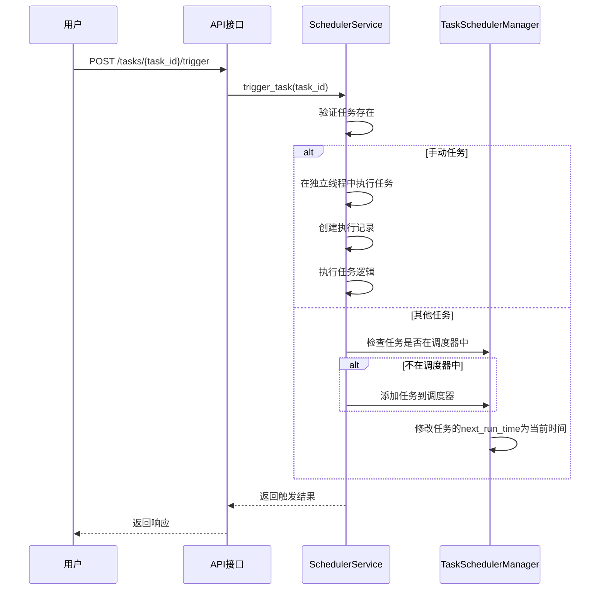

**Diagram sources**
- [scheduler.py](file://zquant/services/scheduler.py#L392-L491)
- [manager.py](file://zquant/scheduler/manager.py#L181-L193)

### 任务状态管理
系统支持对任务进行启用、禁用、暂停和恢复操作。这些操作通过API端点实现，如`/tasks/{task_id}/enable`和`/tasks/{task_id}/disable`。

当启用任务时，系统会将其添加到APScheduler调度器中；禁用时则从调度器中移除。暂停和恢复操作会相应地调用调度器的`pause_job`和`resume_job`方法。

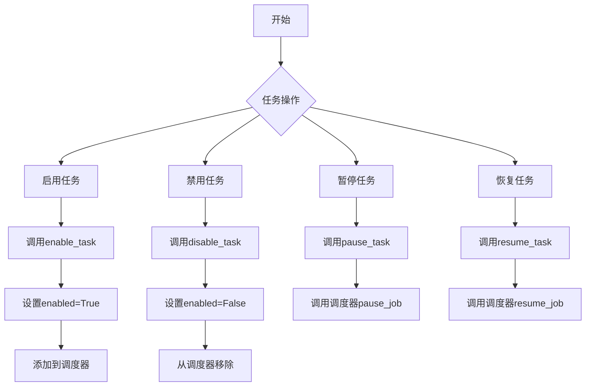

**Section sources**
- [scheduler.py](file://zquant/api/v1/scheduler.py#L202-L248)
- [scheduler.py](file://zquant/services/scheduler.py#L314-L351)

## 任务执行历史与统计
### 执行历史查询
系统提供了查询任务执行历史的功能，通过`GET /tasks/{task_id}/executions`接口实现。该接口返回指定任务的所有执行记录，包括执行状态、开始时间、结束时间和执行结果等信息。

执行历史记录存储在`zq_task_task_executions`表中，每个记录包含任务ID、执行状态、开始时间、结束时间、执行时长、结果和错误信息等字段。

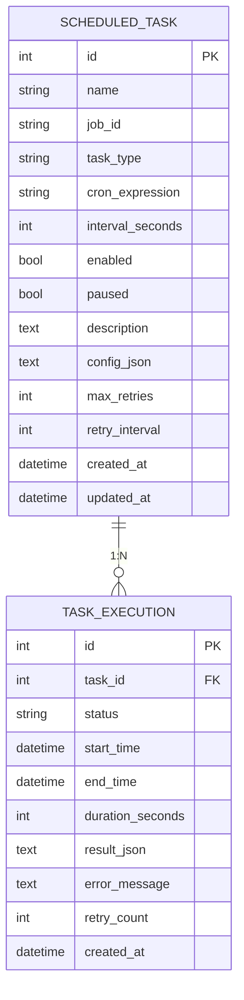

**Diagram sources**
- [scheduler.py](file://zquant/models/scheduler.py#L68-L127)
- [scheduler.py](file://zquant/api/v1/scheduler.py#L250-L270)

### 统计信息获取
系统提供了获取任务统计信息的功能，通过`GET /stats`接口实现。该接口返回任务的总执行次数、成功/失败次数、运行中任务数、成功率、平均执行时长和最近执行时间等统计信息。

统计信息的计算基于执行历史记录，通过聚合查询实现。对于单个任务，统计其所有执行记录；对于所有任务，则统计数据库中所有执行记录。

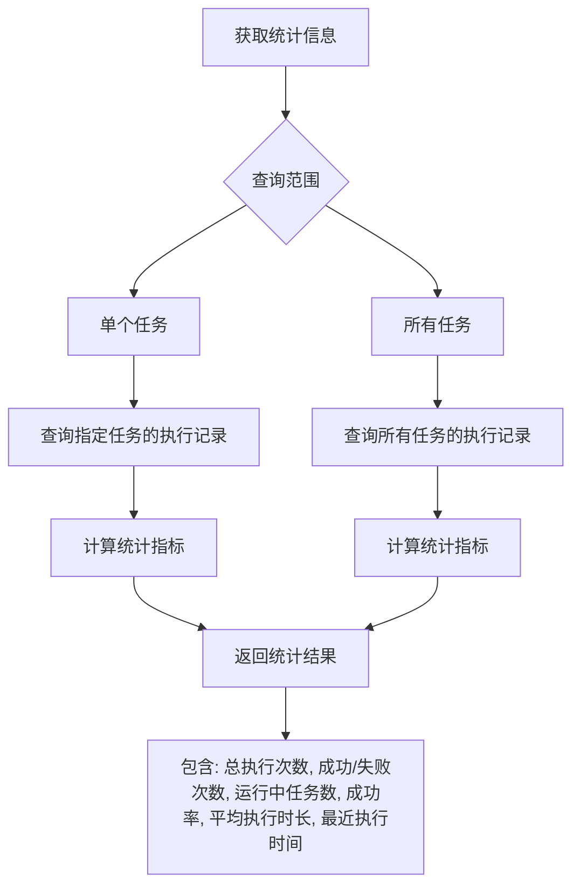

**Section sources**
- [scheduler.py](file://zquant/api/v1/scheduler.py#L327-L340)
- [scheduler.py](file://zquant/services/scheduler.py#L516-L550)

## 任务执行日志
### 日志结构
任务执行日志存储在`TaskExecution`模型的`result_json`字段中，采用JSON格式。系统在保存执行结果时会进行精简处理，只保留有价值的信息，避免存储大量冗余数据。

日志结构包含以下核心信息：
- **执行状态**：成功、失败等
- **执行命令和参数**：执行的命令和工作目录
- **执行时长**：任务执行的总时长
- **进度信息**：进度百分比、当前步骤、总步骤数
- **汇总信息**：从结果中提取的统计信息，如同步记录数、成功/失败计数等
- **错误摘要**：如果执行失败，会从stderr中提取关键错误信息的前500字符

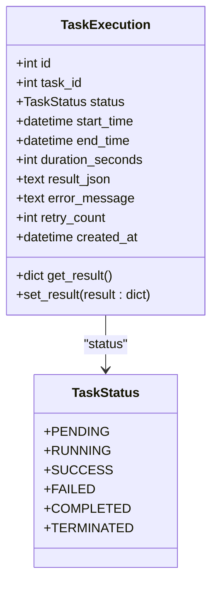

**Section sources**
- [scheduler.py](file://zquant/models/scheduler.py#L108-L203)
- [scheduler.py](file://zquant/services/scheduler.py#L516-L550)

### 日志存储位置
任务执行日志存储在数据库的`zq_task_task_executions`表中，而不是文件系统。这种设计便于查询和分析，同时保证了数据的一致性和可靠性。

数据库连接配置在`config.py`中定义，包括主机、端口、用户名、密码和数据库名称等信息。系统使用SQLAlchemy作为ORM框架，通过连接池管理数据库连接。

**Section sources**
- [scheduler.py](file://zquant/models/scheduler.py#L111-L112)
- [config.py](file://zquant/config.py#L42-L47)
- [database.py](file://zquant/database.py#L39-L54)

### 日志查询方法
日志查询通过API接口`GET /tasks/{task_id}/executions`和`GET /tasks/{task_id}/executions/{execution_id}`实现。前者返回指定任务的所有执行记录，后者返回单个执行记录的详细信息。

查询支持分页参数`skip`和`limit`，以及按状态、时间等条件筛选。返回结果包含执行记录的详细信息，包括执行结果的解析内容。

**Section sources**
- [scheduler.py](file://zquant/api/v1/scheduler.py#L250-L291)
- [scheduler.py](file://zquant/services/scheduler.py#L494-L513)

## 编排任务管理
### 依赖关系配置
编排任务（Workflow）支持配置任务之间的依赖关系，确保任务按正确的顺序执行。依赖关系在任务配置的`tasks`数组中定义，每个任务项包含`dependencies`字段，列出其依赖的任务ID。

系统在执行前会验证依赖关系，包括检查依赖任务是否存在、是否启用，以及是否存在循环依赖。循环依赖通过深度优先搜索（DFS）算法检测。

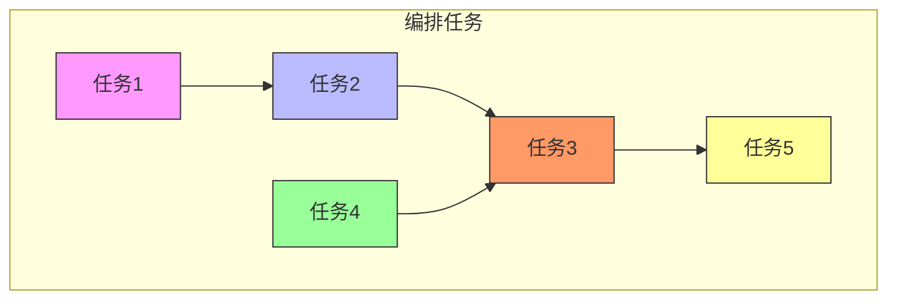

**Section sources**
- [workflow_executor.py](file://zquant/scheduler/executors/workflow_executor.py#L107-L143)
- [scheduler.py](file://zquant/schemas/scheduler.py#L177-L191)

### 执行顺序控制
编排任务支持两种执行模式：串行（serial）和并行（parallel）。执行模式在配置的`workflow_type`字段中指定。

在串行模式下，系统通过拓扑排序确定任务执行顺序，确保每个任务的所有依赖任务都完成后才执行该任务。在并行模式下，系统会同时执行所有无依赖关系的任务，提高执行效率。

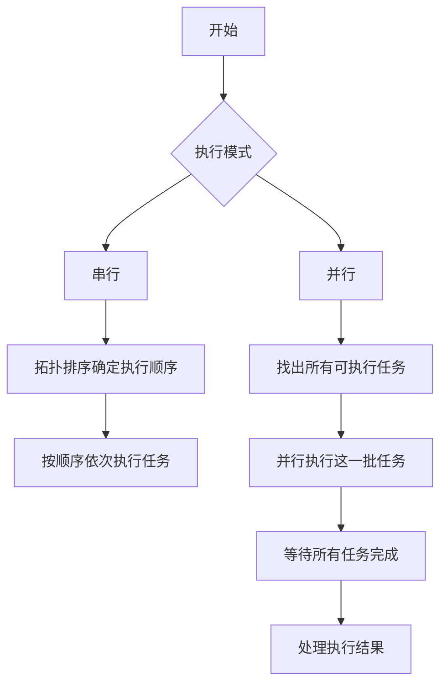

**Section sources**
- [workflow_executor.py](file://zquant/scheduler/executors/workflow_executor.py#L50-L86)
- [workflow_executor.py](file://zquant/scheduler/executors/workflow_executor.py#L152-L241)

### 异常传播机制
编排任务支持配置失败处理策略，通过`on_failure`字段指定。该字段可设置为`stop`（停止）或`continue`（继续）。

当`on_failure`设置为`stop`时，如果任一任务执行失败，整个编排任务将停止执行。当设置为`continue`时，即使有任务失败，其他任务仍会继续执行。

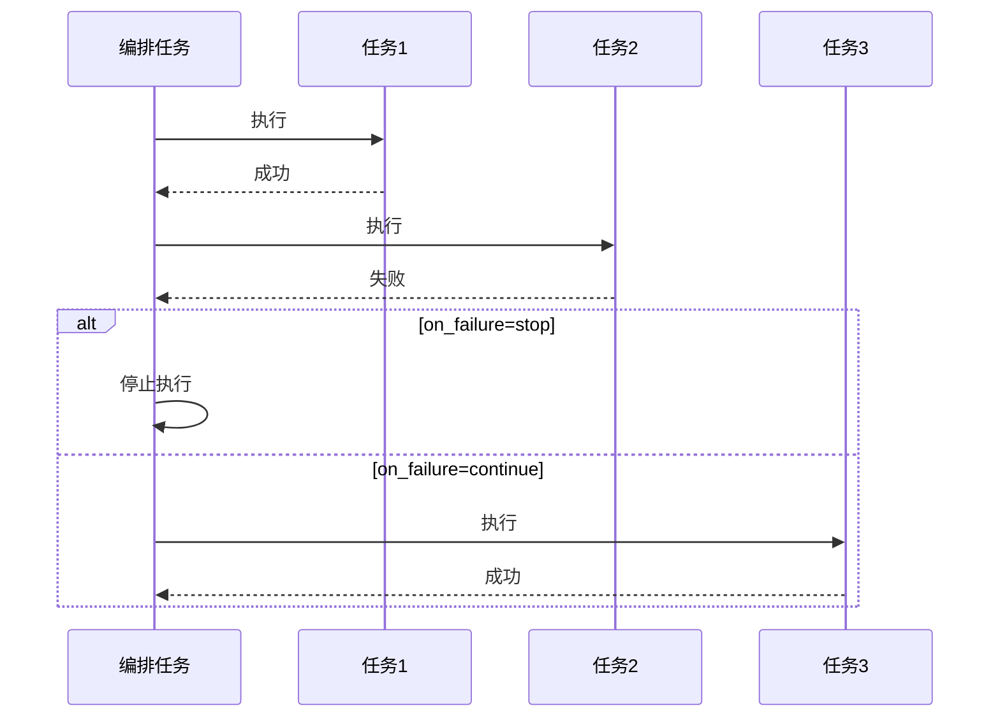

**Section sources**
- [workflow_executor.py](file://zquant/scheduler/executors/workflow_executor.py#L50-L67)
- [workflow_executor.py](file://zquant/scheduler/executors/workflow_executor.py#L212-L227)

## 具体任务示例
### sync_stock_list任务
`sync_stock_list`任务用于同步股票列表数据。该任务通过`SyncStockListJob`类实现，继承自`BaseSyncJob`。

任务执行时，会调用`DataScheduler.sync_stock_list`方法同步数据，并记录同步的记录数。任务不需要日期参数，因为它同步的是最新的股票列表。

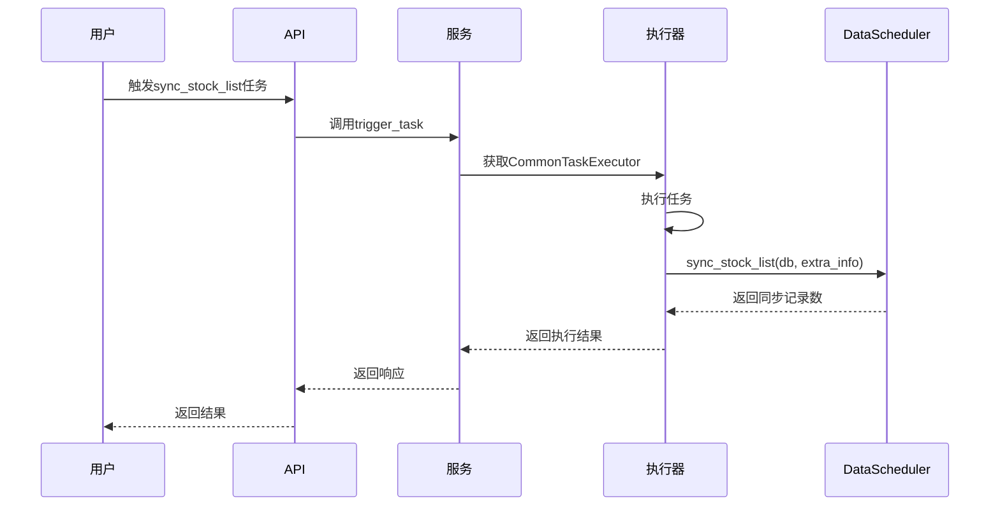

**Section sources**
- [sync_stock_list.py](file://zquant/scheduler/job/sync_stock_list.py#L52-L75)
- [scheduler.py](file://zquant/services/scheduler.py#L494-L513)

### sync_trading_calendar任务
`sync_trading_calendar`任务用于同步交易日历数据。该任务支持通过命令行参数指定开始日期和结束日期。

任务执行时，会验证日期参数，然后调用`DataScheduler.sync_trading_calendar`方法同步指定日期范围内的交易日历数据。

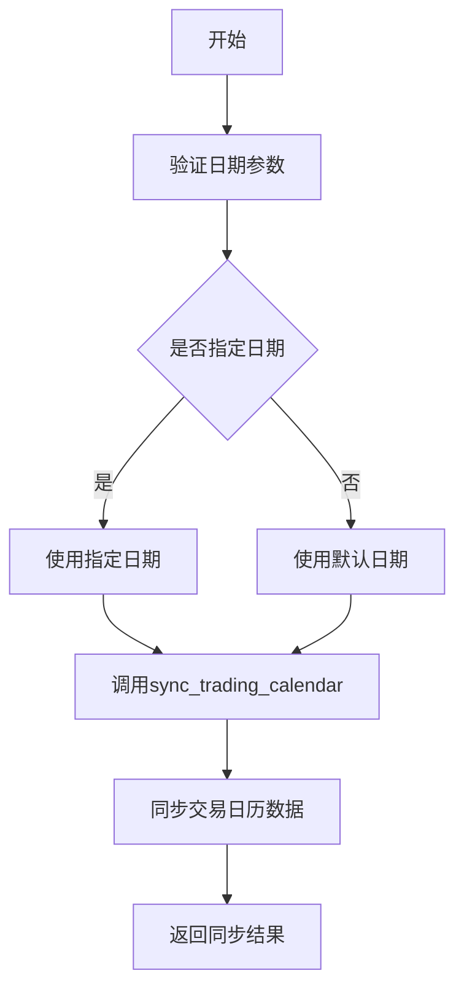

**Section sources**
- [sync_trading_calendar.py](file://zquant/scheduler/job/sync_trading_calendar.py#L62-L95)
- [scheduler.py](file://zquant/services/scheduler.py#L494-L513)

## 执行策略与监控
### 失败重试策略
系统为每个任务配置了失败重试策略，包括最大重试次数（`max_retries`）和重试间隔（`retry_interval`）。当任务执行失败时，系统会在指定间隔后自动重试，最多重试指定次数。

重试逻辑在`TaskSchedulerManager._retry_task`方法中实现，通过创建独立线程执行重试，确保不影响主线程和其他任务的执行。

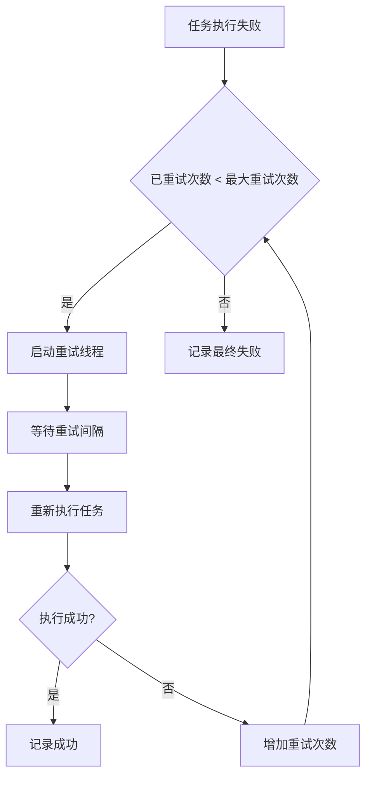

**Section sources**
- [manager.py](file://zquant/scheduler/manager.py#L373-L463)
- [scheduler.py](file://zquant/models/scheduler.py#L83-L84)

### 执行超时处理
系统通过配置项`SCHEDULER_THREAD_POOL_SIZE`控制任务线程池大小，确保任务异步执行且不影响主线程。任务执行本身没有硬性超时限制，但可以通过任务配置中的`timeout_seconds`参数实现超时控制。

对于长时间运行的任务，系统支持实时进度查看，通过更新执行记录中的进度信息来反映任务执行状态。

**Section sources**
- [manager.py](file://zquant/scheduler/manager.py#L53-L54)
- [config.py](file://zquant/config.py#L89-L90)

### 性能监控指标
系统提供了丰富的性能监控指标，包括：
- 任务执行成功率
- 平均执行时长
- 任务执行频率
- 线程池使用情况
- 数据库连接池状态

这些指标可以通过API接口获取，用于监控系统健康状况和性能表现。

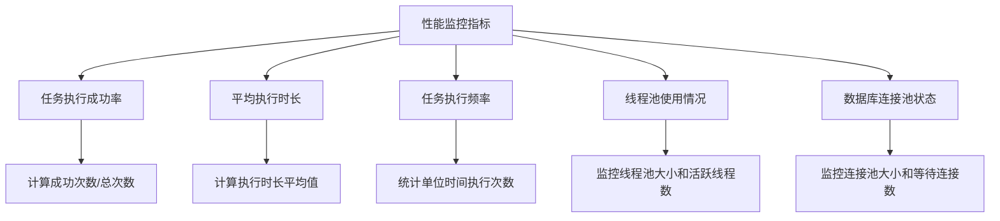

**Section sources**
- [scheduler.py](file://zquant/services/scheduler.py#L516-L550)
- [config.py](file://zquant/config.py#L51-L56)

## API调用示例
### 手动触发任务
```python
import requests

# 配置
BASE_URL = "http://localhost:8000"
TOKEN = "your_jwt_token"
HEADERS = {
    "Authorization": f"Bearer {TOKEN}",
    "Content-Type": "application/json"
}

# 手动触发任务
task_id = 1
response = requests.post(
    f"{BASE_URL}/api/v1/scheduler/tasks/{task_id}/trigger",
    headers=HEADERS
)

if response.status_code == 200:
    print("任务已成功触发")
else:
    print(f"触发任务失败: {response.json()}")
```

### 查询任务执行历史
```python
import requests

# 查询任务执行历史
task_id = 1
response = requests.get(
    f"{BASE_URL}/api/v1/scheduler/tasks/{task_id}/executions?skip=0&limit=10",
    headers=HEADERS
)

if response.status_code == 200:
    executions = response.json()["executions"]
    for execution in executions:
        print(f"执行ID: {execution['id']}, 状态: {execution['status']}, 开始时间: {execution['start_time']}")
else:
    print(f"查询执行历史失败: {response.json()}")
```

### 创建编排任务
```python
import requests

# 创建编排任务
workflow_data = {
    "name": "数据同步编排任务",
    "task_type": "workflow",
    "cron_expression": "0 1 * * *",
    "config": {
        "workflow_type": "serial",
        "tasks": [
            {
                "task_id": 1,
                "name": "同步股票列表",
                "dependencies": []
            },
            {
                "task_id": 2,
                "name": "同步交易日历",
                "dependencies": [1]
            }
        ],
        "on_failure": "stop"
    },
    "enabled": True
}

response = requests.post(
    f"{BASE_URL}/api/v1/scheduler/tasks",
    headers=HEADERS,
    json=workflow_data
)

if response.status_code == 201:
    print("编排任务创建成功")
else:
    print(f"创建编排任务失败: {response.json()}")
```

**Section sources**
- [scheduler.py](file://zquant/api/v1/scheduler.py#L188-L199)
- [scheduler.py](file://zquant/api/v1/scheduler.py#L250-L270)
- [scheduler.py](file://zquant/api/v1/scheduler.py#L51-L88)

## 结论
zquant平台的任务执行与监控系统提供了一套完整、可靠的解决方案，支持手动触发、历史查询、统计分析和编排执行等核心功能。系统设计合理，代码结构清晰，易于扩展和维护。通过API接口，用户可以方便地管理和监控任务执行，确保数据同步和分析工作的顺利进行。