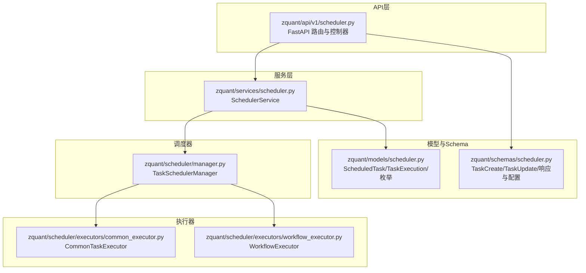
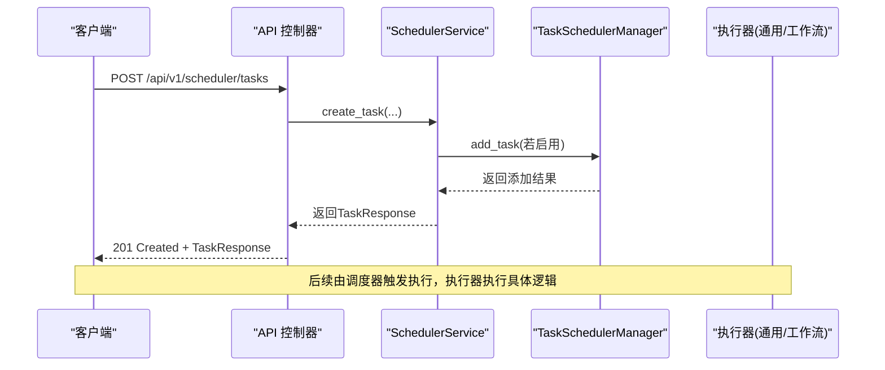
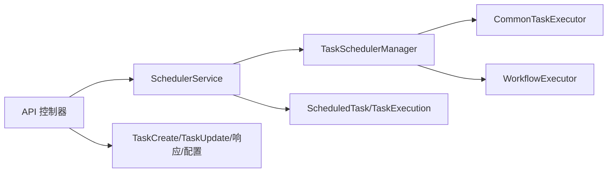

# 任务调度API

<cite>
**本文引用的文件**
- [zquant/api/v1/scheduler.py](file://zquant/api/v1/scheduler.py)
- [zquant/schemas/scheduler.py](file://zquant/schemas/scheduler.py)
- [zquant/models/scheduler.py](file://zquant/models/scheduler.py)
- [zquant/services/scheduler.py](file://zquant/services/scheduler.py)
- [zquant/scheduler/manager.py](file://zquant/scheduler/manager.py)
- [zquant/scheduler/executors/common_executor.py](file://zquant/scheduler/executors/common_executor.py)
- [zquant/scheduler/executors/workflow_executor.py](file://zquant/scheduler/executors/workflow_executor.py)
- [zquant/scheduler/job/sync_daily_data.py](file://zquant/scheduler/job/sync_daily_data.py)
- [docs/scheduler_guide.md](file://docs/scheduler_guide.md)
- [docs/api/api_reference.md](file://docs/api/api_reference.md)
</cite>

## 目录
1. [简介](#简介)
2. [项目结构](#项目结构)
3. [核心组件](#核心组件)
4. [架构总览](#架构总览)
5. [详细组件分析](#详细组件分析)
6. [依赖关系分析](#依赖关系分析)
7. [性能与可靠性](#性能与可靠性)
8. [故障排查](#故障排查)
9. [结论](#结论)
10. [附录：API参考与示例](#附录api参考与示例)

## 简介
本文件为 zquant 任务调度API的权威文档，覆盖定时任务的创建、更新、删除、启停、手动触发等管理操作；解释 Cron 表达式与间隔调度两种定时模式的配置方法；说明任务执行历史的查询与统计信息获取；阐述编排任务（Workflow）的配置验证与任务依赖管理机制；并提供自动化数据同步与定时计算任务的配置示例与最佳实践。

## 项目结构
任务调度系统围绕“API层 → 服务层 → 调度器管理器 → 执行器”展开，数据库模型负责持久化任务与执行历史，Schema 负责请求/响应的结构与校验。

图表来源
- [zquant/api/v1/scheduler.py](file://zquant/api/v1/scheduler.py#L1-L341)
- [zquant/services/scheduler.py](file://zquant/services/scheduler.py#L1-L710)
- [zquant/scheduler/manager.py](file://zquant/scheduler/manager.py#L1-L475)
- [zquant/scheduler/executors/common_executor.py](file://zquant/scheduler/executors/common_executor.py#L1-L135)
- [zquant/scheduler/executors/workflow_executor.py](file://zquant/scheduler/executors/workflow_executor.py#L1-L385)
- [zquant/models/scheduler.py](file://zquant/models/scheduler.py#L1-L203)
- [zquant/schemas/scheduler.py](file://zquant/schemas/scheduler.py#L1-L191)

章节来源
- [zquant/api/v1/scheduler.py](file://zquant/api/v1/scheduler.py#L1-L341)
- [zquant/services/scheduler.py](file://zquant/services/scheduler.py#L1-L710)
- [zquant/scheduler/manager.py](file://zquant/scheduler/manager.py#L1-L475)
- [zquant/models/scheduler.py](file://zquant/models/scheduler.py#L1-L203)
- [zquant/schemas/scheduler.py](file://zquant/schemas/scheduler.py#L1-L191)

## 核心组件
- API 控制器：提供任务管理、启停、手动触发、执行历史查询、统计、编排任务配置验证等接口。
- 服务层：封装业务逻辑，负责任务创建/更新/删除、启停、手动触发、执行历史与统计、编排配置验证与依赖校验、状态计算。
- 调度器管理器：基于 APScheduler，负责任务的添加、移除、暂停/恢复、触发、状态查询与重试。
- 执行器：通用任务执行器根据配置路由到具体执行器（脚本、数据同步、因子计算、工作流等）。
- 模型与Schema：定义任务类型、调度状态、执行状态、任务与执行历史表结构及序列化/反序列化。

章节来源
- [zquant/api/v1/scheduler.py](file://zquant/api/v1/scheduler.py#L51-L341)
- [zquant/services/scheduler.py](file://zquant/services/scheduler.py#L39-L710)
- [zquant/scheduler/manager.py](file://zquant/scheduler/manager.py#L46-L475)
- [zquant/scheduler/executors/common_executor.py](file://zquant/scheduler/executors/common_executor.py#L1-L135)
- [zquant/scheduler/executors/workflow_executor.py](file://zquant/scheduler/executors/workflow_executor.py#L1-L385)
- [zquant/models/scheduler.py](file://zquant/models/scheduler.py#L38-L203)
- [zquant/schemas/scheduler.py](file://zquant/schemas/scheduler.py#L35-L191)

## 架构总览
下面的时序图展示了“创建任务”的典型流程，体现从API到服务层再到调度器与执行器的协作。

图表来源
- [zquant/api/v1/scheduler.py](file://zquant/api/v1/scheduler.py#L51-L89)
- [zquant/services/scheduler.py](file://zquant/services/scheduler.py#L42-L111)
- [zquant/scheduler/manager.py](file://zquant/scheduler/manager.py#L93-L142)

## 详细组件分析

### API 层：任务管理与查询接口
- 创建任务：支持手动任务、通用任务、编排任务；对手动任务禁止 Cron 与间隔配置；对编排任务进行配置校验。
- 列表与详情：支持按类型、启用状态、排序字段查询；返回任务详情与最新执行状态/调度状态。
- 更新任务：对手动任务禁止 Cron 与间隔配置；对编排任务更新配置时进行校验。
- 启用/禁用/暂停/恢复：变更任务状态并同步到调度器。
- 手动触发：手动任务在独立线程执行；非手动任务通过调度器触发。
- 执行历史：分页查询任务执行历史；支持按执行记录ID查询详情。
- 统计信息：返回总执行次数、成功/失败/运行中数量、成功率、平均时长、最近执行时间。
- 编排任务：提供编排任务配置验证接口与获取编排子任务列表接口。

章节来源
- [zquant/api/v1/scheduler.py](file://zquant/api/v1/scheduler.py#L51-L341)
- [docs/scheduler_guide.md](file://docs/scheduler_guide.md#L868-L1004)

### 服务层：业务逻辑与状态计算
- 任务生命周期：创建、更新、删除、启用、禁用、暂停、恢复、手动触发。
- 手动触发：手动任务在独立线程中执行，创建执行记录，执行器返回结果后更新执行记录；失败时按重试策略重试。
- 编排配置验证：校验 workflow_type、tasks 列表、任务ID存在性与启用状态、依赖合法性与循环依赖（拓扑排序）。
- 统计信息：聚合执行历史，计算成功率、平均时长、最近执行时间。
- 调度状态计算：综合任务启用/暂停、调度器job状态、最新执行状态与未来计划，输出统一的调度状态。

章节来源
- [zquant/services/scheduler.py](file://zquant/services/scheduler.py#L39-L710)

### 调度器管理器：APScheduler 封装
- 线程池大小、合并错过任务、单实例运行、宽限期等配置。
- 添加/移除/暂停/恢复/触发任务；获取作业状态（下次运行时间、是否延迟/过期、是否存在）。
- Cron/Interval 触发器构建；作业包装函数在独立线程中执行，创建执行记录并调用执行器。
- 重试：失败后在独立线程按间隔重试，最多重试 max_retries 次。

章节来源
- [zquant/scheduler/manager.py](file://zquant/scheduler/manager.py#L46-L475)

### 执行器：通用与工作流
- 通用任务执行器：根据配置字段路由到脚本执行器、数据同步执行器、因子计算执行器等；支持 task_action 推断。
- 工作流执行器：支持串行与并行两种模式；构建依赖图，拓扑排序确定串行顺序；并行模式使用线程池按依赖就绪并发执行；支持失败策略（stop/continue）。

章节来源
- [zquant/scheduler/executors/common_executor.py](file://zquant/scheduler/executors/common_executor.py#L1-L135)
- [zquant/scheduler/executors/workflow_executor.py](file://zquant/scheduler/executors/workflow_executor.py#L1-L385)

### 模型与Schema：数据结构与校验
- 任务类型：manual_task、common_task、workflow。
- 调度状态：disabled、paused、pending、running、success、failed。
- 执行状态：pending、running、success、failed、completed、terminated。
- ScheduledTask：任务配置（cron_expression、interval_seconds、config_json、重试策略）、启用/暂停、关系到执行历史。
- TaskExecution：执行记录（状态、起止时间、时长、结果、错误、重试次数）。
- Schema：TaskCreate/TaskUpdate/TaskResponse/ExecutionResponse/TaskStatsResponse/WorkflowTaskConfig 等。

章节来源
- [zquant/models/scheduler.py](file://zquant/models/scheduler.py#L38-L203)
- [zquant/schemas/scheduler.py](file://zquant/schemas/scheduler.py#L35-L191)

### Cron 表达式与间隔调度
- Cron 表达式：支持 5 段（分、时、日、月、周），解析为 APScheduler CronTrigger。
- 间隔调度：基于 IntervalTrigger，单位秒。
- 手动任务：不支持 Cron 与间隔，只能手动触发。

章节来源
- [zquant/scheduler/manager.py](file://zquant/scheduler/manager.py#L259-L281)
- [zquant/services/scheduler.py](file://zquant/services/scheduler.py#L73-L111)

### 编排任务（Workflow）：配置验证与依赖管理
- 配置字段：workflow_type（serial/parallel）、tasks（task_id/name/dependencies）、on_failure（stop/continue）。
- 验证：检查 workflow_type、tasks 非空、task_id 存在且启用、依赖任务在列表中、无循环依赖（拓扑排序）。
- 执行：串行按拓扑排序执行；并行按依赖就绪并发执行；失败策略控制后续行为。

章节来源
- [zquant/schemas/scheduler.py](file://zquant/schemas/scheduler.py#L177-L191)
- [zquant/services/scheduler.py](file://zquant/services/scheduler.py#L553-L630)
- [zquant/scheduler/executors/workflow_executor.py](file://zquant/scheduler/executors/workflow_executor.py#L1-L385)

### 执行历史与统计
- 执行历史：按任务ID分页查询，返回状态、起止时间、时长、结果、错误、重试次数。
- 统计信息：聚合执行历史，计算总执行次数、成功/失败/运行中数量、成功率、平均时长、最近执行时间。

章节来源
- [zquant/services/scheduler.py](file://zquant/services/scheduler.py#L494-L551)
- [zquant/models/scheduler.py](file://zquant/models/scheduler.py#L108-L203)

### 自动化数据同步与定时计算示例
- 数据同步：通过通用任务执行器路由到数据同步执行器，支持多种同步动作（如同步日线数据、交易日历、股票列表等）。
- 定时计算：通过通用任务执行器路由到因子计算执行器，支持因子计算任务。
- 示例脚本：提供日线数据同步脚本，可通过命令行参数控制股票范围与日期区间。

章节来源
- [zquant/scheduler/executors/common_executor.py](file://zquant/scheduler/executors/common_executor.py#L49-L135)
- [zquant/scheduler/job/sync_daily_data.py](file://zquant/scheduler/job/sync_daily_data.py#L1-L242)

## 依赖关系分析
- API 依赖服务层；服务层依赖模型与调度器管理器；调度器管理器依赖执行器；执行器依赖具体任务实现。
- 服务层在创建/更新任务时，根据启用状态决定是否添加到调度器；启停/暂停/恢复会同步到调度器。
- 编排任务在执行时动态加载子任务并校验依赖，串行/并行模式分别采用拓扑排序与线程池并发。

图表来源
- [zquant/api/v1/scheduler.py](file://zquant/api/v1/scheduler.py#L1-L341)
- [zquant/services/scheduler.py](file://zquant/services/scheduler.py#L1-L710)
- [zquant/scheduler/manager.py](file://zquant/scheduler/manager.py#L1-L475)
- [zquant/scheduler/executors/common_executor.py](file://zquant/scheduler/executors/common_executor.py#L1-L135)
- [zquant/scheduler/executors/workflow_executor.py](file://zquant/scheduler/executors/workflow_executor.py#L1-L385)
- [zquant/models/scheduler.py](file://zquant/models/scheduler.py#L1-L203)
- [zquant/schemas/scheduler.py](file://zquant/schemas/scheduler.py#L1-L191)

## 性能与可靠性
- 线程池与异步执行：调度器使用线程池异步执行任务，避免阻塞主线程；手动任务也在独立线程执行。
- 重试策略：失败后按间隔重试，最多重试 max_retries 次，避免瞬时故障影响整体任务。
- 作业合并与宽限期：错过执行时间的任务在宽限期内仍可执行，减少漏执行风险。
- 执行结果精简：执行结果仅保留关键字段，避免存储冗余信息。

章节来源
- [zquant/scheduler/manager.py](file://zquant/scheduler/manager.py#L46-L120)
- [zquant/models/scheduler.py](file://zquant/models/scheduler.py#L135-L203)
- [zquant/services/scheduler.py](file://zquant/services/scheduler.py#L391-L492)

## 故障排查
- 任务未执行：检查任务启用/暂停状态、调度器是否运行、Cron/Interval 配置是否有效。
- 手动任务无法自动调度：手动任务不添加到调度器，需手动触发。
- 编排任务失败：检查 workflow_type、tasks、dependencies 是否合法；确认无循环依赖；查看 on_failure 策略。
- 执行历史为空：确认任务已执行且未被清理；检查分页参数。
- 统计信息异常：确认执行历史是否完整；检查任务状态是否正确。

章节来源
- [zquant/services/scheduler.py](file://zquant/services/scheduler.py#L553-L710)
- [zquant/scheduler/manager.py](file://zquant/scheduler/manager.py#L195-L258)

## 结论
zquant 任务调度API提供了完善的定时任务管理能力，涵盖 Cron/间隔调度、启停/暂停/恢复、手动触发、执行历史与统计、编排任务配置验证与依赖管理。通过服务层与调度器管理器的清晰分离，系统具备良好的扩展性与可靠性，适合构建自动化数据同步与定时计算场景。

## 附录：API参考与示例

### 认证与基础信息
- Base URL：http://localhost:8000/api/v1
- 认证方式：Bearer Token 或 X-API-Key/X-API-Secret
- 参考：[认证与API分类](file://docs/api/api_reference.md#L1-L200)

章节来源
- [docs/api/api_reference.md](file://docs/api/api_reference.md#L1-L200)

### 任务管理与查询接口
- 创建任务：POST /api/v1/scheduler/tasks
- 获取任务列表：GET /api/v1/scheduler/tasks
- 获取任务详情：GET /api/v1/scheduler/tasks/{task_id}
- 更新任务：PUT /api/v1/scheduler/tasks/{task_id}
- 删除任务：DELETE /api/v1/scheduler/tasks/{task_id}
- 启用任务：POST /api/v1/scheduler/tasks/{task_id}/enable
- 禁用任务：POST /api/v1/scheduler/tasks/{task_id}/disable
- 暂停任务：POST /api/v1/scheduler/tasks/{task_id}/pause
- 恢复任务：POST /api/v1/scheduler/tasks/{task_id}/resume
- 手动触发任务：POST /api/v1/scheduler/tasks/{task_id}/trigger
- 获取执行历史：GET /api/v1/scheduler/tasks/{task_id}/executions
- 获取单个执行记录：GET /api/v1/scheduler/tasks/{task_id}/executions/{execution_id}
- 获取统计信息：GET /api/v1/scheduler/stats
- 获取编排子任务列表：GET /api/v1/scheduler/tasks/{task_id}/workflow
- 验证编排配置：POST /api/v1/scheduler/tasks/{task_id}/workflow/validate

章节来源
- [docs/scheduler_guide.md](file://docs/scheduler_guide.md#L868-L1004)

### Cron 表达式与间隔调度配置
- Cron 表达式：5 段（分、时、日、月、周），解析为 CronTrigger。
- 间隔调度：单位秒，解析为 IntervalTrigger。
- 手动任务：不支持 Cron 与间隔。

章节来源
- [zquant/scheduler/manager.py](file://zquant/scheduler/manager.py#L259-L281)
- [zquant/services/scheduler.py](file://zquant/services/scheduler.py#L73-L111)

### 编排任务配置与依赖管理
- 配置字段：workflow_type、tasks、on_failure。
- 依赖校验：任务ID存在且启用、依赖在列表中、无循环依赖。
- 执行模式：串行（拓扑排序）、并行（线程池并发）。

章节来源
- [zquant/schemas/scheduler.py](file://zquant/schemas/scheduler.py#L177-L191)
- [zquant/services/scheduler.py](file://zquant/services/scheduler.py#L553-L630)
- [zquant/scheduler/executors/workflow_executor.py](file://zquant/scheduler/executors/workflow_executor.py#L1-L385)

### 自动化数据同步与定时计算示例
- 数据同步：通用任务执行器路由到数据同步执行器，支持多种同步动作。
- 定时计算：通用任务执行器路由到因子计算执行器。
- 示例脚本：日线数据同步脚本，支持 codelist、symbol/ts_code、start-date、end-date 参数。

章节来源
- [zquant/scheduler/executors/common_executor.py](file://zquant/scheduler/executors/common_executor.py#L49-L135)
- [zquant/scheduler/job/sync_daily_data.py](file://zquant/scheduler/job/sync_daily_data.py#L1-L242)