# 定时任务管理

<cite>
**本文档引用的文件**   
- [manager.py](file://zquant/scheduler/manager.py)
- [scheduler.py](file://zquant/api/v1/scheduler.py)
- [scheduler.py](file://zquant/models/scheduler.py)
- [scheduler.py](file://zquant/schemas/scheduler.py)
- [scheduler.py](file://zquant/services/scheduler.py)
- [sync_daily_data.py](file://zquant/scheduler/job/sync_daily_data.py)
- [sync_factor_data.py](file://zquant/scheduler/job/sync_factor_data.py)
- [executor.py](file://zquant/scheduler/executor.py)
- [common_executor.py](file://zquant/scheduler/executors/common_executor.py)
- [workflow_executor.py](file://zquant/scheduler/executors/workflow_executor.py)
- [base.py](file://zquant/scheduler/job/base.py)
- [index.tsx](file://web/src/pages/admin/scheduler/index.tsx)
- [scheduler_guide.md](file://docs/scheduler_guide.md)
</cite>

## 目录
1. [概述](#概述)
2. [任务元数据定义](#任务元数据定义)
3. [调度模式配置](#调度模式配置)
4. [API操作流程](#api操作流程)
5. [数据同步任务示例](#数据同步任务示例)
6. [任务执行器与工作流](#任务执行器与工作流)
7. [边界情况处理](#边界情况处理)
8. [最佳实践与错误排查](#最佳实践与错误排查)

## 概述

zquant系统的定时任务管理功能提供了一套完整的任务调度解决方案，支持通过API进行任务的创建、更新、删除和启停操作。系统基于APScheduler实现，提供了灵活的调度配置、实时状态监控和完整的执行历史记录。核心功能包括Cron表达式和固定间隔两种调度模式，支持手动任务、通用任务和编排任务三种任务类型，能够满足各种复杂的定时任务需求。

**Section sources**
- [manager.py](file://zquant/scheduler/manager.py#L23-L26)
- [scheduler.py](file://zquant/api/v1/scheduler.py#L23-L25)

## 任务元数据定义

定时任务的元数据定义了任务的基本属性和配置信息，是任务管理和执行的基础。任务元数据主要包括任务名称、描述、执行器类型、调度配置和执行参数等关键字段。

### 任务名称与描述

任务名称是任务的唯一标识，必须在系统中保持唯一性。在数据库模型中，任务名称字段被定义为唯一约束（unique=True），确保了每个任务名称的唯一性。任务描述为可选字段，用于记录任务的详细说明和用途。

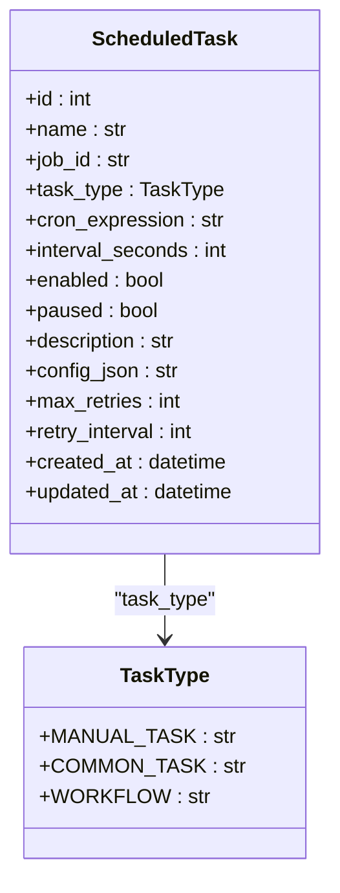

**Diagram sources **
- [scheduler.py](file://zquant/models/scheduler.py#L68-L87)

### 执行器类型

系统支持三种主要的执行器类型，每种类型对应不同的任务执行逻辑和使用场景：

1. **手动任务 (manual_task)**：不支持自动调度，只能通过手动触发执行。适用于需要按需执行的任务，如数据修复、临时数据分析等。
2. **通用任务 (common_task)**：支持自动调度，可以独立执行。支持Cron表达式和间隔调度，适用于大多数定时任务场景。
3. **编排任务 (workflow)**：支持多个任务的组合执行，可以定义任务间的依赖关系和执行顺序，支持串行和并行执行模式。

**Section sources**
- [scheduler.py](file://zquant/models/scheduler.py#L60-L66)
- [scheduler_guide.md](file://docs/scheduler_guide.md#任务类型)

## 调度模式配置

zquant系统支持两种主要的调度模式：Cron表达式调度和固定间隔调度。这两种模式提供了灵活的时间控制能力，可以满足不同场景下的任务调度需求。

### Cron表达式调度

Cron表达式是一种广泛使用的定时任务配置格式，由五个字段组成，分别表示分钟、小时、日期、月份和星期。系统支持标准的Cron表达式语法，包括特殊字符如`*`（匹配所有值）、`?`（不指定值）、`-`（范围）、`/`（步长）和`,`（列表）。

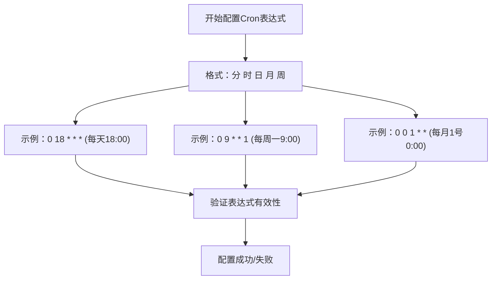

**Diagram sources **
- [index.tsx](file://web/src/pages/admin/scheduler/index.tsx#L50-L88)

### 固定间隔调度

固定间隔调度模式通过指定一个固定的时间间隔（以秒为单位）来执行任务。这种模式适用于需要定期执行的任务，如每小时、每天或每周执行的数据同步任务。

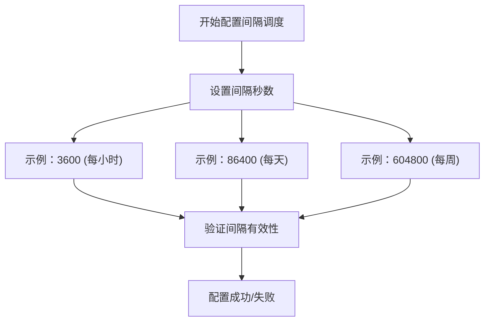

**Diagram sources **
- [scheduler.py](file://zquant/models/scheduler.py#L77-L78)

## API操作流程

zquant系统提供了完整的RESTful API接口，支持对定时任务进行全生命周期管理。API操作流程包括任务的创建、更新、删除和启停等核心操作。

### 任务创建流程

创建定时任务的API流程如下：

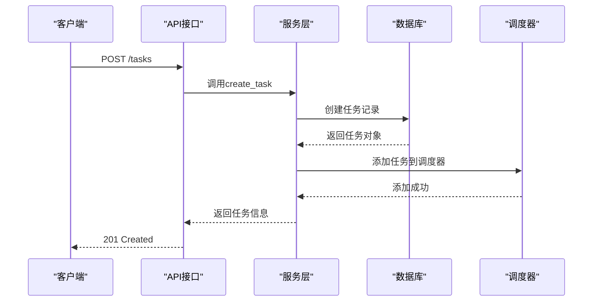

**Diagram sources **
- [scheduler.py](file://zquant/api/v1/scheduler.py#L51-L88)
- [scheduler.py](file://zquant/services/scheduler.py#L42-L110)

### 任务更新流程

更新定时任务的API流程如下：

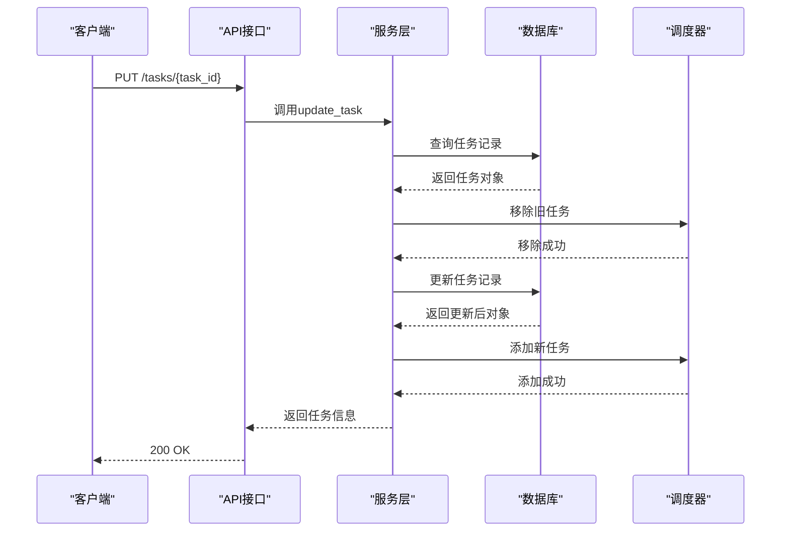

**Diagram sources **
- [scheduler.py](file://zquant/api/v1/scheduler.py#L128-L172)
- [scheduler.py](file://zquant/services/scheduler.py#L242-L295)

### 任务启停流程

任务的启用和禁用操作通过独立的API端点实现：

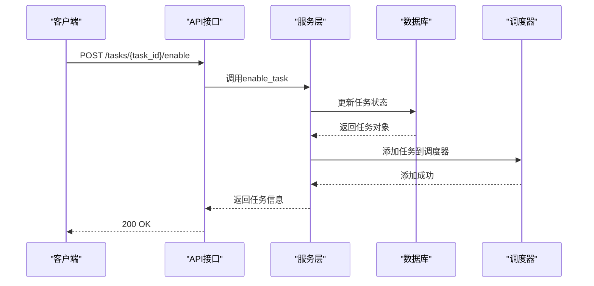

**Diagram sources **
- [scheduler.py](file://zquant/api/v1/scheduler.py#L202-L212)
- [scheduler.py](file://zquant/services/scheduler.py#L314-L333)

## 数据同步任务示例

zquant系统提供了多种数据同步任务的实现，涵盖了股票日线数据、因子数据等常见场景。这些任务通过命令行脚本的方式实现，可以通过定时任务系统进行调度。

### 日线数据同步任务

日线数据同步任务（sync_daily_data）支持多种参数配置，可以同步单只股票、股票列表或所有股票的日线数据。

```python
# 示例：同步单只股票的日线数据
python zquant/scheduler/job/sync_daily_data.py --ts-code 000001.SZ --start-date 20250101 --end-date 20250131

# 示例：同步股票列表的日线数据
python zquant/scheduler/job/sync_daily_data.py --codelist 000001,600000,000002 --start-date 20250101 --end-date 20250131

# 示例：同步所有股票的日线数据
python zquant/scheduler/job/sync_daily_data.py
```

**Section sources**
- [sync_daily_data.py](file://zquant/scheduler/job/sync_daily_data.py#L23-L56)

### 因子数据同步任务

因子数据同步任务（sync_factor_data）支持同步单只股票或所有股票的因子数据，提供了灵活的日期范围配置。

```python
# 示例：同步单只股票的因子数据
python zquant/scheduler/job/sync_factor_data.py --ts-code 000001.SZ --start-date 20250101 --end-date 20250131

# 示例：同步所有股票的因子数据
python zquant/scheduler/job/sync_factor_data.py
```

**Section sources**
- [sync_factor_data.py](file://zquant/scheduler/job/sync_factor_data.py#L23-L41)

## 任务执行器与工作流

zquant系统采用执行器模式来处理不同类型的任务执行。执行器负责具体的任务执行逻辑，而调度器负责任务的调度和管理。

### 执行器注册与路由

系统通过执行器注册表（EXECUTOR_REGISTRY）管理不同类型的执行器。当需要执行任务时，系统根据任务类型从注册表中获取对应的执行器实例。

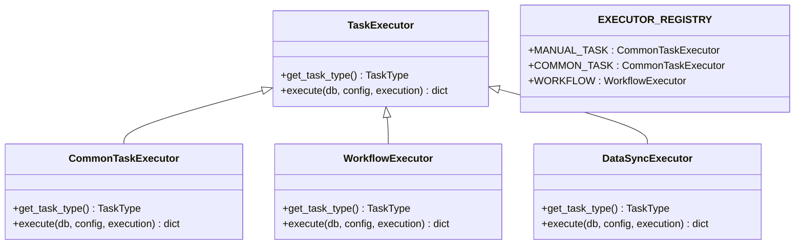

**Diagram sources **
- [executor.py](file://zquant/scheduler/executor.py#L36-L152)
- [common_executor.py](file://zquant/scheduler/executors/common_executor.py#L37-L135)
- [workflow_executor.py](file://zquant/scheduler/executors/workflow_executor.py#L39-L385)

### 编排任务执行

编排任务支持串行和并行两种执行模式，可以根据任务间的依赖关系自动确定执行顺序。

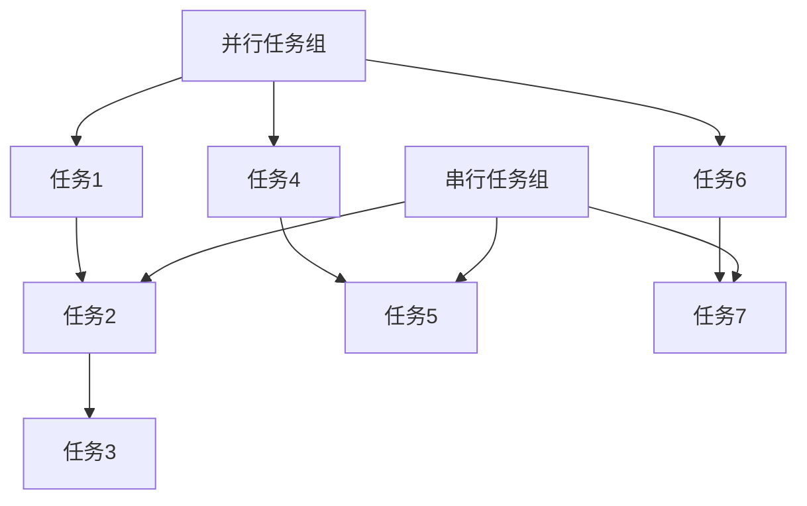

**Diagram sources **
- [workflow_executor.py](file://zquant/scheduler/executors/workflow_executor.py#L39-L385)

## 边界情况处理

系统在设计时充分考虑了各种边界情况和异常处理，确保了任务管理的稳定性和可靠性。

### 任务唯一性校验

在创建任务时，系统会对任务名称进行唯一性校验。如果尝试创建同名任务，系统会返回相应的错误信息。

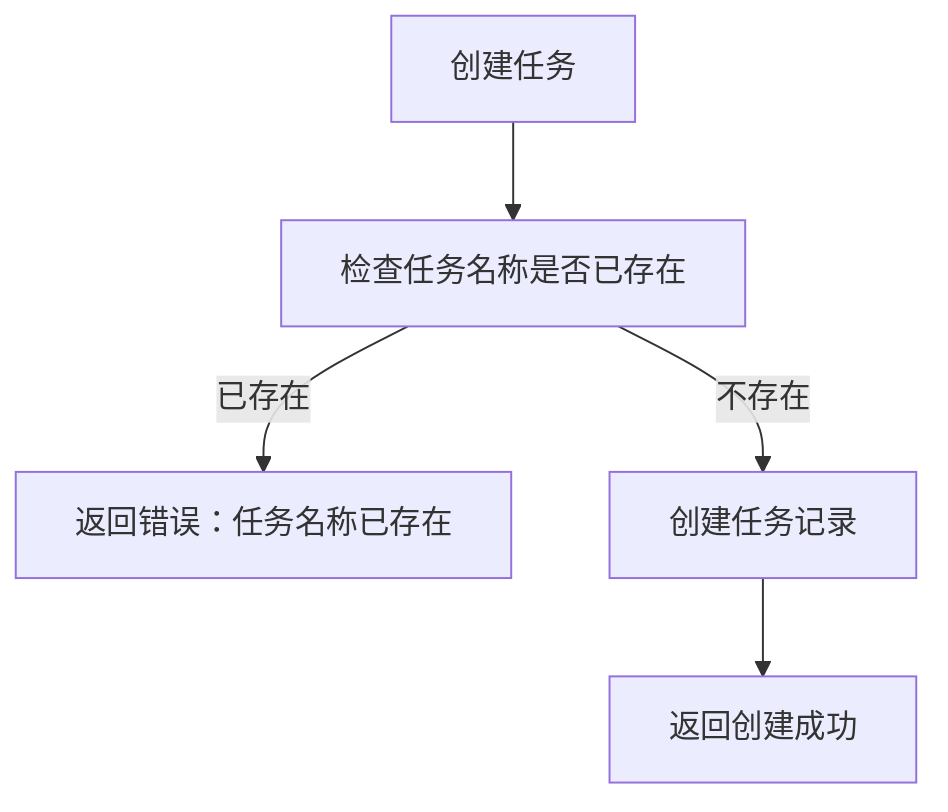

**Diagram sources **
- [scheduler.py](file://zquant/models/scheduler.py#L74)
- [scheduler.py](file://zquant/services/scheduler.py#L42-L110)

### 参数验证失败处理

系统对任务配置参数进行严格的验证，包括Cron表达式格式、间隔时间范围、任务类型兼容性等。如果参数验证失败，系统会返回详细的错误信息。

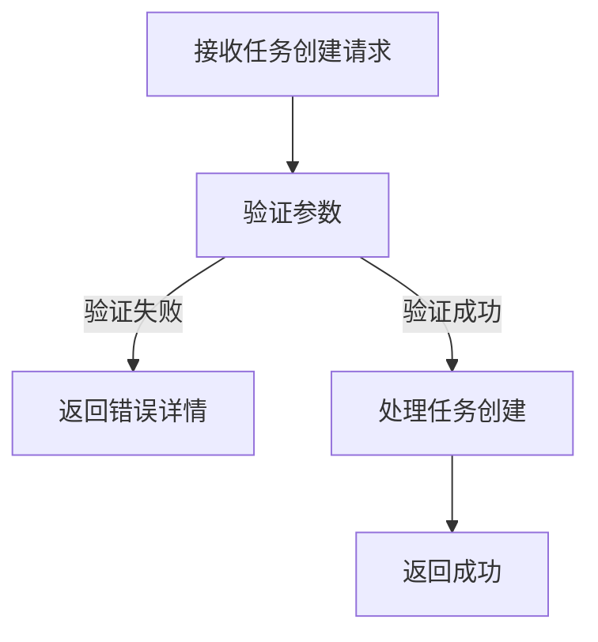

**Diagram sources **
- [scheduler.py](file://zquant/api/v1/scheduler.py#L58-L88)
- [scheduler.py](file://zquant/services/scheduler.py#L73-L87)

### 重复创建保护

系统通过数据库唯一约束和业务逻辑双重保护，防止任务的重复创建。即使在高并发场景下，也能确保任务的唯一性。

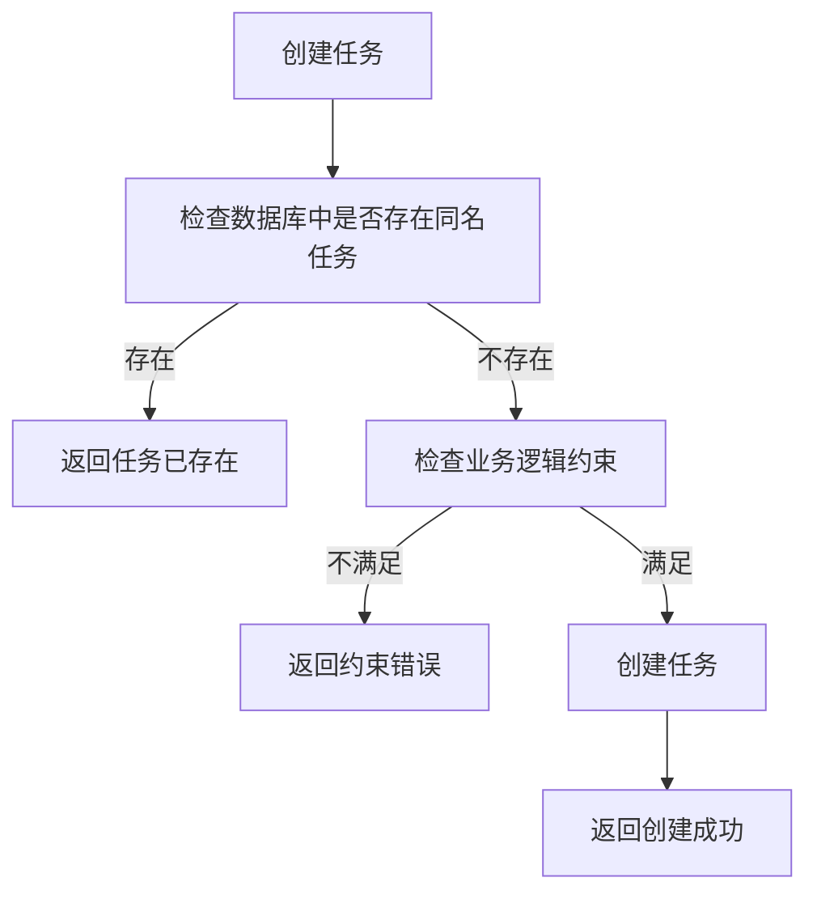

**Diagram sources **
- [scheduler.py](file://zquant/models/scheduler.py#L74)
- [scheduler.py](file://zquant/services/scheduler.py#L42-L110)

## 最佳实践与错误排查

### 任务配置最佳实践

1. **任务命名规范**：使用清晰、描述性的名称，便于识别和管理。
2. **合理设置重试策略**：根据任务的重要性和执行时间，设置合适的最大重试次数和重试间隔。
3. **充分利用任务描述**：在描述字段中记录任务的用途、负责人和注意事项。
4. **谨慎使用Cron表达式**：确保Cron表达式符合预期的执行频率，避免过于频繁的执行。

### 常见错误排查指南

1. **任务未执行**：
   - 检查任务是否已启用
   - 检查Cron表达式或间隔时间配置是否正确
   - 检查调度器是否正常运行

2. **任务执行失败**：
   - 查看执行历史中的错误信息
   - 检查任务配置参数是否正确
   - 检查依赖的服务或资源是否可用

3. **任务执行超时**：
   - 检查任务的执行时间是否过长
   - 考虑优化任务逻辑或增加超时时间
   - 检查系统资源是否充足

4. **数据库连接问题**：
   - 检查数据库连接配置
   - 检查数据库服务是否正常运行
   - 检查网络连接是否稳定

**Section sources**
- [scheduler_guide.md](file://docs/scheduler_guide.md#最佳实践)
- [scheduler_guide.md](file://docs/scheduler_guide.md#故障排查)