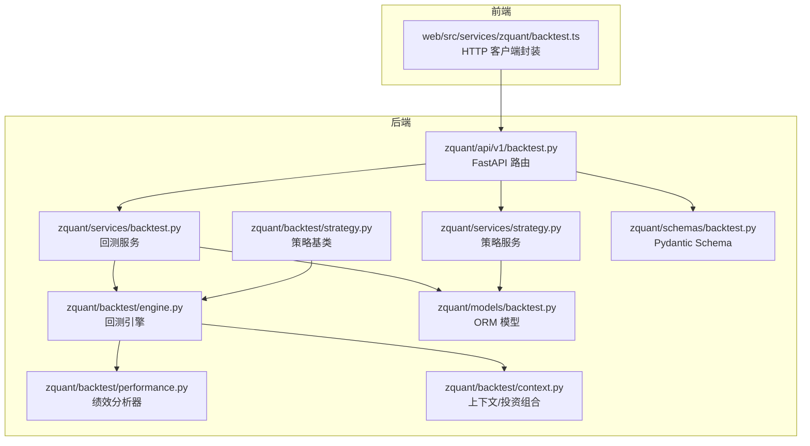
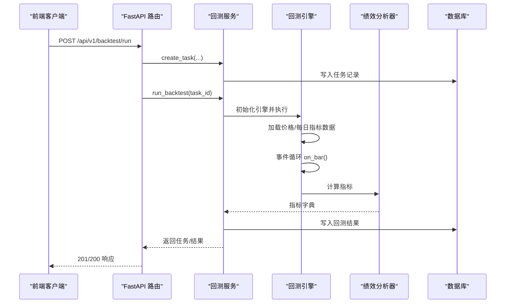
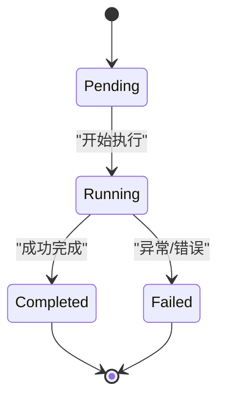
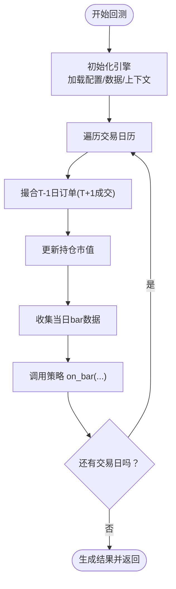
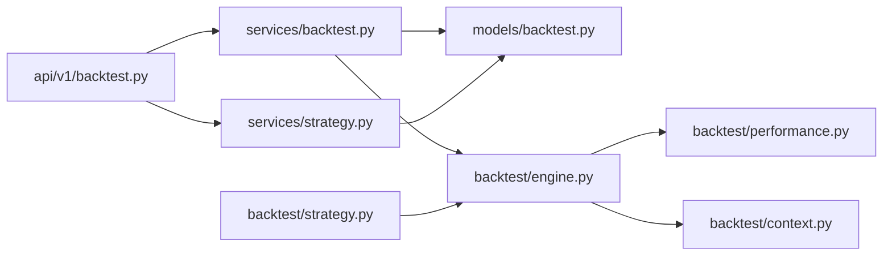

# 回测API

<cite>
**本文引用的文件**
- [zquant/api/v1/backtest.py](file://zquant/api/v1/backtest.py)
- [zquant/services/backtest.py](file://zquant/services/backtest.py)
- [zquant/models/backtest.py](file://zquant/models/backtest.py)
- [zquant/schemas/backtest.py](file://zquant/schemas/backtest.py)
- [zquant/backtest/engine.py](file://zquant/backtest/engine.py)
- [zquant/backtest/performance.py](file://zquant/backtest/performance.py)
- [zquant/backtest/context.py](file://zquant/backtest/context.py)
- [zquant/backtest/strategy.py](file://zquant/backtest/strategy.py)
- [zquant/services/strategy.py](file://zquant/services/strategy.py)
- [web/src/services/zquant/backtest.ts](file://web/src/services/zquant/backtest.ts)
- [docs/api/api_reference.md](file://docs/api/api_reference.md)
- [docs/backtest_daily_basic_usage.md](file://docs/backtest_daily_basic_usage.md)
- [zquant/strategy/examples/simple_ma.py](file://zquant/strategy/examples/simple_ma.py)
- [zquant/strategy/examples/pe_pb_strategy.py](file://zquant/strategy/examples/pe_pb_strategy.py)
</cite>

## 目录
1. [简介](#简介)
2. [项目结构](#项目结构)
3. [核心组件](#核心组件)
4. [架构总览](#架构总览)
5. [详细组件分析](#详细组件分析)
6. [依赖关系分析](#依赖关系分析)
7. [性能与扩展性](#性能与扩展性)
8. [故障排查指南](#故障排查指南)
9. [结论](#结论)
10. [附录](#附录)

## 简介
本文件为 zquant 回测API的权威文档，覆盖运行回测、获取任务列表、查询回测结果与绩效报告等端点；解释回测任务生命周期（创建、运行、完成、失败）；阐述策略管理（创建、更新、删除、模板策略）；说明回测结果的JSON存储结构与性能指标计算方法；并提供从策略编写到回测分析的完整工作流示例。

## 项目结构
回测API位于 FastAPI 后端的 v1 路由下，采用“路由层-服务层-模型层-Schema层”的分层设计，前端通过统一的服务封装发起请求。

图表来源
- [zquant/api/v1/backtest.py](file://zquant/api/v1/backtest.py#L1-L200)
- [zquant/services/backtest.py](file://zquant/services/backtest.py#L1-L120)
- [zquant/services/strategy.py](file://zquant/services/strategy.py#L1-L120)
- [zquant/backtest/engine.py](file://zquant/backtest/engine.py#L1-L120)
- [zquant/backtest/performance.py](file://zquant/backtest/performance.py#L1-L120)
- [zquant/backtest/context.py](file://zquant/backtest/context.py#L1-L120)
- [zquant/backtest/strategy.py](file://zquant/backtest/strategy.py#L1-L82)
- [zquant/models/backtest.py](file://zquant/models/backtest.py#L1-L119)
- [zquant/schemas/backtest.py](file://zquant/schemas/backtest.py#L1-L152)
- [web/src/services/zquant/backtest.ts](file://web/src/services/zquant/backtest.ts#L1-L211)

章节来源
- [zquant/api/v1/backtest.py](file://zquant/api/v1/backtest.py#L1-L200)
- [zquant/services/backtest.py](file://zquant/services/backtest.py#L1-L120)
- [zquant/services/strategy.py](file://zquant/services/strategy.py#L1-L120)
- [web/src/services/zquant/backtest.ts](file://web/src/services/zquant/backtest.ts#L1-L211)

## 核心组件
- 路由层（FastAPI）：提供回测与策略相关REST接口，负责请求校验、鉴权、响应封装。
- 服务层：封装业务逻辑，协调引擎与数据库，处理任务创建、运行、结果查询与删除。
- 引擎层：驱动回测执行，加载数据、撮合订单、更新组合、产出结果。
- 绩效层：基于回测结果计算各类指标（总收益、年化收益、最大回撤、夏普比率、胜率、盈亏比、Alpha/Beta等）。
- 上下文与策略：提供策略开发所需的上下文能力（下单、目标下单、按金额下单、每日指标访问等）。
- 模型与Schema：定义数据库表结构与API输入输出模型。

章节来源
- [zquant/api/v1/backtest.py](file://zquant/api/v1/backtest.py#L90-L173)
- [zquant/services/backtest.py](file://zquant/services/backtest.py#L43-L162)
- [zquant/backtest/engine.py](file://zquant/backtest/engine.py#L41-L120)
- [zquant/backtest/performance.py](file://zquant/backtest/performance.py#L50-L120)
- [zquant/backtest/context.py](file://zquant/backtest/context.py#L82-L188)
- [zquant/backtest/strategy.py](file://zquant/backtest/strategy.py#L33-L82)
- [zquant/models/backtest.py](file://zquant/models/backtest.py#L38-L119)
- [zquant/schemas/backtest.py](file://zquant/schemas/backtest.py#L33-L152)

## 架构总览
回测API的典型调用链如下：前端通过HTTP客户端调用后端路由，路由层调用服务层，服务层创建任务并启动引擎执行，引擎产出结果并由服务层持久化，最后返回给前端。

图表来源
- [zquant/api/v1/backtest.py](file://zquant/api/v1/backtest.py#L90-L173)
- [zquant/services/backtest.py](file://zquant/services/backtest.py#L101-L162)
- [zquant/backtest/engine.py](file://zquant/backtest/engine.py#L406-L498)
- [zquant/backtest/performance.py](file://zquant/backtest/performance.py#L50-L120)

## 详细组件分析

### 回测任务生命周期
- 状态枚举：pending（等待中）、running（运行中）、completed（已完成）、failed（失败）、cancelled（已取消）。
- 生命周期流程：
  - 创建：路由接收请求，服务层创建任务记录并持久化。
  - 运行：服务层启动引擎执行回测，状态更新为 running。
  - 完成：引擎产出结果，服务层计算指标并持久化，状态更新为 completed。
  - 失败：异常捕获并记录错误信息，状态更新为 failed。

图表来源
- [zquant/models/backtest.py](file://zquant/models/backtest.py#L38-L46)
- [zquant/services/backtest.py](file://zquant/services/backtest.py#L101-L162)

章节来源
- [zquant/models/backtest.py](file://zquant/models/backtest.py#L38-L70)
- [zquant/services/backtest.py](file://zquant/services/backtest.py#L101-L162)

### 回测运行端点
- 端点：POST /api/v1/backtest/run
- 请求体：BacktestRunRequest（strategy_id 或 strategy_code 必填其一；strategy_name 必填；config 必填）
- 行为：创建任务并立即运行；返回 BacktestTaskResponse（包含任务状态、开始/完成时间、从配置解析的 start_date/end_date）

章节来源
- [zquant/api/v1/backtest.py](file://zquant/api/v1/backtest.py#L90-L121)
- [zquant/schemas/backtest.py](file://zquant/schemas/backtest.py#L50-L57)

### 回测任务列表与详情
- 获取任务列表：GET /api/v1/backtest/tasks（支持排序字段与方向）
- 获取任务详情：GET /api/v1/backtest/tasks/{task_id}
- 响应：BacktestTaskResponse（包含任务基本信息与解析后的日期字段）

章节来源
- [zquant/api/v1/backtest.py](file://zquant/api/v1/backtest.py#L123-L146)
- [zquant/schemas/backtest.py](file://zquant/schemas/backtest.py#L59-L75)

### 回测结果与绩效报告
- 获取回测结果：GET /api/v1/backtest/tasks/{task_id}/result
- 获取绩效报告：GET /api/v1/backtest/tasks/{task_id}/performance（返回指标、交易记录、投资组合）
- 响应：BacktestResultResponse（包含核心指标与JSON字段）；PerformanceResponse（metrics/trades/portfolio）

章节来源
- [zquant/api/v1/backtest.py](file://zquant/api/v1/backtest.py#L148-L173)
- [zquant/schemas/backtest.py](file://zquant/schemas/backtest.py#L77-L106)

### 策略管理API
- 获取策略框架代码：GET /api/v1/backtest/strategies/framework（返回模板代码）
- 创建策略：POST /api/v1/backtest/strategies（StrategyCreateRequest）
- 获取策略列表：GET /api/v1/backtest/strategies（支持分类、搜索、模板筛选、排序）
- 获取模板策略列表：GET /api/v1/backtest/strategies/templates
- 获取策略详情：GET /api/v1/backtest/strategies/{strategy_id}
- 更新策略：PUT /api/v1/backtest/strategies/{strategy_id}
- 删除策略：DELETE /api/v1/backtest/strategies/{strategy_id}

权限与可见性：
- 普通用户只能编辑/删除自己创建的策略；模板策略不可被普通用户修改/删除。
- include_all 参数控制是否包含模板策略与其他用户的策略。

章节来源
- [zquant/api/v1/backtest.py](file://zquant/api/v1/backtest.py#L178-L395)
- [zquant/services/strategy.py](file://zquant/services/strategy.py#L35-L126)
- [zquant/schemas/backtest.py](file://zquant/schemas/backtest.py#L107-L152)

### 回测结果管理
- 获取结果列表：GET /api/v1/backtest/results（支持排序）
- 删除回测结果：DELETE /api/v1/backtest/results/{result_id}（级联删除任务）

章节来源
- [zquant/api/v1/backtest.py](file://zquant/api/v1/backtest.py#L399-L424)
- [zquant/services/backtest.py](file://zquant/services/backtest.py#L225-L278)

### 回测引擎与策略执行
- 引擎初始化：加载配置、初始化上下文、成本计算器、交易日历与价格/每日指标数据。
- 事件循环：逐日触发 on_bar，撮合 T+1 订单，更新组合与净值，记录订单与持仓。
- 结果产出：返回 portfolio、orders、config 等结构化数据。

图表来源
- [zquant/backtest/engine.py](file://zquant/backtest/engine.py#L406-L498)

章节来源
- [zquant/backtest/engine.py](file://zquant/backtest/engine.py#L41-L120)
- [zquant/backtest/engine.py](file://zquant/backtest/engine.py#L406-L498)

### 绩效指标计算
- 指标清单：总收益率、年化收益率、最大回撤、波动率、夏普比率、Alpha、Beta、胜率、盈亏比、总交易次数。
- 计算依据：基于每日净值序列与基准序列（可选），使用日频收益序列推导年化指标与风险指标。

章节来源
- [zquant/backtest/performance.py](file://zquant/backtest/performance.py#L50-L120)
- [zquant/backtest/performance.py](file://zquant/backtest/performance.py#L148-L330)

### 上下文与策略基类
- Context：提供下单、目标下单、按金额下单、目标市值下单、每日指标访问等能力。
- BaseStrategy：抽象策略基类，要求实现 initialize 与 on_bar，提供可选的 on_tick/on_order_status。

章节来源
- [zquant/backtest/context.py](file://zquant/backtest/context.py#L82-L188)
- [zquant/backtest/strategy.py](file://zquant/backtest/strategy.py#L33-L82)

### 数据模型与Schema
- 任务模型：BacktestTask（用户ID、策略ID/代码、配置JSON、状态、时间戳、错误信息）。
- 结果模型：BacktestResult（核心指标与三类JSON：metrics/trades/portfolio）。
- 策略模型：Strategy（用户ID、名称、描述、分类、代码、参数Schema、是否模板）。
- Schema：BacktestConfig、BacktestRunRequest、BacktestTaskResponse、BacktestResultResponse、PerformanceResponse、StrategyCreateRequest、StrategyUpdateRequest、StrategyResponse、StrategyFrameworkResponse。

章节来源
- [zquant/models/backtest.py](file://zquant/models/backtest.py#L38-L119)
- [zquant/schemas/backtest.py](file://zquant/schemas/backtest.py#L33-L152)

### 前端调用封装
- 前端通过 web/src/services/zquant/backtest.ts 封装所有回测与策略相关请求，便于在UI中调用。

章节来源
- [web/src/services/zquant/backtest.ts](file://web/src/services/zquant/backtest.ts#L1-L211)

## 依赖关系分析
- 路由依赖服务层；服务层依赖模型层与引擎/分析器；引擎依赖上下文与成本计算器；策略基类与上下文共同构成策略开发框架。
- 策略服务与回测服务共享模型层，保证数据一致性与权限控制。

图表来源
- [zquant/api/v1/backtest.py](file://zquant/api/v1/backtest.py#L1-L200)
- [zquant/services/backtest.py](file://zquant/services/backtest.py#L1-L120)
- [zquant/services/strategy.py](file://zquant/services/strategy.py#L1-L120)
- [zquant/models/backtest.py](file://zquant/models/backtest.py#L1-L119)
- [zquant/backtest/engine.py](file://zquant/backtest/engine.py#L1-L120)
- [zquant/backtest/performance.py](file://zquant/backtest/performance.py#L1-L120)
- [zquant/backtest/context.py](file://zquant/backtest/context.py#L1-L120)
- [zquant/backtest/strategy.py](file://zquant/backtest/strategy.py#L1-L82)

## 性能与扩展性
- 数据加载优化：引擎批量加载价格与每日指标数据，减少多次查询开销。
- 订单撮合延迟：模拟T+1成交，避免当日即成导致的未来信息泄露。
- 指标计算：基于日频收益序列，使用标准统计方法计算年化与风险指标。
- 异步建议：当前路由层为简化处理采用同步运行；生产环境建议引入异步任务队列（如 Celery）以提升吞吐与稳定性。

[本节为通用指导，无需列出具体文件来源]

## 故障排查指南
- 任务状态异常：检查服务层在异常时是否正确设置状态为 failed，并记录 error_message。
- 策略加载失败：确认策略代码中存在 Strategy 类定义，否则动态加载会报错。
- 权限问题：模板策略不允许普通用户修改/删除；include_all 仅用于列表展示，不改变权限判断。
- 数据缺失：若启用每日指标数据，需确保回测配置中 use_daily_basic 为真；否则 context.get_daily_basic 返回 None。
- 前端调用：参考前端封装文件，确认请求路径、请求头与参数传递是否正确。

章节来源
- [zquant/services/backtest.py](file://zquant/services/backtest.py#L156-L162)
- [zquant/services/strategy.py](file://zquant/services/strategy.py#L89-L120)
- [docs/backtest_daily_basic_usage.md](file://docs/backtest_daily_basic_usage.md#L1-L120)
- [web/src/services/zquant/backtest.ts](file://web/src/services/zquant/backtest.ts#L1-L211)

## 结论
回测API以清晰的分层架构实现了从策略编写到回测执行与结果分析的完整闭环。通过标准化的Schema、严谨的任务生命周期与完善的权限控制，开发者可以快速上手并稳定地进行策略迭代与回测分析。建议在生产环境中引入异步任务机制与更细粒度的日志监控，以进一步提升可靠性与可观测性。

[本节为总结性内容，无需列出具体文件来源]

## 附录

### API端点一览（摘要）
- 运行回测：POST /api/v1/backtest/run
- 获取任务列表：GET /api/v1/backtest/tasks
- 获取任务详情：GET /api/v1/backtest/tasks/{task_id}
- 获取回测结果：GET /api/v1/backtest/tasks/{task_id}/result
- 获取绩效报告：GET /api/v1/backtest/tasks/{task_id}/performance
- 获取策略框架代码：GET /api/v1/backtest/strategies/framework
- 创建策略：POST /api/v1/backtest/strategies
- 获取策略列表：GET /api/v1/backtest/strategies
- 获取模板策略列表：GET /api/v1/backtest/strategies/templates
- 获取策略详情：GET /api/v1/backtest/strategies/{strategy_id}
- 更新策略：PUT /api/v1/backtest/strategies/{strategy_id}
- 删除策略：DELETE /api/v1/backtest/strategies/{strategy_id}
- 获取结果列表：GET /api/v1/backtest/results
- 删除回测结果：DELETE /api/v1/backtest/results/{result_id}

章节来源
- [zquant/api/v1/backtest.py](file://zquant/api/v1/backtest.py#L90-L424)
- [docs/api/api_reference.md](file://docs/api/api_reference.md#L305-L390)

### 回测结果JSON结构说明
- BacktestResultResponse 字段：
  - 核心指标：total_return、annual_return、max_drawdown、sharpe_ratio、win_rate、profit_loss_ratio、alpha、beta
  - JSON字段：metrics_json（详细指标字典）、trades_json（交易记录数组）、portfolio_json（每日投资组合）
- PerformanceResponse 字段：
  - metrics：指标字典
  - trades：交易记录数组
  - portfolio：投资组合结构

章节来源
- [zquant/schemas/backtest.py](file://zquant/schemas/backtest.py#L77-L106)
- [zquant/services/backtest.py](file://zquant/services/backtest.py#L129-L142)

### 策略编写与示例
- 策略框架：通过 GET /api/v1/backtest/strategies/framework 获取模板代码，包含 initialize 与 on_bar 的基本结构。
- 示例策略：
  - 简单均线策略：基于短期/长期均线交叉进行买卖。
  - 基于 PE/PB 的价值投资策略：利用每日指标数据进行选股与调仓。

章节来源
- [zquant/api/v1/backtest.py](file://zquant/api/v1/backtest.py#L178-L229)
- [zquant/strategy/examples/simple_ma.py](file://zquant/strategy/examples/simple_ma.py#L1-L59)
- [zquant/strategy/examples/pe_pb_strategy.py](file://zquant/strategy/examples/pe_pb_strategy.py#L1-L135)

### 每日指标数据使用指南
- 启用方式：在回测配置中开启 use_daily_basic。
- 访问方式：在策略 on_bar 中通过 context.get_daily_basic(symbol) 获取当日指标。
- 可用字段：pe、pb、turnover_rate、pe_ttm、ps、ps_ttm、dv_ratio、dv_ttm、total_share、float_share、free_share、total_mv、circ_mv 等。

章节来源
- [docs/backtest_daily_basic_usage.md](file://docs/backtest_daily_basic_usage.md#L1-L236)
- [zquant/backtest/context.py](file://zquant/backtest/context.py#L165-L188)