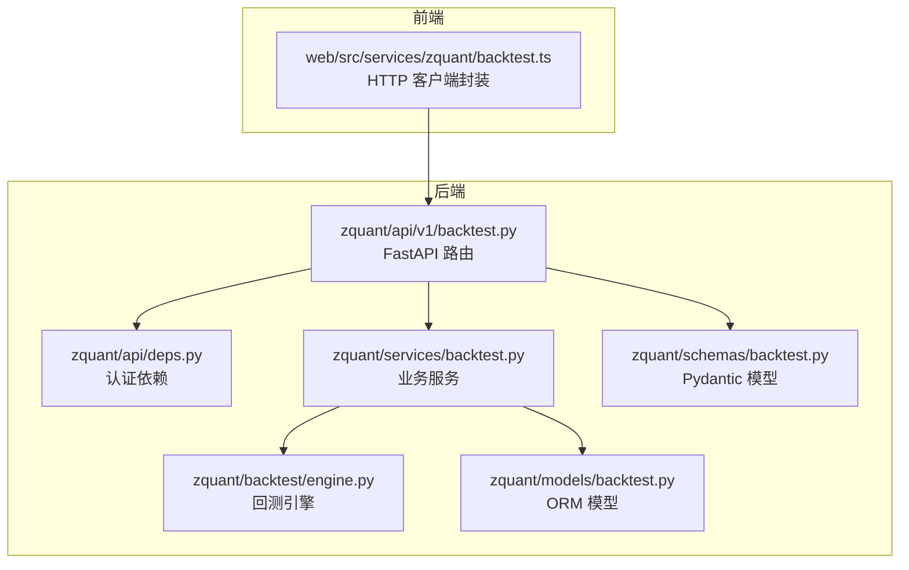
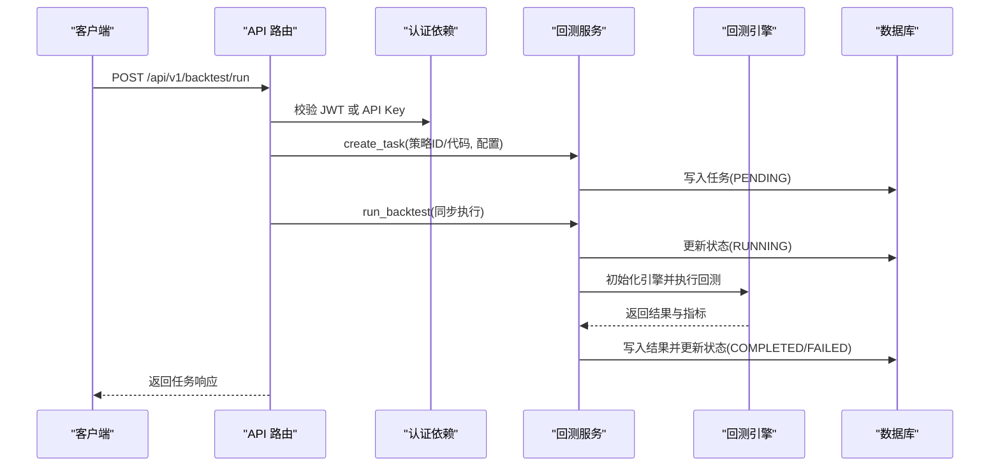
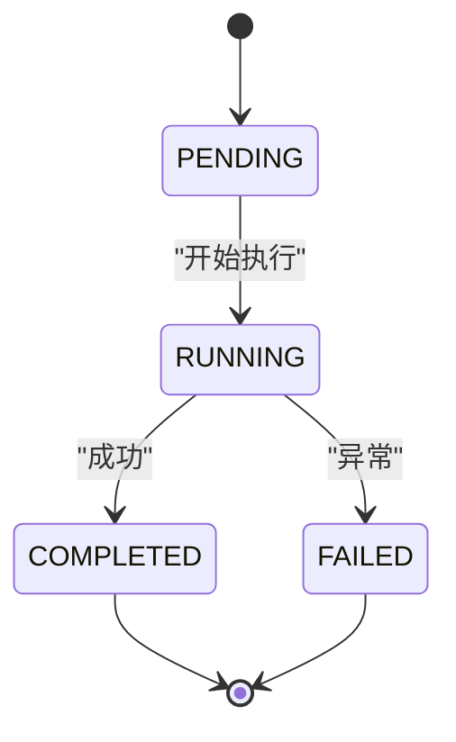
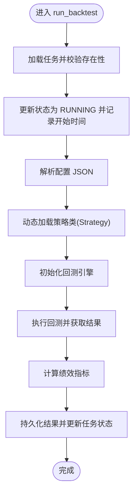
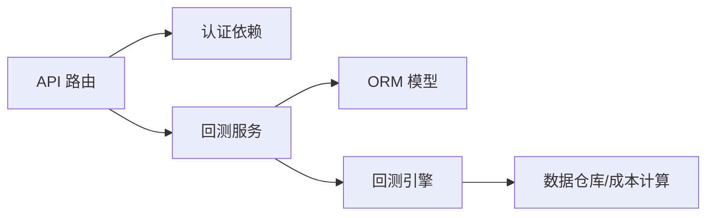

# 回测任务管理

<cite>
**本文引用的文件**
- [zquant/api/v1/backtest.py](file://zquant/api/v1/backtest.py)
- [zquant/schemas/backtest.py](file://zquant/schemas/backtest.py)
- [zquant/services/backtest.py](file://zquant/services/backtest.py)
- [zquant/models/backtest.py](file://zquant/models/backtest.py)
- [zquant/api/deps.py](file://zquant/api/deps.py)
- [web/src/services/zquant/backtest.ts](file://web/src/services/zquant/backtest.ts)
- [docs/api/api_reference.md](file://docs/api/api_reference.md)
- [zquant/backtest/engine.py](file://zquant/backtest/engine.py)
</cite>

## 目录
1. [简介](#简介)
2. [项目结构](#项目结构)
3. [核心组件](#核心组件)
4. [架构总览](#架构总览)
5. [详细组件分析](#详细组件分析)
6. [依赖关系分析](#依赖关系分析)
7. [性能与扩展性](#性能与扩展性)
8. [故障排查指南](#故障排查指南)
9. [结论](#结论)
10. [附录](#附录)

## 简介
本文件为 zquant 回测任务管理的权威技术文档，覆盖以下内容：
- 回测任务生命周期（PENDING、RUNNING、COMPLETED、FAILED）及状态转换机制
- 任务创建（策略来源：策略ID或直接代码）、配置参数与校验
- 任务列表的分页与排序（支持按ID、名称、状态、创建时间、更新时间排序）
- 查询单个任务、获取回测结果与绩效报告
- 从创建任务到获取任务状态的完整工作流示例
- 错误处理策略（如策略代码缺失、任务不存在等）
- HTTP 方法、请求/响应模型、认证方式与前端调用示例路径

## 项目结构
后端采用 FastAPI 构建，路由位于 API 层，业务逻辑在服务层，数据模型在 ORM 层；前端通过统一的服务封装发起请求。

图表来源
- [zquant/api/v1/backtest.py](file://zquant/api/v1/backtest.py#L90-L173)
- [zquant/api/deps.py](file://zquant/api/deps.py#L41-L93)
- [zquant/services/backtest.py](file://zquant/services/backtest.py#L43-L178)
- [zquant/backtest/engine.py](file://zquant/backtest/engine.py#L41-L120)
- [zquant/models/backtest.py](file://zquant/models/backtest.py#L38-L118)
- [zquant/schemas/backtest.py](file://zquant/schemas/backtest.py#L33-L152)
- [web/src/services/zquant/backtest.ts](file://web/src/services/zquant/backtest.ts#L27-L94)

章节来源
- [zquant/api/v1/backtest.py](file://zquant/api/v1/backtest.py#L90-L173)
- [zquant/api/deps.py](file://zquant/api/deps.py#L41-L93)
- [zquant/services/backtest.py](file://zquant/services/backtest.py#L43-L178)
- [zquant/models/backtest.py](file://zquant/models/backtest.py#L38-L118)
- [zquant/schemas/backtest.py](file://zquant/schemas/backtest.py#L33-L152)
- [web/src/services/zquant/backtest.ts](file://web/src/services/zquant/backtest.ts#L27-L94)

## 核心组件
- API 路由层：提供运行回测、获取任务列表、查询单个任务、获取结果与绩效报告等端点
- 服务层：负责任务创建、回测执行、结果持久化、排序分页、资源隔离与错误处理
- 模型层：定义回测任务、策略、结果的数据库表结构与枚举状态
- 模型层：定义回测配置、任务响应、结果响应、绩效响应等 Pydantic 模型
- 引擎层：执行回测流程，加载数据、生成订单、计算指标
- 认证依赖：支持 JWT Bearer 与 API Key 两种认证方式

章节来源
- [zquant/api/v1/backtest.py](file://zquant/api/v1/backtest.py#L90-L173)
- [zquant/services/backtest.py](file://zquant/services/backtest.py#L43-L178)
- [zquant/models/backtest.py](file://zquant/models/backtest.py#L38-L118)
- [zquant/schemas/backtest.py](file://zquant/schemas/backtest.py#L33-L152)
- [zquant/backtest/engine.py](file://zquant/backtest/engine.py#L41-L120)
- [zquant/api/deps.py](file://zquant/api/deps.py#L41-L93)

## 架构总览
下图展示从客户端到后端的调用链路与关键对象交互。

图表来源
- [zquant/api/v1/backtest.py](file://zquant/api/v1/backtest.py#L90-L173)
- [zquant/services/backtest.py](file://zquant/services/backtest.py#L101-L178)
- [zquant/backtest/engine.py](file://zquant/backtest/engine.py#L41-L120)
- [zquant/api/deps.py](file://zquant/api/deps.py#L41-L93)

## 详细组件分析

### 回测任务生命周期与状态转换
- 状态枚举：PENDING（等待中）、RUNNING（运行中）、COMPLETED（已完成）、FAILED（失败）、CANCELLED（已取消）
- 状态转换：
  - 创建任务：PENDING
  - 启动执行：RUNNING
  - 成功：COMPLETED（写入结果）
  - 失败：FAILED（记录错误信息）

图表来源
- [zquant/models/backtest.py](file://zquant/models/backtest.py#L38-L46)
- [zquant/services/backtest.py](file://zquant/services/backtest.py#L101-L178)

章节来源
- [zquant/models/backtest.py](file://zquant/models/backtest.py#L38-L46)
- [zquant/services/backtest.py](file://zquant/services/backtest.py#L101-L178)

### 任务创建与策略来源
- 支持两种策略来源：
  - 策略ID：从策略库加载策略代码（可为模板策略）
  - 直接提供策略代码字符串
- 必填参数：
  - 策略名称
  - 回测配置（开始/结束日期、初始资金、标的池、频率、滑点、手续费、印花税、基准、是否使用每日指标等）
- 校验规则：
  - 至少提供策略ID或策略代码之一
  - 若提供策略ID，需存在且可被当前用户使用（模板策略允许非创建者使用）

章节来源
- [zquant/api/v1/backtest.py](file://zquant/api/v1/backtest.py#L90-L121)
- [zquant/services/backtest.py](file://zquant/services/backtest.py#L43-L98)
- [zquant/schemas/backtest.py](file://zquant/schemas/backtest.py#L33-L58)

### 任务列表与排序分页
- 端点：GET /api/v1/backtest/tasks
- 支持参数：
  - skip、limit：分页
  - order_by：排序字段（id、name、status、created_at、updated_at）
  - order：asc/desc
- 资源隔离：仅返回当前用户的任务
- 排序逻辑：若传入非法字段，则按任务创建时间降序

章节来源
- [zquant/api/v1/backtest.py](file://zquant/api/v1/backtest.py#L123-L135)
- [zquant/services/backtest.py](file://zquant/services/backtest.py#L186-L214)

### 查询单个任务
- 端点：GET /api/v1/backtest/tasks/{task_id}
- 资源隔离：仅允许查询当前用户拥有的任务
- 响应：包含任务基本信息、状态、时间戳以及从配置中解析的起止日期

章节来源
- [zquant/api/v1/backtest.py](file://zquant/api/v1/backtest.py#L137-L146)
- [zquant/services/backtest.py](file://zquant/services/backtest.py#L180-L184)

### 获取回测结果与绩效报告
- 回测结果端点：GET /api/v1/backtest/tasks/{task_id}/result
- 绩效报告端点：GET /api/v1/backtest/tasks/{task_id}/performance
- 资源隔离：仅允许查询当前用户拥有的任务对应结果
- 绩效报告包含：
  - 指标：总收益、年化收益、最大回撤、夏普比率、胜率、盈亏比、Alpha、Beta
  - 交易记录
  - 投资组合（每日持仓）

章节来源
- [zquant/api/v1/backtest.py](file://zquant/api/v1/backtest.py#L148-L173)
- [zquant/services/backtest.py](file://zquant/services/backtest.py#L216-L223)

### 回测执行流程与引擎
- 服务层执行步骤：
  - 将任务状态置为 RUNNING，记录开始时间
  - 解析配置，动态加载策略类（要求策略类名为 Strategy）
  - 初始化回测引擎（成本、订单、数据加载、交易日历）
  - 执行回测，计算指标，持久化结果
  - 更新任务状态为 COMPLETED 或 FAILED，并记录错误信息
- 引擎职责：
  - 数据加载（日线、每日指标）
  - 订单生成与成交模拟
  - 指标计算与结果汇总

图表来源
- [zquant/services/backtest.py](file://zquant/services/backtest.py#L101-L178)
- [zquant/backtest/engine.py](file://zquant/backtest/engine.py#L41-L120)

章节来源
- [zquant/services/backtest.py](file://zquant/services/backtest.py#L101-L178)
- [zquant/backtest/engine.py](file://zquant/backtest/engine.py#L41-L120)

### 错误处理策略
- 策略来源缺失：当未提供策略ID且未提供策略代码时，抛出 400 错误
- 任务不存在：查询任务或结果时若资源不属于当前用户，返回 404
- 回测执行异常：捕获异常并记录到任务错误信息，状态置为 FAILED
- 认证失败：JWT 或 API Key 校验失败返回 401；数据库未初始化返回 503

章节来源
- [zquant/services/backtest.py](file://zquant/services/backtest.py#L80-L98)
- [zquant/api/v1/backtest.py](file://zquant/api/v1/backtest.py#L137-L156)
- [zquant/api/deps.py](file://zquant/api/deps.py#L41-L93)

### HTTP 接口定义与认证
- 认证方式
  - JWT Bearer：Authorization: Bearer <token>
  - API Key：X-API-Key、X-API-Secret
- 常用端点
  - POST /api/v1/backtest/run：运行回测（创建任务并执行）
  - GET /api/v1/backtest/tasks：获取任务列表（支持分页与排序）
  - GET /api/v1/backtest/tasks/{task_id}：获取单个任务
  - GET /api/v1/backtest/tasks/{task_id}/result：获取回测结果
  - GET /api/v1/backtest/tasks/{task_id}/performance：获取绩效报告

章节来源
- [docs/api/api_reference.md](file://docs/api/api_reference.md#L305-L368)
- [zquant/api/deps.py](file://zquant/api/deps.py#L41-L93)
- [zquant/api/v1/backtest.py](file://zquant/api/v1/backtest.py#L90-L173)

### 请求/响应模型
- 回测配置（BacktestConfig）
  - 字段：start_date、end_date、initial_capital、symbols、frequency、adjust_type、commission_rate、min_commission、tax_rate、slippage_rate、benchmark、use_daily_basic
- 运行回测请求（BacktestRunRequest）
  - 字段：strategy_id、strategy_code、strategy_name、config
- 任务响应（BacktestTaskResponse）
  - 字段：id、user_id、strategy_name、status、error_message、created_at、started_at、completed_at、start_date、end_date
- 结果响应（BacktestResultResponse）
  - 字段：id、task_id、total_return、annual_return、max_drawdown、sharpe_ratio、win_rate、profit_loss_ratio、alpha、beta、metrics_json、trades_json、portfolio_json、created_at
- 绩效响应（PerformanceResponse）
  - 字段：metrics、trades、portfolio

章节来源
- [zquant/schemas/backtest.py](file://zquant/schemas/backtest.py#L33-L152)

### 前端调用示例路径
- 运行回测：POST /api/v1/backtest/run
- 获取任务列表：GET /api/v1/backtest/tasks
- 获取单个任务：GET /api/v1/backtest/tasks/{task_id}
- 获取回测结果：GET /api/v1/backtest/tasks/{task_id}/result
- 获取绩效报告：GET /api/v1/backtest/tasks/{task_id}/performance
- 获取策略框架代码：GET /api/v1/backtest/strategies/framework

章节来源
- [web/src/services/zquant/backtest.ts](file://web/src/services/zquant/backtest.ts#L27-L94)

## 依赖关系分析
- API 路由依赖认证依赖注入，确保每个请求均绑定当前活跃用户
- 服务层依赖 ORM 模型与回测引擎，负责业务编排与数据持久化
- 引擎层依赖数据仓库与成本计算器，负责数据加载与交易模拟

图表来源
- [zquant/api/v1/backtest.py](file://zquant/api/v1/backtest.py#L90-L173)
- [zquant/api/deps.py](file://zquant/api/deps.py#L41-L93)
- [zquant/services/backtest.py](file://zquant/services/backtest.py#L43-L178)
- [zquant/backtest/engine.py](file://zquant/backtest/engine.py#L41-L120)

章节来源
- [zquant/api/v1/backtest.py](file://zquant/api/v1/backtest.py#L90-L173)
- [zquant/api/deps.py](file://zquant/api/deps.py#L41-L93)
- [zquant/services/backtest.py](file://zquant/services/backtest.py#L43-L178)
- [zquant/backtest/engine.py](file://zquant/backtest/engine.py#L41-L120)

## 性能与扩展性
- 排序与分页：服务层对任务与结果列表实现 SQL 层排序与分页，避免一次性加载全部数据
- 引擎数据加载：批量加载日线与每日指标，减少多次查询开销
- 异步执行：当前路由为同步执行，生产环境建议改为异步队列（如 Celery）以提升吞吐与稳定性
- 缓存与索引：模型中对常用查询字段建立索引，有助于排序与过滤性能

章节来源
- [zquant/services/backtest.py](file://zquant/services/backtest.py#L186-L257)
- [zquant/models/backtest.py](file://zquant/models/backtest.py#L53-L64)

## 故障排查指南
- 400 参数错误
  - 策略来源缺失：未提供 strategy_id 且未提供 strategy_code
  - 策略类缺失：策略代码中未定义 Strategy 类
- 401 认证失败
  - JWT 无效或过期
  - API Key 缺失或错误
- 403 用户被禁用
- 404 资源不存在
  - 任务或结果不存在
  - 策略不存在或不可用（非本人且非模板）
- 500 服务器错误
  - 回测执行异常，查看任务 error_message 字段
  - 数据库未初始化，按提示运行初始化脚本

章节来源
- [zquant/services/backtest.py](file://zquant/services/backtest.py#L80-L98)
- [zquant/api/v1/backtest.py](file://zquant/api/v1/backtest.py#L137-L156)
- [zquant/api/deps.py](file://zquant/api/deps.py#L41-L93)

## 结论
本文件系统梳理了 zquant 回测任务管理的端点、模型、生命周期与执行流程，明确了认证方式、错误处理与前后端调用路径。建议在生产环境中引入异步执行与更完善的监控告警体系，以进一步提升稳定性与可观测性。

## 附录

### 完整工作流示例（从创建到获取状态）
- 步骤
  1) 前端调用 POST /api/v1/backtest/run，携带策略代码与回测配置
  2) 后端创建任务并置为 PENDING，随后同步执行 run_backtest
  3) 服务层将任务置为 RUNNING，执行引擎回测并计算指标
  4) 成功则置为 COMPLETED 并持久化结果；失败则置为 FAILED 并记录错误
  5) 前端轮询或拉取 GET /api/v1/backtest/tasks/{task_id} 获取最新状态
  6) 需要详细报告时调用 GET /api/v1/backtest/tasks/{task_id}/performance

章节来源
- [zquant/api/v1/backtest.py](file://zquant/api/v1/backtest.py#L90-L173)
- [zquant/services/backtest.py](file://zquant/services/backtest.py#L101-L178)
- [web/src/services/zquant/backtest.ts](file://web/src/services/zquant/backtest.ts#L27-L94)