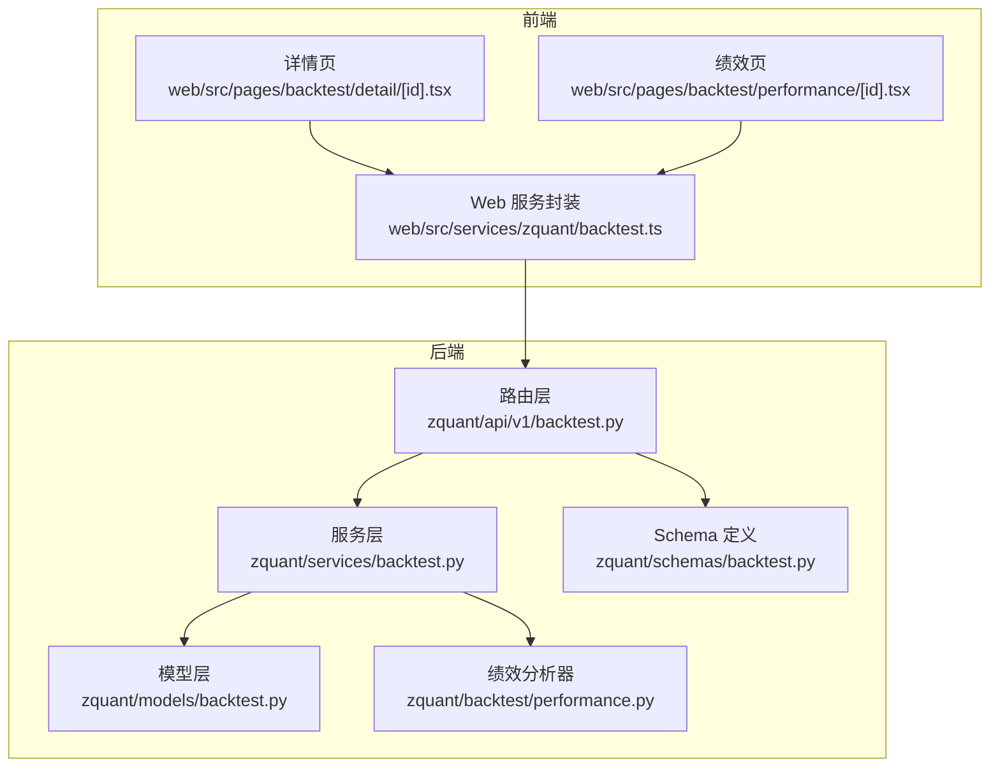
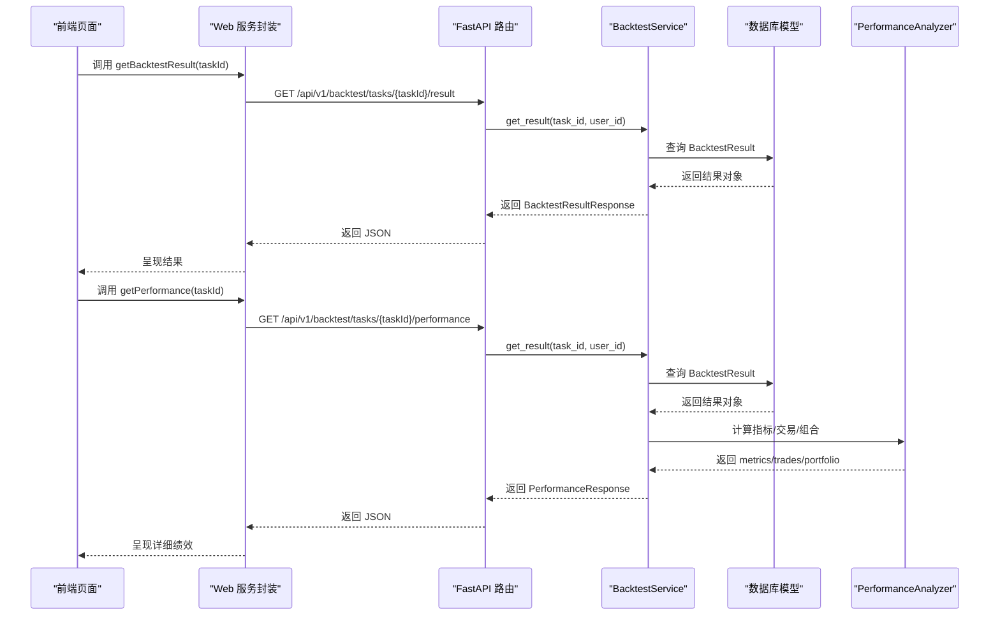
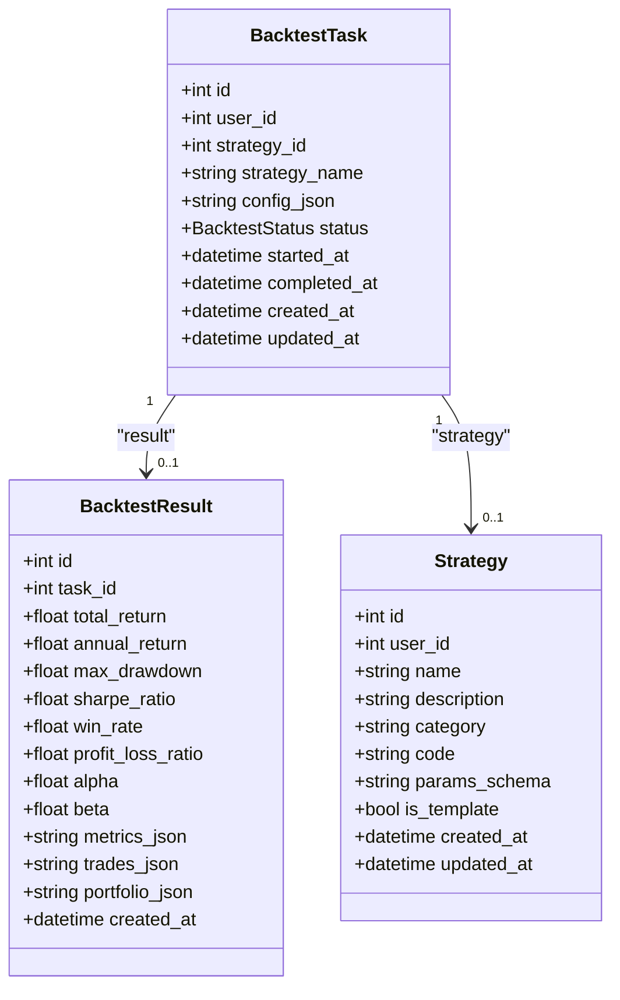

# 回测结果管理

<cite>
**本文引用的文件**
- [zquant/api/v1/backtest.py](file://zquant/api/v1/backtest.py)
- [zquant/services/backtest.py](file://zquant/services/backtest.py)
- [zquant/models/backtest.py](file://zquant/models/backtest.py)
- [zquant/schemas/backtest.py](file://zquant/schemas/backtest.py)
- [zquant/backtest/performance.py](file://zquant/backtest/performance.py)
- [web/src/services/zquant/backtest.ts](file://web/src/services/zquant/backtest.ts)
- [web/src/pages/backtest/detail/[id].tsx](file://web/src/pages/backtest/detail/[id].tsx)
- [web/src/pages/backtest/performance/[id].tsx](file://web/src/pages/backtest/performance/[id].tsx)
</cite>

## 目录
1. [简介](#简介)
2. [项目结构](#项目结构)
3. [核心组件](#核心组件)
4. [架构总览](#架构总览)
5. [详细组件分析](#详细组件分析)
6. [依赖关系分析](#依赖关系分析)
7. [性能与排序特性](#性能与排序特性)
8. [故障排查指南](#故障排查指南)
9. [结论](#结论)
10. [附录](#附录)

## 简介
本文件为 zquant 回测结果管理 API 的权威文档，覆盖以下主题：
- 获取回测结果与绩效报告接口
- 回测结果的 JSON 存储结构（指标、交易记录、投资组合）
- 绩效指标的计算方法与业务逻辑
- 结果列表的分页与排序能力
- 删除结果时的级联删除行为（同时删除关联回测任务）
- 前后端调用示例路径与常见问题处理

## 项目结构
围绕回测结果管理，后端由 FastAPI 路由层、服务层与 ORM 模型组成；前端通过服务封装调用后端接口。

图表来源
- [zquant/api/v1/backtest.py](file://zquant/api/v1/backtest.py#L1-L424)
- [zquant/services/backtest.py](file://zquant/services/backtest.py#L1-L278)
- [zquant/models/backtest.py](file://zquant/models/backtest.py#L1-L119)
- [zquant/backtest/performance.py](file://zquant/backtest/performance.py#L1-L330)
- [zquant/schemas/backtest.py](file://zquant/schemas/backtest.py#L1-L152)
- [web/src/services/zquant/backtest.ts](file://web/src/services/zquant/backtest.ts#L1-L211)
- [web/src/pages/backtest/detail/[id].tsx](file://web/src/pages/backtest/detail/[id].tsx#L1-L209)
- [web/src/pages/backtest/performance/[id].tsx](file://web/src/pages/backtest/performance/[id].tsx#L1-L82)

章节来源
- [zquant/api/v1/backtest.py](file://zquant/api/v1/backtest.py#L1-L424)
- [zquant/services/backtest.py](file://zquant/services/backtest.py#L1-L278)
- [zquant/models/backtest.py](file://zquant/models/backtest.py#L1-L119)
- [zquant/backtest/performance.py](file://zquant/backtest/performance.py#L1-L330)
- [zquant/schemas/backtest.py](file://zquant/schemas/backtest.py#L1-L152)
- [web/src/services/zquant/backtest.ts](file://web/src/services/zquant/backtest.ts#L1-L211)
- [web/src/pages/backtest/detail/[id].tsx](file://web/src/pages/backtest/detail/[id].tsx#L1-L209)
- [web/src/pages/backtest/performance/[id].tsx](file://web/src/pages/backtest/performance/[id].tsx#L1-L82)

## 核心组件
- 路由层（FastAPI）：提供“获取回测结果”“获取绩效报告”“获取结果列表”“删除结果”等端点。
- 服务层：负责任务与结果的创建、运行、查询、删除，以及排序与分页。
- 模型层：定义回测任务、策略、结果的数据库表结构及关系。
- Schema 层：定义请求/响应的数据结构。
- 绩效分析器：计算总收益、年化收益、最大回撤、夏普比率、胜率、盈亏比、Alpha、Beta 等指标。
- 前端服务封装与页面：调用后端接口并展示结果。

章节来源
- [zquant/api/v1/backtest.py](file://zquant/api/v1/backtest.py#L123-L173)
- [zquant/services/backtest.py](file://zquant/services/backtest.py#L180-L278)
- [zquant/models/backtest.py](file://zquant/models/backtest.py#L48-L119)
- [zquant/schemas/backtest.py](file://zquant/schemas/backtest.py#L33-L152)
- [zquant/backtest/performance.py](file://zquant/backtest/performance.py#L50-L120)

## 架构总览
后端采用“路由层-服务层-模型层”的分层设计，路由层负责参数校验与响应模型转换，服务层负责业务逻辑与数据库交互，模型层负责持久化与关系映射。前端通过服务封装统一调用后端接口。

图表来源
- [zquant/api/v1/backtest.py](file://zquant/api/v1/backtest.py#L148-L173)
- [zquant/services/backtest.py](file://zquant/services/backtest.py#L216-L258)
- [zquant/backtest/performance.py](file://zquant/backtest/performance.py#L50-L120)
- [web/src/services/zquant/backtest.ts](file://web/src/services/zquant/backtest.ts#L70-L94)

## 详细组件分析

### API 端点与控制流
- 获取回测结果
  - 方法：GET /api/v1/backtest/tasks/{taskId}/result
  - 行为：根据 taskId 与当前用户隔离查询回测结果；若不存在返回 404。
  - 响应：BacktestResultResponse（包含核心指标与 JSON 字段）。
- 获取绩效报告
  - 方法：GET /api/v1/backtest/tasks/{taskId}/performance
  - 行为：解析 metrics_json/trades_json/portfolio_json 为结构化对象返回。
  - 响应：PerformanceResponse（metrics/trades/portfolio）。
- 获取结果列表
  - 方法：GET /api/v1/backtest/results
  - 行为：按用户过滤，支持按 id、task_id、total_return、annual_return、sharpe_ratio、created_at 排序，支持分页。
  - 响应：BacktestResultResponse 数组。
- 删除回测结果
  - 方法：DELETE /api/v1/backtest/results/{result_id}
  - 行为：级联删除对应回测任务（模型层定义了级联删除），同时删除结果。
  - 响应：204 No Content；若不存在返回 404。

章节来源
- [zquant/api/v1/backtest.py](file://zquant/api/v1/backtest.py#L148-L173)
- [zquant/api/v1/backtest.py](file://zquant/api/v1/backtest.py#L400-L423)
- [zquant/services/backtest.py](file://zquant/services/backtest.py#L226-L278)
- [zquant/models/backtest.py](file://zquant/models/backtest.py#L66-L70)

### 回测结果 JSON 存储结构
- 核心指标（数值型）
  - total_return：累计收益率
  - annual_return：年化收益率
  - max_drawdown：最大回撤
  - sharpe_ratio：夏普比率
  - win_rate：胜率
  - profit_loss_ratio：盈亏比
  - alpha：Alpha（超额收益）
  - beta：Beta（市场敏感度）
- JSON 字段
  - metrics_json：详细指标字典（由绩效分析器生成）
  - trades_json：交易记录数组（所有成交订单）
  - portfolio_json：每日投资组合（持仓变化、现金、总值等）

章节来源
- [zquant/schemas/backtest.py](file://zquant/schemas/backtest.py#L77-L106)
- [zquant/models/backtest.py](file://zquant/models/backtest.py#L100-L118)
- [zquant/services/backtest.py](file://zquant/services/backtest.py#L129-L142)

### 绩效指标计算方法与业务逻辑
- 总收益：最终净值/初始净值 - 1
- 年化收益：基于交易日数量推导年化复合收益
- 最大回撤：净值序列的回撤最小值的绝对值
- 波动率：日收益率标准差 × sqrt(252)
- 夏普比率：(年化收益 - 无风险利率)/年化波动率
- Alpha/Beta：与基准序列回归得到的超额收益与市场敏感度
- 胜率：按交易对（买入+卖出）计算盈利交易占比
- 盈亏比：平均盈利/平均亏损

章节来源
- [zquant/backtest/performance.py](file://zquant/backtest/performance.py#L50-L120)
- [zquant/backtest/performance.py](file://zquant/backtest/performance.py#L154-L218)
- [zquant/backtest/performance.py](file://zquant/backtest/performance.py#L219-L258)
- [zquant/backtest/performance.py](file://zquant/backtest/performance.py#L259-L330)

### 结果列表的分页与排序
- 分页参数
  - skip：偏移量（>=0）
  - limit：每页条数（1..1000）
- 排序字段
  - 支持字段：id、task_id、total_return、annual_return、sharpe_ratio、created_at
  - 默认按 created_at 降序
- 查询范围
  - 仅返回当前用户所属的任务产生的结果

章节来源
- [zquant/api/v1/backtest.py](file://zquant/api/v1/backtest.py#L400-L413)
- [zquant/services/backtest.py](file://zquant/services/backtest.py#L226-L258)

### 删除结果的级联删除行为
- 删除回测结果时，服务层先验证结果存在且归属当前用户，再删除对应回测任务。
- 模型层定义了任务到结果的“级联删除”关系，因此删除任务会同时删除结果。
- 删除成功返回 204；不存在返回 404。

章节来源
- [zquant/api/v1/backtest.py](file://zquant/api/v1/backtest.py#L416-L423)
- [zquant/services/backtest.py](file://zquant/services/backtest.py#L259-L278)
- [zquant/models/backtest.py](file://zquant/models/backtest.py#L66-L70)

### 前后端调用示例与页面展示
- 前端服务封装
  - 运行回测：POST /api/v1/backtest/run
  - 获取任务列表：GET /api/v1/backtest/tasks
  - 获取任务详情：GET /api/v1/backtest/tasks/{taskId}
  - 获取回测结果：GET /api/v1/backtest/tasks/{taskId}/result
  - 获取绩效报告：GET /api/v1/backtest/tasks/{taskId}/performance
- 页面展示
  - 详情页：展示任务状态、回测日期、执行时间、核心指标与详细绩效（metrics/trades/portfolio）
  - 绩效页：单独展示指标、交易与投资组合

章节来源
- [web/src/services/zquant/backtest.ts](file://web/src/services/zquant/backtest.ts#L27-L94)
- [web/src/pages/backtest/detail/[id].tsx](file://web/src/pages/backtest/detail/[id].tsx#L1-L209)
- [web/src/pages/backtest/performance/[id].tsx](file://web/src/pages/backtest/performance/[id].tsx#L1-L82)

## 依赖关系分析

图表来源
- [zquant/models/backtest.py](file://zquant/models/backtest.py#L48-L119)

章节来源
- [zquant/models/backtest.py](file://zquant/models/backtest.py#L48-L119)

## 性能与排序特性
- 排序字段与默认顺序
  - 结果列表支持按 id、task_id、total_return、annual_return、sharpe_ratio、created_at 排序，默认按 created_at 降序。
- 分页参数
  - skip 与 limit 控制分页范围，限制每页最大 1000 条。
- 数据库查询优化
  - 服务层使用子查询获取用户任务 ID，再过滤结果，避免 N+1 查询。
  - 使用 SQLAlchemy 的 order_by/offset/limit 实现分页与排序。

章节来源
- [zquant/api/v1/backtest.py](file://zquant/api/v1/backtest.py#L400-L413)
- [zquant/services/backtest.py](file://zquant/services/backtest.py#L226-L258)

## 故障排查指南
- 结果不存在
  - 现象：访问 /tasks/{taskId}/result 或 /tasks/{taskId}/performance 返回 404。
  - 可能原因：任务不存在、任务不属于当前用户、回测尚未生成结果。
  - 处理建议：确认 taskId 正确、检查任务状态是否为 completed、确认回测已成功运行。
- 任务未完成
  - 现象：任务状态为 pending/running/failed。
  - 处理建议：等待任务完成或查看错误信息；必要时重试运行。
- 删除失败
  - 现象：删除 /results/{result_id} 返回 404。
  - 可能原因：result_id 不存在或不属于当前用户。
  - 处理建议：确认结果存在且归属当前用户；检查级联删除是否生效（模型层已定义级联）。
- 前端调用异常
  - 现象：页面加载失败或提示“加载失败”。
  - 处理建议：检查网络请求、确认接口路径与参数正确；查看后端日志定位异常。

章节来源
- [zquant/api/v1/backtest.py](file://zquant/api/v1/backtest.py#L148-L173)
- [zquant/api/v1/backtest.py](file://zquant/api/v1/backtest.py#L416-L423)
- [web/src/pages/backtest/detail/[id].tsx](file://web/src/pages/backtest/detail/[id].tsx#L37-L68)

## 结论
本文件系统性梳理了 zquant 回测结果管理 API 的端点、数据结构、计算逻辑与前后端集成方式。通过明确的 JSON 存储结构与完善的排序/分页机制，用户可以高效地查询、分析与管理回测结果；通过级联删除保障数据一致性。建议在生产环境中结合异步任务与缓存策略进一步提升性能与用户体验。

## 附录

### API 定义速查
- 获取回测结果
  - 方法：GET /api/v1/backtest/tasks/{taskId}/result
  - 响应：BacktestResultResponse
- 获取绩效报告
  - 方法：GET /api/v1/backtest/tasks/{taskId}/performance
  - 响应：PerformanceResponse
- 获取结果列表
  - 方法：GET /api/v1/backtest/results
  - 参数：skip、limit、order_by、order
  - 响应：BacktestResultResponse[]
- 删除回测结果
  - 方法：DELETE /api/v1/backtest/results/{result_id}
  - 响应：204 No Content

章节来源
- [zquant/api/v1/backtest.py](file://zquant/api/v1/backtest.py#L148-L173)
- [zquant/api/v1/backtest.py](file://zquant/api/v1/backtest.py#L400-L423)