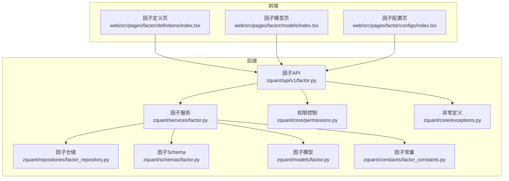
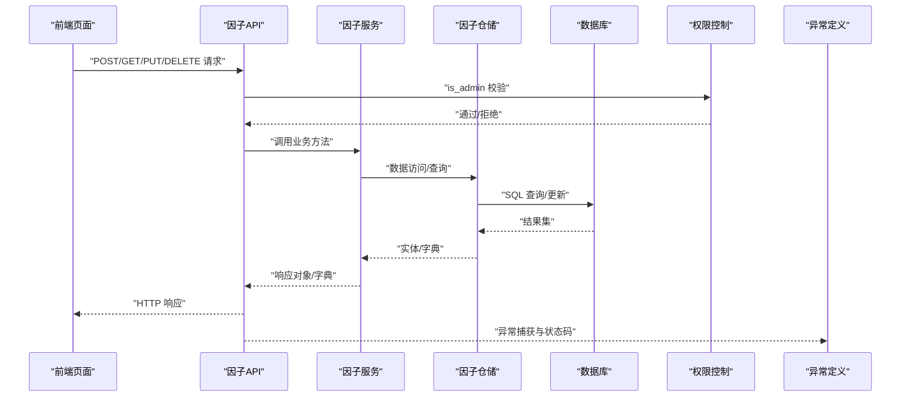
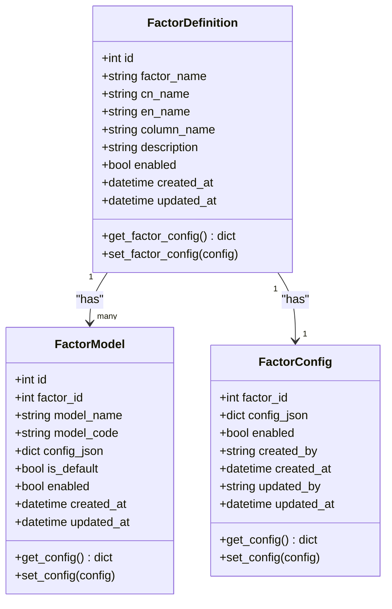
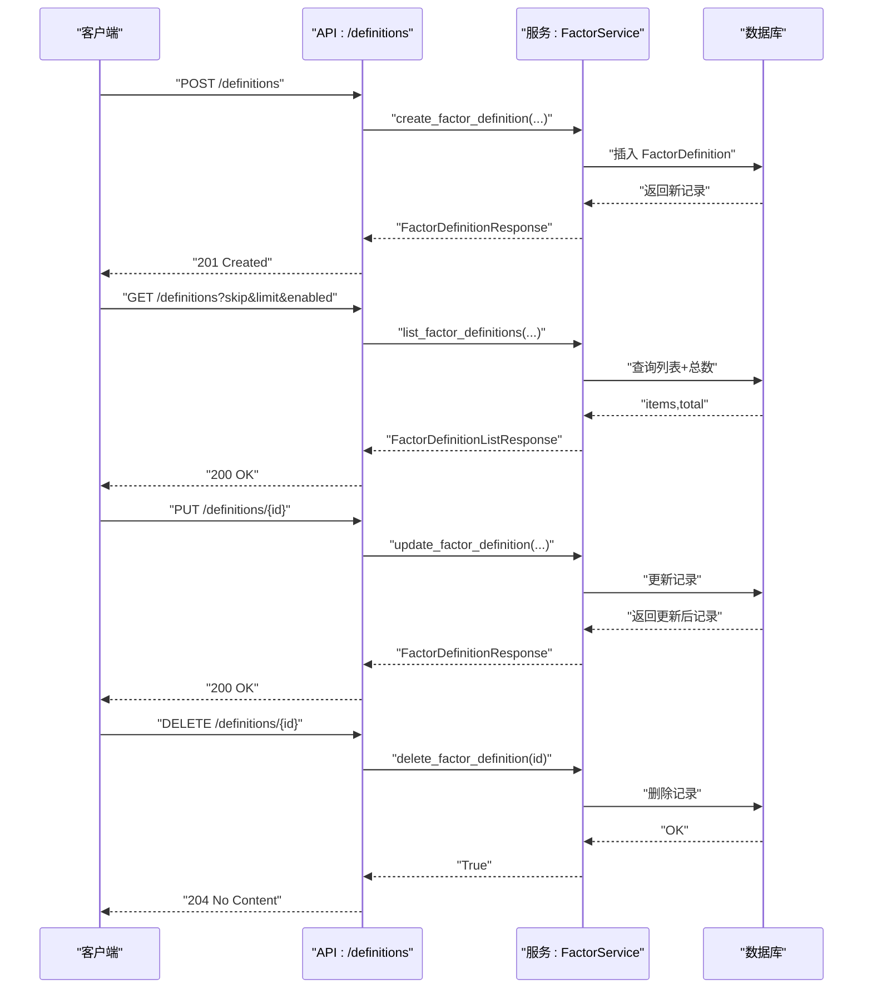
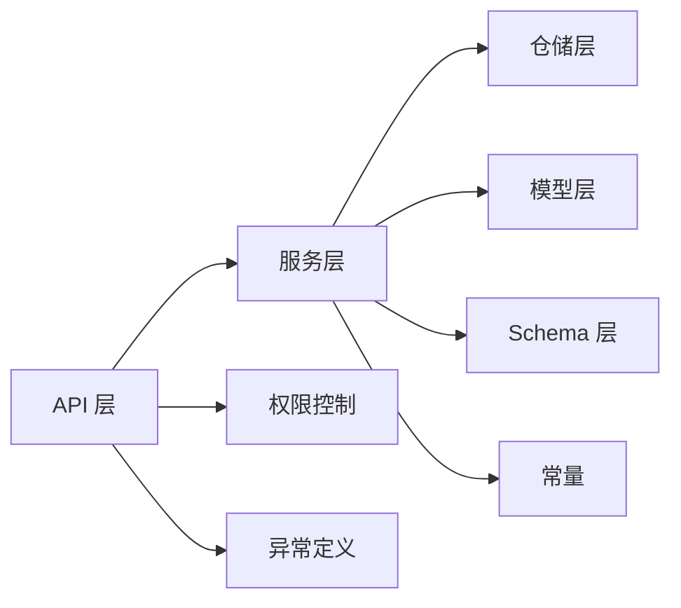

# 因子定义管理

<cite>
**本文引用的文件**
- [zquant/models/factor.py](file://zquant/models/factor.py)
- [zquant/schemas/factor.py](file://zquant/schemas/factor.py)
- [zquant/repositories/factor_repository.py](file://zquant/repositories/factor_repository.py)
- [zquant/services/factor.py](file://zquant/services/factor.py)
- [zquant/api/v1/factor.py](file://zquant/api/v1/factor.py)
- [zquant/core/permissions.py](file://zquant/core/permissions.py)
- [zquant/core/exceptions.py](file://zquant/core/exceptions.py)
- [zquant/constants/factor_constants.py](file://zquant/constants/factor_constants.py)
- [docs/factor_management.md](file://docs/factor_management.md)
- [web/src/pages/factor/definitions/index.tsx](file://web/src/pages/factor/definitions/index.tsx)
- [web/src/pages/factor/models/index.tsx](file://web/src/pages/factor/models/index.tsx)
- [web/src/pages/factor/configs/index.tsx](file://web/src/pages/factor/configs/index.tsx)
</cite>

## 目录
1. [简介](#简介)
2. [项目结构](#项目结构)
3. [核心组件](#核心组件)
4. [架构总览](#架构总览)
5. [详细组件分析](#详细组件分析)
6. [依赖关系分析](#依赖关系分析)
7. [性能考量](#性能考量)
8. [故障排查指南](#故障排查指南)
9. [结论](#结论)
10. [附录](#附录)

## 简介
本文件为“因子定义管理”的权威文档，面向开发者与运维人员，系统阐述因子定义的CRUD能力、模型字段语义、权限控制与错误处理策略，并提供最佳实践与使用示例。文档同时覆盖前端页面与后端API的交互方式，帮助快速落地与扩展。

## 项目结构
围绕因子定义管理的关键代码分布在以下层次：
- 数据模型层：定义因子定义、模型、配置的数据库表结构与关系
- Pydantic Schema 层：定义API请求/响应的结构与校验
- 仓储层：封装数据访问与查询
- 服务层：业务编排与规则校验
- API 层：RESTful 接口暴露与权限控制
- 前端页面：因子定义、模型、配置的可视化管理界面

图表来源
- [zquant/api/v1/factor.py](file://zquant/api/v1/factor.py#L66-L176)
- [zquant/services/factor.py](file://zquant/services/factor.py#L43-L188)
- [zquant/repositories/factor_repository.py](file://zquant/repositories/factor_repository.py#L50-L117)
- [zquant/schemas/factor.py](file://zquant/schemas/factor.py#L33-L110)
- [zquant/models/factor.py](file://zquant/models/factor.py#L35-L110)
- [zquant/core/permissions.py](file://zquant/core/permissions.py#L102-L111)
- [zquant/core/exceptions.py](file://zquant/core/exceptions.py#L28-L54)
- [zquant/constants/factor_constants.py](file://zquant/constants/factor_constants.py#L27-L33)
- [web/src/pages/factor/definitions/index.tsx](file://web/src/pages/factor/definitions/index.tsx#L1-L236)
- [web/src/pages/factor/models/index.tsx](file://web/src/pages/factor/models/index.tsx#L1-L251)
- [web/src/pages/factor/configs/index.tsx](file://web/src/pages/factor/configs/index.tsx#L1-L507)

章节来源
- [zquant/api/v1/factor.py](file://zquant/api/v1/factor.py#L66-L176)
- [zquant/services/factor.py](file://zquant/services/factor.py#L43-L188)
- [zquant/repositories/factor_repository.py](file://zquant/repositories/factor_repository.py#L50-L117)
- [zquant/schemas/factor.py](file://zquant/schemas/factor.py#L33-L110)
- [zquant/models/factor.py](file://zquant/models/factor.py#L35-L110)
- [zquant/core/permissions.py](file://zquant/core/permissions.py#L102-L111)
- [zquant/core/exceptions.py](file://zquant/core/exceptions.py#L28-L54)
- [zquant/constants/factor_constants.py](file://zquant/constants/factor_constants.py#L27-L33)
- [web/src/pages/factor/definitions/index.tsx](file://web/src/pages/factor/definitions/index.tsx#L1-L236)
- [web/src/pages/factor/models/index.tsx](file://web/src/pages/factor/models/index.tsx#L1-L251)
- [web/src/pages/factor/configs/index.tsx](file://web/src/pages/factor/configs/index.tsx#L1-L507)

## 核心组件
- 因子定义模型（FactorDefinition）
  - 字段：id、factor_name（唯一）、cn_name、en_name、column_name、description、enabled、created_at、updated_at
  - 关系：一对多（models）、一对一（config）
- 因子模型（FactorModel）
  - 字段：id、factor_id、model_name、model_code、config_json、is_default、enabled、created_at、updated_at
  - 关系：反向关联 FactorDefinition
- 因子配置（FactorConfig）
  - 字段：factor_id（主键）、config_json（JSON，包含 enabled 与 mappings）、enabled、created_by、created_at、updated_by、updated_at
  - 关系：反向关联 FactorDefinition
- Schema（请求/响应）
  - 因子定义：创建/更新/响应结构
  - 因子模型：创建/更新/响应结构
  - 因子配置：创建/更新/响应结构（含 mappings 列表）
- 服务层（FactorService）
  - 因子定义 CRUD、列表与排序、配置更新
  - 因子模型 CRUD、默认模型管理
  - 因子配置 CRUD（新表结构）与旧表兼容
- API 层（/api/v1/factor）
  - 因子定义：POST/GET/PUT/DELETE
  - 因子模型：POST/GET/PUT/DELETE
  - 因子配置：POST/GET/PUT/DELETE（新表结构）
  - 权限：is_admin 控制
  - 错误处理：HTTP 状态码与错误信息
- 前端页面
  - 因子定义页：列表、创建/更新弹窗、删除确认
  - 因子模型页：列表、创建/更新弹窗、删除确认
  - 因子配置页：按因子聚合展示、映射编辑、默认模型提示

章节来源
- [zquant/models/factor.py](file://zquant/models/factor.py#L35-L110)
- [zquant/schemas/factor.py](file://zquant/schemas/factor.py#L33-L110)
- [zquant/services/factor.py](file://zquant/services/factor.py#L43-L188)
- [zquant/api/v1/factor.py](file://zquant/api/v1/factor.py#L66-L176)
- [web/src/pages/factor/definitions/index.tsx](file://web/src/pages/factor/definitions/index.tsx#L1-L236)
- [web/src/pages/factor/models/index.tsx](file://web/src/pages/factor/models/index.tsx#L1-L251)
- [web/src/pages/factor/configs/index.tsx](file://web/src/pages/factor/configs/index.tsx#L1-L507)

## 架构总览
下图展示了因子定义管理从API到服务、仓储与模型的调用链路，以及权限与异常处理位置。

图表来源
- [zquant/api/v1/factor.py](file://zquant/api/v1/factor.py#L66-L176)
- [zquant/services/factor.py](file://zquant/services/factor.py#L43-L188)
- [zquant/repositories/factor_repository.py](file://zquant/repositories/factor_repository.py#L50-L117)
- [zquant/core/permissions.py](file://zquant/core/permissions.py#L102-L111)
- [zquant/core/exceptions.py](file://zquant/core/exceptions.py#L28-L54)

## 详细组件分析

### 因子定义模型与字段语义
- 字段含义
  - factor_name：因子唯一标识，用于区分不同因子
  - cn_name/en_name：中文/英文简称，便于展示与国际化
  - column_name：因子表数据列名，决定结果表中的列名
  - description：因子描述
  - enabled：是否启用，影响查询与计算
  - created_at/updated_at：时间戳
- 关系
  - models：一对多，因子下的多个模型
  - config：一对一，因子的配置（JSON）
- 配置管理
  - set_factor_config：校验 mappings 结构，支持 model_id 与 codes 列表
  - get_factor_config：返回包含 enabled 与 mappings 的字典

图表来源
- [zquant/models/factor.py](file://zquant/models/factor.py#L35-L110)
- [zquant/models/factor.py](file://zquant/models/factor.py#L111-L171)
- [zquant/models/factor.py](file://zquant/models/factor.py#L147-L222)

章节来源
- [zquant/models/factor.py](file://zquant/models/factor.py#L35-L110)
- [zquant/models/factor.py](file://zquant/models/factor.py#L111-L171)
- [zquant/models/factor.py](file://zquant/models/factor.py#L147-L222)

### 因子定义 CRUD API
- 创建因子定义
  - 端点：POST /api/v1/factor/definitions
  - 权限：管理员
  - 请求体：包含 factor_name、cn_name、en_name、column_name、description、enabled、factor_config
  - 响应：FactorDefinitionResponse
- 查询因子定义列表
  - 端点：GET /api/v1/factor/definitions
  - 参数：skip、limit、enabled、order_by、order
  - 响应：FactorDefinitionListResponse
- 获取因子定义详情
  - 端点：GET /api/v1/factor/definitions/{factor_id}
  - 响应：FactorDefinitionResponse
- 更新因子定义
  - 端点：PUT /api/v1/factor/definitions/{factor_id}
  - 权限：管理员
  - 请求体：可选字段 cn_name、en_name、column_name、description、enabled、factor_config
  - 响应：FactorDefinitionResponse
- 删除因子定义
  - 端点：DELETE /api/v1/factor/definitions/{factor_id}
  - 权限：管理员
  - 响应：204 No Content

图表来源
- [zquant/api/v1/factor.py](file://zquant/api/v1/factor.py#L68-L176)
- [zquant/services/factor.py](file://zquant/services/factor.py#L43-L188)

章节来源
- [zquant/api/v1/factor.py](file://zquant/api/v1/factor.py#L68-L176)
- [zquant/services/factor.py](file://zquant/services/factor.py#L43-L188)

### 因子模型 CRUD API
- 创建因子模型
  - 端点：POST /api/v1/factor/models
  - 权限：管理员
  - 请求体：factor_id、model_name、model_code、config_json、is_default、enabled
  - 响应：FactorModelResponse
- 查询因子模型列表
  - 端点：GET /api/v1/factor/models
  - 参数：factor_id、skip、limit、enabled、order_by、order
  - 响应：FactorModelListResponse
- 获取因子模型详情
  - 端点：GET /api/v1/factor/models/{model_id}
  - 响应：FactorModelResponse
- 更新因子模型
  - 端点：PUT /api/v1/factor/models/{model_id}
  - 权限：管理员
  - 请求体：可选字段 model_name、model_code、config_json、is_default、enabled
  - 响应：FactorModelResponse
- 删除因子模型
  - 端点：DELETE /api/v1/factor/models/{model_id}
  - 权限：管理员
  - 响应：204 No Content

章节来源
- [zquant/api/v1/factor.py](file://zquant/api/v1/factor.py#L180-L287)
- [zquant/services/factor.py](file://zquant/services/factor.py#L190-L330)

### 因子配置 CRUD API（新表结构）
- 创建因子配置
  - 端点：POST /api/v1/factor/configs
  - 权限：管理员
  - 请求体：factor_id、mappings（model_id、codes）、enabled
  - 响应：FactorConfigResponse
- 查询因子配置列表
  - 端点：GET /api/v1/factor/configs
  - 参数：factor_id、skip、limit、enabled、order_by、order
  - 响应：FactorConfigListResponse
- 获取因子配置详情
  - 端点：GET /api/v1/factor/configs/{factor_id}
  - 响应：FactorConfigResponse
- 更新因子配置
  - 端点：PUT /api/v1/factor/configs/{factor_id}
  - 权限：管理员
  - 请求体：mappings（可选）、enabled（可选）
  - 响应：FactorConfigResponse
- 删除因子配置
  - 端点：DELETE /api/v1/factor/configs/{factor_id}
  - 权限：管理员
  - 响应：204 No Content

章节来源
- [zquant/api/v1/factor.py](file://zquant/api/v1/factor.py#L291-L399)
- [zquant/services/factor.py](file://zquant/services/factor.py#L523-L766)

### 权限控制机制
- 管理员权限
  - is_admin(current_user, db)：仅管理员可执行创建/更新/删除因子定义、模型、配置
  - 未满足条件时返回 403 Forbidden
- 资源权限
  - has_permission 与 check_permission 支持更细粒度的资源/动作权限检查（通用框架）

章节来源
- [zquant/api/v1/factor.py](file://zquant/api/v1/factor.py#L74-L93)
- [zquant/api/v1/factor.py](file://zquant/api/v1/factor.py#L140-L159)
- [zquant/api/v1/factor.py](file://zquant/api/v1/factor.py#L167-L176)
- [zquant/api/v1/factor.py](file://zquant/api/v1/factor.py#L297-L311)
- [zquant/api/v1/factor.py](file://zquant/api/v1/factor.py#L358-L382)
- [zquant/api/v1/factor.py](file://zquant/api/v1/factor.py#L390-L400)
- [zquant/core/permissions.py](file://zquant/core/permissions.py#L102-L111)

### 错误处理策略
- 自定义异常
  - NotFoundError：资源不存在
  - ValidationError/DataError：数据/校验错误
- API 层错误映射
  - 400 Bad Request：请求参数错误（如重复因子名、配置格式错误）
  - 403 Forbidden：非管理员访问
  - 404 Not Found：资源不存在
  - 500 Internal Server Error：服务器内部错误
- 服务层校验
  - 因子名唯一性检查
  - 配置 mappings 结构校验（model_id、codes 类型与必填）
  - 默认配置唯一性约束（codes 为空或 None 的映射最多一个）

章节来源
- [zquant/core/exceptions.py](file://zquant/core/exceptions.py#L28-L54)
- [zquant/api/v1/factor.py](file://zquant/api/v1/factor.py#L89-L93)
- [zquant/api/v1/factor.py](file://zquant/api/v1/factor.py#L156-L159)
- [zquant/api/v1/factor.py](file://zquant/api/v1/factor.py#L308-L311)
- [zquant/api/v1/factor.py](file://zquant/api/v1/factor.py#L378-L382)
- [zquant/services/factor.py](file://zquant/services/factor.py#L59-L88)
- [zquant/services/factor.py](file://zquant/services/factor.py#L567-L571)

### 前端使用示例
- 因子定义页
  - 列表：支持排序、分页、启用状态标签
  - 创建/更新：表单字段与校验
  - 删除：二次确认
- 因子模型页
  - 列表：按因子过滤、默认模型标记
  - 创建/更新：config_json 文本域，支持 JSON 校验
  - 删除：二次确认
- 因子配置页
  - 列表：按因子聚合展示映射数量与启用状态
  - 编辑：支持多映射（model_id + codes 列表），默认模型提示
  - 删除：按因子 ID 删除配置

章节来源
- [web/src/pages/factor/definitions/index.tsx](file://web/src/pages/factor/definitions/index.tsx#L1-L236)
- [web/src/pages/factor/models/index.tsx](file://web/src/pages/factor/models/index.tsx#L1-L251)
- [web/src/pages/factor/configs/index.tsx](file://web/src/pages/factor/configs/index.tsx#L1-L507)

## 依赖关系分析
- 组件耦合
  - API 层依赖权限与异常模块，调用服务层
  - 服务层依赖仓储层与模型层，负责业务规则与校验
  - Schema 层为 API 与服务层提供强类型输入输出
- 外部依赖
  - 数据库：SQLAlchemy ORM
  - 日志：loguru
  - Web 框架：FastAPI
- 可能的循环依赖
  - 通过模块导入顺序与延迟引用避免循环

图表来源
- [zquant/api/v1/factor.py](file://zquant/api/v1/factor.py#L66-L176)
- [zquant/services/factor.py](file://zquant/services/factor.py#L43-L188)
- [zquant/repositories/factor_repository.py](file://zquant/repositories/factor_repository.py#L50-L117)
- [zquant/schemas/factor.py](file://zquant/schemas/factor.py#L33-L110)
- [zquant/models/factor.py](file://zquant/models/factor.py#L35-L110)
- [zquant/core/permissions.py](file://zquant/core/permissions.py#L102-L111)
- [zquant/core/exceptions.py](file://zquant/core/exceptions.py#L28-L54)
- [zquant/constants/factor_constants.py](file://zquant/constants/factor_constants.py#L27-L33)

章节来源
- [zquant/api/v1/factor.py](file://zquant/api/v1/factor.py#L66-L176)
- [zquant/services/factor.py](file://zquant/services/factor.py#L43-L188)
- [zquant/repositories/factor_repository.py](file://zquant/repositories/factor_repository.py#L50-L117)
- [zquant/schemas/factor.py](file://zquant/schemas/factor.py#L33-L110)
- [zquant/models/factor.py](file://zquant/models/factor.py#L35-L110)
- [zquant/core/permissions.py](file://zquant/core/permissions.py#L102-L111)
- [zquant/core/exceptions.py](file://zquant/core/exceptions.py#L28-L54)
- [zquant/constants/factor_constants.py](file://zquant/constants/factor_constants.py#L27-L33)

## 性能考量
- 查询优化
  - 列表接口支持排序与分页，避免一次性加载大量数据
  - 模型与配置表均建立索引，提升查询效率
- 写入优化
  - 批量写入建议在上层业务中合并提交，减少事务次数
- 存储设计
  - 因子结果按股票代码分表，降低单表压力，提高查询局部性
- 计算调度
  - 定时任务按因子与股票维度拆分，避免全量扫描

章节来源
- [zquant/repositories/factor_repository.py](file://zquant/repositories/factor_repository.py#L50-L117)
- [zquant/models/factor.py](file://zquant/models/factor.py#L35-L110)
- [zquant/constants/factor_constants.py](file://zquant/constants/factor_constants.py#L27-L33)

## 故障排查指南
- 403 Forbidden
  - 确认当前用户具备管理员角色
- 400 Bad Request
  - 因子名重复、配置格式错误（mappings 缺少 model_id、codes 类型不符）
- 404 Not Found
  - 资源不存在（因子定义/模型/配置）
- 500 Internal Server Error
  - 数据库异常、SQL 执行失败、日志查看定位

章节来源
- [zquant/api/v1/factor.py](file://zquant/api/v1/factor.py#L89-L93)
- [zquant/api/v1/factor.py](file://zquant/api/v1/factor.py#L156-L159)
- [zquant/api/v1/factor.py](file://zquant/api/v1/factor.py#L308-L311)
- [zquant/api/v1/factor.py](file://zquant/api/v1/factor.py#L378-L382)
- [zquant/services/factor.py](file://zquant/services/factor.py#L59-L88)
- [zquant/services/factor.py](file://zquant/services/factor.py#L567-L571)

## 结论
因子定义管理通过清晰的模型、Schema、服务与API分层，实现了从定义、模型到配置的完整生命周期管理。配合管理员权限与完善的错误处理，既保证了安全性，又提升了可用性。建议在生产环境中：
- 严格遵循字段语义与配置结构
- 使用默认模型与映射策略，避免遗漏
- 通过定时任务与结果分表保障性能与可维护性
- 借助前端页面进行可视化治理与快速迭代

## 附录

### API 端点一览（因子定义）
- POST /api/v1/factor/definitions
- GET /api/v1/factor/definitions
- GET /api/v1/factor/definitions/{factor_id}
- PUT /api/v1/factor/definitions/{factor_id}
- DELETE /api/v1/factor/definitions/{factor_id}

章节来源
- [zquant/api/v1/factor.py](file://zquant/api/v1/factor.py#L68-L176)

### API 端点一览（因子模型）
- POST /api/v1/factor/models
- GET /api/v1/factor/models
- GET /api/v1/factor/models/{model_id}
- PUT /api/v1/factor/models/{model_id}
- DELETE /api/v1/factor/models/{model_id}

章节来源
- [zquant/api/v1/factor.py](file://zquant/api/v1/factor.py#L180-L287)

### API 端点一览（因子配置）
- POST /api/v1/factor/configs
- GET /api/v1/factor/configs
- GET /api/v1/factor/configs/{factor_id}
- PUT /api/v1/factor/configs/{factor_id}
- DELETE /api/v1/factor/configs/{factor_id}

章节来源
- [zquant/api/v1/factor.py](file://zquant/api/v1/factor.py#L291-L399)

### 字段含义速查（因子定义）
- factor_name：因子唯一标识
- cn_name/en_name：中文/英文简称
- column_name：结果表列名
- description：描述
- enabled：是否启用
- created_at/updated_at：时间戳

章节来源
- [zquant/models/factor.py](file://zquant/models/factor.py#L35-L110)
- [zquant/schemas/factor.py](file://zquant/schemas/factor.py#L33-L110)

### 最佳实践
- 先创建因子定义，再创建模型，最后配置映射
- 为每个因子设置一个默认模型，确保未命中映射时有兜底
- 使用 enabled 字段进行灰度发布与快速回滚
- 通过前端页面进行可视化治理，减少手工操作风险

章节来源
- [docs/factor_management.md](file://docs/factor_management.md#L1-L474)
- [web/src/pages/factor/definitions/index.tsx](file://web/src/pages/factor/definitions/index.tsx#L1-L236)
- [web/src/pages/factor/models/index.tsx](file://web/src/pages/factor/models/index.tsx#L1-L251)
- [web/src/pages/factor/configs/index.tsx](file://web/src/pages/factor/configs/index.tsx#L1-L507)