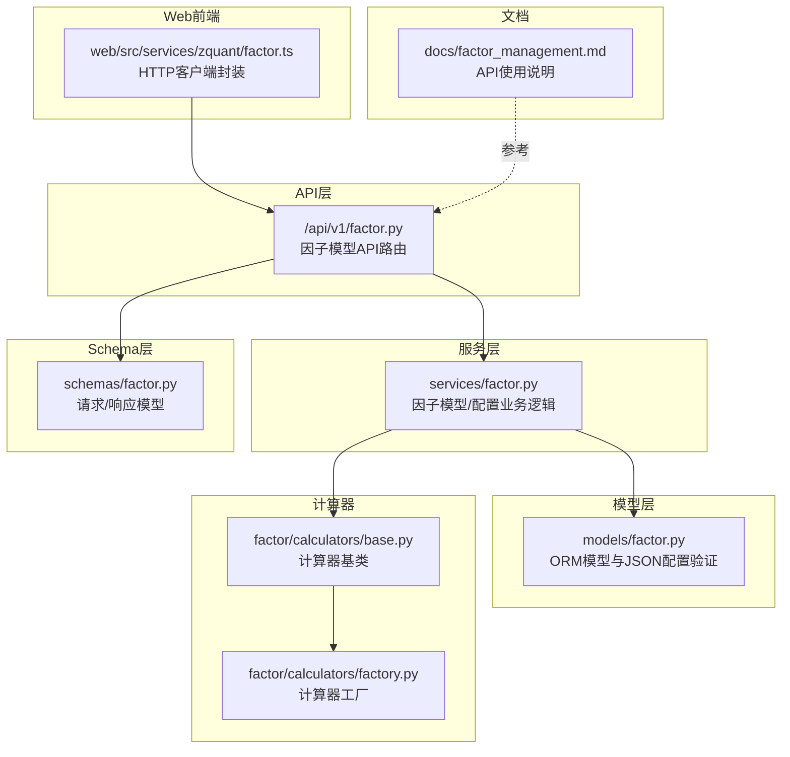
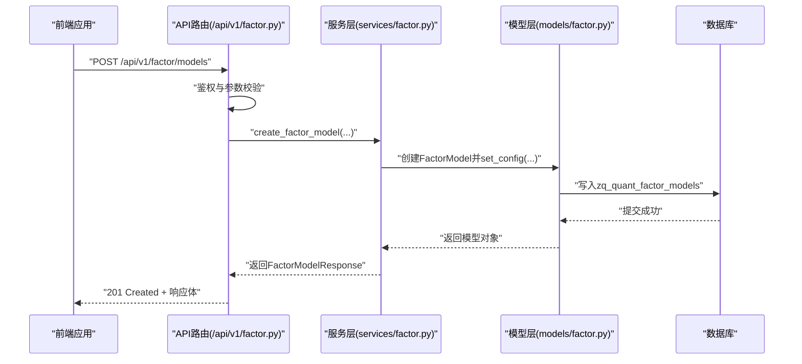
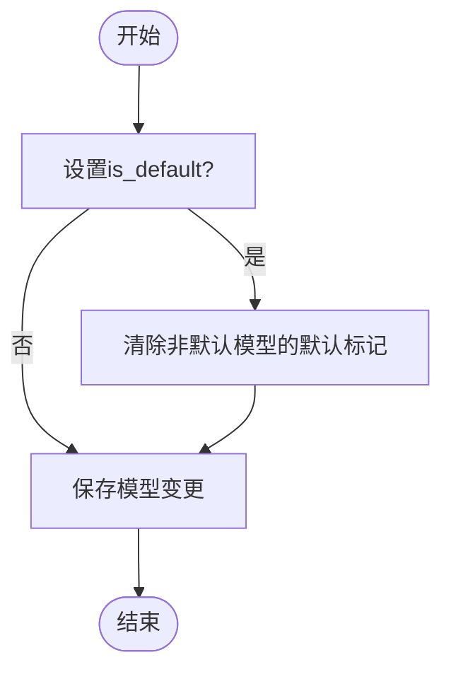
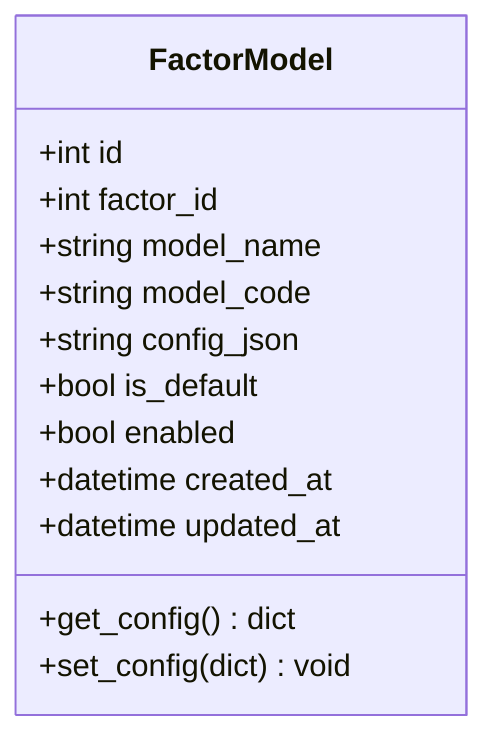
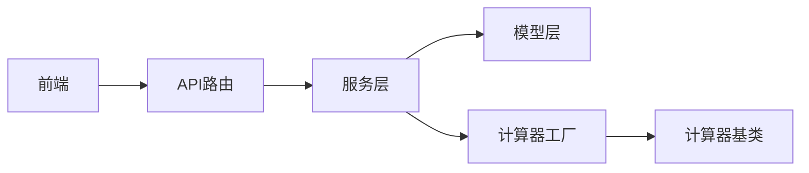

# 因子模型管理

<cite>
**本文引用的文件**
- [zquant/api/v1/factor.py](file://zquant/api/v1/factor.py)
- [zquant/services/factor.py](file://zquant/services/factor.py)
- [zquant/models/factor.py](file://zquant/models/factor.py)
- [zquant/schemas/factor.py](file://zquant/schemas/factor.py)
- [web/src/services/zquant/factor.ts](file://web/src/services/zquant/factor.ts)
- [docs/factor_management.md](file://docs/factor_management.md)
- [zquant/factor/calculators/base.py](file://zquant/factor/calculators/base.py)
- [zquant/factor/calculators/factory.py](file://zquant/factor/calculators/factory.py)
</cite>

## 目录
1. [简介](#简介)
2. [项目结构](#项目结构)
3. [核心组件](#核心组件)
4. [架构总览](#架构总览)
5. [详细组件分析](#详细组件分析)
6. [依赖关系分析](#依赖关系分析)
7. [性能考量](#性能考量)
8. [故障排查指南](#故障排查指南)
9. [结论](#结论)
10. [附录](#附录)

## 简介
本文件为“因子模型管理”的权威技术文档，面向开发者与运维人员，系统性阐述因子模型的CRUD操作、字段语义、默认模型设置机制与冲突处理策略，并给出模型配置JSON的结构规范与验证规则，帮助快速完成因子模型的创建与管理工作。

## 项目结构
围绕因子模型管理的关键代码分布在以下模块：
- API层：提供RESTful接口，负责鉴权、参数校验与错误处理
- 服务层：封装业务逻辑，实现模型与配置的增删改查、默认模型冲突处理
- 模型层：定义数据库表结构及序列化/反序列化逻辑
- Schema层：定义请求/响应的Pydantic模型，保障前后端契约一致
- Web前端：提供HTTP客户端封装，便于集成调用
- 文档：提供API使用示例与表结构说明

图表来源
- [zquant/api/v1/factor.py](file://zquant/api/v1/factor.py#L180-L379)
- [zquant/services/factor.py](file://zquant/services/factor.py#L190-L389)
- [zquant/models/factor.py](file://zquant/models/factor.py#L111-L170)
- [zquant/schemas/factor.py](file://zquant/schemas/factor.py#L100-L170)
- [web/src/services/zquant/factor.ts](file://web/src/services/zquant/factor.ts#L205-L259)
- [docs/factor_management.md](file://docs/factor_management.md#L111-L151)
- [zquant/factor/calculators/base.py](file://zquant/factor/calculators/base.py#L34-L82)
- [zquant/factor/calculators/factory.py](file://zquant/factor/calculators/factory.py#L31-L90)

章节来源
- [zquant/api/v1/factor.py](file://zquant/api/v1/factor.py#L180-L379)
- [zquant/services/factor.py](file://zquant/services/factor.py#L190-L389)
- [zquant/models/factor.py](file://zquant/models/factor.py#L111-L170)
- [zquant/schemas/factor.py](file://zquant/schemas/factor.py#L100-L170)
- [web/src/services/zquant/factor.ts](file://web/src/services/zquant/factor.ts#L205-L259)
- [docs/factor_management.md](file://docs/factor_management.md#L111-L151)

## 核心组件
- 因子模型API（CRUD）
  - 创建：POST /api/v1/factor/models
  - 查询列表：GET /api/v1/factor/models
  - 查询详情：GET /api/v1/factor/models/{id}
  - 更新：PUT /api/v1/factor/models/{id}
  - 删除：DELETE /api/v1/factor/models/{id}
- 因子模型字段
  - model_name：模型名称
  - model_code：模型代码（用于识别计算器类型）
  - config_json：模型配置（JSON格式）
  - is_default：是否默认算法
  - enabled：是否启用
- 默认模型设置机制与冲突处理
  - 设置为默认时，自动将同因子下的其他模型的默认标记清除
  - 查询时优先匹配特定股票代码，再回退至默认配置
- 配置JSON结构规范与验证
  - 支持任意键值的自由配置，用于驱动具体计算器
  - 服务层对配置进行序列化/反序列化与必要字段校验

章节来源
- [zquant/api/v1/factor.py](file://zquant/api/v1/factor.py#L180-L287)
- [zquant/schemas/factor.py](file://zquant/schemas/factor.py#L100-L170)
- [zquant/services/factor.py](file://zquant/services/factor.py#L190-L389)
- [zquant/models/factor.py](file://zquant/models/factor.py#L111-L170)

## 架构总览
下图展示因子模型管理的端到端流程：前端调用API，API路由进入服务层，服务层访问模型层（ORM与JSON配置），最终持久化到数据库。

图表来源
- [zquant/api/v1/factor.py](file://zquant/api/v1/factor.py#L180-L206)
- [zquant/services/factor.py](file://zquant/services/factor.py#L190-L226)
- [zquant/models/factor.py](file://zquant/models/factor.py#L111-L145)

## 详细组件分析

### API端点与控制流
- 创建因子模型
  - 路径：POST /api/v1/factor/models
  - 权限：管理员
  - 请求体：FactorModelCreate（含factor_id、model_name、model_code、config_json、is_default、enabled）
  - 响应：FactorModelResponse
  - 错误：400（参数/配置非法）、404（因子不存在）、500（内部错误）
- 查询因子模型列表
  - 路径：GET /api/v1/factor/models
  - 查询参数：factor_id、skip、limit、enabled、order_by、order
  - 响应：FactorModelListResponse
- 查询因子模型详情
  - 路径：GET /api/v1/factor/models/{id}
  - 响应：FactorModelResponse
- 更新因子模型
  - 路径：PUT /api/v1/factor/models/{id}
  - 权限：管理员
  - 请求体：FactorModelUpdate（可选字段）
  - 响应：FactorModelResponse
  - 特别：当is_default为true时，会自动将同因子下的其他模型的默认标记清除
- 删除因子模型
  - 路径：DELETE /api/v1/factor/models/{id}
  - 权限：管理员
  - 响应：204 No Content

章节来源
- [zquant/api/v1/factor.py](file://zquant/api/v1/factor.py#L180-L287)
- [zquant/schemas/factor.py](file://zquant/schemas/factor.py#L100-L170)
- [web/src/services/zquant/factor.ts](file://web/src/services/zquant/factor.ts#L223-L259)

### 服务层逻辑与默认模型冲突处理
- 创建/更新模型时，若is_default为true，则先将同因子下其他模型的is_default置为false，确保同一因子仅有一个默认模型
- 查询默认模型时，优先筛选enabled为true且is_default为true的模型
- 计算器选择逻辑（与模型管理相关）：
  - 根据股票代码查找特定配置，若无则回退至默认配置（codes为空或None）
  - 若默认配置未指定model_id，则回退至因子定义的默认模型

图表来源
- [zquant/services/factor.py](file://zquant/services/factor.py#L190-L226)
- [zquant/services/factor.py](file://zquant/services/factor.py#L286-L318)

章节来源
- [zquant/services/factor.py](file://zquant/services/factor.py#L190-L389)

### 模型层与配置JSON规范
- 因子模型表字段
  - id、factor_id、model_name、model_code、config_json、is_default、enabled、created_at、updated_at
- 配置JSON结构
  - config_json为任意键值的JSON对象，用于传递给具体计算器
  - 模型层提供get_config/set_config，负责JSON序列化/反序列化
- 配置验证与约束
  - 服务层在创建/更新模型时，对config_json进行赋值（允许为空字典）
  - 计算器工厂在运行期对配置进行有效性校验（validate_config）

图表来源
- [zquant/models/factor.py](file://zquant/models/factor.py#L111-L170)

章节来源
- [zquant/models/factor.py](file://zquant/models/factor.py#L111-L170)
- [zquant/schemas/factor.py](file://zquant/schemas/factor.py#L100-L170)
- [zquant/services/factor.py](file://zquant/services/factor.py#L190-L226)

### 前端调用封装
- 提供统一的HTTP客户端函数，便于在前端页面中发起因子模型管理请求
- 包含创建、查询、更新、删除等常用操作

章节来源
- [web/src/services/zquant/factor.ts](file://web/src/services/zquant/factor.ts#L205-L259)

## 依赖关系分析
- API层依赖服务层提供的业务能力
- 服务层依赖模型层的ORM对象与JSON配置工具
- 计算器工厂依赖注册表，按model_code动态创建计算器实例
- 前端通过HTTP客户端封装调用API

图表来源
- [zquant/api/v1/factor.py](file://zquant/api/v1/factor.py#L180-L379)
- [zquant/services/factor.py](file://zquant/services/factor.py#L190-L389)
- [zquant/factor/calculators/factory.py](file://zquant/factor/calculators/factory.py#L31-L90)
- [zquant/factor/calculators/base.py](file://zquant/factor/calculators/base.py#L34-L82)
- [web/src/services/zquant/factor.ts](file://web/src/services/zquant/factor.ts#L205-L259)

## 性能考量
- 列表查询支持分页与排序，建议合理设置limit与order_by，避免一次性拉取过多数据
- 默认模型切换涉及批量更新，建议在批量导入或迁移场景中合并事务，减少多次往返
- 配置JSON为TEXT字段，建议保持简洁，避免过大的嵌套结构影响序列化/反序列化性能

## 故障排查指南
- 403 Forbidden：非管理员用户尝试创建/更新/删除模型
- 404 Not Found：模型或配置不存在
- 400 Bad Request：参数非法或配置格式不合法
  - 模型配置JSON为空时，服务层会安全地写入空字典
  - 计算器配置需通过validate_config校验，否则工厂创建时报错
- 默认模型冲突：设置is_default为true时，会自动清除其他默认标记；若出现异常，检查同因子下是否有多条默认标记

章节来源
- [zquant/api/v1/factor.py](file://zquant/api/v1/factor.py#L180-L287)
- [zquant/services/factor.py](file://zquant/services/factor.py#L190-L389)
- [zquant/factor/calculators/factory.py](file://zquant/factor/calculators/factory.py#L53-L90)

## 结论
本文档系统梳理了因子模型的CRUD接口、字段语义、默认模型设置与冲突处理策略，并给出了配置JSON的结构规范与验证要点。结合服务层的默认模型冲突处理与前端HTTP封装，开发者可高效完成因子模型的创建与管理。

## 附录

### API端点一览（因子模型）
- 创建模型
  - 方法：POST
  - 路径：/api/v1/factor/models
  - 权限：管理员
  - 请求体：FactorModelCreate
  - 响应：FactorModelResponse
- 查询列表
  - 方法：GET
  - 路径：/api/v1/factor/models
  - 查询参数：factor_id、skip、limit、enabled、order_by、order
  - 响应：FactorModelListResponse
- 查询详情
  - 方法：GET
  - 路径：/api/v1/factor/models/{id}
  - 响应：FactorModelResponse
- 更新模型
  - 方法：PUT
  - 路径：/api/v1/factor/models/{id}
  - 权限：管理员
  - 请求体：FactorModelUpdate
  - 响应：FactorModelResponse
- 删除模型
  - 方法：DELETE
  - 路径：/api/v1/factor/models/{id}
  - 权限：管理员
  - 响应：204 No Content

章节来源
- [zquant/api/v1/factor.py](file://zquant/api/v1/factor.py#L180-L287)
- [docs/factor_management.md](file://docs/factor_management.md#L111-L151)

### 字段语义与使用场景
- model_name：模型名称，用于界面展示与日志追踪
- model_code：模型代码，用于识别具体计算器类型；需与计算器工厂注册的模型代码一致
- config_json：模型配置JSON，承载计算器所需的参数；建议保持简洁与可读性
- is_default：是否默认算法；同一因子下仅允许一个默认模型
- enabled：是否启用；用于控制模型是否参与计算

章节来源
- [zquant/schemas/factor.py](file://zquant/schemas/factor.py#L100-L170)
- [zquant/models/factor.py](file://zquant/models/factor.py#L111-L170)
- [zquant/services/factor.py](file://zquant/services/factor.py#L190-L389)

### 默认模型设置机制与冲突处理
- 设置is_default为true时，服务层会将同因子下的其他模型的默认标记清除
- 查询默认模型时，优先筛选enabled为true且is_default为true的模型
- 计算器选择时，优先匹配特定股票代码，再回退至默认配置

章节来源
- [zquant/services/factor.py](file://zquant/services/factor.py#L190-L389)

### 配置JSON结构规范与验证规则
- 结构：任意键值的JSON对象
- 序列化：模型层提供get_config/set_config，负责JSON的读取与写入
- 验证：服务层在创建/更新模型时接受config_json；计算器工厂在运行期通过validate_config进行有效性校验

章节来源
- [zquant/models/factor.py](file://zquant/models/factor.py#L136-L145)
- [zquant/factor/calculators/base.py](file://zquant/factor/calculators/base.py#L63-L82)
- [zquant/factor/calculators/factory.py](file://zquant/factor/calculators/factory.py#L53-L90)