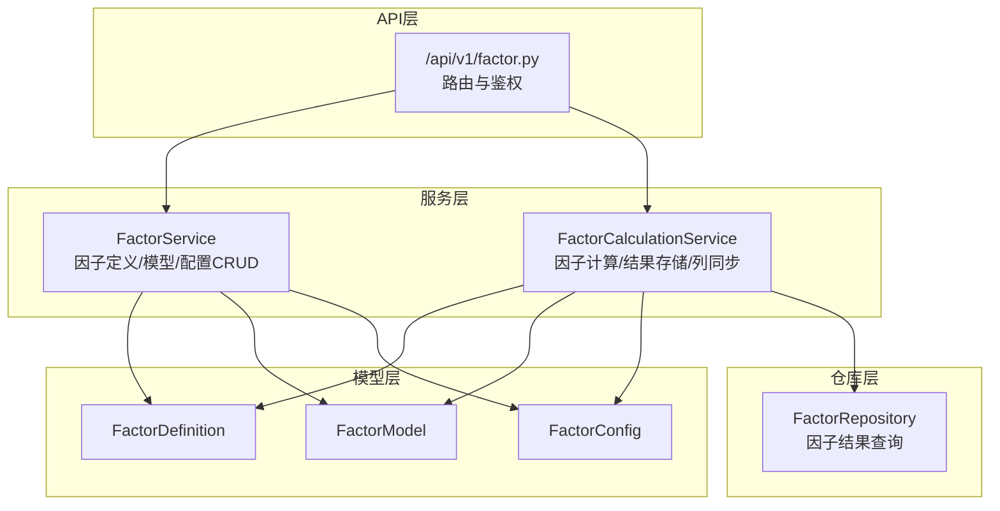
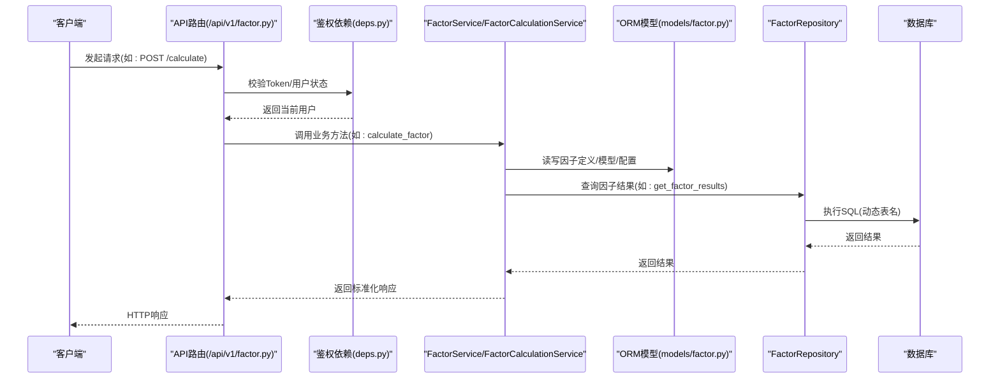
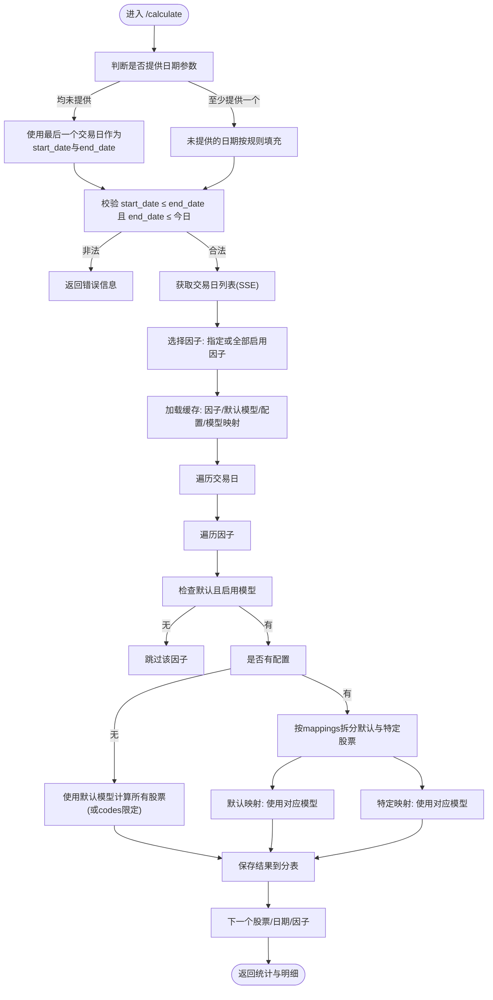
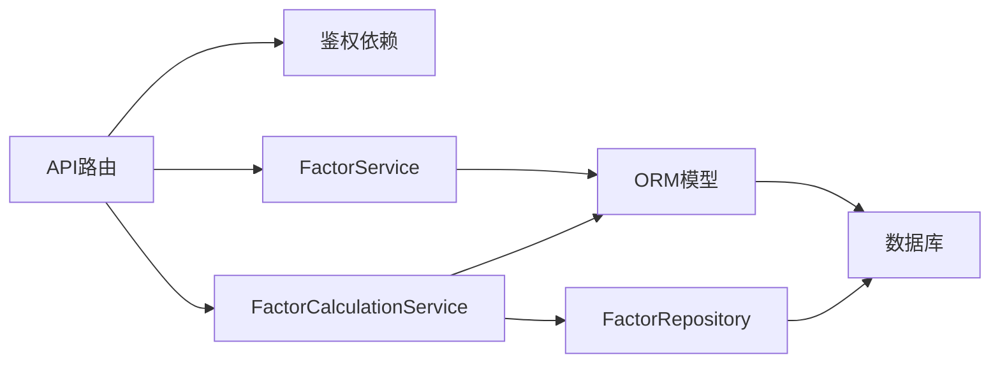

# 因子管理API

<cite>
**本文引用的文件**
- [zquant/api/v1/factor.py](file://zquant/api/v1/factor.py)
- [zquant/services/factor.py](file://zquant/services/factor.py)
- [zquant/models/factor.py](file://zquant/models/factor.py)
- [zquant/schemas/factor.py](file://zquant/schemas/factor.py)
- [zquant/repositories/factor_repository.py](file://zquant/repositories/factor_repository.py)
- [zquant/services/factor_calculation.py](file://zquant/services/factor_calculation.py)
- [zquant/api/deps.py](file://zquant/api/deps.py)
- [docs/factor_management.md](file://docs/factor_management.md)
- [web/src/services/zquant/factor.ts](file://web/src/services/zquant/factor.ts)
</cite>

## 目录
1. [简介](#简介)
2. [项目结构](#项目结构)
3. [核心组件](#核心组件)
4. [架构总览](#架构总览)
5. [详细组件分析](#详细组件分析)
6. [依赖分析](#依赖分析)
7. [性能考虑](#性能考虑)
8. [故障排查指南](#故障排查指南)
9. [结论](#结论)
10. [附录](#附录)

## 简介
本文件为 zquant 因子管理API的权威技术文档，覆盖因子定义、因子模型、因子配置的CRUD能力，以及手动触发因子计算（/calculate）与查询因子结果（/results）的实现逻辑与数据返回机制。同时给出新旧因子配置接口的兼容性策略与迁移指南，帮助开发者高效完成因子开发、配置与计算全流程。

## 项目结构
- API层：FastAPI 路由集中于因子模块，负责鉴权、参数校验、调用服务层并返回标准化响应。
- 服务层：FactorService、FactorCalculationService 提供业务逻辑封装，协调模型与仓库。
- 模型层：ORM 模型定义因子定义、模型、配置及关系。
- 仓库层：FactorRepository 提供因子结果查询等数据访问。
- 文档与前端：官方文档与前端SDK示例，便于集成与测试。

图表来源
- [zquant/api/v1/factor.py](file://zquant/api/v1/factor.py#L1-L816)
- [zquant/services/factor.py](file://zquant/services/factor.py#L1-L766)
- [zquant/services/factor_calculation.py](file://zquant/services/factor_calculation.py#L1-L1067)
- [zquant/models/factor.py](file://zquant/models/factor.py#L1-L267)
- [zquant/repositories/factor_repository.py](file://zquant/repositories/factor_repository.py#L1-L218)

章节来源
- [zquant/api/v1/factor.py](file://zquant/api/v1/factor.py#L1-L816)
- [zquant/services/factor.py](file://zquant/services/factor.py#L1-L766)
- [zquant/services/factor_calculation.py](file://zquant/services/factor_calculation.py#L1-L1067)
- [zquant/models/factor.py](file://zquant/models/factor.py#L1-L267)
- [zquant/repositories/factor_repository.py](file://zquant/repositories/factor_repository.py#L1-L218)

## 核心组件
- 因子定义（FactorDefinition）：唯一标识因子名称、中文/英文简称、列名、描述、启用状态等。
- 因子模型（FactorModel）：为因子绑定不同算法/模型，支持默认模型与启用状态。
- 因子配置（FactorConfig）：以factor_id为主键，存储JSON配置，包含enabled与mappings（model_id与codes列表）。
- 因子结果表：按股票代码分表存储，表名形如 zq_quant_factor_spacex_{code}，列名为因子定义的column_name。

章节来源
- [zquant/models/factor.py](file://zquant/models/factor.py#L1-L267)
- [docs/factor_management.md](file://docs/factor_management.md#L1-L200)

## 架构总览
下图展示因子管理API的关键交互路径：API路由接收请求，经鉴权与参数校验后调用服务层，服务层访问模型与仓库，最终持久化到数据库与结果表。

图表来源
- [zquant/api/v1/factor.py](file://zquant/api/v1/factor.py#L730-L816)
- [zquant/api/deps.py](file://zquant/api/deps.py#L1-L93)
- [zquant/services/factor.py](file://zquant/services/factor.py#L1-L766)
- [zquant/services/factor_calculation.py](file://zquant/services/factor_calculation.py#L1-L1067)
- [zquant/repositories/factor_repository.py](file://zquant/repositories/factor_repository.py#L1-L218)
- [zquant/models/factor.py](file://zquant/models/factor.py#L1-L267)

## 详细组件分析

### 因子定义管理（CRUD）
- 创建因子定义
  - 权限：管理员
  - 参数：factor_name、cn_name、en_name、column_name、description、enabled、factor_config
  - 校验：名称唯一；若未指定column_name，回退为factor_name
  - 返回：标准化响应对象
- 列表/详情/更新/删除
  - 支持按enabled、排序字段与方向排序
  - 更新支持部分字段变更与配置整体更新

章节来源
- [zquant/api/v1/factor.py](file://zquant/api/v1/factor.py#L66-L176)
- [zquant/services/factor.py](file://zquant/services/factor.py#L43-L188)
- [zquant/schemas/factor.py](file://zquant/schemas/factor.py#L33-L110)

### 因子模型管理（CRUD）
- 创建因子模型
  - 权限：管理员
  - 参数：factor_id、model_name、model_code、config_json、is_default、enabled
  - 默认模型互斥：设置is_default时，同因子下其他默认标记会被清除
- 列表/详情/更新/删除
  - 支持按factor_id、enabled、排序字段与方向排序
  - 更新支持切换默认模型与启用状态

章节来源
- [zquant/api/v1/factor.py](file://zquant/api/v1/factor.py#L178-L287)
- [zquant/services/factor.py](file://zquant/services/factor.py#L190-L330)
- [zquant/schemas/factor.py](file://zquant/schemas/factor.py#L100-L169)

### 因子配置管理（新表结构，标准RESTful）
- 新表结构以factor_id为主键，配置以JSON存储，包含enabled与mappings（model_id与codes列表）
- CRUD接口
  - 创建：校验因子存在、校验mappings中每个mapping含model_id、默认映射最多一个（codes为空或None）
  - 列表：支持按factor_id、enabled、排序字段与方向
  - 详情：按factor_id获取配置
  - 更新：合并当前配置与新配置，校验规则同创建
  - 删除：按factor_id删除配置
- 单映射更新/删除（兼容旧接口）
  - 通过查询参数config_id定位单条映射记录，避免路径参数冲突

章节来源
- [zquant/api/v1/factor.py](file://zquant/api/v1/factor.py#L289-L729)
- [zquant/services/factor.py](file://zquant/services/factor.py#L631-L766)
- [zquant/schemas/factor.py](file://zquant/schemas/factor.py#L170-L291)

### 因子配置管理（旧接口，已废弃，向后兼容）
- 旧接口以FactorDefinition表的factor_config字段存储配置，支持多映射
- 新旧接口兼容策略
  - 读取：优先尝试新表（FactorConfig），不存在则回退到旧表（FactorDefinition）
  - 更新：优先更新新表，不存在则更新旧表
  - 删除：优先删除新表，不存在则清空旧表配置
- 建议迁移：逐步将旧表配置迁移到新表，停止使用旧接口

章节来源
- [zquant/api/v1/factor.py](file://zquant/api/v1/factor.py#L402-L665)
- [zquant/services/factor.py](file://zquant/services/factor.py#L331-L522)

### 手动触发因子计算（/calculate）
- 请求体：factor_id（可选，None表示计算所有启用因子）、codes（可选，None使用配置codes）、start_date、end_date
- 日期处理规则
  - 若均未提供：使用最后一个交易日作为start_date与end_date
  - 若仅提供其一：start_date默认“2025-01-01”，end_date默认最后一个交易日
  - 校验：start_date ≤ end_date 且 end_date ≤ 今日
- 计算流程
  - 获取交易日列表（SSE交易所）
  - 选择因子：factor_id或所有启用因子
  - 通过缓存一次性加载因子定义、默认模型、配置与模型映射，减少多次查询
  - 对每个交易日与每个因子：
    - 若无默认且启用的模型，跳过
    - 若无配置：使用默认模型计算所有股票（或codes参数限定）
    - 若有配置：按mappings区分默认与特定股票，分别计算
  - 保存结果：按股票代码分表，列名为因子定义的column_name，存在则更新，否则插入
- 返回：包含success、message、计算/失败/无效计数与明细

图表来源
- [zquant/api/v1/factor.py](file://zquant/api/v1/factor.py#L731-L757)
- [zquant/services/factor_calculation.py](file://zquant/services/factor_calculation.py#L576-L800)
- [zquant/services/factor_calculation.py](file://zquant/services/factor_calculation.py#L1-L214)

章节来源
- [zquant/api/v1/factor.py](file://zquant/api/v1/factor.py#L731-L757)
- [zquant/services/factor_calculation.py](file://zquant/services/factor_calculation.py#L576-L800)

### 查询因子计算结果（/results）
- 请求体：code、factor_name（可选，None表示查询所有因子）、start_date、end_date
- 查询逻辑
  - 根据code解析数字部分得到表名 zq_quant_factor_spacex_{code}
  - 检查表是否存在，不存在返回空列表
  - 构造SQL查询，按日期范围过滤，按trade_date降序
  - 若未指定factor_name：返回所有因子的记录，items包含id、trade_date、factor_value、created_at等
  - 若指定factor_name：先获取因子定义column_name，再从返回记录中筛选该列，仅返回该因子的值
- 返回：包含code、factor_name、items列表与total

章节来源
- [zquant/api/v1/factor.py](file://zquant/api/v1/factor.py#L759-L816)
- [zquant/repositories/factor_repository.py](file://zquant/repositories/factor_repository.py#L155-L218)
- [zquant/services/factor.py](file://zquant/services/factor.py#L97-L101)

### 因子计算器开发与注册
- 开发步骤
  - 继承基础计算器类，实现calculate与validate_config
  - 在工厂中注册model_code与计算器类
- 使用场景
  - 因子模型的model_code需与注册的计算器一致
  - 计算时按配置选择模型，调用对应计算器

章节来源
- [docs/factor_management.md](file://docs/factor_management.md#L261-L341)

## 依赖分析
- API层依赖
  - 鉴权：HTTP Bearer Token，校验用户有效性与激活状态
  - 依赖注入：数据库会话、当前用户、权限校验
- 服务层依赖
  - FactorService：封装因子定义/模型/配置的CRUD与查询
  - FactorCalculationService：封装因子计算、结果表创建与列同步、结果保存
- 模型层依赖
  - ORM关系：FactorDefinition 一对多 FactorModel 与 FactorConfig
  - JSON字段：FactorConfig.config_json 存储配置；FactorModel.config_json 存储模型配置
- 仓库层依赖
  - FactorRepository：按code动态拼接表名查询因子结果

图表来源
- [zquant/api/v1/factor.py](file://zquant/api/v1/factor.py#L1-L816)
- [zquant/api/deps.py](file://zquant/api/deps.py#L1-L93)
- [zquant/services/factor.py](file://zquant/services/factor.py#L1-L766)
- [zquant/services/factor_calculation.py](file://zquant/services/factor_calculation.py#L1-L1067)
- [zquant/repositories/factor_repository.py](file://zquant/repositories/factor_repository.py#L1-L218)
- [zquant/models/factor.py](file://zquant/models/factor.py#L1-L267)

章节来源
- [zquant/api/v1/factor.py](file://zquant/api/v1/factor.py#L1-L816)
- [zquant/api/deps.py](file://zquant/api/deps.py#L1-L93)
- [zquant/services/factor.py](file://zquant/services/factor.py#L1-L766)
- [zquant/services/factor_calculation.py](file://zquant/services/factor_calculation.py#L1-L1067)
- [zquant/repositories/factor_repository.py](file://zquant/repositories/factor_repository.py#L1-L218)
- [zquant/models/factor.py](file://zquant/models/factor.py#L1-L267)

## 性能考虑
- 缓存优化
  - FactorCalculationCache 一次性加载因子定义、默认模型、配置与模型映射，减少重复查询
- 分表与列同步
  - 按股票代码分表，避免大表锁竞争
  - 同步因子列：批量为所有因子表添加缺失列，减少重复ALTER开销
- 批处理与日志
  - 计算过程按批次输出进度日志，便于监控与定位
- 数据准备检查
  - 计算前检查当日数据同步与交易日，避免无效计算

章节来源
- [zquant/services/factor_calculation.py](file://zquant/services/factor_calculation.py#L44-L214)
- [zquant/services/factor_calculation.py](file://zquant/services/factor_calculation.py#L376-L469)

## 故障排查指南
- 鉴权失败
  - 检查Token是否有效、用户是否激活
- 数据库未初始化
  - 依据提示运行初始化脚本
- 因子计算失败
  - 检查当日数据是否同步、是否为交易日
  - 检查因子配置是否正确、默认模型是否存在
  - 查看返回的details与错误信息
- 结果查询无数据
  - 确认表是否存在、日期范围是否正确
  - 若未指定factor_name，返回所有因子；若指定factor_name，确认列名与因子定义一致

章节来源
- [zquant/api/deps.py](file://zquant/api/deps.py#L1-L93)
- [zquant/services/factor_calculation.py](file://zquant/services/factor_calculation.py#L215-L375)
- [zquant/repositories/factor_repository.py](file://zquant/repositories/factor_repository.py#L155-L218)

## 结论
本API围绕因子定义、模型与配置提供完整的CRUD能力，并通过标准化的计算与结果查询接口支撑自动化与手动计算场景。新旧配置接口保持兼容，建议尽快迁移至新表结构，以获得更清晰的配置管理与更好的扩展性。

## 附录

### API端点一览与参数说明
- 因子定义
  - POST /api/v1/factor/definitions
  - GET /api/v1/factor/definitions
  - GET /api/v1/factor/definitions/{id}
  - PUT /api/v1/factor/definitions/{id}
  - DELETE /api/v1/factor/definitions/{id}
- 因子模型
  - POST /api/v1/factor/models
  - GET /api/v1/factor/models
  - GET /api/v1/factor/models/{id}
  - PUT /api/v1/factor/models/{id}
  - DELETE /api/v1/factor/models/{id}
- 因子配置（新表结构）
  - POST /api/v1/factor/configs
  - GET /api/v1/factor/configs
  - GET /api/v1/factor/configs/{factor_id}
  - PUT /api/v1/factor/configs/{factor_id}
  - DELETE /api/v1/factor/configs/{factor_id}
  - PUT /api/v1/factor/configs
  - DELETE /api/v1/factor/configs
- 因子配置（旧接口，向后兼容）
  - GET /api/v1/factor/definitions/{factor_id}/config
  - PUT /api/v1/factor/definitions/{factor_id}/config
  - DELETE /api/v1/factor/definitions/{factor_id}/config
  - GET /api/v1/factor/configs/grouped
  - PUT /api/v1/factor/configs/by-factor/{factor_id}
  - DELETE /api/v1/factor/configs/by-factor/{factor_id}
- 计算与结果
  - POST /api/v1/factor/calculate
  - POST /api/v1/factor/results

章节来源
- [zquant/api/v1/factor.py](file://zquant/api/v1/factor.py#L66-L816)
- [web/src/services/zquant/factor.ts](file://web/src/services/zquant/factor.ts#L1-L380)

### 新旧配置接口兼容性与迁移指南
- 兼容策略
  - 读取：优先新表，不存在则回退旧表
  - 更新：优先新表，不存在则更新旧表
  - 删除：优先删除新表，不存在则清空旧表配置
- 迁移建议
  - 逐步将旧表factor_config迁移为新表FactorConfig
  - 使用新接口进行后续维护，停止使用旧接口
  - 保留旧接口一段时间，确保业务平稳过渡

章节来源
- [zquant/api/v1/factor.py](file://zquant/api/v1/factor.py#L402-L665)
- [zquant/services/factor.py](file://zquant/services/factor.py#L331-L522)