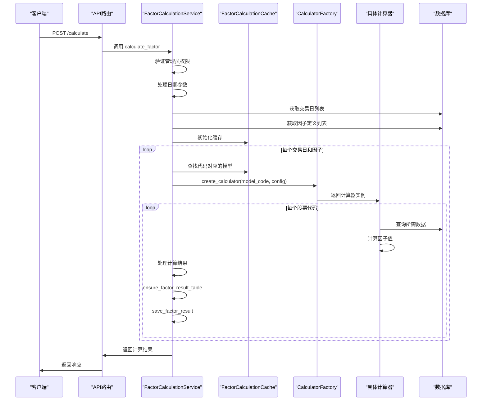
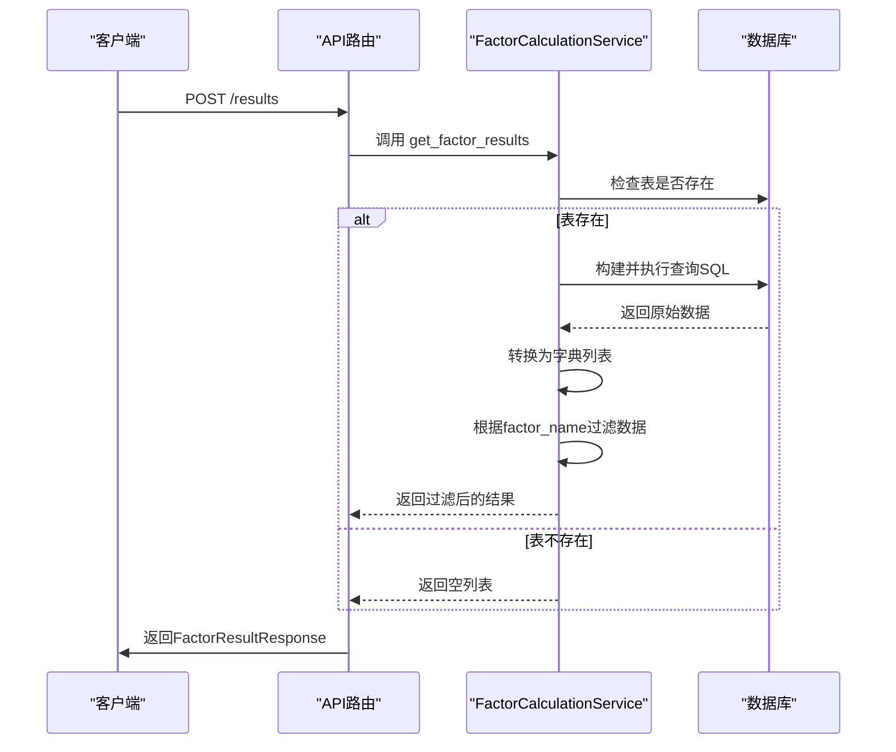
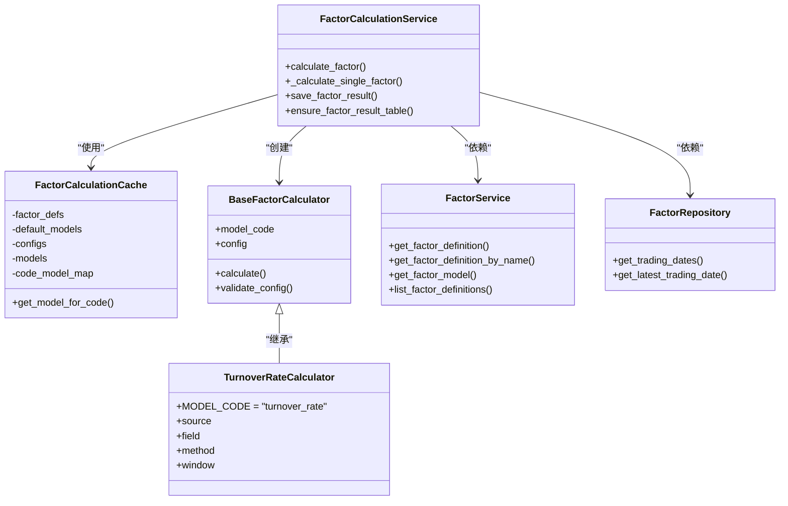
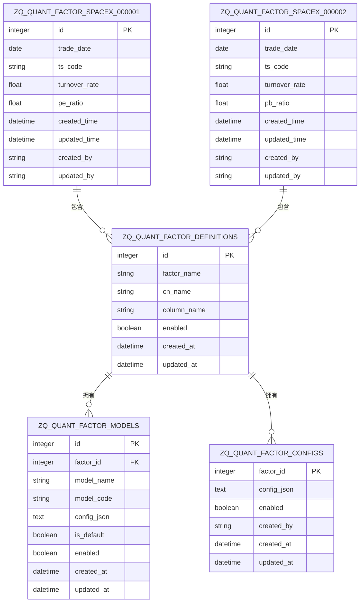

# 因子计算与查询

<cite>
**本文档引用文件**   
- [factor.py](file://zquant/api/v1/factor.py)
- [factor_calculation.py](file://zquant/services/factor_calculation.py)
- [factor.py](file://zquant/models/factor.py)
- [factor.py](file://zquant/schemas/factor.py)
- [base.py](file://zquant/factor/calculators/base.py)
- [factory.py](file://zquant/factor/calculators/factory.py)
- [turnover_rate.py](file://zquant/factor/calculators/turnover_rate.py)
- [storage_base.py](file://zquant/data/storage_base.py)
- [data.py](file://zquant/models/data.py)
</cite>

## 目录
1. [引言](#引言)
2. [因子计算端点 (/calculate)](#因子计算端点-calculate)
3. [因子查询端点 (/results)](#因子查询端点-results)
4. [计算任务执行上下文](#计算任务执行上下文)
5. [结果存储结构](#结果存储结构)
6. [查询性能优化与分页](#查询性能优化与分页)
7. [计算任务调度与结果分析指导](#计算任务调度与结果分析指导)

## 引言
本文档旨在为开发者提供关于因子计算与查询功能的权威技术指导。文档详细阐述了手动触发因子计算（/calculate）端点的实现逻辑、执行流程和参数验证机制，以及查询因子计算结果（/results）端点的查询条件、过滤机制和数据返回格式。同时，文档深入解释了计算任务的执行上下文、结果存储结构，并提供了查询性能优化策略和分页处理机制，为开发者进行计算任务调度和结果分析提供完整的实践指南。

## 因子计算端点 (/calculate)

该端点用于手动触发因子计算任务，其核心逻辑由 `FactorCalculationService.calculate_factor` 方法实现。

### 实现逻辑与执行流程
1.  **权限验证**：首先验证当前用户是否为管理员，非管理员用户无法触发计算。
2.  **日期参数处理**：根据传入的 `start_date` 和 `end_date` 参数，应用特定的日期处理规则：
    *   **规则一**：当 `start_date` 和 `end_date` 均未提供时，计算日期默认为最后一个交易日。
    *   **规则二**：当至少有一个日期参数提供时，`start_date` 默认为 "2025-01-01"，`end_date` 默认为最后一个交易日。
3.  **交易日列表获取**：根据处理后的日期范围，从数据库中获取该范围内的所有交易日列表。
4.  **因子定义获取**：如果指定了 `factor_id`，则获取该因子的定义；否则，获取所有启用的因子定义列表。
5.  **缓存初始化**：创建 `FactorCalculationCache` 对象，一次性将所有相关的因子配置、模型等数据加载到内存中，以减少后续数据库查询，提升计算效率。
6.  **循环计算**：对每个交易日和每个因子定义进行循环：
    *   根据因子配置和股票代码，通过缓存查找对应的计算模型（`FactorModel`）。
    *   使用 `create_calculator` 工厂方法，根据模型代码（`model_code`）和模型配置（`config_json`）创建具体的因子计算器实例。
    *   调用计算器的 `calculate` 方法计算单个股票在指定交易日的因子值。
7.  **结果保存**：计算完成后，调用 `save_factor_result` 方法将结果持久化到数据库。

### 参数验证
端点通过 `FactorCalculationRequest` Pydantic 模型对请求参数进行验证：
*   `factor_id` (可选): 因子ID，`None` 表示计算所有启用的因子。
*   `codes` (可选): 股票代码列表，`None` 表示使用配置中的代码。
*   `start_date` (可选): 开始日期。
*   `end_date` (可选): 结束日期。

在执行流程中，还会进行额外的业务逻辑验证，例如检查日期范围是否有效（开始日期不能大于结束日期）、结束日期不能超过当天日期等。

**Diagram sources**
- [factor.py](file://zquant/api/v1/factor.py#L733-L757)
- [factor_calculation.py](file://zquant/services/factor_calculation.py#L576-L892)

**Section sources**
- [factor.py](file://zquant/api/v1/factor.py#L733-L757)
- [factor_calculation.py](file://zquant/services/factor_calculation.py#L576-L892)

## 因子查询端点 (/results)

该端点用于查询已计算的因子结果，其核心逻辑由 `FactorCalculationService.get_factor_results` 方法实现。

### 查询条件与过滤机制
端点通过 `FactorResultQueryRequest` Pydantic 模型接收查询条件：
*   `code` (必填): 股票代码。
*   `factor_name` (可选): 因子名称，`None` 表示查询所有因子。
*   `start_date` (可选): 开始日期。
*   `end_date` (可选): 结束日期。

其过滤机制如下：
1.  **表存在性检查**：首先检查对应股票代码的因子结果表（如 `zq_quant_factor_spacex_000001`）是否存在。
2.  **SQL查询构建**：构建一个 `SELECT *` 的SQL查询，并根据 `start_date` 和 `end_date` 添加相应的 `WHERE` 条件。
3.  **结果过滤**：当指定了 `factor_name` 时，会从查询结果中提取该因子对应的列（列名由 `FactorDefinition.column_name` 决定），并过滤出包含该列的数据，最终返回一个仅包含 `id`、`trade_date`、`factor_value` 和 `created_at` 字段的精简列表。

### 数据返回格式
端点返回 `FactorResultResponse` 模型，其结构如下：
*   `code`: 请求的股票代码。
*   `factor_name`: 请求的因子名称，如果查询所有因子则为 "all"。
*   `items`: 包含 `FactorResultItem` 对象的列表，每个对象包含：
    *   `id`: 记录ID。
    *   `trade_date`: 交易日期。
    *   `factor_value`: 因子值。
    *   `created_at`: 创建时间。
*   `total`: 返回结果的总数。

**Diagram sources**
- [factor.py](file://zquant/api/v1/factor.py#L761-L814)
- [factor_calculation.py](file://zquant/services/factor_calculation.py#L999-L1067)

**Section sources**
- [factor.py](file://zquant/api/v1/factor.py#L761-L814)
- [factor_calculation.py](file://zquant/services/factor_calculation.py#L999-L1067)

## 计算任务执行上下文

因子计算任务在一个复杂的执行上下文中运行，涉及多个服务和组件的协同工作。

### 核心组件
*   **FactorCalculationService**: 核心服务类，协调整个计算流程，包括参数处理、缓存管理、结果保存等。
*   **FactorCalculationCache**: 计算缓存类，用于减少数据库查询。它在计算开始前一次性加载所有相关的 `FactorDefinition`、`FactorModel` 和 `FactorConfig` 到内存中，并预计算代码到模型的映射关系。
*   **Calculator Factory**: 计算器工厂，根据 `model_code` 动态创建具体的因子计算器实例。
*   **BaseFactorCalculator**: 所有因子计算器的基类，定义了 `calculate` 和 `validate_config` 等抽象方法。

### 执行流程
1.  **初始化**：`calculate_factor` 方法接收请求，进行权限和参数验证。
2.  **准备阶段**：处理日期参数，获取交易日列表和因子定义列表，并初始化 `FactorCalculationCache`。
3.  **计算阶段**：进入双重循环（交易日 x 因子）。对于每个组合，从缓存中获取模型，通过工厂创建计算器，并调用其 `calculate` 方法。
4.  **持久化阶段**：计算完成后，`_calculate_single_factor` 方法负责调用 `ensure_factor_result_table` 确保结果表存在，然后调用 `save_factor_result` 将结果写入数据库。

**Diagram sources**
- [factor_calculation.py](file://zquant/services/factor_calculation.py#L215-L892)
- [base.py](file://zquant/factor/calculators/base.py#L34-L82)
- [factory.py](file://zquant/factor/calculators/factory.py#L35-L38)
- [turnover_rate.py](file://zquant/factor/calculators/turnover_rate.py#L37-L188)
- [factor.py](file://zquant/services/factor.py#L38-L785)
- [trading_date_repository.py](file://zquant/repositories/trading_date_repository.py)

**Section sources**
- [factor_calculation.py](file://zquant/services/factor_calculation.py#L215-L892)
- [base.py](file://zquant/factor/calculators/base.py#L34-L82)
- [factory.py](file://zquant/factor/calculators/factory.py#L35-L38)
- [turnover_rate.py](file://zquant/factor/calculators/turnover_rate.py#L37-L188)

## 结果存储结构

因子计算结果采用分表存储策略，以优化查询性能和数据管理。

### 数据库表结构
*   **因子结果表**：以股票代码为单位进行分表，表名格式为 `zq_quant_factor_spacex_{code}`（例如 `zq_quant_factor_spacex_000001`）。该表的结构由 `create_spacex_factor_class` 函数动态生成，包含以下基础字段：
    *   `id`: 主键ID。
    *   `trade_date`: 交易日期。
    *   `ts_code`: 股票代码。
    *   `created_time`: 创建时间。
    *   `updated_time`: 更新时间。
    *   `created_by`: 创建人。
    *   `updated_by`: 修改人。
*   **动态列添加**：每个因子的值作为单独的列存储在对应股票的表中。列名由 `FactorDefinition.column_name` 决定。当计算一个新因子时，系统会自动执行 `ALTER TABLE ADD COLUMN` 语句来添加该列。

### 表与列的管理
*   **表创建**：当首次为某只股票计算因子时，`ensure_factor_result_table` 方法会检查表是否存在，若不存在则调用 `ensure_table_exists` 创建基础结构的表。
*   **列添加**：在创建表或表已存在但缺少对应因子列时，`ensure_factor_result_table` 会执行 `ALTER TABLE ADD COLUMN` 语句来添加新列，并附带注释（如 `'换手率因子值'`）。
*   **批量同步**：`sync_factor_columns` 方法可用于批量检查所有因子表，并为所有表添加所有启用的因子列，确保数据结构的一致性。

**Diagram sources**
- [data.py](file://zquant/models/data.py#L943-L1016)
- [factor_calculation.py](file://zquant/services/factor_calculation.py#L266-L332)
- [factor.py](file://zquant/models/factor.py#L35-L267)

**Section sources**
- [data.py](file://zquant/models/data.py#L943-L1016)
- [factor_calculation.py](file://zquant/services/factor_calculation.py#L266-L332)
- [factor.py](file://zquant/models/factor.py#L35-L267)

## 查询性能优化与分页

为确保查询性能，系统采用了分表存储和高效的查询策略。

### 性能优化策略
1.  **分表存储**：按股票代码分表是核心的性能优化策略。这避免了单个大表的性能瓶颈，使得查询单只股票的数据非常高效。
2.  **索引优化**：每张因子结果表都对 `trade_date` 和 `ts_code` 字段建立了索引，确保基于日期和代码的查询能够快速定位数据。
3.  **直接SQL查询**：`get_factor_results` 方法直接构建并执行原生SQL查询，避免了ORM的复杂查询开销，提高了查询效率。
4.  **结果过滤**：在应用层对查询结果进行过滤，只返回前端需要的字段，减少了网络传输的数据量。

### 分页处理机制
目前的 `/results` 端点本身不直接支持分页参数。分页逻辑由前端或调用方在应用层实现。前端通过 `ProTable` 组件的 `request` 函数调用该API，并将分页参数（如 `current` 和 `pageSize`）转换为 `skip` 和 `limit`，但当前API并未接收这些参数。因此，API会返回所有符合条件的结果，然后由前端框架进行分页展示。这是一种“先取后分”的模式，适用于数据量不大的场景。对于海量数据，建议在后端API中增加对 `skip` 和 `limit` 参数的支持，以实现真正的数据库层分页。

## 计算任务调度与结果分析指导

### 计算任务调度
*   **手动触发**：通过调用 `/api/v1/factor/calculate` 端点，可以手动触发计算任务。这对于调试、补算历史数据或临时计算特定因子非常有用。
*   **自动调度**：系统通过 `scheduler` 模块支持定时任务。可以创建一个调度任务，定期（如每日收盘后）调用 `calculate_factor` 服务来计算所有启用的因子，实现自动化。

### 结果分析指导
*   **数据验证**：在分析结果前，应检查 `get_factor_results` 的返回结果。如果返回空列表，需确认因子结果表是否存在以及查询条件是否正确。
*   **处理特殊值**：因子值为 `-1` 表示当日数据不完整，计算结果无效。在分析时应将这些值视为缺失数据进行处理。
*   **利用缓存**：在进行批量分析时，可以借鉴 `FactorCalculationCache` 的设计思想，将常用的因子定义、模型配置等元数据一次性加载到内存中，避免重复查询数据库。
*   **监控与日志**：关注 `calculate_factor` 方法返回的 `details` 字段，其中包含了每个计算任务的详细信息（成功、失败、数据不完整），可用于监控计算任务的健康状况和排查问题。