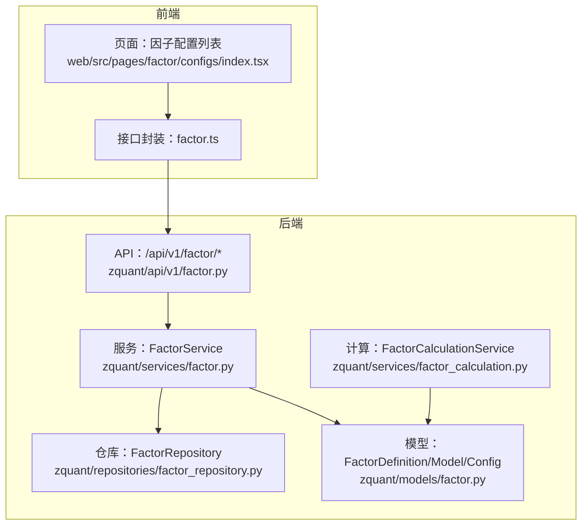
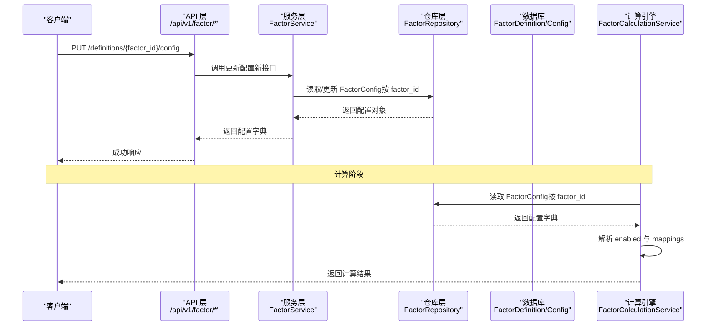
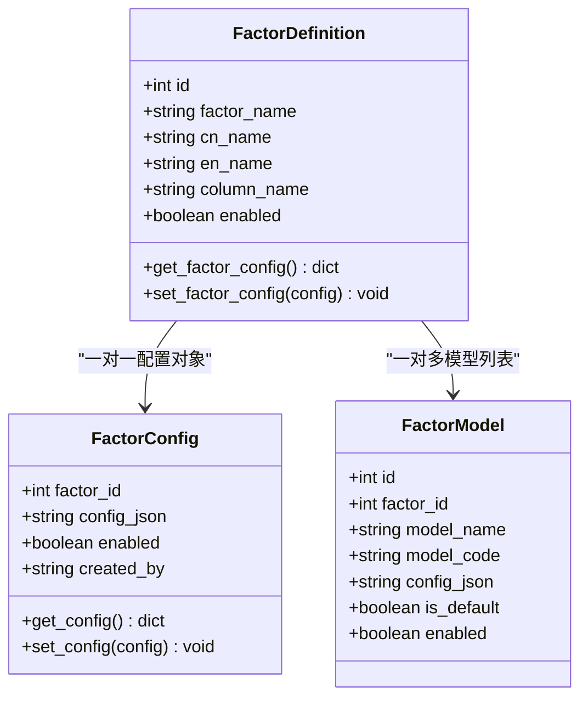
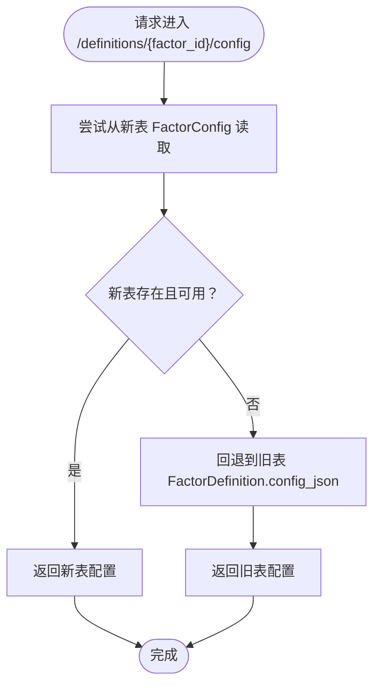
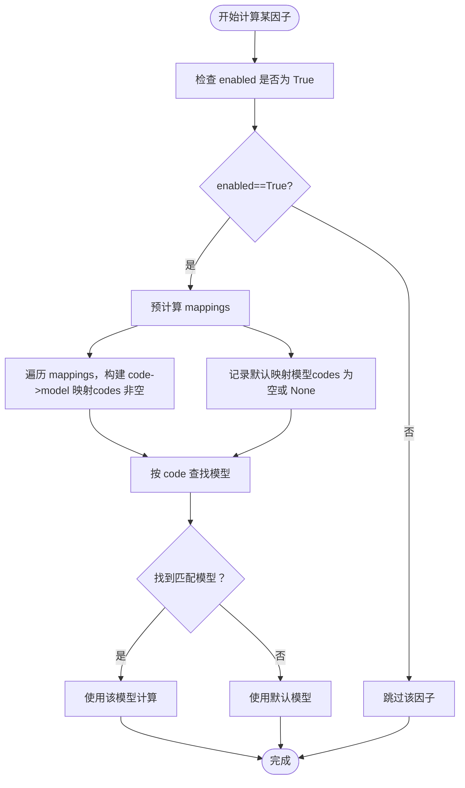
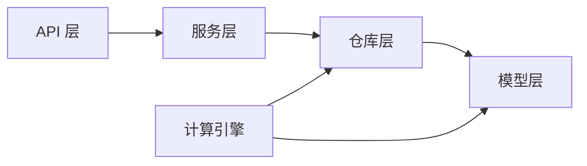

# 因子配置管理

<cite>
**本文引用的文件**
- [zquant/models/factor.py](file://zquant/models/factor.py)
- [zquant/schemas/factor.py](file://zquant/schemas/factor.py)
- [zquant/api/v1/factor.py](file://zquant/api/v1/factor.py)
- [zquant/services/factor.py](file://zquant/services/factor.py)
- [zquant/repositories/factor_repository.py](file://zquant/repositories/factor_repository.py)
- [zquant/services/factor_calculation.py](file://zquant/services/factor_calculation.py)
- [docs/factor_management.md](file://docs/factor_management.md)
- [web/src/services/zquant/factor.ts](file://web/src/services/zquant/factor.ts)
- [web/src/pages/factor/configs/index.tsx](file://web/src/pages/factor/configs/index.tsx)
</cite>

## 目录
1. [引言](#引言)
2. [项目结构](#项目结构)
3. [核心组件](#核心组件)
4. [架构总览](#架构总览)
5. [详细组件分析](#详细组件分析)
6. [依赖分析](#依赖分析)
7. [性能考虑](#性能考虑)
8. [故障排查指南](#故障排查指南)
9. [结论](#结论)
10. [附录](#附录)

## 引言
本文件面向开发者与运维人员，系统性梳理 zquant 项目中“因子配置管理”的新旧两套体系：以 factor_id 为核心的新型配置表结构（FactorConfig）及其 CRUD 操作，以及向后兼容旧版 JSON 配置接口的策略。文档重点解释配置数据结构（enabled, mappings[model_id, codes]）的业务含义，并给出配置迁移指南与最佳实践，帮助团队平滑过渡至新架构。

## 项目结构
围绕因子配置管理的关键模块分布如下：
- 数据模型层：定义因子定义、模型与配置的 ORM 模型及字段约束
- 服务层：封装 CRUD 与业务校验逻辑，负责配置格式校验与默认映射约束
- API 层：暴露 REST 接口，提供新旧接口并实现向后兼容
- 前端层：提供因子配置管理页面与接口调用封装
- 计算引擎：在因子计算阶段读取配置并选择模型

图表来源
- [zquant/api/v1/factor.py](file://zquant/api/v1/factor.py#L1-L200)
- [zquant/services/factor.py](file://zquant/services/factor.py#L1-L200)
- [zquant/repositories/factor_repository.py](file://zquant/repositories/factor_repository.py#L1-L218)
- [zquant/models/factor.py](file://zquant/models/factor.py#L147-L267)
- [zquant/services/factor_calculation.py](file://zquant/services/factor_calculation.py#L108-L212)
- [web/src/pages/factor/configs/index.tsx](file://web/src/pages/factor/configs/index.tsx#L94-L346)
- [web/src/services/zquant/factor.ts](file://web/src/services/zquant/factor.ts#L150-L203)

章节来源
- [zquant/api/v1/factor.py](file://zquant/api/v1/factor.py#L1-L200)
- [zquant/services/factor.py](file://zquant/services/factor.py#L1-L200)
- [zquant/models/factor.py](file://zquant/models/factor.py#L147-L267)
- [docs/factor_management.md](file://docs/factor_management.md#L1-L120)

## 核心组件
- 因子定义（FactorDefinition）：承载因子元信息与关联的配置对象
- 因子模型（FactorModel）：为因子提供不同计算模型，支持默认模型
- 因子配置（FactorConfig）：以 factor_id 为主键的 JSON 配置表，存储 enabled 与 mappings 列表
- 配置数据结构：enabled（布尔）、mappings（数组），每项包含 model_id 与 codes（列表或 None）

章节来源
- [zquant/models/factor.py](file://zquant/models/factor.py#L35-L110)
- [zquant/models/factor.py](file://zquant/models/factor.py#L147-L267)
- [zquant/schemas/factor.py](file://zquant/schemas/factor.py#L170-L291)
- [docs/factor_management.md](file://docs/factor_management.md#L1-L120)

## 架构总览
新旧两套配置体系共存，API 层在读取/写入时优先访问新表（FactorConfig），若新表不存在则回退到旧表（因子定义上的 JSON 配置）。计算引擎在运行期从 FactorConfig 中解析 enabled 与 mappings，按代码匹配选择模型。

图表来源
- [zquant/api/v1/factor.py](file://zquant/api/v1/factor.py#L402-L527)
- [zquant/services/factor.py](file://zquant/services/factor.py#L540-L577)
- [zquant/repositories/factor_repository.py](file://zquant/repositories/factor_repository.py#L101-L117)
- [zquant/services/factor_calculation.py](file://zquant/services/factor_calculation.py#L108-L212)

## 详细组件分析

### 新型配置表结构（FactorConfig）与 CRUD
- 主键设计：以 factor_id 作为主键，每个因子仅有一条配置记录，避免多条配置带来的歧义
- 字段语义：
  - factor_id：因子标识
  - config_json：JSON 格式配置，包含 enabled 与 mappings
  - enabled：整体开关，影响该因子是否生效
  - created_by/updated_by：审计字段
- CRUD 操作：
  - 创建：通过 PUT /definitions/{factor_id}/config 写入 FactorConfig；若已存在则报错
  - 更新：PUT /configs/{factor_id} 或 /definitions/{factor_id}/config（兼容）
  - 删除：DELETE /configs/{factor_id}
  - 查询：GET /configs/{factor_id}

图表来源
- [zquant/models/factor.py](file://zquant/models/factor.py#L35-L110)
- [zquant/models/factor.py](file://zquant/models/factor.py#L147-L267)

章节来源
- [zquant/api/v1/factor.py](file://zquant/api/v1/factor.py#L351-L420)
- [zquant/api/v1/factor.py](file://zquant/api/v1/factor.py#L384-L420)
- [zquant/services/factor.py](file://zquant/services/factor.py#L632-L669)
- [zquant/services/factor.py](file://zquant/services/factor.py#L540-L577)

### 配置数据结构（enabled, mappings[model_id, codes]）的业务含义
- enabled：控制该因子配置整体是否启用。若为 False，则计算阶段直接跳过该因子
- mappings：数组，每项代表一个“模型-代码集合”的映射
  - model_id：指向 FactorModel 的 ID；若为空，表示使用默认模型
  - codes：股票代码列表；若为空或 None，表示“默认映射”，即对未命中特定代码的场景生效
- 默认映射约束：同一因子下最多只能存在一个默认映射（codes 为空或 None），用于兜底

章节来源
- [zquant/models/factor.py](file://zquant/models/factor.py#L173-L222)
- [zquant/schemas/factor.py](file://zquant/schemas/factor.py#L170-L291)
- [zquant/services/factor.py](file://zquant/services/factor.py#L540-L577)

### 向后兼容机制与旧接口处理
- 读取兼容：GET /definitions/{factor_id}/config 优先从新表（FactorConfig）读取；若不存在则回退到旧表（FactorDefinition.config_json）
- 写入兼容：PUT /definitions/{factor_id}/config 优先尝试更新新表；若不存在则回退到旧表（FactorDefinition.set_factor_config）
- 废弃接口：
  - POST /configs（创建多映射）与 PUT /configs/by-factor/{factor_id}（按因子批量更新映射）已标注废弃，建议迁移到新接口
  - 前端封装仍保留旧接口调用，便于逐步替换

图表来源
- [zquant/api/v1/factor.py](file://zquant/api/v1/factor.py#L404-L427)
- [zquant/api/v1/factor.py](file://zquant/api/v1/factor.py#L430-L461)

章节来源
- [zquant/api/v1/factor.py](file://zquant/api/v1/factor.py#L404-L461)
- [web/src/services/zquant/factor.ts](file://web/src/services/zquant/factor.ts#L150-L203)

### 因子计算阶段的配置解析与模型选择
- 计算引擎在启动时预计算：
  - 若 enabled 为 False，跳过该因子
  - 遍历 mappings：
    - 对于 codes 非空的映射，预先建立 code->model 的映射
    - 对于默认映射（codes 为空或 None），保存默认模型，用于未命中特定代码的情况
- 运行期按 code 查找模型：优先命中特定映射，其次命中默认映射，最后回退到默认模型

图表来源
- [zquant/services/factor_calculation.py](file://zquant/services/factor_calculation.py#L108-L212)

章节来源
- [zquant/services/factor_calculation.py](file://zquant/services/factor_calculation.py#L108-L212)

### 前端配置管理页面与交互
- 页面提供因子配置列表展示、新建/编辑、排序与分页
- 新建时默认初始化 enabled 为 true，并提供至少一个 mapping 条目
- 与后端接口协同，最终通过新接口 PUT /configs/{factor_id} 或 /definitions/{factor_id}/config 写入

章节来源
- [web/src/pages/factor/configs/index.tsx](file://web/src/pages/factor/configs/index.tsx#L94-L346)
- [zquant/api/v1/factor.py](file://zquant/api/v1/factor.py#L351-L420)

## 依赖分析
- 组件耦合
  - API 层依赖服务层；服务层依赖仓库层与模型层
  - 计算引擎依赖模型层（FactorDefinition/Model/Config）与仓库层
- 关键依赖链
  - API -> FactorService -> FactorRepository -> FactorConfig/Definition/Model
  - FactorCalculationService -> FactorRepository -> FactorConfig/Definition/Model
- 兼容层
  - API 层在读取/写入时动态判断新旧表的存在，避免硬编码耦合

图表来源
- [zquant/api/v1/factor.py](file://zquant/api/v1/factor.py#L1-L200)
- [zquant/services/factor.py](file://zquant/services/factor.py#L1-L200)
- [zquant/repositories/factor_repository.py](file://zquant/repositories/factor_repository.py#L1-L218)
- [zquant/services/factor_calculation.py](file://zquant/services/factor_calculation.py#L108-L212)

章节来源
- [zquant/api/v1/factor.py](file://zquant/api/v1/factor.py#L1-L200)
- [zquant/services/factor.py](file://zquant/services/factor.py#L1-L200)
- [zquant/repositories/factor_repository.py](file://zquant/repositories/factor_repository.py#L1-L218)

## 性能考虑
- 预计算映射：在计算引擎启动时一次性构建 code->model 映射与默认映射，降低运行期查找成本
- 索引优化：FactorConfig/FactorDefinition/FactorModel 均有关键字段索引，提升查询效率
- 批量读取：计算引擎按因子批量加载模型，减少多次查询开销

章节来源
- [zquant/services/factor_calculation.py](file://zquant/services/factor_calculation.py#L108-L212)
- [zquant/models/factor.py](file://zquant/models/factor.py#L35-L110)

## 故障排查指南
- 常见错误
  - “只能有一个默认配置（codes 为空或 None）”：在更新配置时，若存在多个默认映射会抛出异常
  - “因子配置已存在，请使用更新接口”：创建时若 factor_id 已存在配置，需改为更新
  - “因子定义不存在”：读取/更新前需确认因子存在
- 排查步骤
  - 确认 FactorConfig 是否存在（GET /configs/{factor_id}）
  - 若新表不存在，检查旧表（GET /definitions/{factor_id}/config）
  - 校验 mappings 中 model_id 是否存在且 enabled
  - 检查 enabled 是否为 True
- 前端调试
  - 使用浏览器网络面板查看 /api/v1/factor/* 请求与响应
  - 确认页面提交的 mapping 结构与 codes 类型

章节来源
- [zquant/services/factor.py](file://zquant/services/factor.py#L540-L577)
- [zquant/services/factor.py](file://zquant/services/factor.py#L632-L669)
- [zquant/api/v1/factor.py](file://zquant/api/v1/factor.py#L404-L461)

## 结论
新旧两套因子配置体系在 API 层实现了无缝兼容，既保证了历史存量配置的可用性，又为未来扩展提供了清晰的主键约束与更强的可维护性。建议尽快迁移至基于 factor_id 的新接口，充分利用默认映射与多映射能力，提升配置灵活性与可读性。

## 附录

### 配置迁移指南与最佳实践
- 迁移步骤
  - 评估现有旧配置（FactorDefinition.config_json）的 enabled 与 mappings 结构
  - 将 mappings 中的 model_id 与 codes 逐条映射到新结构
  - 使用 PUT /definitions/{factor_id}/config 写入新表；若失败，检查 model_id 是否存在且 enabled
  - 验证计算阶段行为：确认特定代码命中与默认映射生效
- 最佳实践
  - 保持 mappings 中仅存在一个默认映射（codes 为空或 None）
  - 为高频股票建立特定映射，减少默认映射覆盖范围
  - 使用 enabled 控制因子开关，避免误删 mappings
  - 在前端页面中先创建 mapping 列表，再提交到后端
- 废弃接口提示
  - 旧接口（POST/PUT /configs、/configs/by-factor/{factor_id}）已标注废弃，建议逐步替换为新接口

章节来源
- [zquant/api/v1/factor.py](file://zquant/api/v1/factor.py#L495-L639)
- [zquant/services/factor.py](file://zquant/services/factor.py#L540-L577)
- [web/src/services/zquant/factor.ts](file://web/src/services/zquant/factor.ts#L150-L203)