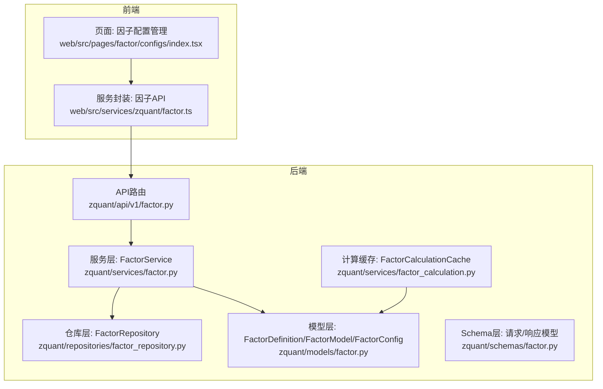
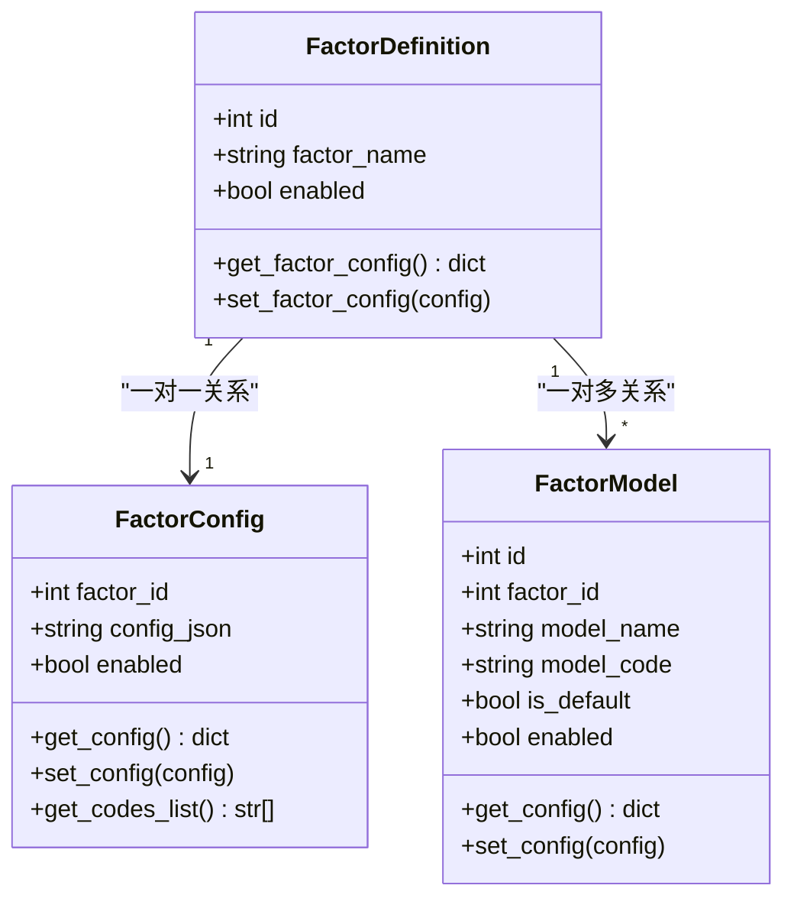
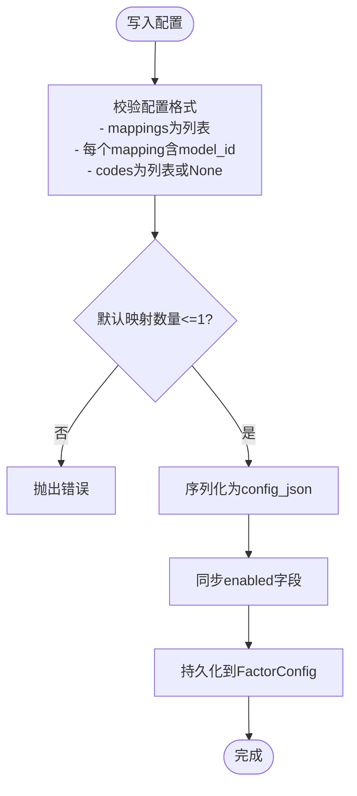
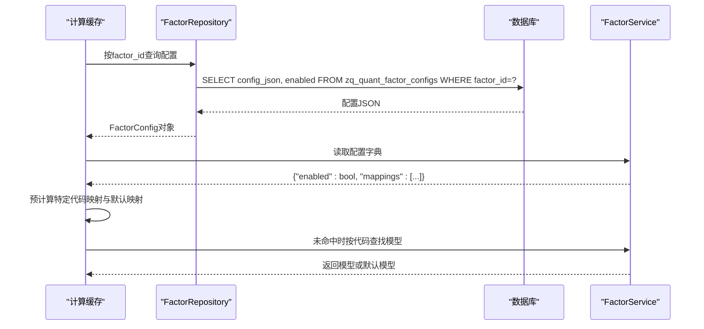
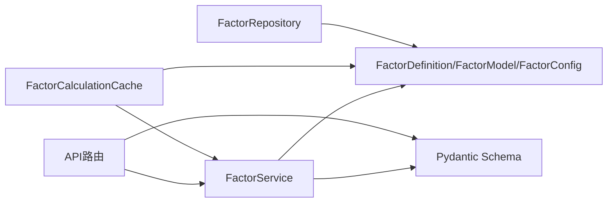

# 新因子配置系统

<cite>
**本文引用的文件**
- [zquant/models/factor.py](file://zquant/models/factor.py)
- [zquant/schemas/factor.py](file://zquant/schemas/factor.py)
- [zquant/api/v1/factor.py](file://zquant/api/v1/factor.py)
- [zquant/services/factor.py](file://zquant/services/factor.py)
- [zquant/repositories/factor_repository.py](file://zquant/repositories/factor_repository.py)
- [zquant/services/factor_calculation.py](file://zquant/services/factor_calculation.py)
- [zquant/scripts/init_factor.py](file://zquant/scripts/init_factor.py)
- [web/src/services/zquant/factor.ts](file://web/src/services/zquant/factor.ts)
- [web/src/pages/factor/configs/index.tsx](file://web/src/pages/factor/configs/index.tsx)
</cite>

## 目录
1. [简介](#简介)
2. [项目结构](#项目结构)
3. [核心组件](#核心组件)
4. [架构总览](#架构总览)
5. [详细组件分析](#详细组件分析)
6. [依赖分析](#依赖分析)
7. [性能考虑](#性能考虑)
8. [故障排查指南](#故障排查指南)
9. [结论](#结论)
10. [附录](#附录)

## 简介
本文件面向开发者，系统化阐述“新因子配置系统”的设计与实现，重点围绕以factor_id为主键的FactorConfig模型，解释config_json字段中JSON配置结构（enabled, mappings[model_id, codes]）的业务含义与校验规则，详述API端点（/api/v1/factor/configs）的CRUD用法，并给出通过FactorService进行配置管理的实际代码示例路径。同时，阐明enabled字段与config_json中enabled的同步机制，以及最佳实践（如何正确构建mappings数组以避免数据一致性问题）。

## 项目结构
新因子配置系统由以下层次组成：
- 数据模型层：FactorDefinition、FactorModel、FactorConfig
- 序列化Schema层：Pydantic模型，定义请求/响应结构
- API层：RESTful路由，提供创建、查询、更新、删除等端点
- 服务层：FactorService封装业务逻辑，负责配置校验、持久化与一致性控制
- 计算层：FactorCalculationCache在运行时读取配置，按代码匹配模型
- 前端：Web页面与服务封装，提供可视化配置界面与调用示例

图表来源
- [zquant/api/v1/factor.py](file://zquant/api/v1/factor.py#L289-L488)
- [zquant/services/factor.py](file://zquant/services/factor.py#L630-L766)
- [zquant/models/factor.py](file://zquant/models/factor.py#L147-L222)
- [zquant/schemas/factor.py](file://zquant/schemas/factor.py#L170-L292)
- [zquant/repositories/factor_repository.py](file://zquant/repositories/factor_repository.py#L101-L140)
- [zquant/services/factor_calculation.py](file://zquant/services/factor_calculation.py#L108-L195)
- [web/src/pages/factor/configs/index.tsx](file://web/src/pages/factor/configs/index.tsx#L1-L507)
- [web/src/services/zquant/factor.ts](file://web/src/services/zquant/factor.ts#L90-L203)

章节来源
- [zquant/api/v1/factor.py](file://zquant/api/v1/factor.py#L289-L488)
- [zquant/services/factor.py](file://zquant/services/factor.py#L630-L766)
- [zquant/models/factor.py](file://zquant/models/factor.py#L147-L222)
- [zquant/schemas/factor.py](file://zquant/schemas/factor.py#L170-L292)
- [zquant/repositories/factor_repository.py](file://zquant/repositories/factor_repository.py#L101-L140)
- [zquant/services/factor_calculation.py](file://zquant/services/factor_calculation.py#L108-L195)
- [web/src/pages/factor/configs/index.tsx](file://web/src/pages/factor/configs/index.tsx#L1-L507)
- [web/src/services/zquant/factor.ts](file://web/src/services/zquant/factor.ts#L90-L203)

## 核心组件
- FactorConfig模型（以factor_id为主键，config_json存储JSON配置）
- Pydantic Schema（FactorConfigCreate/Update/Response等）
- API端点（/configs 的CRUD）
- FactorService（配置校验、创建/更新/删除、查询）
- FactorCalculationCache（运行时读取配置，按代码匹配模型）

章节来源
- [zquant/models/factor.py](file://zquant/models/factor.py#L147-L222)
- [zquant/schemas/factor.py](file://zquant/schemas/factor.py#L170-L292)
- [zquant/api/v1/factor.py](file://zquant/api/v1/factor.py#L289-L400)
- [zquant/services/factor.py](file://zquant/services/factor.py#L630-L766)
- [zquant/services/factor_calculation.py](file://zquant/services/factor_calculation.py#L108-L195)

## 架构总览
新因子配置系统采用“以因子为中心”的配置模型，每个因子仅有一条配置记录（factor_id主键）。配置以JSON形式存储在FactorConfig.config_json中，结构包含：
- enabled：布尔值，控制该因子配置整体是否启用
- mappings：数组，每项包含model_id与codes
  - model_id：指向FactorModel的ID
  - codes：字符串数组或None，None表示默认配置（适用于未在其它映射中出现的股票）

图表来源
- [zquant/models/factor.py](file://zquant/models/factor.py#L35-L110)
- [zquant/models/factor.py](file://zquant/models/factor.py#L111-L145)
- [zquant/models/factor.py](file://zquant/models/factor.py#L147-L222)

章节来源
- [zquant/models/factor.py](file://zquant/models/factor.py#L35-L110)
- [zquant/models/factor.py](file://zquant/models/factor.py#L147-L222)

## 详细组件分析

### JSON配置结构与业务语义
- enabled
  - 作用：控制该因子配置整体是否生效
  - 存储位置：FactorConfig.enabled（物理字段）与config_json.enabled（JSON字段）
  - 同步机制：set_config在写入config_json的同时，同步更新enabled字段
- mappings
  - 每个映射项包含model_id与codes
  - codes为None或空数组时表示“默认配置”，用于未在其它映射中出现的股票
  - 默认配置最多允许一个；若存在多个默认映射，将触发校验错误

章节来源
- [zquant/models/factor.py](file://zquant/models/factor.py#L173-L222)
- [zquant/services/factor.py](file://zquant/services/factor.py#L630-L766)

### API端点（/api/v1/factor/configs）
- 创建因子配置
  - 方法：POST /api/v1/factor/configs
  - 权限：管理员
  - 请求体：FactorConfigCreate（包含factor_id、mappings、enabled）
  - 响应：FactorConfigResponse
  - 示例路径：[创建接口实现](file://zquant/api/v1/factor.py#L291-L311)
- 查询因子配置列表
  - 方法：GET /api/v1/factor/configs
  - 参数：skip、limit、enabled、order_by、order
  - 响应：FactorConfigListResponse
  - 示例路径：[列表接口实现](file://zquant/api/v1/factor.py#L313-L333)
- 查询单个因子配置
  - 方法：GET /api/v1/factor/configs/{factor_id}
  - 响应：FactorConfigResponse
  - 示例路径：[按ID查询实现](file://zquant/api/v1/factor.py#L335-L349)
- 更新因子配置
  - 方法：PUT /api/v1/factor/configs/{factor_id}
  - 权限：管理员
  - 请求体：FactorConfigUpdate（可选mappings、enabled）
  - 响应：FactorConfigResponse
  - 示例路径：[按ID更新实现](file://zquant/api/v1/factor.py#L351-L382)
- 删除因子配置
  - 方法：DELETE /api/v1/factor/configs/{factor_id}
  - 权限：管理员
  - 响应：204 No Content
  - 示例路径：[按ID删除实现](file://zquant/api/v1/factor.py#L384-L400)

章节来源
- [zquant/api/v1/factor.py](file://zquant/api/v1/factor.py#L289-L400)
- [zquant/schemas/factor.py](file://zquant/schemas/factor.py#L170-L292)

### 通过FactorService进行配置管理（代码示例路径）
- 创建配置
  - 路径：[创建配置实现](file://zquant/services/factor.py#L632-L684)
  - 关键点：校验factor_id存在、校验mappings中每个映射的model_id存在、默认映射数量限制为1、写入FactorConfig并同步enabled
- 查询配置
  - 路径：[按factor_id查询实现](file://zquant/services/factor.py#L687-L701)
- 更新配置
  - 路径：[按factor_id更新实现](file://zquant/services/factor.py#L704-L744)
  - 关键点：合并当前配置与传入变更，保持mappings完整性与默认映射唯一性
- 删除配置
  - 路径：[按factor_id删除实现](file://zquant/services/factor.py#L746-L766)

章节来源
- [zquant/services/factor.py](file://zquant/services/factor.py#L630-L766)

### enabled字段与config_json中enabled的同步机制
- 写入流程：set_config在写入config_json之前，会对配置进行格式校验，并将enabled字段同步到FactorConfig.enabled
- 读取流程：get_config优先从config_json解析，若解析失败则返回默认值（enabled=True，mappings=[]）
- 运行时影响：计算缓存会先判断config.enabled为真才进行后续映射匹配

图表来源
- [zquant/models/factor.py](file://zquant/models/factor.py#L173-L222)
- [zquant/services/factor.py](file://zquant/services/factor.py#L630-L766)

章节来源
- [zquant/models/factor.py](file://zquant/models/factor.py#L173-L222)
- [zquant/services/factor.py](file://zquant/services/factor.py#L630-L766)

### 运行时模型选择与默认映射
- 计算缓存加载时，会读取配置并预计算“代码->模型”映射
- 若某股票代码在所有映射的codes中均未出现，则使用默认映射（codes为空或None）所指向的模型
- 若不存在默认映射且未找到特定映射，则回退到因子定义的默认模型

图表来源
- [zquant/repositories/factor_repository.py](file://zquant/repositories/factor_repository.py#L101-L140)
- [zquant/services/factor_calculation.py](file://zquant/services/factor_calculation.py#L108-L195)
- [zquant/services/factor.py](file://zquant/services/factor.py#L579-L630)

章节来源
- [zquant/repositories/factor_repository.py](file://zquant/repositories/factor_repository.py#L101-L140)
- [zquant/services/factor_calculation.py](file://zquant/services/factor_calculation.py#L108-L195)
- [zquant/services/factor.py](file://zquant/services/factor.py#L579-L630)

### 前端使用示例（Web）
- 列表与编辑：页面组件提供因子配置列表、新增/编辑弹窗、默认模型提示
- API封装：服务模块封装GET/PUT/DELETE等调用
- 示例路径：
  - 页面组件：[页面实现](file://web/src/pages/factor/configs/index.tsx#L1-L507)
  - 服务封装：[服务实现](file://web/src/services/zquant/factor.ts#L90-L203)

章节来源
- [web/src/pages/factor/configs/index.tsx](file://web/src/pages/factor/configs/index.tsx#L1-L507)
- [web/src/services/zquant/factor.ts](file://web/src/services/zquant/factor.ts#L90-L203)

## 依赖分析
- 模型依赖
  - FactorDefinition 与 FactorConfig 为一对一关系，FactorDefinition 与 FactorModel 为一对多关系
  - FactorConfig 依赖 FactorDefinition 的外键约束
- API依赖
  - API路由依赖FactorService进行业务处理
  - API响应依赖Pydantic Schema进行序列化
- 计算依赖
  - 计算缓存依赖FactorRepository与FactorService读取配置
  - 计算逻辑依赖FactorModel的enabled过滤

图表来源
- [zquant/api/v1/factor.py](file://zquant/api/v1/factor.py#L289-L400)
- [zquant/services/factor.py](file://zquant/services/factor.py#L630-L766)
- [zquant/models/factor.py](file://zquant/models/factor.py#L35-L110)
- [zquant/schemas/factor.py](file://zquant/schemas/factor.py#L170-L292)
- [zquant/repositories/factor_repository.py](file://zquant/repositories/factor_repository.py#L101-L140)
- [zquant/services/factor_calculation.py](file://zquant/services/factor_calculation.py#L108-L195)

章节来源
- [zquant/api/v1/factor.py](file://zquant/api/v1/factor.py#L289-L400)
- [zquant/services/factor.py](file://zquant/services/factor.py#L630-L766)
- [zquant/models/factor.py](file://zquant/models/factor.py#L35-L110)
- [zquant/schemas/factor.py](file://zquant/schemas/factor.py#L170-L292)
- [zquant/repositories/factor_repository.py](file://zquant/repositories/factor_repository.py#L101-L140)
- [zquant/services/factor_calculation.py](file://zquant/services/factor_calculation.py#L108-L195)

## 性能考虑
- 查询优化
  - FactorConfig表以factor_id为主键，查询按因子快速定位
  - 提供enabled索引，便于筛选启用的配置
- 计算优化
  - 计算缓存预加载配置与模型，减少重复查询
  - 预计算“代码->模型”映射，提升运行时查找效率
- 数据一致性
  - 在创建/更新时严格校验默认映射唯一性，避免重复默认行为
  - 通过set_config自动同步enabled，保证配置与物理字段一致

[本节为通用指导，无需列出具体文件来源]

## 故障排查指南
- 常见错误与定位
  - 400 Bad Request：配置格式不合法（如mappings非列表、mapping缺少model_id、codes类型不符）
  - 400 Bad Request：默认映射超过1个
  - 404 Not Found：因子或配置不存在
  - 500 Internal Server Error：数据库异常或序列化失败
- 定位路径
  - API层：查看路由抛出的HTTP异常与错误详情
    - [创建/更新/删除接口](file://zquant/api/v1/factor.py#L291-L400)
  - 服务层：查看FactorService的校验与异常抛出
    - [创建/更新/删除实现](file://zquant/services/factor.py#L630-L766)
  - 模型层：查看set_config的校验逻辑与异常
    - [配置写入与同步](file://zquant/models/factor.py#L173-L222)
- 建议排查步骤
  - 确认factor_id存在且有效
  - 检查mappings中每个映射的model_id是否存在于FactorModel
  - 确保默认映射（codes为空或None）仅存在一个
  - 核对enabled字段与config_json.enabled是否一致（set_config会自动同步）

章节来源
- [zquant/api/v1/factor.py](file://zquant/api/v1/factor.py#L291-L400)
- [zquant/services/factor.py](file://zquant/services/factor.py#L630-L766)
- [zquant/models/factor.py](file://zquant/models/factor.py#L173-L222)

## 结论
新因子配置系统以FactorConfig为核心，采用以factor_id为主键的单记录配置模型，通过JSON结构清晰表达“模型-股票代码”映射关系，并在服务层与模型层实现了严格的校验与同步机制。API层提供标准RESTful接口，前端提供直观的配置界面。运行时计算缓存利用配置快速定位模型，保障性能与一致性。遵循默认映射唯一性与codes类型规范，可有效避免数据不一致问题。

[本节为总结性内容，无需列出具体文件来源]

## 附录

### 数据库初始化与表结构
- 初始化脚本创建了以factor_id为主键的因子配置表，包含config_json、enabled、索引与外键约束
- 示例路径：[初始化脚本](file://zquant/scripts/init_factor.py#L102-L116)

章节来源
- [zquant/scripts/init_factor.py](file://zquant/scripts/init_factor.py#L102-L116)

### 最佳实践清单
- 构建mappings时
  - 为每个股票代码仅在一个映射中出现，避免重复覆盖
  - 仅保留一个默认映射（codes为空或None），用于兜底未匹配的股票
  - codes字段使用字符串数组或None，不要使用空字符串或数字
- 配置更新时
  - 使用FactorConfigUpdate合并当前配置，避免丢失其它映射
  - 更新enabled时，注意与config_json.enabled同步（set_config已自动处理）
- 运行时使用
  - 若某股票未命中任何映射，将使用默认映射模型；若无默认映射，回退到因子默认模型
  - 通过FactorCalculationCache的预计算映射提升性能

章节来源
- [zquant/services/factor.py](file://zquant/services/factor.py#L630-L766)
- [zquant/services/factor_calculation.py](file://zquant/services/factor_calculation.py#L108-L195)
- [zquant/models/factor.py](file://zquant/models/factor.py#L173-L222)