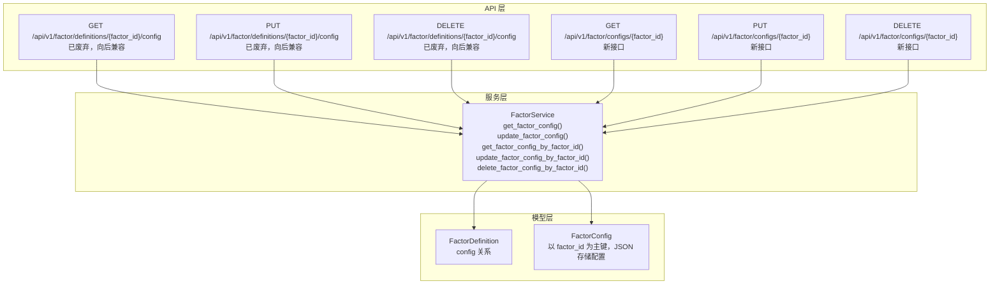
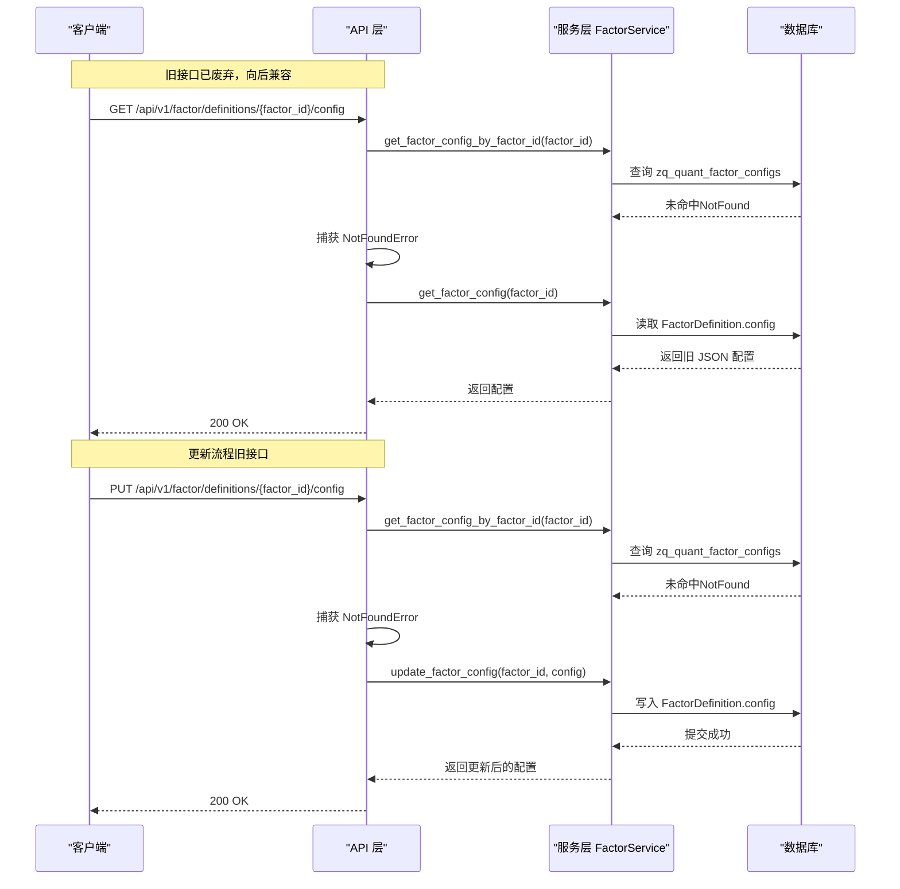
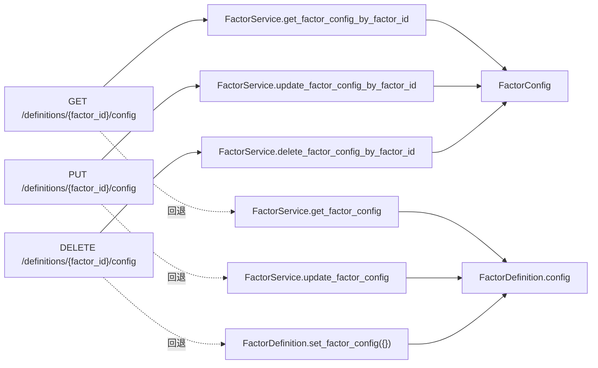

# 旧配置兼容性机制

<cite>
**本文引用的文件**
- [zquant/api/v1/factor.py](file://zquant/api/v1/factor.py)
- [zquant/services/factor.py](file://zquant/services/factor.py)
- [zquant/models/factor.py](file://zquant/models/factor.py)
- [web/src/services/zquant/factor.ts](file://web/src/services/zquant/factor.ts)
- [zquant/scripts/init_factor.py](file://zquant/scripts/init_factor.py)
- [docs/factor_management.md](file://docs/factor_management.md)
</cite>

## 目录
1. [简介](#简介)
2. [项目结构](#项目结构)
3. [核心组件](#核心组件)
4. [架构总览](#架构总览)
5. [详细组件分析](#详细组件分析)
6. [依赖关系分析](#依赖关系分析)
7. [性能考量](#性能考量)
8. [故障排查指南](#故障排查指南)
9. [结论](#结论)
10. [附录](#附录)

## 简介
本文件系统化阐述旧因子配置兼容性机制，重点说明以下内容：
- 旧接口与新接口的对应关系：/api/v1/factor/definitions/{factor_id}/config（已废弃，向后兼容）与 /api/v1/factor/configs/{factor_id}（新接口）。
- 当新表 zq_quant_factor_configs 中不存在配置时，系统如何回退到旧的因子定义表 zq_quant_factor_definitions 的配置。
- 在更新与删除操作中，系统优先尝试新表，失败后再回退到旧表的兼容逻辑。
- 服务层 FactorService 中 get_factor_config 与 update_factor_config 等方法的兼容性实现要点。
- 迁移指南：如何将旧配置数据平滑迁移到新表结构，并强调新 API 端点的使用优先级。

## 项目结构
围绕因子配置的后向兼容，涉及三层关键位置：
- API 层：提供旧接口与新接口，旧接口内部实现兼容逻辑，新接口直接对接新表。
- 服务层：统一在 FactorService 中实现配置读取、更新、删除的兼容策略。
- 模型层：FactorDefinition 与 FactorConfig 分别承载旧/新配置结构，后者以 factor_id 为主键，JSON 存储配置。

图表来源
- [zquant/api/v1/factor.py](file://zquant/api/v1/factor.py#L404-L491)
- [zquant/api/v1/factor.py](file://zquant/api/v1/factor.py#L335-L399)
- [zquant/services/factor.py](file://zquant/services/factor.py#L526-L765)
- [zquant/models/factor.py](file://zquant/models/factor.py#L35-L110)
- [zquant/models/factor.py](file://zquant/models/factor.py#L147-L222)

章节来源
- [zquant/api/v1/factor.py](file://zquant/api/v1/factor.py#L335-L491)
- [zquant/services/factor.py](file://zquant/services/factor.py#L526-L765)
- [zquant/models/factor.py](file://zquant/models/factor.py#L35-L222)

## 核心组件
- 旧接口（向后兼容）：
  - GET /api/v1/factor/definitions/{factor_id}/config：优先从新表取配置；若新表不存在则回退到旧表 JSON 配置。
  - PUT /api/v1/factor/definitions/{factor_id}/config：优先更新新表；若新表不存在则更新旧表 JSON 配置。
  - DELETE /api/v1/factor/definitions/{factor_id}/config：优先删除新表；若新表不存在则清空旧表 JSON 配置。
- 新接口（推荐使用）：
  - GET /api/v1/factor/configs/{factor_id}：直接读取新表配置。
  - PUT /api/v1/factor/configs/{factor_id}：直接更新新表配置。
  - DELETE /api/v1/factor/configs/{factor_id}：直接删除新表配置。
- 服务层关键方法：
  - get_factor_config(db, factor_id)：从 FactorDefinition.config 关系读取旧 JSON 配置。
  - update_factor_config(db, factor_id, factor_config)：写入旧 JSON 配置。
  - get_factor_config_by_factor_id(db, factor_id)：从 FactorConfig 读取新 JSON 配置。
  - update_factor_config_by_factor_id(db, factor_id, config, updated_by)：更新新表配置。
  - delete_factor_config_by_factor_id(db, factor_id)：删除新表配置。
- 模型层关键结构：
  - FactorDefinition：包含 config 关系，提供 get_factor_config/set_factor_config。
  - FactorConfig：以 factor_id 为主键，config_json 字段存储 JSON 配置，提供 get_config/set_config。

章节来源
- [zquant/api/v1/factor.py](file://zquant/api/v1/factor.py#L404-L491)
- [zquant/api/v1/factor.py](file://zquant/api/v1/factor.py#L335-L399)
- [zquant/services/factor.py](file://zquant/services/factor.py#L526-L765)
- [zquant/models/factor.py](file://zquant/models/factor.py#L35-L110)
- [zquant/models/factor.py](file://zquant/models/factor.py#L147-L222)

## 架构总览
下图展示“旧接口兼容新表”的控制流与数据流向。

图表来源
- [zquant/api/v1/factor.py](file://zquant/api/v1/factor.py#L404-L491)
- [zquant/services/factor.py](file://zquant/services/factor.py#L526-L765)
- [zquant/models/factor.py](file://zquant/models/factor.py#L35-L110)
- [zquant/models/factor.py](file://zquant/models/factor.py#L147-L222)

## 详细组件分析

### 旧接口的兼容性实现（GET/PUT/DELETE）
- GET /api/v1/factor/definitions/{factor_id}/config
  - 优先尝试从新表 zq_quant_factor_configs 读取配置；若 NotFound，则回退到旧表 FactorDefinition.config。
  - 返回格式为 JSON 字典，包含 enabled 与 mappings。
- PUT /api/v1/factor/definitions/{factor_id}/config
  - 优先尝试更新新表；若 NotFound，则回退到旧表 JSON 配置更新。
  - 支持传入新的 JSON 配置结构，服务层会校验并写入。
- DELETE /api/v1/factor/definitions/{factor_id}/config
  - 优先尝试删除新表；若 NotFound，则清空旧表 JSON 配置（set_factor_config({}))。

章节来源
- [zquant/api/v1/factor.py](file://zquant/api/v1/factor.py#L404-L491)

### 服务层兼容性方法
- get_factor_config(db, factor_id)
  - 从 FactorDefinition.config 关系读取旧 JSON 配置；若无配置则返回默认结构。
- update_factor_config(db, factor_id, factor_config)
  - 校验每个 mapping 的 model_id 存在性，限制默认配置唯一性，然后写入 FactorDefinition.config。
- get_factor_config_by_factor_id(db, factor_id)
  - 从 FactorConfig 读取新 JSON 配置；若无配置则抛出 NotFoundError。
- update_factor_config_by_factor_id(db, factor_id, config, updated_by)
  - 校验新配置结构与模型存在性，写入 FactorConfig.config_json 并同步 enabled。
- delete_factor_config_by_factor_id(db, factor_id)
  - 删除 FactorConfig 记录。

章节来源
- [zquant/services/factor.py](file://zquant/services/factor.py#L526-L765)
- [zquant/models/factor.py](file://zquant/models/factor.py#L35-L110)
- [zquant/models/factor.py](file://zquant/models/factor.py#L147-L222)

### 模型层数据结构与约束
- FactorDefinition
  - config 关系指向 FactorConfig；若无配置则返回默认结构。
  - set_factor_config 会验证并写入配置字典。
- FactorConfig
  - 以 factor_id 为主键，config_json 存储 JSON 配置。
  - get_config/set_config 负责序列化/反序列化与格式校验。
  - enabled 字段与 JSON 中 enabled 同步。

章节来源
- [zquant/models/factor.py](file://zquant/models/factor.py#L35-L110)
- [zquant/models/factor.py](file://zquant/models/factor.py#L147-L222)

### 前端服务与新接口
- 前端服务文件提供新接口的封装：
  - GET /api/v1/factor/configs/{factor_id}
  - PUT /api/v1/factor/configs/{factor_id}
  - DELETE /api/v1/factor/configs/{factor_id}
- 旧接口（GET/PUT/DELETE /definitions/{factor_id}/config）仍保留，但标注为“已废弃”，用于向后兼容。

章节来源
- [web/src/services/zquant/factor.ts](file://web/src/services/zquant/factor.ts#L111-L148)
- [web/src/services/zquant/factor.ts](file://web/src/services/zquant/factor.ts#L150-L203)

### 数据库初始化与迁移
- 初始化脚本会创建新表 zq_quant_factor_configs，并补充缺失列（如 config_json、enabled 等）。
- 若检测到旧表结构（存在 id 列），会提示需运行迁移脚本重构表结构。
- 文档中对旧表结构的字段说明可用于理解迁移目标。

章节来源
- [zquant/scripts/init_factor.py](file://zquant/scripts/init_factor.py#L102-L116)
- [zquant/scripts/init_factor.py](file://zquant/scripts/init_factor.py#L207-L234)
- [docs/factor_management.md](file://docs/factor_management.md#L47-L58)

## 依赖关系分析
- API 层依赖服务层；服务层依赖模型层；模型层依赖数据库表。
- 旧接口在 API 层捕获 NotFoundError 后，调用服务层旧方法回退到旧表。
- 新接口直接调用服务层新方法，避免回退逻辑，提升一致性与性能。

图表来源
- [zquant/api/v1/factor.py](file://zquant/api/v1/factor.py#L404-L491)
- [zquant/services/factor.py](file://zquant/services/factor.py#L526-L765)
- [zquant/models/factor.py](file://zquant/models/factor.py#L35-L110)
- [zquant/models/factor.py](file://zquant/models/factor.py#L147-L222)

## 性能考量
- 旧接口在新表不存在时会额外访问旧表，增加一次数据库读取；建议优先使用新接口以减少分支判断。
- 新接口直接读取新表，无需回退，性能更稳定。
- 配置读取与写入均走 ORM，注意在高并发场景下合理使用连接池与事务边界。

## 故障排查指南
- NotFoundError
  - 新表查询不到配置时会抛出 NotFoundError；旧接口会捕获并回退到旧表。
  - 新接口直接抛出 NotFoundError，需检查 factor_id 是否正确或是否已创建配置。
- 配置格式错误
  - 服务层在 set_config/get_config 中对 JSON 结构进行校验，若格式不合法会抛出异常。
- 权限不足
  - 更新/删除旧接口需要管理员权限；若无权限会返回 403。
- 旧表结构不一致
  - 初始化脚本会检测并补充缺失列；若仍报错，确认是否执行了脚本或手动修复表结构。

章节来源
- [zquant/api/v1/factor.py](file://zquant/api/v1/factor.py#L404-L491)
- [zquant/services/factor.py](file://zquant/services/factor.py#L526-L765)
- [zquant/models/factor.py](file://zquant/models/factor.py#L147-L222)
- [zquant/scripts/init_factor.py](file://zquant/scripts/init_factor.py#L207-L234)

## 结论
- 旧接口通过在 API 层捕获 NotFoundError 并回退到旧表的方式，实现了对历史配置的无缝兼容。
- 新接口直接对接新表，具备更高的稳定性与性能，应作为默认选择。
- 服务层在 FactorService 中集中实现兼容逻辑，便于维护与扩展。
- 迁移时应优先使用新接口与新表结构，逐步清理旧表 JSON 配置。

## 附录

### 迁移指南（如何将旧配置平滑迁移到新表）
- 步骤概览
  - 确认新表结构已就绪（包含 config_json、enabled 等列）。
  - 逐因子读取旧 JSON 配置（FactorDefinition.config）。
  - 使用新接口 PUT /api/v1/factor/configs/{factor_id} 写入新表 JSON 配置。
  - 校验新表读取结果与旧表预期一致。
  - 清理旧表 JSON 配置（可选，旧接口 DELETE /definitions/{factor_id}/config 会清空旧 JSON）。
- 注意事项
  - 旧接口标注为“已废弃”，建议尽快切换至新接口。
  - 迁移过程中保持业务连续性，建议分批进行并做好回滚预案。

章节来源
- [zquant/api/v1/factor.py](file://zquant/api/v1/factor.py#L404-L491)
- [zquant/api/v1/factor.py](file://zquant/api/v1/factor.py#L335-L399)
- [zquant/services/factor.py](file://zquant/services/factor.py#L526-L765)
- [zquant/models/factor.py](file://zquant/models/factor.py#L35-L110)
- [zquant/models/factor.py](file://zquant/models/factor.py#L147-L222)
- [zquant/scripts/init_factor.py](file://zquant/scripts/init_factor.py#L102-L116)
- [docs/factor_management.md](file://docs/factor_management.md#L47-L58)