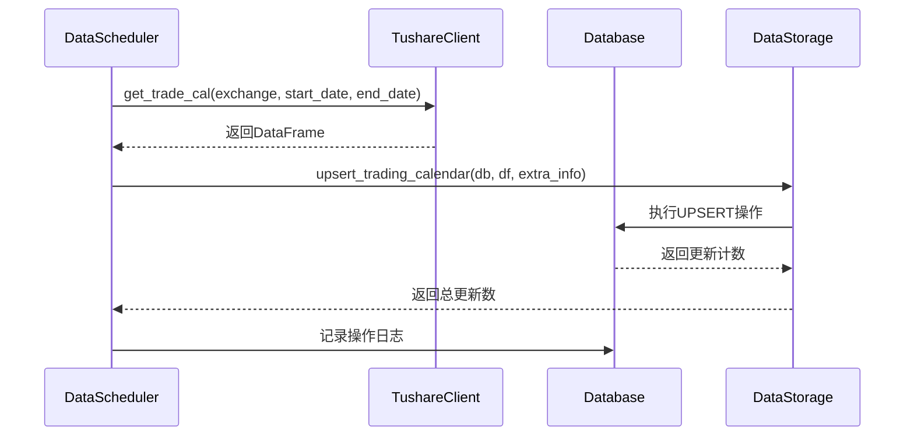
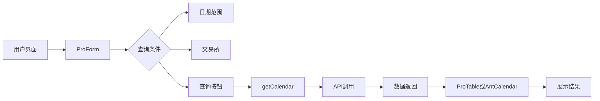
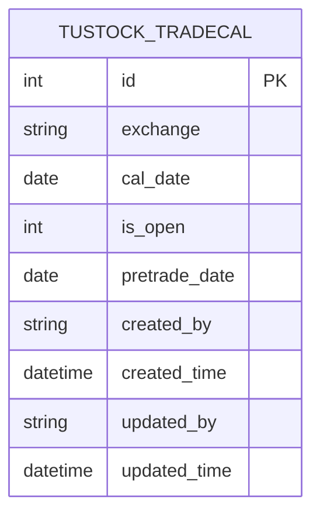

# 交易日历接口

<cite>
**本文档引用的文件**   
- [data.py](file://zquant/api/v1/data.py)
- [calendar.tsx](file://web/src/pages/data/calendar.tsx)
- [sync_trading_calendar.py](file://zquant/scheduler/job/sync_trading_calendar.py)
- [scheduler.py](file://zquant/data/etl/scheduler.py)
- [tushare.py](file://zquant/data/etl/tushare.py)
- [data.py](file://zquant/models/data.py)
- [data.py](file://zquant/services/data.py)
- [data.py](file://zquant/schemas/data.py)
</cite>

## 目录
1. [交易日历接口](#交易日历接口)
2. [核心功能概述](#核心功能概述)
3. [API端点详解](#api端点详解)
4. [ETL流程与数据同步](#etl流程与数据同步)
5. [前端组件集成](#前端组件集成)
6. [数据模型与结构](#数据模型与结构)
7. [错误处理与日志](#错误处理与日志)

## 核心功能概述

交易日历接口是系统中用于获取A股市场交易日历信息的核心服务。该接口提供了对交易日、非交易日及节假日的精确标记，支持按日期范围查询，并通过ETL流程确保数据的实时性和准确性。系统通过`/api/v1/data/trading-calendar`端点提供数据访问，同时利用`sync_trading_calendar.py`脚本定期从Tushare数据源同步最新日历数据，保证数据库与源的一致性。此功能为量化分析、回测和交易策略的制定提供了基础的时间框架支持。

**Section sources**
- [data.py](file://zquant/api/v1/data.py#L333-L457)
- [scheduler.py](file://zquant/data/etl/scheduler.py#L315-L388)

## API端点详解

交易日历API端点`/api/v1/data/calendar`支持通过POST请求获取指定日期范围内的交易日历信息。请求体需包含`start_date`、`end_date`和可选的`exchange`参数。`exchange`参数默认为SSE（上交所），可选值包括SSE和SZSE（深交所）。该端点返回一个包含交易日历项的列表，每个项包含交易所、日历日期、是否交易等字段。此外，系统还提供了`/calendar/fetch-from-api`端点用于直接从Tushare接口获取数据，以及`/calendar/validate`端点用于校验数据库与接口数据的一致性。

```mermaid
flowchart TD
A[客户端请求] --> B{请求类型}
B --> |获取日历| C[/api/v1/data/calendar]
B --> |从API获取| D[/api/v1/data/calendar/fetch-from-api]
B --> |数据校验| E[/api/v1/data/calendar/validate]
C --> F[查询数据库]
D --> G[调用Tushare API]
E --> H[对比数据库与API数据]
F --> I[返回日历数据]
G --> J[返回API数据]
H --> K[返回校验结果]
```

**Diagram sources **
- [data.py](file://zquant/api/v1/data.py#L333-L457)

**Section sources**
- [data.py](file://zquant/api/v1/data.py#L333-L457)
- [data.py](file://zquant/schemas/data.py#L50-L86)

## ETL流程与数据同步

系统的ETL流程通过`sync_trading_calendar.py`脚本实现，该脚本作为定时任务定期执行。脚本通过`DataScheduler`类的`sync_trading_calendar`方法，从Tushare数据源获取交易日历数据，并将其同步到本地数据库。同步过程包括验证和格式化日期、调用Tushare API获取数据、将数据插入或更新到数据库，以及记录操作日志。默认情况下，脚本会同步上交所和深交所的交易日历，日期范围为过去一年到未来一年。此流程确保了本地数据的实时性和完整性。



**Diagram sources **
- [sync_trading_calendar.py](file://zquant/scheduler/job/sync_trading_calendar.py#L68-L91)
- [scheduler.py](file://zquant/data/etl/scheduler.py#L315-L388)

**Section sources**
- [sync_trading_calendar.py](file://zquant/scheduler/job/sync_trading_calendar.py#L61-L104)
- [scheduler.py](file://zquant/data/etl/scheduler.py#L315-L388)
- [tushare.py](file://zquant/data/etl/tushare.py#L254-L273)

## 前端组件集成

前端通过`calendar.tsx`组件集成了交易日历功能。该组件提供了表格视图和日历视图两种展示模式，用户可以通过表单选择日期范围和交易所进行查询。组件通过`getCalendar`服务调用API获取数据，并将结果展示在表格或日历中。日历视图使用Ant Design的Calendar组件，通过自定义单元格渲染函数，直观地显示交易日和非交易日。此外，组件还提供了“接口数据获取”和“数据校验”按钮，方便用户直接与Tushare API交互和验证数据一致性。



**Diagram sources **
- [calendar.tsx](file://web/src/pages/data/calendar.tsx#L38-L728)

**Section sources**
- [calendar.tsx](file://web/src/pages/data/calendar.tsx#L29-L364)
- [data.ts](file://web/src/services/zquant/data.ts)

## 数据模型与结构

交易日历的数据模型定义在`TustockTradecal`类中，该类映射到数据库表`zq_data_tustock_tradecal`。模型包含`id`、`exchange`、`cal_date`、`is_open`、`pretrade_date`等字段，其中`exchange`和`cal_date`构成唯一约束，确保同一交易所同一日期只有一条记录。`is_open`字段用于标记是否为交易日，值为1表示交易日，0表示非交易日。该模型通过SQLAlchemy ORM管理，支持高效的数据库操作。



**Diagram sources **
- [data.py](file://zquant/models/data.py#L134-L173)

**Section sources**
- [data.py](file://zquant/models/data.py#L134-L173)
- [data.py](file://zquant/schemas/data.py#L68-L86)

## 错误处理与日志

系统在交易日历功能中实现了全面的错误处理和日志记录机制。在API层面，使用`@handle_data_api_error`装饰器捕获和处理异常，确保返回一致的错误响应。在ETL流程中，`sync_trading_calendar`方法通过try-except块捕获异常，并在失败时记录操作日志。日志信息包括操作类型、结果、开始和结束时间、插入和更新的记录数等，便于问题排查和性能监控。所有日志通过`loguru`库输出，支持不同级别的日志记录。

**Section sources**
- [data.py](file://zquant/api/v1/data.py#L344-L401)
- [scheduler.py](file://zquant/data/etl/scheduler.py#L389-L414)
- [data.py](file://zquant/services/data.py#L450-L507)