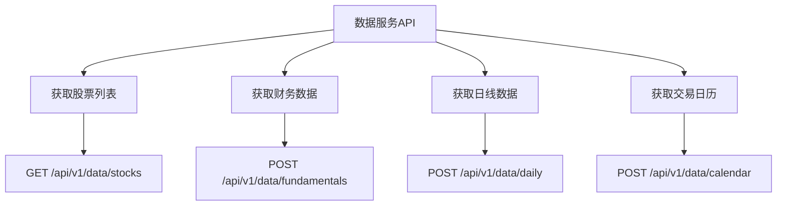
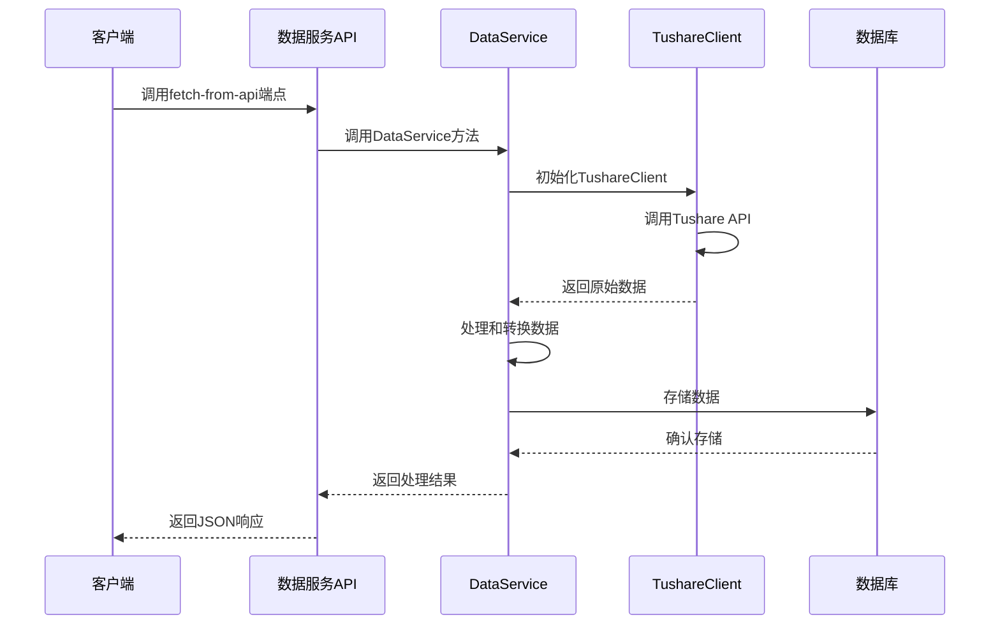
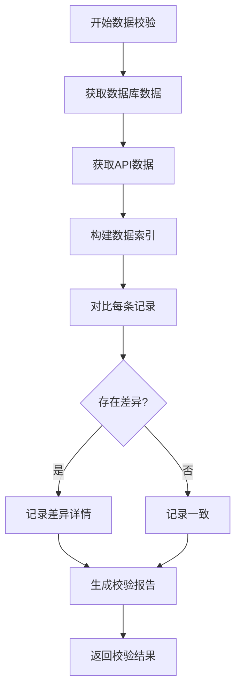
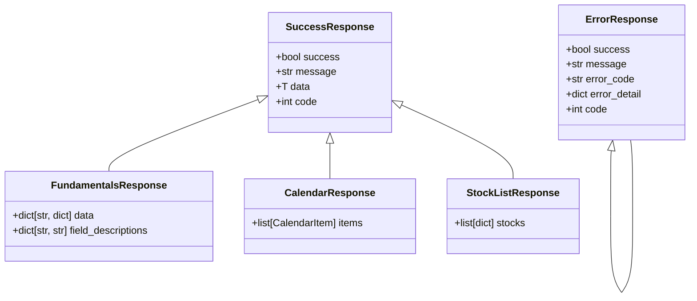

# 数据服务API

<cite>
**本文档引用的文件**   
- [data.py](file://zquant/api/v1/data.py)
- [data.py](file://zquant/services/data.py)
- [data.py](file://zquant/schemas/data.py)
- [stock_repository.py](file://zquant/repositories/stock_repository.py)
- [trading_date_repository.py](file://zquant/repositories/trading_date_repository.py)
- [tushare.py](file://zquant/data/etl/tushare.py)
- [decorators.py](file://zquant/api/decorators.py)
- [response.py](file://zquant/schemas/response.py)
</cite>

## 目录
1. [简介](#简介)
2. [核心数据接口](#核心数据接口)
3. [数据获取工作流程](#数据获取工作流程)
4. [数据校验机制](#数据校验机制)
5. [统一响应格式](#统一响应格式)
6. [最佳实践](#最佳实践)

## 简介
zquant数据服务API为量化分析平台提供核心数据支持，涵盖股票列表、财务数据、日线数据和交易日历等关键金融数据。API通过Tushare等外部数据源获取数据，并提供数据校验功能以确保数据一致性。系统采用分层架构，包含API路由、业务服务、数据存储和ETL处理等组件，确保数据的高效获取、存储和查询。

**Section sources**
- [data.py](file://zquant/api/v1/data.py#L1-L2143)
- [README.md](file://README.md#L1-L640)

## 核心数据接口

数据服务API提供了获取核心金融数据的端点，包括股票列表、财务数据、日线数据和交易日历。

**Diagram sources**
- [data.py](file://zquant/api/v1/data.py#L540-L547)
- [data.py](file://zquant/api/v1/data.py#L97-L104)
- [data.py](file://zquant/api/v1/data.py#L722-L730)
- [data.py](file://zquant/api/v1/data.py#L333-L341)

### 获取股票列表
`GET /api/v1/data/stocks`端点用于获取股票列表，支持按交易所、股票代码或股票名称进行查询。该接口通过`DataService.get_stock_list`方法实现，该方法使用`StockRepository`来查询数据库中的股票信息。

**Section sources**
- [data.py](file://zquant/api/v1/data.py#L540-L547)
- [data.py](file://zquant/services/data.py#L203-L231)
- [stock_repository.py](file://zquant/repositories/stock_repository.py#L175-L231)

### 获取财务数据
`POST /api/v1/data/fundamentals`端点用于获取财务数据，需要提供股票代码列表、报表类型和报告期。该接口通过`DataService.get_fundamentals`方法实现，支持利润表、资产负债表和现金流量表等财务报表。

**Section sources**
- [data.py](file://zquant/api/v1/data.py#L97-L104)
- [data.py](file://zquant/services/data.py#L46-L164)

### 获取日线数据
`POST /api/v1/data/daily`端点用于获取日线数据，支持指定股票代码、开始日期和结束日期。该接口通过`DataService.get_daily_data`方法实现，返回包含开盘价、收盘价、成交量等信息的日线数据。

**Section sources**
- [data.py](file://zquant/api/v1/data.py#L722-L730)
- [data.py](file://zquant/services/data.py#L234-L275)

### 获取交易日历
`POST /api/v1/data/calendar`端点用于获取交易日历，支持指定开始日期、结束日期和交易所。该接口通过`DataService.get_trading_calendar`方法实现，返回指定日期范围内的交易日信息。

**Section sources**
- [data.py](file://zquant/api/v1/data.py#L333-L341)
- [data.py](file://zquant/services/data.py#L167-L200)
- [trading_date_repository.py](file://zquant/repositories/trading_date_repository.py#L172-L217)

## 数据获取工作流程

从Tushare等外部数据源获取数据的工作流程涉及API调用、数据处理和存储等步骤。

**Diagram sources**
- [data.py](file://zquant/api/v1/data.py#L107-L194)
- [data.py](file://zquant/api/v1/data.py#L733-L834)
- [tushare.py](file://zquant/data/etl/tushare.py#L39-L77)

### Tushare客户端初始化
`TushareClient`类负责与Tushare API进行交互。在初始化时，它会从数据库配置中获取Tushare Token，并使用该Token初始化Tushare API连接。

**Section sources**
- [tushare.py](file://zquant/data/etl/tushare.py#L39-L77)

### 数据获取和处理
数据获取端点（如`fetch_fundamentals_from_api`）会调用`TushareClient`的相关方法来获取数据。获取到的数据会被转换为字典列表，并通过`clean_nan_values`函数清理NaN值，以确保JSON序列化正常。

**Section sources**
- [data.py](file://zquant/api/v1/data.py#L117-L177)
- [tushare.py](file://zquant/data/etl/tushare.py#L145-L149)

## 数据校验机制

数据校验接口用于对比数据库中的数据与从API获取的数据，确保数据的一致性。

**Diagram sources**
- [data.py](file://zquant/api/v1/data.py#L197-L330)
- [data.py](file://zquant/api/v1/data.py#L837-L1076)

### 财务数据校验
财务数据校验通过`validate_fundamentals`端点实现。该过程会获取数据库中的财务数据和从Tushare API获取的财务数据，然后按股票代码和报告期进行对比，识别出缺失或字段不一致的记录。

**Section sources**
- [data.py](file://zquant/api/v1/data.py#L197-L330)

### 交易日历数据校验
交易日历数据校验通过`validate_calendar`端点实现。该过程会获取数据库中的交易日历数据和从Tushare API获取的交易日历数据，然后按交易所和日期构建索引，对比每条记录的字段值。

**Section sources**
- [data.py](file://zquant/api/v1/data.py#L404-L537)

## 统一响应格式

数据服务API采用统一的响应格式，确保所有接口返回一致的结构。

**Diagram sources**
- [response.py](file://zquant/schemas/response.py#L36-L122)
- [data.py](file://zquant/schemas/data.py#L58-L86)
- [data.py](file://zquant/schemas/data.py#L82-L86)
- [data.py](file://zquant/schemas/data.py#L96-L99)

### 成功响应
所有成功的API调用都返回`SuccessResponse`或其子类。响应包含`success`、`message`、`data`和`code`字段，其中`data`字段包含具体的响应数据。

**Section sources**
- [response.py](file://zquant/schemas/response.py#L54-L67)

### 错误响应
当API调用失败时，返回`ErrorResponse`。响应包含`success`、`message`、`error_code`、`error_detail`和`code`字段，提供详细的错误信息。

**Section sources**
- [response.py](file://zquant/schemas/response.py#L69-L92)
- [decorators.py](file://zquant/api/decorators.py#L39-L67)

## 最佳实践

为开发者提供高效查询和数据同步的最佳实践。

### 高效查询
- 使用缓存：`DataService`中的方法（如`get_trading_calendar`和`get_daily_data`）使用Redis缓存结果，减少数据库查询。
- 批量操作：`StockRepository`提供批量查询方法，减少数据库往返次数。
- 分页查询：对于大量数据的查询，使用分页参数限制返回记录数。

**Section sources**
- [data.py](file://zquant/services/data.py#L174-L199)
- [data.py](file://zquant/services/data.py#L245-L274)
- [stock_repository.py](file://zquant/repositories/stock_repository.py#L88-L132)

### 数据同步
- 定时任务：使用调度器定期同步数据，确保数据的及时性。
- 增量同步：只同步新增或更新的数据，减少网络和计算开销。
- 错误处理：在数据同步过程中捕获和处理异常，确保任务的稳定性。

**Section sources**
- [data.py](file://zquant/api/v1/data.py#L107-L194)
- [data.py](file://zquant/api/v1/data.py#L733-L834)
- [tushare.py](file://zquant/data/etl/tushare.py#L79-L132)