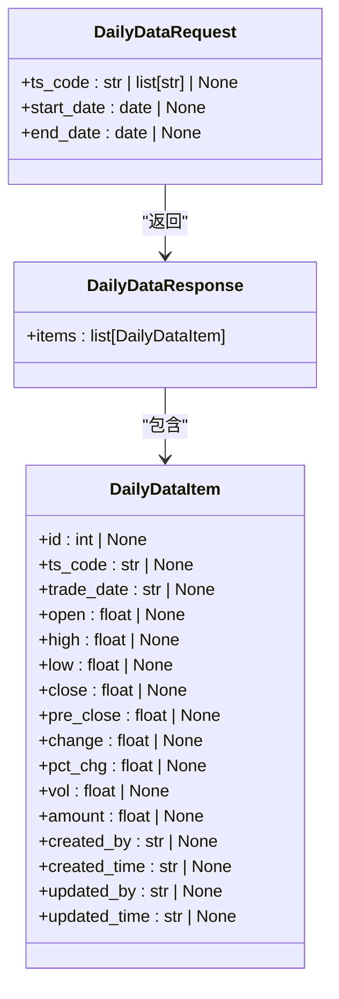
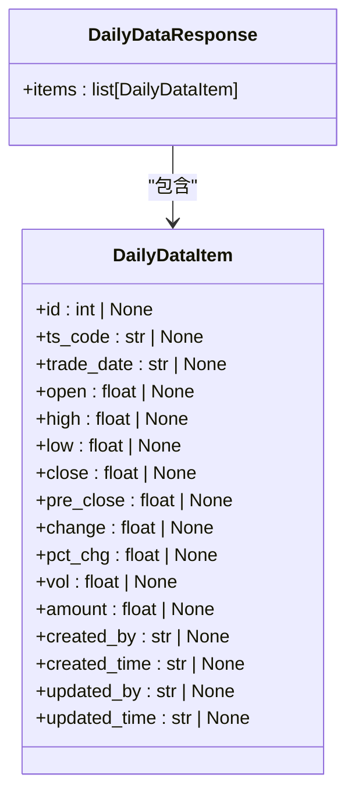
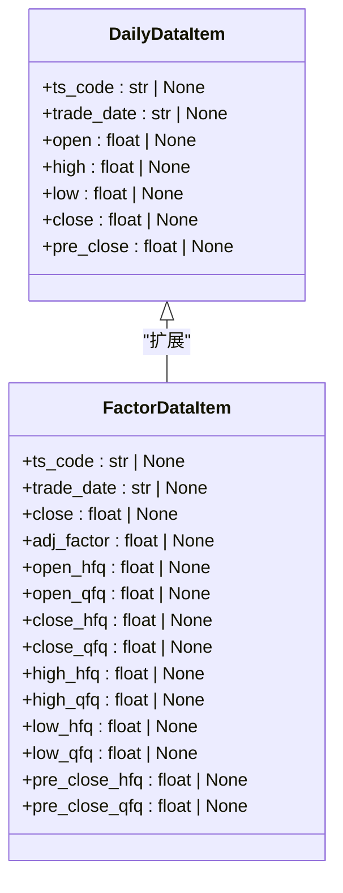
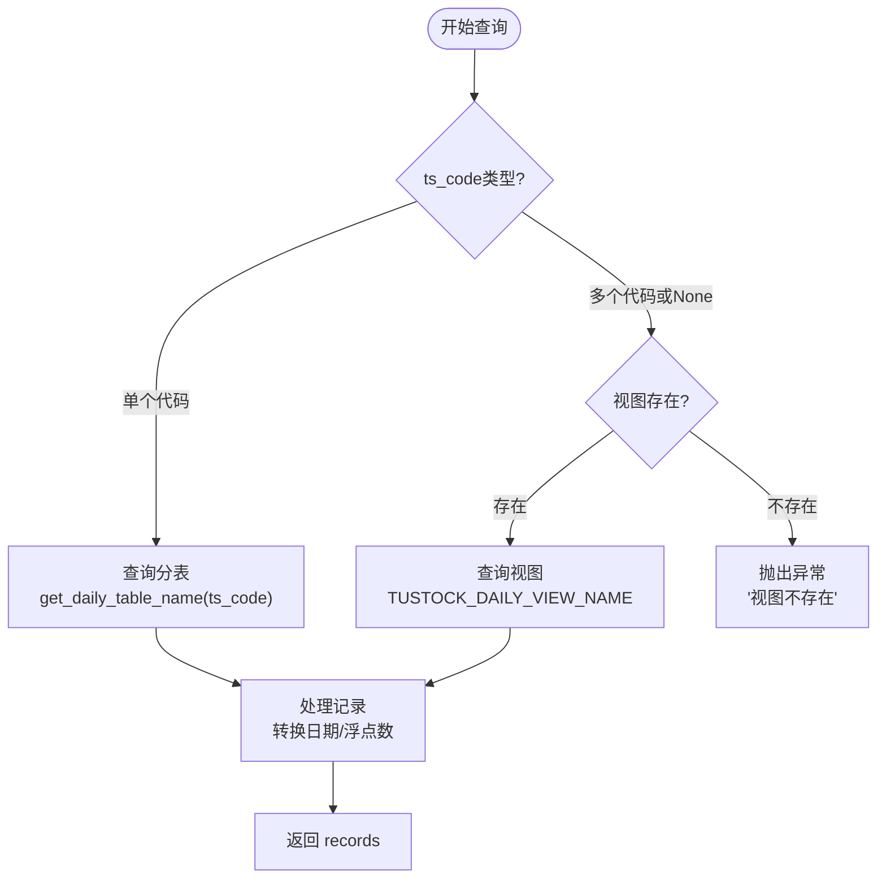

# 日线数据接口

<cite>
**本文档引用的文件**  
- [data.py](file://zquant/api/v1/data.py)
- [processor.py](file://zquant/data/processor.py)
- [data.py](file://zquant/schemas/data.py)
- [data.py](file://zquant/models/data.py)
- [data.py](file://zquant/services/data.py)
- [price_data_repository.py](file://zquant/repositories/price_data_repository.py)
</cite>

## 目录
1. [简介](#简介)
2. [接口端点与请求参数](#接口端点与请求参数)
3. [数据返回格式](#数据返回格式)
4. [时间范围与复权类型](#时间范围与复权类型)
5. [数据预处理逻辑](#数据预处理逻辑)
6. [高频查询最佳实践](#高频查询最佳实践)
7. [总结](#总结)

## 简介
日线数据接口 `/api/v1/data/daily` 是系统中用于获取股票日K线行情数据的核心API。该接口不仅提供基础的开盘价、收盘价、最高价、最低价、成交量和成交额等信息，还支持复权因子查询，并通过高效的预处理逻辑优化查询性能。本文档将深入分析该接口的实现细节，包括其支持的时间范围、复权类型（前复权/后复权）和频率控制机制，并解释 `processor.py` 中数据预处理逻辑如何提升查询效率。最后，将提供在高频查询场景下的最佳实践建议。

**Section sources**
- [data.py](file://zquant/api/v1/data.py#L722-L731)

## 接口端点与请求参数
日线数据接口通过 `/api/v1/data/daily` 端点提供服务，采用POST方法接收请求。其核心请求参数定义在 `DailyDataRequest` 模型中，支持灵活的数据查询。



**Diagram sources**
- [data.py](file://zquant/schemas/data.py#L102-L108)
- [data.py](file://zquant/schemas/data.py#L110-L129)
- [data.py](file://zquant/api/v1/data.py#L722-L731)

### 请求参数说明
- **ts_code**: 可选参数，指定要查询的股票TS代码。支持单个代码（如 `"000001.SZ"`）、代码列表（如 `["000001.SZ", "000002.SZ"]`）或 `None`（查询所有股票）。
- **start_date**: 可选参数，指定查询的开始日期。
- **end_date**: 可选参数，指定查询的结束日期。

当 `ts_code` 为单个代码时，系统会直接查询对应的分表以获得最佳性能；当为多个代码或 `None` 时，系统会查询一个预先创建的视图（`zq_data_tustock_daily_view`），该视图整合了所有股票的日线数据分表。

**Section sources**
- [data.py](file://zquant/schemas/data.py#L102-L108)
- [processor.py](file://zquant/data/processor.py#L101-L115)

## 数据返回格式
接口的响应数据结构清晰，便于客户端解析和使用。



**Diagram sources**
- [data.py](file://zquant/schemas/data.py#L131-L135)
- [data.py](file://zquant/schemas/data.py#L110-L129)

### 响应字段说明
- **items**: 一个 `DailyDataItem` 对象的列表，包含所有匹配的行情数据记录。
- **DailyDataItem** 字段：
  - `id`: 数据库记录ID。
  - `ts_code`: 股票TS代码。
  - `trade_date`: 交易日期，格式为ISO字符串（如 `"2025-01-01"`）。
  - `open`, `high`, `low`, `close`: 开盘价、最高价、最低价、收盘价。
  - `pre_close`: 昨日收盘价。
  - `change`: 涨跌额。
  - `pct_chg`: 涨跌幅（百分比）。
  - `vol`: 成交量，单位为“手”。
  - `amount`: 成交额，单位为“千元”。
  - `created_by`, `created_time`, `updated_by`, `updated_time`: 审计字段，记录数据的创建和更新信息。

**Section sources**
- [data.py](file://zquant/schemas/data.py#L110-L129)
- [data.py](file://zquant/schemas/data.py#L131-L135)

## 时间范围与复权类型
### 时间范围
日线数据接口本身不直接限制时间范围，其查询范围完全由请求参数 `start_date` 和 `end_date` 决定。系统会根据这些参数从数据库中检索相应日期区间内的数据。数据的可用性取决于历史数据的同步情况。

### 复权类型
值得注意的是，`/api/v1/data/daily` 接口提供的数据是**未复权**的原始行情数据。它不直接提供前复权或后复权的价格。

对于需要复权数据的场景，系统提供了专门的接口 `/api/v1/data/factor`，该接口返回的 `FactorDataItem` 模型中包含了 `open_qfq` (开盘价前复权)、`close_qfq` (收盘价前复权)、`high_qfq` (最高价前复权)、`low_qfq` (最低价前复权) 以及 `adj_factor` (复权因子) 等字段。



**Diagram sources**
- [data.py](file://zquant/schemas/data.py#L284-L311)
- [data.py](file://zquant/schemas/data.py#L110-L129)

**Section sources**
- [data.py](file://zquant/schemas/data.py#L284-L311)
- [data.py](file://zquant/models/data.py#L469-L479)

## 数据预处理逻辑
日线数据的查询性能优化主要依赖于 `zquant/data/processor.py` 文件中的 `DataProcessor` 类。其核心逻辑在于根据查询条件智能地选择最优的数据访问路径。



**Diagram sources**
- [processor.py](file://zquant/data/processor.py#L101-L321)

### 核心优化策略
1.  **分表查询 (Single Code)**: 当请求单个股票代码时，`DataProcessor.get_daily_data_records` 方法会调用 `get_daily_table_name(ts_code)` 函数，根据TS代码动态生成对应的分表名（如 `zq_data_tustock_daily_000001`），然后直接查询该分表。这种方式避免了扫描所有数据，极大地提升了查询速度。
2.  **视图查询 (Multiple Codes)**: 当请求多个股票代码或所有股票时，系统会检查名为 `zq_data_tustock_daily_view` 的视图是否存在。如果存在，则通过该视图进行查询。这个视图在数据库层面将所有日线数据分表联合起来，对应用层屏蔽了分表的复杂性，实现了统一查询。
3.  **异常处理**: 如果视图不存在，系统会抛出 `ValueError` 异常，提示用户需要先创建视图。这确保了查询的健壮性。
4.  **数据清洗**: 在返回数据前，处理器会对日期字段（`trade_date`）和浮点数字段进行格式化和类型转换，确保返回的JSON数据是有效的。

此外，`DataService.get_daily_data` 方法还引入了**缓存机制**，将查询结果缓存1小时，进一步减少了对数据库的直接访问压力。

**Section sources**
- [processor.py](file://zquant/data/processor.py#L101-L321)
- [data.py](file://zquant/services/data.py#L234-L275)

## 高频查询最佳实践
在高频查询场景下，为减少服务器压力并提升整体性能，建议遵循以下最佳实践：

### 1. 使用批量请求
避免为每个股票发起独立的HTTP请求。应充分利用接口支持列表查询的特性，将多个股票代码合并到一个请求中。

**推荐做法**:
```python
# ✅ 好的做法：批量请求
request_body = {
    "ts_code": ["000001.SZ", "000002.SZ", "000003.SZ"],
    "start_date": "2025-01-01",
    "end_date": "2025-01-31"
}
response = get_daily_data(request_body)
```

**不推荐做法**:
```python
# ❌ 坏的做法：多次独立请求
for code in ["000001.SZ", "000002.SZ", "000003.SZ"]:
    request_body = {"ts_code": code, "start_date": "2025-01-01", "end_date": "2025-01-31"}
    response = get_daily_data(request_body) # 每次都发起HTTP请求
```

### 2. 实施本地缓存
在客户端或应用层引入本地缓存策略，避免对相同数据的重复查询。

- **缓存策略**: 可以基于 `ts_code`、`start_date` 和 `end_date` 构建缓存键。
- **缓存时间**: 根据数据更新频率（通常是每日更新）来设置合理的缓存过期时间，例如24小时。
- **技术实现**: 可以使用内存缓存（如Redis）或简单的文件缓存。

### 3. 利用系统缓存
系统服务端已经实现了缓存（1小时），因此在短时间内重复查询相同范围的数据，会直接从缓存中获取，不会触及数据库。这要求客户端的请求参数保持一致，以便命中缓存。

### 4. 预加载视图
确保 `zq_data_tustock_daily_view` 视图已正确创建。这是批量查询高性能的关键。如果视图不存在，批量查询将无法执行。

**Section sources**
- [processor.py](file://zquant/data/processor.py#L220-L232)
- [data.py](file://zquant/services/data.py#L245-L274)

## 总结
`/api/v1/data/daily` 接口是一个高效、灵活的日线行情数据查询端点。它通过分表和视图的架构设计，结合 `DataProcessor` 的智能路由和 `DataService` 的缓存机制，实现了对不同查询场景的性能优化。虽然该接口本身提供未复权数据，但系统通过 `factor` 接口完整支持了前复权和后复权的需求。在高频使用场景下，通过采用批量请求和本地缓存的最佳实践，可以显著降低服务器负载，提升应用的整体响应速度和用户体验。