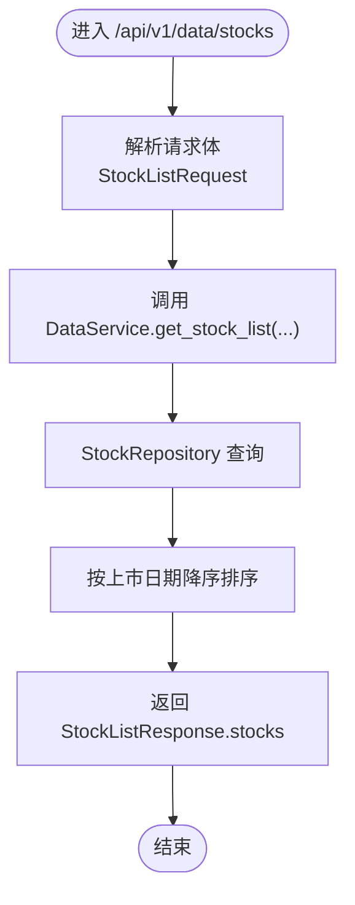

# 股票数据接口

<cite>
**本文引用的文件**
- [zquant/api/v1/data.py](file://zquant/api/v1/data.py)
- [zquant/services/data.py](file://zquant/services/data.py)
- [zquant/data/etl/tushare.py](file://zquant/data/etl/tushare.py)
- [zquant/schemas/data.py](file://zquant/schemas/data.py)
- [zquant/utils/cache.py](file://zquant/utils/cache.py)
- [web/src/services/zquant/data.ts](file://web/src/services/zquant/data.ts)
- [web/src/pages/data/stocks.tsx](file://web/src/pages/data/stocks.tsx)
- [zquant/repositories/stock_repository.py](file://zquant/repositories/stock_repository.py)
</cite>

## 目录
1. [简介](#简介)
2. [项目结构](#项目结构)
3. [核心组件](#核心组件)
4. [架构总览](#架构总览)
5. [详细组件分析](#详细组件分析)
6. [依赖关系分析](#依赖关系分析)
7. [性能考量](#性能考量)
8. [故障排查指南](#故障排查指南)
9. [结论](#结论)
10. [附录](#附录)

## 简介
本文件面向开发者与前端工程师，系统化梳理“股票数据接口”的实现，重点覆盖以下内容：
- 获取股票列表与股票基本信息的API端点与响应结构
- 服务层对Tushare API的交互流程与数据清洗策略
- 前端调用示例与错误处理策略（网络异常、数据不一致等）
- 数据缓存策略与性能优化建议

## 项目结构
围绕“股票数据接口”，涉及的关键模块包括：
- FastAPI路由层：定义REST端点与请求/响应模型
- 服务层：封装业务逻辑、查询与缓存
- ETL层：对接Tushare API，统一日志与异常处理
- 前端服务：封装HTTP调用与错误提示
- 数据仓库：数据库查询与字段映射

图表来源
- [zquant/api/v1/data.py](file://zquant/api/v1/data.py#L540-L720)
- [zquant/services/data.py](file://zquant/services/data.py#L202-L231)
- [zquant/data/etl/tushare.py](file://zquant/data/etl/tushare.py#L133-L153)
- [zquant/repositories/stock_repository.py](file://zquant/repositories/stock_repository.py#L189-L230)
- [zquant/utils/cache.py](file://zquant/utils/cache.py#L207-L247)
- [web/src/services/zquant/data.ts](file://web/src/services/zquant/data.ts#L217-L243)
- [web/src/pages/data/stocks.tsx](file://web/src/pages/data/stocks.tsx#L62-L172)

章节来源
- [zquant/api/v1/data.py](file://zquant/api/v1/data.py#L540-L720)
- [zquant/services/data.py](file://zquant/services/data.py#L202-L231)
- [zquant/data/etl/tushare.py](file://zquant/data/etl/tushare.py#L133-L153)
- [zquant/repositories/stock_repository.py](file://zquant/repositories/stock_repository.py#L189-L230)
- [zquant/utils/cache.py](file://zquant/utils/cache.py#L207-L247)
- [web/src/services/zquant/data.ts](file://web/src/services/zquant/data.ts#L217-L243)
- [web/src/pages/data/stocks.tsx](file://web/src/pages/data/stocks.tsx#L62-L172)

## 核心组件
- 路由与端点
  - GET/POST 股票列表：/api/v1/data/stocks
  - 从Tushare获取股票列表：/api/v1/data/stocks/fetch-from-api
  - 股票列表数据校验：/api/v1/data/stocks/validate
- 请求/响应模型
  - StockListRequest、StockListResponse
  - StockListFetchRequest、StockListFetchResponse
  - StockListValidateRequest、StockListValidateResponse
- 服务层方法
  - DataService.get_stock_list：数据库查询与排序
- ETL层方法
  - TushareClient.get_stock_list：调用Tushare接口并记录日志
- 缓存层
  - get_cache()：统一缓存入口（内存/Redis）

章节来源
- [zquant/api/v1/data.py](file://zquant/api/v1/data.py#L540-L720)
- [zquant/schemas/data.py](file://zquant/schemas/data.py#L648-L709)
- [zquant/services/data.py](file://zquant/services/data.py#L202-L231)
- [zquant/data/etl/tushare.py](file://zquant/data/etl/tushare.py#L133-L153)
- [zquant/utils/cache.py](file://zquant/utils/cache.py#L207-L247)

## 架构总览
下图展示“股票列表”端到端调用链路，从前端到后端再到外部数据源与缓存。

图表来源
- [web/src/pages/data/stocks.tsx](file://web/src/pages/data/stocks.tsx#L62-L172)
- [web/src/services/zquant/data.ts](file://web/src/services/zquant/data.ts#L217-L243)
- [zquant/api/v1/data.py](file://zquant/api/v1/data.py#L540-L548)
- [zquant/services/data.py](file://zquant/services/data.py#L202-L231)
- [zquant/repositories/stock_repository.py](file://zquant/repositories/stock_repository.py#L189-L230)
- [zquant/utils/cache.py](file://zquant/utils/cache.py#L207-L247)

## 详细组件分析

### 端点：/api/v1/data/stocks（获取股票列表）
- 方法与路径
  - POST /api/v1/data/stocks
- 请求体模型
  - StockListRequest：exchange、symbol、name
- 响应体模型
  - StockListResponse：stocks（字典数组）
- 控制流
  - FastAPI路由接收请求，调用DataService.get_stock_list
  - 服务层根据exchange、symbol、name过滤，返回字典列表，并按上市日期降序排序
- 分页机制
  - 当前实现未内置分页参数；若需分页，可在前端或后续扩展中增加skip/limit参数与服务层分页逻辑

图表来源
- [zquant/api/v1/data.py](file://zquant/api/v1/data.py#L540-L548)
- [zquant/services/data.py](file://zquant/services/data.py#L202-L231)
- [zquant/repositories/stock_repository.py](file://zquant/repositories/stock_repository.py#L189-L230)
- [zquant/schemas/data.py](file://zquant/schemas/data.py#L88-L100)

章节来源
- [zquant/api/v1/data.py](file://zquant/api/v1/data.py#L540-L548)
- [zquant/schemas/data.py](file://zquant/schemas/data.py#L88-L100)
- [zquant/services/data.py](file://zquant/services/data.py#L202-L231)
- [zquant/repositories/stock_repository.py](file://zquant/repositories/stock_repository.py#L189-L230)

### 端点：/api/v1/data/stocks/fetch-from-api（从Tushare获取股票列表）
- 方法与路径
  - POST /api/v1/data/stocks/fetch-from-api
- 请求体模型
  - StockListFetchRequest：exchange、list_status
- 响应体模型
  - StockListFetchResponse：success、message、request_params、data（记录数组）、total_count
- 控制流
  - 初始化TushareClient（从配置读取token）
  - 调用TushareClient.get_stock_list(exchange, list_status)
  - 将DataFrame转为字典列表返回
- 数据清洗
  - 该端点返回原始接口数据，未进行额外清洗；如需清洗，可在前端或服务层扩展

图表来源
- [zquant/api/v1/data.py](file://zquant/api/v1/data.py#L550-L596)
- [zquant/data/etl/tushare.py](file://zquant/data/etl/tushare.py#L133-L153)
- [zquant/schemas/data.py](file://zquant/schemas/data.py#L648-L664)

章节来源
- [zquant/api/v1/data.py](file://zquant/api/v1/data.py#L550-L596)
- [zquant/data/etl/tushare.py](file://zquant/data/etl/tushare.py#L133-L153)
- [zquant/schemas/data.py](file://zquant/schemas/data.py#L648-L664)

### 端点：/api/v1/data/stocks/validate（股票列表数据校验）
- 方法与路径
  - POST /api/v1/data/stocks/validate
- 请求体模型
  - StockListValidateRequest：exchange、list_status
- 响应体模型
  - StockListValidateResponse：success、message、total_db_records、total_api_records、consistent_count、difference_count、differences、consistents
- 控制流
  - 从数据库获取股票列表（DataService.get_stock_list）
  - 从Tushare获取股票列表（TushareClient.get_stock_list）
  - 按ts_code建立索引，逐项对比关键字段，输出差异与一致记录

图表来源
- [zquant/api/v1/data.py](file://zquant/api/v1/data.py#L599-L720)
- [zquant/schemas/data.py](file://zquant/schemas/data.py#L666-L709)

章节来源
- [zquant/api/v1/data.py](file://zquant/api/v1/data.py#L599-L720)
- [zquant/schemas/data.py](file://zquant/schemas/data.py#L666-L709)

### 服务层：DataService.get_stock_list
- 功能
  - 依据exchange、symbol、name查询股票列表
  - 返回字典列表，并按上市日期降序排序
- 与仓库层的关系
  - 通过StockRepository执行SQL查询，返回字段映射后的字典列表
- 与缓存层的关系
  - 当前实现未在该方法内使用缓存；若需缓存，可在方法内部引入get_cache()

图表来源
- [zquant/services/data.py](file://zquant/services/data.py#L202-L231)
- [zquant/repositories/stock_repository.py](file://zquant/repositories/stock_repository.py#L189-L230)

章节来源
- [zquant/services/data.py](file://zquant/services/data.py#L202-L231)
- [zquant/repositories/stock_repository.py](file://zquant/repositories/stock_repository.py#L189-L230)

### ETL层：TushareClient.get_stock_list
- 功能
  - 通过Tushare pro_api()调用stock_basic接口
  - 统一日志记录（成功/失败/空数据）
- 异常处理
  - 捕获异常并记录详细堆栈，抛出给上层
- 数据清洗
  - 返回DataFrame，未进行额外清洗；前端或服务层可按需处理

图表来源
- [zquant/data/etl/tushare.py](file://zquant/data/etl/tushare.py#L39-L78)
- [zquant/data/etl/tushare.py](file://zquant/data/etl/tushare.py#L133-L153)
- [zquant/data/etl/tushare.py](file://zquant/data/etl/tushare.py#L79-L132)

章节来源
- [zquant/data/etl/tushare.py](file://zquant/data/etl/tushare.py#L39-L78)
- [zquant/data/etl/tushare.py](file://zquant/data/etl/tushare.py#L79-L132)
- [zquant/data/etl/tushare.py](file://zquant/data/etl/tushare.py#L133-L153)

### 前端调用示例与错误处理
- Web服务封装
  - fetchStockListFromApi：封装POST /api/v1/data/stocks/fetch-from-api
  - validateStockList：封装POST /api/v1/data/stocks/validate
- 页面组件
  - Stocks页面：提供“从Tushare重新获取”按钮，解析editableRequestParams，调用fetchStockListFromApi，并根据success/failed提示
- 错误处理策略
  - JSON格式错误：捕获SyntaxError并提示
  - 后端错误：提取error.response.data.message并提示
  - 网络异常：提示网络错误
  - 登录过期：统一跳转登录页并提示

图表来源
- [web/src/pages/data/stocks.tsx](file://web/src/pages/data/stocks.tsx#L62-L172)
- [web/src/services/zquant/data.ts](file://web/src/services/zquant/data.ts#L217-L243)

章节来源
- [web/src/pages/data/stocks.tsx](file://web/src/pages/data/stocks.tsx#L62-L172)
- [web/src/services/zquant/data.ts](file://web/src/services/zquant/data.ts#L217-L243)

### 数据缓存策略
- 缓存入口
  - get_cache()：根据配置选择MemoryCache或RedisCacheAdapter
- 已应用缓存的方法
  - DataService.get_trading_calendar：按exchange+start_date+end_date缓存24小时
  - DataService.get_daily_data、get_daily_basic_data、get_factor_data、get_stkfactorpro_data：按ts_code/start_date/end_date缓存1小时
- 股票列表缓存建议
  - 当前DataService.get_stock_list未使用缓存；建议在方法内加入缓存键构造与LRU/Redis缓存，以降低数据库压力
  - 缓存键可包含exchange、symbol、name组合，避免重复查询

章节来源
- [zquant/utils/cache.py](file://zquant/utils/cache.py#L207-L247)
- [zquant/services/data.py](file://zquant/services/data.py#L167-L201)
- [zquant/services/data.py](file://zquant/services/data.py#L233-L407)

## 依赖关系分析
- 路由依赖服务层
  - /api/v1/data/stocks -> DataService.get_stock_list
- 服务层依赖仓库层与缓存层
  - StockRepository负责SQL查询与字段映射
  - get_cache()提供缓存能力
- ETL层依赖Tushare SDK与配置服务
  - 通过ConfigService读取加密的tushare_token
- 前端依赖Web服务封装
  - data.ts中的fetchStockListFromApi与validateStockList

图表来源
- [zquant/api/v1/data.py](file://zquant/api/v1/data.py#L540-L720)
- [zquant/services/data.py](file://zquant/services/data.py#L202-L231)
- [zquant/repositories/stock_repository.py](file://zquant/repositories/stock_repository.py#L189-L230)
- [zquant/utils/cache.py](file://zquant/utils/cache.py#L207-L247)
- [zquant/data/etl/tushare.py](file://zquant/data/etl/tushare.py#L39-L78)
- [web/src/services/zquant/data.ts](file://web/src/services/zquant/data.ts#L217-L243)
- [web/src/pages/data/stocks.tsx](file://web/src/pages/data/stocks.tsx#L62-L172)

章节来源
- [zquant/api/v1/data.py](file://zquant/api/v1/data.py#L540-L720)
- [zquant/services/data.py](file://zquant/services/data.py#L202-L231)
- [zquant/repositories/stock_repository.py](file://zquant/repositories/stock_repository.py#L189-L230)
- [zquant/utils/cache.py](file://zquant/utils/cache.py#L207-L247)
- [zquant/data/etl/tushare.py](file://zquant/data/etl/tushare.py#L39-L78)
- [web/src/services/zquant/data.ts](file://web/src/services/zquant/data.ts#L217-L243)
- [web/src/pages/data/stocks.tsx](file://web/src/pages/data/stocks.tsx#L62-L172)

## 性能考量
- 缓存命中率
  - 对高频查询（如交易日历、日线数据）已启用缓存；股票列表可借鉴此策略
- 数据库查询优化
  - StockRepository按exchange/symbol/name过滤，建议在数据库层面建立合适索引
- 前端分页
  - 当前未实现分页；建议在请求体中增加skip/limit并在服务层实现分页查询
- 并发与重试
  - ETL层未内置重试装饰器；可在fetch-from-api场景中结合装饰器实现指数退避重试

[本节为通用指导，无需具体文件来源]

## 故障排查指南
- Tushare Token未配置
  - 现象：初始化TushareClient失败
  - 处理：在系统配置中设置tushare_token并重启服务
- 网络异常
  - 现象：前端提示网络错误
  - 处理：检查网络连通性与代理设置
- 数据为空
  - 现象：返回空数据或total_count=0
  - 处理：确认exchange/list_status参数是否正确
- 登录过期
  - 现象：统一跳转登录页并提示
  - 处理：重新登录后重试

章节来源
- [zquant/data/etl/tushare.py](file://zquant/data/etl/tushare.py#L39-L78)
- [web/src/pages/data/stocks.tsx](file://web/src/pages/data/stocks.tsx#L146-L172)

## 结论
- /api/v1/data/stocks提供基于数据库的股票列表查询，支持按交易所、代码与名称过滤，并按上市日期排序
- /api/v1/data/stocks/fetch-from-api与/validate分别提供从Tushare拉取与校验的能力
- 服务层与ETL层职责清晰，具备良好的可扩展性
- 建议在股票列表查询中引入缓存与分页，以进一步提升性能与用户体验

[本节为总结，无需具体文件来源]

## 附录

### API定义与参数说明
- /api/v1/data/stocks
  - 方法：POST
  - 请求体：StockListRequest
    - exchange：交易所代码（SSE/SZSE）
    - symbol：股票代码（如000001）
    - name：股票名称（模糊匹配）
  - 响应体：StockListResponse
    - stocks：股票记录数组（包含ts_code、symbol、name、area、industry、fullname、enname、cnspell、market、exchange、curr_type、list_status、list_date、delist_date、is_hs等字段）
- /api/v1/data/stocks/fetch-from-api
  - 方法：POST
  - 请求体：StockListFetchRequest
    - exchange：交易所代码（SSE/SZSE）
    - list_status：上市状态（L/D/P）
  - 响应体：StockListFetchResponse
    - success、message、request_params、data（记录数组）、total_count
- /api/v1/data/stocks/validate
  - 方法：POST
  - 请求体：StockListValidateRequest
    - exchange、list_status
  - 响应体：StockListValidateResponse
    - success、message、total_db_records、total_api_records、consistent_count、difference_count、differences、consistents

章节来源
- [zquant/schemas/data.py](file://zquant/schemas/data.py#L88-L100)
- [zquant/schemas/data.py](file://zquant/schemas/data.py#L648-L709)
- [zquant/api/v1/data.py](file://zquant/api/v1/data.py#L540-L720)