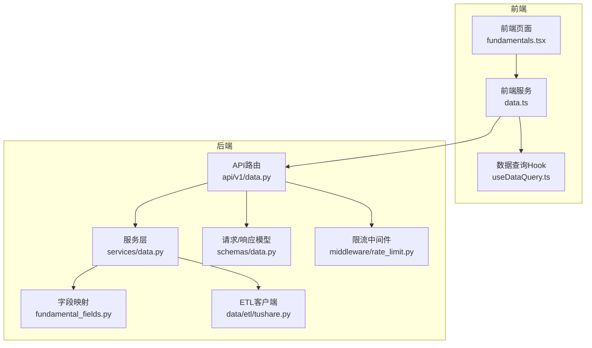
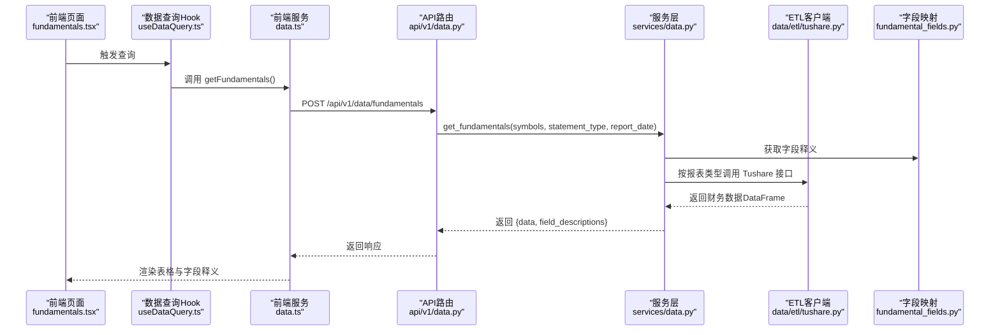
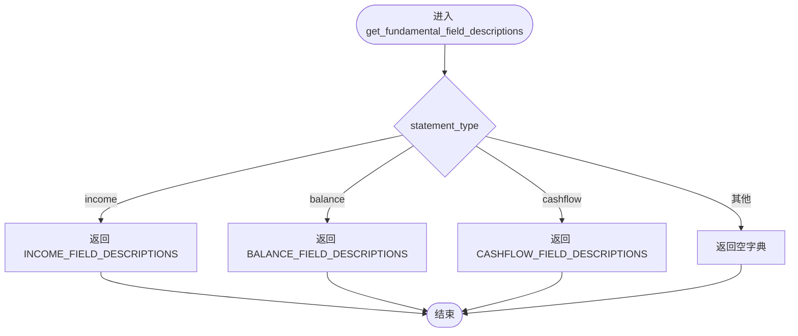
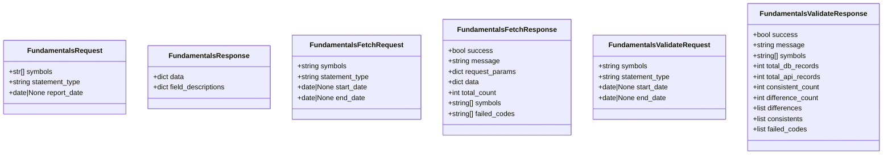
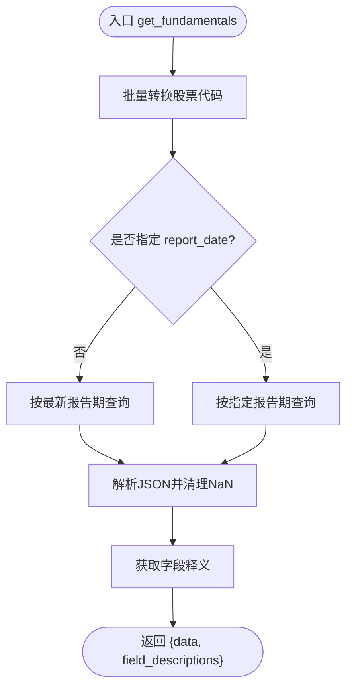
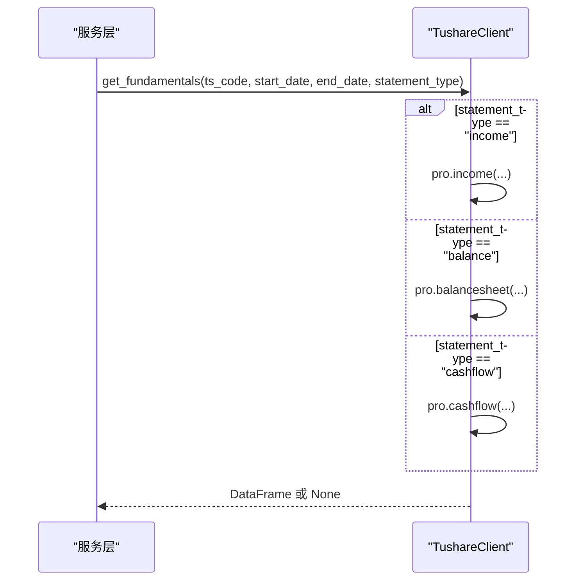
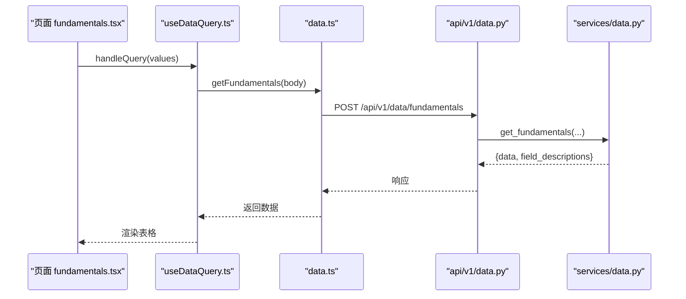
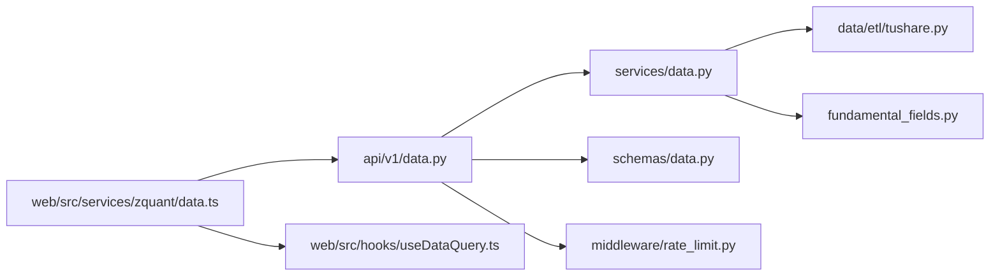

# 财务数据接口

<cite>
**本文引用的文件**
- [zquant/data/fundamental_fields.py](file://zquant/data/fundamental_fields.py)
- [zquant/api/v1/data.py](file://zquant/api/v1/data.py)
- [zquant/services/data.py](file://zquant/services/data.py)
- [zquant/schemas/data.py](file://zquant/schemas/data.py)
- [zquant/data/etl/tushare.py](file://zquant/data/etl/tushare.py)
- [web/src/pages/data/fundamentals.tsx](file://web/src/pages/data/fundamentals.tsx)
- [web/src/services/zquant/data.ts](file://web/src/services/zquant/data.ts)
- [web/src/hooks/useDataQuery.ts](file://web/src/hooks/useDataQuery.ts)
- [zquant/middleware/rate_limit.py](file://zquant/middleware/rate_limit.py)
</cite>

## 目录
1. [简介](#简介)
2. [项目结构](#项目结构)
3. [核心组件](#核心组件)
4. [架构总览](#架构总览)
5. [详细组件分析](#详细组件分析)
6. [依赖分析](#依赖分析)
7. [性能考虑](#性能考虑)
8. [故障排查指南](#故障排查指南)
9. [结论](#结论)
10. [附录](#附录)

## 简介
本文件系统性说明财务数据接口的设计与实现，覆盖利润表、资产负债表、现金流量表等核心财务指标的获取方式；解析 `/api/v1/data/fundamentals` 端点的查询参数（如股票代码、报告期、字段过滤）及其在服务层的处理逻辑；阐述 `fundamental_fields.py` 中定义的字段映射规则如何确保数据一致性；并提供实际调用示例与大数据量查询时的分批加载与超时控制机制。

## 项目结构
财务数据接口围绕“API 层 → 服务层 → 数据层”的分层架构展开：
- API 层：定义 REST 接口与请求/响应模型，负责参数校验与错误处理。
- 服务层：封装业务逻辑，包括代码转换、查询策略、缓存与分页优化。
- 数据层：ETL 客户端对接 Tushare 接口，提供财务三表（利润表、资产负债表、现金流量表）数据获取能力。
- 前端：提供交互界面与调用示例，支持分页、缓存、请求取消与超时控制。

**图表来源**
- [zquant/api/v1/data.py](file://zquant/api/v1/data.py#L94-L200)
- [zquant/services/data.py](file://zquant/services/data.py#L42-L165)
- [zquant/data/etl/tushare.py](file://zquant/data/etl/tushare.py#L275-L317)
- [zquant/data/fundamental_fields.py](file://zquant/data/fundamental_fields.py#L301-L318)
- [zquant/schemas/data.py](file://zquant/schemas/data.py#L42-L66)
- [web/src/pages/data/fundamentals.tsx](file://web/src/pages/data/fundamentals.tsx#L1-L120)
- [web/src/services/zquant/data.ts](file://web/src/services/zquant/data.ts#L27-L39)
- [web/src/hooks/useDataQuery.ts](file://web/src/hooks/useDataQuery.ts#L28-L132)
- [zquant/middleware/rate_limit.py](file://zquant/middleware/rate_limit.py#L86-L191)

**章节来源**
- [zquant/api/v1/data.py](file://zquant/api/v1/data.py#L94-L200)
- [zquant/services/data.py](file://zquant/services/data.py#L42-L165)
- [zquant/data/etl/tushare.py](file://zquant/data/etl/tushare.py#L275-L317)
- [zquant/data/fundamental_fields.py](file://zquant/data/fundamental_fields.py#L301-L318)
- [zquant/schemas/data.py](file://zquant/schemas/data.py#L42-L66)
- [web/src/pages/data/fundamentals.tsx](file://web/src/pages/data/fundamentals.tsx#L1-L120)
- [web/src/services/zquant/data.ts](file://web/src/services/zquant/data.ts#L27-L39)
- [web/src/hooks/useDataQuery.ts](file://web/src/hooks/useDataQuery.ts#L28-L132)
- [zquant/middleware/rate_limit.py](file://zquant/middleware/rate_limit.py#L86-L191)

## 核心组件
- 财务字段映射：提供利润表、资产负债表、现金流量表的字段释义，确保前后端一致理解。
- API 端点：
  - GET /api/v1/data/fundamentals：按股票代码、报表类型、报告期获取财务数据。
  - POST /api/v1/data/fundamentals/fetch-from-api：从 Tushare 接口批量拉取财务数据。
  - POST /api/v1/data/fundamentals/validate：对比数据库与接口数据的一致性。
- 服务层逻辑：统一处理股票代码转换、多格式匹配、最新报告期查询、字段释义返回。
- ETL 客户端：封装 Tushare 财务三表接口调用，统一日志与异常处理。
- 前端调用：提供表单、表格展示、请求重试、缓存与请求取消。

**章节来源**
- [zquant/data/fundamental_fields.py](file://zquant/data/fundamental_fields.py#L27-L318)
- [zquant/api/v1/data.py](file://zquant/api/v1/data.py#L94-L200)
- [zquant/services/data.py](file://zquant/services/data.py#L42-L165)
- [zquant/data/etl/tushare.py](file://zquant/data/etl/tushare.py#L275-L317)
- [web/src/pages/data/fundamentals.tsx](file://web/src/pages/data/fundamentals.tsx#L1-L120)

## 架构总览
财务数据接口的调用链路如下：

**图表来源**
- [web/src/pages/data/fundamentals.tsx](file://web/src/pages/data/fundamentals.tsx#L1-L120)
- [web/src/services/zquant/data.ts](file://web/src/services/zquant/data.ts#L27-L39)
- [web/src/hooks/useDataQuery.ts](file://web/src/hooks/useDataQuery.ts#L28-L132)
- [zquant/api/v1/data.py](file://zquant/api/v1/data.py#L94-L105)
- [zquant/services/data.py](file://zquant/services/data.py#L42-L165)
- [zquant/data/etl/tushare.py](file://zquant/data/etl/tushare.py#L275-L317)
- [zquant/data/fundamental_fields.py](file://zquant/data/fundamental_fields.py#L301-L318)

## 详细组件分析

### 组件A：字段映射与一致性保障（fundamental_fields.py）
- 功能定位：为利润表、资产负债表、现金流量表提供字段释义映射，确保前后端对字段含义一致。
- 设计要点：
  - 按报表类型返回对应字段释义字典。
  - 通过 API 响应返回字段释义，前端据此展示列标题与提示。
- 性能与一致性：
  - 字典查找 O(1)，无额外 IO。
  - 与数据库存储的字段释义保持一致，避免重复维护。

**图表来源**
- [zquant/data/fundamental_fields.py](file://zquant/data/fundamental_fields.py#L301-L318)

**章节来源**
- [zquant/data/fundamental_fields.py](file://zquant/data/fundamental_fields.py#L27-L318)

### 组件B：API 端点与请求/响应模型（api/v1/data.py, schemas/data.py）
- 端点概览：
  - GET /api/v1/data/fundamentals：按股票代码、报表类型、报告期获取财务数据。
  - POST /api/v1/data/fundamentals/fetch-from-api：从 Tushare 接口批量获取财务数据。
  - POST /api/v1/data/fundamentals/validate：对比数据库与接口数据。
- 请求/响应模型：
  - FundamentalsRequest：symbols、statement_type、report_date。
  - FundamentalsResponse：data（按股票代码组织）、field_descriptions。
  - FundamentalsFetchRequest/FundamentalsFetchResponse：批量接口获取。
  - FundamentalsValidateRequest/FundamentalsValidateResponse：数据一致性校验。

**图表来源**
- [zquant/schemas/data.py](file://zquant/schemas/data.py#L42-L66)
- [zquant/schemas/data.py](file://zquant/schemas/data.py#L603-L646)

**章节来源**
- [zquant/api/v1/data.py](file://zquant/api/v1/data.py#L94-L200)
- [zquant/schemas/data.py](file://zquant/schemas/data.py#L42-L66)
- [zquant/schemas/data.py](file://zquant/schemas/data.py#L603-L646)

### 组件C：服务层逻辑（services/data.py）
- 代码转换与多格式匹配：
  - 支持“000001.SZ”、“000001”、“000001.SH”等多种输入格式，统一转换为 TS 代码。
  - 批量查询与回退策略，确保尽可能命中真实 TS 代码。
- 查询策略：
  - 若未指定 report_date，则按最新报告期返回一条记录。
  - JSON 解析与 NaN 清理，保证序列化稳定。
- 字段释义返回：
  - 根据 statement_type 返回对应字段释义字典。
- 缓存与性能：
  - 服务层未对财务数据进行缓存，避免数据陈旧；前端可通过 Hook 与页面缓存提升体验。

**图表来源**
- [zquant/services/data.py](file://zquant/services/data.py#L42-L165)

**章节来源**
- [zquant/services/data.py](file://zquant/services/data.py#L42-L165)

### 组件D：ETL 客户端（data/etl/tushare.py）
- 财务三表接口：
  - income：利润表。
  - balancesheet：资产负债表。
  - cashflow：现金流量表。
- 统一日志与异常处理：
  - 记录调用参数、耗时、返回数据量与示例，便于调试与审计。
- 错误处理：
  - 捕获异常并统一记录，避免上游崩溃。

**图表来源**
- [zquant/data/etl/tushare.py](file://zquant/data/etl/tushare.py#L275-L317)

**章节来源**
- [zquant/data/etl/tushare.py](file://zquant/data/etl/tushare.py#L275-L317)

### 组件E：前端调用与分批加载（web/src/pages/data/fundamentals.tsx, web/src/services/zquant/data.ts, web/src/hooks/useDataQuery.ts）
- 前端服务：
  - getFundamentals：调用 POST /api/v1/data/fundamentals。
- 分批加载与超时控制：
  - useDataQuery 提供请求取消（AbortController），避免并发请求导致的资源浪费与状态错乱。
  - 页面缓存：支持从缓存恢复表单值、数据源与弹窗状态，提升用户体验。
- 实际调用示例（路径引用）：
  - 前端服务调用路径：[web/src/services/zquant/data.ts](file://web/src/services/zquant/data.ts#L27-L39)
  - 页面触发查询路径：[web/src/pages/data/fundamentals.tsx](file://web/src/pages/data/fundamentals.tsx#L307-L323)
  - 请求取消与缓存逻辑路径：[web/src/hooks/useDataQuery.ts](file://web/src/hooks/useDataQuery.ts#L28-L132)

**图表来源**
- [web/src/pages/data/fundamentals.tsx](file://web/src/pages/data/fundamentals.tsx#L307-L323)
- [web/src/services/zquant/data.ts](file://web/src/services/zquant/data.ts#L27-L39)
- [web/src/hooks/useDataQuery.ts](file://web/src/hooks/useDataQuery.ts#L28-L132)
- [zquant/api/v1/data.py](file://zquant/api/v1/data.py#L94-L105)
- [zquant/services/data.py](file://zquant/services/data.py#L42-L165)

**章节来源**
- [web/src/pages/data/fundamentals.tsx](file://web/src/pages/data/fundamentals.tsx#L1-L120)
- [web/src/services/zquant/data.ts](file://web/src/services/zquant/data.ts#L27-L39)
- [web/src/hooks/useDataQuery.ts](file://web/src/hooks/useDataQuery.ts#L28-L132)

## 依赖分析
- 组件耦合：
  - API 层依赖服务层与模型定义。
  - 服务层依赖 ETL 客户端与字段映射。
  - 前端依赖 API 与 Hook。
- 外部依赖：
  - Tushare 接口：财务三表数据来源。
  - Redis：用于交易日历等场景的缓存（财务数据未使用缓存）。
- 限流中间件：
  - 通过速率限制中间件保护后端，避免突发流量冲击。

**图表来源**
- [zquant/api/v1/data.py](file://zquant/api/v1/data.py#L94-L200)
- [zquant/services/data.py](file://zquant/services/data.py#L42-L165)
- [zquant/data/etl/tushare.py](file://zquant/data/etl/tushare.py#L275-L317)
- [zquant/data/fundamental_fields.py](file://zquant/data/fundamental_fields.py#L301-L318)
- [zquant/schemas/data.py](file://zquant/schemas/data.py#L42-L66)
- [web/src/services/zquant/data.ts](file://web/src/services/zquant/data.ts#L27-L39)
- [web/src/hooks/useDataQuery.ts](file://web/src/hooks/useDataQuery.ts#L28-L132)
- [zquant/middleware/rate_limit.py](file://zquant/middleware/rate_limit.py#L86-L191)

**章节来源**
- [zquant/api/v1/data.py](file://zquant/api/v1/data.py#L94-L200)
- [zquant/services/data.py](file://zquant/services/data.py#L42-L165)
- [zquant/data/etl/tushare.py](file://zquant/data/etl/tushare.py#L275-L317)
- [zquant/data/fundamental_fields.py](file://zquant/data/fundamental_fields.py#L301-L318)
- [zquant/schemas/data.py](file://zquant/schemas/data.py#L42-L66)
- [web/src/services/zquant/data.ts](file://web/src/services/zquant/data.ts#L27-L39)
- [web/src/hooks/useDataQuery.ts](file://web/src/hooks/useDataQuery.ts#L28-L132)
- [zquant/middleware/rate_limit.py](file://zquant/middleware/rate_limit.py#L86-L191)

## 性能考虑
- 服务层未对财务数据进行缓存，避免数据陈旧；前端通过 Hook 与页面缓存提升交互体验。
- ETL 客户端统一记录日志与耗时，便于监控与优化。
- 限流中间件保护后端，防止突发流量导致服务不可用。
- 大数据量查询建议：
  - 前端侧：利用 useDataQuery 的请求取消与分页缓存，避免重复请求。
  - 后端侧：若需扩展，可在服务层引入分页查询与缓存策略（当前财务接口未内置）。

[本节为通用指导，无需具体文件引用]

## 故障排查指南
- 常见问题与定位：
  - Tushare Token 未配置或解密失败：初始化 TushareClient 时抛出异常，需在系统配置中设置。
  - 报表类型不支持：get_fundamentals 内部对 statement_type 做了严格校验。
  - 代码格式不正确：服务层对多种格式进行转换与回退，仍失败时检查输入格式。
  - 接口调用失败：ETL 客户端统一记录错误日志，包含异常类型与耗时。
- 前端交互：
  - 请求取消：useDataQuery 使用 AbortController，避免并发请求导致的状态错乱。
  - 页面缓存：支持从缓存恢复表单值与数据源，减少重复请求。

**章节来源**
- [zquant/data/etl/tushare.py](file://zquant/data/etl/tushare.py#L39-L78)
- [zquant/data/etl/tushare.py](file://zquant/data/etl/tushare.py#L275-L317)
- [web/src/hooks/useDataQuery.ts](file://web/src/hooks/useDataQuery.ts#L28-L132)

## 结论
财务数据接口通过清晰的分层设计与严格的参数模型，实现了对利润表、资产负债表、现金流量表的统一访问。字段映射确保了前后端对指标的一致理解；ETL 客户端提供稳定的外部数据来源；前端通过 Hook 与缓存提升了交互体验与稳定性。对于大数据量查询，建议结合前端请求取消与分页缓存策略，必要时在服务层引入分页与缓存以进一步优化性能。

[本节为总结，无需具体文件引用]

## 附录

### 实际调用示例（路径引用）
- 前端服务调用路径：[web/src/services/zquant/data.ts](file://web/src/services/zquant/data.ts#L27-L39)
- 页面触发查询路径：[web/src/pages/data/fundamentals.tsx](file://web/src/pages/data/fundamentals.tsx#L307-L323)
- 请求取消与缓存逻辑路径：[web/src/hooks/useDataQuery.ts](file://web/src/hooks/useDataQuery.ts#L28-L132)

### 查询参数说明
- GET /api/v1/data/fundamentals
  - symbols：股票代码列表（支持多种格式，如 000001.SZ、000001）。
  - statement_type：报表类型，取值 income、balance、cashflow。
  - report_date：报告期，None 表示最新一期。
- POST /api/v1/data/fundamentals/fetch-from-api
  - symbols：股票代码，支持多个，用逗号分隔。
  - statement_type：报表类型，取值 income、balance、cashflow。
  - start_date、end_date：日期范围，YYYYMMDD 格式。
- POST /api/v1/data/fundamentals/validate
  - 与 fetch-from-api 类似，用于对比数据库与接口数据。

**章节来源**
- [zquant/schemas/data.py](file://zquant/schemas/data.py#L42-L66)
- [zquant/schemas/data.py](file://zquant/schemas/data.py#L603-L646)
- [zquant/api/v1/data.py](file://zquant/api/v1/data.py#L94-L200)