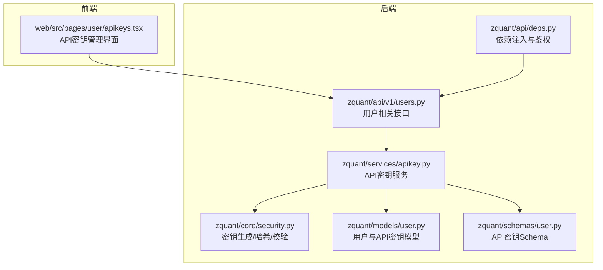
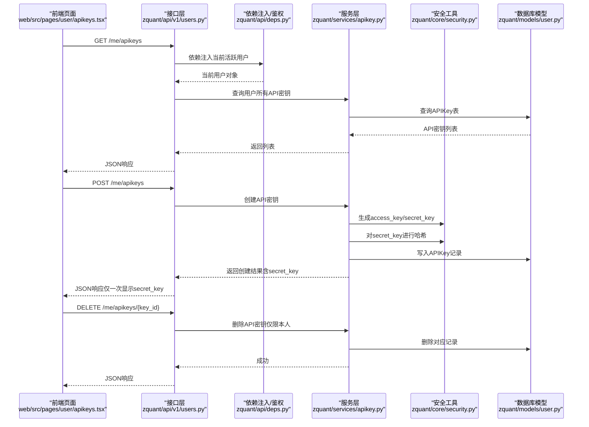
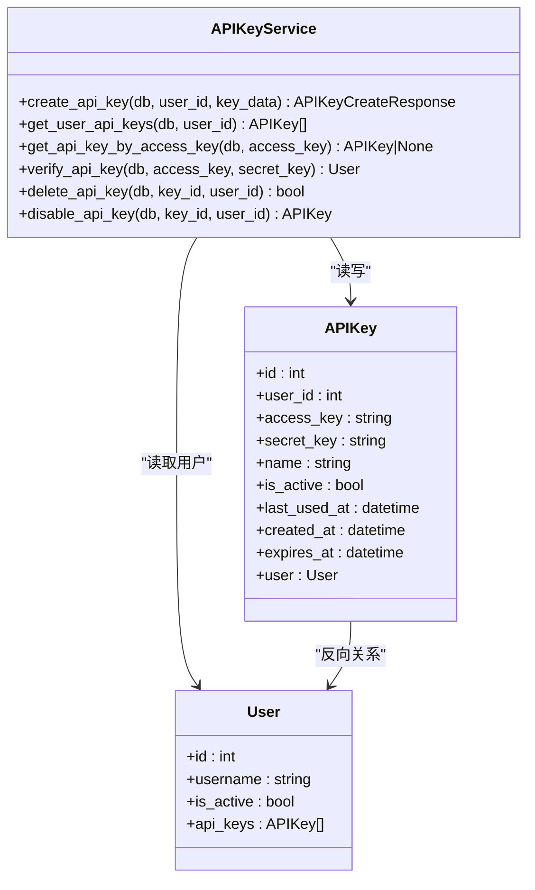
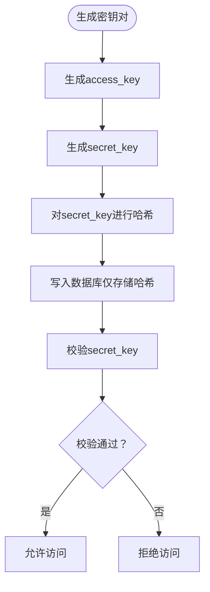
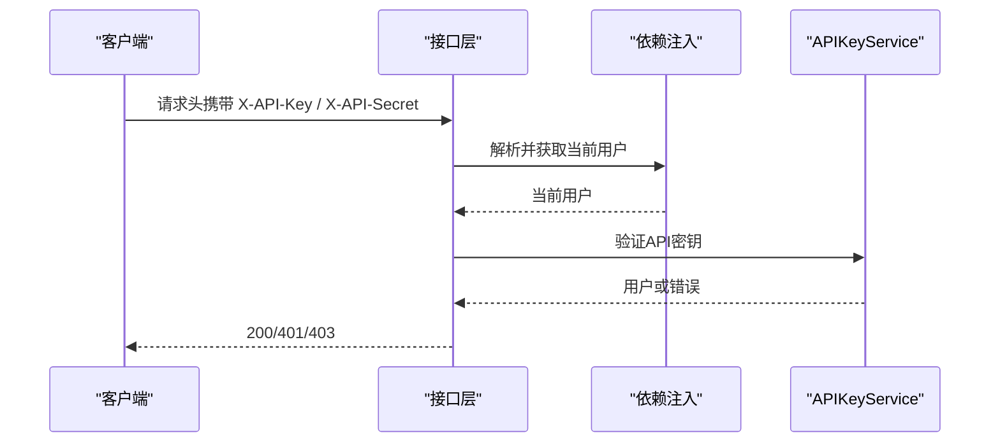
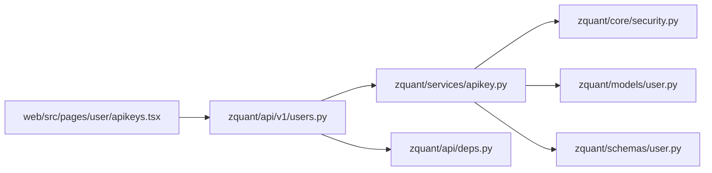

# API密钥管理子系统

<cite>
**本文引用的文件**
- [zquant/services/apikey.py](file://zquant/services/apikey.py)
- [zquant/core/security.py](file://zquant/core/security.py)
- [zquant/api/v1/users.py](file://zquant/api/v1/users.py)
- [zquant/api/deps.py](file://zquant/api/deps.py)
- [zquant/models/user.py](file://zquant/models/user.py)
- [zquant/schemas/user.py](file://zquant/schemas/user.py)
- [web/src/pages/user/apikeys.tsx](file://web/src/pages/user/apikeys.tsx)
- [zquant/tests/unittest/test_security.py](file://zquant/tests/unittest/test_security.py)
</cite>

## 目录
1. [简介](#简介)
2. [项目结构](#项目结构)
3. [核心组件](#核心组件)
4. [架构总览](#架构总览)
5. [详细组件分析](#详细组件分析)
6. [依赖分析](#依赖分析)
7. [性能考量](#性能考量)
8. [故障排查指南](#故障排查指南)
9. [结论](#结论)
10. [附录](#附录)

## 简介
本文件为zquant平台API密钥管理子系统的权威文档，覆盖API密钥的创建、查询与删除流程；阐明API密钥与用户账户的关联关系；解释access_key与secret_key的生成机制；说明当前用户查询自身API密钥列表的权限控制；并总结API密钥管理的安全考虑（含密钥存储加密与响应中secret_key的显示策略）。同时提供面向开发者的使用示例与最佳实践建议，帮助快速集成与安全落地。

## 项目结构
API密钥管理涉及后端服务层、数据库模型、接口路由、前端页面与安全工具模块，整体按“接口-服务-模型-安全”分层组织，前后端通过REST接口交互。

图表来源
- [zquant/api/v1/users.py](file://zquant/api/v1/users.py#L100-L136)
- [zquant/services/apikey.py](file://zquant/services/apikey.py#L43-L141)
- [zquant/core/security.py](file://zquant/core/security.py#L116-L133)
- [zquant/models/user.py](file://zquant/models/user.py#L96-L113)
- [zquant/schemas/user.py](file://zquant/schemas/user.py#L188-L219)
- [web/src/pages/user/apikeys.tsx](file://web/src/pages/user/apikeys.tsx#L1-L282)

章节来源
- [zquant/api/v1/users.py](file://zquant/api/v1/users.py#L100-L136)
- [zquant/services/apikey.py](file://zquant/services/apikey.py#L43-L141)
- [zquant/core/security.py](file://zquant/core/security.py#L116-L133)
- [zquant/models/user.py](file://zquant/models/user.py#L96-L113)
- [zquant/schemas/user.py](file://zquant/schemas/user.py#L188-L219)
- [web/src/pages/user/apikeys.tsx](file://web/src/pages/user/apikeys.tsx#L1-L282)

## 核心组件
- 接口层（用户API）：提供“获取我的API密钥列表”“创建API密钥”“删除API密钥”等接口，均需当前活跃用户身份。
- 服务层（APIKeyService）：封装密钥创建、查询、删除、禁用与验证逻辑。
- 安全工具（core.security）：负责生成access_key/secret_key、对secret_key进行哈希存储、校验secret_key。
- 数据模型（models.user）：定义APIKey与User的关联关系及字段。
- 前端页面（web/src/pages/user/apikeys.tsx）：提供密钥列表展示、创建弹窗、复制能力与删除确认。
- Schema（schemas.user）：定义请求/响应模型，明确创建时返回secret_key仅一次。

章节来源
- [zquant/api/v1/users.py](file://zquant/api/v1/users.py#L100-L136)
- [zquant/services/apikey.py](file://zquant/services/apikey.py#L43-L141)
- [zquant/core/security.py](file://zquant/core/security.py#L116-L133)
- [zquant/models/user.py](file://zquant/models/user.py#L96-L113)
- [zquant/schemas/user.py](file://zquant/schemas/user.py#L188-L219)
- [web/src/pages/user/apikeys.tsx](file://web/src/pages/user/apikeys.tsx#L1-L282)

## 架构总览
下图展示了从前端到后端的调用链路与关键处理节点。

图表来源
- [zquant/api/v1/users.py](file://zquant/api/v1/users.py#L100-L136)
- [zquant/api/deps.py](file://zquant/api/deps.py#L70-L93)
- [zquant/services/apikey.py](file://zquant/services/apikey.py#L43-L141)
- [zquant/core/security.py](file://zquant/core/security.py#L116-L133)
- [zquant/models/user.py](file://zquant/models/user.py#L96-L113)
- [web/src/pages/user/apikeys.tsx](file://web/src/pages/user/apikeys.tsx#L1-L282)

## 详细组件分析

### 组件A：API密钥服务（APIKeyService）
- 职责
  - 创建API密钥：生成access_key/secret_key，对secret_key进行哈希存储，写入数据库并返回创建结果（secret_key仅在创建时返回一次）。
  - 查询用户API密钥：按用户ID查询其所有密钥并按创建时间倒序。
  - 验证API密钥：根据access_key查找密钥记录，检查状态、有效期与secret_key一致性，成功则更新最后使用时间并返回用户。
  - 删除与禁用：仅允许删除/禁用当前用户的密钥，防止越权操作。
- 关键点
  - 访问密钥access_key与secret_key分别用于请求头鉴权与服务端校验。
  - secret_key仅在创建时返回，后续查询响应中不再包含，降低泄露风险。
  - 验证流程包含状态检查、过期检查与secret_key校验，确保安全性。
  - 删除与禁用均基于“用户ID+密钥ID”的双重过滤，避免误删他人密钥。

图表来源
- [zquant/services/apikey.py](file://zquant/services/apikey.py#L43-L141)
- [zquant/models/user.py](file://zquant/models/user.py#L96-L113)

章节来源
- [zquant/services/apikey.py](file://zquant/services/apikey.py#L43-L141)
- [zquant/models/user.py](file://zquant/models/user.py#L96-L113)

### 组件B：密钥生成与校验（core.security）
- 职责
  - 生成API密钥对：access_key长度固定，secret_key长度更长，均使用安全随机源生成。
  - 存储加密：对secret_key进行哈希后再入库，不存储明文。
  - 校验：验证请求中的secret_key与数据库中哈希值是否匹配。
- 关键点
  - 使用安全随机算法生成密钥，满足高熵要求。
  - 采用密码哈希库对secret_key进行不可逆哈希，符合安全最佳实践。

图表来源
- [zquant/core/security.py](file://zquant/core/security.py#L116-L133)

章节来源
- [zquant/core/security.py](file://zquant/core/security.py#L116-L133)
- [zquant/tests/unittest/test_security.py](file://zquant/tests/unittest/test_security.py#L164-L197)

### 组件C：接口与权限控制（api/v1/users.py 与 api/deps.py）
- 权限控制
  - 获取/创建/删除API密钥均依赖“当前活跃用户”依赖注入，若用户被禁用则直接拒绝。
  - 删除API密钥时，服务层会校验“密钥ID且属于当前用户”，防止越权删除。
- 接口职责
  - GET /me/apikeys：返回当前用户API密钥列表。
  - POST /me/apikeys：创建API密钥，返回创建结果（包含secret_key）。
  - DELETE /me/apikeys/{key_id}：删除指定密钥。
- 请求头鉴权
  - 通过API密钥鉴权时，需在请求头携带X-API-Key与X-API-Secret，服务端调用APIKeyService进行验证。

图表来源
- [zquant/api/v1/users.py](file://zquant/api/v1/users.py#L100-L136)
- [zquant/api/deps.py](file://zquant/api/deps.py#L70-L93)
- [zquant/services/apikey.py](file://zquant/services/apikey.py#L89-L116)

章节来源
- [zquant/api/v1/users.py](file://zquant/api/v1/users.py#L100-L136)
- [zquant/api/deps.py](file://zquant/api/deps.py#L70-L93)

### 组件D：前端页面（web/src/pages/user/apikeys.tsx）
- 功能特性
  - 列表展示：支持按ID、名称、创建时间、最后使用时间排序。
  - 创建流程：提交后返回创建结果，弹窗展示access_key与secret_key，提示仅一次显示secret_key。
  - 删除流程：删除前二次确认，删除成功后刷新列表。
  - 复制能力：支持一键复制access_key与secret_key。
- 安全提示
  - 创建完成后明确提示“请妥善保管secret_key，系统不会再次显示”。

章节来源
- [web/src/pages/user/apikeys.tsx](file://web/src/pages/user/apikeys.tsx#L1-L282)

## 依赖分析
- 组件耦合
  - 接口层依赖服务层；服务层依赖模型与安全工具；前端依赖接口层。
  - 服务层与模型层存在一对一/一对多关系（User与APIKey）。
- 外部依赖
  - 安全工具依赖密码哈希库与JWT库（用于其他场景，API密钥验证使用密码哈希）。
- 可能的循环依赖
  - 未见循环导入；接口层与服务层通过模块导入解耦。

图表来源
- [zquant/api/v1/users.py](file://zquant/api/v1/users.py#L100-L136)
- [zquant/services/apikey.py](file://zquant/services/apikey.py#L43-L141)
- [zquant/core/security.py](file://zquant/core/security.py#L116-L133)
- [zquant/models/user.py](file://zquant/models/user.py#L96-L113)
- [zquant/schemas/user.py](file://zquant/schemas/user.py#L188-L219)
- [web/src/pages/user/apikeys.tsx](file://web/src/pages/user/apikeys.tsx#L1-L282)

章节来源
- [zquant/api/v1/users.py](file://zquant/api/v1/users.py#L100-L136)
- [zquant/services/apikey.py](file://zquant/services/apikey.py#L43-L141)
- [zquant/core/security.py](file://zquant/core/security.py#L116-L133)
- [zquant/models/user.py](file://zquant/models/user.py#L96-L113)
- [zquant/schemas/user.py](file://zquant/schemas/user.py#L188-L219)
- [web/src/pages/user/apikeys.tsx](file://web/src/pages/user/apikeys.tsx#L1-L282)

## 性能考量
- 查询性能
  - APIKey表对user_id与access_key建立索引，查询与验证效率较高。
  - 列表查询按创建时间倒序，便于前端展示最新密钥。
- 写入性能
  - 创建密钥时仅一次哈希与一次写入，开销较小。
- 鉴权性能
  - 验证流程包含一次查询、状态与过期检查、哈希校验与一次更新，整体延迟可控。
- 建议
  - 合理设置密钥有效期（expires_at），到期自动失效，减少无效密钥占用。
  - 对高频查询可结合缓存策略（如最近使用时间短的密钥）提升体验。

[本节为通用指导，无需列出具体文件来源]

## 故障排查指南
- 常见错误与定位
  - 401 未授权：缺少请求头或密钥错误；检查X-API-Key与X-API-Secret是否正确。
  - 403 禁用用户：当前用户被禁用；需先恢复用户状态。
  - 404 未找到：删除或查询的密钥ID不存在或不属于当前用户。
  - 400 参数错误：创建时传参不符合Schema约束。
- 定位路径
  - 鉴权失败：查看依赖注入与APIKeyService验证逻辑。
  - 删除失败：确认服务层删除条件（user_id与key_id）。
  - 响应中无secret_key：创建成功后secret_key仅在创建响应中出现一次，后续查询不会返回。

章节来源
- [zquant/api/deps.py](file://zquant/api/deps.py#L70-L93)
- [zquant/services/apikey.py](file://zquant/services/apikey.py#L89-L141)
- [zquant/api/v1/users.py](file://zquant/api/v1/users.py#L100-L136)

## 结论
zquant的API密钥管理子系统以清晰的分层设计实现“创建-查询-删除-验证”的闭环，配合严格的权限控制与安全策略（密钥生成、secret_key哈希存储、仅一次返回secret_key），在保障易用性的同时兼顾安全性。前端提供直观的管理界面，开发者可据此快速集成并遵循最佳实践。

[本节为总结性内容，无需列出具体文件来源]

## 附录

### API密钥管理操作清单
- 创建API密钥
  - 接口：POST /me/apikeys
  - 输入：name（可选）
  - 输出：包含access_key与secret_key的创建结果（secret_key仅一次）
- 查询API密钥列表
  - 接口：GET /me/apikeys
  - 输出：当前用户的所有API密钥列表（不含secret_key）
- 删除API密钥
  - 接口：DELETE /me/apikeys/{key_id}
  - 权限：仅限密钥所属用户
- 请求头鉴权
  - 使用：X-API-Key、X-API-Secret
  - 流程：服务端验证access_key存在性、状态、有效期与secret_key哈希一致性

章节来源
- [zquant/api/v1/users.py](file://zquant/api/v1/users.py#L100-L136)
- [zquant/services/apikey.py](file://zquant/services/apikey.py#L43-L141)
- [zquant/api/deps.py](file://zquant/api/deps.py#L70-L93)

### 最佳实践
- 密钥命名
  - 为每个密钥设置有意义的name，便于识别用途与环境（如测试/生产）。
- 生命周期管理
  - 设置合理的expires_at，到期后自动失效；定期轮换密钥。
- 存储与传输
  - secret_key仅在创建时保存于本地，避免落盘或日志；传输时使用HTTPS。
- 权限最小化
  - 为不同用途创建独立密钥，限制其访问范围与权限。
- 安全审计
  - 定期检查API密钥的最后使用时间与状态，及时禁用长期未使用的密钥。

[本节为通用指导，无需列出具体文件来源]