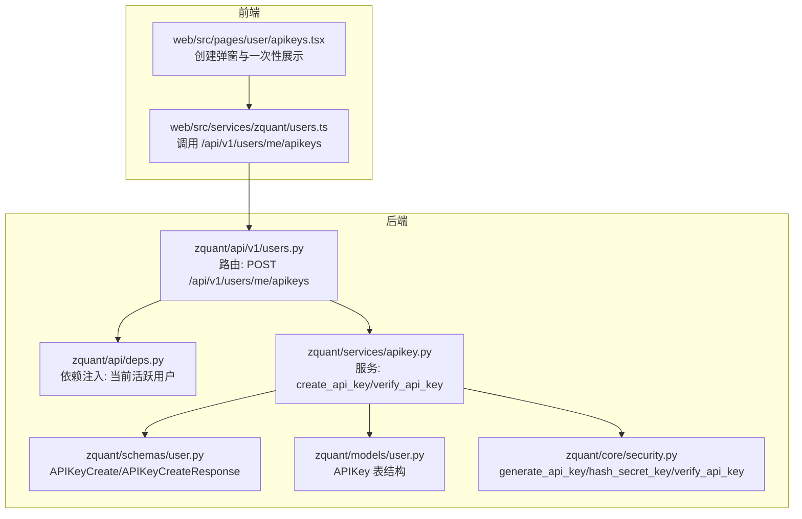
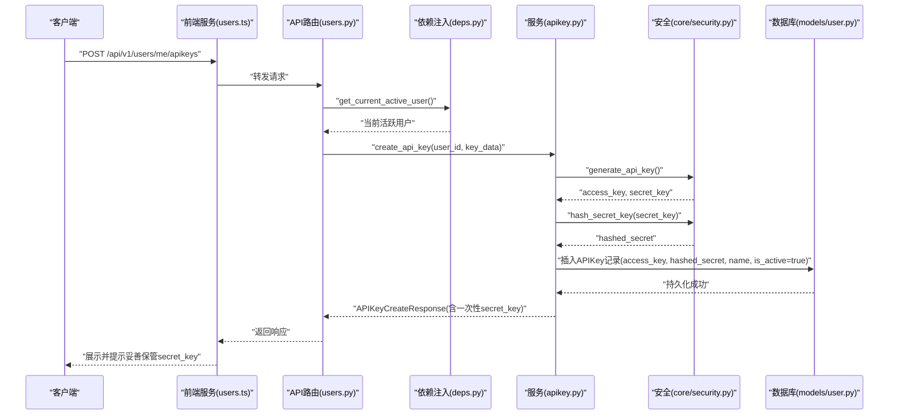
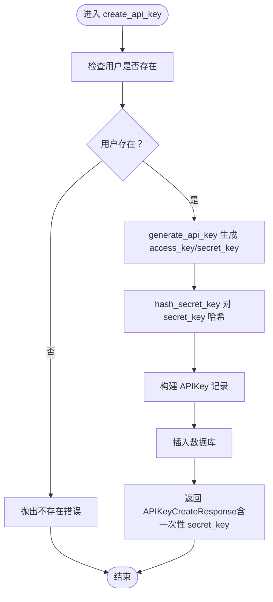
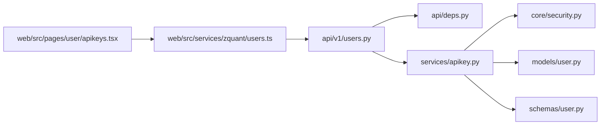

# 创建API密钥

<cite>
**本文引用的文件**
- [zquant/services/apikey.py](file://zquant/services/apikey.py)
- [zquant/api/v1/users.py](file://zquant/api/v1/users.py)
- [zquant/schemas/user.py](file://zquant/schemas/user.py)
- [zquant/models/user.py](file://zquant/models/user.py)
- [zquant/core/security.py](file://zquant/core/security.py)
- [zquant/api/deps.py](file://zquant/api/deps.py)
- [web/src/services/zquant/users.ts](file://web/src/services/zquant/users.ts)
- [web/src/pages/user/apikeys.tsx](file://web/src/pages/user/apikeys.tsx)
- [zquant/tests/unittest/test_security.py](file://zquant/tests/unittest/test_security.py)
</cite>

## 目录
1. [简介](#简介)
2. [项目结构](#项目结构)
3. [核心组件](#核心组件)
4. [架构总览](#架构总览)
5. [详细组件分析](#详细组件分析)
6. [依赖关系分析](#依赖关系分析)
7. [性能与安全考量](#性能与安全考量)
8. [故障排查指南](#故障排查指南)
9. [结论](#结论)
10. [附录](#附录)

## 简介
本文件面向开发者，系统性阐述通过 POST /api/v1/users/me/apikeys 接口创建API密钥的完整流程，重点说明：
- 请求模型 APIKeyCreate 的 name 字段作用与验证规则
- 服务层 APIKeyService.create_api_key 如何生成 access_key 和 secret_key 密钥对，以及 secret_key 的一次性返回策略
- 密钥在数据库中的存储方式，尤其是 secret_key 的哈希加密存储机制
- 完整的请求与成功响应示例路径
- 常见错误处理（如用户不存在）
- 安全最佳实践（secret_key 的妥善保管与传输安全）

## 项目结构
围绕“创建API密钥”的端到端链路涉及以下层次：
- API 层：FastAPI 路由定义与权限校验
- 服务层：业务逻辑与数据库交互
- 模型与Schema：数据库表结构与请求/响应模型
- 安全模块：密钥生成、哈希与验证
- 前端：调用后端接口并展示一次性返回的 secret_key

图表来源
- [zquant/api/v1/users.py](file://zquant/api/v1/users.py#L110-L123)
- [zquant/services/apikey.py](file://zquant/services/apikey.py#L43-L78)
- [zquant/schemas/user.py](file://zquant/schemas/user.py#L188-L219)
- [zquant/models/user.py](file://zquant/models/user.py#L96-L113)
- [zquant/core/security.py](file://zquant/core/security.py#L116-L133)
- [web/src/services/zquant/users.ts](file://web/src/services/zquant/users.ts#L61-L73)
- [web/src/pages/user/apikeys.tsx](file://web/src/pages/user/apikeys.tsx#L36-L47)

章节来源
- [zquant/api/v1/users.py](file://zquant/api/v1/users.py#L110-L123)
- [zquant/services/apikey.py](file://zquant/services/apikey.py#L43-L78)
- [zquant/schemas/user.py](file://zquant/schemas/user.py#L188-L219)
- [zquant/models/user.py](file://zquant/models/user.py#L96-L113)
- [zquant/core/security.py](file://zquant/core/security.py#L116-L133)
- [web/src/services/zquant/users.ts](file://web/src/services/zquant/users.ts#L61-L73)
- [web/src/pages/user/apikeys.tsx](file://web/src/pages/user/apikeys.tsx#L36-L47)

## 核心组件
- API 层路由：定义 POST /api/v1/users/me/apikeys，使用 get_current_active_user 依赖注入确保当前用户处于活跃状态，并调用服务层创建密钥
- 服务层：APIKeyService.create_api_key 负责生成密钥对、持久化存储、返回一次性 secret_key
- Schema：APIKeyCreate 用于接收请求参数；APIKeyCreateResponse 用于返回创建结果，包含一次性 secret_key
- Model：APIKey 表结构定义 access_key、secret_key、name、is_active、last_used_at、created_at、expires_at 等字段
- 安全模块：generate_api_key 生成 access_key/secret_key；hash_secret_key 存储时哈希；verify_api_key 验证时比对

章节来源
- [zquant/api/v1/users.py](file://zquant/api/v1/users.py#L110-L123)
- [zquant/services/apikey.py](file://zquant/services/apikey.py#L43-L78)
- [zquant/schemas/user.py](file://zquant/schemas/user.py#L188-L219)
- [zquant/models/user.py](file://zquant/models/user.py#L96-L113)
- [zquant/core/security.py](file://zquant/core/security.py#L116-L133)

## 架构总览
下图展示了从客户端发起创建请求到服务端返回一次性 secret_key 的完整序列。

图表来源
- [zquant/api/v1/users.py](file://zquant/api/v1/users.py#L110-L123)
- [zquant/api/deps.py](file://zquant/api/deps.py#L70-L93)
- [zquant/services/apikey.py](file://zquant/services/apikey.py#L43-L78)
- [zquant/core/security.py](file://zquant/core/security.py#L116-L133)
- [zquant/models/user.py](file://zquant/models/user.py#L96-L113)
- [web/src/services/zquant/users.ts](file://web/src/services/zquant/users.ts#L61-L73)

## 详细组件分析

### APIKeyCreate 请求模型与 name 字段
- 字段定义：name 为可选字符串，最大长度 100，用于标识密钥用途（例如“策略引擎”、“回测服务”等）
- 验证规则：请求模型未显式声明额外校验器，但前端表单允许为空；服务层将直接写入数据库
- 使用建议：建议在创建时填写 name，便于后续审计与管理

章节来源
- [zquant/schemas/user.py](file://zquant/schemas/user.py#L188-L193)
- [web/src/pages/user/apikeys.tsx](file://web/src/pages/user/apikeys.tsx#L270-L275)

### APIKeyService.create_api_key 生成与存储流程
- 用户存在性校验：若用户不存在，抛出“不存在”错误
- 密钥生成：调用 generate_api_key 生成 access_key 与 secret_key
- 存储准备：对 secret_key 执行 hash_secret_key 哈希后再入库
- 数据持久化：创建 APIKey 记录，字段包括 user_id、access_key、secret_key（哈希）、name、is_active、created_at、expires_at（默认空表示永不过期）
- 返回响应：返回 APIKeyCreateResponse，包含 id、access_key、secret_key（仅返回一次）、name、created_at、expires_at，并附带提示消息

图表来源
- [zquant/services/apikey.py](file://zquant/services/apikey.py#L43-L78)
- [zquant/core/security.py](file://zquant/core/security.py#L116-L133)
- [zquant/models/user.py](file://zquant/models/user.py#L96-L113)
- [zquant/schemas/user.py](file://zquant/schemas/user.py#L209-L219)

章节来源
- [zquant/services/apikey.py](file://zquant/services/apikey.py#L43-L78)
- [zquant/core/security.py](file://zquant/core/security.py#L116-L133)
- [zquant/models/user.py](file://zquant/models/user.py#L96-L113)
- [zquant/schemas/user.py](file://zquant/schemas/user.py#L209-L219)

### 数据库存储与哈希机制
- 表结构：APIKey 表包含 user_id、access_key（唯一索引）、secret_key（哈希存储）、name、is_active、last_used_at、created_at、expires_at
- 存储策略：secret_key 以哈希形式存储，不保留明文；仅在创建时返回一次明文 secret_key 给客户端
- 访问控制：APIKeyService.verify_api_key 在验证时使用 verify_api_key 对比哈希，同时检查密钥状态与有效期

章节来源
- [zquant/models/user.py](file://zquant/models/user.py#L96-L113)
- [zquant/services/apikey.py](file://zquant/services/apikey.py#L84-L116)
- [zquant/core/security.py](file://zquant/core/security.py#L125-L133)

### API 路由与依赖注入
- 路由：POST /api/v1/users/me/apikeys，返回 201，响应体为 APIKeyCreateResponse
- 权限：依赖 get_current_active_user，确保当前用户处于活跃状态
- 异常处理：捕获服务层异常并转换为 HTTP 400

章节来源
- [zquant/api/v1/users.py](file://zquant/api/v1/users.py#L110-L123)
- [zquant/api/deps.py](file://zquant/api/deps.py#L70-L93)

### 前端交互与一次性展示
- 前端通过 users.ts 调用 /api/v1/users/me/apikeys
- 创建成功后，前端弹窗展示 access_key 与 secret_key，并提示“请妥善保管 secret_key，系统不会再次显示”
- 支持复制到剪贴板

章节来源
- [web/src/services/zquant/users.ts](file://web/src/services/zquant/users.ts#L61-L73)
- [web/src/pages/user/apikeys.tsx](file://web/src/pages/user/apikeys.tsx#L36-L47)
- [web/src/pages/user/apikeys.tsx](file://web/src/pages/user/apikeys.tsx#L205-L253)

## 依赖关系分析
- API 层依赖依赖注入模块获取当前活跃用户
- 服务层依赖安全模块生成与验证密钥，并依赖模型层进行数据库读写
- Schema 层定义请求与响应模型，贯穿前后端契约
- 前端通过服务层封装的接口与后端交互

图表来源
- [zquant/api/v1/users.py](file://zquant/api/v1/users.py#L110-L123)
- [zquant/api/deps.py](file://zquant/api/deps.py#L70-L93)
- [zquant/services/apikey.py](file://zquant/services/apikey.py#L43-L78)
- [zquant/core/security.py](file://zquant/core/security.py#L116-L133)
- [zquant/models/user.py](file://zquant/models/user.py#L96-L113)
- [zquant/schemas/user.py](file://zquant/schemas/user.py#L188-L219)
- [web/src/services/zquant/users.ts](file://web/src/services/zquant/users.ts#L61-L73)
- [web/src/pages/user/apikeys.tsx](file://web/src/pages/user/apikeys.tsx#L36-L47)

章节来源
- [zquant/api/v1/users.py](file://zquant/api/v1/users.py#L110-L123)
- [zquant/api/deps.py](file://zquant/api/deps.py#L70-L93)
- [zquant/services/apikey.py](file://zquant/services/apikey.py#L43-L78)
- [zquant/core/security.py](file://zquant/core/security.py#L116-L133)
- [zquant/models/user.py](file://zquant/models/user.py#L96-L113)
- [zquant/schemas/user.py](file://zquant/schemas/user.py#L188-L219)
- [web/src/services/zquant/users.ts](file://web/src/services/zquant/users.ts#L61-L73)
- [web/src/pages/user/apikeys.tsx](file://web/src/pages/user/apikeys.tsx#L36-L47)

## 性能与安全考量
- 性能
  - 密钥生成使用 secrets.token_urlsafe，具备高熵随机性，生成成本低
  - 验证流程仅做哈希对比与少量数据库查询，开销较小
- 安全
  - secret_key 仅在创建时返回一次，避免重复暴露
  - 存储采用哈希加密，即使数据库泄露也无法还原明文
  - 建议配合 HTTPS 传输、最小权限原则与密钥轮换策略
- 可靠性
  - 服务层对用户存在性、密钥状态与有效期进行严格校验
  - 响应模型明确提示“系统不会再次显示”，提醒妥善保管

章节来源
- [zquant/core/security.py](file://zquant/core/security.py#L116-L133)
- [zquant/services/apikey.py](file://zquant/services/apikey.py#L84-L116)
- [zquant/schemas/user.py](file://zquant/schemas/user.py#L209-L219)

## 故障排查指南
- 用户不存在
  - 现象：服务层抛出“用户不存在”错误，API 层转换为 HTTP 400
  - 排查：确认当前登录用户是否处于活跃状态，或是否传入了正确的 user_id
- 密钥验证失败
  - 现象：API 密钥验证阶段抛出“无效的API密钥/被禁用/已过期/验证失败”
  - 排查：确认 X-API-Key 与 X-API-Secret 是否正确传递；检查密钥状态与有效期
- 响应中未出现 secret_key
  - 现象：后续请求不再返回 secret_key
  - 说明：设计即如此，仅在创建时返回一次

章节来源
- [zquant/services/apikey.py](file://zquant/services/apikey.py#L43-L78)
- [zquant/services/apikey.py](file://zquant/services/apikey.py#L84-L116)
- [zquant/api/deps.py](file://zquant/api/deps.py#L77-L93)

## 结论
通过 POST /api/v1/users/me/apikeys 创建 API 密钥的流程清晰、职责分明：API 层负责路由与权限，服务层负责密钥生成与持久化，安全模块负责密钥生成与哈希/验证，Schema 与 Model 明确数据契约。secret_key 仅在创建时返回一次并以哈希形式存储，符合安全最佳实践。建议在生产环境中结合 HTTPS、最小权限与密钥轮换策略，确保密钥生命周期安全可控。

## 附录

### 请求与响应示例（路径）
- 请求示例（创建API密钥）
  - 方法与路径：POST /api/v1/users/me/apikeys
  - 请求体：APIKeyCreate（name 可选）
  - 示例路径：[web/src/services/zquant/users.ts](file://web/src/services/zquant/users.ts#L61-L73)
- 成功响应示例（包含一次性 secret_key）
  - 响应体：APIKeyCreateResponse（包含 id、access_key、secret_key、name、created_at、expires_at、message）
  - 示例路径：[zquant/schemas/user.py](file://zquant/schemas/user.py#L209-L219)
- 常见错误
  - 用户不存在：服务层抛出“用户不存在”，API 层返回 HTTP 400
  - 密钥验证失败：服务层抛出认证错误，API 层返回 HTTP 401
  - 示例路径：
    - [zquant/services/apikey.py](file://zquant/services/apikey.py#L43-L78)
    - [zquant/services/apikey.py](file://zquant/services/apikey.py#L84-L116)
    - [zquant/api/deps.py](file://zquant/api/deps.py#L77-L93)

### 测试参考
- 单元测试覆盖了密钥生成、哈希与验证流程，可作为行为参考
  - 示例路径：[zquant/tests/unittest/test_security.py](file://zquant/tests/unittest/test_security.py#L164-L197)