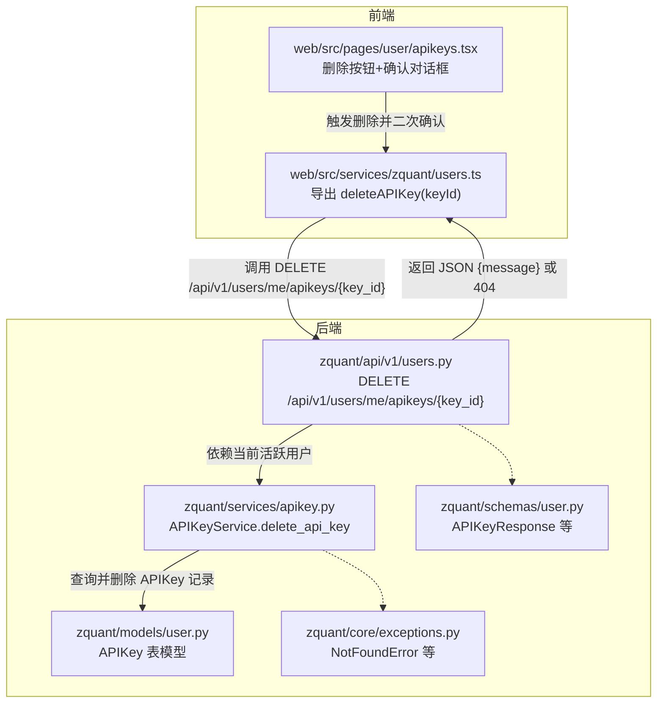
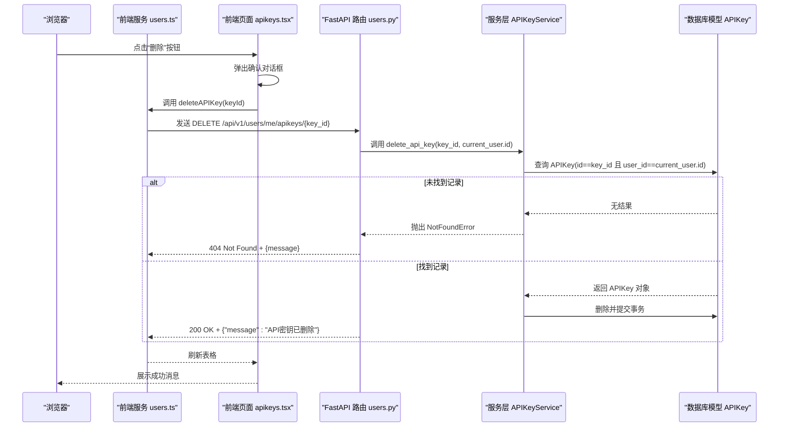
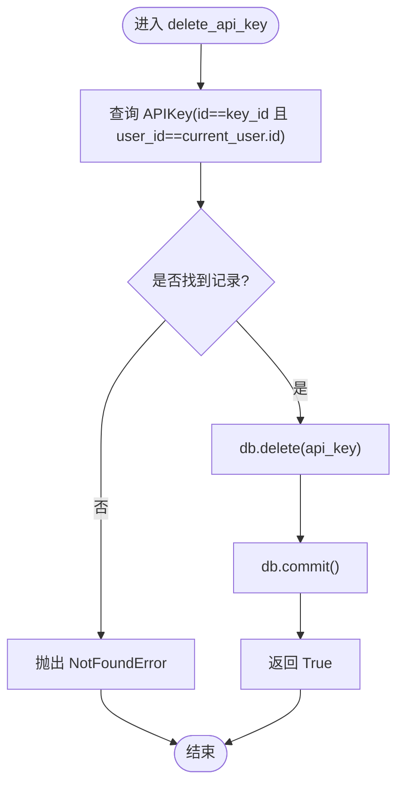
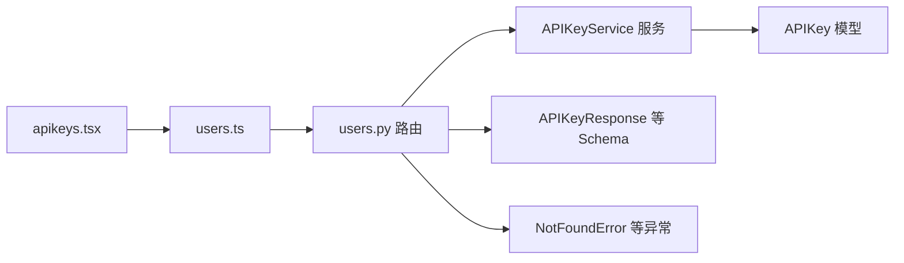

# 删除API密钥

<cite>
**本文引用的文件**
- [zquant/api/v1/users.py](file://zquant/api/v1/users.py)
- [zquant/services/apikey.py](file://zquant/services/apikey.py)
- [zquant/models/user.py](file://zquant/models/user.py)
- [zquant/schemas/user.py](file://zquant/schemas/user.py)
- [zquant/core/exceptions.py](file://zquant/core/exceptions.py)
- [web/src/services/zquant/users.ts](file://web/src/services/zquant/users.ts)
- [web/src/pages/user/apikeys.tsx](file://web/src/pages/user/apikeys.tsx)
</cite>

## 目录
1. [简介](#简介)
2. [项目结构](#项目结构)
3. [核心组件](#核心组件)
4. [架构总览](#架构总览)
5. [详细组件分析](#详细组件分析)
6. [依赖关系分析](#依赖关系分析)
7. [性能考量](#性能考量)
8. [故障排查指南](#故障排查指南)
9. [结论](#结论)
10. [附录](#附录)

## 简介
本文件面向开发者与运维人员，权威说明 zquant 中删除 API 密钥的完整流程与实现细节。重点覆盖：
- 接口路径与参数：DELETE /api/v1/users/me/apikeys/{key_id}
- 路径参数 key_id 的作用与校验
- 权限与安全：仅允许用户删除属于自己的密钥
- 服务层实现：APIKeyService.delete_api_key 的数据库删除逻辑
- 成功响应与错误处理：JSON 响应体、HTTP 状态码与常见错误场景
- 前端集成与最佳实践：调用方式、错误处理策略与防误删建议

## 项目结构
围绕“删除API密钥”功能，涉及后端路由、服务层、数据模型与前端调用四个层面，如下图所示：

图表来源
- [zquant/api/v1/users.py](file://zquant/api/v1/users.py#L125-L135)
- [zquant/services/apikey.py](file://zquant/services/apikey.py#L118-L129)
- [zquant/models/user.py](file://zquant/models/user.py#L96-L112)
- [zquant/schemas/user.py](file://zquant/schemas/user.py#L194-L218)
- [zquant/core/exceptions.py](file://zquant/core/exceptions.py#L40-L42)
- [web/src/services/zquant/users.ts](file://web/src/services/zquant/users.ts#L75-L83)
- [web/src/pages/user/apikeys.tsx](file://web/src/pages/user/apikeys.tsx#L144-L158)

章节来源
- [zquant/api/v1/users.py](file://zquant/api/v1/users.py#L101-L135)
- [zquant/services/apikey.py](file://zquant/services/apikey.py#L118-L129)
- [zquant/models/user.py](file://zquant/models/user.py#L96-L112)
- [web/src/services/zquant/users.ts](file://web/src/services/zquant/users.ts#L75-L83)
- [web/src/pages/user/apikeys.tsx](file://web/src/pages/user/apikeys.tsx#L144-L158)

## 核心组件
- 后端路由：DELETE /api/v1/users/me/apikeys/{key_id}
  - 由 get_current_active_user 依赖注入当前用户，确保用户处于激活状态
  - 调用 APIKeyService.delete_api_key 执行删除
  - 成功时返回 JSON 字典，包含 message 字段
  - 当密钥不存在时抛出 NotFoundError 并转换为 404
- 服务层：APIKeyService.delete_api_key
  - 使用 SQLAlchemy 查询 APIKey，限定条件为 id=key_id 且 user_id=current_user.id
  - 若未找到匹配记录则抛出 NotFoundError
  - 找到后删除并提交事务，返回 True
- 数据模型：APIKey
  - 包含 user_id 外键，保证密钥与用户的一对多关系
  - 删除时遵循级联删除策略（由 User.api_keys 的 cascade 定义）
- 前端服务：users.ts
  - 提供 deleteAPIKey(keyId) 方法封装 DELETE 请求
- 前端页面：apikeys.tsx
  - 使用 Popconfirm 实现二次确认
  - 删除成功后刷新表格

章节来源
- [zquant/api/v1/users.py](file://zquant/api/v1/users.py#L125-L135)
- [zquant/services/apikey.py](file://zquant/services/apikey.py#L118-L129)
- [zquant/models/user.py](file://zquant/models/user.py#L96-L112)
- [web/src/services/zquant/users.ts](file://web/src/services/zquant/users.ts#L75-L83)
- [web/src/pages/user/apikeys.tsx](file://web/src/pages/user/apikeys.tsx#L144-L158)

## 架构总览
下图展示从浏览器到数据库的端到端调用链路与关键对象交互：

图表来源
- [zquant/api/v1/users.py](file://zquant/api/v1/users.py#L125-L135)
- [zquant/services/apikey.py](file://zquant/services/apikey.py#L118-L129)
- [web/src/services/zquant/users.ts](file://web/src/services/zquant/users.ts#L75-L83)
- [web/src/pages/user/apikeys.tsx](file://web/src/pages/user/apikeys.tsx#L144-L158)

## 详细组件分析

### 后端路由：DELETE /api/v1/users/me/apikeys/{key_id}
- 路径参数 key_id：代表待删除的 API 密钥 ID
- 权限与安全：
  - 通过 get_current_active_user 依赖注入当前用户，确保用户处于激活状态
  - 服务层 delete_api_key 内部同时校验 user_id，确保只能删除自己的密钥
- 成功响应：
  - 返回 JSON 字典，包含 message 字段，内容为“API密钥已删除”
- 错误处理：
  - 当密钥不存在时，服务层抛出 NotFoundError，路由捕获并返回 404 Not Found

章节来源
- [zquant/api/v1/users.py](file://zquant/api/v1/users.py#L125-L135)

### 服务层：APIKeyService.delete_api_key
- 查询逻辑：
  - 使用 SQLAlchemy 查询 APIKey，限定条件为 id=key_id 且 user_id=current_user.id
- 删除逻辑：
  - 若未找到匹配记录，抛出 NotFoundError
  - 找到后执行删除并提交事务，返回 True
- 事务与一致性：
  - 删除后立即 commit，确保数据库状态即时生效

图表来源
- [zquant/services/apikey.py](file://zquant/services/apikey.py#L118-L129)

章节来源
- [zquant/services/apikey.py](file://zquant/services/apikey.py#L118-L129)

### 数据模型：APIKey
- 关键字段与约束：
  - user_id 外键，指向 zq_app_users.id
  - access_key 唯一索引
  - is_active 控制启用/禁用
  - created_at/updated_at 自动维护
- 级联关系：
  - User.api_keys 定义了级联删除策略，删除用户时会级联删除其所有 APIKey
  - 删除 APIKey 本身也受数据库约束保护

章节来源
- [zquant/models/user.py](file://zquant/models/user.py#L96-L112)

### 前端调用与交互
- 调用封装：
  - users.ts 提供 deleteAPIKey(keyId) 方法，封装 DELETE 请求
- 页面交互：
  - apikeys.tsx 使用 Popconfirm 在删除前进行二次确认
  - 删除成功后刷新表格并提示成功消息
  - 删除失败时展示错误详情

章节来源
- [web/src/services/zquant/users.ts](file://web/src/services/zquant/users.ts#L75-L83)
- [web/src/pages/user/apikeys.tsx](file://web/src/pages/user/apikeys.tsx#L144-L158)

## 依赖关系分析
- 组件耦合与职责分离：
  - 路由层只负责参数解析、权限校验与异常转换
  - 服务层专注业务逻辑与数据访问
  - 模型层定义数据结构与约束
  - 前端仅负责调用与交互
- 外部依赖：
  - FastAPI 作为 Web 框架
  - SQLAlchemy 作为 ORM
  - Ant Design Pro 作为前端组件库

图表来源
- [zquant/api/v1/users.py](file://zquant/api/v1/users.py#L125-L135)
- [zquant/services/apikey.py](file://zquant/services/apikey.py#L118-L129)
- [zquant/models/user.py](file://zquant/models/user.py#L96-L112)
- [zquant/schemas/user.py](file://zquant/schemas/user.py#L194-L218)
- [zquant/core/exceptions.py](file://zquant/core/exceptions.py#L40-L42)
- [web/src/services/zquant/users.ts](file://web/src/services/zquant/users.ts#L75-L83)
- [web/src/pages/user/apikeys.tsx](file://web/src/pages/user/apikeys.tsx#L144-L158)

## 性能考量
- 查询复杂度：APIKey 表对 id 与 user_id 均有索引，删除前的等值查询为 O(log n) 或 O(1)，性能稳定
- 事务开销：单条删除操作，事务提交成本低
- 前端渲染：删除成功后仅刷新表格数据，避免全量重载

## 故障排查指南
- 404 Not Found
  - 可能原因：key_id 不存在或不属于当前用户
  - 处理建议：检查 key_id 是否正确；确认当前登录用户身份；查看服务层 NotFoundError 抛出点
- 403 Forbidden
  - 可能原因：当前用户被禁用
  - 处理建议：检查 get_current_active_user 依赖注入是否生效
- 500 Internal Server Error
  - 可能原因：数据库异常、连接问题或服务层未捕获的异常
  - 处理建议：查看后端日志与异常堆栈，定位具体 SQL 或业务逻辑

章节来源
- [zquant/api/v1/users.py](file://zquant/api/v1/users.py#L70-L76)
- [zquant/services/apikey.py](file://zquant/services/apikey.py#L118-L129)
- [zquant/core/exceptions.py](file://zquant/core/exceptions.py#L40-L42)

## 结论
删除 API 密钥功能通过清晰的路由、严格的权限校验与服务层的单一职责设计，实现了“仅能删除自己的密钥”的安全约束。前端采用二次确认与及时反馈，有效降低误操作风险。整体流程简洁可靠，具备良好的扩展性与可观测性。

## 附录

### 请求与响应规范
- 请求
  - 方法：DELETE
  - 路径：/api/v1/users/me/apikeys/{key_id}
  - 路径参数：
    - key_id：整数，目标 API 密钥 ID
  - 认证：基于当前登录用户（get_current_active_user）
- 成功响应
  - 状态码：200
  - 响应体：JSON 字典，包含 message 字段
- 错误响应
  - 404 Not Found：当 key_id 不存在或不属于当前用户
  - 403 Forbidden：当前用户被禁用
  - 500 Internal Server Error：服务器内部错误

章节来源
- [zquant/api/v1/users.py](file://zquant/api/v1/users.py#L125-L135)
- [zquant/services/apikey.py](file://zquant/services/apikey.py#L118-L129)

### 开发者使用建议
- 前端实现
  - 在删除按钮处使用确认对话框，避免误删
  - 删除成功后刷新表格并提示用户
  - 删除失败时展示错误详情，便于定位问题
- 后端实现
  - 保持服务层查询条件严格（id 与 user_id 同时匹配）
  - 明确区分 NotFoundError 与其他异常，统一转换为合适的 HTTP 状态码
- 安全与合规
  - 删除操作不可逆，建议在前端增加二次确认
  - 对于生产环境，建议增加审计日志记录删除行为

章节来源
- [web/src/pages/user/apikeys.tsx](file://web/src/pages/user/apikeys.tsx#L144-L158)
- [web/src/services/zquant/users.ts](file://web/src/services/zquant/users.ts#L75-L83)
- [zquant/api/v1/users.py](file://zquant/api/v1/users.py#L125-L135)