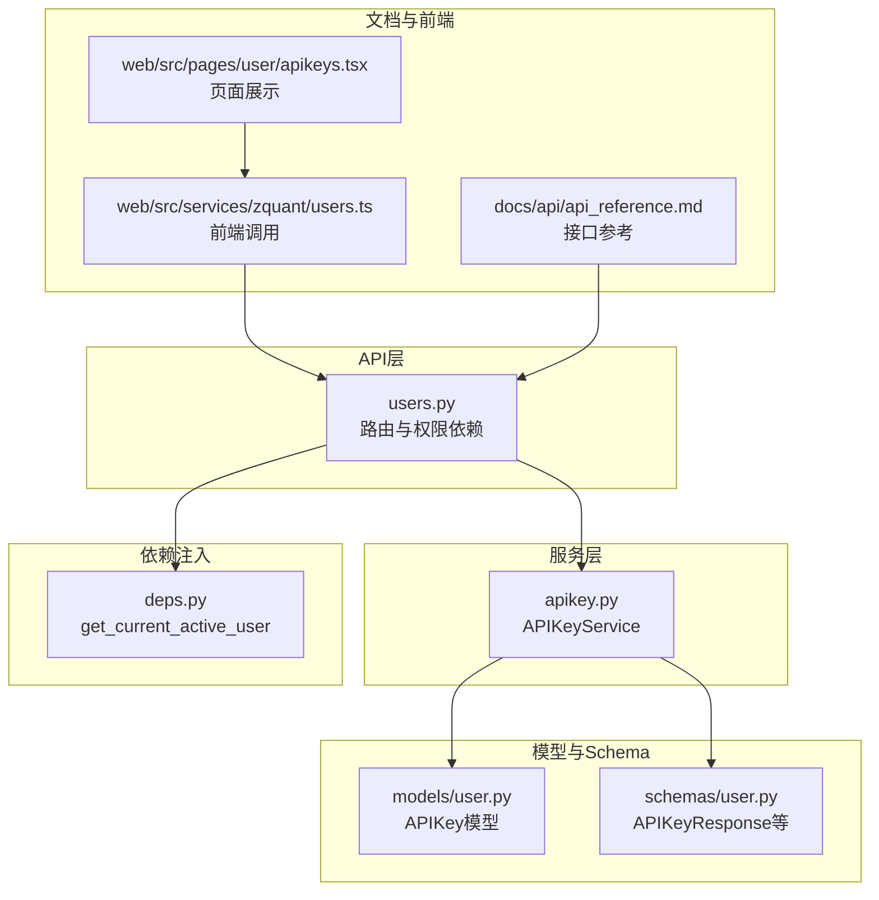
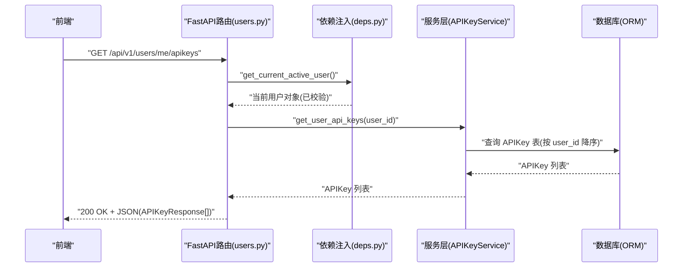
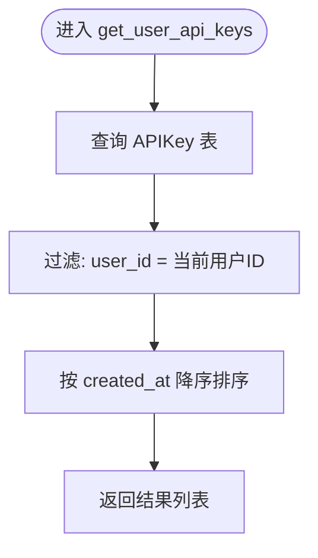
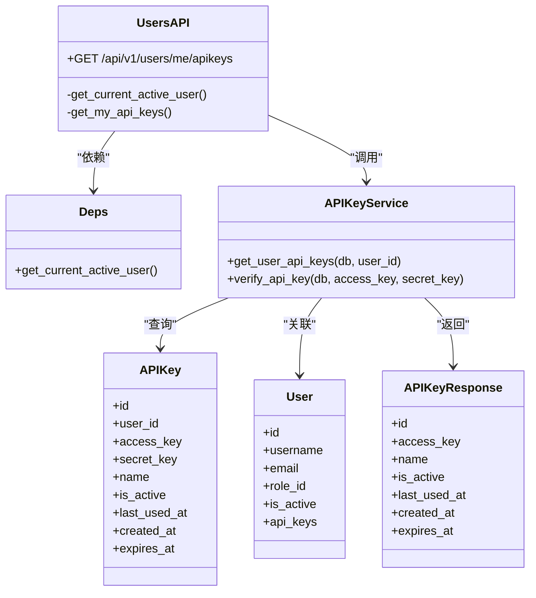

# 查询API密钥列表

<cite>
**本文引用的文件**
- [zquant/api/v1/users.py](file://zquant/api/v1/users.py)
- [zquant/services/apikey.py](file://zquant/services/apikey.py)
- [zquant/schemas/user.py](file://zquant/schemas/user.py)
- [zquant/models/user.py](file://zquant/models/user.py)
- [zquant/api/deps.py](file://zquant/api/deps.py)
- [docs/api/api_reference.md](file://docs/api/api_reference.md)
- [web/src/services/zquant/users.ts](file://web/src/services/zquant/users.ts)
- [web/src/pages/user/apikeys.tsx](file://web/src/pages/user/apikeys.tsx)
</cite>

## 目录
1. [简介](#简介)
2. [项目结构](#项目结构)
3. [核心组件](#核心组件)
4. [架构总览](#架构总览)
5. [详细组件分析](#详细组件分析)
6. [依赖关系分析](#依赖关系分析)
7. [性能考虑](#性能考虑)
8. [故障排查指南](#故障排查指南)
9. [结论](#结论)
10. [附录](#附录)

## 简介
本文件面向开发者，权威说明 zquant 中“查询当前用户API密钥列表”的完整实现与使用方式。重点覆盖：
- 接口：GET /api/v1/users/me/apikeys
- 权限控制：仅允许当前登录且处于激活状态的用户查询自己的API密钥
- 服务层实现：APIKeyService.get_user_api_keys 根据 user_id 查询数据库并按创建时间倒序
- 响应模型：APIKeyResponse 字段说明（id、access_key、name、is_active、last_used_at、created_at、expires_at）
- 安全性：接口不返回 secret_key；secret_key 仅在创建时返回一次
- 错误处理：认证失败、用户被禁用、数据库异常等场景的响应状态码与行为

## 项目结构
围绕“查询API密钥列表”功能，涉及以下模块与文件：
- API 层：路由定义与权限依赖注入
- 服务层：业务逻辑与数据库交互
- 模型与Schema：数据库表结构与响应模型
- 文档与前端：接口参考与调用示例

图表来源
- [zquant/api/v1/users.py](file://zquant/api/v1/users.py#L101-L107)
- [zquant/api/deps.py](file://zquant/api/deps.py#L70-L74)
- [zquant/services/apikey.py](file://zquant/services/apikey.py#L80-L82)
- [zquant/models/user.py](file://zquant/models/user.py#L96-L112)
- [zquant/schemas/user.py](file://zquant/schemas/user.py#L194-L207)
- [docs/api/api_reference.md](file://docs/api/api_reference.md#L127-L131)
- [web/src/services/zquant/users.ts](file://web/src/services/zquant/users.ts#L51-L59)
- [web/src/pages/user/apikeys.tsx](file://web/src/pages/user/apikeys.tsx#L161-L193)

章节来源
- [zquant/api/v1/users.py](file://zquant/api/v1/users.py#L101-L107)
- [zquant/api/deps.py](file://zquant/api/deps.py#L70-L74)
- [zquant/services/apikey.py](file://zquant/services/apikey.py#L80-L82)
- [zquant/models/user.py](file://zquant/models/user.py#L96-L112)
- [zquant/schemas/user.py](file://zquant/schemas/user.py#L194-L207)
- [docs/api/api_reference.md](file://docs/api/api_reference.md#L127-L131)
- [web/src/services/zquant/users.ts](file://web/src/services/zquant/users.ts#L51-L59)
- [web/src/pages/user/apikeys.tsx](file://web/src/pages/user/apikeys.tsx#L161-L193)

## 核心组件
- API 路由与权限
  - 路由：GET /api/v1/users/me/apikeys
  - 权限：依赖 get_current_active_user，确保当前用户已登录且处于激活状态
- 服务层
  - APIKeyService.get_user_api_keys：按 user_id 查询 APIKey 列表，并按 created_at 降序排列
- 响应模型
  - APIKeyResponse：包含 id、access_key、name、is_active、last_used_at、created_at、expires_at
  - 注意：接口不返回 secret_key；secret_key 仅在创建时返回一次
- 数据模型
  - APIKey：数据库表 zq_app_apikeys，字段与关系见 models/user.py

章节来源
- [zquant/api/v1/users.py](file://zquant/api/v1/users.py#L101-L107)
- [zquant/api/deps.py](file://zquant/api/deps.py#L70-L74)
- [zquant/services/apikey.py](file://zquant/services/apikey.py#L80-L82)
- [zquant/schemas/user.py](file://zquant/schemas/user.py#L194-L207)
- [zquant/models/user.py](file://zquant/models/user.py#L96-L112)

## 架构总览
下图展示了“查询API密钥列表”的端到端流程：前端发起请求，经依赖注入获取当前用户，调用服务层查询数据库，返回响应模型。

图表来源
- [zquant/api/v1/users.py](file://zquant/api/v1/users.py#L101-L107)
- [zquant/api/deps.py](file://zquant/api/deps.py#L70-L74)
- [zquant/services/apikey.py](file://zquant/services/apikey.py#L80-L82)

## 详细组件分析

### API 路由与权限控制
- 路由定义
  - 路径：/api/v1/users/me/apikeys
  - 方法：GET
  - 响应模型：list[APIKeyResponse]
- 权限控制
  - 依赖 get_current_active_user，若用户未登录或被禁用，将抛出相应 HTTP 异常
- 业务逻辑
  - 从依赖注入获取 current_user.id
  - 调用 APIKeyService.get_user_api_keys(db, current_user.id)
  - 直接返回查询结果

章节来源
- [zquant/api/v1/users.py](file://zquant/api/v1/users.py#L101-L107)
- [zquant/api/deps.py](file://zquant/api/deps.py#L70-L74)

### 服务层 APIKeyService.get_user_api_keys
- 功能
  - 根据 user_id 查询该用户的全部 APIKey
  - 按 created_at 降序排列
- 实现要点
  - 使用 SQLAlchemy ORM 查询 APIKey 表
  - 过滤条件：APIKey.user_id == user_id
  - 排序：order_by(APIKey.created_at.desc())
  - 返回：list[APIKey]

图表来源
- [zquant/services/apikey.py](file://zquant/services/apikey.py#L80-L82)

章节来源
- [zquant/services/apikey.py](file://zquant/services/apikey.py#L80-L82)

### 响应模型 APIKeyResponse 字段说明
- 字段清单
  - id：API密钥ID
  - access_key：访问密钥
  - name：密钥名称/描述
  - is_active：是否激活
  - last_used_at：最后使用时间
  - created_at：创建时间
  - expires_at：过期时间，None 表示永不过期
- 安全性
  - 接口不返回 secret_key
  - secret_key 仅在创建 API 密钥时返回一次

章节来源
- [zquant/schemas/user.py](file://zquant/schemas/user.py#L194-L207)
- [zquant/services/apikey.py](file://zquant/services/apikey.py#L70-L77)

### 数据模型与关系
- APIKey 模型
  - 表名：zq_app_apikeys
  - 关键字段：user_id、access_key、secret_key、name、is_active、last_used_at、created_at、expires_at
  - 关系：与 User 的 back_populates 关系
- User 模型
  - 与 APIKey 的一对多关系：User.api_keys

章节来源
- [zquant/models/user.py](file://zquant/models/user.py#L96-L112)

### 前端调用与展示
- 前端调用
  - GET /api/v1/users/me/apikeys
  - 由 web/src/services/zquant/users.ts 封装
- 页面展示
  - web/src/pages/user/apikeys.tsx 使用 ProTable 展示列表，包含 ID、名称、Access Key、状态、最后使用时间、创建时间、过期时间等列

章节来源
- [web/src/services/zquant/users.ts](file://web/src/services/zquant/users.ts#L51-L59)
- [web/src/pages/user/apikeys.tsx](file://web/src/pages/user/apikeys.tsx#L64-L142)
- [web/src/pages/user/apikeys.tsx](file://web/src/pages/user/apikeys.tsx#L161-L193)

## 依赖关系分析
- 组件耦合
  - API 层依赖依赖注入模块获取当前用户
  - API 层调用服务层 APIKeyService
  - 服务层依赖模型层 APIKey 与 User
  - 响应模型由 schemas/user.py 提供
- 外部依赖
  - FastAPI 路由与依赖注入
  - SQLAlchemy ORM
  - Pydantic 模型序列化

图表来源
- [zquant/api/v1/users.py](file://zquant/api/v1/users.py#L101-L107)
- [zquant/api/deps.py](file://zquant/api/deps.py#L70-L74)
- [zquant/services/apikey.py](file://zquant/services/apikey.py#L80-L116)
- [zquant/models/user.py](file://zquant/models/user.py#L96-L112)
- [zquant/schemas/user.py](file://zquant/schemas/user.py#L194-L207)

## 性能考虑
- 查询优化
  - APIKey.user_id 已建立索引，按 user_id 过滤具备良好性能
  - created_at 降序排序在小到中等规模数据集上开销可控
- 建议
  - 若 APIKey 数量增长较快，可在 created_at 上增加复合索引以优化排序
  - 对于大量密钥场景，建议在前端分页或后端增加分页参数（当前路由未显式分页）

[本节为通用建议，无需列出章节来源]

## 故障排查指南
- 认证失败（401 未授权）
  - 现象：返回 401
  - 可能原因：
    - 缺少 Authorization: Bearer <token> 请求头
    - Token 无效或过期
    - 数据库未初始化导致认证异常
- 用户被禁用（403 禁止）
  - 现象：返回 403
  - 可能原因：当前用户 is_active=false
- 数据库异常（503 服务不可用）
  - 现象：返回 503
  - 可能原因：数据库表不存在或未初始化
- 成功响应
  - 状态码：200
  - 返回：APIKeyResponse 数组（不包含 secret_key）

章节来源
- [zquant/api/deps.py](file://zquant/api/deps.py#L41-L68)
- [zquant/api/deps.py](file://zquant/api/deps.py#L70-L74)
- [zquant/api/deps.py](file://zquant/api/deps.py#L77-L93)
- [docs/api/api_reference.md](file://docs/api/api_reference.md#L127-L131)

## 结论
- GET /api/v1/users/me/apikeys 是一个严格的“自我查询”接口，权限控制明确，仅允许当前登录且激活的用户查询自己的 API 密钥列表
- 服务层实现简洁可靠，按创建时间倒序返回，响应模型字段清晰，安全地避免了 secret_key 的二次暴露
- 前端提供了直观的列表展示与创建/删除操作入口，便于用户管理自身密钥

[本节为总结，无需列出章节来源]

## 附录

### 接口定义与调用示例
- 接口
  - 方法：GET
  - 路径：/api/v1/users/me/apikeys
  - 请求头：Authorization: Bearer <access_token>
- 响应
  - 状态码：200
  - 内容：APIKeyResponse 数组（每个元素包含 id、access_key、name、is_active、last_used_at、created_at、expires_at）

章节来源
- [docs/api/api_reference.md](file://docs/api/api_reference.md#L127-L131)
- [web/src/services/zquant/users.ts](file://web/src/services/zquant/users.ts#L51-L59)
- [zquant/schemas/user.py](file://zquant/schemas/user.py#L194-L207)